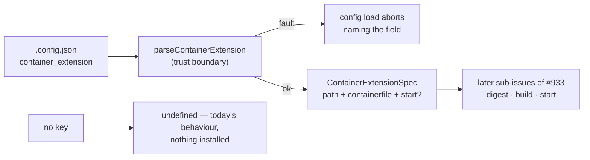

# Validate a per-deployment `container_extension` block (Issue #978)

## Summary

Adds the `.config.json` `container_extension` key naming a deployment's private
environment extension — an absolute host directory, an optional Containerfile
relative to it, and an optional service start script — and validates it
fail-loud at config load. Nothing is hashed, built or run here: this is the
trust boundary every other sub-issue of #933 builds on. An unconfigured
deployment parses exactly as it does today and installs nothing. Closes #978.

Rejections, each naming the offending field:

- a non-object block, or an unknown key inside it;
- a missing, empty, relative or `~`-prefixed `path`;
- NUL or C0/C1 control characters in `path`, `containerfile` or `start`;
- a `.` or `..` segment in `path` — `/srv/../home/operator` **is** the home
  directory once resolved, and no string comparison would see it (#850);
- a `containerfile` or `start` that is absolute or escapes `path` via `..`;
- a `path` that is the home directory, an ancestor of it, or a filesystem root;
- a home directory the environment does not state, so the containment rule
  cannot be evaluated at all.

## Evidence

Backend/CLI change with no web interface to screenshot. The evidence is the
test suite and the quality gate:

- `deno test tests/container_extension_config_test.ts` — 30 cases, the full
  rejection matrix plus the happy path, the absent-key path, the config-load
  path and the launcher reader.
- `./quality.sh` — `Result: PASSED`, `deno tests` 16 848 passed / 0 failed,
  plus lint, type check, fmt, semgrep, markdownlint and mermaid.

## Acceptance Criteria

<!-- vibe-spec-review inputs="diff+issue-body" -->

- **met** — a `.config.json` carrying a valid `container_extension` block parses
  and no longer warns about an unknown key — evidence:
  `worker/deno/lib/config_unknown_keys.ts:200`,
  `worker/deno/tests/container_extension_config_test.ts::container_extension is a known config key`
  — reviewer: met
- **met** — each malformed case fails at config load with a message naming the
  offending field — evidence:
  `worker/deno/lib/config.ts:326`,
  `worker/deno/tests/container_extension_config_test.ts::loadConfig - a malformed container_extension block fails loud`
  — reviewer: partial — reason: the reviewer found `containerfile`/`start`
  confinement was POSIX-only, so on a Windows deployment `..\..\Containerfile`
  and `D:\evil\start.ps1` were accepted; fixed in 591e8b8 by making the shared
  predicate path-style aware, covered by
  `tests/container_extension_config_test.ts::a Windows path is judged in its own spelling`
- **met** — a `.config.json` with no `container_extension` key parses exactly as
  it does today — evidence:
  `worker/deno/lib/container_extension_config.ts:216`,
  `worker/deno/tests/container_extension_config_test.ts::loadConfig - no container_extension key parses as today`
  — reviewer: met
- **met** — `./quality.sh` passes — evidence: full gate run after the final
  edit, `Result: PASSED`, exit 0 — reviewer: met
- **unrequested** — `isAtOrAbove` and `isConfinedRelativePath` moved into
  `worker/deno/lib/host_path_style.ts` and shared with
  `container_tools_config.ts` — reviewer: unrequested — reason: the issue asks
  this validator to enforce the same two rules the launcher and `container_tools`
  already enforce; copying them would let three trust boundaries drift. Both
  predicates moved without behaviour change for their existing callers and both
  gained the tests they never had.
- **unrequested** — refusing a `path` when neither `HOME` nor `USERPROFILE` is
  set — reviewer: unrequested — reason: not in the issue's enumerated list, but
  skipping an unevaluable containment rule is the silent pass
  `DESIGN-PRINCIPLES.md` forbids; the standards reviewer raised it as a
  fail-silently violation.
- **unrequested** — three pre-existing test failures repaired
  (`service_account_env_test.ts`, `setup_provider_credential_flow_test.ts`,
  `setup_prerequisites_test.ts`) — reviewer: unrequested — reason: all three
  fail on the base commit `65da20e` in this container and block the `./quality.sh`
  criterion; each is env leakage from the surrounding container, not a change in
  behaviour. Verified pre-existing by running them at the base commit.

## Standards Review

<!-- vibe-standards-review inputs="diff+CODING-STANDARDS.md" -->

- **violation** — DRY: the confinement helpers were copied from
  `container_tools_config.ts` — evidence:
  `worker/deno/lib/container_extension_config.ts:115` (pre-fix) — reason: fixed
  in this diff — `isConfinedRelativePath` now lives once in
  `lib/host_path_style.ts` and both validators call it.
- **violation** — never fail silently: an unknown home directory skipped the
  #850 containment check — evidence:
  `worker/deno/lib/container_extension_config.ts:172` (pre-fix) — reason: fixed
  in this diff — the path is refused, naming what is missing.
- **violation** — over-engineering: `ContainerExtensionSelection.specJson`
  carried verbatim JSON no caller needs yet — evidence:
  `worker/deno/lib/container_extension_config.ts:296` (pre-fix) — reason: fixed
  in this diff — the reader returns the validated declaration itself; the
  reader is kept because the issue asks for it.
- **violation** — test coverage: `isAtOrAbove` became a public export with no
  test, and the move had tightened it — evidence:
  `worker/deno/lib/host_path_style.ts:131` — reason: fixed in this diff — the
  move is now verbatim (the launcher's allowlist behaviour is byte-identical)
  and `worker/deno/tests/host_path_style_test.ts` pins both predicates.
- **violation** — DRY: `readContainerExtensionSelection` mirrors
  `readContainerToolsSelection` — evidence:
  `worker/deno/lib/container_extension_config.ts:293` — reason: stands.
  Unifying them means refactoring `container_tools_config.ts`'s public reader
  and its error text, which is not this issue's change; the shared part (the
  confinement predicate) was extracted instead.
- **violation** — a code change owes a docs change: the new operator-facing key
  is absent from `docs/CONFIGURATION.md` — evidence:
  `worker/deno/lib/config_unknown_keys.ts:200` — reason: stands. The issue puts
  documentation out of scope explicitly ("Out of scope: … and documentation —
  each is a separate sub-issue of #933").
- **clean** — Australian English throughout; fail-loud parse that never repairs
  or partially applies; tests call real functions against real temp
  `.config.json` files with no source-grepping; no existing test removed or
  silently weakened; commit messages carry the issue and the run-id trailer; no
  hidden or credential path staged; `Result<T, E>` and `@std/assert`
  conventions; JSDoc on every export.

## Test Plan

- Added `worker/deno/tests/container_extension_config_test.ts` — 30 cases:
  happy path, `containerfile` defaulting, absent `start`, absent block entry,
  non-object block, unrecognised field name, missing/empty/relative/`~` `path`,
  traversal segment,
  home directory and ancestor, filesystem root, unknown home directory, control
  characters in each field, absolute and `..`-escaping `containerfile`/`start`,
  the Windows spelling of both, `assertContainerExtension`, the known-key and
  near-miss (`container_extensions`) registration, four `loadConfig` cases and
  five `readContainerExtensionSelection` cases.
- Added `worker/deno/tests/host_path_style_test.ts` — 7 cases pinning
  `isAtOrAbove` (same directory, ancestor, sibling, non-boundary prefix, Windows
  case/separator) and `isConfinedRelativePath` (inside, absolute, `~`, NUL,
  escaping, both spellings).
- Repaired three pre-existing failures:
  `service_account_env_test.ts` (clears `VIBE_STATE_DIR`, which outranks
  `TMPDIR` among staging candidates), `setup_provider_credential_flow_test.ts`
  (clears the container's `VIBE_IMAGE_AGENT_PROVIDERS` stamp for a simulated
  host run) and `setup_prerequisites_test.ts` (asserts the outcome and the hint
  rather than which build input is read first).
