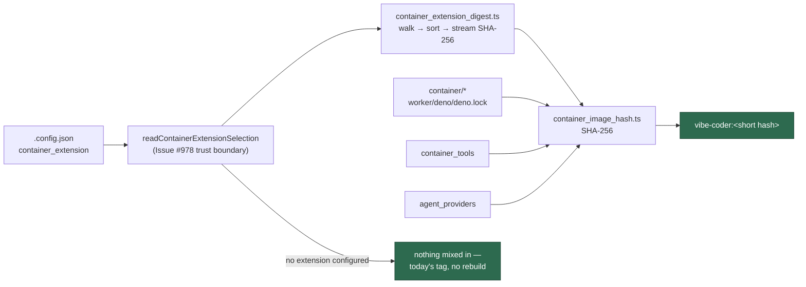

# Hash the extension definition into the container image identity (Issue #979)

## Summary

The image tag now covers a deployment's private `container_extension`
directory, so a host rebuilds when — and only when — that definition changes.
Closes #979.

- **`worker/deno/lib/container_extension_digest.ts`** (new) reduces the
  operator's extension directory to one digest. Entries are collected
  recursively, spelled with `/`, sorted **byte-wise** on their UTF-8 encoding
  and framed `<relative path>\0<mode>\0<byte length>\0<bytes>` — the same
  `FIELD_SEPARATOR` convention the enumerated inputs use — so moving bytes
  between two files, renaming one, or making `start.sh` executable each move
  the digest. Every file counts, `.sql` dumps and `Jenkinsfile`s included. File
  bytes reach the digest in 64 KiB chunks, so a multi-gigabyte dump costs one
  buffer rather than the worker's heap, and the streamed value is identical to
  a single-shot SHA-256 of the same byte stream.
- **`worker/deno/lib/container_image_hash.ts`** gains
  `CONTAINER_EXTENSION_HASH_INPUT` beside the tools and provider labels, and a
  `containerExtension?: ContainerExtensionSpec` option mixed in **last** and
  only when configured — a fleet that configures none hashes exactly the byte
  stream it hashes today, so nothing rebuilds on upgrade.
- **`worker/deno/lib/container_image_selection.ts`** reads the declaration
  alongside `container_tools` and `agent_providers`, and
  `commands/container_launch_plan.ts` passes it too, so setup's worker-image
  check, the tabletop runner and the launcher all name one tag.

Fail-loud throughout: an absent directory, a `path` that is not a directory,
an unreadable file, a symlink resolving outside the extension, a symlink cycle
or a file whose length changes mid-read all throw naming the offending entry,
rather than hashing a partial view and producing a tag that names an image
nobody built.

## Evidence

Backend/CLI only — there is no web interface to screenshot. The evidence is the
test suites and the gate:

- `deno test tests/container_extension_digest_test.ts` — 19 cases, all passing.
- `deno test tests/container_image_hash_test.ts tests/container_image_selection_test.ts`
  — 41 cases, all passing.
- `./quality.sh` — `Result: PASSED (with skipped checks)`; 16,868 Deno tests,
  lint, type check, fmt, markdownlint, semgrep and the supply-chain gate all
  green.

`@std/crypto@1.1.0` is a new dependency: Deno's built-in `crypto.subtle` has no
incremental API, so streaming a multi-gigabyte dump needs it. It is pinned with
its integrity hash in both lockfiles, pre-cached by `container/deno-seed` (so
the image still resolves offline) and recorded in
`docs/audits/dependency-inventory.md`.

## Acceptance Criteria

<!-- vibe-spec-review inputs="diff+issue-body" -->

- **met** — a deployment with no `container_extension` produces byte-for-byte
  the tag it produces today — evidence:
  `worker/deno/tests/container_image_hash_test.ts::computeContainerImageHash - no selected tools keeps the pre-#73 tag`
  (now also asserts the `containerExtension: undefined` case against
  `preIssue73Hash`) — reviewer: met
- **met** — editing any file under the extension, `.sql` dumps and
  `Jenkinsfile`s included, changes the tag; rewriting the same bytes does not —
  evidence:
  `worker/deno/tests/container_extension_digest_test.ts::editing any file, dumps included, moves the digest`
  and `::rewriting a file with the same bytes keeps the digest` — reviewer: met
- **met** — adding, deleting and renaming a file each change the tag —
  evidence:
  `worker/deno/tests/container_extension_digest_test.ts::adding, deleting and renaming each move the digest`
  — reviewer: met
- **met** — moving bytes between two extension files changes the tag —
  evidence:
  `worker/deno/tests/container_extension_digest_test.ts::moving bytes between two files moves the digest`
  — reviewer: met
- **met** — an absent directory, an unreadable file or an escaping symlink
  throws with the path named — evidence:
  `worker/deno/tests/container_extension_digest_test.ts::an absent directory throws, naming the path`,
  `::an unreadable file throws, naming the entry`,
  `::a symlink escaping the directory throws`, plus
  `container_image_hash_test.ts::an absent extension directory fails loud, naming the path`
  — reviewer: met
- **met** — `container_image_selection.ts` returns the same options the
  launcher passes, pinned by `container_image_selection_test.ts` — evidence:
  `worker/deno/tests/container_image_selection_test.ts::every caller names the image the launcher builds`
  (now a four-configuration matrix) and
  `::editing the extension moves the tag for every caller (Issue #979)` —
  reviewer: met
- **met** — `./quality.sh` passes — evidence: full gate run after the final
  edit, `Result: PASSED (with skipped checks)` — reviewer: met
- **unrequested** — the declaration's own `containerfile` and `start` are
  framed into the digest, not just the directory's bytes — evidence:
  `worker/deno/lib/container_extension_digest.ts` `extensionByteStream` —
  reason: pointing the same directory at `Containerfile.dev` builds a different
  image, so a digest of the bytes alone would hand that host a cached tag whose
  contents differ; the issue title asks for the extension *definition* in the
  identity. Kept.
- **unrequested** — three fail-loud rules beyond the three the issue names: a
  symlink cycle, a non-regular entry (device, socket, FIFO) and a file whose
  length changes mid-read — evidence:
  `worker/deno/lib/container_extension_digest.ts` `walkExtension`, `fileChunks`
  — reason: each is a way the walk would otherwise hang or hash a view that
  does not match the framing it already emitted. Kept.
- **unrequested** — `@std/crypto@1.1.0` plus its `container/deno-seed` and
  dependency-inventory entries — evidence: `worker/deno/deno.json`,
  `container/deno-seed/seed.ts`, `docs/audits/dependency-inventory.md` —
  reason: the issue's "read file bytes into the digest incrementally"
  requirement has no built-in implementation in Deno. Kept.
- **unrequested** — `container-image-hash` reports `container_extension` in its
  `inputs` list and a `containerExtension` field — evidence:
  `worker/deno/commands/container_image_hash.ts` — reason: that list documents
  what the printed tag covers, and omitting the extension would make it a lie
  once the extension is hashed. Kept.
- **unrequested** — `spec.path` tolerates a trailing separator, and
  `docs/CONTAINER.md` gains a table row, a prose section and a Mermaid node —
  evidence: `container_extension_digest.ts` `trimDirectory`,
  `docs/CONTAINER.md` — reason: the standards require the docs sweep with the
  code; the trim mirrors `trimRoot` in `container_image_selection.ts`. Kept.

## Standards Review

<!-- vibe-standards-review inputs="diff+CODING-STANDARDS.md" -->

- **violation** — a confined directory symlink (`latest -> v3`) was rejected as
  a cycle, so a legitimate extension tree could not be hashed at all, and the
  message misdiagnosed it — evidence:
  `worker/deno/lib/container_extension_digest.ts:226` (pre-fix) — reason: fixed
  in this diff. The walk now tracks the **current chain** rather than every
  directory seen, so only a link back up the chain throws; an alias is hashed
  under both paths, as the build would copy it. Covered by
  `::a confined directory symlink is an alias, not a loop`.
- **violation** — `compareUtf8` was never exercised: every fixture filename was
  ASCII, where UTF-8 byte order and the default UTF-16 comparator agree —
  evidence: `worker/deno/tests/container_extension_digest_test.ts` (pre-fix) —
  reason: fixed. `::entries sort by UTF-8 bytes, not UTF-16 units` pins the
  order for `U+FF5E` (`EF BD 9E`) against `U+1F600` (`F0 9F 98 80`), whose
  UTF-16 and UTF-8 orders are opposite.
- **violation** — required edge cases missing: an empty extension directory and
  a zero-byte file — evidence:
  `worker/deno/tests/container_extension_digest_test.ts` (pre-fix) — reason:
  fixed by `::an empty directory and a zero-byte file are hashed, not skipped`.
- **violation** — malformed doc comment `{@link file://./container_image_hash.ts}`,
  a link form used nowhere else in `worker/deno/lib/` and one that does not
  resolve — evidence:
  `worker/deno/lib/container_extension_digest.ts:65` (pre-fix) — reason: fixed;
  it is now a plain module mention.
- **clean** — the areas the reviewer checked and found compliant: Australian
  English across all added lines (no `color`/`behavior`/`organiz`/`normaliz`
  hits); fail-loud with the offending entry named on every error path and no
  caught-and-ignored error; backwards compatibility (the extension is mixed in
  last and only when configured, pinned by the no-extension regression
  assertion); test quality (no source-grepping, no line-count assertions, no
  wall-clock thresholds — every case builds a real temp tree and asserts on the
  returned digest, and the root-can-read-`0o000` case skips honestly rather
  than faking); unit-test speed budget (three touched files, ~1s wall); the
  module ↔ test-file pairing; dependency pinning with integrity in both
  lockfiles plus the seed and inventory updates; commit safety (no hidden path
  staged, fixtures confined to `Deno.makeTempDir`); the commit message's issue
  reference and `Vibe-Coder-Run-Id` trailer; docs updated alongside the code;
  and `deno fmt`, `deno lint`, `deno check` and `markdownlint-cli2` all clean.

## Test Plan

Added `worker/deno/tests/container_extension_digest_test.ts` — 19 cases:
stability, path-independence, trailing-separator equivalence, per-file edits
(dump and `Jenkinsfile` among them), same-bytes rewrite, add/delete/rename,
byte-move between two files, the executable bit, the declared
`containerfile`/`start`, the larger-than-buffer streaming case against a
single-shot digest, UTF-8 sort order, empty directory and zero-byte file, and
six fail-loud cases (absent directory, non-directory path, unreadable file,
escaping symlink, confined alias, cycle).

Extended `worker/deno/tests/container_image_hash_test.ts` — the no-extension
regression assertion, a configured extension moving the tag and moving it again
when a dump is edited, composition with the tools and provider selections, an
absent directory failing loud, and two command cases (the extension in the
reported `inputs`, and a malformed declaration failing the command by field).

Extended `worker/deno/tests/container_image_selection_test.ts` — a fourth
configuration in the caller-agreement and tag-distinctness matrices, an
assertion that an unconfigured checkout reports no extension, and a new case
proving an edited extension moves the tag for the launcher, setup's check and
the tabletop runner alike.
