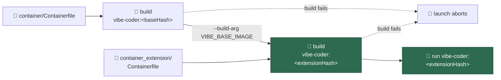

# Build the operator's private Containerfile layer FROM the standard image

## Summary

A deployment that declares a `container_extension` (#978) now gets **two**
builds instead of one: the standard `vibe-coder:<baseHash>` exactly as every
host builds it today, then the operator's own Containerfile built `FROM` it as
`vibe-coder:<extensionHash>` (#979's digest is in that tag). The container runs
the layered tag. With no extension configured the emitted plan is byte-for-byte
what it was, so the public Vibe Coder is unchanged. Closes #980.

- `worker/deno/lib/container_extension_build.ts` (new) owns the second argument
  vector and the `FROM ${VIBE_BASE_IMAGE}` contract. A Containerfile that does
  not derive from the standard image is refused while the **plan** is built —
  before any build runs — naming the file.
- `worker/deno/lib/container_launch.ts` takes the validated declaration, emits
  `extensionBuildArgs` after `buildArgs`, points the run, the presence check and
  the volume init at the layered tag, and runs the new argument list through the
  same `assertRunArgumentsContained` the run and init lists already use.
- `renderContainerLaunchPlan` / `parseContainerLaunchPlanText` carry the second
  build as `extension-build=`, and it is added to `LAUNCH_PLAN_KEYS`, so the
  parity test fails any launcher that ignores it.
- `run.sh` and `run.ps1` run the layer after the standard build succeeds, inside
  the same "image absent" block, and abort the launch with the build's own exit
  status and its log as escalation evidence.

**Also repairs the milestone branch.** The `efdb799` merge (sync main into
`milestone/933-…`) dropped four declarations #978/#979 had added while keeping
every use of them, so the branch did not type check at all
(`parseContainerExtension` imported nowhere but called in `lib/config.ts:332`,
`containerExtension` referenced with no binding in the launch-plan command,
`ContainerExtensionSpec` unimported in `container_image_selection.ts`,
`ConfigFile.container_extension` and the `KNOWN_CONFIG_KEYS` entry gone, and
`container_image_selection_test.ts` left referencing a `CONFIGURATIONS` constant
that no longer existed). Restoring them was a precondition for any gate run.

## Evidence

Backend/CLI change — no web interface to screenshot. The evidence is the test
suites below plus `./quality.sh`, run in the foreground after the final edit:

```text
deno tests                     PASSED
deno lint                      PASSED
deno type check                PASSED
deno fmt                       PASSED
semgrep                        PASSED
Result: PASSED (with skipped checks)
```



**Known interaction, filed as stSoftwareAU/VibeCoder#1059.** The per-launch
image prune keeps exactly one reference, which is now the extension tag, so the
base tag it has just built is untagged on the same launch. Harmless — the
layered image is self-contained and a rebuild re-creates the base tag from the
builder cache the prune leaves alone — but it needs the prune to be told both
references, which is a change to another module and its plan key. Out of scope
here; the follow-up carries the analysis.

## Acceptance Criteria

<!-- vibe-spec-review inputs="diff+issue-body" -->

- **met** — With no `container_extension`, the emitted plan is identical to
  today's, including a single build and a single tag — evidence:
  `worker/deno/tests/container_launch_test.ts::buildContainerLaunchPlan - no
  extension leaves the plan exactly as it was (Issue #980)` and
  `worker/deno/tests/run_sh_launcher_test.ts::run.sh - no extension leaves the
  launch exactly as it was (Issue #980)` — reviewer: met
- **met** — Two builds in order, the run uses the extension tag, and
  `--build-arg VIBE_BASE_IMAGE` names the base tag exactly — evidence:
  `worker/deno/tests/container_launch_test.ts::buildContainerLaunchPlan - the
  extension is a second build, after the standard one (Issue #980)` and
  `run_sh_launcher_test.ts::run.sh - builds the operator's private layer after
  the standard image (Issue #980)` — reviewer: met
- **met** — A Containerfile not deriving `FROM ${VIBE_BASE_IMAGE}` is refused
  with the file named, before any build runs — evidence:
  `worker/deno/lib/container_extension_build.ts::assertExtensionLayersOnBaseImage`
  and `run_sh_launcher_test.ts::run.sh - a Containerfile that is not FROM the
  standard image builds nothing (Issue #980)`, which asserts zero builds ran —
  reviewer: partial — reason: the reviewer found the first-`FROM`-only rule
  evadable by stage ordering (`FROM ${VIBE_BASE_IMAGE} AS unused` then `FROM
  ubuntu:24.04`, which a `--target`-less build ships); fixed in `d161a56`, which
  judges the last stage too, with a covering case
- **met** — Both launchers run both builds and abort the launch when either
  fails — evidence: `run.sh:625`, `run.ps1:613`, and the launcher cases for a
  failed first build (`buildCount == 1`, no second build, nothing launched) and
  a failed second (exit 9, nothing launched) in both suites — reviewer: met
- **met** — `./quality.sh` passes — evidence: the gate output above, run in the
  foreground after the final edit — reviewer: met
- **unrequested** — `docs/CONTAINER.md` gains the two-build flow and a diagram —
  reviewer: unrequested — reason: the issue defers documentation to a later #933
  sub-issue, but that page already described `container_extension` as one image;
  leaving it saying so would have made it wrong, so the addition is confined to
  correcting what is already there
- **unrequested** — the plan's `image`, `imageInspectArgs` and `initArgs` name
  the layered tag — reviewer: unrequested — reason: the issue asks that the run
  use it, and the presence check must name the same image or every launch would
  rebuild, while the volume init must run the image the worker will
- **unrequested** — the launch-plan command reads the extension Containerfile
  and reports an unreadable one — reviewer: unrequested — reason: the contract
  check needs the text, and the plan builder is deliberately free of filesystem
  access; the preflight the issue defers (existence of `start`, of the directory)
  is not added
- **unrequested** — the `efdb799` merge repair described above — reviewer:
  unrequested — reason: traceable to #978/#979, not #980, but the branch did not
  type check without it, so no gate could pass
- **unrequested** — `vibe_env_registry.ts` and `config_unknown_keys.ts` entries —
  reviewer: unrequested — reason: both are existing gates the change trips, not
  new behaviour: the registry test fails an undeclared `VIBE_*` wire name, and
  `container_extension_config_test.ts` already asserted the known-key entry the
  merge dropped

## Standards Review

<!-- vibe-standards-review inputs="diff+CODING-STANDARDS.md" -->

- **violation** — no `docs/archive/pr-summaries/pr-summary-980.md`, which every
  sibling sub-issue ships — evidence: `docs/archive/pr-summaries/` — reason:
  this file; it did not exist when the reviewer read the diff
- **violation** — the `FROM` parser's edge cases were untested, and two of them
  refused a legal file: `FROM --platform=$BUILDPLATFORM ${VIBE_BASE_IMAGE}`, and
  a `\`-wrapped `ARG` read as a second instruction — evidence:
  `worker/deno/lib/container_extension_build.ts:98` (as reviewed) — reason:
  fixed in `d161a56`; flags are skipped, continuations joined, and the platform
  flag, the wrapped instruction and lower-case keywords each have a case
- **violation** — DRY: the PowerShell extension build repeated
  `Invoke-ImageBuild`'s capture/log/report sequence rather than reusing it —
  evidence: `run.ps1:621` (as reviewed) — reason: fixed in `d161a56`; the helper
  takes an `-ArgumentList` defaulting to the standard build
- **clean** — Australian English throughout; fail-loud on every new path (the
  refusal throws before an argument list exists, both launchers propagate the
  build's own exit status and set the evidence log, `PIPESTATUS[0]` is read
  rather than `tee`'s); decisions in Deno with the shells as orchestration;
  every test drives real functions or the real launchers, none greps source; no
  existing test removed or weakened; no hidden or credential-shaped path staged;
  both commits carry the issue and the run-id trailer; the new logic went into
  its own module rather than growing `container_launch.ts`; the extension build
  passes no host mount, no published port and no forbidden flag, and its context
  is the extension directory alone

## Test Plan

- `worker/deno/tests/container_extension_build_test.ts` (new, 15 cases) — the
  `FROM` contract (accepted spellings, a foreign base, an undeclared `ARG`, no
  `FROM` at all, a non-`ARG` preamble instruction, first-stage and last-stage
  judgement, a legitimate helper stage, a platform flag, a wrapped instruction,
  case-insensitive keywords) and the exact argument vector, including the
  trailing-separator trim, the `start` build arg and Windows separators.
- `worker/deno/tests/container_launch_test.ts` — nine cases: the no-extension
  plan is unchanged and emits no extension key; the two builds and their exact
  vectors; the run, inspect and init all name the layered tag; the `start` build
  arg; the refusal naming the file; no host mount, port or forbidden flag in the
  extension build; an unframeable extension tag; the render/parse round trip and
  its ordering; Windows separators.
- `worker/deno/tests/container_containment_test.ts` — two cases: the extension
  build carries no host mount, no published port, no forbidden flag and no host
  namespace request, and its only host paths are the Containerfile and the
  context; and the layered tag still runs `--read-only` with every scratch tmpfs,
  on the base plan's unchanged mount set.
- `worker/deno/tests/run_sh_launcher_test.ts` / `run_ps1_launcher_test.ts` —
  both builds in plan order with the right tags and build args and the layered
  tag running; a failed first build never reaching the second; a failed second
  build failing the launch and starting nothing; and (bash) a refused
  Containerfile building nothing at all. The PowerShell cases skip visibly
  without `pwsh`, as that suite already does.
- `worker/deno/tests/fixtures/launcher_harness.ts` — records each build's own
  argument list (`build-<n>.args`) and grows a shared
  `declareContainerExtension` helper, so both launchers are exercised against
  the same deployment.
- `worker/deno/tests/container_image_selection_test.ts` — restored to the
  four-configuration form #979 shipped, plus its "editing the extension moves
  the tag" case.
