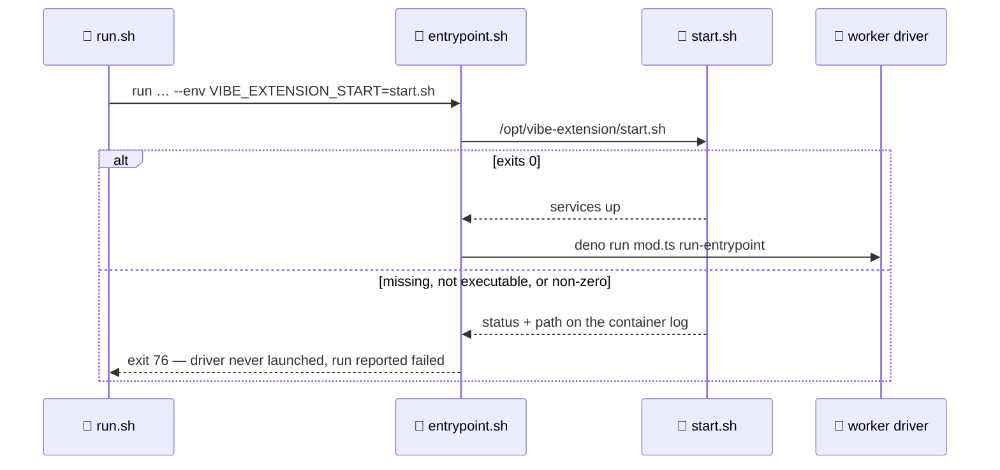

# Run the extension's start script at sandbox start (Issue #981)

## Summary

A deployment's private extension (Issue #978) may declare a `start` script, and
its services — a Postgres server, a Jenkins — have to be **running** before the
agent starts work. This adds the framework's half of that: one supervision
contract, with a loud failure.

- `container/entrypoint.sh` runs `/opt/vibe-extension/<start>` when
  `VIBE_EXTENSION_START` is set — after the writable-path policy and the
  deployer's tool PATH, before the `deno run` driver, as the container's own
  unprivileged worker account. The script's stdout and stderr are inherited, so
  a Postgres that refused to come up is diagnosable from the container log.
- Every way the start can fail *and return* exits **76** without launching the
  driver: absent from the image, not executable, or a non-zero exit — the last
  naming the script's own status. A start that hangs is deliberately not
  time-bounded (that is the health-checking this slice puts out of scope); the
  entrypoint comment and `docs/CONTAINER.md` say so rather than claiming a
  completeness the block does not have.
- The launch plan passes `--env VIBE_EXTENSION_START=<start>` when — and only
  when — the block declares one, so the entrypoint's block is inert for the
  public Vibe Coder and for a toolchain-only extension.
- The abort is recorded as a **failed run**: 76 is the framework's own status,
  colliding with neither the deliberate quota pause (75), the wedged-container
  status (87) nor the runtime's container-start range (125–127), so the streak
  grows, the backoff applies and the escalation names it instead of sending the
  reader to the container runtime.

Closes #981.

## Evidence

Backend/CLI change with no web interface to screenshot. The evidence is the
tests below, which run the **real** `container/entrypoint.sh` against a stub
driver and a fixture extension prefix, and the full quality gate.

`./quality.sh < /dev/null` — `Result: PASSED (with skipped checks)`; every
check PASSED, the three SKIPPED ones (config integration, pages-liquid, mermaid
built output) are the host's usual skips.

## Acceptance Criteria

<!-- vibe-spec-review inputs="diff+issue-body" -->

- **met** — With no extension configured, the entrypoint behaves exactly as it
  does today — evidence:
  `worker/deno/tests/container_entrypoint_test.ts::entrypoint - with no extension configured the launch is unchanged (Issue #981)`
  — reviewer: met
- **met** — With `start` declared, the script runs before the driver, and the
  driver starts only after it exits zero — evidence:
  `worker/deno/tests/container_entrypoint_test.ts::entrypoint - runs the declared start script before the driver (Issue #981)`
  (the order is asserted through one shared file, not merely "both happened") —
  reviewer: met
- **met** — A non-zero exit aborts the start, names the script and its exit
  status in the log, never launches the driver, and the run is reported failed
  — evidence:
  `worker/deno/tests/container_entrypoint_test.ts::entrypoint - a non-zero start aborts the launch and never runs the driver (Issue #981)`
  plus
  `worker/deno/tests/container_restart_backoff_test.ts::recordContainerRestartOutcome - an aborted extension start is a FAILED RUN, not an idle launch (Issue #981)`
  — reviewer: met
- **met** — A declared `start` that is missing or non-executable inside the
  image fails loudly naming the path — evidence:
  `worker/deno/tests/container_entrypoint_test.ts::entrypoint - a declared start script missing from the image fails loudly (Issue #981)`
  and `… - a non-executable start script fails loudly (Issue #981)` —
  reviewer: met
- **met** — The script's stdout and stderr appear in the container log —
  evidence:
  `worker/deno/tests/container_entrypoint_test.ts::entrypoint - the start script's stdout and stderr reach the container log (Issue #981)`
  — reviewer: met
- **met** — No port is published to the host in any launch argument —
  evidence:
  `worker/deno/tests/container_containment_test.ts::containment - an extension-configured launch publishes no port (Issue #981)`
  (run, build, extension build and volume-init argument lists) — reviewer: met
- **met** — `./quality.sh` passes — evidence: full gate run after the final
  edit, `Result: PASSED (with skipped checks)` — reviewer: met — reason: the
  reviewer saw only the diff and could not run the gate; it was run here and
  passed
- **unrequested** — `DISABLE_AUTOUPDATER` added to `SHELL_OWNED_ENV` in
  `worker/deno/tests/container_entrypoint_test.ts` — reviewer: unrequested —
  reason: pre-existing failure of the Issue #4248 env-leak case on any
  containerised run (the suite runs inside a container this same entrypoint
  started, which exports that variable, so the match is the child setting it,
  not a leak). Confirmed failing on the unmodified branch; the gate could not
  go green without it.
- **unrequested** — `VIBE_EXTENSION_PREFIX` override and its registry entry —
  reviewer: unrequested — reason: a test-only seam, since `/opt` is not
  writable from a test; production never sets it, and
  `container_entrypoint_test.ts::entrypoint - the prefix defaults to the
  contract path` runs with it unset so the fixed `/opt/vibe-extension` is
  exercised.

## Standards Review

<!-- vibe-standards-review inputs="diff+CODING-STANDARDS.md" -->

- **violation** — no PR summary shipped with the change — evidence:
  `docs/archive/pr-summaries/pr-summary-981.md` — reason: this file; the
  reviewer read the diff before it was written.
- **violation** — stale comments describing `VIBE_EXTENSION_START` as read
  "back out of the built image" — evidence:
  `worker/deno/lib/container_extension_build.ts:33` — reason: fixed here; the
  launch plan hands the path to the container at run time, and the module
  docstring and the inline comment now say so.
- **violation** — DRY: `EXTENSION_START_ENV` was a second literal of
  `EXTENSION_START_BUILD_ARG` — evidence:
  `worker/deno/lib/container_extension_start.ts:53` — reason: fixed here —
  `EXTENSION_START_BUILD_ARG` is now defined **as** `EXTENSION_START_ENV`, and
  `container_extension_start_test.ts` asserts the two are one value.
- **violation** — the production prefix was exercised by nothing — evidence:
  `worker/deno/lib/container_extension_start.ts:43` — reason: fixed here — a
  new entrypoint case runs with `VIBE_EXTENSION_PREFIX` unset and asserts the
  refusal names `/opt/vibe-extension/bin/start.sh`, so the shell literal and
  the TypeScript constant cannot drift.
- **violation** — the doc claimed "every way that start can fail" while a hung
  start is not covered — evidence: `docs/CONTAINER.md:354` — reason: fixed
  here — both the doc and the entrypoint comment now state that a hang is ended
  by the launcher's watchdog (87) and that bounding it belongs with the
  health-checking this slice puts out of scope.
- **violation** — the new module had no corresponding test file — evidence:
  `worker/deno/lib/container_extension_start.ts` — reason: fixed here —
  `worker/deno/tests/container_extension_start_test.ts` asserts the abort
  status collides with none of 0, 1, 75, 3, 4, 87 or 125–127.
- **violation** — `VIBE_EXTENSION_PREFIX` (`role: "switch"`) was filed among
  the launch-plumbing entries — evidence:
  `worker/deno/lib/vibe_env_registry.ts:429` — reason: fixed here — moved under
  the "Test, debug and setup switches" heading.
- **clean** — Australian English throughout; fail-loud in the shell block
  (absent, non-executable and non-zero all exit 76 naming the path, and
  `|| status=$?` is the correct capture under `set -euo pipefail`); bash 3.2
  safe; tests spawn the real script and assert exit status, ordering and stream
  inheritance rather than grepping sources; no wall-clock thresholds; `start`
  is confined by `parseConfinedPath` at config load so no traversal reaches the
  path concatenation; the containment test proves no port is published on any
  of the four argument lists; no hidden paths staged; the run-id trailer is on
  every commit.

## Test Plan

Added:

- `worker/deno/tests/container_entrypoint_test.ts` — seven cases against the
  real entrypoint: success then driver start (order asserted), non-zero exit
  aborting with no driver start, missing file, non-executable file, the
  script's stdout/stderr reaching the log, the production prefix default, and
  the unset case proving today's behaviour is unchanged. Verified red against
  the unmodified `container/entrypoint.sh` (five of them failed) before the
  block was added.
- `worker/deno/tests/container_extension_start_test.ts` — the abort status
  collides with no status the fleet already reads; the start path is one
  literal on both sides of the image; the prefix is the contract path.
- `worker/deno/tests/container_launch_test.ts` — the declared start is handed
  to the container as `--env`, and no `VIBE_EXTENSION_START` is emitted for an
  extension that declares none, nor for an unconfigured deployment.
- `worker/deno/tests/container_containment_test.ts` — no `--publish`/`-p`/
  `-P` on any argument list of an extension-configured launch.
- `worker/deno/tests/container_restart_backoff_test.ts` — an aborted start is
  recorded as a failed run (`kind: failure`, phase `worker_run`, streak 1), and
  the escalation names the status instead of blaming the container runtime.
- `worker/deno/tests/launcher_failure_evidence_test.ts` — the known-status
  table carries 76 and explains it.

Modified: `SHELL_OWNED_ENV` in `container_entrypoint_test.ts` (see the
`unrequested` entry above). No test was removed or disabled.
