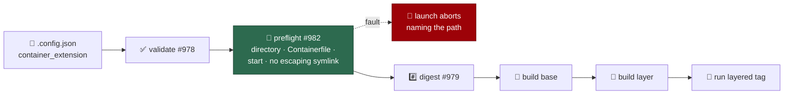

# Preflight the extension definition and prove the launch stays contained

## Summary

The `container_extension` validator (Issue #978) checks what the operator
*wrote*; nothing checked what is actually *there*, so a directory that had not
been synced yet surfaced minutes later as a digest or build failure. This slice
adds a launch preflight that runs before either build, reports the extension
where the operator already looks (`./setup.sh`), and pins the containment
rules for a deployment that configures one. Closes #982.

- `worker/deno/lib/container_extension_preflight.ts` — the fail-loud checks.
  The directory must exist, be a directory and be readable; the declared
  `containerfile` and any declared `start` must be files under it; no symlink
  under it may resolve outside it (the escape the digest also refuses, heard
  here first with the remedy attached), and a directory that loops back into
  itself is refused because the walk must terminate. Every refusal opens with
  `Cannot launch: the container_extension`, names the path and says what was
  expected.
- `worker/deno/lib/container_extension_launch.ts` — the launch path's one
  extension resolution: read the declaration, preflight it, read the
  Containerfile, resolve the layered tag. It either returns a complete
  `ContainerExtensionLaunch` or throws, so a fault means the plan carries no
  extension build arguments at all. `commands/container_launch_plan.ts` calls
  it in place of the inline block it used to carry.
- `worker/deno/setup/prerequisites.ts` — a configured deployment gets a third
  line naming the path, its readability and the layered tag, checked *before*
  the tag is resolved so an absent directory is reported as itself rather than
  as an unbuildable image. A deployment with no extension sees exactly the two
  lines it saw before.
- `docs/CONTAINER.md` documents every refusal's exact text so the docs
  sub-issue can quote it verbatim; `docs/SETUP.md` and `docs/DEPLOYMENT.md`
  gain the new host-fatal check.

## Evidence

Backend/CLI change — no web interface to screenshot. The evidence is the test
suites below, all run under `./quality.sh`, which passes:

```text
=== Quality Check Summary ===
  ... semgrep PASSED, deno tests PASSED, deno lint PASSED,
      deno type check PASSED, deno fmt PASSED
Result: PASSED (with skipped checks)
```

The containment assertions were **mutation-tested**: patching
`buildContainerLaunchPlan` to bind-mount the extension directory into the run
turned two of the three new cases red (`the extension directory is never
mounted…` and `configuring an extension introduces nothing but the layer
itself`), and the patch was reverted.

Where the preflight sits in the launch:



## Acceptance Criteria

<!-- vibe-spec-review inputs="diff+issue-body" -->

- **met** — Each preflight fault aborts the launch before any build, naming the
  path and what was expected — evidence:
  `worker/deno/tests/container_extension_preflight_test.ts` (15 cases, one per
  fault plus the happy path) and
  `worker/deno/tests/container_extension_launch_test.ts::an absent directory
  aborts before any build argument` — reviewer: met — reason: the reviewer
  noted the preflight lives in two new modules rather than inside
  `container_launch.ts`; `buildContainerLaunchPlan` is a pure, synchronous
  plan builder with no filesystem access, so the check sits in the launch
  path's one extension resolution that the command calls, and the launch-plan
  test proves a fault stops the plan before its build arguments exist.
- **met** — `setup` reports the configured extension path, its readability and
  the resolved extension image tag; a deployment with no extension sees the
  output it sees today — evidence:
  `worker/deno/tests/setup_prerequisites_test.ts::reports the extension and the
  tag that includes it` and `::a deployment with no extension sees today's two
  lines` — reviewer: met
- **met** — The containment tests pass, and fail if a future change mounts the
  extension directory or publishes a port — evidence:
  `worker/deno/tests/container_containment_test.ts` (three new cases;
  mutation-tested above) — reviewer: met — reason: the reviewer found the
  original third case tautological (it filtered to arguments that could not
  contain a bare flag); it was rewritten to judge the arguments an extension
  deployment introduces against an otherwise identical plan without one, and
  the mutation run confirms it now goes red.
- **met** — `./quality.sh` passes — evidence: full gate run after the final
  edit, output above — reviewer: met
- **partial** — Document each failure's exact symptom text — evidence:
  `docs/CONTAINER.md` — reviewer: partial — reason: the reviewer found three
  refusal texts missing from the first draft (`is not a file`, `cannot be
  resolved`, `is unreadable`); they were added, so the table plus the sentence
  beneath it now covers every message the code can emit.
- **unrequested** — A configured extension that fails its preflight makes
  `./setup.sh` fail (host-fatal) rather than only being reported — reviewer:
  unrequested — reason: every launch on that host would abort, so reporting it
  as ready would be the silent pass the fail-loud standard forbids.
- **unrequested** — Two refusals the issue did not list: a directory that loops
  back into itself, and a dangling symlink — reviewer: unrequested — reason:
  the loop guard is what makes the recursive walk terminate, and a link that
  cannot be resolved cannot be proved not to escape; both are refused rather
  than skipped.
- **unrequested** — The Containerfile read and layered-tag resolution moved out
  of `commands/container_launch_plan.ts` into
  `lib/container_extension_launch.ts` (behaviour-preserving) — reviewer:
  unrequested — reason: the command has no test seam (it detects a real
  container runtime), so the move is what lets a test prove the preflight is
  actually called before the build arguments are emitted.
- **unrequested** — An `env` injection seam on the launch resolution, and a
  path-style argument on the preflight — reviewer: unrequested — reason: the
  first is the repo's standard test seam (Issue #956) instead of mutating the
  shared process environment; the second makes the preflight prove the same
  path the build's `--file` names, which the reviewer flagged as a divergence.

## Standards Review

<!-- vibe-standards-review inputs="diff+CODING-STANDARDS.md" -->

- **violation** — No PR summary on the branch — evidence:
  `docs/archive/pr-summaries/pr-summary-982.md` — reason: fixed here; this file
  is the deliverable the reviewer found missing.
- **violation** — A new host-fatal setup check documented in `CONTAINER.md`
  only — evidence: `docs/SETUP.md:43`, `docs/SETUP.md:438`,
  `docs/DEPLOYMENT.md:291` — reason: fixed — the prerequisites step, the
  host-fatal checklist and the classification table now name the extension
  check.
- **violation** — The preflight's directory walk duplicates the digest's
  (`container_extension_digest.ts:190`) — evidence:
  `worker/deno/lib/container_extension_preflight.ts:147` — reason: stands, and
  is documented in the module header. The two answer different questions at
  different times: the digest walks to hash (sizes, modes, byte-wise ordering)
  and cannot run before the preflight, since the whole point is that the
  operator hears the fault *before* a digest is taken. Merging them would put
  preflight concerns in the hashing path and refactor a module this milestone
  has already merged; the escape predicate itself is shared
  (`isAtOrAbove`/`normalisePath`), which is where the rule actually lives.
- **violation** — `messageFrom` and the fixture writer copy-pasted between the
  new test files — evidence:
  `worker/deno/tests/container_extension_launch_test.ts:56` — reason: fixed —
  extracted to `tests/support/extension_fixture.ts` and
  `tests/support/thrown_message.ts`, used by all three suites.
- **violation** — The extension reporting was added inline to the 923-line
  `setup/prerequisites.ts` — evidence:
  `worker/deno/setup/prerequisites.ts:578` — reason: stands. The ~20 lines sit
  inside `checkContainerPrerequisites` because they share its selection read
  and its result ordering; moving them out would split one report across two
  modules for no reader's benefit.
- **clean** — Australian English throughout; every new test drives real code
  against throwaway fixtures and asserts on returned values or thrown messages
  (no source-grepping, no wall-clock thresholds); fail-loud error handling with
  no swallowed errors; JSDoc on every new module, export and helper; no hidden
  paths staged; commit messages carry the issue and the run-id trailer.

## Test Plan

- **Added** `worker/deno/tests/container_extension_preflight_test.ts` — 15
  cases against temporary fixture directories: the happy path, a trailing
  separator, an absent directory, a file where a directory was declared, an
  absent and a non-file Containerfile, a non-default Containerfile, an absent
  start script, an undeclared start script, an escaping symlink (top level and
  nested), a confined symlink, a dangling symlink, a symlink loop, and the
  shared refusal phrase.
- **Added** `worker/deno/tests/container_extension_launch_test.ts` — 8 cases
  driving the launch resolution and feeding the result to the real plan
  builder: the layered tag differs from the standard one, no declaration
  resolves to nothing, each preflight fault aborts before the build arguments
  exist, an escaping symlink is heard as the preflight rather than the digest,
  a malformed declaration still names the field, and a resolved extension
  becomes the plan's second build.
- **Extended** `worker/deno/tests/container_containment_test.ts` — the
  extension directory is never mounted or named in the run, configuring an
  extension adds no writable host path (`ensureDirectories`/`volumes`
  unchanged), and the arguments an extension introduces carry no forbidden
  flag, no host-namespace request, no published port and nothing but the
  layer's own tag, paths and build arguments.
- **Extended** `worker/deno/tests/setup_prerequisites_test.ts` — the extension
  line is present and names the extension-inclusive tag, an absent directory is
  named (and is host-fatal) rather than blamed on the image, and an
  unconfigured deployment still gets exactly two lines.
- **Added** `worker/deno/tests/support/extension_fixture.ts` and
  `worker/deno/tests/support/thrown_message.ts` — the fixtures the three suites
  share.
