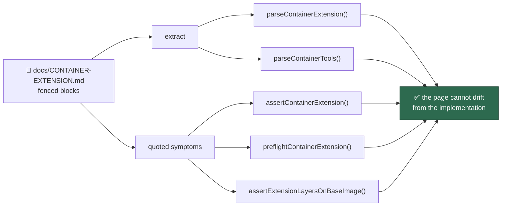

# Document the extension framework with a genericised worked example

## Summary

Adds `docs/CONTAINER-EXTENSION.md`, the public, concept-only operator manual for
the `container_extension` extension point, and makes its example checkable so
documentation and implementation cannot drift. The page covers when to reach for
the extension point rather than its three siblings, the validated `.config.json`
shape (never a `VIBE_*` variable), distribution — the operator syncs their own
private repository, the Vibe Coder clones nothing — the
`ARG VIBE_BASE_IMAGE` / `FROM ${VIBE_BASE_IMAGE}` layering contract, the
content-hash rebuild rule, start-script supervision and its exit-76 abort,
containment, and every failure mode's exact symptom. It closes with a
genericised worked example an operator can follow verbatim: a pinned Postgres
with three databases loaded from dumps at image build time, a Jenkins whose
pipeline job is defined in `casc.yaml` and reads the project's own
`Jenkinsfile`, two LTS JDKs and Maven installed through `container_tools`, and
the `start.sh` that brings the services up. No repository, host or deployment is
named anywhere; every download resolves to a reserved documentation domain.

Cross-linked from `docs/EXTENDING.md`, `docs/CONFIGURATION.md`,
`docs/CONTAINER-IMAGE.md`, `docs/CONTAINER.md` and the README documentation
table, and registered in `_data/page_titles.yml`.

Three defects the branch already carried are fixed here because the quality gate
had to pass: the launch plan reported the standard image as the image it runs
(so a layered deployment would have run the unlayered image, pruned its own
layer, and tripped `attemptRunArgs`), the container-image-hash suite still called
a helper the injected-env migration removed, and two tests decided their verdict
from the network or from cross-slot scheduling.

Closes #984.

## Evidence

Documentation and CLI change with no web interface to screenshot. The evidence is
the new test suite, which drives the published example through the real code
rather than re-reading the prose:

```
$ deno test -A tests/container_extension_example_docs_test.ts
ok | 15 passed | 0 failed
$ ./quality.sh < /dev/null
Result: PASSED (with skipped checks)
```

What the example is proved against:



## Acceptance Criteria

<!-- vibe-spec-review inputs="diff+issue-body" -->

- **met** — `docs/CONTAINER-EXTENSION.md` exists and covers every bullet,
  including a worked example an operator can follow verbatim — evidence:
  `docs/CONTAINER-EXTENSION.md`; `worker/deno/tests/container_extension_example_docs_test.ts`
  — reviewer: partial — reason: the reviewer found three real shortfalls in the
  example (unpinned Postgres against a hardcoded cluster number, Maven never
  named, and services that could not run under the read-only root); all three
  are fixed in commit `dfeccec` — the build now leaves a seed the start script
  copies into `VIBE_SCRATCH_DIR`, the major version is one `ARG` both the
  install and the PATH derive from, and Maven has its own id and prefix.
- **met** — the example is genericised: no private repository, project or host
  is named — evidence:
  `worker/deno/tests/container_extension_example_docs_test.ts::container_extension example - every download points at a placeholder host (Issue #986)`
  — reviewer: met
- **met** — the example's JSON matches the implemented shape and passes the real
  validators in the new docs test — evidence:
  `worker/deno/tests/container_extension_example_docs_test.ts::container_extension example - the documented declaration passes the real validator`
  and `… - the documented tool set passes the real tool validator` — reviewer:
  met
- **met** — every cross-link is added and resolves — evidence:
  `worker/deno/tests/container_extension_example_docs_test.ts::container_extension example - EXTENDING.md lists the page as an extension point`,
  `… - CONFIGURATION.md carries a container_extension row`,
  `… - the image and container manuals reference the page` — reviewer: met —
  reason: the issue's `docs/CONTAINER.md:1369` had drifted to `:1542`; the
  reference sits in the section the issue named.
- **met** — `./quality.sh` passes, including the documentation and link checks —
  evidence: full gate run after the final edit, exit 0 — reviewer: met
- **unrequested** — `worker/deno/lib/container_launch.ts` now reports the
  extension tag as the plan's image and keeps the whole image chain — reviewer:
  unrequested — reason: the gate was red at the branch base; two Issue #980
  tests failed there, and `attemptRunArgs` throws when `plan.image` disagrees
  with the last run argument, so a layered deployment could not launch. Covered
  by `container_launch_test.ts::buildContainerLaunchPlan - the keep chain
  carries the layer and its base (Issues #980, #1059)`.
- **unrequested** — `worker/deno/tests/container_image_hash_test.ts` swaps the
  removed `withoutProviderEnv` for an injected environment — reviewer:
  unrequested — reason: the branch base failed `deno check` on these two call
  sites, so no gate could pass until they were migrated like their siblings.
- **unrequested** — `worker/deno/tests/run_core_production_deps_test.ts` stubs
  the trust resolver — reviewer: unrequested — reason: the wiring case let a
  real `gh` call decide its verdict, which failed under the gate (where
  `CONFIG_PATH` is scrubbed) and passed locally; the factory's own seam exists
  for exactly this.
- **unrequested** — `worker/deno/tests/run_core_slot_pool_test.ts` asserts the
  claim/sleep shape instead of a global event order — reviewer: not assessed
  (the change post-dates the review) — reason: recorded here as unrequested; the
  Issue #178 test failed at `b14b224` too, because the sibling slot's identical
  sleep can land anywhere in a shared trace.
- **unrequested** — `worker/deno/tests/config_docs_consistency_test.ts` gains a
  reference-row test — reviewer: unrequested — reason: the issue's second
  failure-detection point asks this file to prove the `container_extension` key
  has a row in `docs/CONFIGURATION.md`.
- **unrequested** — README documentation-table row and the
  `docs/CONTAINER-IMAGE.md` diagram — reviewer: unrequested — reason: the README
  is the declared index into `docs/`, and the diagram is how that page states
  every other build; both are one line of intent each.
- **unrequested** — `_data/page_titles.yml` entry — reviewer: unrequested
  (gate-required) — reason: `page_titles_completeness_test.ts` fails without it.

## Standards Review

<!-- vibe-standards-review inputs="diff+CODING-STANDARDS.md" -->

- **violation** — the docs test read three library sources for message literals
  instead of calling them (TDD rule 5) — evidence:
  `worker/deno/tests/container_extension_example_docs_test.ts:198` — reason:
  fixed in `732b563`; the config-load, preflight and layering symptoms are now
  produced by `assertContainerExtension`, `preflightContainerExtension` and
  `assertExtensionLayersOnBaseImage`. The entrypoint's wording remains a text
  comparison: it is shell, and its behaviour is already exercised against the
  real script by `container_entrypoint_test.ts`.
- **violation** — the new `keepImages` behaviour shipped untested — evidence:
  `worker/deno/lib/container_launch.ts:1277` — reason: fixed in `732b563` with
  `container_launch_test.ts::buildContainerLaunchPlan - the keep chain carries
  the layer and its base`, which is red against the previous one-element chain.
- **violation** — the example's `curl -o /opt/ci/server.war` had no
  `mkdir -p /opt/ci`, so a verbatim build failed on that `RUN` — evidence:
  `docs/CONTAINER-EXTENSION.md:354` — reason: fixed in `732b563`.
- **violation** — the start script's header claimed nothing was backgrounded
  while the CI server deliberately is — evidence:
  `docs/CONTAINER-EXTENSION.md:410` — reason: fixed in `732b563`; the header now
  says each service is started and then proved to be answering.
- **violation** — the failure table restates ten error strings already tabulated
  in `docs/CONTAINER.md` — evidence: `docs/CONTAINER-EXTENSION.md:221` —
  reason: stands. The issue asks this page for "failure modes and their exact
  symptoms, quoted from the implementation", and the quotations are now pinned
  to the real messages by the docs test, so the two copies cannot drift
  silently.
- **violation** — `docs/archive/pr-summaries/pr-summary-984.md` absent —
  evidence: `docs/archive/pr-summaries/` — reason: this file.
- **clean** — Australian English throughout; no hidden path staged; every commit
  references #984 and carries the run-id trailer; the new page cross-linked from
  every surface in the same change; no test removed or commented out; `@std/assert`
  only; no wall-clock thresholds; fail-loud behaviour documented as implemented.

## Test Plan

- Added `worker/deno/tests/container_extension_example_docs_test.ts` (15 tests):
  the page's fenced `container_extension` and `container_tools` blocks through
  the real validators; the contract constants (`/opt/vibe-extension`,
  `VIBE_EXTENSION_START`, `VIBE_BASE_IMAGE`, exit 76) imported rather than
  restated; the config-load, preflight and layering symptoms produced by the
  real functions; a placeholder-host rule over every URL on the page; and each
  cross-link.
- Added `worker/deno/tests/config_docs_consistency_test.ts::config docs - every
  image-shaping key has a reference row (Issue #984)`.
- Added `worker/deno/tests/container_launch_test.ts::buildContainerLaunchPlan -
  the keep chain carries the layer and its base (Issues #980, #1059)`.
- Repaired, not removed: `container_image_hash_test.ts` (two extension cases now
  state their environment), `run_core_production_deps_test.ts` (resolver stubbed
  through the published seam), `run_core_slot_pool_test.ts` (order-independent
  assertion of the same guarantee).
- `./quality.sh` passes end to end.
