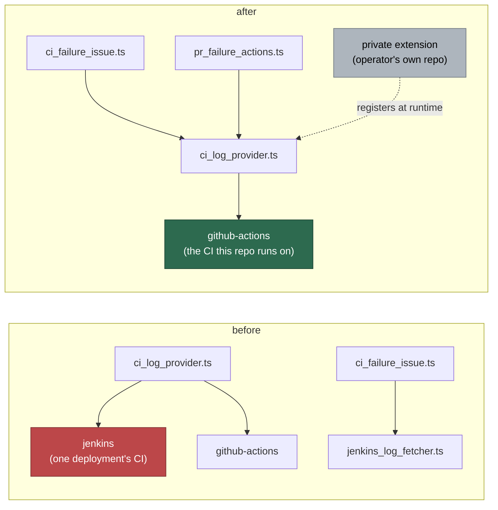

# Remove the Jenkins implementation from the public repo

## Summary

Jenkins was one deployment's CI system, hard-registered in core as "simply
the first" external provider — which is exactly the lesson that teaches the
next deployment to add its vendor to the shared tree. This removes the whole
implementation and leaves the extension point behind. Closes #986.

Deleted: `lib/jenkins_access_check.ts`, `lib/jenkins_log_fetcher.ts`,
`lib/ci_provider_jenkins.ts`, `commands/check_jenkins_access.ts`,
`commands/fetch_jenkins_log.ts`, and the six test files the issue named.
`ci_log_provider.ts` now registers exactly one built-in — GitHub Actions,
the CI this project itself runs on.

Three things had to follow the removal rather than merely mention it:

- **`FetchFn`** lived in the deleted Jenkins client and is imported by four
  vendor-neutral modules. It moves to `lib/bounded_fetch.ts`.
- **`ci_failure_issue.ts`** called the Jenkins client directly. It now
  resolves through the `CiLogProvider` registry, the same seam the PR-mode
  path already used, so the issue-mode fetch names no vendor either.
- **The deprecated `prFailureActions` config** had exactly one action type,
  `fetch-jenkins-log`, and `ci_failure_job_path` was a Jenkins job path.
  Both are removed, and a `.config.json` still carrying either now **fails
  the config load** naming the migration — the `fleet_health_*` precedent
  from Issue #805, for the same reason: a key that reads as live and does
  nothing is a silent failure.



## Evidence

Backend/CLI only — there is no web interface to screenshot, so the evidence
is the gate and the guard test.

`./quality.sh < /dev/null` passes end to end after the final edit:

```text
  markdownlint                   PASSED
  semgrep                        PASSED
  deno tests                     PASSED
  deno lint                      PASSED
  deno type check                PASSED
  deno fmt                       PASSED

Result: PASSED (with skipped checks)
```

The guard the issue asked for fails on any second built-in:

```text
ci_log_provider - core registers no vendor-specific provider ... ok
```

Net effect on the tree: 56 files changed, **−4801 lines**.

`PROCESS_STATE_MUTATOR_TEST_FILES` is now **empty**. Seven entries went:
four were the deleted Jenkins suites, and the other three installed
`JENKINS_*` in the process and were rewritten onto injected seams. Every
test file now runs in the fast parallel pass.

## Acceptance Criteria

<!-- vibe-spec-review inputs="diff+issue-body" -->

- **met** — No `jenkins`-specific module, command or test in the public tree — evidence: the five modules, two commands and six test files are deleted; `mod.ts` registers neither command — reviewer: met — reason: the reviewer noted `JENKINS_USER`/`JENKINS_TOKEN` survive in `lib/agent_env.ts:43-44`; they are child-env **denylist** names, not an implementation, and removing them would let an operator's private-extension CI token reach the coding agent. Kept deliberately, with the comment rewritten to say so.
- **met** — Nothing vendor-specific registered in `ci_log_provider.ts`; GitHub Actions stays — evidence: `worker/deno/lib/ci_log_provider.ts` ends with a single `registerCiLogProvider(githubActionsCiLogProvider)` — reviewer: met
- **met** — `EXTENDING.md` points at the private-extension page rather than at the Jenkins files — evidence: `docs/EXTENDING.md:140` links `PRIVATE-EXTENSIONS.md`; no Jenkins reference remains — reviewer: met — reason: the reviewer correctly observed this landed with #985 and that this diff only corrects "the built-ins" to "the one built-in, GitHub Actions". Recorded as satisfied, not as new work.
- **met** — The command-count assertion in `mod_test.ts` follows the removal, with a comment saying which commands went and why — evidence: `worker/deno/tests/mod_test.ts` 147 → 145, with the comment chain and two negative assertions that the commands stay removed — reviewer: met
- **met** — A guard test asserting core registers no vendor-specific CI provider — evidence: `worker/deno/tests/ci_log_provider_test.ts::ci_log_provider - core registers no vendor-specific provider` — reviewer: met
- **unrequested** — The Jenkins CI-credentials escalation (Issue #3583) is removed from `pr_ci_processor.ts` — reviewer: unrequested — reason: its classifier was `jenkins_access_check.ts` and its coverage was `pr_ci_processor_jenkins_access_test.ts`, both of which the issue enumerates for deletion, so the behaviour could not outlive them. A vendor-neutral replacement is a design decision beyond this issue, not a mechanical consequence of it.
- **unrequested** — The deprecated `prFailureActions` type and parser, and the `ci_failure_job_path` key, are removed — reviewer: unrequested — reason: entailed, since `fetch-jenkins-log` was the only action type and the job path addressed a Jenkins job. The reviewer's real finding — that a deployed config would silently no-op — is fixed: both now fail the config load with the migration named.
- **unrequested** — `ci_failure_issue.ts` is rerouted onto the provider registry — reviewer: unrequested — reason: it imported the deleted client directly, so it had to change. Registry-first was chosen over deleting the feature because that would also have deleted the Issue #3639/#3646/#3648 prompt-security regression tests, and over leaving it fetcher-less, which would have been dead code.
- **unrequested** — The body-URL origin allowlist is replaced by a non-dereference contract — reviewer: unrequested — reason: the allowlist could only be expressed against one vendor's `JENKINS_URL`, so it left with that vendor. What replaces it is stronger for holding across every provider: core validates scheme only and never fetches the URL; the provider reads ids out of it and fetches through its own client, scoped to the issue's repo. Covered by `ci_failure_issue_test.ts::a foreign-origin build URL is never dereferenced`, which asserts zero outbound fetches to the foreign origin.
- **unrequested** — `nosemgrep` markers on `compileIdentifier()` in `export_scrub_gate.ts` — reviewer: unrequested — reason: a one-word comment edit pulled the file into the changed-file semgrep scan, surfacing two pre-existing findings the sibling `compileRepoName()` already suppresses with the same justification. Suppressing them was the only way to a green gate without leaving the vendor name in place.
- **unrequested** — `docs/RELEASE-NOTES.md` 1.3.0 entry and the `.release-floor` move — reviewer: unrequested — reason: raised by the Standards reviewer. Removing operator-facing configuration keys is exactly what that page documents, and the 1.2.0 entry set the precedent.

## Standards Review

<!-- vibe-standards-review inputs="diff+CODING-STANDARDS.md" -->

- **violation** — Fail loud: the removed per-repo keys became silent no-ops — evidence: `worker/deno/lib/config.ts:229` — reason: fixed here. `REMOVED_REPO_CONFIG_KEYS` refuses both spellings of each key at config load with the migration named, mirroring `REMOVED_CONFIG_KEYS`; four tests cover it.
- **violation** — Fail loud: a deliberate throw was swallowed — evidence: `worker/deno/lib/execute_claude_phase.ts:813` — reason: fixed here. The `try/catch` around `getCiProviders` is gone; `repo_config.ts` raises on malformed config so the worker fails fast, and `getCiFailureLabels` on the line above is uncaught for the same reason.
- **violation** — A code change owes a docs change: no release-notes entry for three removed operator surfaces — evidence: `docs/RELEASE-NOTES.md:9` — reason: fixed here. A 1.3.0 entry records the contract change, the migration and the rollback; `.release-floor` moves to 1.3.0.
- **violation** — Docs contradicted each other: the new prose told operators to confirm an extension registered its provider, while `PRIVATE-EXTENSIONS.md` lists out-of-tree registration as a known gap — evidence: `docs/per-repo-pr-failure-actions.md:148` — reason: fixed here. Both the boundary note and the troubleshooting row now name the gap and link it.
- **violation** — A documented config key had no snake_case alias in `REPO_CONFIG_KEY_MAP` — evidence: `docs/ci-failure-issue-log-fetch.md:145` — reason: fixed here. The row is `ciProviders`, and says camelCase only.
- **violation** — Test coverage: two new error paths were untested — evidence: `worker/deno/lib/ci_failure_issue.ts:457` — reason: fixed here. Added `a provider that throws is reported, not propagated`; the other path no longer exists after the swallowed-throw fix above.
- **violation** — Comment accuracy: the parallel-manifest comment said three entries went when seven did — evidence: `worker/deno/lib/parallel_unsafe_test_manifest.ts:86` — reason: fixed here.
- **violation** — DRY: `lastNumericSegment()` computed twice in one expression — evidence: `worker/deno/lib/ci_failure_issue.ts:164` — reason: fixed here, hoisted to a local.
- **clean** — Australian English throughout; test quality (every test calls a real function and asserts on its result — no source-text greps); commit safety (no hidden or credential-shaped paths staged; the `.github/gitleaks.toml` edit is comment-only); secret handling (`JENKINS_*` deliberately retained in the `agent_env`/`claude_env` denylists with rationale); untrusted-input handling (scheme-validated, never dereferenced, excerpt truncated → redacted → dynamically fenced); KISS (net −4801 lines, no new abstraction); commit messages carry the issue reference and the run-id trailer.

Two findings were raised and **not** fixed, recorded here rather than
silently dropped:

- **The 256 KiB issue-mode fetch budget is gone.** The Actions provider caps
  at 16 KiB after summarising, so `CI_FAILURE_LOG_FETCH_BYTES` had become
  decorative. Rather than fake the bound, the constant and the "≤ 256 KiB"
  claim in the sequence diagram are both removed — the provider owns its own
  cap. Plumbing a per-call budget through `CiLogProvider` is a change to the
  extension point's signature and belongs with #985's surface work.
- **The Issue #3583 credentials escalation is gone**, as recorded under
  `unrequested` above. Its classifier and its test were both on the issue's
  deletion list.

## Test Plan

Added:

- `tests/ci_log_provider_test.ts::core registers no vendor-specific provider` — the guard from the acceptance criteria: exact-array equality on the registered ids, so a second built-in fails it.
- `tests/pr_failure_actions_test.ts` — rewritten (12 tests) around a stub provider registered for each test's duration: happy path, config pass-through, no matching check, provider error, provider throws, empty excerpt, unregistered id, three `checkNamePattern` cases, multiple providers, empty input.
- `tests/ci_failure_issue_test.ts` — the parse tests re-pointed at the vendor-neutral contract, plus six end-to-end cases: fetch through the registry, foreign-origin URL never dereferenced, provider error, provider throws, no reported status never claims FAILURE, empty excerpt, no build reference.
- `tests/repo_config_ci_failure_labels_test.ts` — four cases covering the removed-key refusal (each key, the snake_case spelling, both in one message, and a clean config still loading).
- `tests/mod_test.ts` — two negative assertions that neither removed command comes back.

Modified, with the reason:

- `tests/outbound_fetch_bounds_test.ts` — the ten Jenkins bound cases removed with the clients they drove; the ImgBB and npm cases are untouched and still pass.
- `tests/repo_config_test.ts` — the `parsePrFailureActions`/`getPrFailureActions` section removed with those functions; `parseCiProviders` cases de-vendored, and the "jobPath is required for jenkins" case replaced by one asserting core requires it for no provider.
- `tests/pr_ci_processor_failure_actions_test.ts`, `tests/pr_failure_actions_excerpt_test.ts`, `tests/github_actions_log_fetcher_test.ts`, `tests/prompt_builder_test.ts`, and three others — vendor names in fixtures replaced with `example-ci`; assertions unchanged in shape.

Full gate: `./quality.sh < /dev/null` → `Result: PASSED (with skipped checks)`.
