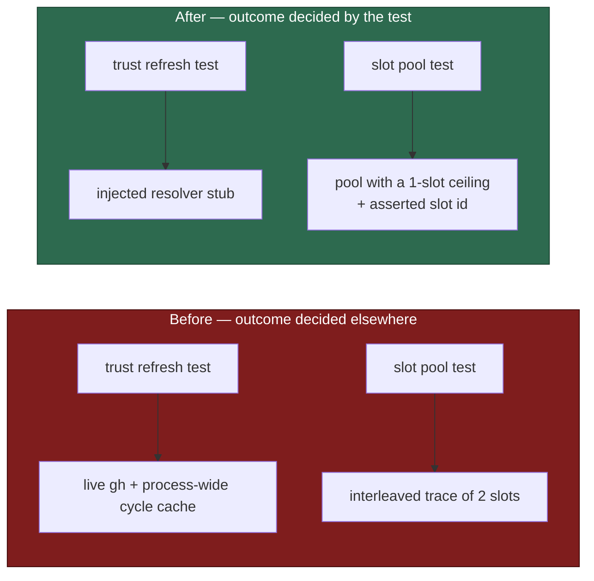

# PR Summary — Issue #990

## Summary

`./quality.sh` could not reach a green result on an untouched branch inside the
worker container. The two tests the issue named
(`service_account_env_test.ts::… unwritable gh config dir …` and
`setup_prerequisites_test.ts::… image is not buildable`) were already fixed on
`main` by commit `fd59010` — both are verified green here — but the red baseline
they described had simply moved to a different pair:

- `run_core_production_deps_test.ts::createProductionRunCoreDeps - static trust
  refresh succeeds and does not throw` left `resolveTrustedAuthors` unset, so it
  drove the **real** resolver: a live `gh` call against whatever repositories the
  host's own `.config.json` names, plus `derived_authors.ts`'s process-wide
  per-cycle cache shared with every other test file in the same worker. Green on
  its own (6s of network), red inside the gate.
- `run_core_slot_pool_test.ts::slot pool - a success is followed by the normal
  sleep and another claim in the SAME slot …` asserted an exact global ordering
  over an event trace **two concurrent slots** wrote. The idle sibling's rescan
  sleeps interleaved between the working slot's settle sleep and its next claim,
  in whatever order the event loop chose.

Both are now decided by the behaviour they name and nothing else. Closes #990.

## Evidence

Backend/CLI change with no web interface — the evidence is the gate itself.

Before, on the untouched branch in this container:

```text
FAILED | 16845 passed (4 steps) | 2 failed | 4 ignored (1m20s)
  createProductionRunCoreDeps - static trust refresh succeeds and does not throw
  slot pool - a success is followed by the normal sleep and another claim in the SAME slot, not a pool drain (Issue #178)
Result: FAILED
```

After:

```text
  deno tests                     PASSED
  deno lint                      PASSED
  deno type check                PASSED
  deno fmt                       PASSED
  semgrep                        PASSED

Result: PASSED (with skipped checks)
```

The two tests the issue named, run at `origin/main` (`64b9898`) in this
container — both green, fixed by `fd59010`:

```text
buildServiceAccountEnv - an unwritable gh config dir is restaged writable ... ok
checkContainerPrerequisites - fails when the image is not buildable ... ok
```

and the same two at the commit the issue reported (`56821d4`) — both red, as
reported.

What each fix changes:



## Reproduction

- **symptom** — two unit tests fail on an untouched branch inside the worker
  container, so `./quality.sh` cannot reach green and no branch can be
  distinguished from one that genuinely broke something
- **status** — `verified` — the gate was run on the untouched branch and failed
  with exactly two tests red (output above); after the fix the same gate passes.
  The slot-pool test was additionally re-checked against a deliberately
  reintroduced Issue #178 regression (`return` after a successful claim) and
  failed as it must, so the rewrite still guards the behaviour it names
- **regression test** —
  `worker/deno/tests/run_core_slot_pool_test.ts::slot pool - a success is
  followed by the normal sleep and another claim in the SAME slot, not a pool
  drain (Issue #178)` and
  `worker/deno/tests/run_core_production_deps_test.ts::createProductionRunCoreDeps
  - static trust refresh succeeds and does not throw`

## Test Plan

- `worker/deno/tests/run_core_production_deps_test.ts` — the trust-refresh test
  now injects `resolveTrustedAuthors` (the seam the factory already exposes for
  exactly this, used the same way by `derived_trust_source_test.ts`) with an
  explicit `config`, and closes the deps via `cleanup()`. It still asserts the
  wired refresh returns `ok` and never throws; runtime went from ~6s of network
  to 2ms.
- `worker/deno/tests/run_core_slot_pool_test.ts` — the pool is still entered
  with `maxConcurrentIssues: 2` (below that the serial loop runs, not the pool),
  but `slotCeiling.effectiveSlots` now starts one slot, so the trace is one
  slot's. The slot id of each claim is captured from `currentSlotContext()` and
  asserted equal, so "the SAME slot" is checked rather than assumed — two slots
  could never prove it, since a sibling may legitimately take the second issue
  once the first slot releases its hold.
- No production code changed; no test was removed, disabled or weakened.
- Full gate: `./quality.sh` — PASSED (deno tests, lint, type check, fmt,
  semgrep, markdownlint, mermaid and the chokepoint checks).
