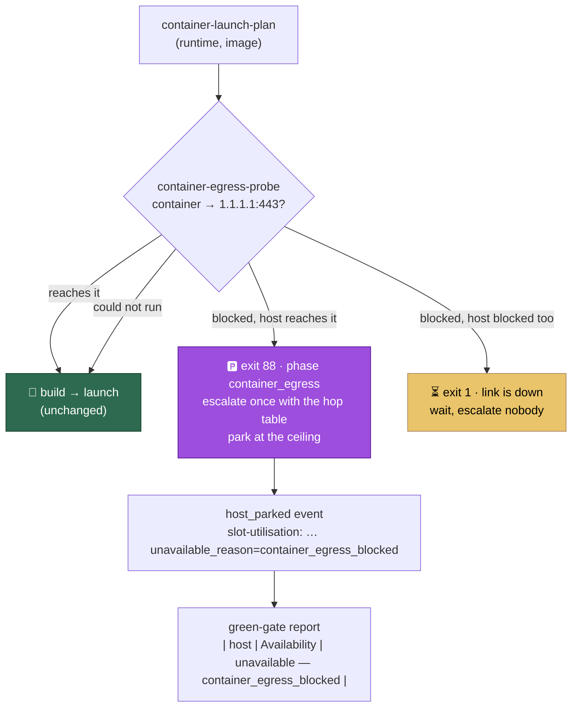

# A host whose containers cannot reach the network parks itself and says so

## Summary

GRQ-23 spent hours reporting `image_build` for a fault in its own routing
(incident #991). The image was fine and the link was fine — the *host* reached
`github.com` in 0.1 s throughout; what was broken was egress from inside a
container, a reject route on the container bridge while a Tailscale `utun`
interface held a default route. The build was simply the first thing to notice,
135 seconds into a `curl`, and it sent every reader to an image that was never
broken.

Both launchers now ask the question directly, before the build: one short
container opens a TCP connection to a **literal address**, the same address is
tried from the host, and the difference between the two hops decides what
happens. A container that gets out carries on. A container blocked while the
host is fine is the host's own networking: the launcher writes the
`container_egress` phase marker, exits **88**, escalates once with the hop
table and the routing evidence, and parks at the backoff ceiling instead of
rebuilding an image that is fine. Both hops blocked is a link outage: it waits
at the base cadence and escalates nobody. A probe that could not run never
blocks a launch.

The park is then reported as *capacity*, not as silence: every parked cycle
writes a `host_parked` self-heal event carrying a `slot-utilisation:` line in
the Issue #925 vocabulary (`unavailable=…s unavailable_reason=…`), and the
green-gate report — one row per host, the fleet view being the union of each
host's report — leads with availability and the reason.

Closes #997.

## Evidence

Backend and launcher change with no web interface to screenshot. The evidence
is the test suites below and the red-then-green reproduction in the next
section.

The three conditions, and what each costs:

| container | host | verdict | launcher exit | action |
| --- | --- | --- | --- | --- |
| reaches it | – | `reachable` | `0` | builds and launches, as before |
| blocked | reaches it | `egress_blocked` | `88` | parks, escalates once with the evidence |
| blocked | blocked | `network_down` | `1` | waits; the evidence carries the network-unavailable marker (#949) |
| not run | – | `inconclusive` | `0` | launches exactly as before |

## Reproduction

- **symptom** — a host whose containers cannot reach the network rebuilt the
  image every cycle, spent 135 s per attempt inside a `curl`, and reported
  `Failure phase: image_build` for a fault in its own routing; nothing in the
  fleet's record said the host had stopped claiming or why
- **status** — `verified` — with the pre-fix launcher restored
  (`git show f0d67a7:run.sh > run.sh`) the regression suite goes red on the
  original behaviour: `run.sh - a blocked container parks the host instead of
  rebuilding` fails with `[run.sh] building vibe-coder:…` in the trace and
  `Values are not equal: actual 0 / expected 88`, and all four tests in the
  file fail. With the fix in place all four pass.
- **regression test** —
  `worker/deno/tests/launcher_egress_probe_test.ts::run.sh - a blocked container parks the host instead of rebuilding`
  (fleet-reporting half:
  `worker/deno/tests/host_unavailable_capacity_997_test.ts::green-gate report - a parked host is unavailable capacity with a reason`)

## Acceptance Criteria

<!-- vibe-spec-review inputs="diff+issue-body" -->

The issue states no `## Acceptance Criteria` heading; its six numbered "What it
must do" items and the four "Failure detection" assertions are treated as the
criteria, and an independent reviewer was given only the diff and the issue
body.

- **met** — 1. detect in seconds, one probe from inside a container before the
  build — evidence: `run.sh:592-601` (probe runs after `container-launch-plan`,
  before `run_build`), ordering asserted in
  `worker/deno/tests/launcher_egress_probe_test.ts::run.sh - a reachable container builds and launches as before`
  — reviewer: met — reason: the reviewer notes the worst case is ~90 s, not
  seconds, when packets are silently dropped (60 s container bound + 8 s host
  connect + routing reads); that is the price of distinguishing a dropped
  packet from a fast refusal, and it still replaces a 135 s `curl` per cycle
  with one bounded probe.
- **met** — 2. DNS is not the probe; it must reach an external address —
  evidence: `worker/deno/lib/container_egress_probe.ts::parseEgressTarget`
  refuses anything but an IP literal;
  `tests/container_egress_probe_test.ts::parseEgressTarget - refuses a hostname, because DNS is not the probe`
  — reviewer: met
- **met** — 3. attribute correctly across the three conditions — evidence: the
  `container_egress` phase (`worker/deno/lib/container_restart_backoff.ts:118`),
  `classifyEgress` keyed on the host hop, and
  `tests/container_egress_park_test.ts::resolveFailurePhase - the egress marker is its own phase, not image_build`
  — reviewer: met
- **met** — 4. escalate once, with the evidence — evidence: threshold 1
  (`escalationThresholdFor`), streak suppression, and
  `tests/launcher_egress_probe_test.ts::run.sh - a blocked container parks the host instead of rebuilding`
  now asserting the hop table on the launcher's own stderr — reviewer: partial
  — reason: the reviewer found the evidence reached only the launcher's own
  recorder, which is a no-op on every supervised host
  (`VIBE_SUPERVISOR_RECORDS_OUTCOME`), so the escalation carried the prose line
  alone; fixed in this diff (commit `f421dbb`, both launchers print the
  evidence to stderr) and covered by the assertion named above.
- **met** — 5. stop retrying what cannot succeed; park and say so — evidence:
  `nextContainerRestartDecision` jumps to `maxBackoffSeconds` for this phase;
  `tests/container_egress_park_test.ts::nextContainerRestartDecision - the first blocked launch parks at the ceiling`
  and `buildCount === 0` in the launcher test — reviewer: met
- **partial** — 6. report it fleet-wide, per host, in the #925 slot-utilisation
  vocabulary — evidence: `worker/deno/lib/slot_idle_accounting.ts::parkedHostCapacity`,
  the `host_parked` event carrying the line
  (`worker/deno/lib/container_restart_backoff.ts:1361`), and the green-gate
  report's `Availability` row — reviewer: partial — reason: the line is not
  emitted into the in-process `slot-utilisation:` stream `run_core.ts:4142`
  writes, because a parked host never starts the worker that writes it; it
  rides the `host_parked` event, the escalation body and the per-host
  green-gate report instead, which are the surfaces a host with no container
  can still reach. The reviewer's second half — the report contradicting itself
  on restarts — was a real defect and is fixed (see below).
- **met** — failure detection: the escalation names the host-networking fault,
  not `image_build` — evidence:
  `tests/launcher_egress_probe_test.ts` (phase marker `container_egress`,
  stderr "not the image build") and
  `tests/container_egress_park_test.ts::buildContainerEscalationParams - names the host-networking fault, not the image`
  — reviewer: met
- **met** — failure detection: it carries the hop evidence — evidence:
  `tests/launcher_egress_probe_test.ts` asserts `| hop | result |`,
  `bridge100` and `utun8` in the launcher's own stderr as well as in what
  reached the recorder — reviewer: partial — reason: the reviewer's partial was
  the supervised-path loss described under criterion 4; fixed in `f421dbb`,
  including the `network_down` branch, where the lost
  `NETWORK_UNAVAILABLE_MARKER` had a worse consequence — a link outage climbed
  the failure ladder Issue #949 exists to keep it off.
- **met** — failure detection: the host parks instead of rebuilding — evidence:
  `tests/launcher_egress_probe_test.ts` (exit 88, `buildCount === 0`, no worker
  run) — reviewer: met
- **met** — failure detection: the fleet report shows it as unavailable with a
  reason — evidence:
  `tests/host_unavailable_capacity_997_test.ts::green-gate report - reads the recorder's own events, not a hand-written park`
  — reviewer: partial — reason: the reviewer found the original test synthesised
  tidy `host_parked` events, hiding that a real parked cycle also writes a
  backoff record and an escalation, both of which were counted as container
  restarts; the counter now skips the whole phase and the new test drives the
  report from `recordContainerRestartOutcome`'s own `self-heal.jsonl`.
- **met** — the three conditions in the table are the cases — evidence:
  `tests/launcher_egress_probe_test.ts` drives the real `run.sh` for each of
  blocked, link-down and reachable — reviewer: met — reason: `run.ps1`'s branch
  runs only where PowerShell is installed (absent here and on CI); it is held
  to the same three constants by the pin test in the same file.
- **unrequested** — `docs/archive/handover/issue-997.md` — reviewer:
  unrequested — reason: worker-written handover state committed by the
  interrupted run that started this branch, not agent output; six other
  `docs/archive/handover/issue-*.md` files are tracked the same way.
- **unrequested** — `VIBE_EGRESS_PROBE_TARGET` and `--target` — reviewer:
  unrequested — reason: a host whose network blocks `1.1.1.1` needs somewhere
  else to aim, and the flag is what makes the IP-literal rule testable; kept,
  declared in `vibe_env_registry.ts` as a switch no launcher sets.
- **unrequested** — IPv6 targets in `isIpLiteral` / `formatEgressTarget` —
  reviewer: unrequested — reason: a few lines in the validator that keep an
  IPv6-only host from being told its literal address is "a name"; kept.
- **unrequested** — `knownWorkerStatuses` gains a parameter for the parked
  status — reviewer: unrequested — reason: without it the escalation blames
  exit 88 on the runtime client, which is the mis-attribution this issue is
  about; the standards review had it made required rather than optional
  (`worker/deno/lib/launcher_failure_evidence.ts:55`).
- **unrequested** — the outcome recorder reads `config.maxConcurrentIssues` —
  reviewer: unrequested — reason: the capacity a parked host loses is the
  concurrency it was configured for; without it the report can say "unavailable"
  but not how much.
- **unrequested** — the `Parked cycles` row in the green-gate report —
  reviewer: unrequested — reason: one number beside the availability row, so a
  host parked earlier in the window but running now does not lose the episode.

## Standards Review

<!-- vibe-standards-review inputs="diff+CODING-STANDARDS.md" -->

- **violation** — a test greps launcher source for constant declarations rather
  than exercising behaviour — evidence:
  `worker/deno/tests/launcher_egress_probe_test.ts:212` — reason: stands, and
  is now argued in the code. The three tests beside it drive the real `run.sh`
  end to end; this one exists for `run.ps1`, which cannot be executed on a host
  without PowerShell, and it pins one constant across bash, PowerShell and
  TypeScript. The repo's `run_sh_launcher_test.ts` and `run_ps1_launcher_test.ts`
  use the same `executableLines` idiom.
- **violation** — import-time I/O: two `await Deno.readTextFile` calls at module
  scope — evidence: `worker/deno/tests/launcher_egress_probe_test.ts:191`
  (pre-fix) — reason: fixed in commit `ab2b3fb`; each launcher is read inside
  the test, still by a literal path so the integration-manifest classifier
  keeps recognising the suite (`3ec752e`).
- **violation** — an optional parameter with a single always-supplying caller —
  evidence: `worker/deno/lib/launcher_failure_evidence.ts:55` — reason: fixed
  in `ab2b3fb`; the parked status is required, and the table's totality
  assertion now covers 88.
- **violation** — the same module imported twice in adjacent statements —
  evidence: `worker/deno/tests/host_unavailable_capacity_997_test.ts:25`
  (pre-fix) — reason: fixed in `ab2b3fb`.
- **clean** — Australian English throughout (the only US spelling is `color:`
  inside Mermaid `style` directives, which is required syntax); fail-loud error
  paths (an unwritable evidence file fails the command, a malformed target
  throws, the one `catch` degrades the evidence and never the verdict); no
  hidden or credential-shaped path staged; tests call real functions through
  injected seams and assert on returned verdicts, emitted JSONL and rendered
  report text; no absolute wall-clock assertions and the unit suites run in
  well under a second; Deno-native tooling only, shell orchestrating via
  `deno run`; docs updated in five files for every behaviour change; the
  command-count and `VIBE_*` registry totality checks updated; exit status 88
  collides with nothing; commit messages carry the issue and the run-id
  trailer.

## Test Plan

Added:

- `worker/deno/tests/container_egress_probe_test.ts` — target validation (a
  name is refused), routing-table parsing in both dialects, the three verdicts,
  the base-image fallback, an unreadable routing table, and a runtime that
  refused to run the probe.
- `worker/deno/tests/container_egress_probe_command_test.ts` — the command's
  exit statuses, and that a probe which cannot run never blocks a launch.
- `worker/deno/tests/container_egress_park_test.ts` — the phase is its own, not
  `image_build`; threshold 1; the ceiling backoff; the escalation wording and
  the `host_parked` event.
- `worker/deno/tests/launcher_egress_probe_test.ts` — the real launcher under a
  stubbed probe for each of the three conditions, plus the exit statuses
  `run.sh`/`run.ps1` hardcode.
- `worker/deno/tests/host_unavailable_capacity_997_test.ts` — the parked-host
  slot-utilisation line, that a running pool's line is unchanged, the capacity
  carried into the park event and the escalation, the green-gate report's
  availability row, and one case driven from the real recorder's own
  `self-heal.jsonl` rather than a hand-written fixture.

Modified:

- `worker/deno/tests/mod_test.ts` — the command count moves 145 → 146 for
  `container-egress-probe`.
- `worker/deno/tests/container_escalation_streak_test.ts` — the new phase in
  the streak fixture.
- `worker/deno/tests/launcher_failure_evidence_test.ts` — the parked status is
  now a required argument and is covered by the table's totality assertion.

### Quality gate

`./quality.sh` passes every check except `deno tests`, which is **red on the
base branch before this change**: `run_core_slot_pool_test.ts::slot pool - a
success is followed by the normal sleep and another claim in the SAME slot` and
`run_core_production_deps_test.ts::createProductionRunCoreDeps - static trust
refresh succeeds and does not throw`. Both are already tracked —
stSoftwareAU/VibeCoder#1098 (this milestone base) and #1118 (the default
branch) — and both reproduce unchanged on `f0d67a7` (the PR base) and on
`origin/main` with no edit applied. This branch's own run fails exactly that
same pair and nothing else; every suite this change touches is green.
