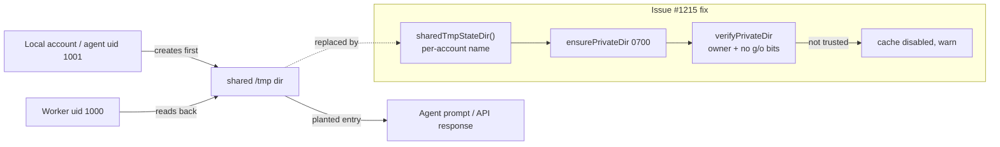

# 🔎 Security sweep — filesystem, path and temp-file handling in `worker/deno/lib/`

**Issue:** [#1215](https://github.com/stSoftwareAU/VibeCoder/issues/1215) (chunk
12b) · **Parent:** #1209 `security-scan-overflow: 4 chunks not reached` ·
**Sibling:** [chunk 12a](security-sweep-1214-subprocess-argv.md) (subprocess and
argv), disjoint by construction

This record exists so a later run can tell a **swept** path from an unswept one.
The parent scan's repo-wide greps (item 11 of #1209) did not look at path
construction at all — path traversal and symlink following leave no greppable
signature — so every file below was read at its filesystem call sites and the
provenance of each path component traced to a constant, a validated value, or a
named untrusted source.

## Scope and method

The file list was regenerated with the command the issue specifies:

```bash
cd worker/deno
comm -23 \
  <(grep -rl "Deno.writeTextFile\|Deno.writeFile\|Deno.remove\|Deno.mkdir\|Deno.makeTempDir\|Deno.symlink\|Deno.open" lib/ | sort) \
  <(grep -rl "Deno.Command" lib/ | sort)
```

It returns **76** files today (the issue title says 73 — the tree moved between
refinement and the sweep). All 76 were reviewed against seven questions: path
traversal from GitHub-supplied strings; symlink following; TOCTOU between a
`stat`/`exists` and the write; temp-file naming and permissions; state-file
permissions; recursive removal with a computable component; and archive
extraction (zip-slip).

Triage followed the Phase 3 discipline of [`SECURITY-SCAN.md`](../SECURITY-SCAN.md):
refute-unless-proven. A candidate that could not be traced from a named
attacker-controlled input to the filesystem call was dropped rather than filed.

### The trust boundary this sweep assumed

Two runtime facts were **verified rather than assumed**, because most candidate
findings died on them:

- `Deno.remove(path, { recursive: true })` uses `symlink_metadata` — a symlink
  is **unlinked, not traversed**. That kills the entire "a planted symlink
  redirects a recursive delete outside the workspace" class across
  `session_manager.ts`, `session_sweeper.ts`, `work_volume_prune.ts`,
  `stale_workdir.ts`, `temp_utils.ts` and `run_housekeeping.ts`.
- `Deno.makeTempFile` creates at mode **0600**, and a later `Deno.writeTextFile`
  to an existing file does not reset the mode — so `run_callbacks.ts:304-308`
  and `repo_settings_harden.ts:479-484` genuinely are 0600 as their comments
  claim. A plain `Deno.writeTextFile` to a **new** path is 0644.

What is _not_ hypothetical is a second local principal. `container/Containerfile:379`
creates an `agent` account (uid 1001), `worker/deno/lib/untrusted_command_env.ts:193`
runs the repository's own quality command as `sudo -n -u agent`, and
`container/entrypoint.sh:90-98` makes the work root group-writable and setgid
with no sticky bit. "Predictable path under a directory the untrusted account
can write, opened with a symlink-following call" is therefore a real primitive,
and it is what the findings below turn on.



## Finding fixed in this sweep

### SEC-1215-01 — shared-tmp cache directories bypassed the private-cache control

`severity:medium` · `confidence:high` · **fixed**

`private_cache_dir.ts` was written for Issue #3709 (SEC-e70b8134af26) precisely
because a file-backed cache under a world-writable `TMPDIR` is the same path for
every account on the host, so whoever creates it first owns what the worker
reads back. The control was wired into **one** cache, `timeline_cache.ts`. Three
siblings — carrying data with more direct reach into the agent — had none:

| Site (pre-fix)                | Path                                   | What a planted entry buys                                                                          |
| ----------------------------- | -------------------------------------- | -------------------------------------------------------------------------------------------------- |
| `lib/prompt_cache.ts:34`      | `/tmp/vibe-prompt-cache-deno` (literal) | **The sharp one.** Assembled *prompt text* handed to the coding agent — instruction injection, no model compromise needed |
| `lib/codebase_map_cache.ts:32` | `/tmp/vibe-codebase-map-deno` (literal, passed explicitly) | The codebase map injected into the issue prompt; also persists across runs and repositories        |
| `lib/issue_cache.ts:53`       | `${TMPDIR}/vibe-issue-cache-deno`       | Attacker JSON read back as a GitHub API response by `find_oldest_issue`, `find_issues_by_label`, the idle-task gate |

All three now build the directory through `sharedTmpStateDir()` — the single
place a shared-tmp name is composed, per-account by construction — create it
`0700` with `ensurePrivateDir`, and refuse to read or write it when
`verifyPrivateDir` reports another account could have written to it. The cache
degrades to a miss and the refusal is logged; it is never silently ignored.

The check follows the directory's **location**, not whether the caller named it
(`isSharedTmpPath`). That is what closes the codebase-map case: it passed a
fixed `/tmp` literal explicitly, so a default-only check would have let it
straight through.

Regression coverage: `worker/deno/tests/shared_tmp_cache_dir_test.ts` — six
tests against the real classes and a real filesystem, including
`issue cache - refuses a planted entry in a world-writable directory`, which
plants the poisoned entry in **both** the pre-fix shared path and the
per-account path so it cannot pass by addressing a directory the code no longer
uses.

### Residual — the class is closed in the caches, not in the tree

Five sites still interpolate `TMPDIR`/`/tmp` into a worker state directory by
hand; they are filed as
[#1242](https://github.com/stSoftwareAU/VibeCoder/issues/1242) rather than
fixed here, and the durable form named in the issue — the helper **plus** a
quality-gate check that fails the build on a raw `${TMPDIR}/vibe-…`
interpolation, the idiom `gh_spawn_chokepoint_check.ts` uses for `gh` — is part
of that issue. Stating it plainly: this sweep shipped the helper and the three
consumers that mattered most, not the gate.

## Findings filed, not fixed here

Each is a distinct root cause from SEC-1215-01 and from the others, filed per
`docs/SECURITY-SCAN.md` Phase 3–4 with its `finding-id` marker and
`severity:*` / `confidence:*` labels.

- **SEC-1215-02** ([#1238](https://github.com/stSoftwareAU/VibeCoder/issues/1238))
  — the GitHub token is staged with a bare `Deno.writeFileSync` that follows a
  symlink and lands at the umask default, with the directory `chmod`-ed to 0700
  only **after** the credential is written (`lib/gh_credential_stage.ts:83-85`,
  `:186-198`). The exact sequence `file_utils.ts:76-94` documents as fixed for
  ordinary state files. `severity:high` · `confidence:medium`
- **SEC-1215-03** ([#1239](https://github.com/stSoftwareAU/VibeCoder/issues/1239))
  — the credit log is appended at `${workDir}/.credit_log_<date>.json` with a
  symlink-following write (`lib/credit_tracker.ts:310`), and because the work
  root has no sticky bit the untrusted account can delete the day's log
  outright, zeroing the only input the daily spend ceiling reads.
  `severity:medium` · `confidence:medium`
- **SEC-1215-04** ([#1240](https://github.com/stSoftwareAU/VibeCoder/issues/1240))
  — the codebase map follows committed symlinks out of the clone
  (`lib/codebase_map.ts:347`, `:394`, `:406` → `Deno.open` at `:561`) and emits
  a bounded slice of the target into the agent's prompt. The containment check
  it needs already exists at `container_extension_digest.ts:216-247`.
  `severity:medium` · `confidence:medium`
- **SEC-1215-05** ([#1241](https://github.com/stSoftwareAU/VibeCoder/issues/1241))
  — `.config.json`, which carries `imgbb_api_key`, is written by
  `lib/add_repo.ts:148` without the `{ mode: 0o600 }` + explicit `chmod` its own
  canonical writer (`setup/config_setup.ts:443-451`) documents as mandatory.
  `severity:low` · `confidence:high`
- **SEC-1215-06** ([#1242](https://github.com/stSoftwareAU/VibeCoder/issues/1242))
  — the residual raw-`TMPDIR` state directories described above.
  `severity:medium` · `confidence:high`

Filed by an earlier attempt at this same sweep, before its branch was lost —
listed here so the coverage record is complete and they are not re-filed:
[#1232](https://github.com/stSoftwareAU/VibeCoder/issues/1232) (forged
`.heartbeat_*` state), [#1233](https://github.com/stSoftwareAU/VibeCoder/issues/1233)
(rate-limit flag file — this sweep added the uid-boundary evidence that raises
it above `severity:low`), [#1234](https://github.com/stSoftwareAU/VibeCoder/issues/1234)
(`.gitignore` symlink write), [#1235](https://github.com/stSoftwareAU/VibeCoder/issues/1235)
(Actions allow-list widening).

## Refuted / no finding

Named here so a later sweep does not re-litigate them.

- **Repo slug as a path component** — `REPO_SLUG_PATTERN` (`lib/config.ts:76`)
  and `config_validator.ts:54` are anchored, forbid a leading dot and permit
  exactly one `/`, so `..` and an extra separator are both unreachable. This
  refutes the traversal premise for `session_manager.ts:49-57`,
  `crash_cleanup.ts:45`, `label_cache.ts:17-19`, `issue_cache.ts:62-66` and
  `pr_ci_checks.ts:61`, several of which use a non-global `replace("/", "_")`
  that would otherwise be a defect.
- **Branch name traversal** — `git check-ref-format` forbids two consecutive
  dots anywhere in a ref, so `..` is **not** legal in a GitHub branch name; the
  premise fails for `branch_cleanup.ts` and `pr_branch_preparation.ts`, where
  the branch reaches git argv (after `assertSafeGitRef`) and never a path.
- **Key sanitisers that already hold** — `resume_state_store.ts:80`
  (`[^a-zA-Z0-9] → -`), `audit_journal.ts:231-234` (`sanitiseWorkerId`),
  `security_fix_gate_feedback.ts:86` (keeps dots but strips `/`, so `..` cannot
  leave its segment).
- **Recursive removals** — every one in scope removes `${dir}/${entry.name}`
  from a `Deno.readDir` walk (an entry name cannot contain `/`), a
  `makeTempDir` result, or a path with a constant suffix that cannot collapse
  upward: `disk_space.ts:892,944`, `deno_cache_guard.ts:72`,
  `run_housekeeping.ts:194` (frozen const list), `session_manager.ts`,
  `session_sweeper.ts:481`, `session_compaction.ts`, `work_volume_prune.ts:255`,
  `work_volume_tiers.ts:401`, `stale_workdir.ts:485`, `temp_utils.ts:188`,
  `object_store_repair.ts:133`, `callback_conformance.ts:715`,
  `worker_log_cleanup.ts:231`.
- **Temp files** — `run_callbacks.ts:304`, `repo_settings_harden.ts:479`,
  `gh_guard_cli.ts:87`, `gh_guard_shim.ts:444-449`,
  `callback_conformance.ts:689` all use kernel-random `makeTemp*` names at 0600
  (files) or 0700 (dirs), removed in a `finally` where they are transient. One
  hygiene note: the masked `--input` temp file in `gh_guard_cli.ts` is never
  removed, so redacted bodies accumulate in `TMPDIR` for the container's life.
- **Lane and worktree paths** — `lane_worktree.ts:54-84` rejects `""`, `.`,
  `..`, `/` and `\` segments before any `mkdir`.
- **`wind_down_notice.ts:254`, `handover_note.ts:435-436`,
  `lane_rotation.ts:56`, `merge_conflict_deferrals.ts:118`,
  `rate_limit_signal.ts:92`, `rate_limit_preflight_cache.ts:64`,
  `machine_id.ts:50`** — writes into a tree the coding agent already controls at
  the **same uid**. `write_repo_allowlist.ts:34` states the position plainly:
  the container is a containment boundary, not a sandbox. No privilege boundary
  is crossed and the content is worker-authored.
- **`fault_tolerance_counters.ts:172`** — would be the `gh_wrapper` class, but
  `writeSummary` has no production caller. Dead code; it needs `atomicWrite` if
  it is ever wired.
- **`default_branch_cache.ts:188`** — 0644 and non-atomic, but the path is
  `workerCachePath`, `repo` is a JSON key rather than a path component, and the
  read side is schema-validated at `:145`.
- **`dependency_conflict_apply.ts:220,165`** — every manifest path is gated by
  `isSafeRepoRelativePath` (`dependency_lock_regen.ts:239-245`) before the
  read/write.
- **`export_*.ts`, `bash_ci_gate_scanner.ts`, `log_rotation.ts:171`,
  `disk_space.ts:944`, `session_manager.ts:494-518`** — all skip symlinks
  structurally, because `Deno.readDir` reports a symlink as neither `isFile` nor
  `isDirectory`.
- **Zip-slip** — nothing in the 76 files unpacks an archive. The class is not
  present in this slice.

### Correct patterns worth preserving

`file_utils.ts` `atomicWrite`/`atomicWriteSync` is the reference: a
`crypto.randomUUID()` temp suffix, `Deno.open({ createNew: true, mode })` so a
pre-positioned symlink fails rather than being followed, mode re-applied against
the umask, atomic rename, cleanup on every failure path. `health_check_cache.ts`,
`idle_starvation_escalation.ts`, `launcher_termination.ts`, `quota_pause.ts`,
`repo_failure_tracker.ts`, `audit_anchor.ts`, `checkout_update.ts` and
`content_approval_tracker.ts` all route through it. `audit_journal.ts:518` wraps
journal selection **and** append in `withFileLock`, closing the TOCTOU it
documents at `:310-317`. `container_extension_digest.ts:216-247` is the model for
symlink containment.

Two non-security nits, recorded not filed: `atomicWrite` does not `fsync` before
the rename, so a post-crash zero-length file is possible despite the "atomic"
contract; and `resume_state_store.ts:105` and `security_fix_gate_feedback.ts:168`
persist worker state with a bare 0644 `writeTextFile` rather than `atomicWrite`
(neither holds a secret, but a kill mid-write loses a verdict in the latter).

## Swept paths

The 76 files reviewed, as listed by the command above at the time of the sweep:

- `worker/deno/lib/add_repo.ts`
- `worker/deno/lib/agent_mcp_config.ts`
- `worker/deno/lib/agent_transcript.ts`
- `worker/deno/lib/audit_anchor.ts`
- `worker/deno/lib/audit_append_recovery.ts`
- `worker/deno/lib/audit_journal.ts`
- `worker/deno/lib/baseline_quality_cache.ts`
- `worker/deno/lib/bash_ci_gate_scanner.ts`
- `worker/deno/lib/branch_cleanup.ts`
- `worker/deno/lib/callback_conformance.ts`
- `worker/deno/lib/callback_failure_streak.ts`
- `worker/deno/lib/checkout_update.ts`
- `worker/deno/lib/codebase_map.ts`
- `worker/deno/lib/container_build_heal.ts`
- `worker/deno/lib/container_extension_digest.ts`
- `worker/deno/lib/content_approval_tracker.ts`
- `worker/deno/lib/context_budget.ts`
- `worker/deno/lib/crash_cleanup.ts`
- `worker/deno/lib/crash_notification.ts`
- `worker/deno/lib/credit_tracker.ts`
- `worker/deno/lib/default_branch_cache.ts`
- `worker/deno/lib/deno_cache_guard.ts`
- `worker/deno/lib/dependency_conflict_apply.ts`
- `worker/deno/lib/disk_space.ts`
- `worker/deno/lib/export_branding.ts`
- `worker/deno/lib/export_links.ts`
- `worker/deno/lib/export_redact.ts`
- `worker/deno/lib/fault_tolerance_counters.ts`
- `worker/deno/lib/file_utils.ts`
- `worker/deno/lib/gh_credential_stage.ts`
- `worker/deno/lib/gh_guard_cli.ts`
- `worker/deno/lib/gh_guard_shim.ts`
- `worker/deno/lib/gh_wrapper.ts`
- `worker/deno/lib/gitignore_enforcer.ts`
- `worker/deno/lib/handover_note.ts`
- `worker/deno/lib/health_check_cache.ts`
- `worker/deno/lib/idle_starvation_escalation.ts`
- `worker/deno/lib/issue_cache.ts`
- `worker/deno/lib/label_cache.ts`
- `worker/deno/lib/lane_rotation.ts`
- `worker/deno/lib/lane_worktree.ts`
- `worker/deno/lib/launcher_termination.ts`
- `worker/deno/lib/log_rotation.ts`
- `worker/deno/lib/machine_id.ts`
- `worker/deno/lib/merge_conflict_deferrals.ts`
- `worker/deno/lib/object_store_repair.ts`
- `worker/deno/lib/pr_branch_preparation.ts`
- `worker/deno/lib/pr_ci_checks.ts`
- `worker/deno/lib/private_cache_dir.ts`
- `worker/deno/lib/prompt_cache.ts`
- `worker/deno/lib/prompt_manager.ts`
- `worker/deno/lib/quality_gate_cache.ts`
- `worker/deno/lib/quota_pause.ts`
- `worker/deno/lib/rate_limit_preflight_cache.ts`
- `worker/deno/lib/rate_limit_signal.ts`
- `worker/deno/lib/references_refresh.ts`
- `worker/deno/lib/repo_failure_tracker.ts`
- `worker/deno/lib/repo_settings_harden.ts`
- `worker/deno/lib/resume_state_store.ts`
- `worker/deno/lib/run_bootstrap.ts`
- `worker/deno/lib/run_callbacks.ts`
- `worker/deno/lib/run_core_production_deps.ts`
- `worker/deno/lib/run_entrypoint.ts`
- `worker/deno/lib/run_housekeeping.ts`
- `worker/deno/lib/run_worker.ts`
- `worker/deno/lib/security_fix_gate_feedback.ts`
- `worker/deno/lib/self_heal_events.ts`
- `worker/deno/lib/session_compaction.ts`
- `worker/deno/lib/session_manager.ts`
- `worker/deno/lib/session_sweeper.ts`
- `worker/deno/lib/stale_workdir.ts`
- `worker/deno/lib/temp_utils.ts`
- `worker/deno/lib/wind_down_notice.ts`
- `worker/deno/lib/work_volume_prune.ts`
- `worker/deno/lib/work_volume_tiers.ts`
- `worker/deno/lib/worker_log_cleanup.ts`

Reviewed alongside them because the fixed class reaches them:
`worker/deno/lib/codebase_map_cache.ts`, `worker/deno/lib/label_operations.ts`,
`worker/deno/lib/timeline_cache.ts`.
