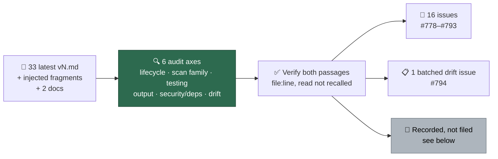

# 🧭 Cross-prompt contradiction audit (Issue #762)

A one-off audit of the **latest** version of every prompt surface for
contradictions **between** prompts — one surface mandating what another forbids,
conflicting numbers or policies for the same thing, and terminology drift. It is
the between-prompt counterpart to [#759], which recorded a contradiction *within*
one rendered prompt.

This page is a record, not a rubric. It never prescribes a wording; every
finding is filed as its own issue with both conflicting passages quoted.
Committed `vN.md` files are immutable, so a prompt-side fix always lands in a new
version.

[#759]: https://github.com/stSoftwareAU/VibeCoder/issues/759

## Method

Six axes were swept in parallel across the whole comparison set, then **every**
candidate was re-verified by reading both quoted passages at their cited lines
before anything was filed. Two candidates were refuted at that step and are
recorded below rather than filed.

A difference in job scope is not a contradiction. A finding had to answer yes to
one of: *would an agent reading both surfaces be told to do opposite things?*, or
*do the two give different numbers, lists or shapes for the same thing?*

## Surfaces compared

All 33 phase templates, latest version only. Older `vN.md` files are immutable
history and out of scope.

| Template | Version | Findings |
| --- | --- | --- |
| `alert_feed` | v2 | none |
| `bash_script_refs` | v3 | none (its no-ceiling exemption is stated and justified) |
| `bash_syntax_audit` | v4 | contributed evidence to #789 |
| `best_practices` | v12 | contributed evidence to #788, #789 |
| `ci_fix` | v14 | #778, #779, #780, #783 |
| `coding_guidelines` | v42 | #780, #781, #782, #783, #784, #786, #787, #793 |
| `coding_guidelines_claude` | v1 | none |
| `dead_code` | v6 | #792 |
| `deprecated_api` | v5 | #792 |
| `doc_coverage` | v7 | #790, #792 |
| `documentation_audit` | v9 | none |
| `duplicated_knowledge` | v4 | #792, #794 |
| `format_drift` | v6 | #792 |
| `github_actions_audit` | v18 | #787, #790, #792 |
| `grill-me` | v15 | none — #759 is fixed here and the fix holds |
| `issue` | v39 | #780, #783, #785, #786 |
| `merge_conflict` | v2 | none |
| `orphan_deps` | v6 | #788, #792 |
| `planning` | v23 | #778, #780 |
| `planning_critique` | v7 | #780, #781 |
| `pr_feedback` | v13 | #778, #780, #783 |
| `private_repo_reference_audit` | v4 | #792 |
| `question` | v9 | #779, #782 |
| `quorum` | v1 | #779 |
| `quorum_judge` | v1 | #779 |
| `retro` | v1 | #789 |
| `security_scan` | v31 | #788, #790, #791, #792, #794 |
| `spelling_fix` | v7 | #779 |
| `supply_chain_detection` | v5 | #792 |
| `supply_chain_readiness` | v8 | #792 |
| `test_audit` | v12 | #786 |
| `workflow_annotation_scan` | v3 | none |
| `workflow_setup` | v8 | #787 |

Fragments injected at render time, and the two documents in scope:

| Surface | Findings |
| --- | --- |
| `worker/deno/lib/verbosity.ts` — the four `VERBOSITY_INSTRUCTIONS` texts | #778, #779 |
| `worker/deno/lib/config_defaults.ts` — `PHASE_VERBOSITY_DEFAULTS` | #778 (unreachable for every phase but `issue`) |
| `CODING-STANDARDS.md` | #784, #785, #786, #793 |
| `docs/PROMPT-BEST-PRACTICES-CHECKLIST.md` | #794 (American spellings in two rubric rows) |

Code read as ground truth when a prompt made a factual claim about behaviour:
`worker/deno/lib/label_security.ts`, `claimed_issue_guard.ts`,
`gitignore_enforcer.ts`, `prompt_builder.ts`, `prompt_manager.ts`,
`execute_claude_phase.ts`.

## Findings filed

| Issue | Class | The conflict, in one line |
| --- | --- | --- |
| [#778] | direct | `ci_fix`, `pr_feedback` and `planning` ask for the narration the rendered `standard` verbosity text forbids — #759 surviving in three more prompts |
| [#779] | direct | The verbosity block's trailing "summarise what you changed" collides with five phases' fixed output skeletons, including a machine-parsed verdict block |
| [#780] | direct | `needs-human` is self-appliable in `coding_guidelines` and reserved in `issue`/`ci_fix`/`pr_feedback`; the code sides with the former |
| [#781] | direct | `planning_critique` must run `gh issue close`; the block rendered with it says the guard refuses that verb |
| [#782] | direct | `question` forbids every write; the injected escalation and escape hatch require a label, an issue and a comment |
| [#783] | direct | `git commit --no-verify` is categorically forbidden in the guidelines and conditionally permitted in `issue` and `pr_feedback` |
| [#784] | policy | The hidden-file staging allowlist has different membership in `coding_guidelines/v42` and `CODING-STANDARDS.md`, and both differ from the enforcer |
| [#785] | direct | "All quality checks MUST pass before creating a PR" vs "after 3 attempts, commit what you have" — over a gate that includes semgrep |
| [#786] | policy | Timing assertions in unit tests: the guidelines forbid, `CODING-STANDARDS` mandates, `test_audit` files a finding against them |
| [#787] | policy | SHA-pinning has a first-party carve-out in `github_actions_audit` and none in `workflow_setup`; "first-party" names two disjoint sets |
| [#788] | direct | `orphan_deps` severity emoji map is shifted one band from 13 siblings and collides with `security_scan`'s red |
| [#789] | direct | `retro` honours a bare suppression marker that twelve siblings refuse and report |
| [#790] | policy | At >6 findings `security_scan` mandates an overflow tracker `github_actions_audit` forbids |
| [#791] | policy | `security_scan`'s exclusive `gh` allowlist omits the `gh label create` twelve siblings require — on the only scan needing `confidence:*` labels |
| [#792] | bug | 11 latest templates declare the previous version in their H1 title |
| [#793] | policy | `CODING-STANDARDS.md` claims the injected template carries TDD; the template has none |
| [#794] | drift | Terminology and structural drift across the set, batched |

[#778]: https://github.com/stSoftwareAU/VibeCoder/issues/778
[#779]: https://github.com/stSoftwareAU/VibeCoder/issues/779
[#780]: https://github.com/stSoftwareAU/VibeCoder/issues/780
[#781]: https://github.com/stSoftwareAU/VibeCoder/issues/781
[#782]: https://github.com/stSoftwareAU/VibeCoder/issues/782
[#783]: https://github.com/stSoftwareAU/VibeCoder/issues/783
[#784]: https://github.com/stSoftwareAU/VibeCoder/issues/784
[#785]: https://github.com/stSoftwareAU/VibeCoder/issues/785
[#786]: https://github.com/stSoftwareAU/VibeCoder/issues/786
[#787]: https://github.com/stSoftwareAU/VibeCoder/issues/787
[#788]: https://github.com/stSoftwareAU/VibeCoder/issues/788
[#789]: https://github.com/stSoftwareAU/VibeCoder/issues/789
[#790]: https://github.com/stSoftwareAU/VibeCoder/issues/790
[#791]: https://github.com/stSoftwareAU/VibeCoder/issues/791
[#792]: https://github.com/stSoftwareAU/VibeCoder/issues/792
[#793]: https://github.com/stSoftwareAU/VibeCoder/issues/793
[#794]: https://github.com/stSoftwareAU/VibeCoder/issues/794

## Recorded, not filed

Candidates that survived the sweep but not verification. Recorded so the next
audit does not re-derive them, with what would settle each.

- **`ci_fix` may raise a timeout "with justification"; the guidelines say "do
  not raise the timeout"** — `prompts/ci_fix/v14.md:15` vs <!-- pinned: this audit records what the versions read at the time it was taken; v15 landed with Issue #778 -->
  `prompts/coding_guidelines/v42.md:453`. <!-- pinned: what that version read when the audit was taken; v43 landed with Issue #780 --> Not filed because the two plausibly
  name different knobs: `v42`'s rule is about the unit-test speed budget,
  `ci_fix`'s `timing` category can mean a job-level `timeout-minutes`. Neither
  file draws that line. Settled by stating the scope in whichever surface is
  bumped next.
- **`issue/v39.md:464` prescribes rebasing to resolve conflicts;
  `merge_conflict/v2.md:12-16` forbids `git rebase` "in every case"** — not
  filed because the two govern different branches (your own working branch vs a
  PR you did not author), which reconciles them. It would become a finding if
  `issue`'s step were read as applying after the branch is pushed, where it
  collides with `v42:763-768` on rewriting published history.
- **Caret/tilde ranges are a `best_practices/v12.md:241-243` finding and
  explicitly not one in `supply_chain_detection/v5.md:294-297`** — the
  qualifier "in release manifests" plausibly scopes `best_practices` to
  published libraries. Worth noting this repo's own `worker/deno/deno.json`
  uses caret ranges.
- **The attribution footer is required by 13 filing scans and absent from
  `supply_chain_detection/v5` and `supply_chain_readiness/v8`** — both state
  their body as a closed spec ("exactly this shape"), so the omission may be
  deliberate. Could not confirm it is unintended.
- **`format_drift/v6.md:465-467` attaches no `severity:*` label where 14
  siblings attach exactly one** — a single-finding, always-same-severity scan is
  plausibly exempt from the ramp; the file states the prohibition without giving
  that reason.
- **`gh pr merge` is listed among available tools in `coding_guidelines/v42.md:293`
  while `ci_fix/v14.md:102` forbids merging and `v42:642-647` forbids
  auto-merging a dependency PR** — the list reads as a CLI enumeration rather
  than a grant.

## What the audit did not cover

- Older `vN.md` files — immutable history, out of scope by the issue's terms.
- Alignment against Anthropic's external prompting guides — that is #747's job.
  This audit checked the prompts against **each other**.
- Whether each rule is a good rule. Only whether two surfaces can both be obeyed.

## The recurring shape

Eight of the seventeen findings have one shape: **a phase prompt and the
`<coding_guidelines>` block injected beneath it disagree**, and the phase prompt
never says which wins. `coding_guidelines/v42.md:5-8` states a precedence rule
("where a task instruction is more specific, follow it"), but it does not reach
a phase prompt that *forbids* what the block *mandates* — precedence resolves
specificity, not opposition. The durable fix for that class is not sixteen
wording changes; it is a rendered-prompt consistency check that fails when a
phase template and the block it renders with issue opposite mandates over the
same verb.
