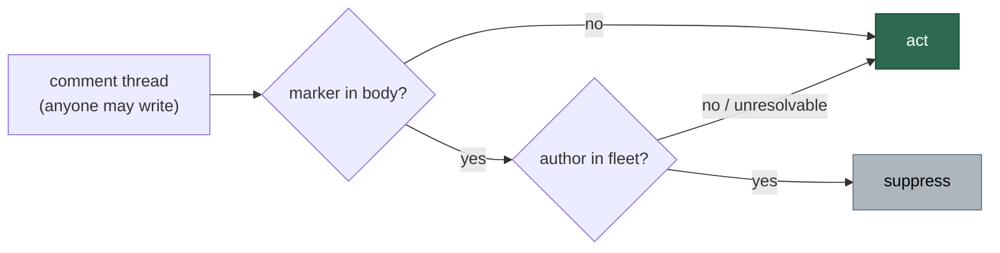

# 🔎 Security sweep — untrusted GitHub-data ingestion in `worker/deno/lib/`

**Issue:** [#1216](https://github.com/stSoftwareAU/VibeCoder/issues/1216) (chunk
12c) · **Parent:** #1209 `security-scan-overflow: 4 chunks not reached`

This record exists so a later run can tell a **swept** path from an unswept one.
The parent scan swept the three modules built to defend the internet-unauth
boundary — `prompt_delimiter.ts`, `run_injection_scanner.ts`,
`worker_label_guard.ts` — and found nothing. It did not sweep the modules that
*consume* GitHub data downstream of those defences. This slice did.

Its sibling is
[`security-sweep-1214-subprocess-argv.md`](security-sweep-1214-subprocess-argv.md)
(chunk 12a, subprocess and argv construction).

## Scope and method

The file list was regenerated with the command the issue specifies:

```bash
cd worker/deno
comm -23 \
  <(grep -rl "gh_spawn\|runGhOrThrow\|spawnGh\|JSON.parse" lib/ --include='*.ts' | grep -v '_test\.ts$' | sort) \
  <(cat \
      <(grep -rl "Deno.Command" lib/ | sort) \
      <(comm -23 <(grep -rl "Deno.writeTextFile\|Deno.writeFile\|Deno.remove\|Deno.mkdir\|Deno.makeTempDir\|Deno.symlink\|Deno.open" lib/ | sort) <(grep -rl "Deno.Command" lib/ | sort)) \
    | sort)
```

**177 files**, all reviewed at their ingestion points across six parallel
per-file passes, plus targeted repo-wide greps for the prototype-pollution and
ReDoS shapes. Each GitHub-sourced field was classified before any trust decision
was traced through it:

| Authenticated | Attacker-writable (any GitHub account, public repo) |
| ------------- | --------------------------------------------------- |
| `author.login`, `authorAssociation`, `permissions`, API metadata (numbers, timestamps, `isDraft`, `mergeStateStatus`), label application (needs triage rights) | issue title, issue body, comment body, PR title, PR body, head branch name, label *text*, commit message, comment **reactions** |

Triage followed the Phase 3 discipline of
[`SECURITY-SCAN.md`](../SECURITY-SCAN.md): refute-unless-proven, then severity
recalibrated for the internet-unauth exposure band. A candidate that could not be
traced from a **named** attacker-writable field to the dangerous use was dropped
rather than filed.

> **This is not an empty result.** The issue asks that an empty result be stated
> explicitly; it was not empty. Nineteen distinct root causes survived triage.

## The class fixed in this sweep

### SEC-1216-01 — comment-marker dedup with no author evidence (6 sites)

`severity:high` · `confidence:high` · **fixed**

A worker module decides whether to act by asking GitHub whether a marker is
already on a comment thread. A comment body is text any GitHub account may
write; the **author** is the only authenticated part of a match. Six sites read
the marker and not the author, and every one of them fails towards silence —
the direction nobody notices.

| Site (pre-fix) | Marker | What a planted comment did |
| -------------- | ------ | -------------------------- |
| `lib/issue_comment_pages.ts` `issueCommentsContainMarker` | any | **The shared one.** Substring-matched the raw page JSON, so it matched a marker anywhere in the payload, from anyone. Four callers: the blocking-PR stall escalation (suppressed outright), each stall-reason comment, the self-schedule announcement, the CI-nudge audit trail |
| `lib/needs_human_escalation.ts` | `<!-- needs-human-escalation: <key> -->` | Every production dedup key is derivable from public numbers (`context-budget-<n>`, `merge-blocked:<repo>#<pr>`, `cross-repo-pr-<n>`, …), so one invisible HTML comment silenced a hand-off's "why / next step" explanation for 24 h |
| `lib/run_failure_issue.ts` | `<!-- VIBE_RUN_FAILURE_FOLLOWUP:<class>:<epoch> -->` | The epoch is attacker-chosen and unbounded, so `t - epoch < window` stayed true for ever and the descending sort put the forged comment first. Every later occurrence of the class was `PATCH`ed onto the attacker's comment — or, when that edit was refused, the class was permanently `suppressed:gh_failed`. Step 1 of the same function already author-verified the *issue* match; step 3 dropped the discipline |
| `lib/milestone_branch_self_heal.ts` | `<!-- vibe-coder:milestone-retarget -->` | Permanently exempted a PR from being retargeted at its milestone branch, so its work merged to the default branch outside the milestone |

**Why the existing gate did not catch it.** `marker_dedup_author_manifest.ts`'s
scanner recognises two shapes: a `--search` expression matching `in:title` /
`in:body`, and a `gh api …/comments --jq` that both selects on `.body` and
projects `.body` back. None of these six sites is either — they page raw REST
comments with no `--jq` at all, or project without a `select(.body`. Both
manifest lists were empty and stayed empty while six live instances of the class
sat in the tree. That is the blind spot this sweep found, and it is the reason
`MARKER_DEDUP_AUTHOR_UNVERIFIED_CONSUMERS` exists.

**The fix.** All six now route through `selectFleetAuthoredComments`
(`lib/alert_dedup_authors.ts`) — the control already applied at
`stale_workflow_detector.ts` and `failure_detection_resume.ts` — so the
comparison set is the fleet identity (`service_accounts` ∪ `fleet_pr_authors` ∪
`GITHUB_USER`). Every one of these markers **suppresses** an action, so the fail
direction is uniform and safe: an unresolvable fleet identity discards every
match, the suppressed action goes ahead, and the condition is logged loudly.

`issueCommentsContainMarker` additionally now parses each page and matches the
marker **in a comment body**, not anywhere in the raw JSON.



## Findings filed, not fixed here

Each is a distinct root cause from SEC-1216-01 and from each other. The per-run
filing cap of six was reached, so the remainder is carried by an overflow
tracker rather than dropped.

- **SEC-1216-02** ([#1243](https://github.com/stSoftwareAU/VibeCoder/issues/1243))
  — `lib/idle_task_snapshot.ts` reads the `<!-- finding-id: … -->` marker out of
  open issue **bodies** with `--json number,body` and no author check. One issue
  anybody opens, carrying a deterministic finding id, suppresses that real
  finding on every subsequent scan across ~12 scanners. The #1097 class exactly.
  `severity:high` · `confidence:high`
- **SEC-1216-03** ([#1244](https://github.com/stSoftwareAU/VibeCoder/issues/1244))
  — the planning close-out path decides from unauthenticated text at four sites:
  `planning_processor.ts`'s two sub-issue look-ups (`Part of #N` in a body, no
  `author:` qualifier, no fork check), `planning_carrier.ts`'s `nothing-to-do`
  comment signal, and `plan_coverage_gate.ts`'s first-match coverage table.
  `severity:high` · `confidence:high`
- **SEC-1216-04** ([#1245](https://github.com/stSoftwareAU/VibeCoder/issues/1245))
  — measured catastrophic backtracking in `plan_coverage_gate.ts`'s
  `SEPARATOR_RE`, applied to every line of every comment with no length cap:
  2 000 dashes → 13.7 ms, 40 000 → 5.4 s, quadratic; one 64 KB comment costs
  ~14 s. `severity:medium` · `confidence:high`
- **SEC-1216-05** ([#1246](https://github.com/stSoftwareAU/VibeCoder/issues/1246))
  — `MILESTONE_TRACKING_TITLE_RE` classifies a worker tracking issue from its
  **title** alone, not the body marker the worker writes and not the author. A
  retitled third-party issue makes `openCount` read 0 → milestone declared
  complete → milestone branch deleted, and gets `gh issue close`d by the worker.
  `severity:high` · `confidence:medium`
- **SEC-1216-06** ([#1247](https://github.com/stSoftwareAU/VibeCoder/issues/1247))
  — consumers that parse `fetchIssueCommentPages`' raw array themselves:
  `pr_merge_conflict_scan.ts`'s `parseConflictAttempts` (two planted
  `CONFLICT_FAILED_MARKER` comments make the worker **close the PR**) and
  `conflict_abandon_restart.ts`'s `restartMarkerPrNumbers` /
  `summariseFailedAttempts`. Filed rather than fixed alongside SEC-1216-01
  because the restart marker suppresses a *destructive* action, so its fail
  direction needs a decision rather than the uniform "discard and act".
  `severity:high` · `confidence:high`
- **SEC-1216-07** ([#1248](https://github.com/stSoftwareAU/VibeCoder/issues/1248))
  — `completion_phase.ts` interpolates the issue title into the PR title
  unscrubbed. An issue titled `Add caching [#999]` produces a fleet-authored PR
  that every title matcher reads as referencing #999; once merged, #999 is
  permanently skipped. `severity:medium` · `confidence:high`
- **SEC-1216-08** ([#1249](https://github.com/stSoftwareAU/VibeCoder/issues/1249))
  — overflow tracker carrying the twelve further findings the cap displaced:
  the `CLAIM_LOCK` liveness forgery in `idle_task_activity.ts`, the
  last-comment scan-outcome classification in `idle_task_freshness.ts`, the two
  comment-suppression markers in `milestone_children_gate.ts`, the nonce-less
  `[TRUSTED - <login>]:` header in `comment_trust_filter.ts`, the
  reaction-driven gating in `pr_comments.ts` / `pr_maintenance.ts`, the
  `workerId` replay in `pr_branch_lock.ts`, the unfiltered stale-claim comment
  deletion in `claim_pr_comment.ts`, three unfenced untrusted-text-outward
  paths, the `</open_issue_titles>` escape in the best-practices prompt, the
  branch-name-driven merge method in `direct_merge.ts`, the body-driven
  dependency classification in `idle_detect_diagnostics.ts`, and the
  unauthenticated cost tally in `issue_run_stats_comment.ts`.

## What the two negative sweeps found

The issue names prototype pollution and ReDoS as classes to look for. Both were
swept and both came back all but empty; recorded here so a later run does not
repeat them.

- **Prototype pollution — no finding.** There is no `{...parsed}`,
  `Object.assign(target, parsed)` or recursive merge of `gh` output anywhere in
  the 177 files. The only `obj[key] = …` loops over parsed data read the
  operator's local `.config.json` (`config.ts`), a local state file
  (`pr_branch_update_failure_streak.ts`, `merged_sweep_watermark.ts`,
  `timeout_tracker.ts`) or the launcher's own environment
  (`custom_prompt_mounts.ts`, `container_tools_config.ts`) — none is reachable
  from GitHub data, and each writes into a fresh literal. `config.ts` is a
  genuine `__proto__` assignment primitive over a **local operator file**, which
  is outside this trust model but worth knowing.
- **ReDoS — one finding, filed as SEC-1216-04.** Every other regex applied to
  remote text either uses disjoint alternation (the JSON-string idiom in
  `dependency_conflict_json.ts` / `dependency_conflict_decisions.ts`), is
  line-anchored with a bounded prefix (`failure_detection_gate.ts`,
  `gh_auth.ts`, `issue_run_stats_comment.ts`), or is length-capped before the
  match (`ci_failure_issue.ts`). `claim_pr_comment.ts`'s
  `/<!-- PR_COMMENT_CLAIM:(.+):(\d+) -->/` is the nearest miss — polynomial, not
  catastrophic, because `.` is disjoint from `\n` and the prefix is a literal.

## Refuted / no finding

Named here so a later sweep does not re-litigate them.

- **Author-verified dedup, already correct** — `host_escalation.ts`,
  `idle_inversion_streak.ts`, `idle_task_backfill.ts`,
  `bump_script_failure_streak.ts`, `escalate_as_work.ts`,
  `container_restart_backoff.ts` (all `selectFleetAuthoredMatches`);
  `heartbeat_sweep.ts` and `merge_conflict_stall_watchdog.ts` (`isFleetAuthor`
  before the marker counts); `claim_issue.ts` (every `CLAIM_LOCK` decision —
  pre-claim, stale cleanup, race resolution); `stale_workflow_detector.ts`;
  `failure_detection_resume.ts`.
- **Label-scoped listings** — `idle_task_issue.ts`,
  `idle_task_cooldown_gate.ts`, `idle_task_backlog_gate.ts`,
  `security_tree_sweep.ts`. Applying a label needs triage permission, so the
  candidate set is not attacker-supplied.
- **Title matching that drops fork heads** — `issue_query.ts`
  `fetchPRsForIssueByTitle`, and both consumers (`pr_issue_linking.ts`,
  `pr_linkage.ts`). Pushing a branch into the target repository needs write
  access there, so a same-repository head is evidence.
- **Timeline-authored label trust** — `label_security.ts`,
  `custom_label_pr_finder.ts`, `pr_invitation_lookup.ts`,
  `issue_edit_actor.ts`. All paginate to exhaustion and fail closed.
- **Shape-validated `gh --json` parsing** — `github.ts` (`validateGhIssueJson`,
  `parseCreatedCommentJson`), `validation.ts`, `timeline_batch.ts`,
  `check_runs_batch.ts`, `comment_batch.ts`, `backlog_fetch.ts`,
  `bulk_triage.ts`, `alert_feeds/*.ts`, `github_rate_limit_preflight.ts`,
  `superseding_pr.ts`, `stranded_issue_branch.ts`, `stale_branch_lineage.ts`,
  `scan_cursor.ts`. Every field is `typeof`-narrowed before use; no
  cast-then-access crash path.
- **Ref and slug validation before argv** — `git_pull.ts` / `git_push.ts`
  (`assertSafeGitRef`), `pr_branch_state.ts` (charset validation before GraphQL
  interpolation), `planning_milestone.ts` → `git_branch.ts` (reduced to
  `[a-z0-9-]{0,50}`), `container_image_prune.ts`.
- **Full delimiter discipline already applied** — `planning_processor.ts`'s
  prompt assembly, `quorum_orchestrator.ts`, `refinement_processor.ts`,
  `cross_repo_pr_handoff.ts` (`sanitiseDeclarationField` + `REPO_SLUG_PATTERN` +
  `isSafeRef` + leading-`-` check), `pr_spelling_processor.ts` (fenced in
  `prompt_builder.ts`), `pr_review_context.ts`.
- **Not reachable** — `stuck_recovery.ts`'s `fetchMarkerAuthors` (the set is
  only consulted against **assignees**, and GitHub refuses assignees without
  push access); `reported_check_names.ts` (names intersected with a hardcoded
  catalogue before reaching a ruleset); `seed_idle_tasks_request.ts` (the
  title-derived slug only *selects* an operator-configured repo);
  `cross_repo_fix.ts` `openCrossRepoFixPr` (no production caller);
  `branch_push_policy.ts` (misclassification needs default-branch push access
  already); `references_source_probe.ts` (curated `docs/REFERENCES.md` list).
- **`gh_guard_decision.ts`** — fail-closed body scan; the denylist is normalised
  through the same helper as the argv it guards.
