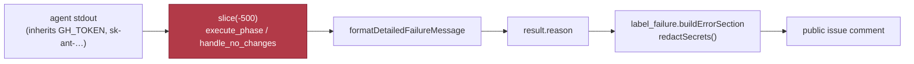

# 🔎 Security sweep — environment, configuration and secret-sink coverage in `worker/deno/lib/`

**Issue:** [#1217](https://github.com/stSoftwareAU/VibeCoder/issues/1217) (chunk
12d) · **Parent:** #1209 `security-scan-overflow: 4 chunks not reached` ·
**Siblings:** [chunk 12a](security-sweep-1214-subprocess-argv.md) (subprocess and
argv), [chunk 12b](filesystem-path-temp-sweep-1215.md) (filesystem and paths),
[chunk 12c](security-sweep-1216-untrusted-github-ingestion.md) (untrusted GitHub
ingestion) — disjoint by construction

This record exists so a later run can tell a **swept** path from an unswept one.
The parent scan swept `lib/secret_redaction.ts` itself (chunk 5) and found the
redactor sound. A redactor is only as good as the set of paths that route through
it, and **that set had never been enumerated**. This slice enumerates it, and
reads every remaining `Deno.env` reader in `lib/` at its environment and
config-load sites.

> **This is not an empty result.** The issue asks that an empty result be stated
> explicitly; it was not empty. Sixteen root causes survived triage — two fixed
> in this change, fourteen filed.

## Scope and method

The slice is the env-reading `lib/` modules **minus** the three sibling slices,
regenerated with the commands each sibling issue specifies:

```bash
cd worker/deno
grep -rl "Deno.env" lib/ --include='*.ts' | grep -v '_test\.ts$' | sort > env.txt
grep -rl "Deno.Command" lib/ --include='*.ts' | grep -v '_test\.ts$' | sort > subproc.txt
comm -23 <(grep -rl "Deno.writeTextFile\|Deno.writeFile\|Deno.remove\|Deno.mkdir\|Deno.makeTempDir\|Deno.symlink\|Deno.open" lib/ --include='*.ts' | grep -v '_test\.ts$' | sort) subproc.txt > fs.txt
comm -23 <(grep -rl "gh_spawn\|runGhOrThrow\|spawnGh\|JSON.parse" lib/ --include='*.ts' | grep -v '_test\.ts$' | sort) <(cat subproc.txt fs.txt | sort) > ingest.txt
comm -23 env.txt <(cat subproc.txt fs.txt ingest.txt | sort -u)
```

`env.txt` holds **95** modules; subtracting the **304** files already covered by
chunks 12a/12b/12c leaves **45** for this slice. All 45 were read at their
`Deno.env` reads and config-load sites against four questions: fail-open config
parsing, env-var trust for security decisions, secret material reaching a sink,
and a token written to disk or placed on a command line.

The **sink enumeration** is repo-wide by necessity — a sink that bypasses the
redactor is the finding whether or not its module reads the environment — so it
covers `lib/`, `commands/`, `mod.ts`, `quality.ts` and `setup/`. The **token
scope and lifetime** trace is likewise repo-wide, as the issue's scope paragraph
requires.

Triage followed the Phase 3 discipline of
[`SECURITY-SCAN.md`](../SECURITY-SCAN.md): refute-unless-proven. A candidate that
could not be traced from a named attacker- or non-operator-controlled input to a
concrete bad outcome was dropped rather than filed; the dropped ones are recorded
below so the next run does not re-derive them.

## The chokepoints, as they actually behave

Every classification below rests on these facts, each read rather than assumed:

| Fact | Evidence |
| --- | --- |
| `redactSecrets` is sound and deliberately never truncates its input | `lib/secret_redaction.ts:24-27` |
| The logger redacts its whole write path | `lib/logger.ts:218` — `sink(redactSecrets(msg))` |
| The console patch redacts **string arguments only**, in the **installing process only** | `lib/console_redaction.ts:66-69`; the sole install site is `mod.ts:491` |
| `spawnGh` is the only `Deno.Command("gh", …)` in the worker, and it calls `redactGhBodyArgs(args)` with **no reader and no writer** | `lib/gh_spawn.ts:154`, `:226`; enforced by `lib/gh_spawn_chokepoint_check.ts` |
| The audit journal records verb/repo/target/scope — **no body text** | `lib/audit_mutation_classifier.ts:478-556`, `lib/audit_journal.ts:575` |

The consequence worth stating plainly: **the worker's own `gh` chokepoint is
strictly weaker than the shim it guards the agent with.** `lib/gh_guard_cli.ts:237`
supplies both a `BodyFileReader` and a `BodyFileWriter`, so the agent's
`--body-file` and `--input` bodies are scanned and an unscannable body fails
closed. `spawnGh` supplies neither, so those branches are skipped outright
(`lib/gh_body_redaction.ts:148`) — and the repo's own test asserts that behaviour
(`tests/gh_body_redaction_test.ts:97`). That is SEC-1217-03 (#1254).

## Sink enumeration

### 1 · Logs, stdout and stderr

| Sink | Verdict |
| --- | --- |
| ~292 `console.*` calls across `lib/` and `commands/` | `covered-by-console-patch` — when reached through `mod.ts main()` |
| `mod.ts:834,838` | `covered-by-console-patch` |
| `quality.ts:68,74,81,83`; `lib/quality_gate.ts:1309,1385` in that process | **BYPASS** — SEC-1217-12 (#1280): `quality.ts` never installs the patch |
| `setup/setup_cli.ts:168`, `setup/prerequisite_installer.ts:170` | fixed prompt text; a further uninstrumented entrypoint, folded into #1280 |
| `lib/gh_guard_cli.ts:261` (`Deno.stdout.write`) | not a leak — the payload is already through `redactGhBodyArgs` |
| `lib/gh_guard_cli.ts:262` (`console.error`) | separate process, no patch; content is `[SECURITY]` marker text plus a decision reason |
| `pull.log`, `run_core.log` | **BYPASS** — SEC-1217-07 (#1258) |

### 2 · GitHub writes

| Sink | Verdict |
| --- | --- |
| `--body` / `--body=` / `-f body=` across `lib/github.ts`, `lib/pr_comments.ts`, `lib/crash_notification.ts`, `lib/gh_escalation_client.ts`, … | `covered-by-spawnGh` |
| `--body-file`, `-F <path>`, `-f key=@path`, `--input <path>` (`lib/repo_settings_harden.ts:484-485`, `lib/milestone_ruleset_check.ts:753`) | **BYPASS**, fail-**open** — SEC-1217-03 (#1254) |
| piped stdin bodies (`lib/security_sarif_upload.ts:196-215`, `lib/repo_rulesets.ts:328-361`) | **BYPASS** — SEC-1217-03 (#1254); the SARIF leg is also SEC-1217-04 (#1255) |
| `--title`, `-f title=`, `-f description=`, `-f name=` | **BYPASS** — SEC-1217-15 (#1283) |
| `git commit -m <message>` via `runGitCommand` | **BYPASS** — SEC-1217-16 (#1284) |
| the agent's own `git commit && git push` (no `git` PATH shim exists) | **BYPASS** — SEC-1217-16 (#1284), the sharper half |
| `fetch()` to `api.github.com` | none exists — verified |

### 3 · Files written under the work volume or the repo

| Sink | Verdict |
| --- | --- |
| `lib/agent_transcript.ts:158,166,180` | `explicit-redactSecrets-call`, line-buffered so a chunk split cannot hide a secret |
| `lib/handover_note.ts:323,436` | `explicit-redactSecrets-call` |
| `lib/crash_notification.ts:190-193`, `lib/run_callbacks.ts:293-297` | `explicit-redactSecrets-call`, **and in the correct order** (redact → truncate) |
| audit journal and anchors | no redaction, but no body text is stored — verified, not assumed |
| state / journal / counter files (`resume_state_store.ts`, `content_approval_tracker.ts`, `fault_tolerance_counters.ts`, `pr_ci_checks.ts`, `credit_tracker.ts`, `context_budget.ts`, …) | payloads are enums, counters, SHAs and ISO timestamps — no free text |
| `lib/claude_runner.ts:1134` (assembled prompt → temp file) | by design: it is the agent's stdin, 0600, removed with the run |
| `lib/secrets_history_scan.ts:865` | **well designed** — gitleaks is run with `--redact` and the `Secret`/`Match`/`Raw` fields are deliberately never read |
| `lib/gh_credential_stage.ts:189` | intentional credential staging, not a redaction sink — but see SEC-1217-14 (#1282) |

### 4 · Artefacts and SARIF

| Sink | Verdict |
| --- | --- |
| `lib/security_sarif_upload.ts:191-215` | **BYPASS** — SEC-1217-04 (#1255). The finding text is `stripSeverityEmoji(issue.title)`, i.e. untrusted issue text, and `gzipBase64` renders any surviving secret opaque to every downstream scanner as well |
| `lib/imgbb_upload.ts:128-140` | intentional API auth in a form field; the error paths carry no key |

### 5 · On-disk caches

| Cache | Verdict |
| --- | --- |
| `.gh-scan-cache` (`lib/issue_cache.ts:200`) | raw issue JSON including untrusted bodies, unredacted — SEC-1217-10 (#1261) |
| `lib/baseline_quality_cache.ts:340,365` | raw quality-gate subprocess output, unredacted, replayed into a public comment — SEC-1217-10 (#1261) |
| `.gh-timeline-cache` (`lib/timeline_cache.ts:86-134`) | label events only; `ensurePrivateDir` / `verifyPrivateDir` hardened. Clean |
| `lib/comment_cache.ts:50` | in-memory only, never reaches disk. Clean |
| `lib/prompt_cache.ts`, `health_check_cache.ts`, `codebase_map_cache.ts`, `default_branch_cache.ts` | template text and structured values. Clean |

### 6 · Truncate-before-redact

`SECURITY.md` requires `redactSecrets()` to run over the whole text **before** any
size cap. Cutting first splits a credential, and every rule in
`secret_redaction.ts` is anchored on the credential's **leading** bytes — `ghp_`,
`github_pat_`, `sk-ant-`, `AIzaSy`, the `AKIA…` id that precedes an AWS secret,
the `Bearer` scheme, the `TOKEN=` key of an assignment — so the fragment matches
nothing at the sink and is published.

| Site | Verdict |
| --- | --- |
| `lib/failure_message.ts:142,161` and the ten phase-module call sites feeding it | **fixed in this change** — see below |
| `lib/kill_diagnostics.ts:86,94` | **fixed in this change** — SEC-1217-05 (#1256) |
| `lib/pr_failure_actions.ts:187-189`, `lib/ci_failure_issue.ts:356` (the inversion documented in their own comments) | SEC-1217-06 (#1257) |
| `lib/quality_helpers.ts:277,283,366`; `lib/claude_runner.ts:176,2452,2572`; `lib/bump_deps.ts:257`; `lib/github_status.ts:117` | SEC-1217-06 (#1257) |
| `lib/crash_notification.ts:190-193`, `lib/bump_deps.ts:194-197`, `lib/dependency_lock_regen.ts:290-299`, `lib/run_callbacks.ts:293-297`, `lib/phases/handle_no_changes_phase.ts:56` | **correct order** — the pattern to copy |

### 7 · Config or env interpolated into an error or a report

No finding. `Deno.env.toObject()` appears only as subprocess `env:` construction,
never interpolated into a message. `lib/first_run_verification.ts:678` and
`lib/quorum_orchestrator.ts:910` render through `redactSecrets` or over numeric
values. `lib/config_validator.ts` echoes the App id and the key **path**, never
key material. No `throw new Error` interpolating an env value was found.

## Token scope and lifetime

| Credential | Read at | Propagates to | Written to disk? |
| --- | --- | --- | --- |
| GitHub App PEM | `lib/gh_auth.ts:112-116`, `lib/gh_spawn.ts:113-115` | worker process only; denied to every agent child by name (`lib/agent_env.ts:41-45`); never mounted into the container | **No** — signed in memory via `crypto.subtle` |
| Installation token (minted) | `lib/github_app_auth.ts:294-327` | in-memory cache; injected as `GH_TOKEN` into **one** `gh` subprocess env (`lib/gh_spawn.ts:119-121`) | **No** |
| Ambient `GH_TOKEN` / `GITHUB_TOKEN` | `lib/credential_preflight.ts:106-107` (presence only) | allow-listed into every agent child (`claude_env.ts:115`, `codex_env.ts:57`, `gemini_env.ts:58`, `deepseek_env.ts:102`) | only by `setup/launchagent.ts:99-141`, plist written and chmod'd 0600 — it is the service definition |
| gh `hosts.yml` `oauth_token` | `lib/gh_credential_stage.ts` | mounted read-only into the container; `GH_CONFIG_DIR` inherited by the agent child | **Yes** — SEC-1217-14 (#1282) |
| Provider tokens (`ANTHROPIC_*`, `OPENAI` / `CODEX` / `GEMINI` / `GOOGLE` / `DEEPSEEK_API_KEY`) | `lib/credential_preflight.ts:342-465` | exactly one per vendor reaches the matching agent child, all with `clearEnv: true`; cross-vendor and suffixed names explicitly denied (`agent_env.ts:126-134`). Also inherited by `runPreSetupCommand` — SEC-1217-17 (#1285) — and by the gate's `deno test` stage — SEC-1217-13 (#1281) | **No** |
| `VIBE_IMGBB_API_KEY` | `.config.json` → `lib/optional_feature_env.ts:74-118` | denied to every agent child by name; the config file it comes from is mounted read-only into the container | already on disk in `.config.json` |
| Per-repo quality credentials | `lib/repo_credentials.ts:127-143` | the quality-gate child only, layered over a **built** allowlist; `mint` stdout is piped, never inherited; only names are logged | **No** |

**Secrets on a command line: none.** The one historical case is fixed and
documented — `lib/imgbb_upload.ts:53-68` moved `--imgbb-api-key <key>` off the
argv into `VIBE_IMGBB_API_KEY`. `commands/github_app_auth.ts:54` takes a key
*path*, not material. The guard shim bakes only `GH_HOST` and `GH_CONFIG_DIR`
into its script. `lib/container_launch.ts:1108-1170` passes no credential via
`--env`; credentials reach the container only through read-only mounts. The
residual risk is the reverse direction — *reading* other processes' argv — which
is SEC-1217-05, fixed below.

**No tokenised git remote, no `.netrc`, no `credential.store`.** The only
credential helper configured is `!gh auth git-credential`, which holds no
material itself.

**The write boundary.** `lib/write_repo_allowlist.ts` keeps a per-slot
`AsyncLocalStorage` context (`:159-227`), seeded from the claimed issue's repo
(`:281-287`) and widened only by `registerWriteRepo` (`:308-320`), the refcounted
`pinWriteRepo` (`:382-387`) and `withScopedWriteRepo` (`:349-370`, removed in a
`finally`). All four are worker-process only: the agent's copy is a snapshot
baked at spawn, and a post-snapshot grant emits
`[SECURITY] [WRITE_REPO_GRANT_AFTER_SPAWN]` rather than silently widening. No
path was found where issue, PR or repo content reaches either seeding function.
The one fail-open is by design and documented — `isWriteRepoAllowed` returns true
while the context is inactive (`:429-437`). `lib/repo_credentials.ts` is likewise
operator-only: the spec comes from `.config.json`, the `mint` command is run as
trusted configuration, and values never reach a log (`:201-210`).

## Env-var trust for security decisions

Every environment variable that gates a guard, an allowlist or a window in this
slice was traced to its setter. All are host-operator inputs — `loop.sh`,
`container/entrypoint.sh`, the LaunchAgent plist, or the operator's
`.config.json` — none is settable from repository configuration, a workflow
input, or the agent's own environment. `VIBE_BUMP_QUARANTINE_HOURS`, the pattern
the issue names as the comparison, is in the same class.

| Variable | Guard it controls | Direction on a bad value |
| --- | --- | --- |
| `VIBE_AGENT_PROVIDER(S)`, `VIBE_IMAGE_AGENT_PROVIDERS` | which provider runs; the container marker | `parseEnvProviderId` **throws** on any set-but-bad value — fail-closed |
| `VIBE_RUN_MODE` | host vs container mode | any non-`container` value throws; cannot be coerced into a host-mode run |
| `CONFIG_PATH` → `lib/monitored_repos_allowlist.ts` | which repos may be written | a load failure yields `[]`, and **both** consumers treat `[]` as current-repo-only — fail-**closed**, not allow-all |
| `LOG_LEVEL`, `DEBUG` | log verbosity | `parseLogLevel` rejects garbage loudly and falls back |
| `VIBE_CONTAINER_MEMORY` / `CPUS` / `CPU_RESERVE`, disk floors | resource ceilings, not security guards | safe defaults; host-launcher-only |
| `VIBE_RUN_MAX_SECONDS`, `VIBE_RUN_STARTED_EPOCH` | the run's own wall-clock ceiling | malformed ⇒ **no ceiling**: fail-open by design, logged with a reason, and the supervisor's own `timeout` remains the real cap |
| `VIBE_IMAGE_AGENT_PROVIDERS` in the `gh` container fallback | whether the ambient-credential fall-through is re-enabled | keyed on **presence**, so an empty value re-enables it — SEC-1217-11 (#1262) |

The parent run noted chunks 3 and 7 are fail-closed on every error path. Config
loading generally is the same, with the two exceptions named above: `run_hard_cap`
(deliberate and backstopped by the supervisor) and the container fallback (filed).

## Fixed in this change

### SEC-1217-05 / SEC-1217-06 — redact-before-truncate, held by a type

`severity:high` · `confidence:high` · **fixed**

`SECURITY.md` has required redact-before-truncate since Issue #207, and Issue
#3636 applied it to the no-changes comment:

```ts
// worker/deno/lib/phases/handle_no_changes_phase.ts — the correct ordering
function publishableSnippet(claudeOutput: string): string {
  return redactSecrets(claudeOutput).slice(-3000);
}
```

Ten sibling call sites **in the same phase modules** used the inverted ordering.
They cut the agent's stdout to a 500-character tail and relied on the redaction
that runs later, in `label_failure.ts`, when the public failure comment is built:

```ts
lastOutputSnippet: state.claudeOutput.slice(-500) || undefined,
```

The traced path:



A credential straddling the cut arrives at `buildErrorSection` with its anchor
gone, so `redactSecrets` matches nothing. The AWS pair is the total case: the
secret access key is 40 characters of base64 alphabet with no shape of its own,
matched only through the `AKIA…` id that precedes it, so a cut between the two
publishes the whole secret verbatim.

The same inversion capped the kill-time diagnostics. That text is the
`ps -eo pid,ppid,rss,etime,args` table — **every** process's argv, so a token any
process on the host was handed on its command line lands in it — and
`formatProcessTable` cut each row to 89 characters before anything redacted it.

**Fixed at the type level, not per call site.** Per-call-site redaction is exactly
what drifted here: ten sites forgot the rule while their neighbour in the same
file applied it. `worker/deno/lib/redacted_text.ts` introduces `RedactedText`, a
branded string only `redactedTail()`, `redactedHead()` and `joinRedacted()` can
mint — and each redacts the whole input **before** it trims.
`FailureDiagnosticContext.lastOutputSnippet` now carries that brand, so
`claudeOutput.slice(-500)` no longer compiles. `parseProcessTable` redacts at the
single point both `ps` consumers pass through, before any truncation.

This is the durable form the issue's **Failure Detection** section asks for. It
carries the same intent as `lib/gh_spawn_chokepoint_check.ts` (Issue #3703) — a
whole-codebase invariant enforced by the quality gate — realised as a type rather
than a regex scan, so it has no false positives and cannot be defeated by a
spelling the pattern did not anticipate. The enforcing stage is `deno check`,
which `./quality.sh` runs.

**Fail direction stated.** Every regression test asserts the known-shaped fake
token is **absent** from the emitted output, so a broken ordering fails the test
rather than passing quietly. Two of them were observed failing against the
unfixed code and passing after the fix.

## Filed, not fixed here

| Finding | Issue | Severity |
| --- | --- | --- |
| SEC-1217-03 — `spawnGh` redacts argv only; `--body-file`, `--input` and stdin bodies are published unscanned | [#1254](https://github.com/stSoftwareAU/VibeCoder/issues/1254) | high |
| SEC-1217-04 — the SARIF payload is gzipped before any redactor can see it | [#1255](https://github.com/stSoftwareAU/VibeCoder/issues/1255) | high |
| SEC-1217-06 — the remaining truncate-before-redact inversions | [#1257](https://github.com/stSoftwareAU/VibeCoder/issues/1257) | medium |
| SEC-1217-07 — `pull.log` and `run_core.log` are written outside the logger | [#1258](https://github.com/stSoftwareAU/VibeCoder/issues/1258) | medium |
| SEC-1217-08 — `setup/` spawns `gh` directly and the chokepoint gate does not scan `setup/` | [#1259](https://github.com/stSoftwareAU/VibeCoder/issues/1259) | medium |
| SEC-1217-09 — `console_redaction` passes non-string arguments through | [#1260](https://github.com/stSoftwareAU/VibeCoder/issues/1260) | low |
| SEC-1217-10 — `baseline_quality_cache` and `issue_cache` persist unredacted output | [#1261](https://github.com/stSoftwareAU/VibeCoder/issues/1261) | low |
| SEC-1217-11 — the `gh` container fallback is keyed on the *presence* of `VIBE_IMAGE_AGENT_PROVIDERS` | [#1262](https://github.com/stSoftwareAU/VibeCoder/issues/1262) | low |
| SEC-1217-12 — `quality.ts` is an entrypoint that never installs console redaction | [#1280](https://github.com/stSoftwareAU/VibeCoder/issues/1280) | high |
| SEC-1217-13 — the gate's `deno test` stage hands repo-supplied test code the whole credential environment | [#1281](https://github.com/stSoftwareAU/VibeCoder/issues/1281) | high |
| SEC-1217-14 — the `gh` credential is staged to a predictable `/tmp` path, chmod'd after the write, never removed | [#1282](https://github.com/stSoftwareAU/VibeCoder/issues/1282) | medium |
| SEC-1217-15 — `--title`, `-f title=` and `-f description=` reach GitHub unredacted | [#1283](https://github.com/stSoftwareAU/VibeCoder/issues/1283) | medium |
| SEC-1217-16 — no `git` argv chokepoint and no `git` PATH shim | [#1284](https://github.com/stSoftwareAU/VibeCoder/issues/1284) | medium |
| SEC-1217-17 — `runPreSetupCommand` inherits the full worker environment | [#1285](https://github.com/stSoftwareAU/VibeCoder/issues/1285) | low |

## Refuted — traced, then dropped

Recorded so the next run does not re-derive them.

- **`lib/ci_check_state_dir.ts:73-77`** — the `/tmp/auto-issue-work` fallback is
  reachable only when neither `WORK_DIR` nor `HOME` is absolute; no
  attacker-controlled input reaches that condition, and the counter is a loop
  budget, not a security guard.
- **`lib/label_operations.ts:134`** — `${TMPDIR}/vibe-label-cache` has no per-user
  suffix (unlike `lib/timeline_cache.ts:85`), so a second local account could seed
  label names. No secret is stored, and a poisoned entry only makes
  `ensureLabelExists` skip a create whose failure surfaces at the next label write.
- **`lib/run_hard_cap.ts:118-152`** — the textbook fail-open shape, but the input
  is `loop.sh`'s own export, the skip is logged with a reason, and the supervisor
  `timeout` still enforces the wall clock.
- **`lib/credential_preflight.ts:731-737`** — `permissionFailures` returns `[]`
  when `Deno.stat` throws; the throw is not reachable from any non-operator input.
- **`lib/container_launch.ts:356-363`** — `Number(VIBE_CONTAINER_CPU_RESERVE)`
  garbage falls back to a safe default and is host-launcher-only.
- **Cross-vendor credential mounts.** `lib/container_launch.ts:1001-1017` mounts
  one read-only credential directory per *enabled* provider, so in a
  multi-provider deployment a running agent can read another enabled vendor's
  credential file at the worker uid. This is the documented containment posture,
  not a new hole: `lib/write_repo_allowlist.ts:34-36` states the boundary is
  containment, not a sandbox, and Issue #571 records that the agent can read
  worker-uid files directly. The environment denylists remain correct for the
  *disabled*-provider case they were written for.
- **`VIBE_IMGBB_API_KEY` via the mounted config.** Same class: the variable is
  denied to the agent by name, and its source `.config.json` is mounted read-only
  and readable at the worker uid. Accepted under the same containment posture.
- **`lib/tabletop_container_runner.ts:203,223`** — writes a token to disk, but it
  is a synthetic drill fixture in a `makeTempDir` root.

## Coverage — the 45 modules in this slice

Every module below was read at its `Deno.env` reads and config-load sites.

| Module | Reads | Verdict |
| --- | --- | --- |
| `acting_github_user.ts` | `GITHUB_USER` via an injected `EnvLookup`; empty ⇒ the caller refuses | clean |
| `agent_provider.ts` | `VIBE_AGENT_PROVIDER(S)`, `VIBE_IMAGE_AGENT_PROVIDERS` — set-but-bad throws | clean |
| `ci_check_state_dir.ts` | `HOME`, `WORK_DIR` | refuted (above) |
| `codex_env.ts` | `Deno.env.toObject()` as the child-env source; default-deny by shape plus a cross-vendor denylist | clean |
| `command_work_dir.ts` | `WORK_DIR` as a defaulted parameter; empty ⇒ refusal | clean |
| `config_validator.ts` | `HOME` for `~` expansion; messages echo the App id and key **path**, never material | clean |
| `container_launch.ts` | resource, path and marker variables; no secret in `runArgs` | clean |
| `credential_preflight.ts` | credential variables **by presence only** (`firstEnvValue` returns the *name*) | clean |
| `env_lookup.ts` | the `Deno.env.get` seam itself | clean |
| `gemini_env.ts` | as `codex_env.ts` | clean |
| `home_workdir_check.ts` | none at runtime (a static source scanner) | clean |
| `idle_task_body_preview.ts` | `VIBE_BASE_DIR` → git `cwd` for the permalink SHA | clean |
| `idle_task_templates/*.ts` (16 modules) | `VIBE_RUN_ID` for the attribution footer; `private_repo_reference_template.ts` fail-safes its visibility gate to "private" | clean |
| `issue_finder_logger.ts` | `ISSUE_FINDER_DEBUG`; the sink is `console.error` | clean |
| `issue_worker_wiring.ts` | `DEBUG` (verbosity only) | clean |
| `label_operations.ts` | `TMPDIR` → the label cache | refuted (above) |
| `logger.ts` | `DEBUG`, `LOG_LEVEL`; every write goes through `redactSecrets` | clean |
| `monitored_repos_allowlist.ts` | `CONFIG_PATH`; `[]` means current-repo-only — fail-closed | clean |
| `parallel_unsafe_test_manifest.ts` | none (a static manifest) | clean |
| `pr_ci_processor.ts` | `WORK_DIR`; retry and auto-fix caps come from deps, not the env | clean |
| `run_core.ts` | no `Deno.env` read; the trust refresh is explicitly fail-closed | clean |
| `run_hard_cap.ts` | `VIBE_RUN_MAX_SECONDS`, `VIBE_RUN_STARTED_EPOCH` | refuted (above) |
| `run_id.ts` | reads and writes `VIBE_RUN_ID`; a random id, not a secret | clean |
| `run_mode.ts` | `VIBE_RUN_MODE`; any non-`container` value throws | clean |
| `run_mode_record.ts` | `VIBE_HOST_ID`; whitespace-scrubbed before it is logged | clean |
| `service_account_env.ts` | `HOME`, `GH_CONFIG_DIR`, `VIBE_SCRATCH_DIR`; the SSH key **path** is shell-quoted, no token in argv or log | clean |
| `shell_helpers.ts` | none directly | clean |
| `stuck_issue_detector.ts` | `VIBE_IMAGE_AGENT_PROVIDERS`; absent ⇒ narrower behaviour | clean |
| `timeline_cache.ts` | `TMPDIR`; per-user suffix, `verifyPrivateDir`, cache disabled when not worker-private | clean |
| `unit_test_passes.ts` | the **whole** ambient environment, minus two non-secret names | **SEC-1217-13** (#1281) |
