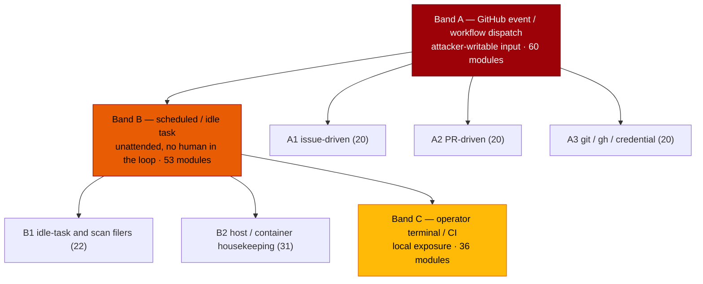

# 🔎 Security sweep — `worker/deno/commands/` CLI entry points

**Issue:** [#1218](https://github.com/stSoftwareAU/VibeCoder/issues/1218) (chunk
13) · **Parent:** #1209 `security-scan-overflow: 4 chunks not reached`

This record exists so a later run can tell a **swept** path from an unswept one.
The parent scan swept exactly one module in this tree —
`commands/references_refresh.ts`, as chunk 10's outbound-fetch surface — and
found it sound because it reads a curated `docs/REFERENCES.md` list. That
finding does not generalise, and this slice read the other 149.

Siblings:
[`security-sweep-1214-subprocess-argv.md`](security-sweep-1214-subprocess-argv.md)
(chunk 12a),
[`filesystem-path-temp-sweep-1215.md`](filesystem-path-temp-sweep-1215.md)
(chunk 12b) and
[`security-sweep-1216-untrusted-github-ingestion.md`](security-sweep-1216-untrusted-github-ingestion.md)
(chunk 12c).

> **This is not an empty result.** The issue asks that an empty result be stated
> explicitly; it was not empty. **Fourteen** root causes survived triage — five
> fixed in this change, nine filed, two more deduped onto issues that already
> existed.

## One correction to the issue's framing, established before ordering

The issue treats `commands/` as 150 argument-parsing surfaces. It is not:

```bash
cd worker/deno
grep -rl "Deno.args" commands/ --include='*.ts' | grep -v '_test\.ts$'   # → 0
grep -rl "import.meta.main" commands/ --include='*.ts' | wc -l           # → 0
```

Every one of the 149 modules is dispatched through the single shared parser
`worker/deno/mod.ts::parseArgs` (line 413) into
`execute(args: Record<string, unknown>)`. Argument parsing is therefore **one**
surface for all 149, and it is the root cause of an entire finding class
(SEC-1218-04). Its three relevant behaviours:

| Behaviour                                                    | Consequence                                                                                                  |
| ------------------------------------------------------------ | ------------------------------------------------------------------------------------------------------------ |
| every value is `JSON.parse`d, falling back to the raw string | `--limit false` is the boolean `false`; `--n 5` the number `5`; `--issue 0123` stays a string (invalid JSON) |
| a value beginning with `--` is read as the next flag         | `--slug --force` yields `{slug: true, force: true}` — the shape an empty shell variable produces             |
| an unrecognised flag is ignored, never refused               | a typo'd `--dry-run` is indistinguishable from its absence                                                   |

## Scope and method

The file list was regenerated with the command the issue specifies:

```bash
cd worker/deno && ls commands/*.ts | grep -v '_test\.ts$'
```

150 modules; `commands/references_refresh.ts` is out of scope (chunk 10),
leaving **149**. Coverage of the six band slices against that list was verified
with `comm` — no gaps, no duplicates.

### Priority ordering (stated on the issue before the sweep began)

The ordering is itself a reviewable artefact and was
[posted to #1218](https://github.com/stSoftwareAU/VibeCoder/issues/1218#issuecomment-5555500608)
before any module was read. Bands, deepest exposure first:



Two shapes inside band C were read at band-A depth despite the band, because the
boundary they defend is not local: the `export_*` redaction pipeline (a
secret-scrub gate) and `upgrade` / `software_updates` (a supply-chain gate).

The five subprocess-spawning modules (`grep -rl "Deno.Command" commands/`) are
`diagnose.ts`, `pr_manager.ts`, `process_add_repo.ts`,
`resolve_cross_repo_dep.ts` and `quality_helpers.ts`. They fall across A1, A2
and A3 and were given the argv-provenance treatment plus the `gh_spawn`
chokepoint invariant inside their band's pass.

Triage followed the Phase 3 discipline of
[`SECURITY-SCAN.md`](../SECURITY-SCAN.md): refute-unless-proven, then severity
recalibrated by the band. A candidate that could not be traced from a **named**
hostile or degraded field to the dangerous use was dropped rather than filed;
the refutations are recorded below so a later run does not re-derive them.

## Fixed in this change

| ID          | Site                                                                    | Class                         | Severity |
| ----------- | ----------------------------------------------------------------------- | ----------------------------- | -------- |
| SEC-1218-F1 | `commands/check_parent_dependencies.ts:70`                              | confused deputy               | medium   |
| SEC-1218-F2 | `commands/pr_manager.ts:286`                                            | privileged op without a guard | high     |
| SEC-1218-F3 | `commands/process_add_repo.ts:602`                                      | chokepoint bypass             | medium   |
| SEC-1218-F4 | `lib/worker_log_cleanup.ts:130` (from `commands/worker_log_cleanup.ts`) | destructive path handling     | high     |
| SEC-1218-F5 | `commands/load_config.ts:82`                                            | command injection             | low      |

### SEC-1218-F1 — forged cross-references counted as authoritative sub-issues

`createGhIssueFetcher.getSubIssues` read the **timeline** and treated every
`cross-referenced` event as a sub-issue. A cross-reference is created by anyone
who writes `#123` in a comment, so the child set was attacker-supplied — and
`checkParentBlocked` deliberately skips the `hasBackReference` confirmation for
API-derived children (`lib/issue_dependencies.ts:355-361`) precisely because it
trusts that endpoint to be authoritative. A cross-reference sourced from another
repository also yields a number that does not resolve here, and an unresolvable
child is counted as **open** (`:410-415`), so one comment produced a durable
"blocked by open sub-issue(s)" verdict on an arbitrary issue.

The pickup path made this move already — `lib/issue_finder_common.ts:256-271`,
Issue #2470, with a comment explaining that the old approach "bypassed the
`hasBackReference` guard … and mis-blocked work-on issues". This was the
unrepaired copy. Now on the native `repos/{repo}/issues/{n}/sub_issues`
endpoint, which only a user with write access can populate.

### SEC-1218-F2 — the one direct-merge call site that skipped `directMergePr()`

`--operation finalise-pr`'s `NotAllowed` arm hand-rolled

```ts
await runGhCommand([
  "pr",
  "merge",
  String(prNumber),
  "--repo",
  repo,
  mergeMethodFlagForHead(headRefName),
]);
```

`docs/MERGE.md:211` states the gate runs "from inside `directMergePr()` so
**every** direct-merge call site is protected". This one was not, so a PR number
handed to the command merged without the default-branch human-approval guard
(#2416/#1082), without the CI-green and branch-current backstop (#2582) and
without the head-SHA pin (#3946). Reachability is not hypothetical:
`enableAutoMerge` routes the unprotected-base case through the gated merge only
`if (baseRefName)` (`lib/pr_auto_merge.ts:394`), so a transient failure to read
the base skips the gate entirely and lands on this arm — a fail-open in the one
place the library deliberately fails closed.

Now routed through `directMergePr`, and a refused or unconfirmable gate returns
`success: false` rather than the previous
`success: true, "direct merge
attempted"` / `"direct merge deferred"` — a
refusal reported as a success is the silent-failure shape the standards forbid.

### SEC-1218-F3 — a `gh` write outside the chokepoint, invisible to its gate

`defaultRunCommand` spawned `new Deno.Command(cmd[0]!, …)` with
`cmd[0] === "gh"`. The add-repo route takes `owner/repo` from an issue **title**
(`lib/add_repo_process_issue_route.ts:104-113`), so the label writes made on its
behalf (`setup/label_sync.ts:80-95`) acted against a requester-named repository
outside `enforceGhWriteAllowlist`, outside `redactGhBodyArgs` and — the loss
that matters most — outside `auditGhMutation`, leaving no entry in the
tamper-evident journal `audit-chain-verify` reads.

The gate could not see it: `GH_SPAWN_PATTERN` matches only a literal
`Deno.Command("gh", …)`. That blind spot is already filed as #1227, and the
unscanned `worker/deno/setup/` tree as #1259 — both were confirmed live by this
sweep and are cross-referenced rather than re-filed. The instance inside
`commands/` is fixed here, with the same `if (cmd[0] === "gh") → spawnGh`
treatment the conforming runner in `lib/purge_stale_workflow_issues.ts:129-140`
already uses.

### SEC-1218-F4 — a log sweep that deleted the operator's home directory contents

The foreign-file pass (Issue #4306) removed **every** unrecognised plain file
older than 14 days in the configured log directory. `normaliseConfiguredLogDir`
explicitly accepts the bare value `"~"` (`lib/log_dir.ts:213`), resolving that
directory to the operator's `$HOME`, and `lib/container_launch.ts:990`
bind-mounts it **read-write** at the container's `~/logs`. Under that documented
configuration the pass unlinked `.bash_history`, `.gitconfig`, `.netrc` and any
loose document untouched for a fortnight, on every worker start, unattended,
with no `--dry-run` and no way to disable it (`foreignFileMaxAgeDays` is a
library option the command never exposes).

The debris it was written for — 748 `node-*.log` and 747 `stage-*.state` orphans
from a long-gone native run — is matched exactly as well by an allowlist, so the
pass now **names what it deletes** instead of naming what it spares
(`isForeignDebrisName`). The sibling rotation pass has the same shape and is
filed as SEC-1218-05 rather than changed here, because that fix must first
decide which filenames the worker owns.

### SEC-1218-F5 — an unescaped shell variable _name_ in text that is `eval`'d

`exportScalar` escaped the value it emits and never the name, and one name is
built from data: `CLAUDE_MODEL_${phase.toUpperCase()}`, where `phase` is a key
of `.config.json`'s `phase_model_overrides` map, copied verbatim by
`lib/config.ts` with no key filter. The output is `eval`'d
(`lib/quality_gate.ts:733-736`), so a key of `PLAN; PATH=/tmp/evil; #` emitted a
second statement that ran, with the trailing `#` commenting out the remainder of
the line so the injection was silent. Operator-local (the config is gitignored
and host-supplied), hence low — but an unescapable identifier inside `eval`'d
text is not correct at any band. Now refused outright, which also means the
script is never printed.

## Filed, not fixed here

| ID          | Issue                                                          | Site                                                                                         | Severity / confidence |
| ----------- | -------------------------------------------------------------- | -------------------------------------------------------------------------------------------- | --------------------- |
| SEC-1218-01 | [#1263](https://github.com/stSoftwareAU/VibeCoder/issues/1263) | `lib/label_clarification.ts:89` via `commands/clarity_phase.ts`, `commands/work_on_issue.ts` | medium / high         |
| SEC-1218-02 | [#1264](https://github.com/stSoftwareAU/VibeCoder/issues/1264) | `commands/pr_manager.ts:630`                                                                 | medium / high         |
| SEC-1218-03 | [#1265](https://github.com/stSoftwareAU/VibeCoder/issues/1265) | `lib/export_scrub_gate.ts:719` via `commands/export_scrub_gate.ts`                           | medium / high         |
| SEC-1218-04 | [#1266](https://github.com/stSoftwareAU/VibeCoder/issues/1266) | seven commands, one root cause in `mod.ts::parseArgs`                                        | medium / high         |
| SEC-1218-05 | [#1267](https://github.com/stSoftwareAU/VibeCoder/issues/1267) | `commands/log_rotation.ts:38`                                                                | medium / high         |
| SEC-1218-06 | [#1268](https://github.com/stSoftwareAU/VibeCoder/issues/1268) | `commands/disk_space.ts:66`                                                                  | medium / high         |
| SEC-1218-07 | [#1269](https://github.com/stSoftwareAU/VibeCoder/issues/1269) | `commands/git_operations.ts:548`                                                             | low / high            |
| SEC-1218-08 | [#1270](https://github.com/stSoftwareAU/VibeCoder/issues/1270) | `commands/software_updates.ts:47`                                                            | low / high            |
| SEC-1218-09 | [#1271](https://github.com/stSoftwareAU/VibeCoder/issues/1271) | `commands/security_tree_sweep.ts:98`                                                         | low / medium          |

SEC-1218-02's reachability was corrected after filing and the correction posted
to the issue: `closeDuplicatePrs` is not CLI-only.
`lib/issue_worker_wiring.ts:88` imports it, `:255` declares it on `PrDeps` and
`:524` binds the real implementation, so the unauthenticated head-branch
selection runs unattended during ordinary issue work.

Deduped onto issues that already existed rather than re-filed: the variable
binary name that evades the `gh` chokepoint gate (**#1227**) and the unscanned
`worker/deno/setup/` tree with two literal violations in it (**#1259**). Both
were independently confirmed live by this sweep.

## Refuted — traced and dropped

Recorded so a later run does not re-derive them.

- **Prototype pollution via `parseArgs` object keys.**
  `--__proto__ '{"dryRun":false}'` was run against the real parser: the
  assignment creates an **own** property, `Object.getPrototypeOf(args)` is
  unchanged and `args.dryRun` stays `undefined`. No pollution, and CLI control
  already grants direct flag control.
- **argv injection from issue or PR text.** No shell driver survives — the
  command names do not appear in any `*.sh` / `*.yml` outside `worker/deno/`,
  `parseArgs` is called only from `mod.ts:498`, and the in-process `execute`
  callers (`lib/run_housekeeping.ts:416`, `lib/run_worker.ts:447`,
  `lib/commands.ts:82`) pass statically-built arg objects. A single argv element
  containing a space cannot split into two flags.
- **Label mutations bypassing `worker_label_guard`.**
  `lib/label_operations.ts:57-63` asserts before every add, and every `gh` write
  funnels through
  `runGhCommand → runGhOrThrow → spawnGh → enforceGhWriteAllowlist`. The
  bulk-triage default `--apply-label work-on` is refused in-process because
  `work-on` is absent from `WORKER_APPLIABLE_LABEL_LITERALS`.
- **`escalateToPlanning` applying the reserved `planning` label.** Issue #1476
  removed the label-add; it comments and unassigns only.
- **ReDoS.** `lib/security.ts::SUSPICIOUS_PATTERN` gaps are the bounded
  `.{0,200}` with no nested unbounded quantifier and no `g` flag;
  `detectComplexity`, `extractIssueNumberFromPrTitle`, `issueNumberFromBranch`
  and the `finding-id` marker pattern are all anchored and linear.
- **`resolve_cross_repo_dep` slug and path handling.**
  `lib/cross_repo_fix.ts:139-146` and `:191-193` gate on `REPO_SLUG_PATTERN`
  before the value becomes a path or a `gh` argument.
- **`sweep_heartbeat_comments` and `purge_stale_workflow_issues` deleting
  without `--dry-run`.** Both are author-gated: the sweep refuses outright when
  `allowedAuthors` is empty and skips every comment not authored by a fleet
  account; the purge treats an unattributable tag match as not a candidate. An
  attacker planting the tag gets only their own issue closed.
- **`backfill_idle_task_labels` title matching.**
  `lib/idle_task_backfill.ts:345` routes every title match through
  `selectFleetAuthoredMatches`, exact-matches client-side, fails closed on an
  unreadable timeline, and honours a deliberate operator un-label.
- **`process_seed_idle_tasks` slug from an issue title.** Syntax-checked against
  `REPO_SLUG_PATTERN`, then _replaced_ by the operator's `.config.json` entry,
  and the route only fires behind `wasLabelAddedByAllowedAuthor`.
- **Container housekeeping flags** (`container-image-prune --keep`,
  `container-store-prune --store-path`,
  `container-reap --name/--max-age-seconds`, `container-build-heal --log`, …).
  Every one maps the boolean `parseArgs` produces to `undefined` and refuses on
  it; `run.sh:730-748` validates the whole launch plan and exits 1 first.
  `container-store-prune` never deletes anything derived from `--store-path`,
  and volume removal is name-gated by `THROWAWAY_VOLUME_PREFIX` +
  `VOLUME_NAME_RE`.
- **`work-volume-prune` / `work-volume-tiers` / `deno-cache-guard` /
  `stale-workdir` `--work-dir`.** All use `resolveCommandWorkDir`, which
  requires a non-empty string and otherwise returns `""`, which every caller
  reports as a refusal.
- **`crash-cleanup --repo` traversal.** `repo.replace("/", "_")` is non-global
  so a second `/` survives, but the removal is a non-recursive single file,
  `repo` comes from monitored-repo config where GitHub names cannot contain `/`
  or `..`, and no script invokes the command.
- **`upgrade` version strings into a URL and an argv.** Every pin is gated by
  `PINNED_VERSION_PATTERN` before `planPinnedInstall` builds any URL, the
  manifest is validated field-by-field, and `verifyPinnedVersion` throws on a
  mismatch. _Honest residual:_ the artefact is version-pinned but not checksum-
  or signature-verified; no hostile input could be traced to it.
- **`quality_helpers.ts --command` → `bash -c`.** A genuine shell sink with no
  caller: the default is `./quality.sh` and no invocation of `quality-helpers`
  exists outside `mod.ts` registration. It is the single most dangerous argv in
  the tree **if** a caller is ever added.
- **`prompt_manager --prompt-name` traversal and
  `publish_decision_check --dossier` absolute paths.** Arbitrary reads on
  read-only operator-argv commands; no attacker-writable source traced.
- **`repo_config run-pre-setup` → `bash -c` with the full process env.**
  Arbitrary execution by design from operator config; no repo-controlled file
  becomes that path. The blanket `Deno.env.toObject()` inheritance is the part
  worth narrowing.
- **`github_app_auth` printing an installation token.**
  `installConsoleRedaction` (`mod.ts:491`) masks `ghs_`-prefixed tokens, so the
  command prints `[REDACTED]`. Safe — though its documented "outputs to stdout
  for shell capture" contract now appears broken, which is a correctness note,
  not a finding.
- **`__testDeps` / `__testRunner` seams read from the real CLI namespace.**
  `parseArgs` can only produce JSON, so no callable can be injected; the worst
  outcome is a `TypeError`. Hygiene, not a security finding.

## Coverage

All **149** in-scope modules were read at their argument-parsing and dispatch
points, in the stated band order. `commands/references_refresh.ts` remains
covered by chunk 10. `worker/deno/lib/`, `worker/deno/setup/` and
`worker/deno/tests/` are out of scope here and belong to #1219, #1220 and the
tests exclusion respectively.
