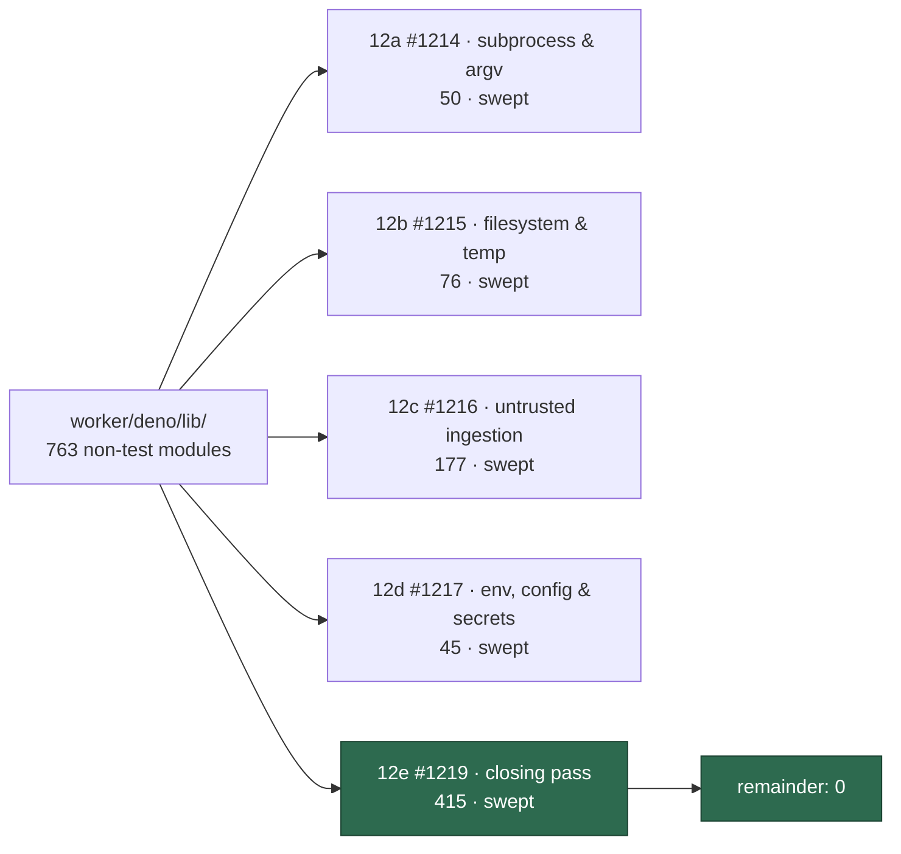

# 🔎 Security sweep — `worker/deno/lib/` closing pass

**Issue:** [#1219](https://github.com/stSoftwareAU/VibeCoder/issues/1219) (chunk
12e) · **Parent:** #1209 `security-scan-overflow: 4 chunks not reached`

This is the written record for the closing pass over `worker/deno/lib/` — the
415 modules the four sink-organised sibling slices deliberately left behind. Six
filed finding issues cite this file by name.

Siblings:
[`security-sweep-1214-subprocess-argv.md`](security-sweep-1214-subprocess-argv.md)
(12a),
[`filesystem-path-temp-sweep-1215.md`](filesystem-path-temp-sweep-1215.md)
(12b),
[`security-sweep-1216-untrusted-github-ingestion.md`](security-sweep-1216-untrusted-github-ingestion.md)
(12c) and
[`security-sweep-1217-env-config-secrets.md`](security-sweep-1217-env-config-secrets.md)
(12d). With this record, all five slices have one.

> **This is not an empty result.** The issue asks that a nil return be stated
> explicitly, because a nil return was the expected outcome for a slice of
> modules with no taint sink. It was not nil. **Eight** root causes survived
> triage: two are fixed in this change, six are filed one issue per finding.

## The coverage ledger is the deliverable, not this prose

`lib/` became a 750-file gap because nothing recorded which paths had been read.
A module added after a sweep was indistinguishable from one the sweep skipped,
so every scan report re-declared the whole tree unswept.

[`lib-sweep-coverage.json`](lib-sweep-coverage.json) fixes that by naming every
non-test module under `worker/deno/lib/` and the slice that owns it.
`worker/deno/lib/lib_sweep_coverage.ts` parses it and
`worker/deno/tests/lib_sweep_coverage_test.ts` enforces four properties against
the real tree:

| Property                          | Failure it catches                                             |
| --------------------------------- | -------------------------------------------------------------- |
| every module on disk has an owner | a module added since the sweep — the way the gap reopens       |
| every ledger entry exists on disk | a stale entry left by a delete or rename                       |
| no module has two owners          | slices that stopped being disjoint                             |
| every named record exists         | a dangling `ledger` reference, which makes a slice unauditable |

The union is the whole tree and the remainder is empty — 763 modules, 763 ledger
entries, no module claimed twice, and every slice now `swept`:



### Two reconciliations, both made by the gate rather than by hand

The check earned its place during this change rather than after it:

- **The gate caught its own merge drift.** Merging the milestone branch brought
  #1217's record and, with it, `lib/redacted_text.ts` and `lib/xml_escape.ts` —
  two modules created _after_ the sweeps. The coverage test went red naming
  exactly those two. Both were then read for the shapes and are clean:
  `clampBudget` returns `0` on a non-finite or negative budget, so the
  degenerate case keeps _less_ text rather than more, and `escapeXml` replaces
  `&` first so the other four entities cannot be double-escaped. 12e claims
  them.
- **One module was owned but unrecorded.** `lib/audit_roster_recovery.ts` sat in
  12b's path list while appearing nowhere in 12b's written record — the file was
  added by a parallel branch after that slice was read, so it was marked swept
  without anyone having read it. Ownership moves to 12e, where this record
  covers it: it is a crash-recovery module for an append-only roster, and it
  discards only an **unterminated and unparseable** final line. A complete line
  the roster cannot read stays broken, which is the fail-closed direction — a
  missing newline is explicitly not allowed to become a way to launder a forged
  line.

This is the difference the ledger was supposed to make. Both cases are exactly
the shape the issue named — a file added since the sweep, indistinguishable from
one nobody read — and in both the check, not a reviewer, is what noticed.

## Scope and method

The file list is the issue's own command, minus the four sibling lists:

```bash
cd worker/deno && find lib -name '*.ts' ! -name '*_test.ts' | sort
```

These modules are lower yield by construction — a module with no sink cannot be
the last step of an exploit — so the pass read for **shape** rather than for
sinks, one pass over every file, escalating to a deep read only where a shape
appeared:

- **Fail-open defaults** — a validator, guard or predicate returning `true`,
  `undefined` or an empty allowlist on unexpected input.
- **Authorisation logic with no authenticated input** — the #1097 class in
  modules that decide rather than fetch.
- **Guard bypass** — a privileged mutation reaching GitHub without passing the
  chokepoint that is supposed to cover it.

Both fixes below are the third shape, and it is the shape this slice was best
placed to find: a sink-organised slice reads the sink, whereas the bypass lives
in the module that fails to call it.

## Findings

| ID          | Site                                        | Severity | Confidence | Disposition                                                    |
| ----------- | ------------------------------------------- | -------- | ---------- | -------------------------------------------------------------- |
| SEC-1219-01 | `lib/gh_flag_parser.ts`                     | Medium   | High       | fixed here                                                     |
| SEC-1219-02 | `lib/blocked_deferral.ts`                   | Low      | High       | fixed here                                                     |
| SEC-1219-03 | four regexes on the untrusted-text path     | Medium   | High       | [#1274](https://github.com/stSoftwareAU/VibeCoder/issues/1274) |
| SEC-1219-04 | `lib/alert_feeds/alert_fingerprint.ts`      | Medium   | Medium     | [#1275](https://github.com/stSoftwareAU/VibeCoder/issues/1275) |
| SEC-1219-05 | `lib/worker_label_guard.ts` create-path gap | Low      | High       | [#1276](https://github.com/stSoftwareAU/VibeCoder/issues/1276) |
| SEC-1219-06 | `lib/collect_self_diagnostic_candidates.ts` | Medium   | Medium     | [#1277](https://github.com/stSoftwareAU/VibeCoder/issues/1277) |
| SEC-1219-07 | `lib/transient_network_failure.ts`          | Low      | Medium     | [#1278](https://github.com/stSoftwareAU/VibeCoder/issues/1278) |
| SEC-1219-08 | `lib/security_fix_gate.ts`                  | Low      | High       | [#1279](https://github.com/stSoftwareAU/VibeCoder/issues/1279) |

### SEC-1219-01 — a shorthand group walked three `gh` guards past their gate

`normaliseGhArgs` rewrites attached pflag shorthands into the separated form the
guards match, and it only inspected `token[1]`. pflag also accepts a **group**,
where the first value-taking letter swallows the rest of the token: `-iXDELETE`
is `-i -X DELETE`. Because `X` sat at index 2, the token passed through
untouched, `classifyGhApi` saw no method, fell back to `GET`, and concluded the
command was not a mutation — so

```text
gh api -iXDELETE repos/o/r/git/refs/heads/main
```

reached GitHub without the audit journal, the write-repo allowlist or the
issue-lifecycle guard. `f`/`F` were absent from the expansion set entirely, so
`-fstate=closed` classified as a body `edit` (allowed by default) rather than a
`close` — defeating the guard that stops an agent closing its own issue.

The fix walks the group left to right. A letter that takes a value anywhere in
`gh` ends the walk, because pflag would hand it the remainder; only letters
boolean everywhere are walked past. That ordering keeps the rewrite honest in
both directions — it cannot invent an `-X` out of the middle of a `-q` jq
expression, and it cannot miss one hiding behind a boolean.

Group semantics were verified against the installed `gh`, not assumed:
`gh api -iXGET rate_limit` returns 200 with response headers (so `-i` was
honoured _and_ `X` took `GET`), and `-iXBOGUSMETHOD` is rejected by the server
(so the bogus method really was sent).

**Residual, stated rather than papered over.** The value-letter set is
subcommand-agnostic while `gh` is not, and independent review of this change
found the first docstring overclaimed — it said letters outside the set were
"boolean everywhere". They are not: `-D` (`gh run download --dir`) and `-j`
(`gh run view --job`) take values and were missing, so a directory or job name
beginning `X`, `f` or `R` had a flag invented out of it. Both are now in the
set. One letter stays genuinely ambiguous — `gh api -i` is boolean (`--include`)
while `gh run watch -i` takes an int (`--interval`) — and it is resolved in
favour of `api`, because `api` is the subcommand whose method the mutation
classifier reads and listing `i` would re-open the `-iXDELETE` bypass this
finding closed. The residue is bounded to a `gh run watch` interval value
beginning with a guard letter, which `--interval int` cannot accept. The
asymmetry is why that choice is safe in one direction only: guessing "boolean"
for a value letter fabricates evidence and **refuses** a legitimate command,
whereas guessing "value" for a boolean letter ends the walk early and lets a
real mutation **past**.

### SEC-1219-02 — the one label write in `lib/` that skipped the label guard

`worker_label_guard.ts` states the invariant that every label the worker applies
passes a positive allowlist. It was wired into `addLabelToIssue` and
`escalateToHuman`; `deferBlockedIssue` instead called `ghClient.addLabel`
directly, posting `blocked` to the labels API with no check at all. The
allowlist therefore did not describe what the worker actually did.

The fix routes that write through `assertWorkerCanApplyLabel` and adds `blocked`
to the allowlist — a worker-owned queue marker, the same class as
`merge-conflict`, not a pickup-priority label. A refusal now emits the
`[SECURITY] [WORKER_LABEL_REFUSED]` audit line rather than failing quietly.

## The three subdirectories the issue named

- **`lib/idle_task_templates/` (18)** — the label discipline question came back
  **positive**, as SEC-1219-05
  ([#1276](https://github.com/stSoftwareAU/VibeCoder/issues/1276)).
  `assertWorkerCanApplyLabel` has three call sites, all of which label an issue
  that _already exists_; the shared filers the templates create through
  (`workflow_scan_common.ts`, `idle_task_issue.ts`,
  `runner_deprecation_filer.ts`, `create_all_idle_task_wrappers.ts`) pass
  `--label` at `gh issue create` and call the guard zero times. Ownership of 16
  of these templates sits with 12d for its config/secrets axis; the
  label-at-create shape was read across all 18, which is why the finding is
  scoped to the whole directory.
- **`lib/phases/` (10, of which 12e owns 6)** — read for a phase that can be
  skipped or reordered by state an untrusted input influences. **Nil** on that
  shape. The pipeline is a straight-line sequence of literal `await runPhase(…)`
  calls in `lib/issue_worker.ts:425-688`, not a list the worker iterates, so
  there is no ordering for an input to permute. The only control an input has is
  short-circuiting: each phase returns `failure`/`early_exit` and the caller
  returns immediately. That is the fail-closed direction — it stops the run, it
  does not skip ahead to a privileged phase.
- **`lib/alert_feeds/` (4, of which 12e owns 2)** — positive, as SEC-1219-04
  ([#1275](https://github.com/stSoftwareAU/VibeCoder/issues/1275)). The alert
  fingerprint is built by bare concatenation over `ruleId`, which
  `code_scanning_alerts.ts` documents as free text read verbatim, and the marker
  is emitted outside the untrusted-text fence — so a forged second marker
  suppresses a real alert permanently.

## #1106 — confirmed landed

The issue asks that the marker-dedup author-verification fixes be confirmed
rather than assumed. They landed and the debt is zero:
`MARKER_DEDUP_AUTHOR_UNVERIFIED_FILES` in
`worker/deno/lib/marker_dedup_author_manifest.ts` is the empty list, and
`worker/deno/tests/marker_dedup_author_cap_test.ts` (11 tests, passing) fails in
**both** directions — a fixed site cannot linger in the manifest and a new
unverified lookup cannot quietly join the tree.

## What came back clean

Recorded so a later reader knows these were asked, not skipped:

- **Fail-open defaults** — no validator, guard or predicate in the swept set
  returns a permissive value on an unexpected input. The parent run's finding
  that chunks 3 and 7 are fail-closed on every error path holds across the
  remainder too. SEC-1219-07 is the nearest miss and is a _classifier_ being too
  loose, not a guard failing open.
- **Authorisation logic with no authenticated input** — one instance
  (SEC-1219-06, the self-diagnostic marker gate); every other discovery
  collector requires a human-applied label the worker cannot write.
- **Constant-time comparison** — nothing in the swept set compares a
  network-facing secret. Searching the tree for a comparison against a
  `token`/`secret`/`signature`/`password` identifier returns argv tokens
  (`token === "--repo"` and friends) and `file_lock.ts`'s local lock-ownership
  token, neither of which an attacker can probe by timing.
