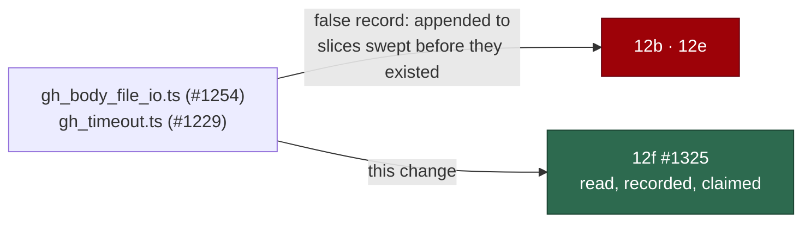

# 🔎 Security sweep — `gh` chokepoint top-up (`gh_body_file_io.ts`, `gh_timeout.ts`)

**Issue:** [#1325](https://github.com/stSoftwareAU/VibeCoder/issues/1325) (chunk
12f) · **Parent:** #1209 `security-scan-overflow: 4 chunks not reached`

This is the written record for the two modules that entered `worker/deno/lib/`
_after_ the five chunk-12 slices recorded their coverage:

- `worker/deno/lib/gh_body_file_io.ts` — added by #1254 (PR #1304).
- `worker/deno/lib/gh_timeout.ts` — added by #1229 (PR #1319).

Siblings:
[`security-sweep-1214-subprocess-argv.md`](security-sweep-1214-subprocess-argv.md)
(12a),
[`filesystem-path-temp-sweep-1215.md`](filesystem-path-temp-sweep-1215.md)
(12b),
[`security-sweep-1216-untrusted-github-ingestion.md`](security-sweep-1216-untrusted-github-ingestion.md)
(12c),
[`security-sweep-1217-env-config-secrets.md`](security-sweep-1217-env-config-secrets.md)
(12d) and
[`security-sweep-1219-lib-closing-pass.md`](security-sweep-1219-lib-closing-pass.md)
(12e).

## Why a new slice instead of two lines in an old one

The coverage gate went red on this milestone branch because neither module was
claimed by any slice. It was made green by appending `gh_body_file_io.ts` to 12b
and `gh_timeout.ts` to 12e — slices whose sweeps ran before either module
existed. That is the cheapest way to satisfy `diffCoverage`, and it is a false
record: the ledger then asserts that a sweep read a file it could not have seen,
which is precisely the "swept without anyone having read it" failure 12e's own
record documents for `audit_roster_recovery.ts`.

Both modules now belong to **12f**, and this file is the sweep that actually
read them.



The rule is now enforced rather than remembered. `unnamedSmallSliceModules` in
`worker/deno/lib/lib_sweep_coverage.ts` requires any slice of twenty modules or
fewer — the shape every top-up slice takes — to name each module it claims in
its own record. Appending a path to a small slice without reading the module
fails the gate; appending it to one of the five large slices remains possible,
which is the residual noted at the end.

## `worker/deno/lib/gh_body_file_io.ts`

The filesystem half of `gh` body redaction: the reader and writer that
`gh_body_redaction.ts` (a pure module) is handed by both chokepoints — the
agent's guard child `gh_guard_cli.ts` and the worker's spawn chokepoint
`gh_spawn.ts`.

Shapes checked (12b's sinks): temp-file creation mode, path handling, symlink
and TOCTOU exposure, cleanup, and whether a failure can read as success.

| Property                                      | Result                                                                                                                                |
| --------------------------------------------- | ------------------------------------------------------------------------------------------------------------------------------------- |
| masked-body temp file is not world-readable   | ✅ `Deno.makeTempFileSync` creates mode `600` — measured, see below                                                                   |
| the caller's own body file is never rewritten | ✅ `denoBodyFileWriter` always creates a fresh file; the original path is only read                                                   |
| an unreadable body cannot be published        | ✅ `denoBodyFileReader` throws, and `gh_body_redaction.ts:266-272` converts that into `UnredactableBodyError`, which refuses the call |
| no symlink race on the write path             | ✅ `makeTempFileSync` creates the file itself; nothing writes to an attacker-nameable path                                            |
| read amplification                            | ✅ none — the bytes read are the bytes `gh` would have published from the same path with the same privileges                          |
| the masked temp file is removed               | ❌ **F1**, below                                                                                                                      |

Measured, not assumed:

```text
temp path: /tmp/gh-input-9dc42e591d9d07d7.json
mode: 600
```

### F1 — masked `--input` bodies accumulate in `TMPDIR`, unlinked

`denoBodyFileWriter` creates `gh-input-*.json` and nothing ever removes it:
`grep -rn "gh-input-" --include=*.ts worker/deno` matches only the creation
site, and neither `gh_spawn.ts` nor `gh_guard_cli.ts` contains a `Deno.remove`.
Every `gh api --input <file>` call whose body needed masking leaves a file
behind for the life of the container.

Severity is bounded by what the file holds: the _redacted_ body, so a secret
that the scan caught is not in it — the exposure is the published text, which is
about to be public anyway, at mode `600`. The real cost is unbounded growth of
`TMPDIR` in a long-lived worker container. It is not fixed here because the file
must outlive the `gh` child that reads it, so the fix belongs at the spawn
site's lifecycle rather than in the writer; it is filed as
[#1364](https://github.com/stSoftwareAU/VibeCoder/issues/1364).

## `worker/deno/lib/gh_timeout.ts`

The `gh` counterpart of `git_timeout.ts` — the budget `gh_spawn.ts` asks for on
every invocation, so the timeout is unavoidable rather than opt-in.

Shapes checked (12d's sinks plus availability): environment-controlled values,
the degenerate-value direction, argument interpretation, and whether the control
can be skipped.

| Property                                                   | Result                                                                                                     |
| ---------------------------------------------------------- | ---------------------------------------------------------------------------------------------------------- |
| `GH_COMMAND_TIMEOUT=0` cannot disable the control          | ✅ falls back to `60` — measured                                                                           |
| a non-numeric or infinite value cannot disable it          | ✅ `Number.isFinite` rejects `Infinity`; falls back to `60` — measured                                     |
| the control cannot be skipped by a caller                  | ✅ `runWithTimeout` only defers to a caller-supplied `signal`, and no production caller supplies one       |
| a timeout fails loud                                       | ✅ exit `124` with a `TIMEOUT:` stderr naming the command and budget; `runGhOrThrow` turns it into a throw |
| an env value can extend the budget without limit           | ⚠️ **F2**, accepted                                                                                        |
| `--paginate` is matched anywhere in argv, including values | ⚠️ **F3**, accepted                                                                                        |

Measured:

```text
zero env -> 60
Infinity env -> 60
huge env -> 86400000
body containing --paginate -> 300
plain comment -> 60
```

"No production caller supplies one" is checked, not assumed:
`grep -rn "spawnGh(\|runGhOrThrow(" --include=*.ts worker/deno | grep -i signal`
matches only `worker/deno/tests/gh_spawn_test.ts`.

### F2 — an oversized environment value neutralises the timeout (accepted)

`GH_COMMAND_TIMEOUT=86400000` yields a 1000-day budget, which is the unbounded
behaviour #1229 removed. Accepted: the environment is host-trust — whoever sets
it already runs the worker — and an upper clamp would silently shorten the
legitimate long budgets (`GH_CLONE_TIMEOUT` on a large repository) that the same
mechanism exists to allow. The fail-closed direction that matters — a value that
would _shorten_ the control to nothing — is handled.

### F3 — `--paginate` is positional-blind (accepted)

`args.includes("--paginate")` matches the token anywhere, so
`gh issue comment --body "--paginate"` takes the 300 s paginated budget rather
than the 60 s standard one. Accepted: the effect is a five-fold longer deadline
on one call, with no bypass of a security control, no data exposure and no
change to what is executed — `gh` still receives byte-identical arguments.
Parsing argument positions here would duplicate `gh`'s own flag grammar for a
five-minute-versus-one-minute distinction.

## Ledger reconciliation

| Slice | Before                                                          | After                    |
| ----- | --------------------------------------------------------------- | ------------------------ |
| 12b   | 77 paths, including `gh_body_file_io.ts` its record never names | 76 paths                 |
| 12e   | 421 paths, including `gh_timeout.ts` its record never names     | 420 paths                |
| 12f   | —                                                               | 2 paths, both named here |

Total is unchanged at 770 modules; every module is still claimed exactly once.

## Residual risk

The enumeration rule binds slices of twenty modules or fewer. A future run could
still append a new module to one of the five large slices and go green without
reading it. Making the record the evidence for all 770 modules would mean each
large record naming every path it covers, which those records deliberately do
not do — they describe their sinks collectively. The rule is therefore set where
the recurring failure actually happens: the one- or two-module top-up.
