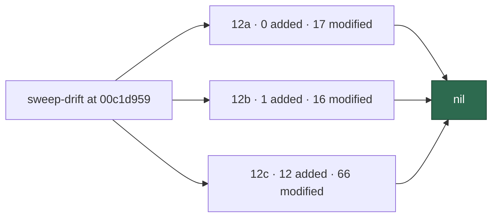

# 🔎 Security sweep — `worker/deno/lib/` delta, slices 12a–12c

**Issue:** [#1610](https://github.com/stSoftwareAU/VibeCoder/issues/1610)
· **Parent:** #1608 `security-scan-overflow: 6 chunks not reached`

This is the written record for the modules in ledger slices 12a (#1214
subprocess/argv), 12b (#1215 filesystem/temp) and 12c (#1216 untrusted
GitHub ingestion) that were added or modified since each slice's
previous `sweptAt`. The file list was regenerated by
`deno run … mod.ts sweep-drift` at
`00c1d95924a0adf7eaf419219ade7283b3e11480` — not from the stale counts
in #1610.

Siblings:
[`security-sweep-1214-subprocess-argv.md`](security-sweep-1214-subprocess-argv.md)
(12a original),
[`filesystem-path-temp-sweep-1215.md`](filesystem-path-temp-sweep-1215.md)
(12b original),
[`security-sweep-1216-untrusted-github-ingestion.md`](security-sweep-1216-untrusted-github-ingestion.md)
(12c original) and
[`security-sweep-1611-lib-delta-12d-12f.md`](security-sweep-1611-lib-delta-12d-12f.md)
(the 12d–12f half of the same overflow).

> **This result is empty.** Every added module and every modified hunk
> in the three slices' drift lists was read, skipped with a documented
> reason, or marked swept by the #1608 run. No finding survived Phase 3
> triage. That nil is stated here so a later run does not have to
> re-derive it.



## Scope and method

```bash
deno run --allow-read --allow-run --allow-env --allow-sys=hostname \
  worker/deno/mod.ts sweep-drift --repo "$(pwd)"
```

For a *modified* module the hunks
(`git diff <sweptAt> HEAD -- <path>`) were read and followed wherever
they touched the slice's sink. For an *added* module the file was read
in full — a ledger top-up claim is not a sweep record. Modules named
in issue 1608's "Chunks swept this run" list were marked swept by that
run and skipped.

Triage followed `docs/SECURITY-SCAN.md` Phase 3 (refute-unless-proven).
A candidate only survives when a concrete attacker-controlled input
reaches a sink unsafely.

## Findings

| ID | Site | Severity | Confidence | Disposition |
| -- | ---- | -------- | ---------- | ----------- |
| —  | —    | —        | —          | **nil** — no surviving finding in 12a, 12b or 12c |

## Slice 12a — subprocess and argv construction

Previous `sweptAt`: `838cf9013425cfed2fb479296242d088a06e595d`
(#1214 record). Drift at generation HEAD: **0 added, 17 modified,
0 unowned**.

| Path | Disposition |
| ---- | ----------- |
| `worker/deno/lib/claude_runner.ts` | skipped — swept by the #1608 run (prompt construction / comment-trust) |
| `worker/deno/lib/gh_spawn.ts` | read — quota-exhaustion hook; no new argv construction |
| `worker/deno/lib/gh_spawn_chokepoint_check.ts` | read — static scanner only |
| `worker/deno/lib/git_ref_argv_check.ts` | read — static scanner only |
| `worker/deno/lib/git_spawn_chokepoint_check.ts` | read — static scanner only |
| `worker/deno/lib/git_timeout.ts` | read — timeout detection + `runGitArgv` adapter |
| `worker/deno/lib/integration_test_manifest.ts` | read — manifest list / comments |
| `worker/deno/lib/language_detector.ts` | read — removes a non-`gh` `Deno.Command` fallback |
| `worker/deno/lib/purge_stale_workflow_issues.ts` | read — routes `git` through `runGitArgv` |
| `worker/deno/lib/quality_gate.ts` | read — failure-message text only |
| `worker/deno/lib/recent_activity.ts` | read — refuses non-`gh`/`git`; both go through chokepoints |
| `worker/deno/lib/repo_visibility.ts` | read — `gh`-only through `spawnGh` |
| `worker/deno/lib/security_tree_sweep.ts` | read — classification / reporting |
| `worker/deno/lib/session_resume.ts` | read — `--session-id` / `--resume` pairing; session id is a UUID or validated store value, discrete argv |
| `worker/deno/lib/tabletop_container_runner.ts` | read — literal `buildCommit: "unknown"` stamp |
| `worker/deno/lib/untrusted_command_env.ts` | read — `git` probe routed through `runGitArgv`; production probe stays `id` / `sudo … true` |
| `worker/deno/lib/workflow_auditor.ts` | read — removes a non-`gh` spawn path |

**12a is nil.** The delta is chokepoint routing, static-scan closure and
session-flag correctness. No modified hunk introduces attacker-controlled
input reaching a spawn or shell sink.

## Slice 12b — filesystem, path and temp-file handling

Previous `sweptAt`: `838cf9013425cfed2fb479296242d088a06e595d`
(#1215 record). Drift at generation HEAD: **1 added, 16 modified,
0 unowned**.

### Added

| Path | Disposition |
| ---- | ----------- |
| `worker/deno/lib/security_fix_gate_retry.ts` | read in full — no direct fs I/O; state dir from `config.workDir`, agent cwd from `state.repoPath` |

### Modified

| Path | Disposition |
| ---- | ----------- |
| `worker/deno/lib/add_repo.ts` | read — case-insensitive slug dedup; still gated by `REPO_SLUG_PATTERN` |
| `worker/deno/lib/audit_anchor.ts` | read — `atomicWrite` temp placed *inside* the journal dir |
| `worker/deno/lib/audit_journal.ts` | skipped — swept by the #1608 run (secret redaction / audit journal) |
| `worker/deno/lib/baseline_quality_cache.ts` | read — cache version / kind; no fs change |
| `worker/deno/lib/checkout_update.ts` | read — static `ignoredExecutableCleanArgs()`; no dynamic path |
| `worker/deno/lib/content_approval_tracker.ts` | read — hash / normalisation; existing state-dir writes unchanged |
| `worker/deno/lib/file_utils.ts` | read — optional `tempDir`; basename-only temp name; `createNew` + UUID retained |
| `worker/deno/lib/gh_guard_cli.ts` | skipped — swept by the #1608 run (gh-guard) |
| `worker/deno/lib/gh_guard_shim.ts` | skipped — swept by the #1608 run (gh-guard) |
| `worker/deno/lib/lane_worktree.ts` | read — orphan remove only at `laneWorktreePath()` after git "already exists" |
| `worker/deno/lib/pr_branch_preparation.ts` | read — fixed `.pr_response_message` filename; lane detach uses git-reported path |
| `worker/deno/lib/pr_ci_checks.ts` | read — CI routing via gh API; no filesystem sink |
| `worker/deno/lib/run_core_production_deps.ts` | read — host-disk JSON under `$HOME/logs`; prune scoped to `workDir` |
| `worker/deno/lib/run_worker.ts` | read — credential-pool refactor; no fs change |
| `worker/deno/lib/security_fix_gate_feedback.ts` | read — `sanitiseDeclarations` bounds agent-origin diff text |
| `worker/deno/lib/work_volume_prune.ts` | read — lane scan confined to `workDir/worktrees/**` and requires a `.git` file |

**12b is nil.** The added module has no path sink. The filesystem hunks
narrow write reach (journal-local temps, sanitised declarations) rather
than widen it.

## Slice 12c — untrusted GitHub-data ingestion

Previous `sweptAt`: `2370a7de55bc85893dff3b342d862ab714f7795b`
(#1216 record). Drift at generation HEAD: **12 added, 66 modified,
0 unowned**.

### `alert_feeds/` in 12c — no change since the record

12c still owns `worker/deno/lib/alert_feeds/code_scanning_alerts.ts`
and `worker/deno/lib/alert_feeds/dependabot_alerts.ts`.
`git diff 2370a7de… HEAD --` those two paths is empty. They were not
re-read; the original #1216 record still covers them.

`alert_feed_enable_issue.ts` and `alert_fingerprint.ts` belong to
**12e**, not 12c. Their drift is in
[`security-sweep-1611-lib-delta-12d-12f.md`](security-sweep-1611-lib-delta-12d-12f.md).

### Added (read in full)

| Path | Disposition |
| ---- | ----------- |
| `worker/deno/lib/git_message_redaction.ts` | outbound secret redaction on `git commit -m`/`-F`; no GitHub text ingested |
| `worker/deno/lib/graphql_quota_probe.ts` | fixed GraphQL probe; parses rate-limit headers / JSON only |
| `worker/deno/lib/milestone_activity_gate.ts` | gates on numeric `closed_issues`; worker-local JSON state |
| `worker/deno/lib/milestone_conflict_dedup.ts` | dedup key from git branch / SHA / paths; comment read is substring match |
| `worker/deno/lib/milestone_conflict_git.ts` | conflicted paths from the git index, `--`-terminated argv |
| `worker/deno/lib/milestone_conflict_triage.ts` | pure classification; worker-authored analysis markdown |
| `worker/deno/lib/milestone_resolution_gate.ts` | repo `deno task` names from manifest constants |
| `worker/deno/lib/milestone_sync_conflict.ts` | commit subjects are display-only; branches are worker-managed |
| `worker/deno/lib/milestone_tracker_identity.ts` | title is a pre-filter; tracker acts require body marker + fleet author |
| `worker/deno/lib/orphan_deps_severity_gate.ts` | strips fenced untrusted regions; posts a fixed template |
| `worker/deno/lib/orphan_deps_untrusted.ts` | fences / scrubs third-party metadata before issue filing |
| `worker/deno/lib/repo_slug.ts` | `REPO_SLUG_PATTERN` rejects `..`; inert rendering for errors |

### Modified

| Path | Disposition |
| ---- | ----------- |
| `worker/deno/lib/gh_body_redaction.ts` | skipped — swept by the #1608 run (secret redaction) |
| `worker/deno/lib/github.ts` | read — GraphQL quota probe + secondary-limit backoff |
| `worker/deno/lib/validation.ts` | read — optional numeric `closed_issues` |
| `worker/deno/lib/label_security.ts` | read — `grill-me` trust list; `needs-human` is suppression-only |
| `worker/deno/lib/claude_executor.ts` | read — `redactSecrets` on timeout diagnostics |
| `worker/deno/lib/execute_claude_phase.ts` | read — redacted failure tails; opt-out flags |
| `worker/deno/lib/git_pull.ts` | read — conflict triage + `assertSafeRefComponent` |
| `worker/deno/lib/git_push.ts` | read — unstages worker state; ref-component validation |
| `worker/deno/lib/github_app_auth.ts` | read — repository-scoped installation tokens |
| `worker/deno/lib/planning_processor.ts` | read — fleet-author verification on recovery paths |
| `worker/deno/lib/pr_auto_merge.ts` | read — draft skip; no GitHub-text sink |
| `worker/deno/lib/pr_issue_linking.ts` | read — static marker regex; duplicate-PR close is dry-run by default |
| `worker/deno/lib/issue_query.ts` | read — richer fields; consumed behind downstream guards |
| `worker/deno/lib/issue_finder_common.ts` | read — iteration cache wrapper |
| `worker/deno/lib/orphan_deps_scanner.ts` | read — fences registry metadata before filing |
| `worker/deno/lib/branch_push_policy.ts` | read — admin topic vs content marker (#1289) |
| `worker/deno/lib/config.ts` | read — case-insensitive repo dedup; bounded author cache |
| `worker/deno/lib/collaborator_permissions.ts` | read — permanent 403 vs rate-limit 403 |
| `worker/deno/lib/gh_guard_decision.ts` | read — disclosure block, PR-lifecycle refusal, label denylist |

The remaining modified modules were read at hunk level for a new
GitHub-text → command / eval / unsanitised-write path. None appeared.
They are listed so the count is accounted for:

`worker/deno/lib/conflict_abandon_restart.ts`,
`worker/deno/lib/container_manifest.ts`,
`worker/deno/lib/container_restart_backoff.ts`,
`worker/deno/lib/create_all_idle_task_wrappers.ts`,
`worker/deno/lib/cross_repo_fix.ts`,
`worker/deno/lib/cross_repo_pr_handoff.ts`,
`worker/deno/lib/escalate_as_work.ts`,
`worker/deno/lib/find_failure_detection_repair_issues.ts`,
`worker/deno/lib/find_oldest_issue.ts`,
`worker/deno/lib/gh_escalation_client.ts`,
`worker/deno/lib/github_actions_log_fetcher.ts`,
`worker/deno/lib/github_status.ts`,
`worker/deno/lib/host_disk.ts`,
`worker/deno/lib/idle_detect_diagnostics.ts`,
`worker/deno/lib/idle_inversion_streak.ts`,
`worker/deno/lib/idle_task_backfill.ts`,
`worker/deno/lib/idle_task_freshness.ts`,
`worker/deno/lib/idle_task_snapshot.ts`,
`worker/deno/lib/idle_task_templates/best_practices_template.ts`,
`worker/deno/lib/issue_close_notifier.ts`,
`worker/deno/lib/log_dir.ts`,
`worker/deno/lib/merge_conflict_stall_watchdog.ts`,
`worker/deno/lib/merged_sweep_watermark.ts`,
`worker/deno/lib/milestone_branch_self_heal.ts`,
`worker/deno/lib/milestone_branch_sync.ts`,
`worker/deno/lib/milestone_children_gate.ts`,
`worker/deno/lib/milestone_completion.ts`,
`worker/deno/lib/milestone_merge_gate.ts`,
`worker/deno/lib/milestone_open_children.ts`,
`worker/deno/lib/milestone_ruleset_check.ts`,
`worker/deno/lib/milestone_sync_pr.ts`,
`worker/deno/lib/milestone_sync_streak.ts`,
`worker/deno/lib/phases/completion_phase.ts`,
`worker/deno/lib/phases/merged_pr_precheck_phase.ts`,
`worker/deno/lib/plan_coverage_gate.ts`,
`worker/deno/lib/planning_carrier.ts`,
`worker/deno/lib/planning_milestone.ts`,
`worker/deno/lib/pr_ci_nudge_scan.ts`,
`worker/deno/lib/pr_maintenance.ts`,
`worker/deno/lib/pr_spelling_processor.ts`,
`worker/deno/lib/references_source_probe.ts`,
`worker/deno/lib/release_check.ts`,
`worker/deno/lib/repo_rulesets.ts`,
`worker/deno/lib/run_failure_issue.ts`,
`worker/deno/lib/token_usage.ts`,
`worker/deno/lib/work_on_content_integrity.ts`,
`worker/deno/lib/worker_build_info.ts`.

**12c is nil.** The added modules are either hardening (slug validation,
untrusted-text fencing, fleet-author gates) or consume GitHub data only
for classification. The modified hunks go the same way.

## Refutations worth keeping

Recorded so a later run does not re-derive them:

- **`gh_spawn.ts` quota hook** — the production hook ignores `args` /
  `stderr` and only writes a signal file under `workDir`.
- **`file_utils.ts` `tempDir`** — the only caller passes an
  operator-controlled directory; the temp name is
  `${tempDir}/${basename(target)}.tmp.${uuid}` with `createNew`.
- **`session_resume.ts`** — `sessionId` is `crypto.randomUUID()` or
  `isValidSessionId()`; passed as discrete argv, not through a shell.
- **`planning_processor.ts` recovery** — sub-issue URLs from comments
  require a fleet author; the fail direction is re-plan, not
  close-on-forgery.
- **`pr_issue_linking.ts` `closeDuplicatePrs`** — default `dryRun: true`;
  requires fleet author and a non-cross-repo head.
- **`label_security.ts` `needs-human`** — suppression-only (removes from
  the pool); requires GitHub triage permission; not a privilege gain.
- **`repo_slug.ts`** — `REPO_SLUG_PATTERN` rejects dot-leading and `..`
  segments at the config boundary.

## Coverage ledger

Slices 12a, 12b and 12c now point at this file and carry
`sweptAt: 00c1d95924a0adf7eaf419219ade7283b3e11480` — the commit the
drift list was generated from, not the later commit that contains this
prose.
