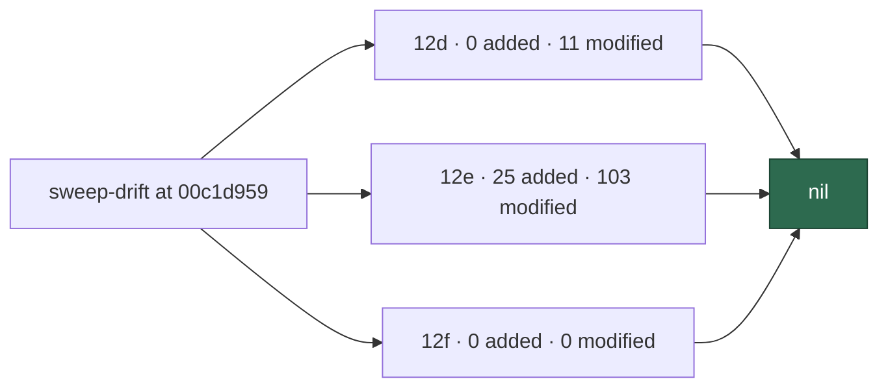

# 🔎 Security sweep — `worker/deno/lib/` delta, slices 12d–12f

**Issue:** [#1611](https://github.com/stSoftwareAU/VibeCoder/issues/1611)
· **Parent:** #1608 `security-scan-overflow: 6 chunks not reached`

This is the written record for the modules in ledger slices 12d (#1217
environment / config / secret sinks), 12e (#1219 closing pass) and 12f
(#1325 gh-chokepoint top-up) that were added or modified since each
slice's previous `sweptAt`. The file list was regenerated by
`deno run … mod.ts sweep-drift` at
`00c1d95924a0adf7eaf419219ade7283b3e11480` — not from the stale counts
in #1611.

Siblings:
[`security-sweep-1217-env-config-secrets.md`](security-sweep-1217-env-config-secrets.md)
(12d original),
[`security-sweep-1219-lib-closing-pass.md`](security-sweep-1219-lib-closing-pass.md)
(12e original),
[`security-sweep-1325-gh-body-file-io-and-timeout.md`](security-sweep-1325-gh-body-file-io-and-timeout.md)
(12f original) and
[`security-sweep-1610-lib-delta-12a-12c.md`](security-sweep-1610-lib-delta-12a-12c.md)
(the 12a–12c half of the same overflow).

> **This result is empty.** Every added module and every modified hunk
> in the three slices' drift lists was read, skipped with a documented
> reason, or marked swept by the #1608 run. No finding survived Phase 3
> triage. 12f had no drift at all. That nil is stated here so a later
> run does not have to re-derive it.



## Scope and method

```bash
deno run --allow-read --allow-run --allow-env --allow-sys=hostname \
  worker/deno/mod.ts sweep-drift --repo "$(pwd)"
```

For a *modified* module the hunks were read and followed wherever they
touched a sink (env reads, config parsing, secret handling, or — for
12e — any newly introduced sink of the four slice classes). For an
*added* module the file was read in full. Modules named in #1608's
"Chunks swept this run" list were marked swept by that run and skipped.

Triage followed `docs/SECURITY-SCAN.md` Phase 3 (refute-unless-proven).

## Findings

| ID | Site | Severity | Confidence | Disposition |
| -- | ---- | -------- | ---------- | ----------- |
| —  | —    | —        | —          | **nil** — no surviving finding in 12d, 12e or 12f |

## Slice 12d — environment, configuration and secret sinks

Previous `sweptAt`: `838cf9013425cfed2fb479296242d088a06e595d`
(#1217 record). Drift at generation HEAD: **0 added, 11 modified,
0 unowned**.

### Idle-task templates this slice owns

12d owns sixteen idle-task templates. They are named individually
because #1611 asks for it. Only
`worker/deno/lib/idle_task_templates/orphan_deps_template.ts` changed
since the record; the other fifteen have no hunks against
`838cf901…`.

| Path | Disposition |
| ---- | ----------- |
| `worker/deno/lib/idle_task_templates/alert_feed_template.ts` | unchanged since #1217 |
| `worker/deno/lib/idle_task_templates/bash_script_refs_template.ts` | unchanged since #1217 |
| `worker/deno/lib/idle_task_templates/bash_syntax_audit_template.ts` | unchanged since #1217 |
| `worker/deno/lib/idle_task_templates/dead_code_template.ts` | unchanged since #1217 |
| `worker/deno/lib/idle_task_templates/deprecated_api_template.ts` | unchanged since #1217 |
| `worker/deno/lib/idle_task_templates/doc_coverage_template.ts` | unchanged since #1217 |
| `worker/deno/lib/idle_task_templates/documentation_audit_template.ts` | unchanged since #1217 |
| `worker/deno/lib/idle_task_templates/duplicated_knowledge_template.ts` | unchanged since #1217 |
| `worker/deno/lib/idle_task_templates/format_drift_template.ts` | unchanged since #1217 |
| `worker/deno/lib/idle_task_templates/github_actions_audit_template.ts` | unchanged since #1217 |
| `worker/deno/lib/idle_task_templates/orphan_deps_template.ts` | read — post-file severity corroboration (`verifyFiledOrphanSeverities`); hardens against steered severities on issues this run filed |
| `worker/deno/lib/idle_task_templates/private_repo_reference_template.ts` | unchanged since #1217 |
| `worker/deno/lib/idle_task_templates/retro_template.ts` | unchanged since #1217 |
| `worker/deno/lib/idle_task_templates/security_scan_template.ts` | unchanged since #1217 |
| `worker/deno/lib/idle_task_templates/test_audit_template.ts` | unchanged since #1217 |
| `worker/deno/lib/idle_task_templates/workflow_annotation_scan_template.ts` | unchanged since #1217 |

`gate_skip_drift_template.ts` also moved since `838cf901…`, but 12i
owns it, not 12d.

### Other modified modules

| Path | Disposition |
| ---- | ----------- |
| `worker/deno/lib/container_launch.ts` | skipped — swept by the #1608 run (container / sandbox) |
| `worker/deno/lib/credential_preflight.ts` | read — shared `providerPoolCandidates()` filter; no new sink |
| `worker/deno/lib/issue_finder_logger.ts` | read — logging semantics |
| `worker/deno/lib/issue_worker_wiring.ts` | read — `cleanWorkingTree` replaces bare `git clean -fd` (fail-closed, #1443) |
| `worker/deno/lib/logger.ts` | read — `envOrUndefined` swallows `NotCapable` on a diagnostic env read; log level is not a control |
| `worker/deno/lib/parallel_unsafe_test_manifest.ts` | read — test-sharding manifest entry |
| `worker/deno/lib/pr_ci_processor.ts` | read — `workRoot` / `workDir` split; removes the `/tmp` heartbeat fallback |
| `worker/deno/lib/run_core.ts` | read — slot-drain reliability; no new secret sink |
| `worker/deno/lib/shell_helpers.ts` | read — `getRepoDefaultBranch` through `spawnGh` |
| `worker/deno/lib/unit_test_passes.ts` | read — comment-only |

**12d is nil.**

## Slice 12e — closing pass over the remainder

Previous `sweptAt`: `2370a7de55bc85893dff3b342d862ab714f7795b`
(#1219 record). Drift at generation HEAD: **25 added, 103 modified,
0 unowned**.

### Added (read in full)

| Path | Disposition |
| ---- | ----------- |
| `worker/deno/lib/branch_currency.ts` | git drift / rebase before PR |
| `worker/deno/lib/completeness_checks.ts` | derives the fast manifest-check test family |
| `worker/deno/lib/conflict_marker_trust.ts` | hardening — fleet-author partition for conflict markers |
| `worker/deno/lib/console_redaction_entrypoint_check.ts` | static gate: entry points must call `installConsoleRedaction()` |
| `worker/deno/lib/current_models.ts` | Fable generation reference |
| `worker/deno/lib/fleet_pr_prefetch.ts` | cache prefetch; falls back to per-repo on failure / truncation |
| `worker/deno/lib/fleet_pr_search.ts` | cross-repo search; refuses truncated results |
| `worker/deno/lib/gh_argv.ts` | shared argv classifier for metrics / quota latch |
| `worker/deno/lib/gh_credential_disclosure_guard.ts` | hardening — refuses `gh auth token` / `gh auth status --show-token` |
| `worker/deno/lib/gh_pr_lifecycle.ts` | hardening — refuses agent PR merge / close / reopen / ready / approve |
| `worker/deno/lib/guard_deno_dir.ts` | hardening — pins guard `DENO_DIR` to the read-only image seed |
| `worker/deno/lib/guard_field_encoding.ts` | NUL-framed shim encoding |
| `worker/deno/lib/guarded_issue_labels.ts` | hardening — allowlisted `--label` at issue create |
| `worker/deno/lib/heartbeat_freshness.ts` | hardening — upper bound on heartbeat epoch |
| `worker/deno/lib/image_conclusion_gate.ts` | hardening — withholds "already resolved" close when untrusted images are present |
| `worker/deno/lib/issue_create_label_check.ts` | static gate for guarded create labels |
| `worker/deno/lib/loop_contract.ts` | supervisor parity contract extractor |
| `worker/deno/lib/milestone_local_branch.ts` | read-only local milestone-branch inspection |
| `worker/deno/lib/pr_title_build.ts` | hardening — strips issue-ref tokens from PR titles |
| `worker/deno/lib/public_url_guard.ts` | hardening — HTTPS-only SSRF guard; DNS + per-hop redirect re-validation |
| `worker/deno/lib/redact_json.ts` | hardening — structure-preserving string redaction |
| `worker/deno/lib/redact_truncate_order_check.ts` | static gate: no truncate-inside-redact |
| `worker/deno/lib/repo_loop_quota_stop.ts` | quota-exhaustion loop short-circuit |
| `worker/deno/lib/self_diagnostic_attestation.ts` | hardening — audit-journal filing attestation; fail-closed |
| `worker/deno/lib/tmp_state_dir_check.ts` | static gate: no hand-built `/tmp` / `TMPDIR` state paths |

### `alert_feeds/` this slice owns

12e owns `worker/deno/lib/alert_feeds/alert_feed_enable_issue.ts` and
`worker/deno/lib/alert_feeds/alert_fingerprint.ts`. Both are in the
modified list. Hunks are operational (enable-issue wiring, fingerprint
helpers) and do not reopen SEC-1219-04 (#1275) — that finding is the
bare concatenation of `ruleId` into a marker outside the untrusted-text
fence, already filed.

### Modified, skipped as swept by the #1608 run

- `worker/deno/lib/console_redaction.ts`
- `worker/deno/lib/prompt_leak_redaction.ts`
- `worker/deno/lib/secret_redaction.ts`
- `worker/deno/lib/worker_label_guard.ts`

### Modified, read at hunk level

High-priority secret / env / trust hunks:

`worker/deno/lib/export_scrub_gate.ts`,
`worker/deno/lib/export_tree.ts`,
`worker/deno/lib/gh_local_state_guard.ts`,
`worker/deno/lib/prompt_builder.ts`,
`worker/deno/lib/issue_content_trust_filter.ts`,
`worker/deno/lib/security.ts`,
`worker/deno/lib/security_fix_gate.ts`,
`worker/deno/lib/vibe_env_registry.ts`,
`worker/deno/lib/command_args.ts`,
`worker/deno/lib/config_defaults.ts`,
`worker/deno/lib/config_unknown_keys.ts`,
`worker/deno/lib/git_ref_args.ts`.

The remaining modified modules were skimmed for a new secret leak, env
injection or fail-open auth path. None appeared. They are listed so the
count is accounted for:

`worker/deno/lib/alert_feeds/alert_feed_enable_issue.ts`,
`worker/deno/lib/alert_feeds/alert_fingerprint.ts`,
`worker/deno/lib/audit_mutation_classifier.ts`,
`worker/deno/lib/auto_merge_sweep.ts`,
`worker/deno/lib/baseline_carryover_tracker.ts`,
`worker/deno/lib/baseline_gate.ts`,
`worker/deno/lib/bash_script_refs_scanner.ts`,
`worker/deno/lib/blocked_deferral.ts`,
`worker/deno/lib/blocked_outcome.ts`,
`worker/deno/lib/bump_deps.ts`,
`worker/deno/lib/ci_failure_issue.ts`,
`worker/deno/lib/clarity_phase.ts`,
`worker/deno/lib/claude_health_message.ts`,
`worker/deno/lib/claude_pool_budget.ts`,
`worker/deno/lib/claude_token_selection.ts`,
`worker/deno/lib/clock.ts`,
`worker/deno/lib/collect_self_diagnostic_candidates.ts`,
`worker/deno/lib/collect_work_on_candidates.ts`,
`worker/deno/lib/container_image_hash.ts`,
`worker/deno/lib/default_branch_ruleset.ts`,
`worker/deno/lib/derived_authors.ts`,
`worker/deno/lib/escape_hatch_label_strip.ts`,
`worker/deno/lib/failure_diagnosis.ts`,
`worker/deno/lib/fleet_telemetry.ts`,
`worker/deno/lib/gh_call_metrics.ts`,
`worker/deno/lib/git_branch.ts`,
`worker/deno/lib/git_push_recovery.ts`,
`worker/deno/lib/git_repo_validation.ts`,
`worker/deno/lib/git_state_recovery.ts`,
`worker/deno/lib/grill_me_processor.ts`,
`worker/deno/lib/heartbeat_storage.ts`,
`worker/deno/lib/idle_decision_census.ts`,
`worker/deno/lib/idle_task_claim_handler.ts`,
`worker/deno/lib/idle_task_claude_budget.ts`,
`worker/deno/lib/idle_task_process_issue_route.ts`,
`worker/deno/lib/idle_task_template_names.ts`,
`worker/deno/lib/idle_task_templates/supply_chain_readiness_template.ts`,
`worker/deno/lib/idle_task_wrapper_closure.ts`,
`worker/deno/lib/issue_dependencies.ts`,
`worker/deno/lib/issue_worker.ts`,
`worker/deno/lib/issue_worker_types.ts`,
`worker/deno/lib/label_clarification.ts`,
`worker/deno/lib/lib_sweep_coverage.ts`,
`worker/deno/lib/marker_dedup_author_manifest.ts`,
`worker/deno/lib/merge_conflict_drain.ts`,
`worker/deno/lib/merged_pr_issue_sweep.ts`,
`worker/deno/lib/needs_human_escalation.ts`,
`worker/deno/lib/new_work_eligibility.ts`,
`worker/deno/lib/operational_defaults.ts`,
`worker/deno/lib/phases/clarity_assessment_phase.ts`,
`worker/deno/lib/phases/execute_phase.ts`,
`worker/deno/lib/phases/handle_no_changes_phase.ts`,
`worker/deno/lib/phases/quality_gate_remediation_phase.ts`,
`worker/deno/lib/planning_run_stats.ts`,
`worker/deno/lib/pr_branch_checkout.ts`,
`worker/deno/lib/pr_check_contexts.ts`,
`worker/deno/lib/pr_failure_actions.ts`,
`worker/deno/lib/pr_feedback_processor.ts`,
`worker/deno/lib/pr_merge_conflict_processor.ts`,
`worker/deno/lib/pr_merge_conflict_scan.ts`,
`worker/deno/lib/pr_run_provenance.ts`,
`worker/deno/lib/preserved_wip_branch.ts`,
`worker/deno/lib/primary_quota_latch.ts`,
`worker/deno/lib/prompt_delimiter.ts`,
`worker/deno/lib/prompt_gate_instruction_check.ts`,
`worker/deno/lib/quorum_processor.ts`,
`worker/deno/lib/redacted_text.ts`,
`worker/deno/lib/repo_context_reader.ts`,
`worker/deno/lib/reserved_label_strip.ts`,
`worker/deno/lib/route_claim.ts`,
`worker/deno/lib/run_outcome_classifier.ts`,
`worker/deno/lib/runner_deprecation_filer.ts`,
`worker/deno/lib/security_sarif.ts`,
`worker/deno/lib/self_diagnostic_provenance.ts`,
`worker/deno/lib/setup_contract.ts`,
`worker/deno/lib/skip_reason_clearing.ts`,
`worker/deno/lib/slot_idle_accounting.ts`,
`worker/deno/lib/spawn_chokepoint_scan.ts`,
`worker/deno/lib/spend_ceiling.ts`,
`worker/deno/lib/suspicious_image_handoff.ts`,
`worker/deno/lib/transient_network_failure.ts`,
`worker/deno/lib/wip_checkpoint.ts`,
`worker/deno/lib/work_volume_usage.ts`,
`worker/deno/lib/workflow_annotation_filer.ts`,
`worker/deno/lib/workflow_definitions.ts`,
`worker/deno/lib/workflow_scan_common.ts`,
`worker/deno/lib/worktree_progress.ts`.

**12e is nil.** The added modules are overwhelmingly new guards and
static gates. The modified hunks do not introduce a secret leak, env
injection or fail-open auth path that survives refutation. The
export-as-exfiltration *lens* on `export_scrub_gate.ts` /
`export_tree.ts` is #1613 and is out of scope here; the module-level
delta was still read and is nil on the four slice-class sinks.

## Slice 12f — gh chokepoint top-up

Previous `sweptAt`: `838cf9013425cfed2fb479296242d088a06e595d`
(#1325 record). Drift at generation HEAD: **0 added, 0 modified,
0 unowned**.

This slice still claims exactly the two modules the original record
named:

- `worker/deno/lib/gh_body_file_io.ts`
- `worker/deno/lib/gh_timeout.ts`

Neither path appears in `git diff --name-only --diff-filter=A|M
838cf901… HEAD -- worker/deno/lib`. **12f is nil** — there was nothing
to re-read.

## Refutations worth keeping

- **`orphan_deps_template.ts` severity gate** — `gh` is called only on
  issue numbers this run filed; output is numbers + verdict status, not
  credentials. Corroboration hardens against LLM severity steering
  (#1549).
- **`logger.ts` `envOrUndefined`** — DEBUG / LOG_LEVEL are diagnostic
  preferences, not security controls; the swallow avoids an import-time
  crash under `--allow-read`-only shards.
- **`fleet_pr_prefetch` empty cache** — prefetch is an optimisation;
  search failure / truncation falls back to a per-repo listing.
- **`gh_credential_disclosure_guard.ts`** — closes the one-command token
  dump on the guarded channel. Residual filesystem read of a pinned
  `GH_CONFIG_DIR` is documented in-module and is not widened by this
  delta.
- **`public_url_guard.ts`** — defence added to an existing
  externally-supplied URL path: HTTPS-only, no credentials, DNS +
  per-hop redirect validation, fail-loud.
- **`self_diagnostic_attestation.ts`** — agent `gh` cannot mint a
  `file-self-diagnostic` journal verb; the journal sits outside the
  clone. Residual unrestricted-shell forgery is the same bar as the
  rest of the audit chain.
- **`pr_ci_processor.ts` `workRoot` split** — removes
  `Deno.env.get("WORK_DIR") ?? "/tmp"` for heartbeat / milestone paths;
  state is less likely to land in the clone or a shared temp.

## Coverage ledger

Slices 12d, 12e and 12f now point at this file and carry
`sweptAt: 00c1d95924a0adf7eaf419219ade7283b3e11480` — the commit the
drift list was generated from, not the later commit that contains this
prose.
