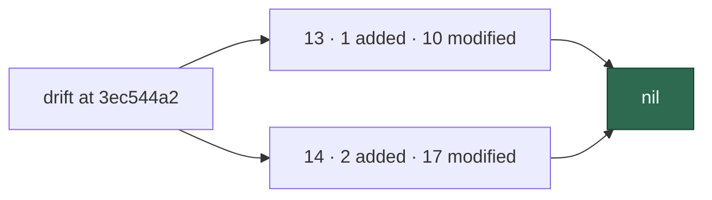

# Security sweep — `commands/` and `setup/` delta

**Issue:** [#1612](https://github.com/stSoftwareAU/VibeCoder/issues/1612)
· **Parent:** #1608 `security-scan-overflow: 6 chunks not reached`

This is the written record for the modules in ledger slices 13 (#1218
commands CLI) and 14 (#1220 setup CLI) that were added or modified since
each slice's previous `sweptAt`. The file list was regenerated by
`git diff --name-only --diff-filter=A|M <sweptAt> HEAD` over each
slice's root — the same report `deno run … mod.ts sweep-drift` prints —
at `3ec544a22e5a43264e7576aab425919e6b8f3b8a`, not from the stale
counts in #1612 (24 commands / 16 setup).

Siblings:
[`security-sweep-1218-commands-cli.md`](security-sweep-1218-commands-cli.md)
(13 original) and
[`security-sweep-1220-setup-cli.md`](security-sweep-1220-setup-cli.md)
(14 original).

> **This result is empty.** Every added module and every modified hunk
> in both slices' drift lists was read, skipped with a documented
> reason, or marked swept by the #1608 run. No finding survived Phase 3
> triage. That nil is stated here so a later run does not have to
> re-derive it.



## Scope and method

```bash
git diff --name-only --diff-filter=A \
  838cf9013425cfed2fb479296242d088a06e595d HEAD -- worker/deno/commands
git diff --name-only --diff-filter=M \
  838cf9013425cfed2fb479296242d088a06e595d HEAD -- worker/deno/commands
git diff --name-only --diff-filter=A \
  2370a7de55bc85893dff3b342d862ab714f7795b HEAD -- worker/deno/setup
git diff --name-only --diff-filter=M \
  2370a7de55bc85893dff3b342d862ab714f7795b HEAD -- worker/deno/setup
```

Commands were banded as
[`security-sweep-1218-commands-cli.md`](security-sweep-1218-commands-cli.md)
does (A GitHub-event, B idle-task, C operator-terminal) and read at that
band's depth. Setup is local exposure; calls into `lib/` were followed
and a finding would be recorded against the file the defect lives in, as
[`security-sweep-1220-setup-cli.md`](security-sweep-1220-setup-cli.md)
did.

For a *modified* module the hunks were read. For an *added* module the
file was read in full. `#1608` named `commands/git_operations.ts` in
"Chunks swept this run" (chunk 6); its hunks were still read because
they move a cache and change a clean.

Triage followed `docs/SECURITY-SCAN.md` Phase 3 (refute-unless-proven).
The only open `security` issues at this record were #1612 and #1613
themselves; historical findings from #1218/#1220 are already closed
and were not re-filed.

## Findings

| ID | Site | Severity | Confidence | Disposition |
| -- | ---- | -------- | ---------- | ----------- |
| —  | —    | —        | —          | **nil** — no surviving finding in 13 or 14 |

## Slice 13 — commands CLI

Previous `sweptAt`: `838cf9013425cfed2fb479296242d088a06e595d`
(#1218 record). Drift at generation HEAD: **1 added, 10 modified,
0 unowned**.

| Path | Band | Disposition |
| ---- | ---- | ----------- |
| `worker/deno/commands/sweep_drift.ts` | C | read in full — new report command; injected git runner; no spawn of `gh`; prints paths already in the ledger |
| `worker/deno/commands/container_launch_plan.ts` | C | read — stamps `buildCommit` via `resolveBuildCommitStamp` (Issue #1572); no new spawn |
| `worker/deno/commands/git_operations.ts` | A3 | read; also named in #1608 chunk 6. Hunks move the default-branch cache into `.git/vibe/default_branch` (Issues #1652, #1269, #1644) and route `clean` through `cleanWorkingTree` (Issue #1443). Hardening, not a new sink |
| `worker/deno/commands/maybe_file_idle_task.ts` | B1 | read — one import of `gate_skip_drift_template.ts`; no new dispatcher |
| `worker/deno/commands/pr_ci_processor.ts` | A2 | read — passes `workRoot: config.workDir` (Issue #1662) so heartbeat/milestone state is not written into the clone |
| `worker/deno/commands/pr_feedback_processor.ts` | A2 | read — same `workRoot` split |
| `worker/deno/commands/pr_spelling_processor.ts` | A2 | read — same `workRoot` split |
| `worker/deno/commands/process_add_repo.ts` | A3 | read — `git` argv now goes through `runGitArgv` (Issue #1553); `gh` already through `spawnGh` |
| `worker/deno/commands/resolve_cross_repo_dep.ts` | A3 | read — same `runGitArgv` delegation for clone/checkout/commit/push |
| `worker/deno/commands/security_tree_sweep.ts` | B1 | read — CLI now names already-tracked clusters (Issue #1518); no new file/create path |
| `worker/deno/commands/work_on_issue.ts` | A1 | read — forwards `untrustedImages` from the content-trust filter (Issue #1385) so the no-changes phase can withhold a close |

### Commands refutations

- **`sweep_drift.ts` as an information leak.** It lists paths the
  operator's own checkout already contains. It does not read issue
  bodies or post to GitHub.
- **`git_operations.ts` cache write as a planted-ref hole.** The old
  `.vibe_default_branch` in the working tree *was* that hole (#1269).
  The hunks close it. `assertSafeRefComponent` stays on the read path.
- **`process_add_repo` / `resolve_cross_repo_dep` still spawning
  `Deno.Command` for `git`.** They no longer do; `git` is
  `runGitArgv`. Other binaries stay on the generic runner, which is
  the same residual #1218 already accepted for `brew`/`jq` probes.
- **`work_on_issue` `untrustedImages` as a new injection.** It is an
  observation passed into a withholding decision, not a path that
  renders image bytes as instruction.

## Slice 14 — setup CLI

Previous `sweptAt`: `2370a7de55bc85893dff3b342d862ab714f7795b`
(#1220 record). Drift at generation HEAD: **2 added, 17 modified,
0 unowned**.

| Path | Disposition |
| ---- | ----------- |
| `worker/deno/setup/consent_prompt.ts` | read in full — one-line stdin reader (Issue #1296); no spawn, no write |
| `worker/deno/setup/setup_command_runner.ts` | read in full — single `gh`/`git` chokepoint for setup (Issue #1259); other binaries still `Deno.Command` by design |
| `worker/deno/setup/best_practices_relabel.ts` | read — routed onto `createSetupRunCommand` |
| `worker/deno/setup/best_practices_sync.ts` | read — same runner |
| `worker/deno/setup/branch_protection_sync.ts` | read — same runner; security decisions remain in `lib/` |
| `worker/deno/setup/collaborator_precheck.ts` | read — `gh` through the shared runner; fail-closed on unreadable collaborator lists |
| `worker/deno/setup/config_setup.ts` | read — consent via `readConsentLine`; writes stay on the host config path |
| `worker/deno/setup/config_writer.ts` | read — runner + atomic write unchanged in kind |
| `worker/deno/setup/content_label_definitions.ts` | read — frozen table plus a colour row; no sink |
| `worker/deno/setup/gitignore_sync.ts` | read — still local FS via helpers |
| `worker/deno/setup/label_colour_reconcile.ts` | read — `gh` through the shared runner |
| `worker/deno/setup/label_definitions.ts` | read — frozen table |
| `worker/deno/setup/label_sync.ts` | read — `gh` through the shared runner; reserved-label work stays in `lib/` |
| `worker/deno/setup/launchagent.ts` | read — plist write still uses the #1220 atomic/chmod discipline; `id`/`launchctl` stay local |
| `worker/deno/setup/prerequisite_installer.ts` | read — installer argv through the shared runner |
| `worker/deno/setup/prerequisites.ts` | read — version probes through the shared runner |
| `worker/deno/setup/screenshot.ts` | read — MCP containment hunks (Issues #1288, #1292, #1293, #1386); still a local `Deno.Command` for the MCP child, as #1220 recorded |
| `worker/deno/setup/setup_cli.ts` | read — wires consent + runner; no new privileged default |
| `worker/deno/setup/workflow_sync.ts` | read — `gh` through the shared runner |

### Setup refutations

- **`setup_command_runner.ts` still spawning non-`gh`/`git` binaries
  directly.** Intended. No chokepoint owns `brew`/`jq`/`deno`. The
  quality gate now scans `setup/` so a new `gh`/`git` spawn cannot
  skip the runner.
- **`screenshot.ts` MCP `Deno.Command` as a new host-escape.** The
  delta *narrows* `--allow-net` / `--deny-read` / profile containment.
  Residual: the MCP child can still start a browser; that is the
  feature, scoped to loopback, and is already in #1220 / the threat
  model.
- **`consent_prompt.ts` truncating long pastes.** Truncation can only
  decline (`isAffirmative` is exact `y`/`yes`). Type-ahead cannot
  consent to a later question.

## Coverage ledger

Slices 13 and 14 now point at this file and carry
`sweptAt: 3ec544a22e5a43264e7576aab425919e6b8f3b8a` — the commit the
drift list was generated from, not the later commit that contains this
prose.
