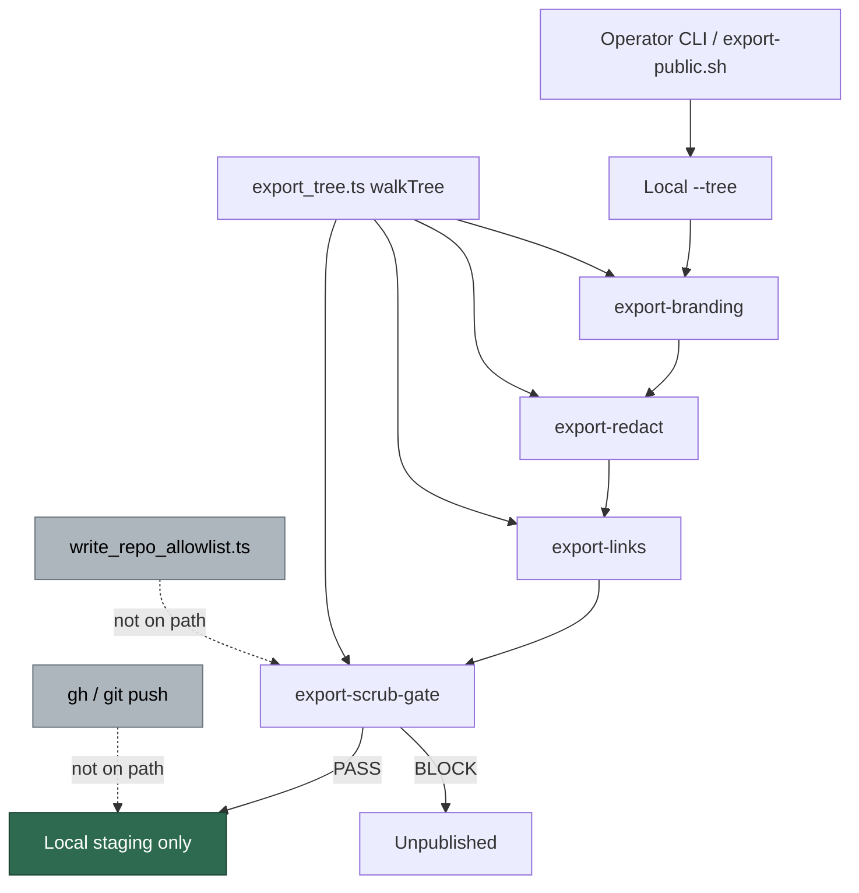

# Security sweep — export-as-exfiltration abuse case

**Issue:** [#1613](https://github.com/stSoftwareAU/VibeCoder/issues/1613)
· **Parent:** #1608 `security-scan-overflow: 6 chunks not reached`

This is the written record of the eight-module trace #1613 asked for
(`export_branding`, `export_redact`, `export_scrub_gate`, `export_tree`,
plus the matching commands). `commands/export_links.ts` is on the same
pipeline and is included so the hop list is complete.

Sibling: [`security-sweep-1218-commands-cli.md`](security-sweep-1218-commands-cli.md)
already treated the export pipeline as a band-C secret-scrub gate.

> **This result is empty for AP-8.** Export is an operator-terminal
> local-filesystem pipeline. It never configures a remote, never
> pushes, never spawns `gh`, and never consults
> `write_repo_allowlist.ts`. All four attack cases are refuted. The
> AP-8 row in [`docs/THREAT-MODEL.md`](../THREAT-MODEL.md) is left
> untouched. That nil is stated here so a later run does not have to
> re-derive it.

## Who can invoke

| Surface | Can invoke? | Evidence |
| ------- | ----------- | -------- |
| Issue label | no | export commands are not imported from the work-on / idle-task path |
| Issue or PR comment | no | nothing under `prompts/` names these commands |
| Worker run loop | no | `worker/deno/lib/*.ts` has no call into the export modules |
| Operator terminal / CI | yes | registered on `mod.ts` as optional commands that do not require `.config.json` |

`README.md` documents `export-public.sh` as the orchestrator and states
that export never configures a remote or pushes. The script itself is
not in this checkout; the four Deno commands are the in-tree
implementation.

## Invocation → input → sink hops

### Shared walk — `lib/export_tree.ts`

| Hop | Site | What happens |
| --- | ---- | ------------ |
| Entry | `export_tree.ts:67` | `walkTree(root)` |
| Skip `.git/` | `export_tree.ts:17`, `:101` | never descended |
| Symlinks | `export_tree.ts:92-98` | recorded, never followed |
| Files | `export_tree.ts:103-104` | regular files only |
| List helper | `export_tree.ts:80-82` | `listTreeFiles` returns `.files` |

### Branding

| Hop | Site | What happens |
| --- | ---- | ------------ |
| Command | `commands/export_branding.ts:54-59` | operator CLI; `--tree` required |
| Unknown options | `commands/export_branding.ts:62-69` | refused (#1266) |
| `--check` | `commands/export_branding.ts:82-89` | `coerceBooleanFlag`; no silent rewrite |
| Transform | `lib/export_branding.ts:205-243` | `listTreeFiles` → `Deno.readFile` → rewrite |
| Write | `lib/export_branding.ts:240-243` | in-place `--tree` when `write` is true |
| Report | `commands/export_branding.ts:105-107` | optional local `--report` |

### Redaction

| Hop | Site | What happens |
| --- | ---- | ------------ |
| Command | `commands/export_redact.ts:41-47` | `--tree`, `--redactions`, `--identifiers` required |
| Parse | `lib/export_redact.ts:80` | operator-authored rules |
| Tree | `lib/export_redact.ts:321` | `redactTree` via `listTreeFiles` |
| Write | `lib/export_redact.ts:372-421` | in-place rewrite / `Deno.rename` |
| Report | `commands/export_redact.ts:108-110` | optional local `--report` |

### Links

| Hop | Site | What happens |
| --- | ---- | ------------ |
| Command | `commands/export_links.ts:29-35` | `--tree` and `--source` required |
| Relink | `lib/export_links.ts:136-187` | `.md` only; `Deno.stat` on `--source` |
| Write | `lib/export_links.ts:187` | in-place `--tree` |

### Scrub gate

| Hop | Site | What happens |
| --- | ---- | ------------ |
| Command | `commands/export_scrub_gate.ts:51-66` | unknown options refused; no bypass flags |
| Walk | `lib/export_scrub_gate.ts:831` | `walkTree` |
| Symlink coverage | `lib/export_scrub_gate.ts:832-842` | `symlink-unscanned` (#1412) |
| Binary coverage | `lib/export_scrub_gate.ts:849-858` | `binary-unscanned` (#1265) |
| Verdict | `lib/export_scrub_gate.ts:768-771` | `gatePasses` requires coverage findings |
| Report | `lib/export_scrub_gate.ts:465-467`, `:873-890` | `maskMatch`; no raw secret in the finding |

None of these modules import `write_repo_allowlist`, `spawnGh`, or
spawn `git push`.

## Attack cases

### 1. Attacker-steered export target (public repo or branch)

**Refuted.** The commands take directory paths (`--tree`, `--source`),
not `owner/repo` or a branch. No worker, label or comment path supplies
those arguments. There is no push target to steer.

### 2. Attacker-steered inclusion of paths the scrub gate does not cover

**Refuted for automated steering.** The walk never follows a symlink
and never descends `.git/`. A binary or a symlink raises a blocking
coverage finding (`gatePasses` at `export_scrub_gate.ts:768-771`).
Staging is the operator's manifest, not an issue body. Wrong inclusion
is operator misconfiguration, not AP-8. #1265 already covers the
historical silent-binary gap; it is not re-filed.

### 3. Scrub-gate bypass by content shape

**Refuted as an AP-8 route.** There is no `--force` / `--skip`.
Unknown options are refused on the gate command. Coverage classes
block a PASS when a file was not scanned. Residual detection limits
(line-oriented scan, reviewed `*` allowlist entries that require a
comment) are operator-publish gaps, not GitHub-write exfiltration.

### 4. Export output reaching a comment, PR or issue in another repo

**Refuted.** Every sink is local (`Deno.writeTextFile` under `--tree`
or `--report`, plus stdout). AP-8 is "a successful injection posts
private repository contents as a comment, PR body or issue in a
different, public repository" and its control is
`write_repo_allowlist.ts`. That module is not on this path.

## Threat-model consequence

The AP-8 row stays as it is. Export is not a GitHub-write route.

## Findings

| ID | Site | Severity | Confidence | Disposition |
| -- | ---- | -------- | ---------- | ----------- |
| —  | —    | —        | —          | **nil** — four attack cases refuted; #1265 / #1412 / #1266 already cover the historical gaps |
