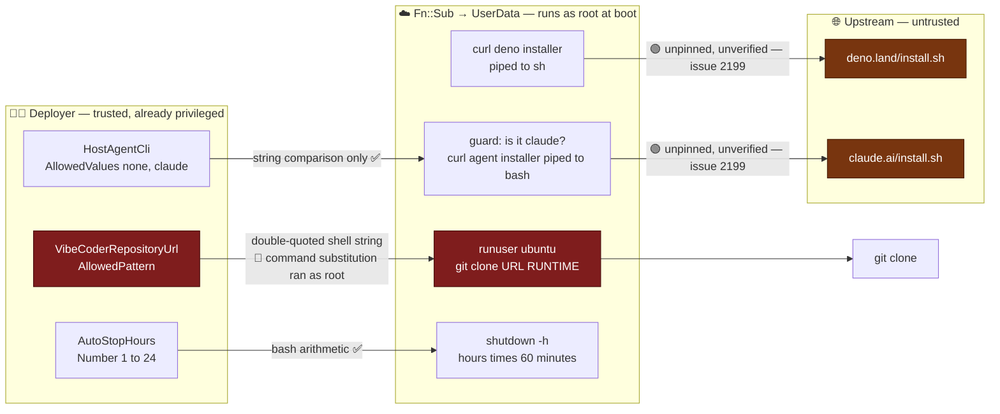

# 🔎 Security sweep — the Linux/podman verification host template

**Issue:** [#2180](https://github.com/stSoftwareAU/VibeCoder/issues/2180)
(chunk 2) · **Parent:** #2170 `security-scan-overflow: 2 chunks not reached`

`infra/cloudformation/linux-verification-host.yaml` had **never** been recorded
under `docs/audits/`. This slice read it end to end — 377 lines as read, the
Parameters, the VPC / security-group / IAM resources, the instance's
`MetadataOptions` and EBS settings, and the `UserData` bootstrap rendered
through `Fn::Sub` — and triaged it per
[`docs/SECURITY-SCAN.md`](../SECURITY-SCAN.md) Phase 3.

Sibling on the same parent:
[`security-sweep-2179-container-toolchains.md`](security-sweep-2179-container-toolchains.md)
(chunk 1), whose shape this record follows.

> **One finding survived, one was fixed here.** The deployer-controlled
> `VibeCoderRepositoryUrl` reached a root shell as a live command-substitution
> sink — **fixed in this change** with a regression test that was observed
> failing first. The unverified `curl | sh` host installers survived triage and
> are filed as **#2199**. Three of the five cases the issue named were
> **refuted**, and each refutation is stated below rather than left implied.

## Scope and method

| File                                                | Lines (as read) |
| --------------------------------------------------- | --------------- |
| `infra/cloudformation/linux-verification-host.yaml` | 377             |

Counted at the base of this change. The committed file is longer: this change
adds the tightened `AllowedPattern`'s rationale and corrects the bootstrap's
substitution comment.

Read against the two artefacts that bound it:
`worker/deno/tests/linux_verification_host_template_test.ts` (the only automated
gate on a template no CI deploys) and `docs/EC2-LINUX-VERIFICATION.md` (the
operator manual). The template is deployed by hand, so there is no runtime to
observe — every claim below was instead **executed** against the rendered
script: the `Fn::Sub` render, the command-substitution reproduction, the
arithmetic on `AutoStopHours`, and `bash -n` over the whole bootstrap.

### The two design points that are not findings

The template header names them, and this sweep confirms neither is a defect:

- **Only podman is installed.** The launcher probes Docker first, so leaving
  Docker out is what forces the podman branch to run.
- **The host stays stock Ubuntu.** The podman environment faults of #722 must
  still reproduce here, so nothing pre-patches them.

Both are asserted by the existing test
(`podman is left stock so the known environment faults still reproduce`). They
are recorded here so a later reader does not "fix" them.

### The trust boundary this sweep assumes

Stating it is what turns several observations below into residuals rather than
findings.

**Who can deploy the stack** is an AWS principal holding CloudFormation create
rights over EC2, IAM and VPC in the account — `CAPABILITY_IAM` is required,
because the stack creates a role. That principal can already put arbitrary code
in `UserData` directly, or launch any instance with any role. So a **hostile
deployer is not a boundary this template can defend**, and no finding survives
here merely because a deployer could misuse a parameter.

What the template _can_ defend, and what the findings below are about:

- **An honest deployer supplying a bad value.** A fork URL pasted from
  somewhere, or one carrying a credential. The parameter boundary is the only
  thing between that value and a root shell, so its tightness is a real control
  — case 4.
- **An upstream attacker.** Whoever can serve different bytes at the two
  installer URLs. Nothing about the deployer's privilege helps here — case 3.
- **Anything reaching _in_.** Nothing can: no ingress rule, no key pair, SSM
  Session Manager only — case 1.

The host itself is throwaway, holds **no credential from the template** (the
operator types them into the session later), and carries the SSM core policy and
nothing else — which is what bounds every severity below to **Low**.

## Parameter → UserData → sink



Three parameters reach the bootstrap and no others. `InstanceType`,
`RootVolumeSizeGb` and `UbuntuAmiId` are consumed by CloudFormation resource
properties and never enter the script.

## Findings

| # | Where                                               | Class                                                   | Severity | Status           |
| - | --------------------------------------------------- | ------------------------------------------------------- | -------- | ---------------- |
| 1 | `linux-verification-host.yaml:68` / `:341`          | command injection into a root shell (CWE-78, A05:2025)  | low      | **Fixed here**   |
| 2 | `:324`, `:332` — root cause `docs/SETUP.md:532,536` | unverified `curl \| sh` install (CWE-494, A03/A08:2025) | low      | **Filed: #2199** |

### 1 — a repository URL that passed `AllowedPattern` executed as root

`:341` interpolates the parameter into a **double-quoted** shell string:

```bash
runuser -l ubuntu -c "git clone ${VibeCoderRepositoryUrl} $RUNTIME"
```

`Fn::Sub` substitutes the value as text before any shell sees it, so quoting
stops word-splitting but not `$( … )` — and the old pattern,
`^https://[A-Za-z0-9._~:/?#@!$&'()*+,;=%-]+$`, admitted `$`, `(`, `)`, `;`, `&`
and `'`. A space is not needed to weaponise it: `$IFS` supplies one.

Reproduced against the unfixed template. The payload
`https://github.com/x$(touch$IFS./INJECTED)y.git` **matches the old
AllowedPattern**, and the rendered clone line created the file:

```console
$ bash script.sh
RUNUSER ARGV: -l ubuntu -c git clone https://github.com/xy.git /home/ubuntu/vibe-coder-runtime
$ ls
INJECTED  script.sh
```

Two details make it worse than it first reads, and both were checked:

- **It runs as root, not as `ubuntu`.** The substitution is evaluated by the
  outer cloud-init shell while it builds `runuser`'s argument — `runuser` has
  not been invoked yet. The `-l ubuntu` is irrelevant to the injected command.
- **The clone URL is not otherwise constrained.** `git` never sees the injected
  text at all (the substitution is consumed before the argument is assembled),
  so the bootstrap can complete with `OK` while the command has already run.

**Why it is a finding at all**, given the deployer is trusted: the pattern is
_declared_ as the validation boundary for this value, and a boundary that admits
arbitrary code is broken whatever sits behind it. Severity stays **Low** because
exercising it requires the deploy rights described above.

**Fix (one line).** `AllowedPattern: ^https://[A-Za-z0-9._~:/@%+-]+$` — the
characters a clone URL actually needs, and no shell metacharacter. The default,
a fork URL, a `host:port` self-hosted URL and the `user:token@host` userinfo
form a private fork needs all still pass; `$`, `` ` ``, `(`, `)`, `;`, `&`, `'`,
`"`, `|`, `<`, `>`, `\`, space, tab, newline, `*`, `?`, `!`, `#`, `{`, `}`, `[`,
`]`, `=` and `,` are all refused.

**Regression test.**
`linux_verification_host_template_test.ts::the repository URL parameter admits
no shell metacharacter, because the clone line is a live command-substitution
sink`.
It was observed failing against the unfixed template
(`AllowedPattern admits "$" into the clone command line`). The test does not
merely assert the pattern: it renders the real clone line with the payload and
runs it with `runuser` stubbed, so the **sink is demonstrated live** and the
test's own premise fails loudly if the template ever stops interpolating the URL
into a shell string.

### 2 — the two host installers are unverified — filed as #2199

`:324` and `:332` pipe vendor scripts straight into an interpreter with no
version pin and no checksum, against a repository standard that is the opposite
everywhere else it fetches a toolchain: every download in the container chain is
`sha256sum -c -`-verified against `container/tools.json` (the #2179 sweep
confirmed all fourteen), and the container's Deno comes from a digest-pinned
image (`container/Containerfile:15`).

Filed as **#2199** against the **root cause** — `docs/SETUP.md:532,536`, the
documented manual Linux install — rather than against the template, which
faithfully mirrors it by design. `setup.sh:999` and `quality.sh:71` print the
same advice and are the other two call sites; all four must move together or the
template stops mirroring the documented path.

Classification, as the issue asked: **A03:2025 Software Supply Chain Failures**
(unpinned third-party install fetched and executed) and **A08:2025 Software or
Data Integrity Failures** (no integrity check before execution) — and the scan's
own `curl | sh` entry under the **Supply chain** taxonomy class in
`docs/SECURITY-SCAN.md`. The attacker is upstream, not the deployer, so the
trust boundary above does **not** dissolve this one the way it dissolves a
"hostile deployer" reading of finding 1: the deployer's privilege is no defence
against bytes served from `deno.land`.

**Why Low, not higher.** The window is real — the installers run before the
operator opens the session in which they type `gh auth login` and the provider
credential, so a tampered installer is positioned for credential theft, and a
tampered `deno` sits under the worker's toolchain for the whole run. It is
bounded by everything else in the template: throwaway host, no credential in the
template or user data, egress on 443/80/53/123 only, and an instance role of
`AmazonSSMManagedInstanceCore` alone — no AWS data path to pivot onto.

## The five cases the issue named

| # | Case                                                                              | Verdict                                                          |
| - | --------------------------------------------------------------------------------- | ---------------------------------------------------------------- |
| 1 | Network posture — no ingress, egress 443/80/53/123, SSM the only way in           | **Refuted** (no defect)                                          |
| 2 | Identity — SSM core only, IMDSv2 enforced, encrypted root volume                  | **Refuted** (no defect)                                          |
| 3 | Unpinned `curl \| sh` vs the container chain's mandatory SHA-256                  | **Confirmed** — #2199                                            |
| 4 | `VibeCoderRepositoryUrl` reaching a shell string through a loose `AllowedPattern` | **Confirmed** — finding 1, fixed here, no issue filed            |
| 5 | `${!VAR}` escaping — only the intended stack parameters are substituted           | **Refuted** as a security defect; a comment inaccuracy corrected |

### Case 1 — network posture holds

- **No ingress at all.** `HostSecurityGroup` declares `SecurityGroupEgress`
  only; there is no `SecurityGroupIngress` property and no standalone
  `AWS::EC2::SecurityGroupIngress` resource. No `KeyName` appears anywhere in
  the parsed template, at any depth.
- **Egress is five explicit rules** (`:188-213`) — 443/tcp, 80/tcp, 53/udp,
  53/tcp, 123/udp — each to `0.0.0.0/0`. Declaring them explicitly is what
  replaces CloudFormation's implicit allow-all egress; **22 and 3389 are closed
  outbound**, which is what stops a reverse shell from this host over SSH and is
  asserted by the existing test.
- **SSM really is the only way in.** The public address (`:143`
  `MapPublicIpOnLaunch: true`) exists so the SSM agent and the package mirrors
  are reachable without a NAT gateway; it is not an inbound path, because the
  security group answers nothing. The agent dials out over 443.
- **`0.0.0.0/0` on egress is not a finding here.** The destinations are the SSM
  regional endpoints, GitHub, container registries, Ubuntu mirrors and public
  NTP — none has a stable CIDR, and the host must reach all of them for the
  verification to mean anything. Narrowing to VPC endpoints would be a different
  (and more expensive) design, not a fix to this one.

### Case 2 — identity and host hardening hold

- **`AmazonSSMManagedInstanceCore` and nothing else** (`:231`). No inline
  `Policies`, and no `Action: "*"` or `Resource: "*"` anywhere in the parsed
  template at any depth.
- **IMDSv2 is enforced** — `HttpTokens: required` (`:263`), with
  `HttpPutResponseHopLimit: 1` (`:264`) so a container on the host cannot reach
  the metadata service through an extra hop.
- **The root volume is encrypted** (`:271`, `Encrypted: true`, gp3,
  `DeleteOnTermination: true`).
- **`InstanceInitiatedShutdownBehavior: stop`** — the auto-stop timer produces a
  stopped instance, not a lost one. An availability property, recorded because
  the same line would be a data-loss defect if it said `terminate`.
- All five are asserted by the existing test suite, so a later edit that
  loosened any of them fails CI.

### Case 3 — the installer chain

Confirmed; see finding 2 and #2199. Two sub-claims were checked and are **not**
defects:

- **`set -o pipefail` is repeated inside each `runuser` login shell** (`:324`,
  `:332`). It has to be: the outer shell's options do not cross `runuser`, so
  without it a failed download would exit 0 through the interpreter and the
  bootstrap would carry on as though the install had worked. The existing test
  asserts every piped `runuser` line carries it.
- **Every prerequisite is proved to run before `OK`** (`:346-360`) — `podman`,
  `git`, `gh`, `deno` and, on the `claude` branch, `claude` are each executed in
  the same login shell the operator will get. "The installer did not obviously
  fail" is explicitly not treated as success, which is the fail-loud discipline
  the coding standards require.

### Case 4 — the parameter reaching a shell string

Confirmed; see finding 1. The decision the issue asked for, stated plainly: this
is a **finding, not an accepted residual**. The argument for "residual" is that
the deployer is already privileged — but the pattern exists to be the validation
boundary for this value, the fix is one line, no legitimate clone URL is lost,
and the test that pins it also demonstrates the sink. A boundary that is
declared and broken is not a residual.

**`HostAgentCli` is the counter-example and is clean.** It is also substituted
into the script, twice, but `AllowedValues: [none, claude]` means CloudFormation
refuses anything else before the template renders, and both uses are the right
half of a `[ "…" = "claude" ]` comparison.

**`AutoStopHours` is clean too.** `Type: Number`, `MinValue: 1`, `MaxValue: 24`,
and it lands in `$(( … * 60 ))` (`:363`) where bash arithmetic accepts only
integers.

### Case 5 — the `${!VAR}` escaping

**Refuted as a security defect.** Every `${…}` in the bootstrap is either an
escaped shell variable or a name CloudFormation can resolve:

| Form                        | Occurrences                    |
| --------------------------- | ------------------------------ |
| `${!LINENO}`                | 1 — the ERR trap's line number |
| `${AutoStopHours}`          | 1                              |
| `${HostAgentCli}`           | 2                              |
| `${VibeCoderRepositoryUrl}` | 1                              |

Nothing else. The many plain `$STATUS`, `$LOG`, `$RUNTIME` and `$HOME`
references need no escape at all: `Fn::Sub` substitutes `${Name}` only, so a
brace-less `$VAR` passes through untouched — and the `/etc/profile.d` block is
written through a **quoted** heredoc (`<<'PROFILE'`, `:335`), so its `$HOME` is
not expanded at write time either.

**One inaccuracy corrected.** The script's own header comment said "only the
**two** stack parameters below are substituted". There are **three**. The
comment now names all three and the constraint on each, and a new test pins the
substituted set exactly — so the next parameter added to this script has to be
reviewed against its sink before the list can grow.

## Categories the issue did not name that were looked for — and came back empty

Stated explicitly, because an unstated empty category is indistinguishable from
one that was skipped.

- **Secrets in the template — empty.** No key, token or credential, and no
  hard-coded account id or AMI id. Asserted by the existing test.
- **`eval`, `source` of a computed path, dynamic dispatch — empty.** None
  appears in the bootstrap.
- **Destructive `rm` — empty.** The bootstrap removes nothing.
- **Unpinned AMI — by design, and safe.** `UbuntuAmiId` resolves Canonical's
  public SSM parameter at deploy time rather than pinning an id that would rot
  and would tie the template to one region. Reading it needs no credential and
  it is a first-party AWS-hosted pointer.
- **`apt-get install` without version pins** (`:314`) — the Ubuntu archive over
  the distribution's own signed repositories, which is the platform's integrity
  mechanism. Not the same class as finding 2, where nothing verifies anything.
- **Outputs export nothing.** No `Export` on any output, so no other stack can
  couple itself to this throwaway one.

## Observations that are not findings

- **A fractional `AutoStopHours` fails loud, it does not misfire.**
  `AutoStopHours=8.5` passes CloudFormation's `Number` type but
  `$(( 8.5 * 60 ))` is a bash arithmetic error — executed: exit 1,
  `invalid arithmetic operator`. Under `set -e` plus the ERR trap that records
  `FAILED` and no `OK`, so the operator sees it. The cost is that the auto-stop
  timer is never armed on such a boot, which the status file makes visible.
- **The clone URL is visible three ways, so a credential must not go in it.**
  The parameter is not `NoEcho`, so the value appears in
  `describe-stacks`/`describe-stack-events`, in the rendered user data (which
  any local process can read through IMDS), and in CloudFormation's own history.
  That is correct for a public clone URL and wrong for a `https://user:token@…`
  one. The documented flow authenticates interactively in the session, so a
  credentialed URL is outside it — the parameter description and
  `docs/EC2-LINUX-VERIFICATION.md` now say so, since it is an operator step.
  `NoEcho: true` was **not** applied: it would hide a value operators
  legitimately read back, to defend against a misuse the guidance now names.
- **`/var/log/vibe-bootstrap.log` is world-readable** (root's default umask). It
  holds `apt` and installer output, not credentials, and the operator is told to
  read it over the session. Recorded so a future change that logs something
  sensitive knows the file's mode is not restrictive.
- **No CI deploys this template.** `cfn-lint` is not in the quality gate, and
  nothing validates the stack against CloudFormation itself — the Deno test is
  the whole gate. It parses the YAML, renders `Fn::Sub` the way CloudFormation
  would, and runs `bash -n` over the result, which covers the failure modes a
  reviewer cannot eyeball. A real `validate-template` call would need AWS
  credentials in CI, which is a larger decision than this sweep.
- **The bootstrap is not idempotent and does not re-arm on reboot.** The user
  data runs once, so a restarted instance has no auto-stop timer. Documented in
  `docs/EC2-LINUX-VERIFICATION.md`, with the command to re-arm it by hand.
