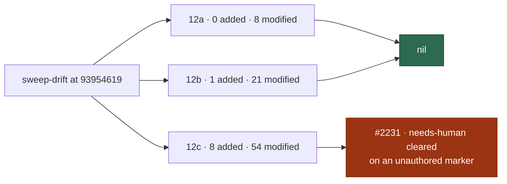

# 🔎 Security sweep — `worker/deno/lib/` delta, slices 12a–12c

**Issue:** [#2182](https://github.com/stSoftwareAU/VibeCoder/issues/2182) ·
**Parent:** #2170 `security-scan-overflow: 2 chunks not reached`

This is the written record for the modules in ledger slices 12a (#1214
subprocess/argv), 12b (#1215 filesystem/temp) and 12c (#1216 untrusted GitHub
ingestion) that were added or modified since the
[#1610 record](security-sweep-1610-lib-delta-12a-12c.md) landed at
`9442a93225c2adb41b641a1f021ad99458fb6341`. The file list was regenerated with
`sweep-drift` — not from the counts in #2182, which were measured at planning
time and have since moved.

Siblings:
[`security-sweep-1610-lib-delta-12a-12c.md`](security-sweep-1610-lib-delta-12a-12c.md)
(the record this delta is measured from),
[`security-sweep-1611-lib-delta-12d-12f.md`](security-sweep-1611-lib-delta-12d-12f.md)
(the 12d–12f half, whose own delta is #2183) and
[`security-sweep-1612-commands-setup-delta.md`](security-sweep-1612-commands-setup-delta.md)
(`commands/` and `setup/`, whose delta is #2184).

> **One finding survived.** Every added module and every modified hunk in the
> three slices' drift lists was read. 12a and 12b are nil; 12c produced one
> survivor, filed as
> [#2231](https://github.com/stSoftwareAU/VibeCoder/issues/2231). The two nils
> are stated explicitly so a later run does not have to re-derive them.



## Scope and method

```bash
deno run --allow-read --allow-run --allow-env --allow-sys=hostname \
  worker/deno/mod.ts sweep-drift --repo "$(pwd)"
```

For a _modified_ module the hunks
(`git diff 9442a93225c2adb41b641a1f021ad99458fb6341 HEAD -- <path>`) were read
and followed into the module wherever a hunk touched the slice's sink. For an
_added_ module the file was read in full — a ledger top-up claim is not a sweep
record.

**Nothing was skipped.** #2170 names `claude_runner.ts`, `workflow_scope.ts` and
`reserved_label_strip.ts` as individually re-read by that run, so they were
eligible to be listed as skipped-with-citation. Only `claude_runner.ts` is in
these three slices at all, and its hunks were read here anyway because they
change what is written to the prompt file and what the retry ladder scans.
`workflow_scope.ts` (12d) and `reserved_label_strip.ts` (12e) are owned by
slices outside this record, so their drift belongs to #2183.
`claude_credential_pool.ts` — the one #2170 records as only _partially_ read —
is owned by slice 12k, also outside this record, but #2182 asks for it by name,
so it was read here too; see below.

Triage followed [`docs/SECURITY-SCAN.md`](../SECURITY-SCAN.md) Phase 3
(refute-unless-proven). A candidate only survives when a concrete
attacker-controlled input reaches a sink unsafely.

## Findings

| ID                                                             | Site                                                                         | Severity | Confidence | Disposition                                                                                                    |
| -------------------------------------------------------------- | ---------------------------------------------------------------------------- | -------- | ---------- | -------------------------------------------------------------------------------------------------------------- |
| [#2231](https://github.com/stSoftwareAU/VibeCoder/issues/2231) | `worker/deno/lib/milestone_branch_sync.ts:1763` `clearEarlierSyncEscalation` | Medium   | High       | **filed** — comment-marker match is not author-gated, so any commenter can have the worker strip `needs-human` |

Deduped against the open `security` issues at sweep time — one,
[#2216](https://github.com/stSoftwareAU/VibeCoder/issues/2216) (`run.sh`
content-approval baseline), which is outside these slices and is a different
root cause. Not fixed in this change: the gate needs the comment author threaded
through `escalateSyncConflict` and the fleet identity resolved, which is more
than the one-line fix #2182 allows a sweep to carry.

## Slice 12a — subprocess and argv construction

Previous `sweptAt`: `9442a93225c2adb41b641a1f021ad99458fb6341` (the
[#1610 record](security-sweep-1610-lib-delta-12a-12c.md)). Drift at generation
HEAD: **0 added, 8 modified, 0 unowned**.

### Modified

| Path                                           | Disposition                                                                                                                                           |
| ---------------------------------------------- | ----------------------------------------------------------------------------------------------------------------------------------------------------- |
| `worker/deno/lib/claude_env.ts`                | read — `withholdNonSubscriptionCredentials` _deletes_ `ANTHROPIC_API_KEY`/`ANTHROPIC_AUTH_TOKEN` from the child env; narrows what the subprocess sees |
| `worker/deno/lib/claude_runner.ts`             | read — provider-neutral decode/classify plumbing, `stdinBody` prompt payload, credential-label (not value) on the rate-limit signal                   |
| `worker/deno/lib/dependency_lock_regen.ts`     | read — workspace-member manifests defer regeneration; commands stay the fixed `LOCK_FILE_SPECS` argv                                                  |
| `worker/deno/lib/integration_test_manifest.ts` | read — constant test-name lists and prose only                                                                                                        |
| `worker/deno/lib/phases/bump_deps_phase.ts`    | read — milestone-child early return; removes a script invocation, adds none                                                                           |
| `worker/deno/lib/quality_gate.ts`              | read — records failed-check output for the baseline comparison; no argv change                                                                        |
| `worker/deno/lib/quality_helpers.ts`           | read — `recordCheck` gains an optional `output`; excerpt bounds are constants                                                                         |
| `worker/deno/lib/session_resume.ts`            | read — per-provider session ownership; ids stay discrete argv                                                                                         |

**12a is nil.** No modified hunk introduces attacker-controlled input reaching a
spawn or shell sink. `claude_runner.ts` is among the modules
[#2170](https://github.com/stSoftwareAU/VibeCoder/issues/2170) records as
individually re-read by that run and could have been skipped on that citation;
its hunks were read here anyway because they change what is written to the
prompt file and what the retry ladder scans.

## Slice 12b — filesystem, path and temp-file handling

Previous `sweptAt`: `9442a93225c2adb41b641a1f021ad99458fb6341` (the #1610
record). Drift at generation HEAD: **1 added, 21 modified, 0 unowned**.

### Added (read in full)

| Path                                           | Disposition                                                                                                                                     |
| ---------------------------------------------- | ----------------------------------------------------------------------------------------------------------------------------------------------- |
| `worker/deno/lib/repo_fast_failure_tracker.ts` | sidecar state under `workDir`; hostname allowlist-sanitised into the filename, body written by `atomicWrite` (`O_EXCL`, mode 0600) under a lock |

### Modified

| Path                                            | Disposition                                                                                                                   |
| ----------------------------------------------- | ----------------------------------------------------------------------------------------------------------------------------- |
| `worker/deno/lib/agent_transcript.ts`           | read — in-memory absence/disable reasons; transcript path construction and write sink unchanged                               |
| `worker/deno/lib/baseline_quality_cache.ts`     | read — adds redacted, length-bounded `failedChecks` to the cache body; cache path and write helper untouched                  |
| `worker/deno/lib/callback_conformance.ts`       | read — new check 7 fixtures stay under the existing `Deno.makeTempDir` root; the recursive remove root is still that temp dir |
| `worker/deno/lib/callback_failure_streak.ts`    | read — removes the GitHub escalation; streak file is `workDir` + a constant basename                                          |
| `worker/deno/lib/checkout_update.ts`            | read — escalation moves from `gh` to the host-failure hook; spool path is `<logDir>/<constant>`, remove is single-file        |
| `worker/deno/lib/container_build_heal.ts`       | read — adds a `silent-step` build-log class; heal actions are fixed builder prune/rm commands with no path from the log       |
| `worker/deno/lib/content_approval_tracker.ts`   | read — re-reads the state file once before declaring it deleted; a second `NotFound` still fails closed                       |
| `worker/deno/lib/context_budget.ts`             | read — context-window table plus longest-prefix tier match; arithmetic only                                                   |
| `worker/deno/lib/dependency_conflict_apply.ts`  | read — `git show :1:<path>` sits behind the existing `isSafeRepoRelativePath` gate; no new write                              |
| `worker/deno/lib/git_guard_cli.ts`              | read — consumes a `-F -` commit message from stdin and inlines it into argv; writes nothing                                   |
| `worker/deno/lib/git_guard_shim.ts`             | read — adds a `commit-tree` guard match and a stdin-allow marker; constants only                                              |
| `worker/deno/lib/handover_note.ts`              | read — note prose; interpolates a numeric issue number                                                                        |
| `worker/deno/lib/idle_starvation_escalation.ts` | read — week-pace deferral; episode cleared through a fixed worker-computed path, non-recursive remove                         |
| `worker/deno/lib/issue_cache.ts`                | read — exports three constant cache-key prefixes; the filename builder and its 0700 ownership-checked directory are unchanged |
| `worker/deno/lib/pr_ci_checks.ts`               | read — type-only additions (`baseRef`, `siblingFailedCheckNames`); no filesystem sink in the hunks                            |
| `worker/deno/lib/prompt_manager.ts`             | read — placeholder-name table edits; no template path computed from them                                                      |
| `worker/deno/lib/rate_limit_signal.ts`          | read — provider/label fields plus a remove of one fixed signal filename under the operator `workDir`                          |
| `worker/deno/lib/resume_state_store.ts`         | read — two optional string fields and provider-aware id validation; the path slug builder is untouched                        |
| `worker/deno/lib/run_callbacks.ts`              | read — hook spawn refactor and a cycle hook; the context file is still an exclusively created 0600 temp file                  |
| `worker/deno/lib/run_core_production_deps.ts`   | read — wiring; `workDir`/roster paths, refs through `assertSafeGitRef` + `--end-of-options`                                   |
| `worker/deno/lib/run_worker.ts`                 | read — toolchain self-check, scope-verdict env recording, pool priming; reads only                                            |

**12b is nil.** The added module writes one sanitised-name sidecar with `O_EXCL`
at mode 0600. The modified hunks either add no filesystem call at all or keep
the existing fixed-path, private-temp shape.

## Slice 12c — untrusted GitHub-data ingestion

Previous `sweptAt`: `9442a93225c2adb41b641a1f021ad99458fb6341` (the #1610
record). Drift at generation HEAD: **8 added, 54 modified, 0 unowned**.

### `alert_feeds/` in 12c — no change since the record

12c still owns `worker/deno/lib/alert_feeds/code_scanning_alerts.ts` and
`worker/deno/lib/alert_feeds/dependabot_alerts.ts`. Neither appears in this
drift list, so neither was re-read; the #1216 and #1610 records still cover
them.

### Added (read in full)

| Path                                                  | Disposition                                                                                                       |
| ----------------------------------------------------- | ----------------------------------------------------------------------------------------------------------------- |
| `worker/deno/lib/both_inserted_conflict_rule.ts`      | pure text/JSON merge rule; conflict text is compared and re-serialised, never spawned or evaluated                |
| `worker/deno/lib/coding_failure_ladder.ts`            | classifies worker failure reasons; reason text is substring-matched into the existing label ladder                |
| `worker/deno/lib/milestone_conflict_agent_binding.ts` | prompt inputs are git-derived paths, sanitised branch names and operator config                                   |
| `worker/deno/lib/milestone_conflict_ladder.ts`        | git argv is fixed verbs with paths after `--`; no shell                                                           |
| `worker/deno/lib/milestone_merge_state.ts`            | fixed git argv; git output only truncated into log/deferral strings                                               |
| `worker/deno/lib/milestone_presync.ts`                | milestone title sanitised by `createMilestoneBranchName`; refs guarded by `assertSafeGitRef`                      |
| `worker/deno/lib/milestone_sync_pr_retirement.ts`     | head re-checked against the fleet `sync/milestone-` prefix; every `gh` input is a separate argv element           |
| `worker/deno/lib/repo_fast_failure_issue.ts`          | one deduped diagnostic issue; the dedup marker match is fleet-author gated and pasted detail is glyph-neutralised |

### Modified

| Path                                                 | Disposition                                                                                                                                                              |
| ---------------------------------------------------- | ------------------------------------------------------------------------------------------------------------------------------------------------------------------------ |
| `worker/deno/lib/agent_progress.ts`                  | read — parses Codex stream-json items for progress counts; rendered into log lines only                                                                                  |
| `worker/deno/lib/batch_api.ts`                       | read — filters a local pricing table; no GitHub text involved                                                                                                            |
| `worker/deno/lib/claude_executor.ts`                 | read — two anchored literals added to the usage-limit / session-id regexes over CLI stderr; linear                                                                       |
| `worker/deno/lib/comment_trust_filter.ts`            | read — export-only change to `isOperationalComment`; anchored literals, removal-only effect, grants no trust                                                             |
| `worker/deno/lib/config.ts`                          | read — config-key wiring (provider pin, fallback, fast-failure); values are operator config                                                                              |
| `worker/deno/lib/conflict_abandon_restart.ts`        | read — needs-human route; quoted GitHub text still passes `sanitiseIssueText`, labels are config constants                                                               |
| `worker/deno/lib/container_manifest.ts`              | read — `versionArgs` elements validated by `VERSION_ARG_RE` before reaching argv                                                                                         |
| `worker/deno/lib/container_restart_backoff.ts`       | read — issue-filing fallback replaced by an operator hook; the log tail now passes `redactSecrets`                                                                       |
| `worker/deno/lib/cooldown_state.ts`                  | read — local cooldown ledger; an unrecognised persisted `kind` drops back to the flat base                                                                               |
| `worker/deno/lib/cross_repo_fix.ts`                  | read — repo candidates pass `REPO_SLUG_PATTERN`; workspace members reject globs, absolute paths and `..`                                                                 |
| `worker/deno/lib/execute_claude_phase.ts`            | read — layers the repo's provider pin into invocation options; ids come from config                                                                                      |
| `worker/deno/lib/find_oldest_issue.ts`               | read — milestone pacing over already-parsed issue fields; titles only key local maps                                                                                     |
| `worker/deno/lib/gh_escalation_client.ts`            | read — a `notImplemented("updateComment")` stub; no data flow                                                                                                            |
| `worker/deno/lib/git_message_redaction.ts`           | read — strengthens the guard: stdin messages are scanned and `commit-tree` without `-m`/`-F` is refused                                                                  |
| `worker/deno/lib/git_pull.ts`                        | read — conflict ladder and richer diagnostics; branch names pass `assertSafeGitRef` / `assertSafeRefComponent` first                                                     |
| `worker/deno/lib/git_push.ts`                        | read — visibility only: `unstageWorkerStateFiles` and its result type exported                                                                                           |
| `worker/deno/lib/github.ts`                          | read — `updateComment` (integer-checked id, `gh -f body=`) and boundary rate-limit handling                                                                              |
| `worker/deno/lib/github_rate_limit_preflight.ts`     | read — reads the signal's `kind` so only GitHub signals pause pre-flight; the signal file is worker-written                                                              |
| `worker/deno/lib/host_disk.ts`                       | read — launcher-written `workVolumeTrimRefused` flag and a baseline-age fix; the input is a local launcher file                                                          |
| `worker/deno/lib/host_escalation.ts`                 | read — deletes the title-deduplicated issue-filing channel outright                                                                                                      |
| `worker/deno/lib/idle_detect_diagnostics.ts`         | read — `weekPaceEngaged` tier suppression; label reads narrow claimability, never grant it                                                                               |
| `worker/deno/lib/idle_task_snapshot.ts`              | read — doc-comment reference retarget; no code                                                                                                                           |
| `worker/deno/lib/issue_close_notifier.ts`            | read — literal cache-key prefix replaced by the shared constant; the key is still numeric-only                                                                           |
| `worker/deno/lib/issue_finder_common.ts`             | read — dependency `milestone` field and lazy open-milestone lookup; the title is only a `Map` key                                                                        |
| `worker/deno/lib/issue_query.ts`                     | read — widens the constant `--json` field list and throws on a non-array payload                                                                                         |
| `worker/deno/lib/milestone_branch_self_heal.ts`      | read — retarget needs fleet author **and** worker marker **and** a non-dash head; the diagnostic body passes `redactSecrets`                                             |
| `worker/deno/lib/milestone_branch_sync.ts`           | read — **survivor**: `clearEarlierSyncEscalation` removes `needs-human` on an unauthored comment marker ([#2231](https://github.com/stSoftwareAU/VibeCoder/issues/2231)) |
| `worker/deno/lib/milestone_children_gate.ts`         | read — milestone-behind compare gate; base and default branch both pass `BRANCH_PATTERN` before the API path                                                             |
| `worker/deno/lib/milestone_completion.ts`            | read — calls `retireMilestoneSyncPrs`; the milestone title only reaches a comment body                                                                                   |
| `worker/deno/lib/milestone_conflict_dedup.ts`        | read — adds `conflictEscalationMarkerPrefix`, built from the sanitised branch (the consumer is the #2231 survivor)                                                       |
| `worker/deno/lib/milestone_conflict_git.ts`          | read — stage-1 read, JSON structural union, well-formedness check; paths come from git's own index listing                                                               |
| `worker/deno/lib/milestone_conflict_triage.ts`       | read — `both-inserted` case and rung wording; inputs are local file text                                                                                                 |
| `worker/deno/lib/milestone_escalation_target.ts`     | read — `reopenClosedParent` option so an informational notice leaves a closed parent closed                                                                              |
| `worker/deno/lib/milestone_merge_gate.ts`            | read — Cargo project discovery; argv is worker constants plus a discovered directory                                                                                     |
| `worker/deno/lib/milestone_resolution_gate.ts`       | read — `cargo test` / `--locked` task shape; task argv is constants, Deno tasks stay allowlisted                                                                         |
| `worker/deno/lib/milestone_ruleset_check.ts`         | read — ruleset create-block repair behind `isValidRepoSlug`; the PUT body is rebuilt from the read document                                                              |
| `worker/deno/lib/milestone_sync_conflict.ts`         | read — repair-round renderers; git-reported paths render into a Markdown comment only                                                                                    |
| `worker/deno/lib/milestone_sync_pr.ts`               | read — adds `GH013` to a lowercased-substring push-refusal test and reports git stdout                                                                                   |
| `worker/deno/lib/milestone_sync_streak.ts`           | read — local JSON ledger/cursor; every loaded field is re-validated (SHA regex, integer clamp)                                                                           |
| `worker/deno/lib/phases/completion_phase.ts`         | read — workflow-scope probe, workflow gate, PR deferral, presync; the milestone title is sanitised by the branch-name allowlist                                          |
| `worker/deno/lib/phases/merged_pr_precheck_phase.ts` | read — carries an already-trust-checked post-merge re-approval onto phase state                                                                                          |
| `worker/deno/lib/plan_coverage_gate.ts`              | read — table parsing moves to the shared `markdown_table.ts`; same 64 KiB cap and linear separator regex                                                                 |
| `worker/deno/lib/planning_milestone.ts`              | read — group titles and markers pass the character allowlist; every `gh` call is argv                                                                                    |
| `worker/deno/lib/planning_processor.ts`              | read — the milestones-table gate reads only fleet-authored comments or the author-gated parent body                                                                      |
| `worker/deno/lib/pr_auto_merge.ts`                   | read — the sync-head retarget close requires a same-repository head; an unreadable base defers rather than arms                                                          |
| `worker/deno/lib/pr_invitation_lookup.ts`            | read — doc-comment wording only                                                                                                                                          |
| `worker/deno/lib/pr_issue_linking.ts`                | read — roll-back suppression needs a fleet-authored marker dated after the merge; an empty fleet set closes                                                              |
| `worker/deno/lib/pr_maintenance.ts`                  | read — the bot-PR door uses the strict `[bot]` predicate and same-repo heads; deferrals stay fleet-gated                                                                 |
| `worker/deno/lib/repo_rulesets.ts`                   | read — `do_not_enforce_on_create`; checks still gate every merge, only branch creation is exempt                                                                         |
| `worker/deno/lib/ruleset_reconcile.ts`               | read — canonicalised parameter diffing; the output is a report string                                                                                                    |
| `worker/deno/lib/token_usage.ts`                     | read — static vendor price rows plus an `apiEquivalent` display marker                                                                                                   |
| `worker/deno/lib/tool_release_age.ts`                | read — repo still validated by `REPO_PATTERN` before `gh api`; failure returns an error and stays fail-closed                                                            |
| `worker/deno/lib/trust_exclusions.ts`                | read — stricter admission: a GitHub-attested `[bot]` suffix or three exact names, no prefixes                                                                            |
| `worker/deno/lib/validation.ts`                      | read — config-key validation; `agent_provider_mode` restricted to a two-value enum                                                                                       |

**12c is not nil.** One candidate survived Phase 3 —
[#2231](https://github.com/stSoftwareAU/VibeCoder/issues/2231),
`clearEarlierSyncEscalation` in `milestone_branch_sync.ts`. Everything else in
the slice's drift is hardening (stricter bot admission, fleet-author gates,
`redactSecrets` on diagnostics) or consumes GitHub data for classification and
display only.

## `claude_credential_pool.ts` — read across slices

Issue #2182 names this module specifically because #2170 read only part of it.
It belongs to slice **12k** (#1668), not to 12a–12c, so it is absent from this
record's drift lists and 12k's `sweptAt` is **not** bumped here — that edit
belongs to #2183. The module was read anyway, at hunk level against 12k's own
`sweptAt` (`fdd79338…`), so the gap #2170 left is closed rather than passed on.

What the drift adds: `withoutRecordedSpent` (a spent token is left out of the
start-up ranking), `exhaustionFromUsageSignal` /
`primeClaudePoolFromUsageSignal` (read the worker-written usage-limit signal
back at start-up) and `retireUnattributableUsageSignal` (delete an unlabelled
signal on a multi-credential host).

**Nil.** The signal file is worker-written under the operator's `workDir` and is
removed by `clearRateLimitSignal(workDir)` — one fixed filename, non-recursive.
`credentialLabel` is a pool label (`provider-2`), never token material: it is
looked up in an in-memory `snapshots` map, never joined into a path or an argv,
and `recordHeldProviderCredential` stores the same label. `resetAt` is
arithmetic guarded by `Number.isFinite`. Every failure path logs and returns
`false`, leaving the historical pause standing rather than silently clearing it.

## Refutations worth keeping

Recorded so a later run does not re-derive them.

### 12a — subprocess and argv

- **`session_resume.ts` `isPersistableSessionId`** — a Codex session id bypasses
  `isValidSessionId`, but the id is minted by the Codex CLI's own event stream
  and reaches `codex exec resume <id>` as a discrete argv element
  (`codex_executor.ts:346`), never through a shell.
- **`claude_env.ts` `withholdNonSubscriptionCredentials`** — deletes keys from
  an already-private copy of the child env; it can only narrow what the
  subprocess sees.
- **`quality_helpers.ts` `recordCheck(…, output)`** — the stored failed-check
  output is written to the baseline cache through
  `redactedTail(check.output, MAX_CACHED_CHECK_OUTPUT_CHARS)`
  (`baseline_quality_cache.ts:463`), so it is redacted and bounded before it
  reaches disk.

### 12b — filesystem, path and temp files

- **`repo_fast_failure_tracker.ts` sidecar name** — the filename interpolates a
  hostname, but `sanitiseHostname` maps everything outside `[A-Za-z0-9._-]` to
  `_`, so no separator can escape `workDir`; the remote-influenced repo keys
  live in the JSON body, and `atomicWrite` creates with `O_EXCL` at mode 0600.
- **`callback_conformance.ts` recursive remove** — the computed root is only
  ever the value returned by
  `Deno.makeTempDir({ prefix:
  "vibe-callback-conformance-" })` in the same
  function.
- **`dependency_conflict_apply.ts` `git show :1:<path>`** — the conflicted
  filename passes `isSafeRepoRelativePath` before the rule lookup, is one argv
  element, and the `:1:` prefix makes leading-dash option injection impossible.
- **`run_callbacks.ts` context file** — still `Deno.makeTempFile` (exclusive
  create, private mode, random name), removed by the same cleanup; only the env
  assembly order moved.
- **`run_core_production_deps.ts` merge dry-run** — GitHub-supplied
  `headRefName` / `milestoneBranch` pass `assertSafeGitRef` and
  `--end-of-options` before `git fetch` / `merge-tree`; the repo half comes from
  the operator roster.
- **`issue_cache.ts` new key prefixes** — callers interpolate a `number`, and
  `getCacheFilePath` strips `/` and whitespace behind a constant prefix.
- **`rate_limit_signal.ts` `clearRateLimitSignal`** — one fixed filename,
  non-recursive; the newly persisted `credentialLabel` is a pool label
  (`provider-2`), never token material.
- **`container_build_heal.ts` `silent-step`** — a repository's Dockerfile can
  print the text that fires the heal, but the heal's steps are fixed
  `docker buildx` prune/rm invocations taking no name from the log, so the worst
  outcome is discarded builder cache.

### 12c — untrusted GitHub ingestion

- **`milestone_branch_sync.ts` milestone titles as refs** —
  `createMilestoneBranchName` lowercases, replaces every non-`[a-z0-9]`
  character, strips leading and trailing dashes and caps at 50 characters under
  a fixed `milestone/` prefix, so no title yields a dash-leading or option-like
  ref.
- **`milestone_children_gate.ts` compare path** — the PR's `baseRefName` is
  interpolated into `repos/<repo>/compare/<default>...<base>`, but
  `decideMilestoneBaseMerge` rejects any base failing `BRANCH_PATTERN` first,
  and the default branch is re-checked.
- **`milestone_sync_pr_retirement.ts` compare path** — git refuses `..`, `?`,
  `~`, `^`, `:`, `*` and control characters in ref names, the head is
  constrained to the `sync/milestone-` prefix by `isMilestoneSyncBranch`, and
  the path is one argv element with no shell.
- **`milestone_branch_self_heal.ts` retarget** — `isFleetRaisedPr` requires a
  fleet login **and** `WORKER_PR_MARKER_PREFIX` in the body (neither alone),
  ignores the `issue-<n>-` branch shape and refuses dash-leading heads; an
  unresolved fleet identity retargets nothing. This is the control #2231 is
  missing.
- **`repo_fast_failure_issue.ts` dedup** — the body marker anyone can type is
  re-checked by `selectFleetAuthoredMatches` against `row.author.login` before a
  match suppresses filing, and pasted detail passes `safeForBody`, which
  neutralises `<`/`>` rather than filtering known-bad tags.
- **`cross_repo_fix.ts` workspace members** — globs, leading `/` and any `..`
  segment are rejected; the manifest is read from the consuming repo's default
  branch on GitHub, the same authority the existing `@stsoftware/*` rule already
  trusts, and the derived slug must pass `REPO_SLUG_PATTERN`.
- **`github.ts` `updateComment`** — symmetric with the pre-existing
  `createComment` REST path (`-f body=`, literal string, no `@file` semantics);
  the comment id is refused unless a positive integer.
- **`pr_auto_merge.ts` sync-head close** — `fetchHeadIsSameRepository` must
  confirm the head lives in the repo; a failed read defers rather than closing.
- **`pr_maintenance.ts` bot door** — `isBotAuthorForMaintenance` admits only the
  GitHub-attested `[bot]` suffix or `dependabot` / `renovate` / `github-actions`
  exactly, and drops any head with `isCrossRepository !== false`.
- **`repo_rulesets.ts` `do_not_enforce_on_create`** — GitHub evaluates
  `required_status_checks` per pushed commit and a not-yet-existing branch has
  no check runs; the rule still blocks every merge into `milestone/**`, and the
  default-branch ruleset is untouched.
- **`milestone_merge_state.ts` `describeGitFailure`** — raw git stdout and
  stderr can carry branch names and commit text into a deferral comment, but it
  is line-trimmed, capped at three lines and never reaches argv or a trust
  decision.
- **`plan_milestone_groups.ts` (reached from `planning_processor.ts`)** —
  `validateMilestoneGroups` rule 2 lets a row name extra issue numbers, and
  `createGroupedPlanningMilestones` then runs `gh issue edit <n>
  --milestone`
  on them; refuted because both table sources are trust-gated
  (`selectFleetAuthoredComments`, and a parent body whose author passed
  `filterByAllowedAuthors`). A hardening note, not a finding.

## Coverage ledger

Slices 12a, 12b and 12c now point at this file and carry
`sweptAt: 9395461966809ac1a5c7223dcf80b4e7cc1c324f` —
`git merge-base
origin/main HEAD` at list-generation time, per the rule #2178
documents in `docs/SECURITY-SCAN.md`, not the later commit that contains this
prose.

The same edit repoints slice `top-up-2172`, whose `sweptAt` (`de3581eca8…`) was
a squash-deleted feature-branch commit: `sweep-drift` failed outright on it, so
no drift list for _any_ slice could be generated until it was fixed. It now
carries `5f3e6d9b8c3fcf29d421fc63a307a0242f92547a`, the commit that added its
record to `main`.
