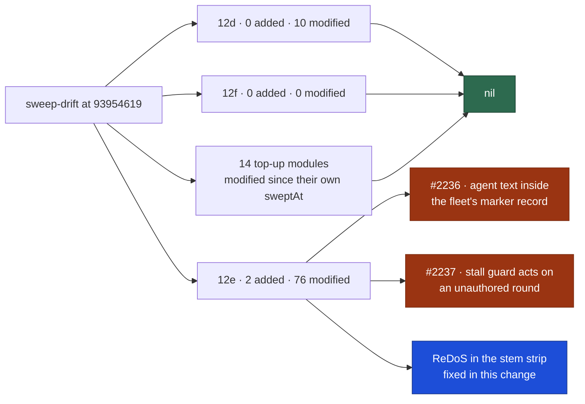

# 🔎 Security sweep — `worker/deno/lib/` delta, slices 12d–12f

**Issue:** [#2183](https://github.com/stSoftwareAU/VibeCoder/issues/2183) ·
**Parent:** #2170 `security-scan-overflow: 2 chunks not reached`

This is the written record for the modules in ledger slices 12d (#1217
environment / configuration / secret sinks), 12e (#1219 closing pass) and 12f
(#1325 gh-chokepoint top-up) that were added or modified since the
[#1611 record](security-sweep-1611-lib-delta-12d-12f.md) landed at
`9442a93225c2adb41b641a1f021ad99458fb6341`, plus every top-up slice whose own
module `sweep-drift` reports as **modified** against that slice's own `sweptAt`.
The file list was regenerated with `sweep-drift` — not from the counts in #2183,
which were measured at planning time and have since moved.

Siblings:
[`security-sweep-1611-lib-delta-12d-12f.md`](security-sweep-1611-lib-delta-12d-12f.md)
(the record this delta is measured from),
[`security-sweep-2182-lib-delta-12a-12c.md`](security-sweep-2182-lib-delta-12a-12c.md)
(the 12a–12c half of the same overflow) and
[`security-sweep-1612-commands-setup-delta.md`](security-sweep-1612-commands-setup-delta.md)
(`commands/` and `setup/`, whose delta is #2184).

> **Three candidates survived; two are filed and one is fixed here.** Every
> added module and every modified hunk in the drift lists was read. 12f is nil
> and 12d is nil; 12e produced all three survivors. The nils are stated
> explicitly so a later run does not have to re-derive them.



## Scope and method

```bash
deno run --allow-read --allow-run --allow-env --allow-sys=hostname \
  worker/deno/mod.ts sweep-drift --repo "$(pwd)"
```

For a _modified_ module the hunks
(`git diff <that slice's sweptAt> HEAD --
<path>`) were read and followed into
the module wherever a hunk touched the slice's sink. For an _added_ module the
file was read in full — a ledger top-up claim is not a sweep record.

12d's sinks are environment reads and writes, configuration parsing and trust
decisions taken from config, and secret handling. 12e is the closing pass, so
**any newly introduced sink of the four slice classes counts** — subprocess and
argv, filesystem and temp files, untrusted GitHub ingestion, and
environment/config/secret.

**Nothing was skipped.** #2170 names `claude_runner.ts`, `workflow_scope.ts` and
`reserved_label_strip.ts` as individually re-read by that run, so they were
eligible to be listed as skipped-with-citation. `claude_runner.ts` belongs to
12a and was read by [#2182](security-sweep-2182-lib-delta-12a-12c.md);
`workflow_scope.ts` is in this record's 12d drift and its hunks were read here
anyway, because they add a regex over GitHub's own push refusal and a new quote
of git's stderr into the run reason. `reserved_label_strip.ts` is not in any
drift list in this window, so there is nothing to skip.
`claude_credential_pool.ts` — the module #2170 records as only _partially_ read
— is owned by slice 12k and **was read**, at hunk level against 12k's own
`sweptAt`; see below.

Triage followed [`docs/SECURITY-SCAN.md`](../SECURITY-SCAN.md) Phase 3
(refute-unless-proven). A candidate only survives when a concrete
attacker-controlled input reaches a sink unsafely.

## Findings

| ID                                                             | Site                                                                | Severity | Confidence | Disposition                                                                                                                             |
| -------------------------------------------------------------- | ------------------------------------------------------------------- | -------- | ---------- | --------------------------------------------------------------------------------------------------------------------------------------- |
| [#2236](https://github.com/stSoftwareAU/VibeCoder/issues/2236) | `worker/deno/lib/pr_ci_processor.ts:1590` `_processCiWithHeartbeat` | Medium   | High       | **filed** — the agent's `.pr_response_message` is posted verbatim as a fleet comment, and CI-fix markers are parsed from fleet comments |
| [#2237](https://github.com/stSoftwareAU/VibeCoder/issues/2237) | `worker/deno/lib/grill_me_stall_guard.ts:119` `isRoundStalled`      | Low      | High       | **filed** — the stall decision reads round comments selected by heading marker with no author gate                                      |
| —                                                              | `worker/deno/lib/grill_me_stall_guard.ts` `normaliseQuestionStem`   | Low      | High       | **fixed here** — quadratic trailing-punctuation strip over unauthored comment text; regression test added                               |

Deduped against the open `security` issues at sweep time —
[#2231](https://github.com/stSoftwareAU/VibeCoder/issues/2231) (milestone-sync
`needs-human` clearing, filed by #2182) and
[#2216](https://github.com/stSoftwareAU/VibeCoder/issues/2216) (`run.sh`
content-approval baseline). Both are different root causes, and a title/body
search for each survivor returned no open match.

**Why two were filed rather than fixed.** #2183 allows a sweep to carry one-line
fixes only. #2236 needs a marker-neutralisation chokepoint applied to
agent-authored text across four call sites, and #2237 needs the fleet-author set
threaded into the stop rule while `carriesRoundMarker` stays author-agnostic for
counting — both are more than a sweep should carry. The ReDoS was fixed because
it is a single self-contained pure function with an exactly equivalent linear
form.

## Slice 12d — environment, configuration and secret sinks

Previous `sweptAt`: `9442a93225c2adb41b641a1f021ad99458fb6341` (the
[#1611 record](security-sweep-1611-lib-delta-12d-12f.md)). Drift at generation
HEAD: **0 added, 10 modified, 0 unowned**.

### Idle-task templates this slice owns

12d owns sixteen idle-task templates under
`worker/deno/lib/idle_task_templates/`. None appears in this drift list, so none
has changed since the #1611 record and none was re-read; that record still
covers them.

### Modified

| Path                                      | Disposition                                                                                                                                                                                                 |
| ----------------------------------------- | ----------------------------------------------------------------------------------------------------------------------------------------------------------------------------------------------------------- |
| `worker/deno/lib/agent_provider.ts`       | read — billing descriptors listing env var **names**, a per-run provider override, a repo pin validated against the registry before it binds, Codex prompt argv→stdin                                       |
| `worker/deno/lib/ci_check_state_dir.ts`   | read — doc comment only; records that the directory now holds the check-run retry counter and not the auto-fix tally (moved to the PR by #1879)                                                             |
| `worker/deno/lib/codex_env.ts`            | read — `buildIsolatedCodexChildEnv` deletes the API-key and `CODEX_HOME` variables from a copy of the parent env, then re-adds only the selected account's material                                         |
| `worker/deno/lib/container_launch.ts`     | read — `imageRemoveArgs` copied from the runtime dialect constant, plus an `image-remove=` key in the plan render/parse round-trip                                                                          |
| `worker/deno/lib/credential_preflight.ts` | read — a process-wide map of credential **labels** (file stems such as `provider-2`), recorded only when this process performed the export; no value is stored                                              |
| `worker/deno/lib/issue_finder_logger.ts`  | read — a `milestone-behind` skip reason and two unconditional log lines; repo names and the failure detail both pass `sanitiseLogField`                                                                     |
| `worker/deno/lib/issue_worker_wiring.ts`  | read — dependency-table wiring: three-state `workflowScopeState`, a `repairMilestoneCreateBlock` seam, `syncMilestoneBranchWithDefault`, `fileRedCheckTracker`                                              |
| `worker/deno/lib/pr_ci_processor.ts`      | read — **survivor**: the attempt tally moves onto fleet-authored PR comment markers while the agent's message is posted verbatim into them ([#2236](https://github.com/stSoftwareAU/VibeCoder/issues/2236)) |
| `worker/deno/lib/run_core.ts`             | read — an operator-configured provider fallback probed on a health failure, a billing classification log, per-cycle callbacks, a GraphQL-quota re-probe                                                     |
| `worker/deno/lib/workflow_scope.ts`       | read — three-state scope reading, a bounded push-refusal regex, and a quote of git's stderr that is redacted **before** it is cut                                                                           |

**12d is nil.** The #2236 survivor is recorded against 12e, which owns the
`.pr_response_message` reader and the marker module the finding turns on; the
`pr_ci_processor.ts` hunks are listed here because 12d owns that path. No 12d
hunk introduces attacker-controlled input reaching an environment, configuration
or secret sink unsafely: the new Codex child-env builder can only narrow what
the subprocess sees, and every credential the drift adds to a map, a log or a
signal file is a pool **label**, never token material.

## Slice 12e — closing pass over the remainder

Previous `sweptAt`: `9442a93225c2adb41b641a1f021ad99458fb6341` (the #1611
record). Drift at generation HEAD: **2 added, 76 modified, 0 unowned**.

### Added (read in full)

| Path                                         | Disposition                                                                                                                                                                                                                                                                                   |
| -------------------------------------------- | --------------------------------------------------------------------------------------------------------------------------------------------------------------------------------------------------------------------------------------------------------------------------------------------- |
| `worker/deno/lib/grill_me_stall_guard.ts`    | **survivor ×2** — pure text analysis of round comment bodies, but the caller selects those bodies by heading marker with no author gate, and the trailing-punctuation strip was quadratic ([#2237](https://github.com/stSoftwareAU/VibeCoder/issues/2237); the ReDoS is fixed in this change) |
| `worker/deno/lib/workflow_scope_precheck.ts` | two `runGit` argv arrays over `${baseRef}...HEAD`; the sole production caller passes the literal `origin/${baseBranch}`, so no leading-dash value is reachable and no shell is involved                                                                                                       |

### Modified

| Path                                                       | Disposition                                                                                                                                                                                 |
| ---------------------------------------------------------- | ------------------------------------------------------------------------------------------------------------------------------------------------------------------------------------------- |
| `worker/deno/lib/auto_fix_attempt_tracker.ts`              | read — the local-file tally is **deleted** (a net removal of filesystem sinks); signature join hardened from `" "` to `"\0"`                                                                |
| `worker/deno/lib/auto_merge_sweep.ts`                      | read — a live `gh pr view` re-read before each merge attempt; an unknown state fails closed                                                                                                 |
| `worker/deno/lib/baseline_carryover_tracker.ts`            | read — a second tracker sharing `fileTracker`; title and body are separate argv elements and dedup stays author-gated                                                                       |
| `worker/deno/lib/baseline_gate.ts`                         | read — `redactSecrets` is applied **before** the line split; a missing or unattributed baseline fails closed                                                                                |
| `worker/deno/lib/branch_history_rewrite.ts`                | read — `isOwnedBranch` widened to `/^issue-\d+-/`; `assertSafeGitRef`, the author-email check and `--force-with-lease` are intact                                                           |
| `worker/deno/lib/bump_deps.ts`                             | read — extracts `bumpScriptPath` (the same string that already existed) plus a status value and a constant PR-body note                                                                     |
| `worker/deno/lib/ci_failure_classifier.ts`                 | read — new regexes over CI log text, every window bounded (`[^\n]{0,30}?`) with literal alternations; picks a routing label only                                                            |
| `worker/deno/lib/claude_pool_budget.ts`                    | read — shape translation of an existing budget; carries a credential label, never a token                                                                                                   |
| `worker/deno/lib/claude_token_budget.ts`                   | read — `429` rate-limit headers are read; the body is still discarded and the bearer token never logged                                                                                     |
| `worker/deno/lib/claude_token_selection.ts`                | read — two exported constants                                                                                                                                                               |
| `worker/deno/lib/codex_auth.ts`                            | read — splits `CODEX_API_KEY_ENV_VARS` out; the actionable message names variable **names**, never values                                                                                   |
| `worker/deno/lib/codex_executor.ts`                        | read — `exec resume --last` becomes `exec resume <id>`; MCP overrides come from a worker-written file behind a `^[A-Za-z0-9_-]+$` key guard, each its own argv element                      |
| `worker/deno/lib/collect_idle_task_candidates.ts`          | read — an open-milestone lookup threaded into `isDependencyBlocked`; titles are `Map` keys and the hold only blocks more                                                                    |
| `worker/deno/lib/collect_label_candidates.ts`              | read — same change, same disposition                                                                                                                                                        |
| `worker/deno/lib/collect_low_priority_candidates.ts`       | read — same change, same disposition                                                                                                                                                        |
| `worker/deno/lib/collect_self_diagnostic_candidates.ts`    | read — same change, same disposition                                                                                                                                                        |
| `worker/deno/lib/collect_work_on_candidates.ts`            | read — same change, same disposition                                                                                                                                                        |
| `worker/deno/lib/config_defaults.ts`                       | read — default values only (`maxGrillMeRounds` 5→20, DeepSeek model ids, fast-failure knobs)                                                                                                |
| `worker/deno/lib/config_unknown_keys.ts`                   | read — known-key set edits; an unknown key still warns rather than refuses                                                                                                                  |
| `worker/deno/lib/cost_estimate.ts`                         | read — an `(API-equivalent)` label read off the pricing row, never sniffed from the model id                                                                                                |
| `worker/deno/lib/deepseek_executor.ts`                     | read — a per-run unavailable-model set and tier adaptation; model ids are compared and logged, never spawned                                                                                |
| `worker/deno/lib/dependency_conflict_rules.ts`             | read — type-level only; the `git show :1:<path>` call lives outside this drift                                                                                                              |
| `worker/deno/lib/failure_diagnosis.ts`                     | read — a `workflow_gate` category; bounded matches that only pick a label, with kill/timeout/rate-limit rules still ahead                                                                   |
| `worker/deno/lib/git_base_ref.ts`                          | read — reorders the remote-tracking ref ahead of the local branch; `assertSafeGitRef` still runs before any git call                                                                        |
| `worker/deno/lib/git_push_recovery.ts`                     | read — short-circuits recovery on a workflow-scope refusal; the quoted remote text is redacted **then** cut                                                                                 |
| `worker/deno/lib/grill_me_processor.ts`                    | read — **survivor**: round **bodies** are now collected and fed to the stall guard, and that collection is author-agnostic ([#2237](https://github.com/stSoftwareAU/VibeCoder/issues/2237)) |
| `worker/deno/lib/handover_prompt_note.ts`                  | read — a sentence added to the constant framing; the untrusted-data boundary markers are unchanged                                                                                          |
| `worker/deno/lib/heartbeat_storage.ts`                     | read — new render branches route through the pre-existing `boundOutcomeText`, which neutralises `<!--`/`-->` before truncating                                                              |
| `worker/deno/lib/host_path_style.ts`                       | read — hardening: `isConfinedRelativePath` also rejects `\r`/`\n`, so a `KEY=value` line cannot be split                                                                                    |
| `worker/deno/lib/idle_decision_census.ts`                  | read — a `repo_backed_off` classification and a census log line; repo names come from operator config                                                                                       |
| `worker/deno/lib/infra_retry.ts`                           | read — refuses to retry `token_scope`; the quota wait comes from GitHub's own reset header and is refused if it overruns the cycle                                                          |
| `worker/deno/lib/issue_dependencies.ts`                    | read — type-only optional `milestone`; `undefined` never triggers the cross-milestone hold                                                                                                  |
| `worker/deno/lib/issue_priority.ts`                        | read — a close-out band and a week-pace tier drop; `workStreamKey` builds a map key, never a path or argv                                                                                   |
| `worker/deno/lib/issue_worker.ts`                          | read — wires the superseded-re-approval escalation and telemetry plumbing; the fail-safe direction adds `needs-human`                                                                       |
| `worker/deno/lib/issue_worker_types.ts`                    | read — type declarations only                                                                                                                                                               |
| `worker/deno/lib/label_clarification.ts`                   | read — `updateComment: notSupported(...)`, an explicit refusal                                                                                                                              |
| `worker/deno/lib/launcher_failure_evidence.ts`             | read — one numeric exit status and its constant description added to the known-status table                                                                                                 |
| `worker/deno/lib/lib_sweep_coverage.ts`                    | read — `top-up-<issue>` ids and ledger validation; `sweptAt` is 40-hex validated by `SWEPT_AT_RE` before it reaches `git` argv                                                              |
| `worker/deno/lib/merge_block_escalation.ts`                | read — two new outcome kinds mapped to `await_checks`; pure classification                                                                                                                  |
| `worker/deno/lib/merge_conflict_drain.ts`                  | read — a mandatory live `pr view` re-check before leasing, cloning or the agent; a net reduction in work on stale entries                                                                   |
| `worker/deno/lib/merged_pr_issue_sweep.ts`                 | read — a roll-back-marker skip that is fleet-author gated and must post-date the merge; suppression only, so a forgery closes nothing                                                       |
| `worker/deno/lib/milestone_branch_rejection.ts`            | read — rewords the operator remediation string; static text                                                                                                                                 |
| `worker/deno/lib/new_work_eligibility.ts`                  | read — a lazy open-milestone lookup; the title is a map key and a failed listing fails safe                                                                                                 |
| `worker/deno/lib/outcome_record_gate.ts`                   | read — doc and fault-message rewording; the scan logic is untouched                                                                                                                         |
| `worker/deno/lib/phase_model_escalation.ts`                | read — provider-aware escalation target; ids come from provider descriptors and operator config                                                                                             |
| `worker/deno/lib/phases/baseline_quality_phase.ts`         | read — swaps a raw `output.slice(-500)` for `redactedHeadTail`, which redacts the whole text first                                                                                          |
| `worker/deno/lib/phases/execute_phase.ts`                  | read — forwards issue comments into the implementation prompt; they are sanitised and fenced by the builder                                                                                 |
| `worker/deno/lib/phases/handle_no_changes_phase.ts`        | read — a headline interpolating one of three fixed literals; no agent output                                                                                                                |
| `worker/deno/lib/phases/quality_gate_remediation_phase.ts` | read — a pre-existing-failure early exit; `redactedTail` becomes `redactedHeadTail`, still redacting before trimming                                                                        |
| `worker/deno/lib/phases/setup_branch_phase.ts`             | read — an in-run ruleset repair that only sets `do_not_enforce_on_create`, only on a ruleset whose refs are exclusively `refs/heads/milestone/`                                             |
| `worker/deno/lib/pinned_actions.ts`                        | read — `resolution` metadata and a `setup-java` bump; every entry stays an immutable 40-hex SHA pin                                                                                         |
| `worker/deno/lib/planning_run_stats.ts`                    | read — an optional provider hook on the degradation matcher; affects a reporting verdict only                                                                                               |
| `worker/deno/lib/pr_branch_update.ts`                      | read — bot-PR branch updates gated by `isBotAuthorForMaintenance`, `isCrossRepository === false`, a host-commit match and `isSafeGitRef`                                                    |
| `worker/deno/lib/pr_check_contexts.ts`                     | read — aggregate-gate coverage; the exemption still requires the covering gate to be in `requiredSet`                                                                                       |
| `worker/deno/lib/pr_create_rest.ts`                        | read — `findMergedPrUrlViaRest`; `repo` passes `REPO_PATTERN` and `head` is a single `-f head=owner:<branch>` argv token                                                                    |
| `worker/deno/lib/pr_feedback_processor.ts`                 | read — a live `guardPrStillOpen` re-read before claiming; strictly fewer writes                                                                                                             |
| `worker/deno/lib/pr_merge_conflict_processor.ts`           | read — mostly extraction into `merge_conflict_agent.ts`, plus a `milestone/**` stand-down and an uncharged attempt on GH013                                                                 |
| `worker/deno/lib/pr_merge_conflict_scan.ts`                | read — attempt budget 2→3 and a `pr-not-open` skip reason; UNKNOWN fails closed                                                                                                             |
| `worker/deno/lib/pr_no_changes_response.ts`                | read — pure extraction of `formatClassifierTrailer`; same worker-authored text                                                                                                              |
| `worker/deno/lib/prompt_builder.ts`                        | read — three new untrusted ingests, all fenced and scrubbed and declared in the boundary-integrity instruction                                                                              |
| `worker/deno/lib/provider_token_usage.ts`                  | read — Codex and Gemini usage decoders; missing usage yields `usageUnknown`, never zero                                                                                                     |
| `worker/deno/lib/redact_truncate_order_check.ts`           | read — registers `redactedHeadTail` as a redaction entry point, widening the order check's coverage                                                                                         |
| `worker/deno/lib/redacted_text.ts`                         | read — `redactedHeadTail` runs `redactSecrets` over the whole text **before** the head/tail slice; the `slice(-0)` trap is handled                                                          |
| `worker/deno/lib/run_callback_context.ts`                  | read — absence-reason codes and a cycle context; values are worker-derived run ids, phases and epochs                                                                                       |
| `worker/deno/lib/run_callback_telemetry.ts`                | read — a reason code for absent telemetry; pure classification                                                                                                                              |
| `worker/deno/lib/run_callbacks_config.ts`                  | read — a `host_failure` hook whose path is operator config, validated absolute and NUL-free, exec'd directly with env context                                                               |
| `worker/deno/lib/run_outcome.ts`                           | read — a `blocked` field and a `pr_deferred` kind; reporting shapes only                                                                                                                    |
| `worker/deno/lib/run_outcome_classifier.ts`                | read — new classes; the secondary-limit test reads `splitAgentNarration(message).worker`, so agent text cannot steer it                                                                     |
| `worker/deno/lib/screenshot_validation.ts`                 | read — a non-UI extension guard that **suppresses** the keyword fallback; anchored and linear                                                                                               |
| `worker/deno/lib/secret_redaction.ts`                      | read — `secret-assignment` now judges the value when the separator crossed a line break; inline assignments mask exactly as before                                                          |
| `worker/deno/lib/self_diagnostic_provenance.ts`            | read — comment-only note; no behaviour                                                                                                                                                      |
| `worker/deno/lib/skip_reason_clearing.ts`                  | read — adds `"milestone-behind": "self"`, a self-clearing wait; no label or author trust is relaxed                                                                                         |
| `worker/deno/lib/vibe_env_registry.ts`                     | read — three registry entries, all `role: "marker"` rather than credential-bearing                                                                                                          |
| `worker/deno/lib/work_volume_ratchet.ts`                   | read — a pure predicate whose effect is to **skip** deletions inside the work volume; no filesystem call                                                                                    |
| `worker/deno/lib/workflow_definitions.ts`                  | read — adds `set -euo pipefail` to one emitted workflow step                                                                                                                                |
| `worker/deno/lib/workflow_hygiene_check.ts`                | read — reads trailing pin comments too, so two disagreeing comments surface as drift; detection gets stricter                                                                               |

**12e is not nil.** All three survivors are here — two filed
([#2236](https://github.com/stSoftwareAU/VibeCoder/issues/2236),
[#2237](https://github.com/stSoftwareAU/VibeCoder/issues/2237)) and one fixed in
this change. Everything else in the slice's drift is hardening (stricter bot
admission, fleet-author gates, redact-before-truncate, fail-closed live
re-reads) or consumes remote data for classification and display only.

## Slice 12f — gh-chokepoint top-up

Previous `sweptAt`: `9442a93225c2adb41b641a1f021ad99458fb6341` (the #1611
record). Drift at generation HEAD: **0 added, 0 modified, 0 unowned**.

**12f is nil, and the nil is real rather than an empty report.** The slice owns
exactly two modules, `worker/deno/lib/gh_body_file_io.ts` and
`worker/deno/lib/gh_timeout.ts`, and

```bash
git log --oneline 9442a93225c2adb41b641a1f021ad99458fb6341..HEAD -- \
  worker/deno/lib/gh_body_file_io.ts worker/deno/lib/gh_timeout.ts
```

returns no commits: neither module has been touched since the #1611 record. The
[#1325 record](security-sweep-1325-gh-body-file-io-and-timeout.md) and #1611
still cover them, and nothing was re-read here.

## Top-up slices with a modified module

These are the slices #2183 asks for by rule: a top-up slice whose single module
`sweep-drift` reports as **modified** against that slice's own `sweptAt`. Each
was diffed from its own commit, not from the 12d–12f baseline.

| Slice       | Path                                         | Disposition                                                                                                                                                                 |
| ----------- | -------------------------------------------- | --------------------------------------------------------------------------------------------------------------------------------------------------------------------------- |
| 12i         | `worker/deno/lib/gate_skip_drift_scanner.ts` | read — the manifest URL becomes `ownManifestPath(env)`, joining `VIBE_BASE_DIR` (launcher config) with a constant tail; the only sink is a read of the fleet's own checkout |
| 12j         | `worker/deno/lib/worker_state_paths.ts`      | read — one `PR_RESPONSE_MESSAGE_FILE` constant and an exact-equality arm, so `foo/.pr_response_message` stays false; the effect is unstaging a worker-written file          |
| 12k         | `worker/deno/lib/claude_credential_pool.ts`  | read in full at hunk level — see the dedicated section below                                                                                                                |
| 12l         | `worker/deno/lib/gated_head_guard.ts`        | read — a milestone stand-down whose branch name reaches a `--body` value in an argv array, never argv itself; the marker match is carried over unchanged                    |
| top-up-1846 | `worker/deno/lib/pr_bot_lookup.ts`           | read — `isBotLogin` becomes `isBotAuthorForMaintenance`, which **narrows** admission to an attested `[bot]` suffix or three exact names                                     |
| top-up-1859 | `worker/deno/lib/changed_workflow_gate.ts`   | read — a `readBaseFile` dep implemented as `git ls-tree … -- <path>` and `git show <base>:<path>`; paths come from the run's own diff                                       |
| 12q         | `worker/deno/lib/merge_conflict_agent.ts`    | read — an optional repair context whose untrusted members pass `fenceUntrustedValue` in the prompt builder                                                                  |
| 12s         | `worker/deno/lib/milestone_rollback.ts`      | read — `gitDetail` falls back to git's stdout when stderr is empty; the same class of text into the same log sink                                                           |
| 12w         | `worker/deno/lib/codex_auth_mode.ts`         | read — `CODEX_HOME` no longer reads as an API key, and `resolveCodexHome` returns operator env or a constant segment; `detail` names variables, never values                |
| 12y         | `worker/deno/lib/codex_quota.ts`             | read — a pure mapping of an already-read snapshot to the generic status type                                                                                                |
| 12y         | `worker/deno/lib/provider_quota.ts`          | read — an in-memory status cache keyed by `provider\0credentialLabel`; no I/O, no subprocess, no credential value                                                           |
| 12y         | `worker/deno/lib/provider_quota_scope.ts`    | read — a pause can now decline when the signal names a different credential; GitHub-kind signals still pause unconditionally and a throw fails closed                       |
| 12aa        | `worker/deno/lib/provider_auto_runtime.ts`   | read — `activeAgentProvider` uses the injected env rather than ambient `Deno.env`; the summary logs provider ids and timestamps                                             |
| top-up-1956 | `worker/deno/lib/toolchain_selfcheck.ts`     | read — argv can come from the manifest's `versionArgs`, each entry validated by `VERSION_ARG_RE`; the manifest is the fleet's own `container/tools.json`                    |

**All fourteen are nil.** None of the hunks introduces attacker-controlled input
reaching a sink unsafely; the two trust-decision changes in the set
(`pr_bot_lookup.ts`, `provider_quota_scope.ts`) both tighten or fail closed.

## Top-up slices whose module reports as `added`

Five slices report their own single module as **added** rather than modified:

| Slice       | Module                                         | Record commit on `main` | Commits touching the module since |
| ----------- | ---------------------------------------------- | ----------------------- | --------------------------------- |
| top-up-1885 | `worker/deno/lib/claude_week_pace.ts`          | `b739845d`              | 0                                 |
| top-up-1927 | `worker/deno/lib/subscription_soak_status.ts`  | `83f43515`              | 0                                 |
| top-up-2023 | `worker/deno/lib/milestone_conflict_ported.ts` | `a9c41731`              | 0                                 |
| top-up-2030 | `worker/deno/lib/milestone_sync_claim.ts`      | `107dea74`              | 0                                 |
| top-up-2070 | `worker/deno/commands/toolchain_selfcheck.ts`  | `f42c1141`              | 0                                 |

This is an artefact of the `sweptAt` rule, not drift. #2178 has a new record
take `git merge-base origin/main HEAD` at list-generation time, which is the
commit _before_ the record's own PR squash-merged — so the module the slice was
created for did not yet exist at its own `sweptAt` and `sweep-drift` can only
report it as `added`. Verified nil directly instead:
`git log <record-commit>..HEAD -- <module>` returns no commits for all five, so
each module is byte-identical to what its own dedicated record read. They are
outside #2183's scope (which names top-up slices whose module is reported
**modified**) and their `sweptAt` values are left untouched here.

## `claude_credential_pool.ts` — the module #2170 left partly read

Slice **12k**, diffed from its own `sweptAt` (`fdd79338…`). #2183 requires this
one to be read rather than skipped, because #2170 read only part of it and
[#2182](security-sweep-2182-lib-delta-12a-12c.md) covered it only as a
cross-slice courtesy.

What the drift adds: `withoutRecordedSpent` and `candidateCount` (start-up
ranking), `exhaustionFromUsageSignal` and `primeClaudePoolFromUsageSignal`
(reading the worker-written usage-limit signal back at start-up),
`retireUnattributableUsageSignal` (deleting an unlabelled signal on a
multi-credential host), and a `recordHeldProviderCredential` call in
`applySelection`.

**Nil.** Every credential-handling path was followed. `applySelection` takes
`token.value` only into `setEnv(name, value)` and logs `token.label` plus the
variable _name_; `withoutRecordedSpent`, `budgetFor` and the `snapshots` map are
all keyed by label. The only consumer of the value is `probeClaudeTokenBudget`,
which places it in an `authorization: Bearer` header and pushes every
operator-facing string through `scrub(text, token)`; the pool's own catch stores
`error.name`, not the message. `signal.credentialLabel` is trimmed, rejected
when empty, and used only as a map key — the signal file itself is one fixed
filename under the operator's `workDir`, so the label never influences a path.
Nothing reaches argv, a path or GitHub.

## The fix this sweep carried

`normaliseQuestionStem` stripped trailing punctuation with
`replace(/[.,;:!?…—–\s]+$/u, "")`. That regex is unanchored, so the engine
retries the match at every start offset and each retry rescans the whole run
before failing at `$` — quadratic in the length of the run.

The input is attacker-supplied. Round comments are collected by
`carriesRoundMarker`, a heading match that is **deliberately** author-agnostic
(#1560, #3768, so a peer worker identity's round still counts), a GitHub comment
body runs to 65 536 characters, and every round is re-normalised on each
grill-me pass. Measured against the current code:

| Stem length | Cost   |
| ----------- | ------ |
| 10 000      | 43 ms  |
| 40 000      | 695 ms |

A 4× input costing 16× is exactly the shape
`worker/deno/tests/support/growth.ts` exists to catch; its default slack allows
8×.

The strip is now a single backward walk over a `Set` of the same characters —
character-for-character the same result, linear in the length of the run.
Regression tests are in
`worker/deno/tests/grill_me_stall_guard_bounds_2183_test.ts`, measured by
**shape** rather than against a wall-clock constant, so a slower host inflates
both readings and the ratio is unchanged (#530).

This is the one-line-class fix #2183 allows a sweep to carry: one self-contained
pure function with an exactly equivalent linear form. The two author-gate
findings are filed instead, because both need a control threaded through code
this sweep did not otherwise touch.

## Refutations worth keeping

Recorded so a later run does not re-derive them.

### 12d — environment, configuration and secrets

- **`workflow_scope.ts` quoting git's stderr into the run reason** — a push
  refusal can carry a tokenised remote URL, but `redactedLineTail` calls
  `redactSecrets` over the whole text and **then** takes the last five lines.
  Redaction before truncation, with the cap as a constant.
- **`workflow_scope.ts` `PUSH_REFUSAL_PATTERN`** —
  `/refusing to allow
  .{0,80}?to create or update workflow/i` runs over
  GitHub's own stderr; the gap is bounded and non-nested, so no catastrophic
  backtracking is reachable.
- **`codex_env.ts` `buildIsolatedCodexChildEnv`** — deletes the API-key and
  `CODEX_HOME` variables from a copy of the parent env before re-adding only the
  selected account's material, and withholds metered keys entirely when a
  `CODEX_HOME` was selected. It can only narrow what the subprocess sees.
- **`credential_preflight.ts` `recordHeldProviderCredential`** — the recorded
  string is `fileStem(fileName)` of an operator-named credential file, recorded
  only when this process performed the export; the entry value is never stored.
- **`agent_provider.ts` billing detail in a log line** — every reason is a
  variable **name** or a fixed label. `resolveCodexAuthMode` inspects key
  _presence_ and returns `error.name` for read faults; it never reads
  `auth.json`'s key value.
- **`agent_provider.ts` MCP JSON expanded into `-c mcp_servers.*` argv** — the
  file is worker-generated into a directory `ensureStateDir` refuses unless it
  is worker-private, and the builder filters keys with `/^[A-Za-z0-9_-]+$/` and
  JSON-quotes values.
- **`issue_finder_logger.ts` new log lines** — repo and detail pass
  `sanitiseLogField` (control-char strip, quote folding, a 200-character cap);
  the one unsanitised value is the finder's internal candidate-source union.
- **`ci_base_branch_check.ts` compare path** (reached from `pr_ci_processor.ts`)
  — `branch` is GitHub's own `baseRefName` and git refname rules exclude `?`,
  space and `..`; the check name is filtered in-process, not in the query.

### 12e — the closing pass

- **`secret_redaction.ts` weakened `secret-assignment`** — the obvious
  candidate, and refuted for inline text: `isCredentialShapedValue` returns
  `true` unconditionally when the separator stayed on one line, so
  `PASSWORD=12345` and `secret_scanning: enabled` mask byte-for-byte as before.
  The exemptions apply only across a line break and only to a **whole** value
  that is a complete fence or image, is under eight characters, or is a single
  lower-case word of at most fifteen. Every provider-prefixed credential
  (`gh[pousr]_`, `AKIA`, PEM, JWT) is caught by its own signature rule
  regardless. Residual worth recording rather than filing: a short all-lowercase
  secret alone on the line **after** its label is no longer masked by this rule
  — the documented, deliberate cost of #1727.
- **`secret_redaction.ts` detector/replacer divergence** — `containsSecret`
  calls the identical `assignmentIsMasked` the rule's `replace` calls, and saves
  and restores the shared global pattern's `lastIndex`, so the detector cannot
  be more permissive than the replacer and no offset leaks between scans.
- **`redacted_text.ts` `redactedHeadTail`** — redacts the full string before
  cutting head and tail, and is registered in `REDACTION_ENTRY_POINTS` so the
  static order check covers it. Both call sites hand it the untruncated gate
  output.
- **`prompt_builder.ts` issue comments in the implementation prompt** — the blob
  passes `sanitiseDelimitedComments` with this run's nonce, so only whole-line
  headers bearing the CSPRNG boundary id survive and a forged `[TRUSTED]` header
  degrades to inert text; `createPromptDelimiters` re-validates a supplied id
  against `BOUNDARY_ID_PATTERN` and mints a fresh one otherwise.
- **`auto_fix_attempt_tracker.ts` forged CI-fix markers** — refuted _at this
  layer_: `collectFleetCiFixMarkers` drops non-fleet authors before parsing any
  body, and reports `fleetResolved: false` rather than zero when the fleet set
  is unresolved. The gap is not the author gate but what the fleet itself writes
  into its own comment, which is
  [#2236](https://github.com/stSoftwareAU/VibeCoder/issues/2236).
- **`merged_pr_issue_sweep.ts` forged roll-back marker** — `isFleetAuthor` plus
  a "posted after the merge" check, with an empty fleet set trusting nothing;
  the marker can only _keep an issue open_, and an unreadable thread also fails
  closed.
- **`codex_executor.ts` `exec resume <id>`** — `isPersistableSessionId` accepts
  any non-empty string for Codex, unlike the Claude path's UUID check, so there
  is no leading-dash guard. Refuted on provenance: the value comes only from the
  Codex CLI's own JSONL and a worker-written resume-state file, reaches a
  discrete argv element, and never touches a shell. The thinnest validation in
  the slice, worth remembering.
- **`workflow_scope_precheck.ts` `${baseRef}...HEAD`** — the sole production
  caller passes `origin/${baseBranch}`, whose prefix makes a leading `-`
  unreachable, and the sibling base-ref path runs `assertSafeGitRef` first.
- **`lib_sweep_coverage.ts` `sweptAt` into `git diff` argv** — `parseSlice`
  rejects any value failing the 40-hex `SWEPT_AT_RE` before it can reach argv;
  `slice.ledger` appears only inside the human-readable remedy text.
- **`phases/setup_branch_phase.ts` in-run ruleset repair** —
  `targetsOnlyMilestoneBranches` requires every ref pattern to start
  `refs/heads/milestone/`, the PUT rebuilds the whole document so other rules
  survive, `isValidRepoSlug` gates the call, and only `do_not_enforce_on_create`
  changes: checks still gate every merge.
- **`pr_branch_update.ts` taking over a bot's branch** —
  `isBotAuthorForMaintenance` admits only an attested `[bot]` suffix or three
  exact names (no prefix matching), `isCrossRepository !== false` rejects forks
  and unknown ownership, a host commit must already be on the PR, and
  `isSafeGitRef` runs before any maintenance git command.
- **`pr_check_contexts.ts` coverage exemption** — a derived context is dropped
  from `missing` only when its covering gate is itself in `requiredSet`, and a
  gate is recognised only when its `needs` names every reusable-workflow caller
  in a workflow that runs on every PR and yields exactly one context.
- **`run_outcome_classifier.ts` secondary-limit class** — the predicate reads
  `splitAgentNarration(message).worker`, which strips the quoted agent-output
  blocks first, so an agent writing about GitHub throttling cannot reclassify
  its own run as a non-fault throttle.
- **`infra_retry.ts` quota wait** — the wait is refused outright when
  `now + waitMs + MIN_INFRA_RETRY_RUNWAY_SECONDS` would overrun the cycle
  deadline, and the reset epoch comes from GitHub's own rate-limit response, not
  from issue text.
- **`ci_failure_classifier.ts` regexes over CI logs** — every quantified gap is
  bounded and non-nested (`[^\n]{0,30}?`) with literal alternations, and
  `EXIT_CODE_REGEX` is consumed through `matchAll`, so no `lastIndex` leaks.
- **`heartbeat_storage.ts` new render branches** — they route through the
  pre-existing `boundOutcomeText`, which flattens whitespace and neutralises
  `<!--`/`-->` **before** truncating, matching the existing `no_pr` path.

### Top-up slices

- **`gated_head_guard.ts` branch name in the stand-down comment** —
  `standDownMilestoneHead` is reached only past `isMilestoneHead`, the name is
  never itself an argv element, and the body is the value of `--body` in an argv
  array with no shell. The non-author-gated marker match is pre-existing
  `gatedHeadMarker` behaviour and can only suppress an informational comment.
- **`changed_workflow_gate.ts` `readBaseFile`** — the path goes after `--` for
  `ls-tree` and behind `base:` for `git show`, and the candidate set is the
  run's own `git diff --name-only` filtered by `isWorkflowPath`, so no element
  can present as a leading-dash option.
- **`toolchain_selfcheck.ts` manifest `versionArgs`** — `parseVersionArgs`
  rejects any entry failing `VERSION_ARG_RE` (no whitespace, no shell
  metacharacter, no bare `-`/`--`) and rejects `versionArgs` entirely without a
  declared `versionCommand`; the manifest is the fleet's own checkout, not a
  monitored repository.
- **`provider_quota_scope.ts` declining a host pause** — the inputs are the
  worker-written rate-limit signal and the in-process held label; GitHub-kind
  signals still pause unconditionally and the automatic-routing path fails
  **closed** on any throw.

## Coverage ledger

Slices 12d, 12e and 12f now point at this file and carry
`sweptAt: 9395461966809ac1a5c7223dcf80b4e7cc1c324f` —
`git merge-base origin/main HEAD` at list-generation time, per the rule #2178
documents in `docs/SECURITY-SCAN.md`, not the later commit that contains this
prose. The fourteen top-up slices whose module was read above carry the same
commit and keep their own records as `ledger`, since those records still
describe the module and only the sweep point moved.

Regenerating the report after the bump leaves 12e reporting two modified modules
— `host_path_style.ts` and `lib_sweep_coverage.ts` — because the new `sweptAt`
is the merge-base while the drift list above was measured from the older #1611
record. The older baseline is an ancestor of the new one, so its list is a
superset: both modules are in the 12e table above and both were read. No module
is left unaccounted for.

The same edit repoints slice `top-up-2189`, whose `sweptAt` (`379f8c5fbf6a…`)
was a squash-deleted feature-branch commit: `sweep-drift` failed outright on it,
so no drift list for _any_ slice could be generated until it was fixed — the
identical failure #2182 hit on `top-up-2172`. It now carries
`7e75ebb286a816729bd7ab750166bf8e0179f0af`, the commit that added its record to
`main`, found with the repoint rule #2178 documents:

```bash
git log --diff-filter=A -1 --format=%H origin/main -- \
  docs/audits/security-sweep-2189-summary-rule-gate-retry.md
```
