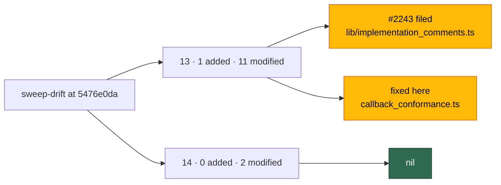

# Security sweep — `commands/` and `setup/` delta

**Issue:** [#2184](https://github.com/stSoftwareAU/VibeCoder/issues/2184) ·
**Parent:** #2170 `security-scan-overflow: 2 chunks not reached`

This is the written record for the modules in ledger slices 13 (#1218 commands
CLI) and 14 (#1220 setup CLI) that were added or modified since each slice's
previous `sweptAt`, `9442a93225c2adb41b641a1f021ad99458fb6341` — the commit the
[#1612 record](security-sweep-1612-commands-setup-delta.md) landed at on `main`.
The file list was regenerated by
`deno run … mod.ts sweep-drift --repo "$(pwd)"`, which is now runnable against
the committed ledger (#2178), not from the counts in the #2184 body.

Siblings:
[`security-sweep-1218-commands-cli.md`](security-sweep-1218-commands-cli.md) (13
original),
[`security-sweep-1220-setup-cli.md`](security-sweep-1220-setup-cli.md) (14
original) and
[`security-sweep-1612-commands-setup-delta.md`](security-sweep-1612-commands-setup-delta.md)
(the previous delta).

> **Two survivors, both in slice 13; slice 14 is nil.** Every added module and
> every modified hunk in both drift lists was read. One candidate is filed as
> #2243 — it lives in `lib/`, reached from `commands/work_on_issue.ts` — and one
> is a self-contained fail-silent defect in a slice-13 module, fixed here with a
> regression test. Slice 14's nil is stated explicitly below, per slice, so a
> later run does not have to re-derive it. Three residuals are recorded rather
> than hidden: they are bounds narrower than a reader of the code comment would
> expect, not reachable defects.



## Scope and method

The list came from the drift report, not from a hand-written diff:

```bash
deno run --allow-read --allow-run --allow-env --allow-sys=hostname \
  worker/deno/mod.ts sweep-drift --repo "$(pwd)"
```

which runs, per slice and per root, the same two diffs the previous record ran
by hand:

```bash
git diff --name-only --diff-filter=A \
  9442a93225c2adb41b641a1f021ad99458fb6341 HEAD -- worker/deno/commands
git diff --name-only --diff-filter=M \
  9442a93225c2adb41b641a1f021ad99458fb6341 HEAD -- worker/deno/commands
git diff --name-only --diff-filter=A \
  9442a93225c2adb41b641a1f021ad99458fb6341 HEAD -- worker/deno/setup
git diff --name-only --diff-filter=M \
  9442a93225c2adb41b641a1f021ad99458fb6341 HEAD -- worker/deno/setup
```

`unowned` was **0** for both slices, so no module under either root is outside
the ledger.

**Slice ownership, not directory membership.** `sweep-drift` attributes a path
to the slice that _claims_ it, so `commands/toolchain_selfcheck.ts` — added
under `commands/` in this window — is reported as `top-up-2070`'s drift, not
slice 13's, and belongs to that slice's record. Slice 13's own `added` list is
the one module below.

Commands were banded as
[`security-sweep-1218-commands-cli.md`](security-sweep-1218-commands-cli.md)
does — **A** GitHub-event dispatch (A1 issue-driven, A2 PR-driven, A3
git/`gh`/credential), **B** scheduled and idle-task (B1 filers and scans, B2
host/container housekeeping), **C** operator terminal — and read at that band's
depth. Setup is local exposure; calls into `lib/` were followed and a finding
would be recorded against the file the defect lives in, as
[`security-sweep-1220-setup-cli.md`](security-sweep-1220-setup-cli.md) did.

For a _modified_ module the hunks were read. For an _added_ module the file was
read in full.

Triage followed [`SECURITY-SCAN.md`](../SECURITY-SCAN.md) Phase 3
(refute-unless-proven): a candidate that could not be traced from a **named**
hostile or degraded field to the dangerous use was dropped rather than filed,
and each drop is recorded below. Phase 3's **independent verification** ran as a
second detection pass over the same hunks in a fresh context that never saw the
first pass's reasoning; both survivors below came from it, and its refutations
are folded into the lists that follow. The four open `security` issues at this
record are #2216, #2231, #2236 and #2237; neither survivor duplicates one, and
#2236 is noted where its site adjoins this slice.

## Findings

| ID                                                             | Site                                                                   | Severity | Confidence | Disposition                                                                                                                                                           |
| -------------------------------------------------------------- | ---------------------------------------------------------------------- | -------- | ---------- | --------------------------------------------------------------------------------------------------------------------------------------------------------------------- |
| [#2243](https://github.com/stSoftwareAU/VibeCoder/issues/2243) | `lib/implementation_comments.ts:239`, from `commands/work_on_issue.ts` | Low      | High       | **filed** — the selection cap runs ahead of the flood detector and the suspicious-pattern audit, which `comment_trust_filter.ts` places deliberately before every cap |
| SEC-2184-F1                                                    | `commands/callback_conformance.ts:89`                                  | Low      | High       | **fixed here** — `--host-failure` bypassed the Issue #2107 refusal and the fixture reported a proven contract for a hook it never ran                                 |
| —                                                              | `worker/deno/setup`                                                    | —        | —          | **nil** — no surviving finding in slice 14                                                                                                                            |

## Slice 13 — commands CLI entry points

Previous `sweptAt`: `9442a93225c2adb41b641a1f021ad99458fb6341` (#1612 record).
Drift at generation HEAD `5476e0da`: **1 added, 11 modified, 0 unowned**.

| Path                                                | Band | Disposition                                                                                                                                                                                                                                                                                  |
| --------------------------------------------------- | ---- | -------------------------------------------------------------------------------------------------------------------------------------------------------------------------------------------------------------------------------------------------------------------------------------------- |
| `worker/deno/commands/codex_budget.ts`              | C    | **added** — read in full. Opt-in operator diagnostic over `CODEX_HOME`; read-only, spawns nothing, runs no Codex turn. Every rendered line is metadata and the whole message goes through `redactSecrets`                                                                                    |
| `worker/deno/commands/callback_conformance.ts`      | C    | read — adds the `cycle` event and **refuses** `--host_failure` (Issue #2107). **SEC-2184-F1**: the refusal matched the underscore spelling only, so `--host-failure` was dropped and the fixture reported green. Fixed here                                                                  |
| `worker/deno/commands/container_build_heal.ts`      | B2   | read — a single JSDoc line widening `healable` to cover a mute build step (Issue #2089). No executable change in this file                                                                                                                                                                   |
| `worker/deno/commands/container_restart_backoff.ts` | B2   | read — the escalation channel moves from the crash-notification path to the operator's own `callbacks.host_failure` hook (Issue #2108), read once via `readHostFailureHook`. `--repo-dir` retired with the GitHub channel; `log_dir` and the hook now resolve through one `hostConfigPath()` |
| `worker/deno/commands/milestone_branch_sync.ts`     | A3   | read — drops the cooldown, the empty `lastSyncTimes` map and the activity ledger so an explicit invocation syncs now (Issue #1776). Removes pacing, adds no new ref or argv                                                                                                                  |
| `worker/deno/commands/pr_ci_processor.ts`           | A2   | read — passes `fleetLogins` so a single-shot run shares the fleet-wide CI-fix attempt budget (Issue #1879). Set built by `resolveFleetMaintenanceAuthorSet`, never `allowedAuthors`                                                                                                          |
| `worker/deno/commands/pr_maintenance.ts`            | A2   | read — passes `workDir` so this scan drops aggregator checks exactly as the run loop's does (Issue #1878). Empty means no clone to read and nothing is filtered                                                                                                                              |
| `worker/deno/commands/prompt_builder.ts`            | A1   | read — accepts `--issue-comments` on `build-issue-prompt` (Issue #1910). No boundary id is accepted, so the blob is scrubbed whole, exactly as the planning and question operations scrub theirs                                                                                             |
| `worker/deno/commands/run_core.ts`                  | B1   | read — clears the module-level provider override before the deps build so the previous run's switch cannot outlive it (Issue #2062). Resets to configured state; grants nothing                                                                                                              |
| `worker/deno/commands/sweep_drift.ts`               | C    | read — the default git runner is now rooted at `--repo` (Issue #2178), because repo-relative pathspecs run from elsewhere matched nothing and every slice reported a clean drift it had not earned                                                                                           |
| `worker/deno/commands/work_on_issue.ts`             | A1   | read — comment selection and trust annotation move to `lib/implementation_comments.ts` (Issue #1910); `formatIssueComments` deleted rather than left as a second path. The boundary-id discipline survives the move; the audit ordering does not — **#2243**, sited in `lib/`                |
| `worker/deno/commands/worker_checkout_update.ts`    | A3   | read — a crash-loop is reported to `callbacks.host_failure` instead of GitHub (Issues #2107, #2110), and the command supplies the self-heal sink's work directory itself rather than letting the sink read the environment                                                                   |

### Slice 13 result

**Two survivors**, described below; the other ten modules are nil.

#### SEC-2184-F1 — the conformance fixture reported a hook it never ran

`callback_conformance.ts` gained a guard in this window that refuses
`--host_failure`, because the hook is a **host** path the host launcher spawns
and the fixture runs inside the container: accepting the flag and quietly
dropping it would report a passing contract for a hook nothing there ever ran.
The guard reads `args.host_failure` only.

`parseArgs` (`worker/deno/mod.ts:415`) does no dash/underscore normalisation —
`arg.slice(2)` is the key verbatim — so `--host-failure`, the spelling every
other flag on this command uses (`--timeout-seconds`), arrives as
`args["host-failure"]`. The guard did not fire, `parseArguments` iterates
`CONTAINER_CALLBACK_EVENTS` only so the value was dropped, and the command
returned `success: true`: the exact fail-silent outcome the guard exists to
prevent, left open for one spelling. Fixed here by guarding both spellings,
covered by
`worker/deno/tests/callback_conformance_test.ts::callback_conformance command - the kebab spelling is refused too (Issue #2184)`,
which fails against the unfixed guard.

#### #2243 — the comment-flood audit is suppressed on the implementation path

Filed rather than fixed. `commands/work_on_issue.ts` now delegates to
`lib/implementation_comments.ts`, which **selects** before delegating to
`prepareTrustAnnotatedCommentList`. `comment_trust_filter.ts:294-308` places
`detectCommentFlood` and the suspicious-pattern collection deliberately _before
any caps_, "so a flood is reported even when the surplus is later dropped"
(#1342, #2873) — and `selectImplementationComments` is a cap (20 comments,
12,000 characters, trusted humans first). A thread of 15 untrusted comments of
~1,200 characters fits only ten into the budget, so the `> 10` threshold is
never reached and no `[SECURITY] [COMMENT_FLOOD]` event is raised on an
implementation run, where the same thread trips it on the planning, question and
PR-feedback routes. Low: detection telemetry only — the downstream
`maxUntrustedCommentCount: 5` and `maxUntrustedCommentChars: 2000` caps still
bound what reaches the prompt. The defect is sited in `lib/`, and restoring the
invariant means auditing the full annotated set while the selection bounds only
what is carried — more than a one-line change, hence the issue.

### Commands refutations

- **`prompt_builder --issue-comments` as a trust-boundary escape.** The
  strongest candidate in the slice: a new CLI door for attacker-written comment
  text into the implementation prompt. `buildIssuePrompt` derives its delimiters
  from `createPromptDelimiters(ciFailureBoundaryId ??
  commentBoundaryId)`, and
  the CLI supplies **neither**, so the run gets a fresh nonce and
  `sanitiseDelimitedComments` keeps only whole-line headers bearing that nonce.
  A commenter's forged `[TRUSTED]` header is degraded to inert data, and the
  blob is fenced under an `[UNTRUSTED] Issue Comments` heading. This is the same
  shape the planning, question and PR-feedback operations already carry.
- **`work_on_issue` handing a boundary id to the plain comment path.** This
  would be the #3638 hole — untrusted text exempted from the full scrub — and
  the refactor does not open it. `buildImplementationCommentContext` returns
  `commentBoundaryId` **only** on the `prepareTrustAnnotatedCommentList` branch,
  which it takes only when `allowedAuthors` or `authorisedCommenters` is
  non-empty, and only when that call actually produced formatted comments. The
  no-trust-configuration path returns the plain `author: body` blob with no id,
  so it is scrubbed whole, and `capFormattedComments` still bounds it (#3648).
  Selection now precedes the trust formatter, which _narrows_ what an untrusted
  flood can occupy — trusted humans take the budget first. What that same
  pre-selection _does_ break is the audit ordering `comment_trust_filter.ts`
  relies on — filed separately as #2243, above.
- **`pr_ci_processor` fleet set omitting `service_accounts`.** The call passes
  `fleetPrAuthors: config.fleetPrAuthors ?? []` and no `serviceAccounts`, which
  reads like the #209 miss — a sibling configured only under `service_accounts`
  falling outside the fleet set, so its CI-fix markers would not count against
  the shared attempt budget. Refuted at the config seam: `loadConfig` already
  folds the union through `resolveEffectiveFleetPrAuthors`
  (`lib/config.ts:472`), so `config.fleetPrAuthors` _is_ `fleet_pr_authors` ∪
  `service_accounts` and no consumer can see one key without the other. The set
  is also `resolveFleetMaintenanceAuthorSet`, which deliberately excludes
  `allowedAuthors`, so a trusted human's comment cannot be read as a fleet
  CI-fix marker. Adjacent but distinct: open finding #2236 concerns what the
  agent may write _into_ such a marker, in `lib/pr_ci_processor.ts`; this hunk
  only decides whose markers are counted, so it is not a duplicate and not a
  second site.
- **`container_restart_backoff` / `worker_checkout_update` spawning an
  operator-configured hook path.** A config-named executable is spawned on the
  host, which is the sharpest new capability in the slice. It is the operator's
  own `.config.json` — the same file `log_dir` and `update_mode` come from, and
  an attacker who can write it already owns the host — and the spawn itself is
  `invokeCallback`'s bounded, cleared-environment contract, swept under
  `top-up-2107`. The reads are targeted (`callbacks.host_failure` and
  `callbacks.timeout_seconds` only) and never throw: `none` and `invalid` are
  reported, so a malformed `callbacks` block is not answered as "nothing
  configured".
- **`milestone_branch_sync` losing its cooldown as a request amplifier.** The
  removed pacing is the periodic pass's, not this command's; asking for the
  command _is_ asking for a sync. The bounded caller is the operator or the run
  loop, and the refs it touches are still built by
  `ensureMilestoneBranchExists`, which validates each component.
- **`sweep_drift` rooting git at an operator-supplied `--repo`.** `repoRoot`
  becomes git's cwd, not an argv fragment. `sweptAt` is the only ledger-sourced
  value reaching the argv and `parseCoverageLedger` pins it to `^[0-9a-f]{40}$`;
  the pathspecs sit after a `--` separator, so neither can be read as an option.
  Band C throughout — the report lists paths the operator's own checkout already
  contains.
- **`codex_budget` returning the raw snapshot in `CommandResult.data`.** Only
  `message` is rendered, and it is `redactSecrets`-wrapped. The snapshot type
  carries percentages, window durations, reset instants, reason codes and the
  credential _kind_ — no token, key, account id, email or balance is read from
  `auth.json` at all, only its shape.
- **`run_core` clearing the provider override.** It resets module state to the
  configured preference before the config load; it cannot select a provider the
  operator has not configured, and it removes a cross-run carry-over rather than
  adding one.

## Slice 14 — setup CLI

Previous `sweptAt`: `9442a93225c2adb41b641a1f021ad99458fb6341` (#1612 record).
Drift at generation HEAD `5476e0da`: **0 added, 2 modified, 0 unowned**.

| Path                                 | Disposition                                                                                                                                                                                                                                                                             |
| ------------------------------------ | --------------------------------------------------------------------------------------------------------------------------------------------------------------------------------------------------------------------------------------------------------------------------------------- |
| `worker/deno/setup/setup_cli.ts`     | read — repairs a `milestone/**` ruleset that enforces its required checks on branch creation, under the operator identity, then suppresses the `create-blocked` finding it just fixed (Issue #2067)                                                                                     |
| `worker/deno/setup/workflow_sync.ts` | read — rendered issue bodies now carry resolved action pins (Issue #1824), the copy-verbatim and copy-pins-as-given rules, and the check list rendered from `WORKFLOW_FILE_CHECKS`; the two `catch {}` blocks that swallowed every per-spec failure are replaced by named, logged skips |

### Slice 14 result

**Nil.** Neither module produced a surviving candidate. Two residuals are
recorded below.

### Setup refutations

- **`setup_cli` writing a branch ruleset without asking.** An unprompted
  privileged write is the right thing to be suspicious of. Followed into
  `lib/milestone_ruleset_check.ts` (swept under `top-up-2079`), the blast radius
  is bounded twice: `targetsOnlyMilestoneBranches` requires **every**
  `conditions.ref_name.include` pattern to start `refs/heads/milestone/`, so a
  ruleset covering `~ALL` or the default branch is reported for a human instead
  of repaired; and `buildCreateExemptRulesetBody` rebuilds the whole PUT
  document from the live ruleset, flipping `do_not_enforce_on_create` on the
  `required_status_checks` rule alone and carrying `bypass_actors`, `conditions`
  and every other rule through unchanged — the #1290 lesson applied in a second
  place. The checks still gate every merge; only branch _creation_ is exempted,
  which is the trap that made the repository unusable. The read failing is
  reported as an error, never as "nothing to repair".
- **Suppressing the `create-blocked` finding after a repair.** Guarded by
  `repairedCreateBlock`, which is set only on `repair.repaired === true`. A
  failed repair prints a warning _and_ leaves the finding to be reported, so a
  repository that could not be fixed is never reported clean.
- **`workflow_sync` rendering upstream-resolved pins into an issue body.** The
  pins come from `lib/action_pin_resolver.ts` (`top-up-1823`) over the same `gh`
  runner the sync already uses, so no new credential path is introduced, and
  `applyResolvedPins` throws on a malformed pin rather than interpolating it.
  The throw is deliberately raised _outside_ the per-spec `catch`, so a pin
  fault fails the repo loudly instead of filing a stale template — and the issue
  body now tells the implementer not to re-resolve the pins, which is what the
  fleet's own Actions audit reads back.
- **The replaced `catch {}` blocks as a fail-silent regression.** The opposite:
  the previous code discarded the reason for every per-spec failure. Each skip
  now carries
  `[workflow-sync] <repo>: skipped <spec> —
  <stage> failed: <reason>`, and a
  pin fault becomes `ok: false` with an error the CLI prints.
- **Residual — `pinResolverRunFn`'s timeout does not kill the child.**
  `Promise.race([runner(cmd), budget])` un-blocks the _sync_ at
  `timeoutSeconds`, but nothing cancels the losing promise: `spawnGh` applies a
  deadline only when given a signal and `createSetupRunCommand` gives none, so a
  wedged `gh api` leaves an unsettled `Deno.Command.output()` op and the setup
  process cannot exit until it returns. Not filed: the only caller is
  `setup_cli.ts`'s `runWorkflowSync`, an operator-attended invocation at band C,
  and the fallback on timeout is the frozen catalogue pin, which is itself
  audited. Stated here because the code comment's "the resolver's own
  `timeoutSeconds` is honoured here instead" bounds the control flow, not the
  child process, and a later run must not read it as the stronger claim.
- **Residual — a `gh` call through the setup runner is still untimed.**
  Inherited from #1220 and unchanged by this delta: `runSetupCommand` routes
  `gh` to `spawnGh` without a signal, and non-`gh`/`git` binaries still go
  straight to `Deno.Command` because no chokepoint owns them. The quality gate
  scans `setup/` so a new `gh`/`git` spawn cannot skip the runner.

## Residual — one module read here will drift again

`sweptAt` must be reachable from the default branch
([`SECURITY-SCAN.md`](../SECURITY-SCAN.md)), so both slices are set to
`git merge-base origin/main HEAD` at list-generation time,
`275cadfc6d601758a8d72b738e189fc16a67c0c0`. The drift list itself was generated
at this milestone branch's HEAD, which is ahead of that merge-base by the sweep
records already written under #2170 — among them #2192, whose change to
`commands/sweep_drift.ts` is the one commands hunk in this record that the new
`sweptAt` does **not** yet cover. It was read here, and it will appear once more
in the next slice-13 drift report. That is the conservative direction: a module
read twice, never a module skipped.

## Coverage ledger

Slices 13 and 14 now point at this file and carry
`sweptAt: 275cadfc6d601758a8d72b738e189fc16a67c0c0`.
