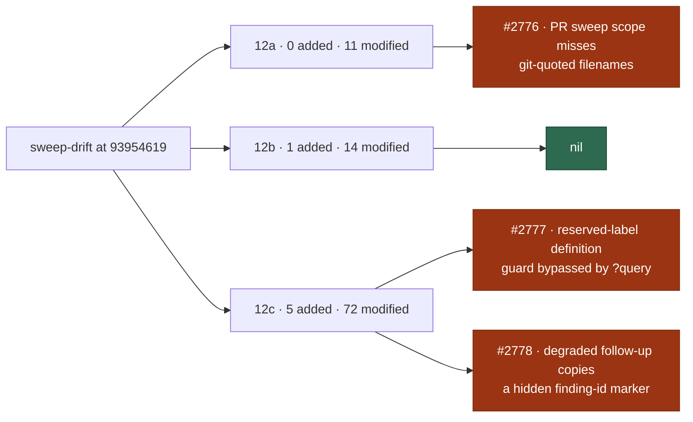

# 🔎 Security sweep — `worker/deno/lib/` delta, slices 12a–12c

**Issue:** [#2755](https://github.com/stSoftwareAU/VibeCoder/issues/2755) ·
**Parent:** #2722 (chunk 6 — untrusted-GitHub-ingestion delta)

This is the written record for the modules in ledger slices 12a (#1214
subprocess/argv), 12b (#1215 filesystem/temp) and 12c (#1216 untrusted GitHub
ingestion) that were added or modified since the
[#2182 record](security-sweep-2182-lib-delta-12a-12c.md) set their `sweptAt` to
`9395461966809ac1a5c7223dcf80b4e7cc1c324f`. The file list was regenerated with
`sweep-drift`, not taken from the "72 of 203" count in #2722. That count was
measured when the issue was filed, and the list has grown since.

Siblings:
[`security-sweep-2182-lib-delta-12a-12c.md`](security-sweep-2182-lib-delta-12a-12c.md)
(the record this delta is measured from) and
[`security-sweep-2183-lib-delta-12d-12f.md`](security-sweep-2183-lib-delta-12d-12f.md)
(the 12d–12f half, whose own delta is #2757).

> **Three findings survived.** Every added module was read in full and every
> modified hunk in the three slices' drift lists was read: 103 modules. The
> drift lists hold 11 in 12a, 15 in 12b and 77 in 12c. 12b is nil. 12a produced
> one survivor, filed as
> [#2776](https://github.com/stSoftwareAU/VibeCoder/issues/2776). 12c produced
> two, filed as [#2777](https://github.com/stSoftwareAU/VibeCoder/issues/2777)
> and [#2778](https://github.com/stSoftwareAU/VibeCoder/issues/2778). The #2182
> survivor, [#2231](https://github.com/stSoftwareAU/VibeCoder/issues/2231), is
> closed by the `milestone_branch_sync.ts` hunk in this delta.



## Scope and method

```bash
git fetch origin main
deno run --allow-read --allow-run --allow-env --allow-sys=hostname \
  worker/deno/mod.ts sweep-drift --repo "$(pwd)"
```

The command was run at `b83a9cc0` on the
`milestone/2722-docs-audits-lib-sweep-cover-security-sweep-le` branch. Between
`git merge-base origin/main HEAD` (`e1fd6e86`) and that head, nothing under
`worker/deno/lib/` changed; only tests changed. So the list below is exactly the
lib drift from `93954619` to the new `sweptAt`.

For a _modified_ module the hunks were read
(`git diff 9395461966809ac1a5c7223dcf80b4e7cc1c324f HEAD -- <path>`), and the
reading followed into the module wherever a hunk touched the slice's sink. For
an _added_ module the file was read in full. A ledger claim is not a sweep
record. The read was split across four parallel reviewers, balanced by diff
size. Each surviving candidate was then re-verified in code before it was filed.

**Nothing was skipped.** Every module `sweep-drift` reported for 12a–12c has a
triage line below, so none is listed as skipped with a citation.

Triage followed [`docs/SECURITY-SCAN.md`](../SECURITY-SCAN.md) Phase 3
(refute-unless-proven). A candidate only survives when a concrete
attacker-controlled input reaches a sink unsafely.

## Findings

| ID                                                             | Site                                                                                                          | Severity | Confidence | Disposition                                                                                                                                                                           |
| -------------------------------------------------------------- | ------------------------------------------------------------------------------------------------------------- | -------- | ---------- | ------------------------------------------------------------------------------------------------------------------------------------------------------------------------------------- |
| [#2777](https://github.com/stSoftwareAU/VibeCoder/issues/2777) | `worker/deno/lib/gh_guard_decision.ts:484` `API_LABEL_ENDPOINT` / `apiLabelDefinitionNames`                   | Medium   | High       | **filed** — `gh api -X DELETE repos/<claimed>/labels/needs-human?x=1` is allowed (reproduced against `evaluateGhCommand`); `name`/`new_name` in an `--input` body is not scanned      |
| [#2776](https://github.com/stSoftwareAU/VibeCoder/issues/2776) | `worker/deno/lib/security_tree_sweep.ts` `readChangedFiles` + `.github/workflows/security-tree-sweep.yml:123` | Low      | High       | **filed** — `git diff --name-only` C-quotes non-ASCII paths, the list is never unquoted, so a PR's new finding in such a file is "outside the changed files" and the check goes green |
| [#2778](https://github.com/stSoftwareAU/VibeCoder/issues/2778) | `worker/deno/lib/phases/completion_phase.ts:2009` → `degraded_delivery.ts` `shortfallLines`                   | Low      | Medium     | **filed** — issue-body criteria are copied verbatim into a fleet-authored `idle-task` follow-up, so a hidden `finding-id` marker passes the #1243 author gate                         |

Deduplicated against open issues at sweep time: none shared a root cause. None
is fixed in this change. Each fix changes guard or gate behaviour and needs its
own regression tests, which is more than a sweep record should carry.
`degraded_delivery.ts` is owned by slice `top-up-2562`; the finding is recorded
here because the untrusted input enters through the `completion_phase.ts` hunk
in 12c.

## Slice 12a — subprocess and argv construction

Previous `sweptAt`: `9395461966809ac1a5c7223dcf80b4e7cc1c324f` (the #2182
record). Drift at generation HEAD: **0 added, 11 modified, 0 unowned**.

### Modified

| Path                                           | Disposition                                                                                                                                          |
| ---------------------------------------------- | ---------------------------------------------------------------------------------------------------------------------------------------------------- |
| `worker/deno/lib/agent_env.ts`                 | read — forces `VIBE_AUDIT_DISABLED=1` into the agent child env, set last; the guard shim journals from baked-in argv, so the agent cannot silence it |
| `worker/deno/lib/claude_env.ts`                | read — adds two constant sub-agent cap env vars, applied only when unset; no attacker input reaches the child env                                    |
| `worker/deno/lib/claude_runner.ts`             | read — `--agents`/`--settings` are separate argv values of worker-built JSON; build-cache env keyed by a sanitised checkout-path digest              |
| `worker/deno/lib/interactive_login_scanner.ts` | read — doc comment only (the scope list of setup scripts); no code change                                                                            |
| `worker/deno/lib/pre_flight_gate.ts`           | read — build-cache overrides layered into the allowlist env; `clearEnv: true` and fixed argv are unchanged                                           |
| `worker/deno/lib/quality_gate.ts`              | read — JUnit dir comes from `Deno.makeTempDir` and is removed in `finally`; unit-test argv is worker-built; a budget failure fails closed            |
| `worker/deno/lib/quality_gate_phase.ts`        | read — `carryEnvThroughSudo` puts `env NAME=value` after sudo's `--`; name and value pass strict regex; the value is a hashed directory              |
| `worker/deno/lib/repo_config.ts`               | read — prompt wording only (never background long-running commands); argv and env unchanged                                                          |
| `worker/deno/lib/security_tree_sweep.ts`       | read — PR changed-files scoping compares git-quoted list lines with raw scanner paths, so a quoted filename escapes the gate — **filed #2776**       |
| `worker/deno/lib/untrusted_command_env.ts`     | read — `CARGO_TARGET_DIR` joins the allowlist; the value comes from the operator/worker environment, not GitHub; no secret added                     |
| `worker/deno/lib/write_repo_allowlist.ts`      | read — `seedWriteRepoAllowlist` takes extra repos for setup (all configured); caller-supplied, never GitHub data                                     |

## Slice 12b — filesystem, path and temp-file handling

Previous `sweptAt`: `9395461966809ac1a5c7223dcf80b4e7cc1c324f` (the #2182
record). Drift at generation HEAD: **1 added, 14 modified, 0 unowned**.

### Added (read in full)

| Path                                              | Disposition                                                                                                                                  |
| ------------------------------------------------- | -------------------------------------------------------------------------------------------------------------------------------------------- |
| `worker/deno/lib/callback_failure_publication.ts` | reads and writes a fixed-name JSON file under WORK_DIR and `$HOME/logs`; directories come from env/config, the parser type-checks each field |

### Modified

| Path                                           | Disposition                                                                                                                                                     |
| ---------------------------------------------- | --------------------------------------------------------------------------------------------------------------------------------------------------------------- |
| `worker/deno/lib/agent_mcp_config.ts`          | read — extra MCP servers come from worker callers and merge with a collision check; write path and directory unchanged                                          |
| `worker/deno/lib/callback_failure_streak.ts`   | read — persistence moves to the publication module; file name is a constant, no attacker-influenced path segment                                                |
| `worker/deno/lib/git_guard_shim.ts`            | read — header text becomes the exported constant `GIT_GUARD_SHIM_MARKER`; generated script and quoting unchanged                                                |
| `worker/deno/lib/gitignore_enforcer.ts`        | read — two constant patterns added (`/graft/`, `/.codegraph/`); no path handling changed                                                                        |
| `worker/deno/lib/issue_cache.ts`               | read — injectable clock and a per-read TTL override; cache path and directory ownership check are unchanged                                                     |
| `worker/deno/lib/merge_conflict_deferrals.ts`  | read — the deferral notice span becomes a four-hour literal; no path or file handling touched                                                                   |
| `worker/deno/lib/pr_branch_preparation.ts`     | read — the fixed-path response file is redacted, then HTML-comment delimiters are neutralised and logged; closes a marker-forgery channel                       |
| `worker/deno/lib/pr_ci_checks.ts`              | read — the fork-chosen check name now passes `neutraliseAgentMarkers` before it reaches a fleet comment (hardening)                                             |
| `worker/deno/lib/prompt_manager.ts`            | read — placeholder lists edited only (`QUALITY_INSTRUCTIONS` dropped, two optional ones added); template path resolution unchanged                              |
| `worker/deno/lib/repo_fast_failure_tracker.ts` | read — three more regexes skip uninformative lines (`<details>`, `<summary>`, code fences); no filesystem sink                                                  |
| `worker/deno/lib/repo_settings_harden.ts`      | read — no local file writes; repo paths reach the contents API only via `contentsPath` (refuses `.`/`..`/empty, encodes each segment); logins are regex-checked |
| `worker/deno/lib/resume_state_store.ts`        | read — per-stream session file named by `streamKey` (slugged, hashed, repo must be `owner/name`); temp write is UUID plus rename                                |
| `worker/deno/lib/run_callbacks.ts`             | read — adds only worker-derived telemetry, Graft, CodeGraph and RTK facts to hook env/JSON; no filesystem path handling changed                                 |
| `worker/deno/lib/run_core_production_deps.ts`  | read — new `behindCountFn` cwd is `${workDir}/<configured repo name>`, `hostLogDirectory` is `$HOME/logs`; no attacker-built path                               |

## Slice 12c — untrusted GitHub-data ingestion

Previous `sweptAt`: `9395461966809ac1a5c7223dcf80b4e7cc1c324f` (the #2182
record). Drift at generation HEAD: **5 added, 72 modified, 0 unowned**.

### Added (read in full)

| Path                                             | Disposition                                                                                                                                                |
| ------------------------------------------------ | ---------------------------------------------------------------------------------------------------------------------------------------------------------- |
| `worker/deno/lib/marker_comment_pages.ts`        | returns each comment's author for callers to gate; all four callers filter by fleet author before any update or delete; `-f body=` is raw                  |
| `worker/deno/lib/merge_fallback_issue.ts`        | every field passes `sanitiseIssueText`; analysis sits in a fence longer than any backtick run; dedup is fleet-author verified; labels go through the guard |
| `worker/deno/lib/milestone_behind_count.ts`      | fetch plus `rev-list --count`: refspec built by `buildFetchTrackingRefArgs` (validated, `--end-of-options`); count refs validated too                      |
| `worker/deno/lib/milestone_gate_wedge.ts`        | files a redacted gate-wedge diagnostic in VibeCoder; title dedup is fleet-author gated; argv arrays and guarded labels only                                |
| `worker/deno/lib/milestone_sync_announcement.ts` | posts a comment built from worker-held branch, host and time values as one `--body` argv value; target issue comes from the escalation resolver            |

### Modified

| Path                                                             | Disposition                                                                                                                                                          |
| ---------------------------------------------------------------- | -------------------------------------------------------------------------------------------------------------------------------------------------------------------- |
| `worker/deno/lib/action_advisory_scanner.ts`                     | read — tag from a workflow comment is checked by `SAFE_TAG_RE` and `..` refusal; suppression needs the tag to resolve upstream to the exact pinned 40-hex SHA        |
| `worker/deno/lib/adaptive_floor_starvation.ts`                   | read — comment wording only ("every `sleepInterval`"); no code change                                                                                                |
| `worker/deno/lib/agent_progress.ts`                              | read — per-tool call counts and a bounded time history in memory; no parsing of untrusted GitHub data                                                                |
| `worker/deno/lib/blocking_pr_stall_detector.ts`                  | read — only threads a per-repo slot cap (`resolveFleetPrSlots`) from config; no new parsing or sink                                                                  |
| `worker/deno/lib/claim_issue.ts`                                 | read — stream-busy/affinity checks read holder markers filtered by the same `allowedAuthors` trust set as claim comments                                             |
| `worker/deno/lib/claim_pr_comment.ts`                            | read — paginated marker read; stale sweep and competing claims gated by fleet author; own claim is the posted comment id (gated fallback)                            |
| `worker/deno/lib/claude_executor.ts`                             | read — adds the `call-storm` reason and `stallReason` field; balance-exhausted text now joins the usage-limit tail regex (a pause decision, no sink)                 |
| `worker/deno/lib/coding_failure_ladder.ts`                       | read — `token-scope` becomes transient and `repo-config` record-only; both classes come from the worker's own failure category, not from issue text                  |
| `worker/deno/lib/comment_trust_filter.ts`                        | read — refactor plus `collectCommentSecurityAudits`, which audits the whole thread before any budget cap; it strengthens detection and trusts nothing new            |
| `worker/deno/lib/config.ts`                                      | read — operator config file only (call-storm bounds, fleet PR slots, codegraph/RTK/graft switches); drops `fast_failure_diagnostics_here`; no GitHub input           |
| `worker/deno/lib/conflict_abandon_restart.ts`                    | read — new no-issue fallback reads only trusted PR comments; restart claims are author-partitioned; the scan already skips non-fleet PRs                             |
| `worker/deno/lib/container_manifest.ts`                          | read — adds `findGraftRebuildViolations`, a static regex lint of the repo's own Containerfile; no GitHub input or process                                            |
| `worker/deno/lib/container_store_prune.ts`                       | read — adds an optional builder-stop step from fixed dialect argv before delete; runtime output is only matched and logged                                           |
| `worker/deno/lib/cooldown_state.ts`                              | read — adds local per-install `workflowScopeRefusals`; every field is type-checked on load and age-bounded; keyed on worker-known repo, issue and uuid               |
| `worker/deno/lib/diagnose_issue.ts`                              | read — dependency check now uses shared `isDependencyBlocked`; milestone parsed as a typed title; diagnostic output only                                             |
| `worker/deno/lib/escalate_as_work.ts`                            | read — doc-comment change only (abandon-and-restart label note, Issue #2277); no code change                                                                         |
| `worker/deno/lib/execute_claude_phase.ts`                        | read — issue title and body go to `graft ask --source` as one argv element with no `--`; a leading dash only makes graft fail (tested), so no bundle                 |
| `worker/deno/lib/find_failure_detection_repair_issues.ts`        | read — label filter over the cycle's listing (labels are writer-only), with a fallback to the old `gh` query; same trust as before                                   |
| `worker/deno/lib/find_oldest_issue.ts`                           | read — chain promotion only reorders roots that already carry a discovery label; gate-comment dedup and legacy deletes are fleet-author-gated                        |
| `worker/deno/lib/fleet_telemetry_sidecar.ts`                     | read — new numeric counters coerced with `Number.isFinite`; no text sink                                                                                             |
| `worker/deno/lib/gh_auth.ts`                                     | read — token-scope assessment parses local `gh auth status`; the refresh command is only printed as advice, never run                                                |
| `worker/deno/lib/gh_body_redaction.ts`                           | read — appends a masked-instruction notice on `gh issue create` after redaction, into the same argv slot; never unmasks, adds no argv element                        |
| `worker/deno/lib/gh_guard_decision.ts`                           | read — new #2518 reserved-label definition check misses `gh api …/labels/<name>?x` and `name`/`new_name` in `--input` bodies — **filed #2777**                       |
| `worker/deno/lib/git_pull.ts`                                    | read — stage-timer plumbing and a `defaultSha` passed to the adopted-merge check; no new argv or text sinks                                                          |
| `worker/deno/lib/idle_detect_diagnostics.ts`                     | read — adds stream-sharing tier labels, slot cap and open-milestone set to diagnostics; label writes need triage access                                              |
| `worker/deno/lib/idle_inversion_streak.ts`                       | read — claim-refusal reasons pass `bodySafe` and are wrapped in inline code before reaching the filed report                                                         |
| `worker/deno/lib/idle_task_templates/best_practices_template.ts` | read — CloudFormation pre-scan lines from the checkout go into the prompt; the checkout path is built from config values                                             |
| `worker/deno/lib/issue_finder_common.ts`                         | read — batched GraphQL issue-state query puts only a regex-checked owner/name and safe-integer numbers into the query text; dependency refs only choose what is read |
| `worker/deno/lib/issue_query.ts`                                 | read — new planning-handoff trust needs `work-on` added by a trusted non-fleet login; PR cap and own-PR guard count fleet-authored PRs only                          |
| `worker/deno/lib/issue_run_stats_comment.ts`                     | read — new Graft/CodeGraph/RTK/split/gate stats lines render only worker-computed numbers and enum statuses; no GitHub text                                          |
| `worker/deno/lib/label_security.ts`                              | read — worker-added `planning` trusted only if the latest `work-on` came earlier, from a trusted non-worker, and was not removed                                     |
| `worker/deno/lib/merge_conflict_stall_watchdog.ts`               | read — parked-base marker is read only after the `isTrustedAuthor` gate and must be a valid SHA; label listing only skips work                                       |
| `worker/deno/lib/milestone_branch_self_heal.ts`                  | read — calls the refusal-label release, which filters comments through `selectFleetAuthoredComments` before its marker test; milestone title is a flag value         |
| `worker/deno/lib/milestone_branch_sync.ts`                       | read — `clearEarlierSyncEscalation` now keeps only fleet-authored markers via `selectFleetAuthoredComments` (none if the fleet is unresolved); closes #2231          |
| `worker/deno/lib/milestone_children_gate.ts`                     | read — return type changes from boolean to a three-state outcome; the fleet-authored marker check is unchanged                                                       |
| `worker/deno/lib/milestone_completion.ts`                        | read — arms auto-merge on the fleet's own summary PR via `finalisePr` gates; PR number is regex-parsed from its own `gh pr create` output                            |
| `worker/deno/lib/milestone_conflict_agent_binding.ts`            | read — adds a once-only `onAgentRungEntered` announce hook and drops quality instructions; agent invocation otherwise unchanged                                      |
| `worker/deno/lib/milestone_conflict_dedup.ts`                    | read — an escalation marker now counts only on a fleet-authored comment (`selectFleetAuthoredComments`); tightens trust                                              |
| `worker/deno/lib/milestone_conflict_ladder.ts`                   | read — the agent's reply returns through `readPrResponseMessage`, which now redacts secrets and neutralises markers (#2236)                                          |
| `worker/deno/lib/milestone_conflict_triage.ts`                   | read — adds an optional `timings` field and rewords the conflict comment text; no new input reaches argv, a path or a trust decision                                 |
| `worker/deno/lib/milestone_escalation_target.ts`                 | read — removes the reopen-plus-`needs-human` path driven by milestone titles; it now only names the parent issue, which shrinks the privileged action                |
| `worker/deno/lib/milestone_merge_gate.ts`                        | read — passes the build-cache env to `cargo check`; argv is unchanged and the digest is keyed by the sanitised checkout path                                         |
| `worker/deno/lib/milestone_merge_state.ts`                       | read — exempts refused paths only when HEAD's two parents are exactly the pre-merge and default SHAs and the blobs match the tip; otherwise nothing is exempt        |
| `worker/deno/lib/milestone_presync.ts`                           | read — gate-wedge hold keyed on branch-tip SHAs read from git, not on comment text; no new ingestion of untrusted text                                               |
| `worker/deno/lib/milestone_resolution_gate.ts`                   | read — runs `bash quality.sh` from the resolved milestone tree; the same writer-controlled trust as the `deno task`/`cargo` steps beside it                          |
| `worker/deno/lib/milestone_ruleset_check.ts`                     | read — ruleset sync plan comes from ruleset/merged-PR check JSON; slug validated, numeric id in path, body goes via `--input -`                                      |
| `worker/deno/lib/milestone_sync_conflict.ts`                     | read — agent reply is quoted into the comment after `readPrResponseMessage` redacts secrets and defuses markers; timings are worker-built                            |
| `worker/deno/lib/milestone_sync_pr.ts`                           | read — push retries once on stale-info; arm-failure comment is gh error text only; sync branch name derives from the milestone branch                                |
| `worker/deno/lib/milestone_sync_streak.ts`                       | read — local ledger gains fields (analysis, timings, gate refusal) parsed by type; cooldown removed; no argv or API sink                                             |
| `worker/deno/lib/phases/completion_phase.ts`                     | read — `git diff … -- file` is separated; issue-body criteria are copied verbatim into a fleet-authored `idle-task` follow-up — **filed #2778**                      |
| `worker/deno/lib/phases/merged_pr_precheck_phase.ts`             | read — post-merge approval now checked against per-repo `trustedAuthorsFor`, which never widens trust; fleet authors still excluded                                  |
| `worker/deno/lib/plan_coverage_gate.ts`                          | read — doc comment only; gate logic unchanged                                                                                                                        |
| `worker/deno/lib/planning_processor.ts`                          | read — milestone title now fenced as untrusted; Graft query (title+body) goes as one argv value after `--source`, no shell                                           |
| `worker/deno/lib/pr_auto_merge.ts`                               | read — new comments use the scrubbed/redacted milestone title and detail; new markers are write-only, never read back for trust                                      |
| `worker/deno/lib/pr_branch_lock.ts`                              | read — paginated lock read with a 100-deletion cap; competitors now TTL-filtered and fleet-gated; stale sweep ungated as before (see refutations)                    |
| `worker/deno/lib/pr_branch_state.ts`                             | read — adds `reviewDecision` to the batched GraphQL (type-checked string, used only to leave a blocked PR alone); head ref still goes through `validateRefName`      |
| `worker/deno/lib/pr_comments.ts`                                 | read — `removeProcessedMark` deletes only `eyes` reactions left by the acting `gh api user` login, with integer ids; a dismissed review is reported, not undone      |
| `worker/deno/lib/pr_feedback_supersede.ts`                       | read — a change request is superseded only by a later, non-merge, non-bot fleet commit or the reviewer's own newer review; unreadable data keeps it live             |
| `worker/deno/lib/pr_invitation_lookup.ts`                        | read — cached open-PR authors are only used to skip a lookup; any doubt returns null and it asks GitHub as before                                                    |
| `worker/deno/lib/pr_issue_linking.ts`                            | read — closes issues for merged PRs by any author; a merge needs a writer, and the issue-predates-merge and planning-label checks remain                             |
| `worker/deno/lib/pr_maintenance.ts`                              | read — CHANGES_REQUESTED reviews paginated and still gated by authorised commenter; close-on-merge only on fleet-authored PRs                                        |
| `worker/deno/lib/refinement_processor.ts`                        | read — issue title and body now reach `graft ask` argv via the phase accelerators (see refutations); prompt delimiting unchanged                                     |
| `worker/deno/lib/repo_busy_for_idle_task.ts`                     | read — passes the operator-configured fleet PR slot cap to the busy gate; no GitHub text is involved                                                                 |
| `worker/deno/lib/repo_fast_failure_issue.ts`                     | read — now files in the monitored repo; detail is still angle/fence-neutralised, dedup stays fleet-author-gated; retry without the label is fixed argv               |
| `worker/deno/lib/repo_rulesets.ts`                               | read — ruleset keeps `integration_id` and the existing enforcement mode; strict policy off; inputs come from the repo API, not issue text                            |
| `worker/deno/lib/repo_settings_scanner.ts`                       | read — operator-side posture scan; approval check tightened, secret-protection exemption driven by repo visibility; no attacker input                                |
| `worker/deno/lib/revision_processor.ts`                          | read — same accelerator wiring as refinement (issue text into `graft ask` argv, see refutations); cwd is the configured `workDir`                                    |
| `worker/deno/lib/run_stats.ts`                                   | read — adds tool-call tallies and executor-split stats to the stats type and its aggregation; no untrusted sink                                                      |
| `worker/deno/lib/token_usage.ts`                                 | read — adds Opus 5.5 pricing rows and a version branch; the model string is only a lookup key                                                                        |
| `worker/deno/lib/validation.ts`                                  | read — new config keys on the allowlist; milestone taken as a string title or null, nothing else                                                                     |
| `worker/deno/lib/work_on_content_integrity.ts`                   | read — trust check now uses per-repo allowed authors; the listed body is live-verified again at pickup (`verifyPickupContentIntegrity`)                              |
| `worker/deno/lib/worker_build_info.ts`                           | read — memoised version/commit facts from the worker's own build; no GitHub input                                                                                    |

## Refutations worth keeping

Candidates that were examined and refuted, recorded so a later run does not
re-derive them.

- **`execute_claude_phase.ts` → `graft_context.ts` graft argv** — the
  attacker-authored issue title and body are joined by `graftQueryFor` into the
  last element of `["ask", "--source", <query>]` with no `--`. It is one argv
  element, so no second option or positional can be added; a leading `-` makes
  graft exit 1 ("missing required argument 'query'"), recorded as a `failed`
  graft status with no bundle. Fail-loud loss of an optional context bundle, not
  a finding.
- **`milestone_branch_self_heal.ts` → `milestone_branch_refusal_release.ts`
  forged failure record** — the #2231 shape (a typed marker strips a label).
  Comments pass `selectFleetAuthoredComments` before
  `refusalIsMostRecentFailure` reads a marker, and an unresolvable fleet set
  drops every comment, so the labels stay.
- **`issue_query.ts` planning-handoff label trust** — the one place a
  fleet-added label is honoured. It needs the latest `planning` add to be a
  worker login's, after a `work-on` add by a trusted non-fleet author that has
  not since been removed; an attacker cannot build that sequence without a
  trusted human queueing the issue first.
- **`action_advisory_scanner.ts` coordinate** — owner/name segments from `uses:`
  are not charset-checked before `repos/${coordinate}/commits/${tag}`, but the
  input is default-branch workflow text only writers control, the call is a
  read-only GET, and suppression still needs a 40-hex SHA equal to the pin.
- **`find_oldest_issue.ts` chain promotion** — "depends on #X" can promote X
  only if it is already in a monitored repo, unassigned, without `needs-human`
  and carrying a discovery label, so an attacker can reorder queued work but not
  queue their own.
- **`claim_issue.ts` → `stream_lock.ts` / `stream_holder.ts` forged holder** — a
  typed holder comment could make a stream look busy or trigger
  `deleteStreamSession`, but both readers gate on `isFleetAuthor` against
  `allowedAuthors`, which `resolveTrustedClaimAuthors` falls back to
  `githubUser` like the CLAIM_LOCK filter. The delete target is `streamKey`, one
  `[a-z0-9_-]` segment plus a hash, so a milestone title cannot traverse.
- **`milestone_sync_conflict.ts` agent reply** — `.pr_response_message` is
  secret-redacted and its HTML-comment delimiters defused by
  `readPrResponseMessage` before it is quoted, so it cannot forge a fleet
  marker; it is the same sink already reviewed on the PR paths.
- **`conflict_abandon_restart.ts` → `merge_fallback_issue.ts` flag carrying
  `idle-task`** — the fleet-authored flag body carries PR-derived text (head
  branch, diff paths, agent analysis), which would launder outsider text into
  trusted work if an outsider PR reached it. `pr_merge_conflict_scan.ts` skips
  any PR outside the push-capable fleet set (`out-of-scope-author`, on top of
  server-side `--author`), and every field passes `sanitiseIssueText`.
- **`milestone_resolution_gate.ts` `bash quality.sh`** — repo-committed code
  runs in the merged milestone-plus-default tree with the inherited env; both
  branches are writer-controlled and the `deno task`/`cargo test` steps beside
  it already run with the same trust, so no new boundary.
- **`pr_issue_linking.ts` any-author merged PRs close linked issues** — the PR
  must have been merged by a writer, and the issue-predates-merge ordering,
  planning-label hold and landed-change checks all still apply.
- **`pr_branch_lock.ts` `cleanStaleBranchUpdateLocks` is not author-gated** —
  only the comment's own author can plant the hidden `BRANCH_UPDATE_LOCK` marker
  (a quote-reply copies rendered text, not the HTML comment), so an attacker can
  only get their own comment deleted. Pre-existing; the delta adds pagination
  and a 100-deletion cap.
- **`claim_pr_comment.ts` unauthored own-claim fallback** — when `gh` returns no
  comment URL the own claim is picked by marker text alone; the attacker cannot
  make `gh` drop the URL, and the worst case is duplicate handling of a comment
  that already passed the authorisation gate.

## Coverage ledger

Slices 12a, 12b and 12c now point at this file and carry
`sweptAt: e1fd6e86083b4ac434a74f7c3e5364ba6717ad1e`. That is
`git merge-base origin/main HEAD` at list-generation time, following the rule in
`docs/SECURITY-SCAN.md` (#2178, #2754). It is not a branch commit, so the
`sweptAt` ancestry guard (`verifySweptAtsOnDefaultBranch`) accepts it while this
PR is open. Because no `worker/deno/lib/` file changed between that commit and
the generation head, `sweep-drift` reports no drift for 12a–12c at the PR head.
