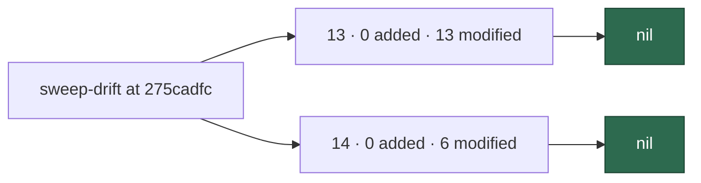

# Security sweep — `commands/` and `setup/` delta

**Issue:** [#2756](https://github.com/stSoftwareAU/VibeCoder/issues/2756)
· **Parent:** #2722 `security-scan-overflow` (chunk 7 — commands CLI entry-point
delta)

This is the written record for the modules in ledger slices 13 (#1218
commands CLI) and 14 (#1220 setup CLI) that were added or modified since each
slice's previous `sweptAt`, `275cadfc6d601758a8d72b738e189fc16a67c0c0` — the
commit the [#2184 record](security-sweep-2184-commands-setup-delta.md) landed
at on `main`. The file list was regenerated by
`deno run … mod.ts sweep-drift --repo "$(pwd)"`, which is now runnable against
the committed ledger (#2178), not from the "12 of 150" count in #2722 — that
count was measured when the issue was filed, and the list has grown since.

Siblings:
[`security-sweep-1218-commands-cli.md`](security-sweep-1218-commands-cli.md)
(13 original),
[`security-sweep-1220-setup-cli.md`](security-sweep-1220-setup-cli.md)
(14 original) and
[`security-sweep-2184-commands-setup-delta.md`](security-sweep-2184-commands-setup-delta.md)
(the previous delta).

> **Nil.** Every modified hunk in both drift lists was read. No candidate
> survived Phase 3 refutation, so nothing is filed here. Both slices' nil is
> stated explicitly below, per slice, so a later run does not have to
> re-derive it. One module — `commands/sweep_drift.ts` — carries the #2754
> ancestry-guard hunk this record's own dependency landed after the
> merge-base, so it is read here and will appear once more in the next
> slice-13 drift report (see the closing residual note).



## Scope and method

The list came from the drift report, not from a hand-written diff:

```bash
git fetch origin main
deno run --allow-read --allow-run --allow-env --allow-sys=hostname \
  worker/deno/mod.ts sweep-drift --repo "$(pwd)"
```

which runs, per slice and per root, the same two diffs the previous record
ran by hand:

```bash
git diff --name-only --diff-filter=A \
  275cadfc6d601758a8d72b738e189fc16a67c0c0 HEAD -- worker/deno/commands
git diff --name-only --diff-filter=M \
  275cadfc6d601758a8d72b738e189fc16a67c0c0 HEAD -- worker/deno/commands
git diff --name-only --diff-filter=A \
  275cadfc6d601758a8d72b738e189fc16a67c0c0 HEAD -- worker/deno/setup
git diff --name-only --diff-filter=M \
  275cadfc6d601758a8d72b738e189fc16a67c0c0 HEAD -- worker/deno/setup
```

`unowned` was **0** for both slices, so no module under either root is
outside the ledger.

**Slice ownership, not directory membership.** `sweep-drift` attributes a
path to the slice that *claims* it. Four modules added under `setup/` in this
window — `codeowners_sync.ts` (#2627), `repo_settings_harden_sync.ts` (#2628),
`repo_settings_audit_close.ts` (#2629) and `copilot_review_setup.ts` (#2701) —
are each owned by their own `top-up-*` slice and were swept by that slice's
record, so they are not part of slice 14's drift and do not belong to this
record. Slice 14's own drift list is the six modified modules below.

Commands were banded as
[`security-sweep-1218-commands-cli.md`](security-sweep-1218-commands-cli.md)
does — **A** GitHub-event dispatch (A1 issue-driven, A2 PR-driven, A3
git/`gh`/credential), **B** scheduled and idle-task (B1 filers and scans, B2
host/container housekeeping), **C** operator terminal — and read at that
band's depth. Setup is local exposure; calls into `lib/` were followed and a
finding would be recorded against the file the defect lives in, as
[`security-sweep-1220-setup-cli.md`](security-sweep-1220-setup-cli.md) did.

For a *modified* module the hunks were read. For an *added* module the file
would be read in full; neither slice added a module.

Triage followed [`SECURITY-SCAN.md`](../SECURITY-SCAN.md) Phase 3
(refute-unless-proven): a candidate that could not be traced from a **named**
hostile or degraded field to the dangerous use was dropped rather than filed,
and each drop is recorded below.

## Findings

No finding survived refutation. Slice 13 is nil; slice 14 is nil.

| ID | Site | Severity | Confidence | Disposition |
| -- | ---- | -------- | ---------- | ----------- |
| — | `worker/deno/commands` | — | — | **nil** — no surviving finding in slice 13 |
| — | `worker/deno/setup` | — | — | **nil** — no surviving finding in slice 14 |

## Slice 13 — commands CLI entry points

Previous `sweptAt`: `275cadfc6d601758a8d72b738e189fc16a67c0c0` (#2184
record). Drift at generation HEAD: **0 added, 13 modified, 0 unowned**.

| Path | Band | Disposition |
| ---- | ---- | ----------- |
| `worker/deno/commands/callback_conformance.ts` | C | read — the kebab-spelling guard from #2184 is the only hunk; both `--host_failure` and `--host-failure` now refuse the host path. No new input or sink |
| `worker/deno/commands/clarity_phase.ts` | C | read — threads the Issue #2569 `accelerators` (config, `prepareCodegraphContext`, `prepareRtkRun`) into `runClarityPhase`. Config- and worker-derived; the spawn stays inside the swept `lib/` phase |
| `worker/deno/commands/diagnose_repo.ts` | C | read — swaps the hand-rolled fetcher for the shared `createDiagnosticIssueFetcher`, runs the scan's own `isDependencyBlocked` with a memoised `createOpenMilestoneLookup`, and adds `fleetPrSlots` and `streamSharingTiers` (Issues #2533, #2663). All reads delegate to swept `lib/`; diagnostic output only |
| `worker/deno/commands/execute_claude_phase.ts` | C | read — adds five operator-config switches: graft/codegraph/rtk context, the executor split and the reviewer sub-agents (Issues #2102, #2159, #2342, #2575). Feature flags, off by default |
| `worker/deno/commands/maybe_file_idle_task.ts` | B1 | read — passes `fleetPrSlotsFor` from `resolveFleetPrSlots` (Issue #2663). Operator-config cap, no new parsing |
| `worker/deno/commands/milestone_branch_sync.ts` | A3 | read — passes `failureLabels` so the refusal sweep only removes the `failed`/`failed-once` labels this deployment actually uses (Issue #2220). Operator-config labels; the write path is unchanged |
| `worker/deno/commands/milestone_completion.ts` | A3 | read — passes `skipAutoMerge` read from `getRepoConfig` (Issue #2458). A boolean config lookup; the summary-PR write is unchanged |
| `worker/deno/commands/pr_ci_processor.ts` | A2 | read — adds the codegraph/rtk/graft context switches (Issues #2160, #2384, #2103). Feature flags from operator config |
| `worker/deno/commands/pr_feedback_processor.ts` | A2 | read — the same three switches as `pr_ci_processor`, plus the worker id. Feature flags only |
| `worker/deno/commands/pr_maintenance.ts` | A2 | read — threads the batched `reviewDecision` into the state map (Issue #2729). A type-checked string used only to leave a blocked PR alone |
| `worker/deno/commands/repo_settings_harden.ts` | C | read — the plan/apply logic moves into `lib/repo_settings_harden.ts`'s `hardenRepo` (swept under 12b); `--require-reviews` is retired into `--require-code-owner-review` (Issue #2680); secret scanning is gated on repo visibility with the skip printed (Issue #2225); `--repo` is validated by `isValidRepoSlug`. Operator-attended, admin token, `--apply` required to write |
| `worker/deno/commands/security_tree_sweep.ts` | C | read — accepts `--changed-files` and renders the "outside changed files" rows (Issue #2619). The path list is operator/CI-supplied; the git-quoting hazard is the separate #2776 finding in `lib/security_tree_sweep.ts` |
| `worker/deno/commands/sweep_drift.ts` | C | read — the `--default-branch` ancestry guard (Issue #2754): `rev-parse --verify` on the ref, then `merge-base --is-ancestor` per `sweptAt`, which `parseCoverageLedger` pins to `^[0-9a-f]{40}$`. No new sink; see the residual note below |

### Slice 13 result

**Nil.** All thirteen modules are read above. The strongest candidates and
their refutations:

- **`repo_settings_harden` delegating to `hardenRepo` with the operator's
  token.** The whole read-plan-apply pass now lives in `lib/`, but the command
  still refuses a malformed `--repo` (`isValidRepoSlug`), and writes are
  gated on `--apply` with an admin token. The lib side — `contentsPath`
  segment validation, `isValidActionCoordinate`, the visibility-gated
  secret-scanning step — is swept under 12b (see the
  [#2755 record](security-sweep-2755-lib-delta-12a-12c.md), `repo_settings_harden.ts`).
  No new boundary in the entry point.
- **`security_tree_sweep --changed-files` as a gate bypass.** The list is a
  path the CI workflow supplies, not attacker text; the hazard where a
  git-quoted non-ASCII path escapes the changed-files scope is real but lives
  in `lib/security_tree_sweep.ts`'s `readChangedFiles`, already filed as
  #2776. This hunk only forwards the path and prints the rows the library
  classified.
- **`sweep_drift --default-branch` reading an operator ref.** The ref reaches
  git only through `rev-parse --verify "${defaultRef}^{commit}"`, and each
  `sweptAt` is a 40-hex string before it reaches `merge-base`. An
  attacker-controlled value cannot become an option or a path traversal; the
  worst case is the command reporting a failed ancestry check.

## Slice 14 — setup CLI

Previous `sweptAt`: `275cadfc6d601758a8d72b738e189fc16a67c0c0` (#2184
record). Drift at generation HEAD: **0 added, 6 modified, 0 unowned**.

| Path | Disposition |
| ---- | ----------- |
| `worker/deno/setup/collaborator_precheck.ts` | read — the default target repo constant is exported as `COLLABORATOR_PRECHECK_REPO` so `withSetupWriteScope` can seed it (Issue #2684). No behaviour change |
| `worker/deno/setup/config_setup.ts` | read — adds the `codeowners_owners` key and `resolveCodeownersOwners`, which refuses a bot or a malformed `@user`/`@org/team` entry before setup writes a CODEOWNERS file from it (Issue #2627). Config-file input, fails loud |
| `worker/deno/setup/config_writer.ts` | read — the Copilot code-review choice is read and written through `parseCopilotCodeReview` (fails loud on a value that is not on/off/leave) into `.config.json` at mode `0o600` (Issue #2701). The operator's own file |
| `worker/deno/setup/content_label_definitions.ts` | read — one static `merge-fallback` label definition added. No input or sink |
| `worker/deno/setup/label_definitions.ts` | read — `dependencies` joins `PROTECTED_STOCK_LABELS` so the deprecated-label pass never deletes GitHub's stock dependabot label. Static |
| `worker/deno/setup/setup_cli.ts` | read — the largest change: `token-scope-preflight` (read-only `gh auth status`, masked, prints a refresh command as advice), `copilot-review-mode` (records the operator's choice), the `repo-settings-harden` step (operator identity, `--dry-run` honoured), `withSetupWriteScope` (seeds the write-repo allowlist — closes #1425), the milestone ruleset sync now runs `syncMilestoneRuleset` with no prompt (Issue #2623), and `dryRunRefusal` refuses a write-as-dry-run. All operator-attended, writes scoped to the configured repos |

### Slice 14 result

**Nil.** Neither module produced a surviving candidate. The strongest
candidates and their refutations:

- **`syncMilestoneRuleset` writing a ruleset without the consent prompt.**
  The removed prompt (Issue #2623) is the sharpest change: an unprompted
  privileged write. Its blast radius is bounded twice. First, the sync's plan
  only ever writes a ruleset whose `conditions.ref_name.include` is exactly
  `refs/heads/milestone/**` — `buildMilestoneRulesetBody` pins the created
  ruleset to `MILESTONE_REF_PATTERN`, and the align branch iterates
  `isExactMilestoneRuleset` only, so a ruleset covering `~ALL` or the default
  branch is never touched (that one is reported for a human). Second, the
  write runs under the `operator` identity, the only one holding the `admin`
  a ruleset write needs, and a non-admin write is refused with a message that
  names the cause. The checks it requires are the default branch's intersected
  with what merged milestone PRs actually report (Issue #2684), so it cannot
  add a check nothing reports and hold every milestone PR blocked.
- **`repo-settings-harden` running as the operator's own `gh` login.** This
  is the identity that can hold `admin`; the fleet account in `gh_config_dir`
  holds `write` by design and was refused on every repository (Issue #2685).
  `dryRun` is a required parameter, not defaulted, so a caller cannot drop it
  on the floor again, and `runRepoSettingsHarden`'s write set — read-only
  token, no approve-PRs, SHA-pin enforcement, the action allow-list, one
  approving review, and visibility-gated secret scanning — is the safe subset
  the Actions audit already describes, with each skipped step printed.
- **`withSetupWriteScope` seeding the allowlist from config.** This closes
  the #1425 `[SECURITY] [WRITE_REPO_UNSEEDED]` gap rather than opening one:
  the seed is `COLLABORATOR_PRECHECK_REPO` plus the configured repos, and
  everything else is still refused at the `spawnGh` chokepoint. A config that
  cannot be read yields no seed and the step runs as before.
- **`token-scope-preflight` printing a `gh auth login` command.** Read-only:
  `gh auth status` prints a masked token and only its prefix is read;
  `assessFleetTokenScopes` is swept in `lib/`. The refresh command is printed
  as advice, never run, and carries no secret.
- **`copilot-review-mode` recording `copilot_code_review`.** The value passes
  `parseCopilotCodeReview`, which fails loud on anything but on/off/leave, so
  a typo cannot silently keep billing a host that asked for `off`; the file is
  written owner-only via `atomicWrite` at mode `0o600`.
- **`dryRunRefusal`.** The opposite of a hazard: a subcommand that would write
  for real refuses `--dry-run` rather than pretending nothing changed.

## Residual — one module read here will drift again

`sweptAt` must be reachable from the default branch
([`SECURITY-SCAN.md`](../SECURITY-SCAN.md)), so both slices are set to
`git merge-base origin/main HEAD` at list-generation time,
`3a38b85a9de2531456c3e56784535903bf045ffa`. That merge-base is behind this
milestone branch's HEAD by the changes #2754 landed on the branch — its
ancestry-guard hunk to `commands/sweep_drift.ts` is the one commands hunk the
new `sweptAt` does **not** cover, and it is read above. It will appear once
more in the next slice-13 drift report. That is the conservative direction: a
module read twice, never a module skipped.

## Coverage ledger

Slices 13 and 14 now point at this file and carry
`sweptAt: 3a38b85a9de2531456c3e56784535903bf045ffa`.
