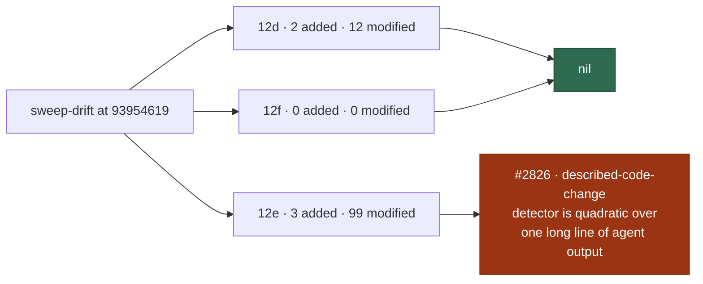

# 🔎 Security sweep — `worker/deno/lib/` delta, slices 12d–12f

**Issue:** [#2757](https://github.com/stSoftwareAU/VibeCoder/issues/2757) ·
**Parent:** #2722 (chunk 8 — lib closing-pass delta)

This is the written record for the modules in ledger slices 12d (#1217
environment / configuration / secret sinks), 12e (#1219 closing pass) and 12f
(#1325 gh-chokepoint top-up) that were added or modified since the
[#2183 record](security-sweep-2183-lib-delta-12d-12f.md) set their `sweptAt` to
`9395461966809ac1a5c7223dcf80b4e7cc1c324f`. The file list was regenerated with
`sweep-drift`, not taken from the "94 of 441" count in #2722. That count was
measured when the issue was filed, and the list has grown since.

Siblings:
[`security-sweep-2183-lib-delta-12d-12f.md`](security-sweep-2183-lib-delta-12d-12f.md)
(the record this delta is measured from) and
[`security-sweep-2755-lib-delta-12a-12c.md`](security-sweep-2755-lib-delta-12a-12c.md)
(the 12a–12c half of the same milestone).

> **One finding survived; it is filed.** Every added module was read in full and
> every modified hunk in the three slices' drift lists was read: 116 modules (14
> in 12d, 102 in 12e, none in 12f). 12d and 12f are nil. 12e produced one
> survivor, filed as
> [#2826](https://github.com/stSoftwareAU/VibeCoder/issues/2826). Both #2183
> survivors are closed. The `grill_me_processor.ts` and
> `grill_me_stall_guard.ts` hunks in this delta carry the fleet-author gate that
> [#2237](https://github.com/stSoftwareAU/VibeCoder/issues/2237) asked for, and
> the marker neutralisation for
> [#2236](https://github.com/stSoftwareAU/VibeCoder/issues/2236) shows up here
> as `neutraliseAgentMarkers` and `inertCheckName` on the fleet-authored bodies.



## Scope and method

```bash
git fetch origin main
deno run -A worker/deno/mod.ts sweep-drift
```

The command was run at `8d6e82ff` on the
`milestone/2722-docs-audits-lib-sweep-cover-security-sweep-le` branch.
`git merge-base origin/main HEAD` was `3a38b85a`. Between that commit and the
generation head exactly one `worker/deno/lib/` file changed:
`lib_sweep_coverage.ts`, which gained the #2754 `sweptAt` ancestry guard on the
milestone branch. It is in the 12e list below and its milestone hunk was read.

For a _modified_ module the hunks were read
(`git diff 9395461966809ac1a5c7223dcf80b4e7cc1c324f HEAD -- <path>`), and the
reading followed into the module wherever a hunk touched a sink. For an _added_
module the file was read in full. A ledger claim is not a sweep record. The read
was split across five parallel reviewers, balanced by diff size (about 13,000
changed lines in all). Each surviving candidate was then re-verified in code
before it was filed.

12d's sinks are environment reads and writes, configuration parsing and trust
decisions taken from config, and secret handling. 12e is the closing pass, so
**any newly introduced sink of the four slice classes counts**: subprocess and
argv, filesystem and temp files, untrusted GitHub ingestion, and
environment/config/secret.

**Nothing was skipped.** Every module `sweep-drift` reported for 12d–12f has a
triage line below, so none is listed as skipped with a citation.

Triage followed [`docs/SECURITY-SCAN.md`](../SECURITY-SCAN.md) Phase 3
(refute-unless-proven). A candidate only survives when a concrete
attacker-controlled input reaches a sink unsafely.

## Findings

| ID                                                             | Site                                                                                                                      | Severity | Confidence | Disposition                                                                                                                                                                                                                                                                      |
| -------------------------------------------------------------- | ------------------------------------------------------------------------------------------------------------------------- | -------- | ---------- | -------------------------------------------------------------------------------------------------------------------------------------------------------------------------------------------------------------------------------------------------------------------------------- |
| [#2826](https://github.com/stSoftwareAU/VibeCoder/issues/2826) | `worker/deno/lib/described_code_change.ts` `PATH_RE`, called from `worker/deno/lib/phases/handle_no_changes_phase.ts:475` | Low      | Medium     | **filed** — the agent's final output is scanned line by line with no length cap. One long unbroken intent line costs O(n²) on the worker's event loop, measured at 36 ms for 5,000 characters, 381 ms for 20,000 and 6.5 s for 80,000. Two reviewers reproduced it independently |

We checked for duplicates against the open `security` issues at sweep time:
[#2776](https://github.com/stSoftwareAU/VibeCoder/issues/2776),
[#2777](https://github.com/stSoftwareAU/VibeCoder/issues/2777) and
[#2778](https://github.com/stSoftwareAU/VibeCoder/issues/2778), all three filed
by the sweep for issue #2755. Each is a different root cause. A title/body
search for `described_code_change`, `detectDescribedCodeChange` and `PATH_RE`
returned no open match.

**Why it was filed rather than fixed.** #2757 asks for each surviving finding to
be filed as its own issue. The fix needs to decide how long a line may be, and
it needs a ratio-timing regression test (`assertLinearGrowth`). That is more
than a sweep record should carry.

## Slice 12d — environment, configuration and secret sinks

Previous `sweptAt`: `9395461966809ac1a5c7223dcf80b4e7cc1c324f` (the
[#2183 record](security-sweep-2183-lib-delta-12d-12f.md)). Drift at generation
HEAD: **2 added, 12 modified, 0 unowned**.

### Idle-task templates this slice owns

12d owns sixteen idle-task templates under
`worker/deno/lib/idle_task_templates/`. Only `github_actions_audit_template.ts`
is in this drift list, and its hunks were read (below). The other fifteen have
not changed since the #2183 record, which still covers them.

### Added (read in full)

| Path                                         | Disposition                                                                                                                                                                                                                                                                                                                                              |
| -------------------------------------------- | -------------------------------------------------------------------------------------------------------------------------------------------------------------------------------------------------------------------------------------------------------------------------------------------------------------------------------------------------------- |
| `worker/deno/lib/token_scope_fleet_bound.ts` | read in full — parks an issue after three consecutive `token-scope` releases. Only fleet-authored comments are counted and only fleet copies of the marker are honoured. The posted body is a worker constant, passed with worker-owned `--repo` and number argv. Agent marker text is neutralised elsewhere                                             |
| `worker/deno/lib/unit_test_time_budget.ts`   | read in full — parses the gate's own JUnit report (worker-chosen path) with linear `<testcase …>` and attribute regexes and fails a file whose every test is over budget. `gitGuardShimOnPath` resolves `git` from the operator's `PATH` and reads 512 bytes looking for the shim marker. Test names reach only log lines; no argv, write or secret sink |

### Modified

| Path                                                                   | Disposition                                                                                                                                                                                                                                                                                                                              |
| ---------------------------------------------------------------------- | ---------------------------------------------------------------------------------------------------------------------------------------------------------------------------------------------------------------------------------------------------------------------------------------------------------------------------------------- |
| `worker/deno/lib/agent_provider.ts`                                    | read — adds `--agents` (JSON from worker-built definitions), `--settings` and `--autocompact` argv from worker values, a DeepSeek adapter, and a preferred-provider resolver. Every argv value is worker-built; no env value or secret reaches argv or a log                                                                             |
| `worker/deno/lib/config_validator.ts`                                  | read — adds `parseCopilotCodeReview`, which accepts only a closed set of values from operator config and fails loudly on anything else. No sink                                                                                                                                                                                          |
| `worker/deno/lib/container_launch.ts`                                  | read — records the work and agent-state volumes as `volume-resettable` launch-plan labels and parses them back. Names come from operator inputs or constants. There is no untrusted input                                                                                                                                                |
| `worker/deno/lib/home_workdir_check.ts`                                | read — changes the allowlist count for `setup_cli.ts` from 3 to 1 and updates the comment. Quality-check data only                                                                                                                                                                                                                       |
| `worker/deno/lib/idle_task_templates/github_actions_audit_template.ts` | read — adds cost leads from the workflow cost scanner, drawn from the repository's own workflow files, to the prompt. Only worker-constant placeholders are replaced after it. It also logs skipped settings checks. No subprocess or path sink is added                                                                                 |
| `worker/deno/lib/issue_finder_logger.ts`                               | read — adds a claim-refusal tally to the no-work line and a whitelisted reason-key parser (`^[a-z][a-z_]{1,39}$`, linear). The new promoted-dependency and chain-root log lines pass repo and assignee through `sanitiseLogField`. No sink                                                                                               |
| `worker/deno/lib/issue_worker_wiring.ts`                               | read — dependency-injection wiring for CodeGraph, RTK, stream compaction, Graft, the codebase map and the workflow-scope warner, plus mocks that are off by default. No new sink logic                                                                                                                                                   |
| `worker/deno/lib/parallel_unsafe_test_manifest.ts`                     | read — adds two test paths to a constant manifest. No runtime sink                                                                                                                                                                                                                                                                       |
| `worker/deno/lib/pr_ci_processor.ts`                                   | read — adds Graft/CodeGraph/RTK wiring, a human-gate park/re-stamp path and `inertCheckName` defusal on every fleet-authored body. Gate markers are read only from fleet-authored comments, and the step is fenced and redacted. The Graft query's leading-dash argv reach is refuted below                                              |
| `worker/deno/lib/run_core.ts`                                          | read — orchestration only: blank-stream locks, claim-refusal tallies, GraphQL budget pacing, deferrable-sweep tier, preferred-credential rotation, Fable-probe gating, handler watchdog re-arm scoped to its own runs, prefetch refresh. No new subprocess, filesystem or comment sink. Logs carry only repo#number and worker constants |
| `worker/deno/lib/unit_test_passes.ts`                                  | read — adds the `--reporter=dot` flag, `--junit-path` inside a `makeTempDir` directory, and targeted passes. Targeted file lists come only from the developer CLI `unit_test_runner.ts` argv, so there is no attacker boundary                                                                                                           |
| `worker/deno/lib/workflow_scope.ts`                                    | read — adds a warn-once logger for a missing `workflow` scope. The message is a worker constant with no token or secret in it                                                                                                                                                                                                            |

**12d is nil for this slice's own sink classes**: environment reads and writes,
configuration parsing, and secret handling. The new env read
(`unit_test_time_budget.ts` reading `PATH`) is operator environment. The new
config parsers (`config_validator.ts` `parseCopilotCodeReview`) accept only a
closed set and fail loudly. Every new argv value in `agent_provider.ts` is
worker-built. No hunk moves a secret into a log, a comment or argv.

## Slice 12e — closing pass over the remainder

Previous `sweptAt`: `9395461966809ac1a5c7223dcf80b4e7cc1c324f` (the #2183
record). Drift at generation HEAD: **3 added, 99 modified, 0 unowned**.

### Added (read in full)

| Path                                           | Disposition                                                                                                                                                                                                                                                                                                                                                   |
| ---------------------------------------------- | ------------------------------------------------------------------------------------------------------------------------------------------------------------------------------------------------------------------------------------------------------------------------------------------------------------------------------------------------------------- |
| `worker/deno/lib/call_storm.ts`                | read in full — pure verdict and normalisation helpers for the call-storm guard, with no I/O. The agent's tool summary (80 characters at most) that goes into the failure reason travels the same existing channel as `lastOutputSnippet`                                                                                                                      |
| `worker/deno/lib/conflict_needs_human_gate.ts` | read in full — decides whether a CI-fix `needs-human` escalation still lets the conflict lane run. The caller passes only fleet-attributed comments, and the agent's CI-fix messages are marker-neutralised, so an outsider cannot forge the lift. Pure function, no sink                                                                                     |
| `worker/deno/lib/described_code_change.ts`     | **survivor** — pure detection of file paths named on intent lines of the agent's final output, capped at ten paths. `PATH_RE` backtracks its tail class to the end of the line from every start position, so one long unbroken line costs O(n²) on the event loop (80,000 characters: 6.5 s) ([#2826](https://github.com/stSoftwareAU/VibeCoder/issues/2826)) |

### Modified

| Path                                                       | Disposition                                                                                                                                                                                                                                                                                                                                                                |
| ---------------------------------------------------------- | -------------------------------------------------------------------------------------------------------------------------------------------------------------------------------------------------------------------------------------------------------------------------------------------------------------------------------------------------------------------------- |
| `worker/deno/lib/acceptance_criteria_gate.ts`              | read — adds an "Accepted scope" heading fallback parsed from the issue body. The anchored heading regex is quadratic only on single-line whitespace, bounded by GitHub's 65,536-character body limit (about 1.7 s at worst). Output is list items only. No sink                                                                                                            |
| `worker/deno/lib/admin_only_finding.ts`                    | read — adds `parseRepoSettingsFindingId`, which captures the `BP-REPO-*` id. Its setup close-out caller also checks the issue author is a fleet account before closing. The regex is linear                                                                                                                                                                                |
| `worker/deno/lib/alert_dedup_authors.ts`                   | read — adds `parseIssueViewCommentRows`. A comment with no readable author gets `author: null`, which no fleet login matches, so the author gate discards it (fails closed). Pure parsing, no sink                                                                                                                                                                         |
| `worker/deno/lib/already_resolved_outcome.ts`              | read — the attribute regex now accepts bare `name=value` in the agent's marker. Each value is still validated by field (SHA or PR shape, self-reference), and the agent could already write quoted values, so no new capability. The regex complexity is unchanged                                                                                                         |
| `worker/deno/lib/analysis_only_handoff.ts`                 | read — rewords a fixed comment sentence to explain the gated planning self-apply. A static string, with no untrusted interpolation                                                                                                                                                                                                                                         |
| `worker/deno/lib/artifact_upload_scanner.ts`               | read — groups whole-workspace upload findings into one per workflow file, with per-step suppression via `selectLiveSteps`. Job names come from repo workflow YAML, which was already echoed before. No new sink                                                                                                                                                            |
| `worker/deno/lib/auto_fix_attempt_tracker.ts`              | read — excludes the `human-gate` category from counted attempts and passes the rendered failure history through `neutraliseAgentMarkers`. This is hardening against agent-authored markers. No new sink                                                                                                                                                                    |
| `worker/deno/lib/auto_merge_sweep.ts`                      | read — asks the REST `update-branch` endpoint to update an armed PR that is behind, using the worker's repo and PR number. It skips PRs that conflict or have changes requested. Error text goes only to recorded outcomes                                                                                                                                                 |
| `worker/deno/lib/best_practices_capper.ts`                 | read — reserves one capped slot for a cost/speed/reliability finding in place of a sub-high finding. Pure list selection. No sink                                                                                                                                                                                                                                          |
| `worker/deno/lib/checkout_persist_credentials_scanner.ts`  | read — groups per-step findings into one per file via `selectLiveSteps` and rewrites the finding prose. Job names were already interpolated before this change. Adds no subprocess or filesystem sink                                                                                                                                                                      |
| `worker/deno/lib/ci_failure_classifier.ts`                 | read — adds `human-gate` detection from `vibe-human-gate:` lines. Prefixes are peeled step by step (no ReDoS). The step is flattened, neutralised, redacted and capped at 300. A fork can only park auto-fix on its own PR                                                                                                                                                 |
| `worker/deno/lib/clarity_assessment.ts`                    | read — rewords the prompt and adds `transformPrompt` and spawn-option (mcpConfig/settingsJson) pass-through, both supplied by worker code. No untrusted input is added to argv                                                                                                                                                                                             |
| `worker/deno/lib/clarity_phase.ts`                         | read — the masked-instruction question echoes issue-body lines and headings into a fleet comment without neutralising `<!--`. It is reachable only through the `clarity-phase` CLI command, which nothing in production invokes (the pipeline uses `phases/clarity_assessment_phase.ts`), so it does not survive triage (refuted below)                                    |
| `worker/deno/lib/codebase_map_cache.ts`                    | read — a formatting-only change to a destructuring statement. No behaviour change                                                                                                                                                                                                                                                                                          |
| `worker/deno/lib/coding_guidelines_overlay.ts`             | read — adds layer selection over the worker-shipped guidelines template. The anchored linear marker regex fails loud on malformed markers. No external input or sink                                                                                                                                                                                                       |
| `worker/deno/lib/collect_idle_task_candidates.ts`          | read — trust checks now use each repo's writers. The integrity check drops the per-repo map so the widened fleet set applies. Labels already in the listing skip a re-fetch, but the timeline author check still runs. No new sink                                                                                                                                         |
| `worker/deno/lib/collect_label_candidates.ts`              | read — trust checks now use each repo's own writers (`trustedAuthorsFor`). Stream-occupancy for this tier becomes an issue-level fleet-assignment check, and blocker details are recorded. Label authorship is still verified through the timeline before a label counts                                                                                                   |
| `worker/deno/lib/collect_low_priority_candidates.ts`       | read — uses the per-repo trust set from operator config (`trustedAuthorsFor`) and adds a suppression flag for workable low-priority issues based on fleet assignees. Labels need triage rights. No sink                                                                                                                                                                    |
| `worker/deno/lib/collect_self_diagnostic_candidates.ts`    | read — passes the fleet PR slot count and uses `describeBlockingPr` in diagnostic text. No new sink                                                                                                                                                                                                                                                                        |
| `worker/deno/lib/collect_work_on_candidates.ts`            | read — trust now comes from `trustedAuthorsFor(config, repo)`, which reads the repo's own writers, never a wider set. Adds workflow-scope refusal, per-slot PR blocking and recorded blockers. No untrusted input reaches a sink                                                                                                                                           |
| `worker/deno/lib/config_defaults.ts`                       | read — new operational defaults (call storm, RTK on, session resume on, graft/codegraph off, Copilot review modes, model tier). These are worker constants, so the trust level is unchanged and no sink is reached                                                                                                                                                         |
| `worker/deno/lib/config_unknown_keys.ts`                   | read — new known keys and a check for unknown keys inside the `codegraph_context`/`rtk_output` blocks. It only reads the operator's own `.config.json` and writes warnings to the log, so no untrusted input and no sink                                                                                                                                                   |
| `worker/deno/lib/conflict_intent_audit.ts`                 | read — uncorroborated agent overrides no longer abort the resolution; they are flagged as "unverified judgement" for a reviewer (Issue #2306). This relaxes a policy but is not a sink class. Echoed override text passes through `sanitiseIssueText` (redacted, with HTML comments neutralised)                                                                           |
| `worker/deno/lib/conflict_marker_trust.ts`                 | read — comment-only rewording of the doc text about how restart markers bound abandons. No code change                                                                                                                                                                                                                                                                     |
| `worker/deno/lib/container_image_hash.ts`                  | read — adds two constant toolchain paths (`codegraph.sh`, `rtk.sh`) to the image-hash input list. Worker constants, no sink                                                                                                                                                                                                                                                |
| `worker/deno/lib/cost_estimate.ts`                         | read — `attributeUsageByModel` splits token usage per model using the CLI's `modelUsage`. Counters are checked to be finite and non-negative, and a breakdown that does not add up is thrown away. Pure arithmetic, no sink                                                                                                                                                |
| `worker/deno/lib/current_models.ts`                        | read — adds an Opus row (`claude-opus-5-5`) to the stale-model table. A constant only; no sink                                                                                                                                                                                                                                                                             |
| `worker/deno/lib/deepseek_executor.ts`                     | read — adds a constant `console.warn` about unsupported `--agents`, which interpolates only the worker's phase name. No new sink                                                                                                                                                                                                                                           |
| `worker/deno/lib/derived_authors.ts`                       | read — adds `formatDisjointTrustWarning`, a log-only WARNING naming organisations that share no writer. Trust decisions stay per repository, and nothing widens trust                                                                                                                                                                                                      |
| `worker/deno/lib/diagnose_repo.ts`                         | read — adds default-branch slot and stream-sharing tier checks to the diagnostic text. The PR title was already echoed before this change. No new sink                                                                                                                                                                                                                     |
| `worker/deno/lib/fable_routing.ts`                         | read — adds `anyPhaseRoutesToFableTier`, which checks routing over a constant phase list and operator environment. Pure logic, no sink                                                                                                                                                                                                                                     |
| `worker/deno/lib/failure_detection_repair.ts`              | read — exports the existing `invocationFrom` helper. No behaviour change and no sink                                                                                                                                                                                                                                                                                       |
| `worker/deno/lib/failure_detection_resume.ts`              | read — passes through an optional cached open-issue listing and a listing limit to parent discovery. No new parsing of untrusted text, no argv and no sink                                                                                                                                                                                                                 |
| `worker/deno/lib/failure_diagnosis.ts`                     | read — adds the `repo_config`, `prompt_too_long` and out-of-credit categories. Matching works over failure messages, and repo_config releases rely on fleet-author-gated records. An agent echo could only mis-categorise, a risk that already existed through `rate limit`                                                                                                |
| `worker/deno/lib/find_issues_by_label.ts`                  | read — checks authors and label adders against the repository's own writer set (`trustedAuthorsFor`), falling back to `allowedAuthors`, rather than the fleet-wide intersection. Trust is not widened beyond that repository's writers                                                                                                                                     |
| `worker/deno/lib/fleet_pr_prefetch.ts`                     | read — a failed search now reuses the owner's last good search result from the local cache (1 h window), or waits when rate-limited; it carries `isDraft`. Keys come from worker constants and the reason text is only logged. No new subprocess, path or comment sink                                                                                                     |
| `worker/deno/lib/fleet_telemetry.ts`                       | read — adds in-memory counters for hook failures and issue-phase runs, plus numeric log fields. Inputs are finite-checked numbers. No untrusted text, subprocess, filesystem or secret sink                                                                                                                                                                                |
| `worker/deno/lib/gh_argv.ts`                               | read — `ghFlagNames` backs local call-shape metrics. Verified: a `--body` value starting with "-" is logged as a flag name (up to 160 characters). It is operator-local and console-redacted, and the values are worker-authored argv, so it does not survive                                                                                                              |
| `worker/deno/lib/gh_call_metrics.ts`                       | read — adds a GraphQL call-shape tally that is only logged. Argument values are dropped: REST paths are cut down to an allow-list of route words, and `--json`/`--state` are shown only when they match a strict pattern or a closed set. Linear regexes; no sink                                                                                                          |
| `worker/deno/lib/git_ref_args.ts`                          | read — `buildRebaseArgs` gains an optional `--no-rebase-merges` flag. It still places `--end-of-options` before the upstream, so leading-dash injection stays closed                                                                                                                                                                                                       |
| `worker/deno/lib/gitleaks_drift_scanner.ts`                | read — a reusable gitleaks workflow that a `pull_request`-triggered caller invokes no longer counts as drift. The parsed YAML is only used to test set membership and write finding text, so no subprocess or filesystem sink                                                                                                                                              |
| `worker/deno/lib/grill_me_processor.ts`                    | read — the stall guard now reads only rounds written by fleet accounts (`selectFleetAuthoredRounds`, which closes the #2183 survivor #2237). Ready no longer re-adds `needs-human`, and Graft/CodeGraph/RTK are wired in with the bundle fenced. The `graft ask` query is refuted below                                                                                    |
| `worker/deno/lib/grill_me_run_stats.ts`                    | read — passes the Graft, CodeGraph and RTK result objects into the run-stats comment arguments. Types and plumbing only. No untrusted text is added                                                                                                                                                                                                                        |
| `worker/deno/lib/grill_me_stall_guard.ts`                  | read — replaces the quadratic trailing-punctuation regex (the #2183 ReDoS) with a linear backward walk. It also separates the stall input (bodies from fleet authors) from the ceiling count (any author). Only linear regexes remain                                                                                                                                      |
| `worker/deno/lib/handler_watchdog.ts`                      | read — adds an AsyncLocalStorage run owner and an optional `extend()` re-arm loop for the hard timeout. In-process control flow only. No subprocess, filesystem or GitHub-data sink                                                                                                                                                                                        |
| `worker/deno/lib/heartbeat_storage.ts`                     | read — the superseded release comment now repeats the release reason through `boundOutcomeText`, which flattens it to one line, neutralises `<!--`/`-->` and caps its length. `hostFromMachineId` is now exported. The echoed text is the same as before                                                                                                                   |
| `worker/deno/lib/host_path_style.ts`                       | read — rejects CR/LF in host path values before they are written to the line-oriented `install-tools.sh` KEY=value file. This hardens against line injection and adds no sink                                                                                                                                                                                              |
| `worker/deno/lib/idle_decision_census.ts`                  | read — census only counts. It adds claim-refused, cross-milestone and fleet-PR-slot accounting and a stream-sharing-tier exemption. It never gates a pickup, runs no subprocess and posts nothing                                                                                                                                                                          |
| `worker/deno/lib/image_conclusion_gate.ts`                 | read — adds `gatePlanningHandoff`, which holds back the planning hand-off when untrusted images are present. It tightens a control. The audit text contains only a count                                                                                                                                                                                                   |
| `worker/deno/lib/issue_dependencies.ts`                    | read — adds only the `DependencyBlocker` interface (type-only)                                                                                                                                                                                                                                                                                                             |
| `worker/deno/lib/issue_filter.ts`                          | read — `hasLiveMilestoneTrackingMarker` makes marker detection stricter than the old `includes()` check, using anchored, linear regexes. Adds pure `isStreamSharingTier`/`isIssueFleetAssigned` helpers over labels and assignees. No subprocess or filesystem sink                                                                                                        |
| `worker/deno/lib/issue_priority.ts`                        | read — adds a `promotedBy` field and unworkable chain roots, and narrows the low-priority idle-task suppression to issues not waiting on a human. Selection logic only; no sink                                                                                                                                                                                            |
| `worker/deno/lib/issue_worker.ts`                          | read — adds default Graft, CodeGraph and RTK status objects to the recorded run result. Config booleans only. No sink                                                                                                                                                                                                                                                      |
| `worker/deno/lib/issue_worker_types.ts`                    | read — type-only additions (stream session, quality-gate outcome, Graft, CodeGraph and RTK results). No runtime code                                                                                                                                                                                                                                                       |
| `worker/deno/lib/label_failure.ts`                         | read — `repo_config` failures now get an unlabelled comment built with the redacting `buildErrorSection`. `token_scope` skips labelling. Agent text could force that category, but the `scheduled_release` marker allowed the same at the base, so nothing new. Argv is fixed                                                                                              |
| `worker/deno/lib/label_planning_escalation.ts`             | read — comment-only change documenting the audited `work-on` → `planning` hand-off. No code change                                                                                                                                                                                                                                                                         |
| `worker/deno/lib/lib_sweep_coverage.ts`                    | read — adds `verifySweptAtsOnDefaultBranch` (git rev-parse, cat-file, merge-base) and richer error text. `sweptAt` is checked as 40-hex before it reaches argv. Developer tool. This includes the milestone-only #2754 hunk that remains as residual drift (see Coverage ledger)                                                                                           |
| `worker/deno/lib/merge_block_escalation.ts`                | read — adds an optional `merged` flag to the `landed` outcome type. No runtime sink                                                                                                                                                                                                                                                                                        |
| `worker/deno/lib/merge_conflict_drain.ts`                  | read — skips a claimed PR whose re-read mergeable state is no longer CONFLICTING and records the decision. Logic and logging only. No sink                                                                                                                                                                                                                                 |
| `worker/deno/lib/merge_conflict_markers.ts`                | read — adds ladder and park marker writers that check the sha (7–40 hex) and a `readParkedBase` reader. Every caller passes it comment threads already filtered to the fleet (`attribution.trusted`, `trust.trusted`, `isTrustedAuthor`). The regex is linear                                                                                                              |
| `worker/deno/lib/milestone_branch_rejection.ts`            | read — adds `isRepoLevelMilestoneBranchRefusal`: simple linear regexes over the failure text that classify it as `repo_config`. Agent-influenced classification is the same pre-existing class as `scheduled_release`. No sink                                                                                                                                             |
| `worker/deno/lib/new_work_eligibility.ts`                  | read — the dependency fetcher is now seeded from the repo listing, and the change adds workflow-scope refusal and per-slot PR-cap descriptions. Eligibility bookkeeping only. No new sink                                                                                                                                                                                  |
| `worker/deno/lib/phase_run_stats.ts`                       | read — passes Graft, CodeGraph and RTK result objects into the stats comment arguments. Type and plumbing only; no sink                                                                                                                                                                                                                                                    |
| `worker/deno/lib/phases/execute_phase.ts`                  | read — adds a fresh-session retry for "Prompt is too long", Graft/CodeGraph/RTK wiring, `--agents`/`--settings`, and a stream hand-on. The agent-output reason is neutralised by `boundOutcomeText`. The issue title and body go to `graft ask` without `--` (refuted below)                                                                                               |
| `worker/deno/lib/phases/handle_no_changes_phase.ts`        | read — **survivor site**: adds the planning hand-off, gated on the anchor label, once per issue and on the image gate, plus a described-change retry nudge. Echoed paths are limited to `[\p{L}\p{N}_.-/]`, capped at 10 and redacted, but the detector it calls at `:475` is quadratic over agent output ([#2826](https://github.com/stSoftwareAU/VibeCoder/issues/2826)) |
| `worker/deno/lib/phases/quality_gate_remediation_phase.ts` | read — records `qualityGateOutcome` once per run for the stats comment. It holds worker-generated state only; no sink                                                                                                                                                                                                                                                      |
| `worker/deno/lib/phases/setup_branch_phase.ts`             | read — adds the refusal-label release (gated on fleet authors), the stream lock and sharing, and stream-session priming. The milestone title becomes a filesystem key through `streamKey`, limited to one `[a-z0-9_-]` segment. No sink is reached unsafely                                                                                                                |
| `worker/deno/lib/planning_run_stats.ts`                    | read — splits per-model usage and renders per-model token lines. Model names come from CLI and API usage data, not from GitHub input. Rendering only                                                                                                                                                                                                                       |
| `worker/deno/lib/pr_branch_update.ts`                      | read — parses more `gh pr view` JSON fields (mergeable, auto-merge, review decision) into a fixed enum. Adds a CHANGES_REQUESTED skip. The note uses the trusted base branch. No new sink                                                                                                                                                                                  |
| `worker/deno/lib/pr_check_contexts.ts`                     | read — exports `calledWorkflowPath` for reuse, with no behaviour change                                                                                                                                                                                                                                                                                                    |
| `worker/deno/lib/pr_create_rest.ts`                        | read — drops reviewers for milestone bases and calls `clearMilestoneReviewRequests`. Its gh argv passes validated logins and slugs as `-f key=value` fields. Repo and base are set by the worker                                                                                                                                                                           |
| `worker/deno/lib/pr_feedback_processor.ts`                 | read — wires Graft, CodeGraph and RTK accelerators. The `gh pr view` title read uses worker-owned argv. The feedback text (from authorised commenters) reaches `graft ask` as the query with no `--`. The worst case is graft option confusion, so only the bundle is lost (refuted below)                                                                                 |
| `worker/deno/lib/pr_merge_conflict_processor.ts`           | read — adds the stale-verdict ladder (nudge, rebase, abandon), stage timings, and drops the unverified-override refusal. Only trusted-author PRs reach it. Push argv goes through `buildPushArgs` (`--end-of-options`). Rung markers are read back from trusted comments only, and reasons and agent replies are neutralised                                               |
| `worker/deno/lib/pr_merge_conflict_scan.ts`                | read — swaps the cooldown and escalation for a park-until-base-moves step, clears stale labels and files merge-fallback flags. The park marker and CI-escalation check read only the trusted `partitionConflictComments` output. The sha is validated and argv is fixed-position. PRs come only from the fleet author set                                                  |
| `worker/deno/lib/pr_no_changes_response.ts`                | read — neutralises the classifier reason, signals and the fork-chosen check name before fleet-authored bodies. A human-gate verdict from agent output is forced to code-fix-required, so an agent cannot use it to avoid escalation                                                                                                                                        |
| `worker/deno/lib/pre_commit_safety.ts`                     | read — adds the `MERGE_HEAD` and `origin/<default>` exemptions. Git argv uses `--literal-pathspecs … --` and checks refs against fixed patterns. An agent can forge the vouching refs, but it can already commit directly, so it gains nothing new                                                                                                                         |
| `worker/deno/lib/primary_quota_latch.ts`                   | read — pulls the fixed "gh command skipped: " skip prefix out into an exported constant. No sink                                                                                                                                                                                                                                                                           |
| `worker/deno/lib/processed_issue_registry.ts`              | read — records a claim-refusal reason on skip entries and treats `stream_affinity` as a deferral for idle detection. Worker-internal constants only. No sink                                                                                                                                                                                                               |
| `worker/deno/lib/progress_extension.ts`                    | read — moves the liveness check into `assessAgentLiveness` and adds `decideHandlerExtension`, which is capped by an absolute ceiling. Pure decision logic with no I/O                                                                                                                                                                                                      |
| `worker/deno/lib/progress_extension_runtime.ts`            | read — builds the call-storm stall policy from operator config and refuses values it cannot measure. No sink                                                                                                                                                                                                                                                               |
| `worker/deno/lib/prompt_builder.ts`                        | read — adds per-phase coding-guidelines layers, a screenshot-retry helper, executor-split instructions and a Graft bundle section. The bundle goes through `formatGraftContextSection`, which sanitises delimiters and wraps it in the untrusted boundary with a dynamic fence. No subprocess, filesystem or env sink                                                      |
| `worker/deno/lib/question_processor.ts`                    | read — wires Graft, CodeGraph and RTK into question runs. The issue title and body reach `graft ask --source <query>` as one argv element. A leading-dash title can only select read-only options (`--in`, `--json`, `-h`) or fail the ask, which is handled softly                                                                                                        |
| `worker/deno/lib/quorum_processor.ts`                      | read — wires Graft/CodeGraph/RTK accelerators into the plan-off. The issue title and body reach `graft ask` as one argv element with no shell. A leading dash can only make that ask fail, and the context step fails soft                                                                                                                                                 |
| `worker/deno/lib/quorum_run_stats.ts`                      | read — passes optional Graft, CodeGraph and RTK result objects through to run stats. Typing and data plumbing only. No sink                                                                                                                                                                                                                                                |
| `worker/deno/lib/route_claim.ts`                           | read — adds two constant skip reasons (`stream_busy`, `stream_affinity`) with fixed descriptions. No sink                                                                                                                                                                                                                                                                  |
| `worker/deno/lib/run_callback_context.ts`                  | read — adds worker build facts, mode and Graft/CodeGraph/RTK facts to the callback document. Graft facts are rebuilt field by field, so the bundle text is excluded. No new sink                                                                                                                                                                                           |
| `worker/deno/lib/run_callback_telemetry.ts`                | read — adds summed turns and the dominant model and effort to telemetry. Numeric and model metadata only. No new sink                                                                                                                                                                                                                                                      |
| `worker/deno/lib/run_outcome_classifier.ts`                | read — moves the out-of-credit regex to the shared `isOutOfCreditMessage` and adds the `repo_config` and `prompt_too_long` classifications. Pure classification; no sink                                                                                                                                                                                                   |
| `worker/deno/lib/screenshot_validation.ts`                 | read — adds `isVersionBumpOnly`, which excludes version-stamp-only patches from the UI check. The regex is bounded and linear. It only relaxes a quality gate and reaches no security sink                                                                                                                                                                                 |
| `worker/deno/lib/secret_redaction.ts`                      | read — narrows the key/value redactor: skips booleans, numerics, `${{`, YAML mapping keys and existing placeholders, and keeps quotes around the placeholder. Lookaheads are bounded, so no ReDoS. It only trims non-secret literal forms, and no attacker input bypasses a real token                                                                                     |
| `worker/deno/lib/self_diagnostic_provenance.ts`            | read — comment-only rewording about where `repo_fast_failure_issue.ts` files its diagnostics. No code change                                                                                                                                                                                                                                                               |
| `worker/deno/lib/setup_contract.ts`                        | read — adds constant setup subcommand names and a `Passthrough` alternative to a static-source regex over the worker's own setup scripts. Trusted input, no sink                                                                                                                                                                                                           |
| `worker/deno/lib/skip_reason_clearing.ts`                  | read — adds the `slot-in-flight` skip reason as self-clearing. Static table entry                                                                                                                                                                                                                                                                                          |
| `worker/deno/lib/slot_idle_accounting.ts`                  | read — a one-line doc comment rewording. No code change                                                                                                                                                                                                                                                                                                                    |
| `worker/deno/lib/strip_untrusted_work_on.ts`               | read — now adds `needs-human` instead of removing `work-on`, and refuses to act when the trusted set is empty. Argv values are a configured label and a numeric issue number. The comment echoes only a GitHub login and a configured label                                                                                                                                |
| `worker/deno/lib/trust_snapshot.ts`                        | read — adds per-repo trusted-author lookup, lower-case keyed. It falls back to the narrower fleet-wide intersection when a repo is unresolved, so trust never widens beyond that repo's own writers                                                                                                                                                                        |
| `worker/deno/lib/worker_label_guard.ts`                    | read — factors out audit journalling and adds `assertWorkerCanHandOffToPlanning`, which refuses any label except `planning` and journals every decision. `merge-fallback` is added to the list. This tightens label control and adds no sink                                                                                                                               |
| `worker/deno/lib/workflow_labels.ts`                       | read — a comment-only note that `planning` is deliberately excluded and goes through the audited hand-off guard. No code change                                                                                                                                                                                                                                            |
| `worker/deno/lib/workflow_scan_common.ts`                  | read — adds `selectLiveSteps`, pure dedup and suppression over ids plus existing `isFindingSuppressed` checks of `rawText`. No I/O or new sink                                                                                                                                                                                                                             |

**12e has one survivor**, #2826 (`described_code_change.ts`, reached from
`phases/handle_no_changes_phase.ts`). Every other hunk either adds no sink, or
reaches one only with worker-owned or fleet-author-gated values. Several hunks
tighten controls: the per-repo trust set (`trustedAuthorsFor`) replaces the
fleet-wide one without widening it, `host_path_style.ts` rejects CR/LF, and
`grill_me_stall_guard.ts` replaces the #2183 ReDoS with a linear walk.

## Slice 12f — gh-chokepoint top-up

Previous `sweptAt`: `9395461966809ac1a5c7223dcf80b4e7cc1c324f` (the #2183
record). Drift at generation HEAD: **0 added, 0 modified, 0 unowned**.

**12f is nil, and the nil is real rather than an empty report.** The slice owns
exactly two modules, `worker/deno/lib/gh_body_file_io.ts` and
`worker/deno/lib/gh_timeout.ts`, and

```bash
git log --oneline 9395461966809ac1a5c7223dcf80b4e7cc1c324f..HEAD -- \
  worker/deno/lib/gh_body_file_io.ts worker/deno/lib/gh_timeout.ts
```

returns no commits: neither module has been touched since the #2183 record. The
[#1325 record](security-sweep-1325-gh-body-file-io-and-timeout.md) and the
earlier deltas still cover them, and nothing was re-read here.

## Refutations worth keeping

These candidates were raised during the read and refuted in code. They are
recorded so a later run does not have to re-derive them.

### 12d — environment, configuration and secrets

- **`unit_test_time_budget.ts` reads `PATH` and opens the file it resolves.**
  `gitGuardShimOnPath` resolves `git` from the operator's own `PATH` and reads
  its first 512 bytes, looking for the shim marker. `PATH` is operator
  environment, not attacker input, and the bytes only feed a boolean.
- **`unit_test_passes.ts` targeted passes.** The targeted file list comes only
  from the developer CLI's argv (`unit_test_runner.ts`), and the JUnit path sits
  inside a `makeTempDir` directory. No attacker boundary is crossed.

### 12e — the closing pass

- **Leading-dash query into `graft ask`.** `pr_feedback_processor.ts`,
  `pr_ci_processor.ts`, `quorum_processor.ts` and `question_processor.ts` all
  hand an issue title, a PR title, feedback text or a check name to
  `graft_context.ts` `collectGraftContext` as the positional query of
  `graft ask --source`, with no `--` separator. A value starting with `-` is
  parsed as an option (`--help` gives "unknown option", and `--in=x` gives
  "missing required argument 'query'"). The query is a single argv element with
  no shell, so it cannot chain options or set `[dir]`. The worst case is a
  failed Graft bundle, and the context step fails soft, so the run continues
  without it. There is no security impact, so it does not survive.
- **`clarity_phase.ts` echoes issue-body lines into a fleet comment without
  neutralising `<!--`.** Its only entry point is the `clarity-phase` CLI command
  (`commands/clarity_phase.ts`). Nothing in production invokes it: a
  repository-wide search finds no script, workflow or module calling
  `clarity-phase`, and the pipeline runs `phases/clarity_assessment_phase.ts`
  instead. No attacker reaches the path.
- **`acceptance_criteria_gate.ts` "Accepted scope" heading regex.** The regex is
  super-linear only on a single line of whitespace, and the issue body is capped
  by GitHub at 65,536 characters. That bounds the worst case at about 1.7 s,
  once per run.
- **`gh_argv.ts` `ghFlagNames`.** A `--body` value that begins with `-` is
  logged as a flag name (at most 160 characters). The argv is worker-authored,
  and the metric is operator-local and console-redacted.
- **`already_resolved_outcome.ts` bare `name=value` attributes.** The agent
  could already write quoted values. Each value is still validated per field
  (SHA or PR shape, not self-referencing), so the relaxed syntax adds no
  capability.
- **`pre_commit_safety.ts` `MERGE_HEAD` and `origin/<default>` exemptions.** An
  agent can forge the vouching refs in its own tree, but it can already commit
  whatever it likes there. The exemption hands it nothing it lacked.
- **`label_failure.ts` and `milestone_branch_rejection.ts` `repo_config`
  classification.** Agent text can steer a failure into the `repo_config`
  category. The `scheduled_release` marker allowed the same steering at the base
  commit, so this adds nothing new, and the comment body goes through the
  redacting `buildErrorSection`.

## Coverage ledger

Slices 12d, 12e and 12f now point at this file and carry
`sweptAt: 3a38b85a9de2531456c3e56784535903bf045ffa`. That is
`git merge-base origin/main HEAD` at list-generation time, following the rule in
`docs/SECURITY-SCAN.md` (#2178, #2754). It is not a branch commit, so the
`sweptAt` ancestry guard (`verifySweptAtsOnDefaultBranch`) accepts it while this
PR is open.

At the PR head, `sweep-drift` reports no drift for 12d and 12f. 12e reports
exactly one modified module, `worker/deno/lib/lib_sweep_coverage.ts`. That is
the #2754 ancestry guard, which is on the milestone branch but not yet on
`main`. So it lies between the merge-base `sweptAt` and HEAD, and no
default-branch commit can cover it: a branch commit would fail the ancestry
guard. The #2183 record left the same residue for the same reason. The hunk is
in the 12e table above and was read. The residue clears when the milestone lands
on `main` and the next record's merge-base moves past it. No module is left
unaccounted for.
