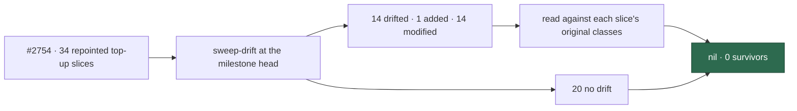

# 🔎 Security sweep — top-up slices, delta since their landing commits

**Issue:** [#2758](https://github.com/stSoftwareAU/VibeCoder/issues/2758) ·
**Parent:** #2722 (chunk 9 — top-up slices whose `sweptAt` could not be
resolved)

This is the delta record for the 34 top-up slices that
[#2754](https://github.com/stSoftwareAU/VibeCoder/issues/2754) repointed.
Before #2754 each of those slices stored a feature-branch `HEAD` that the
squash-merge had deleted. #2754 repointed each one to the `origin/main` commit
where its record landed. This record sweeps what changed in those slices'
modules after that landing commit.

Siblings:
[`security-sweep-2755-lib-delta-12a-12c.md`](security-sweep-2755-lib-delta-12a-12c.md),
[`security-sweep-2756-commands-setup-delta.md`](security-sweep-2756-commands-setup-delta.md)
and
[`security-sweep-2757-lib-delta-12d-12f.md`](security-sweep-2757-lib-delta-12d-12f.md)
(the other delta records in the same milestone).

> **Nil. No finding survived, so no issue was filed.** 14 of the 34 repointed
> slices drift, each by one module; 2496 also drifts by one added module. Every
> added module was read in full and every modified hunk was read against the
> classes its original top-up record used. The other 20 slices have no drift.



## Scope and method

```bash
git fetch origin main
deno run -A worker/deno/mod.ts sweep-drift
```

The command was run at `b2670603` on the
`milestone/2722-docs-audits-lib-sweep-cover-security-sweep-le` branch, after
#2754 merged. `git merge-base origin/main HEAD` was `3a38b85a`. None of the 14
drifted modules changed between that merge-base and the generation head. The
drift lies wholly before the merge-base, so moving `sweptAt` there clears it.

For a _modified_ module the hunks were read
(`git diff <sweptAt> HEAD -- <path>`), and the reading followed into the module
wherever a hunk touched a sink. The one _added_ module,
`held_issue_gate_comment.ts`, was read in full. Each module was read against
the classes its original top-up record used: subprocess and argv, filesystem
and path, untrusted GitHub ingestion, and environment, config and secret.

**Nothing was skipped.** Every module that `sweep-drift` reported for a
repointed slice has a triage line below.

Triage followed [`docs/SECURITY-SCAN.md`](../SECURITY-SCAN.md) Phase 3
(refute-unless-proven). A candidate only survives when a concrete
attacker-controlled input reaches a sink unsafely. None did.

### Already read by the scan

The #2722 scan had already read `masked_instructions.ts`,
`issue_executor_agents.ts`, `issue_executor_enforcement.ts` and
`agent_marker_neutralisation.ts`, and found nothing in them. The same
refute-unless-proven triage applied there. Two of those four files drift in a
repointed slice and were read again here, both nil:

- `issue_executor_agents.ts` (2342);
- `agent_marker_neutralisation.ts` (2236).

`issue_executor_enforcement.ts` (2344) has no drift. `masked_instructions.ts`
belongs to 2390, which #2754 did not repoint (see
[Out-of-scope drift](#out-of-scope-drift)).

## Findings

None. No duplicate search was needed because nothing survived.

## Repointed top-up slices

| Slice | Module                                                                                   | Drift              | Triage                                         |
| ----- | ---------------------------------------------------------------------------------------- | ------------------ | ---------------------------------------------- |
| 2098  | `lib/graft_context_config.ts`                                                            | no drift           | —                                              |
| 2099  | `lib/graft_context.ts`                                                                   | modified           | nil — [graft_context](#graft_context)           |
| 2100  | `lib/callback_run_mode.ts`                                                               | no drift           | —                                              |
| 2103  | `lib/pr_title_read.ts`                                                                   | no drift           | —                                              |
| 2154  | `lib/codegraph_context_config.ts`                                                        | no drift           | —                                              |
| 2155  | `lib/codegraph_context.ts`                                                               | modified           | nil — [codegraph](#codegraph)                  |
| 2159  | `lib/codegraph_run.ts`                                                                   | modified           | nil — [codegraph](#codegraph)                  |
| 2220  | `lib/milestone_branch_refusal_release.ts`                                                | no drift           | —                                              |
| 2236  | `lib/agent_marker_neutralisation.ts`                                                     | modified           | nil — doc comment only                         |
| 2242  | `lib/closure_verdict.ts`, `lib/closure_verdict_recovery.ts`                              | no drift           | —                                              |
| 2247  | `lib/ephemeral_build_cache.ts`                                                           | no drift           | —                                              |
| 2308  | `lib/conflict_stage_timer.ts`                                                            | no drift           | —                                              |
| 2310  | `lib/conflict_fallback_context.ts`                                                       | no drift           | —                                              |
| 2311  | `lib/milestone_fallback_flag.ts`                                                         | no drift           | —                                              |
| 2331  | `lib/stream_identity.ts`                                                                 | no drift           | —                                              |
| 2333  | `lib/stream_session.ts`                                                                  | modified           | nil — [stream machinery](#stream-machinery)    |
| 2334  | `lib/stream_lock.ts`                                                                     | modified           | nil — doc comment only                         |
| 2336  | `lib/stream_holder.ts`                                                                   | modified           | nil — [stream machinery](#stream-machinery)    |
| 2337  | `lib/stream_compaction.ts`                                                               | modified           | nil — [stream machinery](#stream-machinery)    |
| 2338  | `lib/milestone_close_housekeeping.ts`                                                    | no drift           | —                                              |
| 2342  | `lib/issue_executor_agents.ts`                                                           | modified           | nil — [issue executor](#issue-executor)        |
| 2343  | `lib/issue_executor_split_prompt.ts`                                                     | modified           | nil — constant prompt text only                |
| 2344  | `lib/issue_edit_guard_cli.ts`, `lib/issue_executor_enforcement.ts`                       | no drift           | —                                              |
| 2380  | `lib/rtk_output_config.ts`                                                               | modified           | nil — doc comment only                         |
| 2382  | `lib/rtk_output.ts`                                                                      | no drift           | —                                              |
| 2447  | `lib/budget_pacing.ts`                                                                   | no drift           | —                                              |
| 2459  | `lib/branch_conflict_pass.ts`                                                            | no drift           | —                                              |
| 2495  | `lib/apply_chain_promotions.ts`                                                          | no drift           | —                                              |
| 2496  | `lib/chain_root_comment.ts` (modified), `lib/held_issue_gate_comment.ts` (added)         | added and modified | nil — [held-issue gate](#held-issue-gate)      |
| 2569  | `lib/phase_accelerators.ts`                                                              | no drift           | —                                              |
| 2613  | `lib/provider_outage_alert.ts`                                                           | modified           | nil — [provider outage](#provider-outage)      |
| 2627  | `setup/codeowners_sync.ts`                                                               | no drift           | —                                              |
| 2628  | `setup/repo_settings_harden_sync.ts`                                                     | modified           | nil — [repo-settings hardening](#repo-settings-hardening) |
| 2727  | `lib/ci_human_gate_comment.ts`                                                           | no drift           | —                                              |

Paths are relative to `worker/deno/`.

## Refutations worth keeping

### graft_context

`graft_context.ts` (2099) gained the Graft MCP server definition, a query
counter and a fail-loud path for a 0-node build.

- `graftMcpServer(repoDir)` returns a fixed argv, `["mcp", repoDir]`, for the
  `graft` binary. It is an array with no shell, and it throws on an empty
  `repoDir`. `repoDir` is the worker-owned checkout, not a value a user
  controls.
- `GRAFT_MCP_TOOLS`, `GRAFT_MCP_SERVER_NAME` and `GRAFT_PROMPT_LINE` are
  constants. The prompt line sits outside the untrusted-content fences.
- `countGraftQueries` sums only finite numbers, and only for tools on the
  allowlist.
- A build that yields 0 nodes now fails through `fail()` instead of passing
  quietly. That narrows behaviour.

### codegraph

`codegraph_context.ts` (2155) builds `["serve", "--mcp", "--path", repoDir]` as
an argv array and throws on an empty `repoDir`. `codegraph_run.ts` (2159) now
passes the checkout through with `buildRun(result, repoDir ?? "")`, so an empty
value reaches that throw rather than a default path. No shell, no prompt text
and no new filesystem write.

### stream machinery

- `stream_session.ts` (2333) adds `preferredStreamProviderId()`, which resolves
  the repo pin, then the preferred provider, then the default, and warns on
  failure. `lookupStreamSession` gains a `foreign` status: a session another
  provider created is skipped, not deleted, and its id and creator are logged.
  The `streamKey` path check is unchanged and there is no new write path.
- `stream_holder.ts` (2336) adds a 900-second head start. The install-UUID
  regex is anchored and fixed-length, so there is no ReDoS. Markers are only
  trusted from `isFleetAuthor` authors. A forged future `atEpoch` falls back to
  the local 300-second grace, and `atEpoch` is clamped with
  `Math.max(0, floor)`. `gh` argv still goes through the injected runner.
- `stream_compaction.ts` (2337) skips and logs when the optional
  `sessionProviderId` differs from the provider. Both ids come from a
  worker-local file, and `/compact` is still a constant.
- `stream_lock.ts` (2334) changed only its doc comment (the #2530 priority
  tiers).

### issue executor

`issue_executor_agents.ts` (2342) adds `buildIssueReviewerAgents()`, which
defines a spec reviewer and a standards reviewer. Both run on sonnet with tools
`[Read, Grep, Glob]` and `disallowedTools: [Agent]`: read-only, with no
delegation. Their prompts are constants. `buildIssueRunAgents()` returns
`undefined` when both switches are off, and serialisation reuses the existing
`JSON.stringify` path into one argv element. `issue_executor_split_prompt.ts`
(2343) changed constant prompt text only.

### held-issue gate

`held_issue_gate_comment.ts` (2496, added) was read in full.

- Free-text parts go through allowlist sanitisers. `safeMilestone` allows
  `[A-Za-z0-9._/ -]` up to 120 characters, and `safeDetail` allows
  `[A-Za-z0-9._/-]` up to 60 characters. Every issue reference is rendered with
  `renderRef`, which uses `safeRepo`. PR numbers and counts are numbers, and
  the root reason is a typed enum.
- The marker `<!-- vibe-held-issue-gate key="…" -->` is built only from
  sanitised parts.
- `upsertHeldIssueGateComment` keeps only `isFleetAuthor` comments from
  `fetchMarkerComments`, so a forged marker from another author is ignored. It
  posts the body as one `-f body=` argument, or edits through
  `updateIssueComment`.
- `reportHeldIssueGate` deletes a legacy `CHAIN_ROOT_UNWORKABLE_MARKER` comment
  only when a fleet author wrote it. It collects delete errors and reports them
  rather than dropping them. It caches the outcome for 24 hours only once the
  thread is fully settled.

`chain_root_comment.ts` (2496, modified) lost its post path and its dedup
window, and now exports `renderRef` and `reasonSentence` for reuse. The legacy
marker constant stays only so old comments can be found and deleted. Removing
a write path narrows the surface.

### provider outage

`provider_outage_alert.ts` (2613) now makes `isProviderOutageAlertable` true for
authentication failures only. The body wording is constant, and redaction and
fencing are unchanged. That narrows behaviour.

### repo-settings hardening

`repo_settings_harden_sync.ts` (2628) adds the CodeQL default-setup and
default-branch-approval kinds, the Copilot code review mode, a dry run and
fleet accounts at write time.

- A dry run skips the CODEOWNERS writer and the audit-issue closer, and passes
  `apply: false`.
- `readLogin` reads `gh api user`. On failure it shows "an unknown login",
  which is display text only, and the setup login is then omitted.
- `orgOwnerLookup` filters logins with `isGitHubLogin` before they reach
  `orgs/${org}/memberships/${login}`, and checks `org` with
  `isValidRepoSlug(`${org}/x`)`. A 404 is skipped and any other error warns.
- `holdsAdmin(repo)` calls `repos/${repo}` only after `isValidRepoSlug` passes.
  It fails closed into the `needsAdmin` warning list and renders the slug with
  `renderInertRepoSlug`.

## Out-of-scope drift

The issue covers the 34 slices that #2754 repointed. At the generation head,
`sweep-drift` also reports drift in slices this issue does not cover. Those
slices resolve and were never repointed, so they are not in the table above:

- the chunk-12 and chunk-13 slices 12a, 12b, 12c, 12e, 13, 12q, 12s, 12t, 12v
  and 12x;
- 31 top-up slices: 12k, 12z, 12ac, 12ae, 1822, 1859, 1885, 1927, 1965, 2023,
  2030, 2070, 2107, 2189, 2276, 2279, 2314, 2319, 2341, 2390, 2438, 2493, 2562,
  2578, 2579, 2606, 2629, 2682, 2688 and 2701.

Their delta sweep is tracked separately. See the PR for #2758.

## Coverage ledger

The 14 drifted slices (2099, 2155, 2159, 2236, 2333, 2334, 2336, 2337, 2342,
2343, 2380, 2496, 2613 and 2628) now point at this file and carry
`sweptAt: 3a38b85a9de2531456c3e56784535903bf045ffa`. That is
`git merge-base origin/main HEAD` at list-generation time, following the rule in
`docs/SECURITY-SCAN.md` (#2178, #2754). It is not a branch commit, so the
`sweptAt` ancestry guard (`verifySweptAtsOnDefaultBranch`) accepts it while this
PR is open.

The 20 slices with no drift keep their own record and their #2754 landing
commit. At the PR head, `sweep-drift` reports no drift and no error for any of
the 34 repointed slices.
