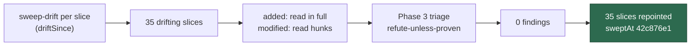

# 🔎 Security sweep — non-repointed top-up slices, delta since `sweptAt`

**Issue:** [#2839](https://github.com/stSoftwareAU/VibeCoder/issues/2839) ·
**Parent:** #2722 (follow-up to the #2758 delta record)

This is the delta record for the 35 top-up slices (and the chunk-12 slices that
carry top-up records) that
[#2754](https://github.com/stSoftwareAU/VibeCoder/issues/2754) did not repoint.
Their `sweptAt` commits resolve, but their modules drifted after them. The
[#2758](https://github.com/stSoftwareAU/VibeCoder/issues/2758) record listed
them as out-of-scope drift. This record sweeps what changed in each module after
its slice's `sweptAt`.

Siblings: the #2755, #2756, #2757 and #2758 delta records, in PR #2845 on the
`milestone/2722-docs-audits-lib-sweep-cover-security-sweep-le` branch. They
cover chunks 12a–12f, 13 and 14 and the 34 repointed top-up slices, so those
slices are not repeated here.

> **Result: nil.** All 35 slices were swept and every candidate was refuted. No
> finding survived, so no issue was filed.



## Scope and method

```bash
git fetch origin main
deno run -A worker/deno/mod.ts sweep-drift
```

The run head was `42c876e1` on `main`. `git merge-base origin/main HEAD` was
`42c876e1aa6f8df81177cc19ddb807dd7912bf63`, so the head is the merge-base.

On `main`, `sweep-drift` exits 1 before it reports. The #2754 top-up slices
still store feature-branch `HEAD`s that the squash-merge deleted (for example,
top-up-2220), and their repoint lives on the milestone branch. So the drift for
each slice in this record was computed separately, with the same library call
that `sweep-drift` makes: `driftSince(ledger, slice, onDisk, runGit)` from
`worker/deno/lib/lib_sweep_coverage.ts`, driven by `sweepGitRunnerFor` from
`worker/deno/commands/sweep_drift.ts`. Every slice in the table below resolved
cleanly that way.

For a _modified_ module the hunks were read
(`git diff <sweptAt> HEAD -- <path>`), and the reading followed into the module
wherever a hunk touched a sink. Every _added_ module was read in full. Each
module was read against the classes its original record used: subprocess and
argv, filesystem and path, untrusted GitHub ingestion, and environment, config
and secret.

Triage followed [`docs/SECURITY-SCAN.md`](../SECURITY-SCAN.md) Phase 3
(refute-unless-proven). A candidate only survives when a concrete
attacker-controlled input reaches a sink unsafely.

## Findings

None. No duplicate search was needed because nothing survived.

## Swept slices

| Slice       | Module                                                                                                                   | Drift    | Triage                                                        |
| ----------- | ------------------------------------------------------------------------------------------------------------------------ | -------- | ------------------------------------------------------------- |
| 12k         | `worker/deno/lib/claude_credential_pool.ts`                                                                              | modified | nil — [credential pool](#credential-pool)                     |
| 12q         | `worker/deno/lib/merge_conflict_agent.ts`                                                                                | modified | nil — [provider unavailable](#provider-unavailable)           |
| 12s         | `worker/deno/lib/milestone_rollback.ts`                                                                                  | modified | nil — [milestone rollback](#milestone-rollback)               |
| 12t         | `worker/deno/lib/pr_live_state.ts`                                                                                       | modified | nil — [PR live state](#pr-live-state)                         |
| 12v         | `worker/deno/lib/milestone_rollback_requeue.ts`                                                                          | modified | nil — [milestone rollback](#milestone-rollback)               |
| 12x         | `worker/deno/lib/agent_output.ts`, `worker/deno/lib/claude_output_adapter.ts`, `worker/deno/lib/codex_output_adapter.ts` | modified | nil — [provider unavailable](#provider-unavailable)           |
| 12z         | `worker/deno/lib/implementation_comments.ts`                                                                             | modified | nil — [implementation comments](#implementation-comments)     |
| 12ac        | `worker/deno/lib/ci_fix_attempt_markers.ts`                                                                              | modified | nil — [CI human gate](#ci-human-gate)                         |
| 12ae        | `worker/deno/lib/ci_fix_pr_markers.ts`                                                                                   | modified | nil — [CI human gate](#ci-human-gate)                         |
| top-up-1822 | `worker/deno/lib/workflow_file_checks.ts`                                                                                | modified | nil — [workflow file checks](#workflow-file-checks)           |
| top-up-1859 | `worker/deno/lib/changed_workflow_gate.ts`                                                                               | modified | nil — doc comment only                                        |
| top-up-1885 | `worker/deno/lib/claude_week_pace.ts`                                                                                    | added    | nil — [small pure modules](#small-pure-modules)               |
| top-up-1927 | `worker/deno/lib/subscription_soak_status.ts`                                                                            | added    | nil — [small pure modules](#small-pure-modules)               |
| top-up-1965 | `worker/deno/lib/milestone_gate_repair.ts`                                                                               | modified | nil — [provider unavailable](#provider-unavailable)           |
| top-up-2023 | `worker/deno/lib/milestone_conflict_ported.ts`                                                                           | added    | nil — [conflict ladder](#conflict-ladder)                     |
| top-up-2030 | `worker/deno/lib/milestone_sync_claim.ts`                                                                                | added    | nil — [conflict ladder](#conflict-ladder)                     |
| top-up-2070 | `worker/deno/commands/toolchain_selfcheck.ts`                                                                            | added    | nil — [small pure modules](#small-pure-modules)               |
| top-up-2107 | `worker/deno/lib/host_failure_hook.ts`                                                                                   | modified | nil — [host failure hook](#host-failure-hook)                 |
| top-up-2189 | `worker/deno/lib/summary_rule_gate_retry.ts`                                                                             | modified | nil — [summary rule gate](#summary-rule-gate)                 |
| top-up-2276 | `worker/deno/lib/conflict_verdict_ladder.ts`                                                                             | added    | nil — [conflict ladder](#conflict-ladder)                     |
| top-up-2279 | `worker/deno/lib/conflict_rebase_rung.ts`                                                                                | added    | nil — [conflict ladder](#conflict-ladder)                     |
| top-up-2314 | `worker/deno/lib/graft_run.ts`                                                                                           | modified | nil — constant prompt line moved first                        |
| top-up-2319 | `worker/deno/lib/plan_coverage_repair.ts`                                                                                | added    | nil — [plan coverage repair](#plan-coverage-repair)           |
| top-up-2341 | `worker/deno/lib/issue_executor_split.ts`                                                                                | added    | nil — [small pure modules](#small-pure-modules)               |
| top-up-2390 | `worker/deno/lib/masked_instructions.ts`                                                                                 | added    | nil — [masked instructions](#masked-instructions)             |
| top-up-2438 | `worker/deno/lib/milestone_pr_reviewers.ts`                                                                              | added    | nil — [small pure modules](#small-pure-modules)               |
| top-up-2493 | `worker/deno/lib/dependency_chain_promotion.ts`                                                                          | added    | nil — [small pure modules](#small-pure-modules)               |
| top-up-2562 | `worker/deno/lib/degraded_delivery.ts`                                                                                   | added    | nil — [degraded delivery](#degraded-delivery)                 |
| top-up-2578 | `worker/deno/lib/workflow_cost_scanner.ts`                                                                               | added    | nil — [cost scanners](#cost-scanners)                         |
| top-up-2579 | `worker/deno/lib/cfn_cost_checks.ts`                                                                                     | added    | nil — [cost scanners](#cost-scanners)                         |
| top-up-2606 | `worker/deno/lib/codeowners.ts`                                                                                          | added    | nil — [small pure modules](#small-pure-modules)               |
| top-up-2629 | `worker/deno/setup/repo_settings_audit_close.ts`                                                                         | added    | nil — [repo settings audit close](#repo-settings-audit-close) |
| top-up-2682 | `worker/deno/lib/prompt_too_long.ts`                                                                                     | added    | nil — [small pure modules](#small-pure-modules)               |
| top-up-2688 | `worker/deno/lib/planning_handoff.ts`, `worker/deno/lib/planning_handoff_trust.ts`                                       | added    | nil — [planning hand-off](#planning-hand-off)                 |
| top-up-2701 | `worker/deno/setup/copilot_review_setup.ts`                                                                              | added    | nil — [small pure modules](#small-pure-modules)               |

## Refutations worth keeping

### credential pool

`claude_credential_pool.ts` (12k) adds `selectAvailable({exclude?, now?})`,
`readPoolBudgets(now)` and the pure `hasBudgetLeft` (#2637, #2647).

- `hasBudgetLeft` returns false for an unknown budget, so an unreadable pool
  entry is never picked as available.
- Selection filters by label and ranks with the existing `rankPool`. It returns
  a pool entry or `null`, and `readPoolBudgets` returns `null` below two
  candidates.
- No new subprocess, no new filesystem write, and no token reaches a log line.

### provider unavailable

The #2613 and #2633 provider-outage work spans four modules.

- `agent_output.ts` (12x) adds `PROVIDER_UNAVAILABLE_CATEGORIES`,
  `isProviderUnavailableFailure` and `BALANCE_EXHAUSTED_RE`. The regex is a set
  of anchored literal alternatives, so there is no ReDoS. `HTTP_STATUS_RE` now
  also matches 402. A spoofed balance line in agent output is only read when the
  process already exited non-zero, and it changes the headline and category
  only. It gains no privilege and skips no gate.
- `claude_output_adapter.ts` (12x) passes a constant provider name to
  `classifyClaudeFailure`, picks the headline with `quotaHeadline`, and adds
  `DEEPSEEK_OUTPUT_ADAPTER` with the constant id `deepseek`.
  `codex_output_adapter.ts` (12x) matches `BALANCE_EXHAUSTED_RE` on stderr and
  emits a constant message.
- `merge_conflict_agent.ts` (12q) drops `qualityInstructions` and sets
  `providerUnavailable` only on a non-zero exit that is a usage limit or matches
  `isProviderUnavailableFailure`. Such a run is reported, not judged. The reply
  reader now passes its logger to `readPrResponseMessage` (#2236).
- `milestone_gate_repair.ts` (top-up-1965) stops a repair round when
  `providerUnavailable` is set. The message only reaches a worker-log stop
  reason.

### milestone rollback

- `milestone_rollback.ts` (12s) adds an `isStaleInfoPush` message branch. It
  interpolates the same `raised.error.message` the old branch already did.
- `milestone_rollback_requeue.ts` (12v) removes the `needs-human` label write
  and `alreadyEscalated` (#2311), which narrows the surface. `flagIssue` renders
  `#${n}` only when `n > 0`, and the comment body still travels as one `--body`
  argv element.

### PR live state

`pr_live_state.ts` (12t) adds the `PR_LIVE_STATE_JSON_FIELDS` constant, and
`isPrLiveStateRead` now needs an exact `--json` match (#2307, #2462, #2702).
Field parsing moved to `parsePrLiveFields` in `pr_branch_update.ts`. `armed`,
`behind` and `changesRequested` are optional and act only when explicitly
`true`, so an unknown state is never read as permission to proceed.

### implementation comments

`implementation_comments.ts` (12z) now runs `collectCommentSecurityAudits` over
every candidate comment rather than only the budget-capped selection (#2243).
That widens detection. Trust annotation is unchanged.

### CI human gate

`ci_fix_attempt_markers.ts` (12ac) adds the
`<!-- vibe-ci-human-gate check="…" head="…" -->` marker (#2727).

- `buildCiHumanGateMarker` passes the check name through `sanitiseCheckName`,
  which flattens control characters, strips `"`, `'`, `<` and `>`, collapses
  whitespace and truncates to 120 characters. It throws unless `head` matches
  the anchored `^[0-9a-f]{40}$`.
- `parseCiHumanGateMarkers` skips a marker with a malformed head. Its regex has
  the same lazy shape, up to `-->`, as the existing markers.
- `collectFleetCiFixMarkers` reads fleet-author comments only, so a forged
  marker parks nothing. `isHumanGateParkedAt` also needs an exact head match.
- `restampHumanGateMarker` replaces the old marker with a worker-built one.
  `truncateWholeCharacters` and `flattenControlCharacters` are now exported
  without a behaviour change.

`ci_fix_pr_markers.ts` (12ae) makes `findParkedChecks` return
`{deferrals, markers}`, and `findOpenDeferrals` becomes a wrapper (#2744). A
failed comment read returns `emptyMarkers()`, which now includes `humanGates`,
so it still fails towards scanning.

### workflow file checks

`workflow_file_checks.ts` (top-up-1822) adds `fromPerFileScanner`, which maps
per-file findings back to one finding per step through
`persistCredentialsStepId` and `artifactUploadStepId` (#2221). It is pure data
mapping and keeps the gate strict.

### host failure hook

`host_failure_hook.ts` (top-up-2107) adds `workerVersion` and `workerCommit` to
the hook document, and exports them as `VIBECODER_WORKER_VERSION` and
`VIBECODER_WORKER_COMMIT` (#2444). Both come from `workerBuildFacts()`, which
reads `deno.json` and the environment through an injected git runner and omits a
fact it cannot read. They are non-secret build facts, and `put()` skips
`undefined`.

### summary rule gate

`summary_rule_gate_retry.ts` (top-up-2189) renders closure blocks with
`renderClosureBlocksFromVerdict`, then commits them through
`commitRecoveredSummary` (#2242). That calls `deps.git.reconcileHeadToBranch`
and `deps.git.commitAndPushPending` with a constant message holding the numeric
issue number, and uses `resolvePreFlightSpec`, so the pre-flight safety checks
still run. Failures are logged at error level rather than dropped. The prompt
text change is constant.

### small pure modules

- `toolchain_selfcheck.ts` (top-up-2070, added) takes `base-dir` from the
  operator's command line, strips trailing slashes and defaults to `Deno.cwd()`.
  It delegates to `checkContainerToolchains` and exits 1 when the check was
  skipped, otherwise with `TOOLCHAIN_SELFCHECK_EXIT_STATUS`. It spawns nothing
  and writes nothing itself.
- `issue_executor_split.ts` (top-up-2341, added) is a pure boolean resolver that
  is on only for the `issue` phase. A non-boolean repo value warns with its
  `typeof` only and falls back to the host value, which defaults to `false`.
- `codeowners.ts` (top-up-2606, added) validates every owner with the anchored
  `OWNER_RE` and throws with the line number on an invalid one. Its recursive
  `*` and `**` matcher is marked `SIMPLE-ON-PURPOSE`. Its inputs are the repo's
  own `CODEOWNERS` file and worker-chosen paths, so no attacker controls a
  backtracking input. It is pure: no filesystem and no subprocess.
- `claude_week_pace.ts` (top-up-1885, added) reads `CLAUDE_CODE_OAUTH_TOKEN` and
  passes it only to `probeClaudeTokenBudget`. The result is cached in memory
  only, errors log `error.name` only, and an unknown verdict leaves every tier
  eligible.
- `subscription_soak_status.ts` (top-up-1927, added) is pure status maths.
- `milestone_pr_reviewers.ts` (top-up-2438, added) checks `repo` against
  `REPO_PATTERN`, needs a positive integer PR number, and checks every reviewer
  against `NAME_PATTERN` before sending it as a `-f reviewers[]=` argv element.
- `dependency_chain_promotion.ts` (top-up-2493, added) is pure. Its BFS keeps a
  `visited` set, an unmonitored repo becomes an unworkable root, and
  `needs-human`, a human assignee or a missing discovery label blocks promotion.
  Its output stays in memory.
- `prompt_too_long.ts` (top-up-2682, added) runs `/prompt is too long/i` over at
  most 500 characters. `discardResumedSession` fails loud and `pathExists`
  rethrows everything except `NotFound`. The reason reaches GitHub through
  `label_failure.ts`, which applies `redactSecrets`.
- `copilot_review_setup.ts` (top-up-2701, added) is interactive setup only. The
  answer is allowlisted against `COPILOT_CODE_REVIEW_MODES`, it gives up after
  five attempts, and it writes only through `config_writer`.

### conflict ladder

The #2023, #2030, #2276 and #2279 git rungs all run git as argv through an
injected runner, never through a shell.

- `milestone_conflict_ported.ts` (top-up-2023, added) calls `assertSafeGitRef`
  and `assertSafeRefComponent`, then runs `ls-files -u`,
  `log --find-object --end-of-options`, `checkout --ours|--theirs --` and
  `add --`. An unknown or quoted path stays undecided, which fails safe. Logs
  show eight SHA characters only.
- `milestone_sync_claim.ts` (top-up-2030, added) calls `assertSafeGitRef` and
  claims with `commit-tree` then `push --force-with-lease`. Any failure returns
  `{kind: "unknown"}`.
- `conflict_verdict_ladder.ts` (top-up-2276, added) is pure and is fed trusted
  comments only, through `partitionConflictComments` in
  `pr_merge_conflict_processor.ts`. SHAs must pass `isConflictHeadSha` (7–40
  hex), the rung is allowlisted, the log is sliced to 200 characters, and
  `decideLadderRung` throws on a bad head.
- `conflict_rebase_rung.ts` (top-up-2279, added) builds its rebase and push argv
  through `assertSafeGitRef`, validates `oldHead` and checks `head-moved` first.
  The squash is `commit-tree oldHead^{tree}` behind a `diff --quiet` guard, and
  the push uses `--force-with-lease=branch:oldHead`. A refused push resets hard
  and returns `push-refused`; any other failure aborts or resets, then throws.

### planning hand-off

- `planning_handoff_trust.ts` (top-up-2688, added) accepts a hand-off only when
  the latest `planning` label was added by a worker login, the earlier `work-on`
  label was added by a non-worker allowed author, and `work-on` was not removed
  afterwards. Logins compare case-insensitively and missing data fails closed.
  It is pure.
- `planning_handoff.ts` (top-up-2688, added) parses its marker with a lazy regex
  bounded by `-->` and caps the reason at 500 characters.
  `assertWorkerCanHandOffToPlanning` runs first. The reason passes through
  `redactSecrets` and `neutraliseAgentMarkers`, and the published snippet is
  `redactSecrets(...).slice(-3000)`. A forged marker can only suppress a
  hand-off, which fails safe.

### plan coverage repair

`plan_coverage_repair.ts` (top-up-2319, added) fences issue bodies with
`createPromptDelimiters`, `sanitiseDelimiterPatterns` and `codeFenceFor`, and
caps each sub-issue body at 4,000 characters. `cell()` collapses whitespace,
turns `|` into `/` and defuses `@` mentions. The planning agent already posts
its own `## Plan Coverage` table (`prompts/planning_critique/prompt.md`), so the
repair adds no capability. It skips on a failed read or a passed deadline, and
`runPlanCoverageGate` re-checks the repaired table.

### masked instructions

`masked_instructions.ts` (top-up-2390, added) is pure detection. It scans at
most 262,144 characters and quotes at most 160 characters per line, with
backticks replaced by `'`, for at most five questions. The questions are posted
through `postClarifyingQuestions`, which applies `validateClarifyingQuestions`
and `redactSecrets` on the same route as the model's own clarifying questions.
It only echoes an issue's own text back onto that issue, and
`maskedQuestionAnswered` trusts `githubUser` markers only.

### degraded delivery

`degraded_delivery.ts` (top-up-2562, added) splits into the pure
`assessDegradedDelivery` and `fileDegradedFollowUp`. The latter runs
`gh issue create` as argv, adds its label through
`guardedLabelArgs([IDLE_TASK_LABEL], …)`, dedups through `fileFindingOnce` on a
`<!-- finding-id: degraded-follow-up-N -->` marker, and slices the title to 250
characters. The body echoes the parent issue's own title and accepted-scope
criteria. That parent was already trusted for work, so nothing escalates. Errors
return `{ok: false}` to its only caller, `lib/phases/completion_phase.ts`.

### cost scanners

- `workflow_cost_scanner.ts` (top-up-2578, added) is pure over parsed workflow
  files and does no I/O. Its output becomes the `{{COST_CANDIDATES}}` leads in
  the GitHub Actions audit prompt (`github_actions_audit_template.ts`, wrapped
  in try/warn). Its input is the monitored repo's own workflows, which the agent
  reads anyway. The build-script regex `[\w./-]*(?:build|…)[\w.-]*\.sh` is at
  worst quadratic, not exponential, over repo-owned text.
- `cfn_cost_checks.ts` (top-up-2579, added) is read-only. Its walk skips
  dot-directories, `node_modules`, `cdk.out`, `target` and `vendor`, stops at
  500 files and 1 MB per file, and parses inside a try. Its regex is linear. An
  unreadable file is skipped by an empty catch, which is acceptable for an
  advisory best-effort scan.

### repo settings audit close

`repo_settings_audit_close.ts` (top-up-2629, added) closes a repo-settings audit
issue only when every one of these holds:

- hardening was not aborted and the finding kind was applied cleanly;
- the fleet-login list is non-empty and the issue author is a fleet login
  (case-insensitive);
- the finding id parses through `parseRepoSettingsFindingId`;
- the post-hardening `scanRepoSettings` re-scan had no lookup failures and no
  longer reports that id;
- the positive checks pass: secret scanning is on, `CODEOWNERS` exists, and
  `allowed_actions` is `"selected"`.

It comments before it closes. A JSON parse failure in `recordingGh` leaves the
positive checks false, which fails safe, and any other error warns and leaves
the issue open. Its callers are `setup_cli.ts` and
`repo_settings_harden_sync.ts`.

## Coverage ledger

All 35 slices in the table above now point `ledger` at this record, with
`sweptAt: 42c876e1aa6f8df81177cc19ddb807dd7912bf63`, as
[`docs/SECURITY-SCAN.md`](../SECURITY-SCAN.md) requires (#2178, #2754).
