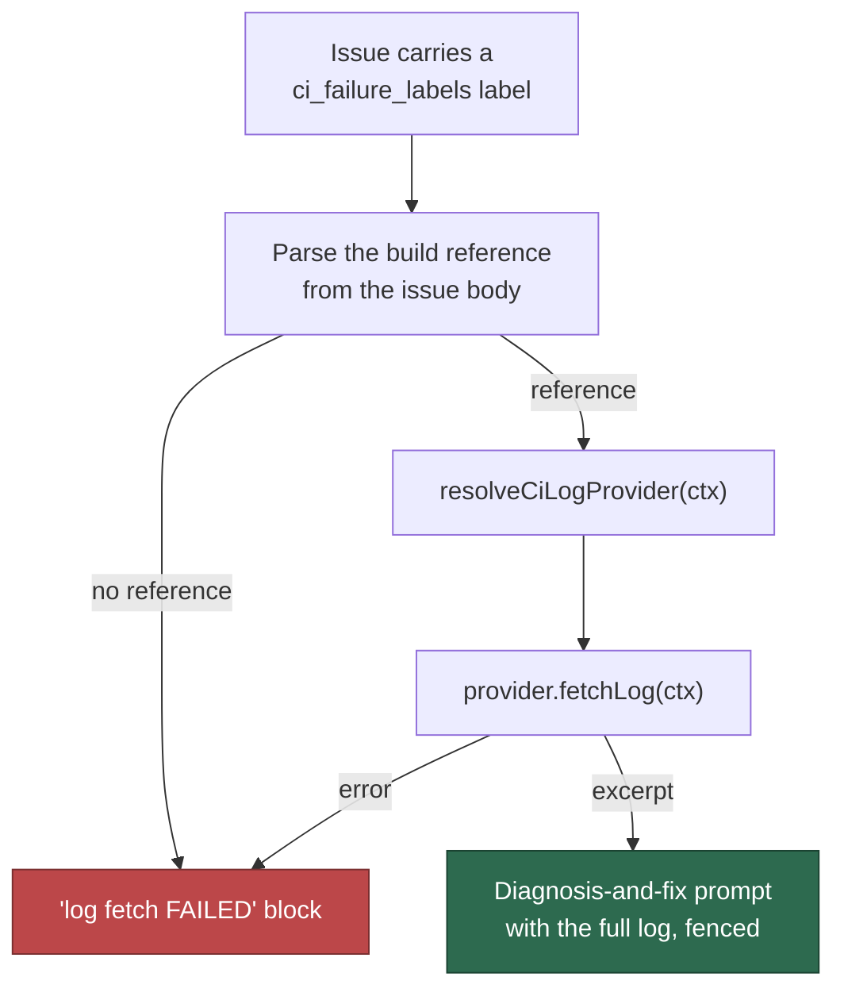

# 🧾 CI-failure Issue Log Fetch

When a build fails, a watcher workflow can open a GitHub issue about it. The
issue body carries a small pre-summary of the console log — whatever window
the summariser happened to capture — and the normal issue flow had no
CI-failure awareness at all, so the worker attempted a fix from that alone.

This feature closes the gap. An issue carrying one of the repository's
configured CI-failure labels is routed to a **diagnosis-and-fix** framing, and
the **full** console log for the referenced build is fetched first, through the
repository's configured [CI log provider](EXTENDING.md#-adding-a-ci-log-provider).

> **Core fetches nothing itself.** It parses the build reference out of the
> issue body and hands it to a provider. GitHub Actions is the built-in
> default, because it is the CI this project runs on. Any other CI system is
> a [private extension](PRIVATE-EXTENSIONS.md) that registers its own provider
> — nothing about it appears in this repository (Issue #986).

## 🔁 Flow



A fetch that fails renders an explicit **"log fetch FAILED"** block naming the
reason. The run is told not to attempt a fix on no evidence and not to treat
the body's pre-summary as a substitute. Absence of a log is never silently
degraded into "nothing to see".

## 🏷️ The issue body contract

Two machine-readable header lines are recognised, anywhere in the first 64 KiB
of the body:

```markdown
- **Build number:** `4347`
- **Build URL:** https://ci.example.com/job/Migration/job/Develop/4347/
```

The **Build URL** is preferred — a provider can usually derive its whole target
from it. The **Build number** is the fallback, and then the provider's target
comes from configuration (see `ci_failure_job_path` below).

## 🔒 Trust boundary

The issue body is untrusted input: anyone who can open an issue writes it.
Core checks the URL's **shape** and nothing more —

- it must parse as an absolute `http(s)` URL,
- it must not carry embedded credentials (`user:pass@`),
- it must end in a numeric build segment; a moving alias such as `lastBuild`
  is refused.

Core deliberately does **not** check the URL against a configured CI origin.
It cannot: core does not know what CI a deployment runs, so it cannot know
which origin is legitimate. The check moved to where the knowledge is:

- **core never fetches the URL.** It is handed to the provider as
  `ctx.targetUrl`.
- **the provider derives its target from its own configured base**, and
  returns in `CiLogExcerpt.url` only a URL it constructed itself. That is a
  written contract on `CiLogProvider.fetchLog`, and the built-in GitHub
  Actions provider honours it by rebuilding the run URL against `github.com`
  for the repository it was asked about.

The fetched log is then **redacted**, **scrubbed of delimiter-like patterns**
and **fenced inside the run's untrusted boundary** before it reaches the model
(Issues #3639, #3646, #3648). The worker-authored diagnosis framing stays
outside that fence — it is instruction, not data.

## ⚙️ Configuration

Both keys live under `repo_config.<owner>/<repo>` in `.config.json`.

| Key | Type | Required | Meaning |
| --- | --- | --- | --- |
| `ci_failure_labels` | string[] | yes (to enable) | Issue labels that mark a CI-failure report. Omit or leave empty to disable. Matched per label, case-insensitively, after trimming. |
| `ci_failure_job_path` | string | no | Fallback target handed to the provider when the body carries a build number but no `Build URL`. Used only when the repository's `ciProviders` entry names no `jobPath` of its own. Opaque to core. |

```json
{
  "repo_config": {
    "example-org/example-repo": {
      "ci_failure_labels": ["develop-build-failure"],
      "ci_failure_job_path": "Migration/job/Develop",
      "ciProviders": [{ "provider": "my-ci", "jobPath": "Migration/job/Develop" }]
    }
  }
}
```

A malformed `ci_failure_labels` value (not an array, a non-string entry, or an
empty label) is rejected with a named-field error at config load. A malformed
`ciProviders` value is logged and ignored on this path, so a configuration
typo degrades the log fetch rather than aborting the run.

## 🧩 Implementation

- `worker/deno/lib/ci_failure_issue.ts` — label detection, build-reference
  parsing, provider dispatch, and prompt-section rendering.
- `worker/deno/lib/ci_log_provider.ts` — the provider registry and the
  `fetchLog` contract.
- `worker/deno/lib/execute_claude_phase.ts` — the call site, which supplies the
  repository's configured providers.

## 📚 Related

- [Adding a CI Log Provider](EXTENDING.md#-adding-a-ci-log-provider)
- [Private Extensions](PRIVATE-EXTENSIONS.md)
- [Configuration](CONFIGURATION.md)
