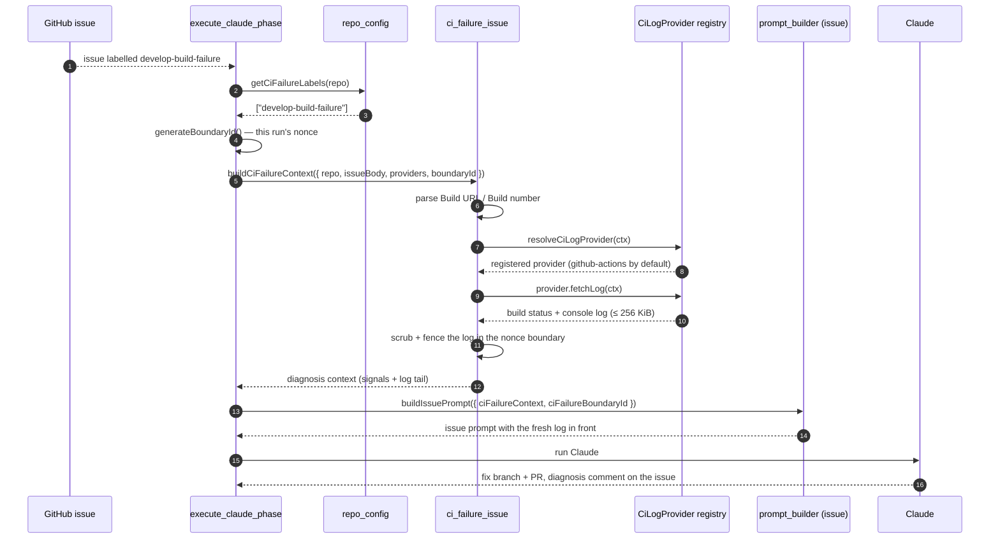

# 🔎 CI-failure issues — automatic root-cause log fetch

A watcher workflow polls a build pipeline and, on failure, opens a GitHub
issue labelled (say) `develop-build-failure` containing a small pre-summary
of the console log.

The worker used to pick that issue up through the **normal issue flow**,
which had no CI-failure awareness at all: the CI log providers only run
against a *PR* with *failing checks*, and a pipeline-failure issue has
neither. So the fix was attempted from whatever window the summariser
happened to capture — and when the root cause sat outside that window,
there was no way to go back for more. Detection worked; diagnosis was
blind.

 closes that gap. When an issue carries one of the repo's
configured CI-failure labels, the worker parses the build reference out of
the issue body, fetches the **full** console log for that build, and routes
to a diagnosis-and-fix framing before the prompt is built.

## End-to-end flow



## Parsing contract

`develop-build-watch.yml` writes a stable, machine-readable header:

```markdown
- **Build number:** `4347`
- **Build URL:** https://github.com/owner/repo/actions/runs/4347
```

`parseCiFailureBuildReference()` in `worker/deno/lib/ci_failure_issue.ts`
reads it with these rules:

- The **Build URL is authoritative** — the provider reads its own build id
  out of it. The **Build number is the fallback**, used only when no URL is
  present.
- The last purely numeric path segment is reported as the build number, for
  the prompt header only. Which id a provider actually fetches by is the
  provider's decision, not core's.
- Only the first 64 KiB of the body is scanned; the header is written at the
  top.

**The watcher workflow's body format must not change without updating this
parser.**

## The build URL is untrusted, and is never dereferenced

The issue body is attacker-influenceable, so the `Build URL` it carries is
treated as data all the way through:

- Core checks only what it can check without knowing the CI vendor: the URL
  must parse and name an `http:` or `https:` scheme. Anything else is
  rejected outright.
- Core then hands the URL to the resolved provider as `targetUrl` and
  **never fetches it**. The built-in GitHub Actions provider reads run and
  job ids out of the path and fetches through the worker's authenticated
  `gh` client, scoped to the issue's own repository — so a foreign origin in
  the body cannot cause a request to that origin.
- A provider supplied by a private extension inherits the same contract,
  stated on `CiFailureContext.targetUrl`: validate it before dereferencing
  it.

## The console log is untrusted data

The console log is the one component sourced from outside the repository
entirely — anyone who can print to stdout during a build (a fork PR, a test
fixture, a dependency) can put text in it. gives it the same
control every other untrusted string receives:

- the log tail, the matched failure signals, and any fetch-failure reason are
  scrubbed with `sanitiseDelimiterPatterns()`, so forged boundary markup
  (`---END UNTRUSTED …`, `<<<…>>>`, `[TRUSTED]`, `author=`) is rendered inert;
- they are wrapped in the run's randomised untrusted boundary, whose nonce is
  generated by `execute_claude_phase` and handed to **both**
  `buildCiFailureContext()` and `buildIssuePrompt()` — so
  `buildBoundaryIntegrityInstruction()` names the very boundary that fences
  the log; and
- the CI-failure section is emitted **above** that integrity instruction.

 closes the remaining structural gap inside that boundary. The
markdown code fence around each excerpt is sized by `codeFenceFor()` — always
one backtick longer than the longest backtick run in the content — so a build
step printing a bare ` ``` ` line can no longer close the fence early and have
the rest of the log render as markdown structure (headings, emphasis,
instruction-shaped prose) instead of inert code.

The worker-authored diagnosis framing (the classification categories, the
`fetched build #N` marker, the instruction to comment on the issue) stays
**outside** the fence: it is trusted task instruction, not data. Only the
fetched bytes sit inside.

## Failing loud

The log fetch never degrades quietly. Whenever the reference cannot be
parsed, no provider can resolve the build, or the provider returns an error
or an empty excerpt, the prompt receives an explicit **"log fetch FAILED"**
block that:

- quotes the reason,
- forbids attempting a fix on no evidence, and
- instructs the run to say so plainly in a comment on the issue.

On success the context contains the literal line `fetched build #N`, and the
run is instructed to repeat it in its issue comment. That line is the
behavioural regression marker: a missing `fetched build #N` in the comment
means the path did not fire and the run fell back to the pre-summary alone.

## Configuration

Both keys live under `repo_config.<owner>/<repo>` in the worker's
`.config.json` and accept snake_case or camelCase.

| Key | Type | Required | Description |
|-----|------|----------|-------------|
| `ci_failure_labels` | string[] | yes (to enable) | Issue labels that mark a CI-failure report. Omit or leave empty to disable. Matched per label, case-insensitively. |
| `ci_providers` | array | no | The CI log providers consulted for the fetch, in order. GitHub Actions is the built-in default and needs no entry; see [per-repository PR failure actions](per-repo-pr-failure-actions.md). |

Any credentials a provider needs are the provider's own concern and come
from the worker environment, never from repository configuration.

### Worked example

```jsonc
{
  "repo_config": {
    "stSoftwareAU/private-repo-12": {
      "ci_failure_labels": ["develop-build-failure"]
    }
  }
}
```

A malformed `ci_failure_labels` value (not an array, a non-string entry, or
a blank label) throws at config load rather than silently disabling the
feature.

## Related

- [Per-repository PR failure actions](per-repo-pr-failure-actions.md) — the
  PR-side counterpart that enriches the `ci_fix` prompt.
- [Private extensions](PRIVATE-EXTENSIONS.md) — where a provider for one
  deployment's own CI system lives.
- `worker/deno/lib/ci_log_provider.ts` — the provider registry both paths
  resolve through.
