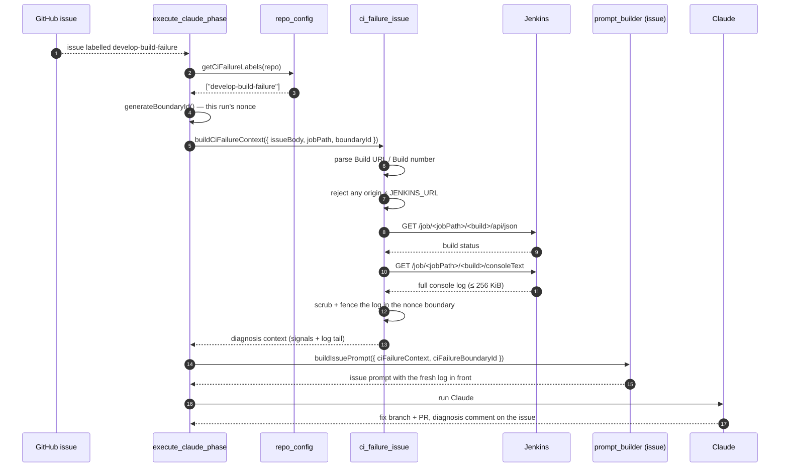

# 🔎 CI-failure issues — automatic root-cause log fetch

A watcher workflow such as private-repo-12's
`.github/workflows/develop-build-watch.yml` polls the Jenkins Develop
pipeline and, on `FAILURE`/`UNSTABLE`/`ABORTED`, opens a GitHub issue
labelled `develop-build-failure` containing a small pre-summary of the
console log.

The worker used to pick that issue up through the **normal issue flow**,
which had no CI-failure awareness at all: `prFailureActions` only runs
against a *PR* with *failing checks*, and a pipeline-failure issue has
neither. So the fix was attempted from whatever window the summariser
happened to capture — and when the root cause sat outside that window,
there was no way to go back for more. Detection worked; diagnosis was
blind.

Issue #3581 closes that gap. When an issue carries one of the repo's
configured CI-failure labels, the worker parses the build reference out of
the issue body, fetches the **full** console log for that build, and routes
to a diagnosis-and-fix framing before the prompt is built.

## End-to-end flow



## Parsing contract

`develop-build-watch.yml` writes a stable, machine-readable header:

```markdown
- **Build number:** `4347`
- **Build URL:** https://jenkins.example.com/job/Migration/job/Develop/4347/
```

`parseCiFailureBuildReference()` in `worker/deno/lib/ci_failure_issue.ts`
reads it with these rules:

- The **Build URL is authoritative** — it carries the job path as well as
  the build number. The **Build number is the fallback**, used only when no
  URL is present.
- A build-number-only body needs a `ci_failure_job_path` in the repo's
  configuration; without one the fetch cannot be addressed and the run is
  told so explicitly.
- The trailing numeric path segment is the build number. A build alias such
  as `lastBuild` is rejected — the issue names a specific build.
- Only the first 64 KiB of the body is scanned; the header is written at the
  top.

**The watcher workflow's body format must not change without updating this
parser.**

## Origin allowlist

The issue body is untrusted input, so a `Build URL` is honoured only when it
passes every check below — otherwise it is **rejected outright** rather than
fetched:

- The URL parses and uses `http:` or `https:`.
- Its origin (scheme, host **and** port) equals the configured `JENKINS_URL`
  origin.
- When `JENKINS_URL` carries a path prefix (e.g.
  `https://ci.example.com/jenkins`), the URL's path sits under that prefix.

A foreign-origin URL is never fetched, and the build number is **not**
silently used instead — a mismatched host signals tampering, so the whole
reference is refused.

## The console log is untrusted data

The console log is the one component sourced from outside the repository
entirely — anyone who can print to stdout during a build (a fork PR, a test
fixture, a dependency) can put text in it. Issue #3639 gives it the same
control every other untrusted string receives:

- the log tail, the matched failure signals, and any fetch-failure reason are
  scrubbed with `sanitiseDelimiterPatterns()`, so forged boundary markup
  (`---END UNTRUSTED …`, `<<<…>>>`, `[TRUSTED]`, `author=`) is rendered inert;
- they are wrapped in the run's randomised untrusted boundary, whose nonce is
  generated by `execute_claude_phase` and handed to **both**
  `buildCiFailureContext()` and `buildIssuePrompt()` — so
  `buildBoundaryIntegrityInstruction()` names the very boundary that fences
  the log; and
- the CI-failure section is emitted **above** that integrity instruction.

Issue #3646 closes the remaining structural gap inside that boundary. The
markdown code fence around each excerpt is sized by `codeFenceFor()` — always
one backtick longer than the longest backtick run in the content — so a build
step printing a bare ` ``` ` line can no longer close the fence early and have
the rest of the log render as markdown structure (headings, emphasis,
instruction-shaped prose) instead of inert code.

The worker-authored diagnosis framing (the classification categories, the
`fetched build #N` marker, the instruction to comment on the issue) stays
**outside** the fence: it is trusted task instruction, not data. Only the
fetched bytes sit inside.

## Failing loud

The log fetch never degrades quietly. Whenever the reference cannot be
parsed, the origin check fails, no job path is available, or Jenkins returns
an error, the prompt receives an explicit **"log fetch FAILED"** block that:

- quotes the reason,
- forbids attempting a fix on no evidence, and
- instructs the run to say so plainly in a comment on the issue.

On success the context contains the literal line `fetched build #N`, and the
run is instructed to repeat it in its issue comment. That line is the
behavioural regression marker: a missing `fetched build #N` in the comment
means the path did not fire and the run fell back to the pre-summary alone.

## Configuration

Both keys live under `repo_config.<owner>/<repo>` in the worker's
`.config.json` and accept snake_case or camelCase.

| Key | Type | Required | Description |
|-----|------|----------|-------------|
| `ci_failure_labels` | string[] | yes (to enable) | Issue labels that mark a CI-failure report. Omit or leave empty to disable. Matched per label, case-insensitively. |
| `ci_failure_job_path` | string | no | Fallback Jenkins job path (e.g. `Migration/job/Develop`) used when the body carries a build number but no `Build URL`. |

Jenkins credentials come from the environment only — `JENKINS_URL`,
`JENKINS_USER`, `JENKINS_TOKEN` — exactly as for
[per-repository PR failure actions](per-repo-pr-failure-actions.md). The
token is never echoed into logs, errors, or the prompt.

### Worked example

```jsonc
{
  "repo_config": {
    "stSoftwareAU/private-repo-12": {
      "ci_failure_labels": ["develop-build-failure"],
      "ci_failure_job_path": "Migration/job/Develop"
    }
  }
}
```

A malformed `ci_failure_labels` value (not an array, a non-string entry, or
a blank label) throws at config load rather than silently disabling the
feature.

## Related

- [Per-repository PR failure actions](per-repo-pr-failure-actions.md) — the
  PR-side counterpart that enriches the `ci_fix` prompt.
- `worker/deno/lib/jenkins_log_fetcher.ts` — the shared Jenkins HTTP client.
