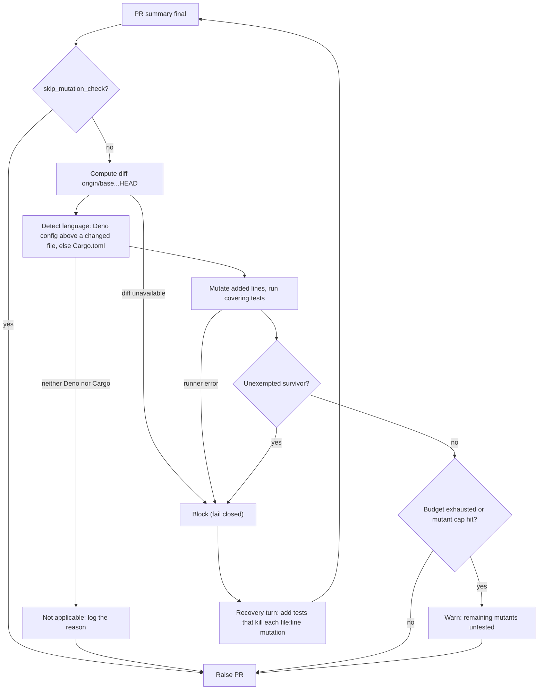

# Diff-scoped mutation check

The mutation check is a PR-raise gate (Issue #3393). It mutates only the lines
a pull request adds or changes, re-runs the tests that cover them, and blocks
the PR when a mutation survives, that is, when the suite stays green although
the behaviour was changed on purpose.

## Why line coverage is not enough

A test can execute a line without asserting on it. Line coverage and the
`Branch outcomes:` list in the Test Plan both rest on the agent's own
account of which test reaches which line. A mutation check measures the
outcome instead: flip the line, run the tests, and see whether anything goes
red. A survivor is concrete evidence that no test pins that behaviour.

## Flow

The gate runs in the issue-run completion phase, after the PR summary is
final and before the PR is raised. It joins the other late summary gates (docs
sweep, removed assertions, placeholders, branch outcomes, claim check) and
feeds the same single recovery turn.



The recovery turn is told each surviving `file:line` and the mutation applied,
so the agent adds the assertion that kills it, or records an exemption. Unlike
the documentation gates, whose recovery prompt says the code is final, a
blocked mutation item makes the prompt allow test changes (the quality gate and
completion re-run afterwards); an exemption is reserved for a line no test can
reach.

## Languages

Deno is detected first, then Cargo. A Deno project is the nearest ancestor
directory (the file's own directory up to the repository root) of a changed
source file that holds `deno.json`, `deno.jsonc` or `deno.lock`, so a nested
project such as VibeCoder's `worker/deno/` counts. Each module's tests run from
that directory, so the project's own `deno.json` applies, and only tests inside
it are run.

| Found                                                          | Mutator                                                                                      |
| -------------------------------------------------------------- | -------------------------------------------------------------------------------------------- |
| `deno.json`, `deno.jsonc` or `deno.lock` above a changed file  | Built-in Deno mutator (below)                                                                |
| `Cargo.toml` at the repository root                            | `cargo mutants --in-diff <diff> --output <temp dir> --no-shuffle --jobs N`, with N = min(4, CPUs) |
| neither                                                        | Not applicable: the gate passes without running and logs the reason                          |

For Cargo `--output` points at a fresh temporary directory outside the
repository; the outcomes are read from its `mutants.out/outcomes.json` and the
directory is removed afterwards, so nothing of cargo-mutants' output reaches
the working tree (a recovery commit stages it with `git add -A`). The worker
image ships `cargo-mutants` 27.1.0 (amd64 from the release tarball,
checksum-verified; arm64 built with `cargo install --locked`).

The run is limited to the packages the diff touches: for each changed `.rs`
file the nearest ancestor `Cargo.toml` with a `[package]` section supplies a
`--package <name>` argument (names failing `^[A-Za-z0-9_-]+$` are skipped; none
found means no package arguments). A `mutants.out` already in the repository is
neither read nor touched. cargo-mutants writes `outcomes.json` only after its
clean build and baseline test run, so a run killed at the budget before then
leaves none; that is reported as budget exhausted (nothing tried, a warning),
as a Deno baseline timeout is, not as an error. A normal exit that leaves no
parseable `outcomes.json`, or exit code 3 (some mutants timed out) with none,
is still an error.

Every path the runner writes (mutated Deno files, the Rust diff under
`target/`) is resolved through symlinks and must stay inside the repository;
a file that escapes is skipped, and an escaping `target/` is an error.

## The diff

The diff is `origin/<base>...HEAD`, falling back to `<base>...HEAD`. Only
added or changed lines are mutated. When no diff can be computed the gate
fails closed and blocks, rather than passing an unmeasured change.

## Built-in Deno mutations

The mutator works on added lines of non-test source files.

| Mutation                   | Effect                                                   |
| -------------------------- | -------------------------------------------------------- |
| Negate an `if` condition   | `if (c)` becomes `if (!(c))`                             |
| Negate a ternary condition | `c ? a : b` becomes `!(c) ? a : b`, `c` being the whole condition; none is made when the condition holds a statement keyword or an unbalanced bracket (`if (x) return a ? b : c;`) |
| Swap booleans              | `true` becomes `false` and the reverse                   |
| Replace a return value     | `return x` becomes `return undefined;`; `true`/`false`, numbers and plain strings flip to `false`/`true`, `0`/`1` and `""` |
| Delete a call statement    | A single call statement is removed                       |

Each mutant runs only the test files that import the mutated module
(`deno test --no-check -A <those files>`). `--no-check` is deliberate: a mutant
such as `return undefined;` in a `: boolean` function fails type-checking, and
that exit code would otherwise count as a test going red. Before any mutant, the unmutated baseline run
must pass; if it does not, the gate reports an error. The file is restored
after every mutant, even when the run fails. A changed module that no test
imports has its mutants counted as survivors. A mutant that does not parse
(`deno test` fails with `error: SyntaxError:` on stderr, before any test
runs) ran no test, so it is counted as neither killed nor survived. A run is capped at 40 mutants.
Candidates past the cap, and added lines over 400 characters (never mutated),
are counted as untested: the run is reported as capped, with the number
untested, never as a clean pass.

## Budget

`mutation_check_budget_seconds` bounds the whole run: a positive integer,
default 300, maximum 3600. On exhaustion the gate reports:

```text
mutation budget exhausted after T of N mutants — remaining mutants untested, not passed
```

A run that hit the mutant cap instead reports:

```text
mutation cap reached: T of N candidate mutants tried — U untested (past the mutant cap or on lines over 400 characters), not passed
```

Both are warnings and are never reported as a pass. Survivors found before the
budget ran out or the cap was hit still block.

## Child environment

`deno test -A` and `cargo mutants` run repository code (tests, build scripts)
after the agent has written tests. Every child process therefore starts from the
allowlisted environment built by `buildUntrustedCommandEnv` with `clearEnv`,
never the worker's own, so `GH_TOKEN`, `CLAUDE_CODE_OAUTH_TOKEN` and cloud
credentials are not inherited by it (Issue #572, the same control as the quality
gate). The only additions are the declared credentials described below.

The credentials the repository declared in `quality_credentials` (Issues #573,
#574) are resolved once in the completion phase and added to each child's
environment, the same way the quality gate does, so tests that need them (for
example minted AWS credentials) pass their baseline here too. Only the declared
variables are added. If the mint fails, the check is reported as not applicable
with a warning instead of running without them.

## Exemptions

A survivor that no test can reasonably kill may be exempted by a PR-summary
line naming the location and giving a non-empty reason:

```text
- `worker/deno/lib/example.ts:42` — exempt (untestable): <reason>
```

This is the same `exempt (untestable): <reason>` convention the Branch
outcomes gate uses; an empty reason does not exempt. Every other survivor
blocks.

## Configuration

Both keys are per-repo options, set operator-side under
`repo_config["owner/repo"]` in `.config.json`, beside `skip_security_fix_check`
(see [Configuration](CONFIGURATION.md)).

| Key                               | Type    | Default | Effect                                              |
| --------------------------------- | ------- | ------- | --------------------------------------------------- |
| `skip_mutation_check`             | boolean | `false` | `true` disables the gate for the repository         |
| `mutation_check_budget_seconds`   | integer | `300`   | Time budget for one run; positive, at most `3600`   |

```json
"repo_config": {
  "owner/repo": {
    "skip_mutation_check": true
  }
}
```

## Outcomes

| Outcome                | Meaning                                                | Blocks the PR?            |
| ---------------------- | ------------------------------------------------------ | ------------------------- |
| Not applicable         | No Deno config above a changed file and no root `Cargo.toml`, check disabled, or the repository's `quality_credentials` could not be resolved | No                        |
| Completed, no survivor | Every mutant was killed, or the survivor is exempted   | No                        |
| Completed, survivors   | At least one unexempted survivor                       | Yes                       |
| Budget exhausted or capped | Remaining mutants untested (time budget or mutant cap); warning, not a pass | Only if a survivor found  |
| Error                  | Runner failed (for example `cargo-mutants` missing, baseline tests fail), or diff unavailable | Yes, with a remedy |

A Rust run killed at the budget before cargo-mutants finishes its baseline is
"Budget exhausted", not "Error".

## Troubleshooting

- **Baseline tests fail.** The gate runs the unmutated tests first. Fix the
  failing test; a mutant result is meaningless over a red baseline.
- **`cargo-mutants` missing.** The worker image ships 27.1.0. Outside the image,
  install it with `cargo install --locked cargo-mutants`, or set
  `skip_mutation_check: true`.
- **Survivor in an untested module.** No test imports the changed module, so
  every mutant survives. Add a test that imports it and asserts on the
  behaviour.
- **Budget exhausted too often.** Raise `mutation_check_budget_seconds` (up to
  3600), or narrow the PR.
- **Diff unavailable.** Make sure the base branch is fetched so
  `origin/<base>` resolves.
