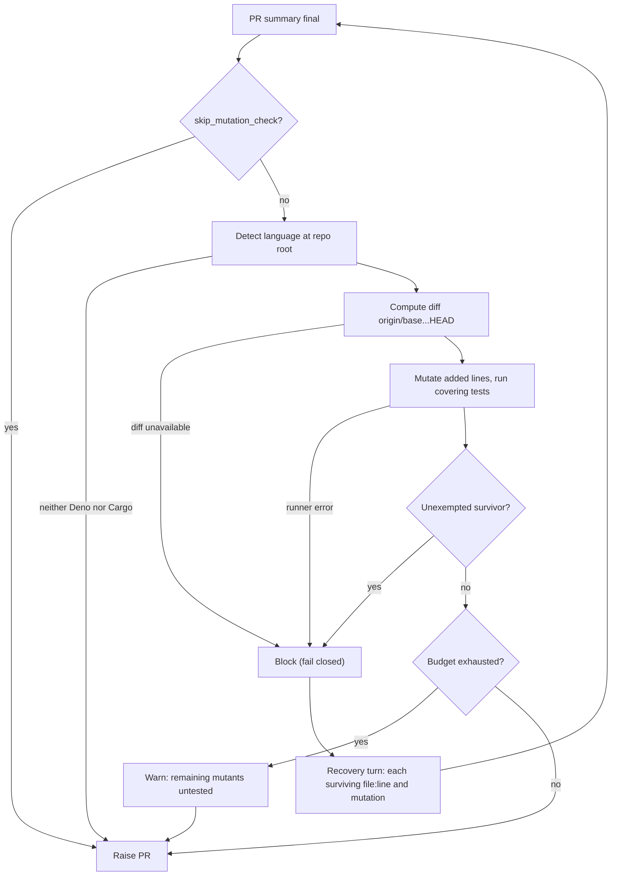

# Diff-scoped mutation check

The mutation check is a PR-raise gate (Issue #3393). It mutates only the lines
a pull request adds or changes, re-runs the tests that cover them, and blocks
the PR when a mutation survives, that is, when the suite stays green although
the behaviour was changed on purpose.

## Why line coverage is not enough

A test can execute a line without asserting on it. Line coverage and the
`Branch outcomes:` list in the Test Plan both rest on the agent's own
account of which test reaches which line. A mutation check measures the
outcome instead: flip the line, run the tests, and see whether anything goes
red. A survivor is concrete evidence that no test pins that behaviour.

## Flow

The gate runs in the issue-run completion phase, after the PR summary is
final and before the PR is raised. It joins the other late summary gates (docs
sweep, removed assertions, placeholders, branch outcomes, claim check) and
feeds the same single recovery turn.



The recovery turn is told each surviving `file:line` and the mutation applied,
so the agent adds the assertion that kills it, or records an exemption.

## Languages

The language is detected at the target repository root.

| Root file                              | Mutator                                                                                      |
| -------------------------------------- | -------------------------------------------------------------------------------------------- |
| `deno.json`, `deno.jsonc`, `deno.lock` | Built-in Deno mutator (below)                                                                |
| `Cargo.toml`                           | `cargo mutants --in-diff <diff> --no-shuffle --jobs N`, with N = min(4, CPUs)                |
| neither                                | Not applicable: the gate passes without running                                              |

For Cargo the outcomes are read from `mutants.out/outcomes.json`. The worker
image ships `cargo-mutants` 27.1.0 (amd64 from the release tarball,
checksum-verified; arm64 built with `cargo install --locked`).

## The diff

The diff is `origin/<base>...HEAD`, falling back to `<base>...HEAD`. Only
added or changed lines are mutated. When no diff can be computed the gate
fails closed and blocks, rather than passing an unmeasured change.

## Built-in Deno mutations

The mutator works on added lines of non-test source files.

| Mutation                   | Effect                                                   |
| -------------------------- | -------------------------------------------------------- |
| Negate an `if` condition   | `if (c)` becomes `if (!(c))`                             |
| Negate a ternary condition | `c ? a : b` becomes `!(c) ? a : b`                       |
| Swap booleans              | `true` becomes `false` and the reverse                   |
| Replace a return value     | `return x` becomes a type-appropriate default            |
| Delete a call statement    | A single call statement is removed                       |

Each mutant runs only the test files that import the mutated module
(`deno test -A <those files>`). Before any mutant, the unmutated baseline run
must pass; if it does not, the gate reports an error. The file is restored
after every mutant, even when the run fails. A changed module that no test
imports has its mutants counted as survivors. A run is capped at 40 mutants.

## Budget

`mutation_check_budget_seconds` bounds the whole run: a positive integer,
default 300, maximum 3600. On exhaustion the gate reports:

```text
mutation budget exhausted after T of N mutants — remaining mutants untested, not passed
```

This is a warning and is never reported as a pass. Survivors found before the
budget ran out still block.

## Exemptions

A survivor that no test can reasonably kill may be exempted by a PR-summary
line naming the location and giving a non-empty reason:

```text
- `worker/deno/lib/example.ts:42` — exempt (untestable): <reason>
```

This is the same `exempt (untestable): <reason>` convention the Branch
outcomes gate uses; an empty reason does not exempt. Every other survivor
blocks.

## Configuration

Both keys are per-repo options, set operator-side under
`repo_config["owner/repo"]` in `.config.json`, beside `skip_security_fix_check`
(see [Configuration](CONFIGURATION.md)).

| Key                               | Type    | Default | Effect                                              |
| --------------------------------- | ------- | ------- | --------------------------------------------------- |
| `skip_mutation_check`             | boolean | `false` | `true` disables the gate for the repository         |
| `mutation_check_budget_seconds`   | integer | `300`   | Time budget for one run; positive, at most `3600`   |

```json
"repo_config": {
  "owner/repo": {
    "skip_mutation_check": true
  }
}
```

## Outcomes

| Outcome                | Meaning                                                | Blocks the PR?            |
| ---------------------- | ------------------------------------------------------ | ------------------------- |
| Not applicable         | No Deno or Cargo marker at the root, or check disabled | No                        |
| Completed, no survivor | Every mutant was killed, or the survivor is exempted   | No                        |
| Completed, survivors   | At least one unexempted survivor                       | Yes                       |
| Budget exhausted       | Remaining mutants untested; warning, not a pass        | Only if a survivor found  |
| Error                  | Runner failed (for example `cargo-mutants` missing, baseline tests fail), or diff unavailable | Yes, with a remedy |

## Troubleshooting

- **Baseline tests fail.** The gate runs the unmutated tests first. Fix the
  failing test; a mutant result is meaningless over a red baseline.
- **`cargo-mutants` missing.** The worker image ships 27.1.0. Outside the image,
  install it with `cargo install --locked cargo-mutants`, or set
  `skip_mutation_check: true`.
- **Survivor in an untested module.** No test imports the changed module, so
  every mutant survives. Add a test that imports it and asserts on the
  behaviour.
- **Budget exhausted too often.** Raise `mutation_check_budget_seconds` (up to
  3600), or narrow the PR.
- **Diff unavailable.** Make sure the base branch is fetched so
  `origin/<base>` resolves.
