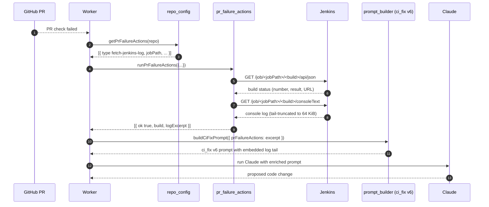
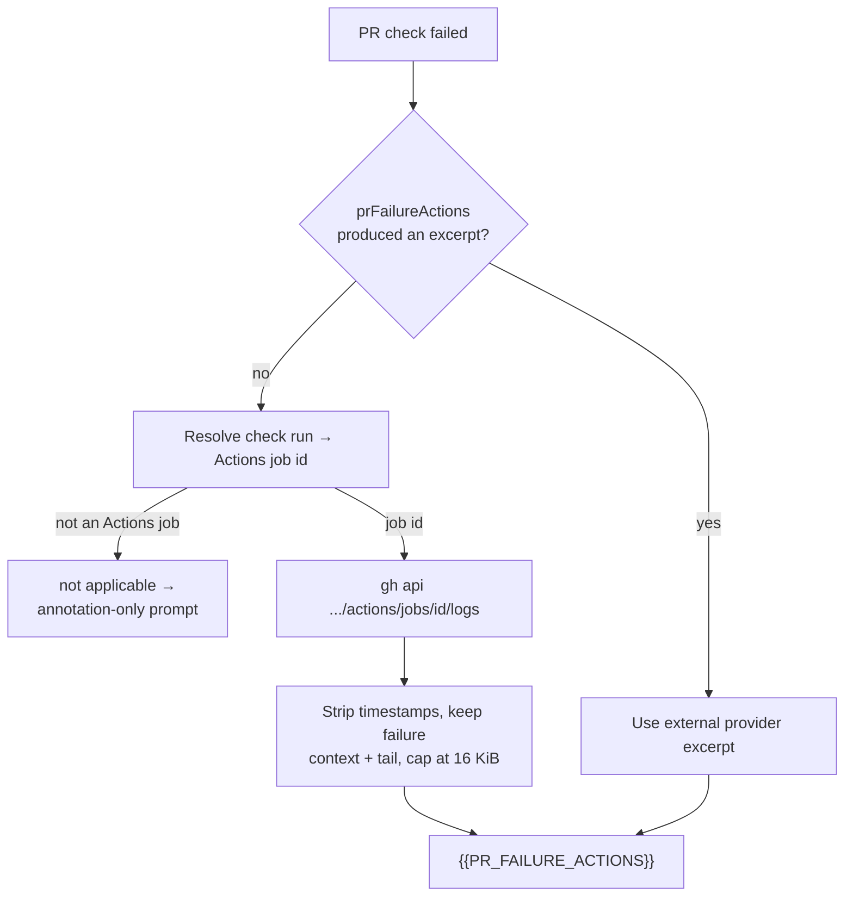
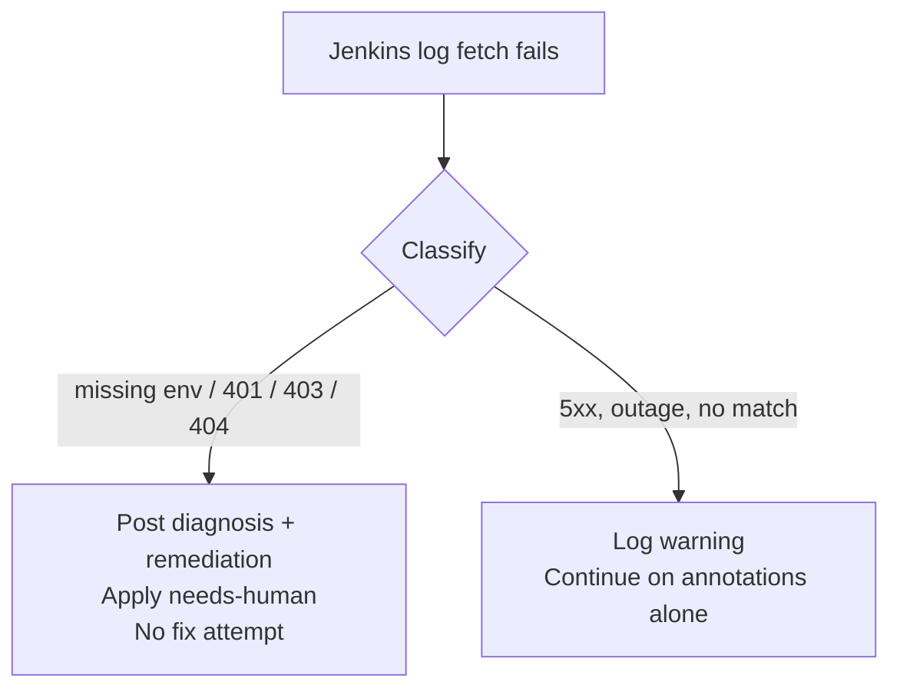

# 🔧 Per-repository PR failure actions

When a pull request's CI fails, the worker normally feeds the GitHub check
annotations to the `ci_fix` prompt and asks Claude to diagnose the failure.
For repositories whose builds run on **external CI systems** (e.g. a
self-hosted Jenkins) the GitHub annotation is usually a one-line "build
failed" message — the authoritative output sits in the external system's
console log.

The `prFailureActions` configuration tells the worker which extra steps to
take **before** invoking the CI fix prompt, so authoritative console output
is injected directly into the prompt context. The first concrete action
type, `fetch-jenkins-log`, fetches the console tail from Jenkins via its
REST API.

> **⚠️ `prFailureActions` is deprecated.** It is still parsed
> and converted into an equivalent `ciProviders` entry, so existing
> configuration keeps working byte-identically — but new configuration
> should use `ciProviders`, which selects any registered CI log provider:
>
> ```jsonc
> "ciProviders": [
>   {
>     "provider": "jenkins",
>     "jobPath": "stSoftwareAU/private-repo-25/Develop",
>     "checkNamePattern": "jenkins"
>   }
> ]
> ```
>
> See [Adding a CI log provider](EXTENDING.md#adding-a-ci-log-provider) for
> the extension point and [Per-repository configuration](CONFIGURATION.md#-per-repository-configuration)
> for the field reference.

## End-to-end flow



The diagram is consistent with the integration sequence introduced in;
this page adds the configuration and operator-facing detail.

## Schema

The configuration lives under `repo_config.<owner>/<repo>.prFailureActions`
in the worker's `.config.json`. It is an array of action objects; each
object is a discriminated union on the `type` field.

### `fetch-jenkins-log`

| Field | Type | Required | Description |
|-------|------|----------|-------------|
| `type` | `"fetch-jenkins-log"` | yes | Discriminator. |
| `jobPath` | string | yes | Jenkins job path forwarded verbatim to the fetcher (e.g. `stSoftwareAU/private-repo-25/Develop`). The fetcher constructs `${JENKINS_URL}/job/<jobPath>/<build>/consoleText`. |
| `checkNamePattern` | string (regex) | no | Case-insensitive regex matched against the failing PR check's name. Defaults to `jenkins`. The build number is extracted from the matching check's `target_url`. |

Parsing rules enforced by `parsePrFailureActions()` in
`worker/deno/lib/repo_config.ts`:

- Unknown `type` values are rejected (typos do not silently disable the feature).
- Missing `jobPath` is rejected.
- A malformed `checkNamePattern` regex is rejected.
- Patterns longer than 200 characters or containing nested-quantifier
  constructs (`(a+)+`) are rejected as a ReDoS guard.

Malformed configuration throws at startup so the worker fails fast rather
than dropping actions silently.

## Environment variable contract

Jenkins credentials live **only in the worker's environment** — never in
`.config.json`. This keeps the deployed config file free of secrets, so it
can be checked into operator-controlled storage without rotation risk.

| Variable | Required | Description |
|----------|----------|-------------|
| `JENKINS_URL` | yes | Base URL of the Jenkins server (e.g. `https://jenkins.example.com`). Trailing slash is stripped. |
| `JENKINS_USER` | yes | Jenkins username for HTTP Basic auth. |
| `JENKINS_TOKEN` | yes | Jenkins API token. **Never** echoed back in errors or logs. |

The fetcher (`worker/deno/lib/jenkins_log_fetcher.ts`) reads these via
`getEnvOrDefault()`. If any of the three is empty, every Jenkins action on
every repo returns `{ ok: false, error: "JENKINS_* environment variable is
not set" }` and the worker proceeds with the unchanged CI fix prompt.

## Worked example — `stSoftwareAU/private-repo-12`

private-repo-12 publishes its build status to GitHub as a check called
`jenkins` whose `target_url` points at
`https://jenkins.example.com/job/stSoftwareAU/job/private-repo-25/job/Develop/<build>/`.
The minimum configuration the operator adds to the worker's `.config.json`
is:

```jsonc
{
  "repo_config": {
    "stSoftwareAU/private-repo-12": {
      "prFailureActions": [
        {
          "type": "fetch-jenkins-log",
          "jobPath": "stSoftwareAU/private-repo-25/Develop",
          "checkNamePattern": "jenkins"
        }
      ]
    }
  }
}
```

With this entry in place and the three `JENKINS_*` environment variables
exported in the worker's systemd unit (or equivalent), the next failing PR
on private-repo-12 will see a Jenkins console-log tail injected into the
`ci_fix` prompt before Claude is invoked.

### Operator follow-up checklist

The planner-spawned PR for this issue **does not ship secrets** — the
configuration above must be applied manually on the worker host. After
merging this PR:

1. Add the `stSoftwareAU/private-repo-12` entry above to the worker's
   deployed `.config.json` (the operator-controlled file, not anything in
   the repo).
2. Export `JENKINS_URL`, `JENKINS_USER`, and `JENKINS_TOKEN` in the
   worker's environment (e.g. via the systemd `EnvironmentFile=` or
   `/etc/vibe-coder/jenkins.env`). Confirm the file mode is `0600` and
   owned by the worker user.
3. Restart the worker so the new env is picked up.
4. Trigger a failing Jenkins build on a test PR and confirm the worker
   log shows `pr_failure_action ran successfully` and the CI fix prompt
   contains a `## PR Failure Action Output` section.

To enable the same integration on another repo, repeat steps 1–4 with the
appropriate `jobPath`. **No further code change is required** — the
dispatcher is fully data-driven from `.config.json`.

## Built-in GitHub Actions provider (default, no configuration)

When a repo has no `prFailureActions` — or every configured action returns an
error — the worker falls back to its **built-in GitHub Actions log provider**
(`github-actions`,). It resolves the failing check run to an
Actions job id, fetches that job's log through the worker's existing
authenticated `gh` CLI (no new secret), trims it, and feeds the excerpt into
the same `{{PR_FAILURE_ACTIONS}}` prompt slot. Every repo therefore gets real
job logs — not just annotations — with zero configuration.



Behaviour worth knowing:

- **Job-id resolution** uses the check's `details_url` first, then the
  check-run API, then the workflow run's job listing (matched on check name,
  else the first failing job).
- **Not applicable, not an error.** A non-Actions check (e.g. the Jenkins
  `continuous-integration/jenkins/pr-head` status) returns a clean "not
  applicable" and the flow continues on annotations alone.
- **Trimming** strips the ISO-8601 timestamp Actions prepends to every line,
  keeps the window around the first failure marker plus the log tail, and
  hard-caps the excerpt at 16 KiB (`MAX_ACTIONS_EXCERPT_BYTES`) so a
  multi-megabyte log cannot blow the model context.
- **The chosen provider is logged** on every CI-fix run
  (`CI log provider selected`, with `provider`), so a fall-through to
  annotation-only diagnosis is visible in the worker log rather than silent.

## Jenkins credentials preflight

A bare `HTTP 403` tells an unattended worker nothing it can act on, so a
Jenkins log fetch that fails on credentials or job path is classified into a
one-line diagnosis plus a one-line remediation — missing environment
variables (named individually), 401, 403, 404, other HTTP errors, and
connection errors. The token is never echoed, in any path.

Check the credentials by hand before wiring a repo up:

```bash
deno run --allow-env --allow-net worker/deno/mod.ts \
  check-jenkins-access --job foo/job/Develop --build 123 < /dev/null
```

Inside the CI-fix flow, an access failure (`missing-env`, 401, 403 or 404)
short-circuits the run: the worker posts the diagnosis on the PR, applies
`needs-human`, and does **not** start a Claude fix attempt — there is no
build output to diagnose from, so any "fix" would be a guess. Every other
provider failure (a 5xx, an outage, an unmatched check) keeps the tolerant
behaviour of continuing with the unchanged prompt.



## Troubleshooting

Symptoms below mirror those documented in the private-repo-12 sibling repo's
`docs/jenkins-access.md`.

| Symptom | Likely cause | Fix |
|---------|--------------|-----|
| Worker log shows `Jenkins status request failed with HTTP 401 Unauthorized` | `JENKINS_TOKEN` has expired or been revoked. | Issue a new API token in Jenkins (`/me/configure` → "API Token"), update the worker environment, restart the worker. |
| Worker log shows `Jenkins request failed with HTTP 403 Forbidden` | `JENKINS_USER` lacks read access on the job. | Grant the user "Read" + "Workspace" on the matrix or use a service account with the required role. |
| Worker log shows `JENKINS_URL environment variable is not set` (or `_USER`, `_TOKEN`) | One of the three required env vars is missing or empty. | Export all three and restart the worker. Confirm with `systemctl show vibe-coder -p Environment` or `env \| grep ^JENKINS_` as the worker user. |
| Worker log shows `no matching Jenkins check on PR` | The failing check name does not match `checkNamePattern`. | Inspect the actual check name on the PR (`gh pr checks <pr>`) and tighten or relax the regex. |
| Worker log shows `could not extract Jenkins build number: trailing segment '<x>' is not a numeric build id` | The check's `target_url` does not end in a numeric build segment (e.g. it points at `lastBuild`). | Update the Jenkins job's "GitHub Status Notifier" to publish the concrete build URL (e.g. `/job/.../<n>/`). |
| Worker log shows `No CI log provider produced an excerpt` with `provider: github-actions` | The failing check is not a GitHub Actions job, or its job log could not be retrieved. | Check the `reason` field in the same log line. A Jenkins/status check is expected to be "not applicable"; an HTTP error means the `gh` credentials lack `actions: read` on the repo. |
| CI fix prompt has no `## PR Failure Action Output` section after a failure | Either no `prFailureActions` entry for the repo, or every action returned an error. | Check the worker log for `pr_failure_action did not produce a result` warnings. The worker is tolerant of dispatcher failures — it proceeds with the unchanged CI fix prompt rather than stalling. |

The worker **never logs the Jenkins token** — error messages quote the HTTP
status only. If you see a token value in logs, treat it as a leak and
rotate it.

## Related

- [Configuration Reference](CONFIGURATION.md#per-repository-configuration) — wider `repo_config` schema.
- [Extending the Worker](EXTENDING.md#prompt-versioning-and-templates) — `ci_fix` prompt versioning (the `{{PR_FAILURE_ACTIONS}}` placeholder lives in `prompts/ci_fix/`).
- Implementation: `worker/deno/lib/repo_config.ts` (parser), `worker/deno/lib/pr_failure_actions.ts` (dispatcher + Markdown formatter), `worker/deno/lib/jenkins_log_fetcher.ts` (HTTP client), `worker/deno/lib/jenkins_access_check.ts` (credentials preflight,), `worker/deno/lib/github_actions_log_fetcher.ts` (built-in default provider,).
- Schema issue, fetcher, dispatcher, prompt wiring, this rollout — all under parent.
