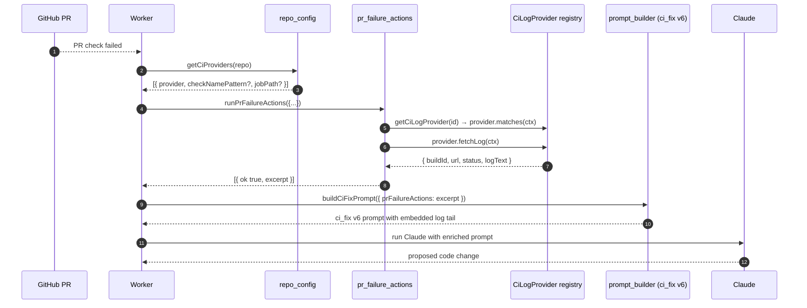
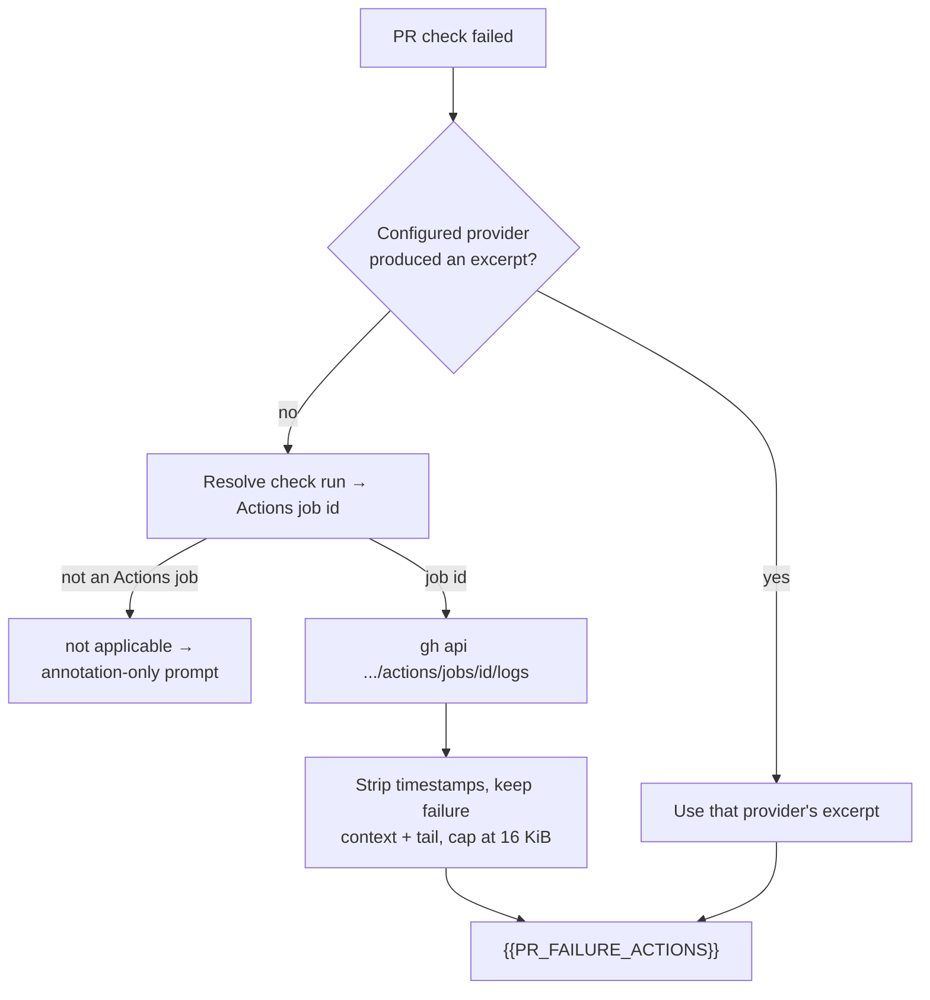

# 🔧 Per-repository PR failure actions

When a pull request's CI fails, the worker feeds an authoritative log
excerpt into the `{{PR_FAILURE_ACTIONS}}` slot of the `ci_fix` prompt
before asking Claude to diagnose the failure. GitHub check annotations
alone are usually a one-line "build failed" message; the excerpt is the
actual console output the fix has to be reasoned from.

**GitHub Actions is the built-in default provider** — every repo gets real
job logs with no configuration at all. A repository whose builds run on
some other CI system selects a provider through the `ciProviders`
per-repo configuration.

> **Which repository does a provider live in?**
>
> A CI log provider belongs in this repository only when this project
> itself runs on that CI system — GitHub Actions qualifies. A provider for
> the CI system **one deployment happens to use** is a private extension
> and lives in that deployment's own repository (Issue #986). Core owns
> the extension point; it never learns what is plugged into it.
>
> Note the gap that comes with that boundary: the registry is not exported
> for out-of-tree use and there is no extension loader, so a private
> provider cannot register itself without a fork today. See
> [Private Extensions](PRIVATE-EXTENSIONS.md#-known-gaps) and
> [Adding a CI log provider](EXTENDING.md#-adding-a-ci-log-provider).

## End-to-end flow



## Schema

The configuration lives under `repo_config.<owner>/<repo>.ciProviders` in
the worker's `.config.json`. It is an array of provider entries, consulted
in order.

| Field | Type | Required | Description |
|-------|------|----------|-------------|
| `provider` | string | yes | Registered provider id, e.g. `github-actions`. An id no provider has registered is reported as an explicit dispatcher error, never a silent no-op. |
| `checkNamePattern` | string (regex) | no | Case-insensitive regex matched against the failing PR check's name. Each provider supplies its own default when omitted. |
| `jobPath` | string | no | Provider-specific job identifier, passed through verbatim. Core attaches no meaning to it; the provider that declares the id defines its format and whether it is required. |

Parsing rules enforced by `parseCiProviders()` in
`worker/deno/lib/repo_config.ts`:

- A missing or non-string `provider` is rejected.
- A malformed `checkNamePattern` regex is rejected.
- Patterns longer than 200 characters or containing nested-quantifier
  constructs (`(a+)+`) are rejected as a ReDoS guard.

Malformed configuration throws at startup so the worker fails fast rather
than dropping providers silently.

## Secrets stay in the environment

Any credential a provider needs lives **only in the worker's
environment** — never in `.config.json`. This keeps the deployed config
file free of secrets, so it can be checked into operator-controlled
storage without rotation risk. The built-in GitHub Actions provider needs
no new secret at all: it uses the worker's existing authenticated `gh`
CLI.

A provider shipped by a private extension reads its own credentials the
same way. Names matching `TOKEN`, `SECRET`, `API_KEY` and friends are
denied to every coding agent by shape (`agent_env.ts`), so an extension's
CI token never reaches the model.

## Built-in GitHub Actions provider (default, no configuration)

When a repo has no `ciProviders` — or every configured provider returns an
error — the worker falls back to its **built-in GitHub Actions log
provider** (`github-actions`). It resolves the failing check run to an
Actions job id, fetches that job's log through `gh`, trims it, and feeds
the excerpt into the same `{{PR_FAILURE_ACTIONS}}` prompt slot.



Behaviour worth knowing:

- **Job-id resolution** uses the check's `details_url` first, then the
  check-run API, then the workflow run's job listing (matched on check
  name, else the first failing job).
- **Not applicable, not an error.** A check owned by another CI system
  returns a clean "not applicable" and the flow continues on annotations
  alone.
- **Trimming** strips the ISO-8601 timestamp Actions prepends to every
  line, keeps the window around the first failure marker plus the log
  tail, and hard-caps the excerpt at 16 KiB
  (`MAX_ACTIONS_EXCERPT_BYTES`) so a multi-megabyte log cannot blow the
  model context.
- **The chosen provider is logged** on every CI-fix run
  (`CI log provider selected`, with `provider`), so a fall-through to
  annotation-only diagnosis is visible in the worker log rather than
  silent.

## The excerpt is untrusted data

A build log is attacker-influenceable — anyone who can print to stdout
during a build can put text in it — so the excerpt is truncated first,
then redacted with `redactSecrets()` (a build routinely echoes a tokenised
clone URL or an `export FOO_TOKEN=…` line, and the run is told to quote
the lines it diagnosed from back into a public comment), and fenced with a
dynamically-sized code fence so a bare ` ``` ` in the log cannot break out
of it.

An empty excerpt is reported as an explicit error, never as a hollow
success: a run must never be sent at a fix believing it has evidence it
does not have.

## Troubleshooting

| Symptom | Likely cause | Fix |
|---------|--------------|-----|
| Worker log shows `no CI log provider registered for '<id>'` | `ciProviders` names an id nothing has registered — almost always a typo, since out-of-tree registration is a [known gap](PRIVATE-EXTENSIONS.md#-known-gaps) rather than a supported mechanism today. | Correct the id. `github-actions` is the only id core registers. |
| Worker log shows `no failing check matched provider '<id>'` | The failing check name does not match `checkNamePattern`. | Inspect the actual check name on the PR (`gh pr checks <pr>`) and tighten or relax the regex. |
| Worker log shows `provider '<id>' returned an empty log excerpt` | The provider fetched successfully but the log was empty. | Check the build actually produced console output, and that the provider's byte caps are not trimming it to nothing. |
| Worker log shows `No CI log provider produced an excerpt` with `provider: github-actions` | The failing check is not a GitHub Actions job, or its job log could not be retrieved. | Check the `reason` field in the same log line. A status check owned by another CI system is expected to be "not applicable"; an HTTP error means the `gh` credentials lack `actions: read` on the repo. |
| CI fix prompt has no `## PR Failure Action Output` section after a failure | Either no `ciProviders` entry for the repo, or every provider returned an error. | Check the worker log for `ci_log_provider did not produce a result` warnings. The worker is tolerant of dispatcher failures — it proceeds with the unchanged CI fix prompt rather than stalling. |

Error messages quote the HTTP status only, never a credential. If you see
a token value in logs, treat it as a leak and rotate it.

## Related

- [Configuration Reference](CONFIGURATION.md#-per-repository-configuration) — wider `repo_config` schema.
- [Private Extensions](PRIVATE-EXTENSIONS.md) — where a provider for one deployment's own CI system lives.
- [Extending the Worker](EXTENDING.md#-adding-a-ci-log-provider) — the `CiLogProvider` extension point, and the `ci_fix` prompt template (the `{{PR_FAILURE_ACTIONS}}` placeholder lives in `prompts/ci_fix/prompt.md`).
- [CI-failure issues](ci-failure-issue-log-fetch.md) — the issue-side counterpart, which resolves through the same registry.
- Implementation: `worker/deno/lib/repo_config.ts` (parser), `worker/deno/lib/ci_log_provider.ts` (registry), `worker/deno/lib/pr_failure_actions.ts` (dispatcher + Markdown formatter), `worker/deno/lib/github_actions_log_fetcher.ts` (built-in default provider).
