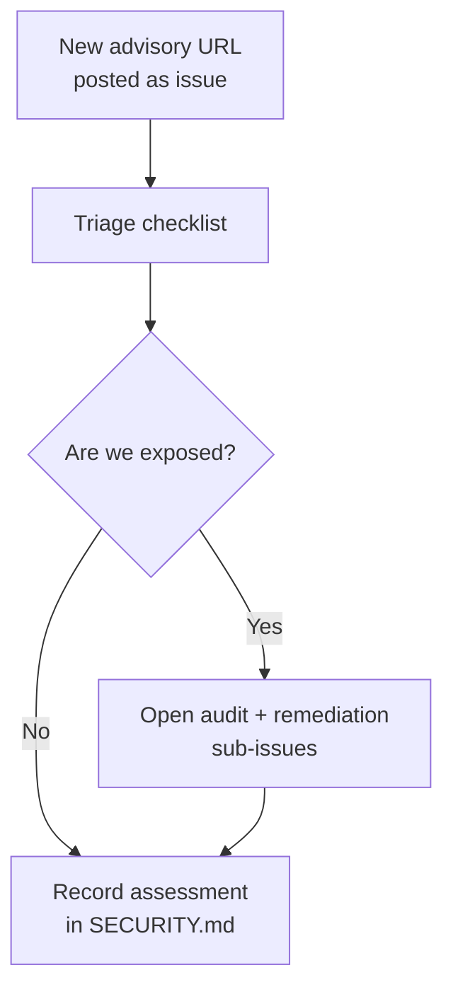

# 🔎 Upstream Security Advisory Triage

A short, repeatable checklist for handling "should we react to this CVE?"
questions. The goal is to assess a new advisory in minutes, not rediscover the
answer from scratch each time.

This document is a **checklist, not a policy**. For the broader threat model and
security architecture, see [SECURITY.md](../SECURITY.md). This page covers
**upstream** CVE/GHSA advisories from third parties — for the worker's own
internal MythOS-style security audits (idle trigger, finding-issue format), see
[Security Scans — Operator Manual](SECURITY-SCAN.md).

## When to use this

Use this process whenever someone posts an upstream advisory link (GHSA, CVE,
vendor bulletin) and asks whether the Vibe Coder needs to react. Example
precedent: →
 →.

## Process



## 1. Intake

Anyone can open a GitHub issue with:

- The advisory URL (GHSA / CVE / vendor bulletin).
- A one-line question — e.g. "do we need to do anything about this?".
- The `security` label (create if missing).

No further analysis is required at intake — the goal is to capture the advisory
promptly so the worker or a human triager can pick it up.

### Automatic intake for Deno dependencies

Renovate's `deno` manager is deliberately disabled, so it never
raises a security-remediation PR for a JSR / `deno.land/x` dependency. To close
that detect→react gap, the scheduled `deno audit` job in
[`.github/workflows/dependency-audit.yml`](../.github/workflows/dependency-audit.yml)
files a single tracking issue (label `dependency-audit-failure`) when a *weekly*
run fails — i.e. a known advisory has landed against a package already pinned in
`deno.lock`. The notifier (`notify-audit-failure` command, backed by
`worker/deno/lib/audit_failure_notifier.ts`) is idempotent: one open tracking
issue per ecosystem and failure mode at a time. Treat that auto-filed issue
exactly like a human-filed intake and run the triage checklist below; the
[emergency dependency override](#emergency-dependency-override) covers the bump
itself.

The audit is **fail-closed**: it runs without
`--ignore-registry-errors`, so an advisory service that does not answer fails
the job instead of exiting 0 having checked nothing. Two tracking issues are
therefore possible, and they need different responses:

| Tracking issue title | What happened | What to do |
| --- | --- | --- |
| `🔴 Scheduled dependency audit failed for the deno ecosystem` | The audit ran and a package pinned in `deno.lock` has a known advisory. | Triage the advisory and bump the dependency (checklist below). |
| `🔴 Scheduled dependency audit could not run for the deno ecosystem` | The advisory service did not answer — **nothing was audited**. | Confirm the service is back, re-run `dependency-audit.yml` via `workflow_dispatch`, and investigate runner egress if it persists. Do **not** restore `--ignore-registry-errors`. |

## 2. Triage checklist

For each advisory, answer all of:

- [ ] **CVE / GHSA id confirmed** — record the canonical id and CVSS.
- [ ] **Affected products listed** — copy the upstream "Affected versions" /
      "Affected products" verbatim (e.g. github.com, Enterprise Cloud,
      Enterprise Server X.Y).
- [ ] **Patched status recorded** — note the fix version and the date the
      upstream vendor patched.
- [ ] **Our exposure assessed** across each surface:
  - **Cloud only?** The Vibe Coder targets `github.com`. If the advisory only
    affects GHES, we are not exposed.
  - **Runtime dependencies** — does any package in `worker/deno/deno.json`, npm
    dependency, or system tool we shell out to (e.g. `git`, `gh`, `jq`) match
    the affected component?
  - **GitHub Actions** — does any workflow under `.github/workflows/` use the
    affected action?
  - **Code patterns** — does our code use the affected API in a way that exposes
    the vulnerability (e.g. user-controlled input flowing into a vulnerable
    parameter)?
- [ ] **Decision recorded** — exposed or not exposed, with a one-line reason.

## 3. Decision tree

- **Not exposed** — close the intake issue, add an entry to
  [SECURITY.md](../SECURITY.md) "Known upstream advisories" section recording
  the assessment.
- **Exposed** — open two sub-issues:
  1. **Audit** — confirm the exposure with code search / tests (precedent:).
  2. **Remediation** — patch, sanitise, or upgrade as needed (see
     [Emergency dependency override](#emergency-dependency-override) below if
     the fix is a dependency bump being held back by the quarantine window).
     Then add an entry to [SECURITY.md](../SECURITY.md) once the audit concludes
     (precedent:).

## Emergency dependency override

The repo quarantines new dependency releases for **24 hours** before they may be
adopted — `renovate.json` `minimumReleaseAge: "24 hours"` for the ecosystems
Renovate owns (npm, GitHub Actions), `deno.json` `minimumDependencyAge`
(`age: "P1D"`) for Deno deps, and `VIBE_BUMP_QUARANTINE_HOURS` (default `24`) for
`bump-deps.sh`. This window blunts the "publish a malicious version, get
auto-merged within minutes" attack, and it is the correct default.

The same window is **wrong** in one specific case: a CVE in a current dependency
is being **actively exploited** and upstream has shipped a fixed release inside
the quarantine window. Waiting 24 hours to adopt that fix prolongs the exposure.
For that case — and only that case — a maintainer may bypass the quarantine.

**Who may bypass.** A repo maintainer (an `allowed_authors` member). The bypass
is a deliberate, recorded exception, not a routine merge.

**When to bypass.** All of:

- The advisory is confirmed **Exposed** by the triage above (we actually use the
  affected component on a reachable path).
- The CVE is under **active exploitation** (upstream advisory, CISA KEV, or
  credible public reports), so the 24h delay carries real risk.
- Upstream has published a **fixed release** and you have read its changelog —
  the fix is a genuine patch, not an unrelated republish.

**How to bypass** (pick one, lowest-friction first):

- **Merge the security PR directly.** Renovate/Dependabot already raised the
  upgrade PR; merge it immediately with a comment recording the CVE id, the
  active-exploitation evidence, and the maintainer who approved the bypass.
- **Temporary `minimumReleaseAge: "0"` rule.** Add a short-lived `packageRules`
  entry in `renovate.json` scoped to **only** the affected package, e.g.:

  ```json
  {
    "description": "EMERGENCY override — CVE-YYYY-NNNNN actively exploited; bypass 24h quarantine for this package only. Remove after upgrade. Approved by <maintainer>.",
    "matchPackageNames": ["the-affected-package"],
    "minimumReleaseAge": "0"
  }
  ```

  For a Deno dep, add the package glob to the `deno.json` `minimumDependencyAge`
  `exclude` list with the same emergency comment instead.

**After the upgrade.** Record the bypass in the [SECURITY.md](../SECURITY.md)
"Known upstream advisories" entry (CVE id, active-exploitation evidence,
approving maintainer, date) and **revert** any temporary `minimumReleaseAge: "0"`
rule or `exclude` glob so the full 24h quarantine is restored for the next
release. The override is a fast-lane for one package on one occasion, never a
standing change.

This emergency path is purely about *expediting a legitimate fix* — it does not
weaken the quarantine for any other dependency.

## 4. Documentation outcome

Every triage produces an entry in [SECURITY.md](../SECURITY.md), in the format
established by:

- Vulnerability id and CVSS.
- Affected products (verbatim from upstream).
- Vibe Coder exposure (one or two lines).
- Audit outcome (link to the audit PR / issue).
- Date of assessment and assessor.

This record means the next reader does not need to repeat the work, and the next
advisory has a precedent format to follow.

## Examples

| Advisory                                          | Intake                                                          | Audit                                                           | Documentation                                                   |
| ------------------------------------------------- | --------------------------------------------------------------- | --------------------------------------------------------------- | --------------------------------------------------------------- |
| CVE-2026-3854 (GitHub git push command injection) | |  | |
