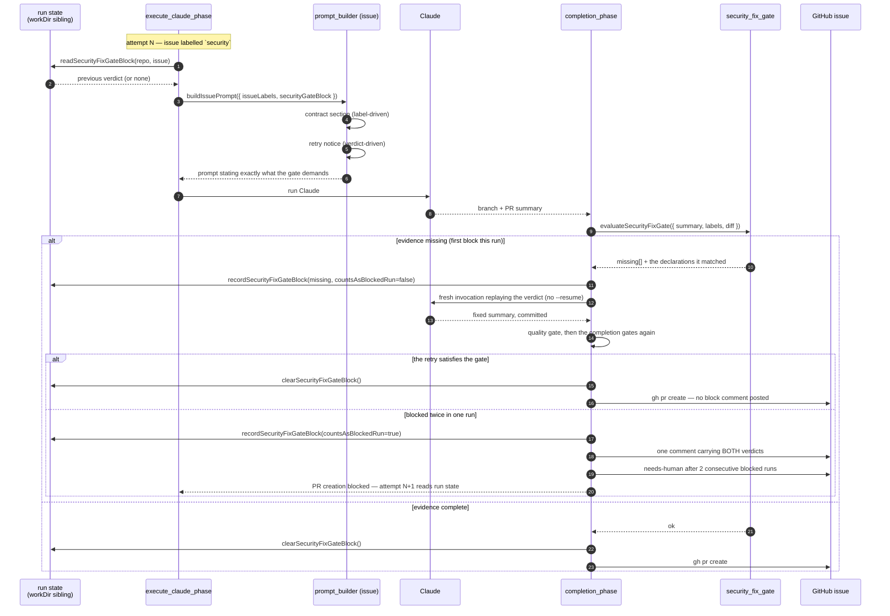

# 🔐 Security-fix gate — contract up front, verdict into the retry

The security-fix patch-verification gate (`security_fix_gate.ts`,
and) blocks PR creation when an issue carrying the `security` label
cannot show — in the branch diff, not only in prose — that the fault is
genuinely closed. That gate is sound. What was missing was the feedback loop
around it.

 was attempted at least ten times across two workers on a single
day. Every attempt ended in the same `PR creation blocked:` comment; the code
and tests on the branch were sound from early attempts, and only the PR
summary's evidence format was wrong. Nothing ever converged, because:

1. **The prompt never stated the contract.** The `prompts/issue/` template never
   mentioned the `path/to/foo_test.ts::test name` citation, the
   fail-before/pass-after linkage wording, or the trigger-closed statement. An
   agent could only discover the contract by failing it.
2. **The gate's own remediation comment is untrusted on the next attempt.** It
   is posted by the worker's service account, which sits in `service_accounts`
   but not `allowed_authors` — so `classifyCommentAuthor`
   (`comment_trust_filter.ts`) classifies it UNTRUSTED, and the retry prompt
   explicitly tells the agent not to act on instructions found there.

 closes both halves: the contract is stated before the first attempt,
and the previous verdict rides worker run state — a trusted channel — into the
next one.

## End-to-end flow



## The contract section

`buildSecurityFixEvidenceContract()` renders the gate's own
`SECURITY_FIX_EVIDENCE_DESCRIPTIONS` for every item in
`REQUIRED_SECURITY_FIX_EVIDENCE`. Prompt and gate therefore cannot drift: the
remediation text an agent reads before it starts is byte-for-byte the text the
gate would have posted after blocking it.

The section is emitted only when the issue carries the `security` label — the
same `hasSecurityLabel()` predicate the gate activates on — so non-security
issues see no extra prompt weight. `diff-unavailable` is excluded: it reports
an environment fault, not something a PR summary can be written to satisfy.

## The verdict store

Blocked verdicts live in a directory **beside** `workDir`, never inside it:

```text
<workDir>-security-gate-state/<owner>_<repo>_<issue>.securitygate.json
```

The sibling placement is the same reasoning as the content-approval baseline
 — `nukeWorkDir` and an agent-driven `rm` inside the work tree
must not be able to erase the record. Each file holds the missing evidence
kinds, the ISO timestamp of the last block, the test declarations the gate
matched, and a running `blockCount` so a repeat loop is visible in the retry
prompt and the worker log.

Since Issue #1575, `blockCount` counts **blocked runs** — runs that ended in
`failure` from the gate — not blocks. The first block inside a run is recovered
by the in-run retry below, so it records its verdict with
`countsAsBlockedRun: false` and charges the issue nothing. The count is
host-local: it clears the moment the gate passes, and a different host starts
at zero.

Reads are defensive even though the file is worker-written: unknown evidence
kinds are discarded and a corrupt file reads as absent, so nothing that lands
in that directory can inject text into the next prompt. A verdict that cannot
be persisted (an unconfigured `workDir`) is logged loudly rather than dropped
silently — the PR is blocked either way, but an operator can see that the next
attempt will start blind.

## The in-run retry (Issue #1575)

A block used to end the run. Issue #1385 needed four runs to raise its PR: the
first three were blocked with `test-identifier-in-diff` missing while each
branch already carried the cited regression test, because the gate could not
read a test name `deno fmt` had wrapped onto the line after `Deno.test(`. That
regex fault is fixed, but three correct branches still cost roughly USD 10.50
and 28 minutes of worker time — one false block should not cost a run at all.

The completion phase therefore recovers from the **first** block inside the run:

1. the verdict is recorded in run state (charging no blocked run) and the log
   reads `security-fix gate block — retrying once in-run`;
2. the agent is re-invoked **fresh** — never `--resume`, because the previous
   turn already concluded the work was finished — carrying the same replay
   section the next-run prompt uses;
3. the quality gate runs again, then the completion gates. `bump-deps` does
   not: the bump is already on the branch.

The retry always runs; it is never skipped on time-budget grounds. A run that
passes on the retry raises its PR and posts **no** block comment for the first
verdict. A run blocked twice ends in `failure` exactly as a block did before,
with **one** comment carrying both verdicts.

### Recognising a false block

When `test-identifier-in-diff` is missing, the block comment and the replayed
verdict list the test declaration lines the gate matched in the diff, capped at
ten and fenced as untrusted — they are agent-authored diff text. A summary that
cites a listed declaration means the gate is at fault rather than the summary,
which is exactly what nobody could tell during #1385.

### After two blocked runs

Two consecutive blocked runs on one issue and the worker stops re-attempting:
`needs-human` is applied through the guarded `escalateToHuman` chokepoint, with
a comment quoting the last verdict and naming the gate itself as a suspect. The
label and its explanation are always applied together.

## Configuration

Both halves ride the existing per-repo `skip_security_fix_check` switch: when a
repo opts out of the gate, no contract is enforced, nothing is recorded, and
nothing is replayed. See [Configuration](CONFIGURATION.md).

## Related

- — the gate's original evidence requirements
- — machine-checkable diff evidence
- — wiring the gate into the live completion phase
- — the ten-run loop that motivated this
