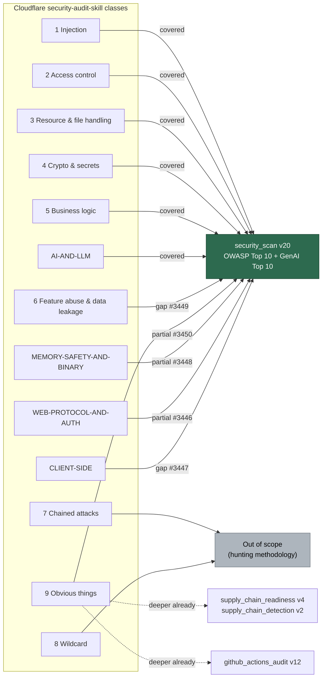

# 🛡️ Cloudflare `security-audit-skill` vs VibeCoder idle-task detection coverage

**Status:** reference gap analysis (part of
[stSoftwareAU/VibeCoder#3440](https://github.com/stSoftwareAU/VibeCoder/issues/3440)).
**Comparison unit:** the set of vulnerability / attack **classes** each side
hunts for. Cloudflare's multi-agent six-phase orchestration is **explicitly out
of scope** — this document compares detection coverage only, not architecture.

This is the routing map for the per-cluster prompt-update sub-issues. It maps
**every** Cloudflare `security-audit-skill` detection class to its VibeCoder
owner and status, so each remaining gap can be closed by updating the prompt of
whichever idle task correctly owns that class — not by piling everything into
one scanner.

## Sources compared

**Cloudflare side** — `skills/security-audit/` in
[`cloudflare/security-audit-skill`](https://github.com/cloudflare/security-audit-skill):

- `ATTACK-CLASSES.md` — the 9 core classes: Injection; Access control;
  Resource & file handling; Cryptography & secrets; Business logic; Feature
  abuse & data leakage; Chained attacks & trust boundaries; Wildcard; Obvious
  things.
- `MEMORY-SAFETY-AND-BINARY.md`, `AI-AND-LLM.md`, `WEB-PROTOCOL-AND-AUTH.md`,
  `CLIENT-SIDE.md` — the 4 target-specific files.

**VibeCoder side** — the security-relevant idle-task prompts (latest versions):

| Idle task | Version | Taxonomy it owns |
| --- | --- | --- |
| `security_scan` | v20 | OWASP Top 10 2025 (A01–A10) + OWASP GenAI / LLM Top 10 2025 (LLM01–LLM10) |
| `supply_chain_readiness` | v4 | Compromise-response posture (15 `SCR-*` checks) |
| `supply_chain_detection` | v2 | Active malicious-dependency signals (12 `SCD-*` checks) |
| `github_actions_audit` | v12 | GitHub Actions / CI workflow hardening (33-check catalogue) |

Status vocabulary: **covered** (VibeCoder already detects the class at or above
Cloudflare's depth), **partial** (the class is named but Cloudflare hunts it
deeper), **gap** (no dedicated VibeCoder detection yet), **out of scope** (a
hunting methodology, not a decidable static detection class).

## Coverage matrix

Every one of the 9 core classes and 4 target files has a row, with an explicit
status, owning idle task, the OWASP category / check it maps to, and — for
gaps / partials — the sibling sub-issue that closes it.

### Core attack classes (`ATTACK-CLASSES.md`)

| # | Cloudflare class | Owner | Status | OWASP mapping | Closing sub-issue |
| --- | --- | --- | --- | --- | --- |
| 1 | Injection | `security_scan` | covered | A05:2025 Injection (SQLi, cmd, LDAP, CRLF, SSTI, XSS) | — |
| 2 | Access control | `security_scan` | covered | A01:2025 Broken Access Control (IDOR, authz, SSRF, path traversal, open redirect, CSRF) | — |
| 3 | Resource & file handling | `security_scan` | covered | A01 path traversal / Zip Slip + A02 XXE + A08 deserialisation / parser confusion | — |
| 4 | Cryptography & secrets | `security_scan` | covered | A04:2025 Cryptographic Failures (weak primitives, IV reuse, hard-coded secrets) | — |
| 5 | Business logic | `security_scan` | covered | A06:2025 Insecure Design (workflow-state abuse, client-trust, missing controls) | — |
| 6 | Feature abuse & data leakage | `security_scan` | gap | A06 Insecure Design — design-lens extension (export-exfil, import-injection, search oracle, webhook-SSRF) | [#3449](https://github.com/stSoftwareAU/VibeCoder/issues/3449) |
| 7 | Chained attacks & trust boundaries | `security_scan` | out of scope | Hunting methodology; chaining lens partly served by A06 business logic | — (see rationale) |
| 8 | Wildcard | — | out of scope | Open-ended creative-hunt methodology, not a decidable static class | — (see rationale) |
| 9 | Obvious things | `security_scan` + supply-chain tasks | partial | Supply-chain touchpoints already **deeper** (A03 + `supply_chain_*`); literal app-sec checks are the gap | [#3450](https://github.com/stSoftwareAU/VibeCoder/issues/3450) |

### Target-specific files

| Cloudflare file | Owner | Status | OWASP mapping | Closing sub-issue |
| --- | --- | --- | --- | --- |
| `AI-AND-LLM.md` | `security_scan` | covered | OWASP GenAI / LLM Top 10 2025 (LLM01–LLM10) | — |
| `MEMORY-SAFETY-AND-BINARY.md` | `security_scan` | partial | A06 Insecure Design names memory safety; lacks Cloudflare's Rust `unsafe` / C / C++ / FFI depth | [#3448](https://github.com/stSoftwareAU/VibeCoder/issues/3448) |
| `WEB-PROTOCOL-AND-AUTH.md` | `security_scan` | partial | A01 + A07 cover authz / authn basics; lacks protocol-depth (smuggling, cache, host-header, JWT / OAuth / OIDC / SAML) | [#3446](https://github.com/stSoftwareAU/VibeCoder/issues/3446) |
| `CLIENT-SIDE.md` | `security_scan` | gap | A05 XSS + A01 open redirect touch the sinks; browser-class depth (DOM clobbering, postMessage, CSWSH, clickjacking, proto-pollution) is the gap | [#3447](https://github.com/stSoftwareAU/VibeCoder/issues/3447) |

## Routing map

## Findings — the rationale this document must record

### Already at or above parity — no action

- **AI / LLM (`AI-AND-LLM.md`) → covered.** Cloudflare's AI classes —
  indirect / tool-argument / direct / delimiter injection, excessive agency,
  unbounded loops, MCP trust, insecure output rendering, system-prompt
  extraction, context bleed — all map cleanly onto `security_scan` v20's OWASP
  GenAI / LLM Top 10 section: prompt injection (LLM01), sensitive-information
  disclosure (LLM02), LLM supply chain (LLM03), improper output handling
  (LLM05), excessive agency (LLM06), system-prompt leakage (LLM07), and
  unbounded consumption (LLM10). VibeCoder additionally enumerates four
  priority surfaces (untrusted issue / comment ingestion, prompt-template
  construction, tool-call / label-security scope, secret handling) gated by a
  deterministic LLM-usage verdict. No gap.
- **Supply chain → covered (deeper).** `supply_chain_readiness` (15 checks),
  `supply_chain_detection` (12 checks), and `security_scan` A03's
  dependency-update quarantine audit together are **deeper** than Cloudflare's
  supply-chain touchpoints, whose "Obvious things" list only checks lockfile
  pinning, published CVEs, and unpinned actions. VibeCoder additionally hunts
  install-time lifecycle scripts, obfuscated payloads, phantom transitive
  dependencies, dormant-republish, publisher-account change, dependency
  confusion, typosquats / slopsquats, and the quarantine-window posture. No
  gap.
- **GitHub Actions → covered (deeper).** `github_actions_audit` v12's 33-check
  catalogue (SHA-pinning, minimal `permissions:`, `pull_request_target`
  privilege creep, OIDC token exposure, runner deprecation, EOL runtimes, and
  more) far exceeds Cloudflare's Actions coverage. No gap.

### Gaps — all land on the app-sec owner (`security_scan`)

Each gap **is** an OWASP application-security class, so each is routed to
`security_scan` — the OWASP app-sec scanner — and tracked by its own
sub-issue:

1. **HTTP-protocol & auth-protocol depth (`WEB-PROTOCOL-AND-AUTH.md`) →
   [#3446](https://github.com/stSoftwareAU/VibeCoder/issues/3446).** Request
   smuggling / desync, cache poisoning / deception, host-header trust, and
   JWT / OAuth / OIDC / SAML / session / password-reset verification depth. A01
   and A07 name the authorisation / authentication classes but do not yet carry
   Cloudflare's protocol-level detection depth.
2. **Client-side / browser classes (`CLIENT-SIDE.md`) →
   [#3447](https://github.com/stSoftwareAU/VibeCoder/issues/3447).** DOM
   clobbering, postMessage origin trust, cross-site WebSocket hijacking (CSWSH),
   clickjacking, reverse tabnabbing, client-side open redirect,
   prototype-pollution gadget chain, and DOM-XSS source → sink tracing. A05 XSS
   and A01 open redirect touch the sinks but not the full browser-class set.
3. **Native / memory-safety detection depth (`MEMORY-SAFETY-AND-BINARY.md`) →
   [#3448](https://github.com/stSoftwareAU/VibeCoder/issues/3448).**
   `security_scan` A06 names memory safety (OOB read / write, use-after-free,
   double free, integer overflow, unsafe FFI) but lacks Cloudflare's detection
   depth for Rust `unsafe`, C / C++, and FFI boundaries.
4. **Feature-abuse & data-leakage design lens (`ATTACK-CLASSES.md` class 6) →
   [#3449](https://github.com/stSoftwareAU/VibeCoder/issues/3449).**
   Export / backup-as-exfil, import / restore-as-injection, search / filter /
   sort oracle, enumeration side-channels, preview / draft leakage, and
   notification / webhook-as-SSRF. These are A06 Insecure Design applied through
   a feature-abuse lens the current prompt does not spell out.
5. **"Obvious things" literal checks (`ATTACK-CLASSES.md` class 9) →
   [#3450](https://github.com/stSoftwareAU/VibeCoder/issues/3450).**
   Security-referencing TODO / FIXME comments, committed secret files,
   `.gitignore` secret coverage, test / seed credentials usable in production,
   exposed debug endpoints, dynamic `eval` / `exec`, and cookie-flag hygiene.
   (Class 9's supply-chain touchpoints are already **deeper** in the
   supply-chain tasks — see above; only these literal app-sec checks are the
   gap.)

### Out of scope by design

- **Wildcard (`ATTACK-CLASSES.md` class 8).** An open-ended, creative-hunt
  methodology — "look for anything the other classes missed". It is not a
  decidable static detection class, so it is intentionally not ported to a
  deterministic static idle task.
- **Chained attacks & trust boundaries (`ATTACK-CLASSES.md` class 7).** A
  hunting methodology (compose individually-low-severity findings into a
  high-severity chain across trust boundaries), not a single decidable class.
  The chaining lens is partly served by `security_scan` A06 business-logic
  detection and by Phase 3's trust-boundary severity recalibration; the
  methodology itself is intentionally not ported.

## Why routing to `security_scan` is correct, not "piling on"

[#3440](https://github.com/stSoftwareAU/VibeCoder/issues/3440) warns against
piling everything into `security_scan`. The routing above is the opposite of
piling on:

- **Supply-chain concerns stay in the supply-chain tasks.** `supply_chain_*`
  own dependency and compromise-response detection; nothing from the gap list
  is routed there because those tasks are already deeper than Cloudflare.
- **Workflow concerns stay in the actions task.** `github_actions_audit` owns
  CI / workflow hardening; again, nothing is re-routed to it.
- **Every remaining gap is an OWASP application-security class, and
  `security_scan` is the OWASP app-sec scanner.** HTTP / auth-protocol depth,
  client-side browser classes, native memory-safety depth, feature-abuse design
  lens, and the literal "obvious things" checks are all application-security
  classes that fit `security_scan`'s existing OWASP taxonomy. Checked against
  `prompts/` — no better-fitting template exists, so no new idle task is
  warranted.

Routing each gap to the task that already owns its taxonomy keeps each scanner
single-purpose. That is exactly what this analysis confirms is already the case
for supply chain and GitHub Actions, and what the five sub-issues extend for the
application-security classes.

## Cross-links

- Parent gap-analysis epic:
  [stSoftwareAU/VibeCoder#3440](https://github.com/stSoftwareAU/VibeCoder/issues/3440)
- Cloudflare skill:
  [cloudflare/security-audit-skill](https://github.com/cloudflare/security-audit-skill)
- Sibling per-cluster prompt-update sub-issues:
  [#3446](https://github.com/stSoftwareAU/VibeCoder/issues/3446) ·
  [#3447](https://github.com/stSoftwareAU/VibeCoder/issues/3447) ·
  [#3448](https://github.com/stSoftwareAU/VibeCoder/issues/3448) ·
  [#3449](https://github.com/stSoftwareAU/VibeCoder/issues/3449) ·
  [#3450](https://github.com/stSoftwareAU/VibeCoder/issues/3450)
- VibeCoder prompts audited: `prompts/security_scan/v20.md`, <!-- pinned: audit record — the exact prompt version assessed -->
  `prompts/supply_chain_readiness/v4.md`, <!-- pinned: audit record — the exact prompt version assessed -->
  `prompts/supply_chain_detection/v2.md`, <!-- pinned: audit record — the exact prompt version assessed -->
  `prompts/github_actions_audit/v12.md` <!-- pinned: audit record — the exact prompt version assessed -->
