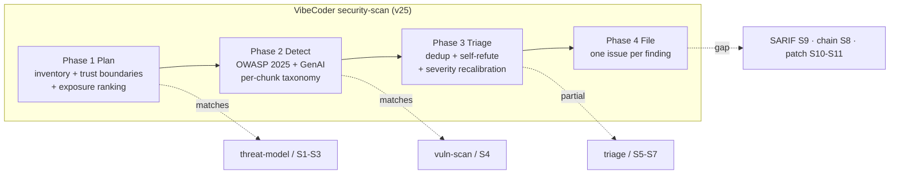
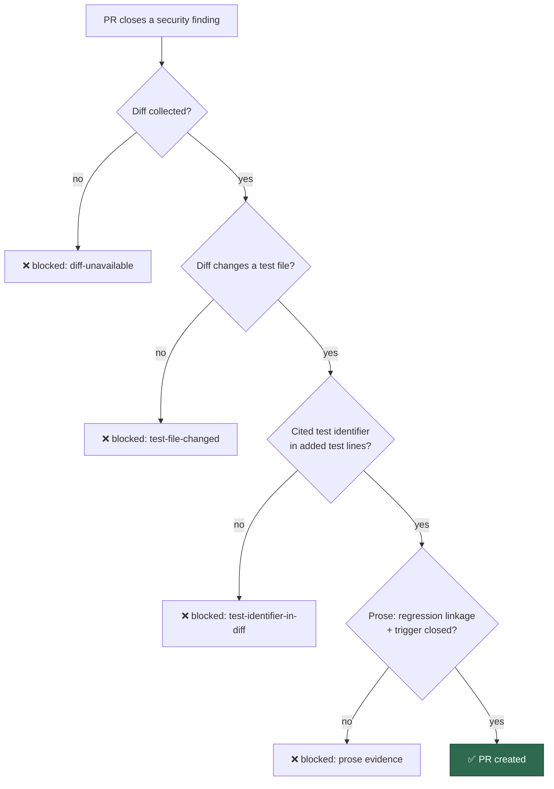

# 🔬 Idle-task scans vs Anthropic & Visa agentic security harnesses — gap analysis

**Status:** reference gap analysis (absorbs the twin Visa question, closed as folded in).

**Comparison axis:** *methodology and pipeline architecture* — threat
modelling, multi-stage false-positive triage, and patch verification. This is
the **static side only**. Anthropic's dynamic sandboxed fuzz/ASAN track and its
detection-and-response (D&R) log-hunting track are **explicitly out of scope**
per the issue.

This document is the companion to
[`cloudflare-security-audit-gap-analysis.md`](cloudflare-security-audit-gap-analysis.md),
which compares detection **classes** and deliberately excludes architecture.
This one is the opposite axis: it takes our detection coverage as given and asks
whether our *pipeline* — how we scope, verify, rank, emit, and validate fixes —
has fallen behind the two published agentic harnesses.

Our repos are Deno / bash / Rust and our scans are **issue-only** (detect → file
an issue → the fix rides the normal `work-on` pipeline; a scan never opens a
PR). Harness ideas therefore transfer in **shape**, not tooling — every adopted
gap stays per-repo; nothing centralises a gate.

## Sources compared

**Anthropic** — [`anthropics/defending-code-reference-harness`](https://github.com/anthropics/defending-code-reference-harness):
interactive skills `/threat-model`, `/vuln-scan`, `/triage` (with `--auto` and
`--votes`), `/patch`, `/customize`, plus the autonomous seven-stage
`vuln-pipeline` (Build → Recon → Find → Verify → Dedupe → Report → Patch). The
Build/Find/Verify crash-reproduction stages and the `dnr_harness/` track are the
**dynamic** side we exclude.

**Visa VVAH** — [`visa/visa-vulnerability-agentic-harness`](https://github.com/visa/visa-vulnerability-agentic-harness):
a four-phase, eleven-stage static SAST pipeline —

- **Phase 1 Discovery & Modelling (S1–S3):** attack-surface map → STRIDE/OWASP
  threat model in business context → prioritised hunting strategy.
- **Phase 2 Deep Dive & Verification (S4–S6):** specialised-lens research →
  deterministic + optional semantic pre-filter → **adversarial verification**.
- **Phase 3 Synthesis & Reporting (S7–S9):** dedup → **exploit-chain**
  construction → **SARIF 2.1.0** emission.
- **Phase 4 Remediation & Validation (S10–S11):** remediation playbooks →
  **adversarial validation panel** scoring the fix.

VVAH's whole 11-stage pipeline is static (no sandboxed execution), so it counts
as in-scope; its S10–S11 remediation/validation maps to our patch-verification
scope.

**VibeCoder** — the 15 idle-task scan templates in
[`worker/deno/lib/idle_task_templates/`](../../worker/deno/lib/idle_task_templates/).
The security-relevant methodology lives chiefly in `security-scan`
(`prompts/security_scan/`, a four-phase Plan → Detect → Triage → File
audit); the false-positive-triage gap generalises to every LLM-driven scan
(`best-practices`, `test-audit`, `documentation-audit`).

## How our four phases already map to the harnesses

Our `security-scan` is not starting from zero — most of the harness *shape* is
already present:

| Harness capability | VibeCoder status | Where |
| --- | --- | --- |
| Threat-model-first scoping ("aim before you shoot") | **covered** | Phase 1 inventories entry points, trust boundaries, and ranks chunks by exposure band |
| Threat-model cuts severity/false positives | **covered** | Phase 3 recalibrates severity by the Phase 1 exposure band |
| Multi-lens detection (crypto, access-control, logic, IaC, client, LLM) | **covered** | Phase 2 taxonomy sweeps every OWASP 2025 + GenAI class, HTTP/auth depth, client-side, and feature-abuse design lens |
| Deterministic dedup by root cause | **covered** | Phase 3 collapses shared-root-cause candidates; stable `SEC-<hex>` id dedups across runs |
| Adversarial verification | **delivered** | Phase 3 self-refutes (same-context), then an *independent* fresh-context verifier re-checks high/critical findings — G1 delivered |
| Semantic/consensus false-positive reduction | **delivered** | severity-gated N-vote consensus (default N = 3) for high/critical findings — G1 delivered |
| Structured machine-readable output (SARIF) | **gap** | issues only — see G2 |
| Exploit-chain construction | **gap** | findings filed individually — see G3 |
| Fix validation (original trigger closed, no bypass, tests pass) | **delivered** | the completion phase (`lib/phases/completion_phase.ts`) runs a per-repo security-fix patch-verification gate (`security_fix_gate.ts`) — G4 delivered, diff-backed since, wired into the live phase by |
| Dynamic fuzz/ASAN crash reproduction | **out of scope** | static side only (issue scope) |
| D&R log-corpus attacker hunting | **out of scope** | static side only (issue scope) |

## Gaps and recommendations

Each gap below is a distinct root cause. Adopt-worthy gaps get one follow-up
issue (deduplicated against open issues, at most one per root cause,
); skipped gaps are recorded here with rationale so they are not
re-attempted.

### G1 — Independent adversarial verification / consensus voting — **ADOPT**

**Both harnesses' central false-positive control is an *independent* verifier.**
Anthropic's `/triage --votes` runs multiple model calls and its pipeline Verify
stage is a *separate grader agent*; VVAH's S6 adversarial reviewer and
multi-agent deterministic voting are a distinct stage from S4 detection.

Our Phase 3 step 4 already refutes each surviving candidate — but the prompt
itself flags the weakness: *"Detection (Phase 2) and triage (Phase 3) run in the
same agent context, so a plausible-but-wrong candidate can survive on the
strength of its own framing — the detector's confirmation bias leaking into the
verdict."* A single hostile self-re-read in the same context cannot fully shed
that bias.

**Adopt:** add an *independent* second-pass verification (a fresh context /
sub-agent that never saw the detection reasoning, defaulting to "refute unless
proven"), optionally N-vote consensus for high/critical findings, gating a
finding before it is filed. This is the highest-value transfer and generalises
to the other LLM scans. → **delivered**: `security-scan` Phase 3
now runs a severity-gated independent verification / consensus-voting step
(step 6) — see the `security_scan` prompt (`prompts/security_scan/`). High and
critical findings are re-checked by N independent verifiers (default `N = 3`)
in a fresh context that never saw the Phase 2 detection reasoning, each
refuting-unless-proven; a finding survives only when a majority cannot refute
it. Low/medium findings stay single-pass (cost-aware). Verifiers inherit the
read-only, static-only Hard Constraints.

### G2 — Machine-readable SARIF 2.1.0 output + code-scanning loop — **ADOPT**

VVAH's S9 emits **SARIF 2.1.0**; findings carry CWE ids. We emit only GitHub
issues — yet we *already consume* GitHub code-scanning alerts via the
`alert-feed` template. Emitting our own findings as SARIF and uploading them to
code scanning would close that loop (dedup against tool alerts, unified triage
UI, CWE tagging) with no new detection work.

**Adopt:** emit SARIF for `security-scan` findings, tag each with a CWE id, and
upload to GitHub code scanning (per-repo,). → **follow-up filed.**

### G3 — Vulnerability chaining / combined exploit-path finding — **ADOPT**

VVAH's S8 constructs exploit chains and CWE relationships; Anthropic's Report
stage writes the escalation path. We file each finding in isolation, so two
individually-medium findings that compose into a critical path (e.g. an open
redirect feeding an SSRF, or a leaked debug endpoint feeding an auth bypass) are
never reported as the higher-severity chain they form.

**Adopt:** add a chaining pass to Phase 3 that, when multiple findings share a
reachable data/trust path, files one combined exploit-chain finding at the
composed severity, cross-linking its constituents. → **follow-up filed.**

### G4 — Security-fix patch-verification gate — **ADOPT**

Anthropic's `/patch` validates a fix on four criteria (compiles, original PoC no
longer triggers, tests pass, a fresh find agent cannot bypass); VVAH's S11
adversarial validation panel scores the fix before adoption. Our scans are
detect-only and the fix rides the normal `work-on` PR — but that PR has **no
vulnerability-specific gate**: nothing guarantees a regression test reproduces
the flaw, nor that the original trigger is actually closed (the static analogue
of "PoC no longer fires / no bypass").

**Adopt:** require any PR that closes a `security`-labelled finding to add a
regression test that fails against the unfixed code and to demonstrate the
original trigger is closed with no trivial bypass. Fits our TDD standard and the
"fail loud" principle. → **delivered**:
the completion phase now runs a lightweight patch-verification gate
(`security_fix_gate.ts`). The gate activates when the PR closes a security
finding (the issue carries the `security` label, or the PR summary references a
`SEC-<hex>` finding id) and blocks PR creation unless the summary shows both a
**regression test** (fails against the unfixed code, passes after the fix) and
that the **original trigger is closed** with no trivial bypass — static
reasoning over the changed code path, no execution. Per-repo; opt
out with the `skip_security_fix_check` repo config.

**Hardened**: the gate's *decisive* evidence is now machine-checkable
against the branch diff rather than the agent's own prose. Deciding a security
outcome by regex over a summary the same agent authored is
[LLM09:2025 Misinformation](https://genai.owasp.org/llmrisk/llm092025-misinformation/) —
worse, the required phrases are published in the gate's own source, and the
finding body that steers the summary is untrusted input. The gate therefore also
requires that the diff **adds or modifies a test file** and that a **test
identifier named in the summary actually appears** in the added lines of that
test diff (`security_fix_diff.ts` runs `git diff` only — still no execution).
The prose requirements are retained as a human-review aid, not as the gate. If
the diff cannot be computed at all, the PR is blocked rather than assumed good.

### Skipped gaps (recorded, not adopted)

| Gap | Harness origin | Why skip |
| --- | --- | --- |
| Dynamic sandboxed fuzz / ASAN crash reproduction | Anthropic Build/Find/Verify | Out of scope — issue is static-side only; also mostly a C/C++ memory-safety concern, not our Deno/bash/Rust surface |
| Detection & response (log-corpus attacker hunting) | Anthropic `dnr_harness/` | Out of scope — issue is static-side only |
| Per-lens specialist *agents* (separate crypto/logic/IaC agents) | VVAH S4 | Our single-agent Phase 2 taxonomy already covers every lens at class depth; splitting into per-lens agents is an architecture cost with marginal recall gain. The verification benefit is captured better by G1 |
| Remediation playbooks per CWE–language–framework triple | VVAH S10 | Our fix suggestions are already contextual and Deno-native-aware; a static playbook library is high-maintenance for modest gain |
| Persisted per-repo `THREAT_MODEL.md` artifact | Anthropic `/threat-model` | Our Phase 1 already implements threat-model-first *in-context* each run; persisting adds state and staleness risk for modest benefit. Revisit only if scan cost becomes the bottleneck |
| STRIDE / business-context threat modelling | VVAH S2 | Partially covered by our exposure-band ranking; deeper STRIDE labelling is marginal for our internal repos and better folded into G1's verification lens than run standalone |

## Summary

Our `security-scan` already implements the harnesses' *front half* — threat-model
scoping, multi-lens detection, root-cause dedup, and severity recalibration — at
comparable depth. The genuine gaps are all on the **verification, emission, and
remediation** side:

1. **G1** — independent adversarial verification / voting (biggest win). ✅ **delivered**.
2. **G2** — SARIF emission + code-scanning loop.
3. **G3** — exploit-chain construction.
4. **G4** — security-fix patch-verification gate. ✅ **delivered**.

Four follow-up issues track these; the dynamic and D&R tracks stay out of scope.
