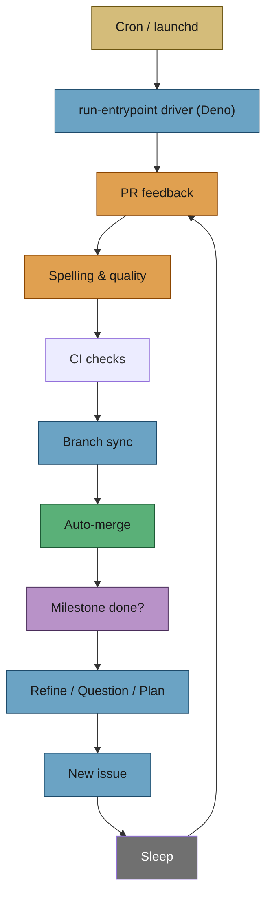
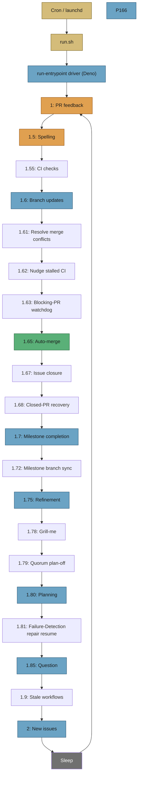
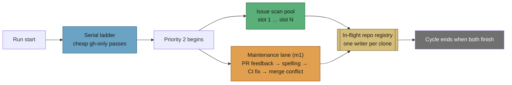
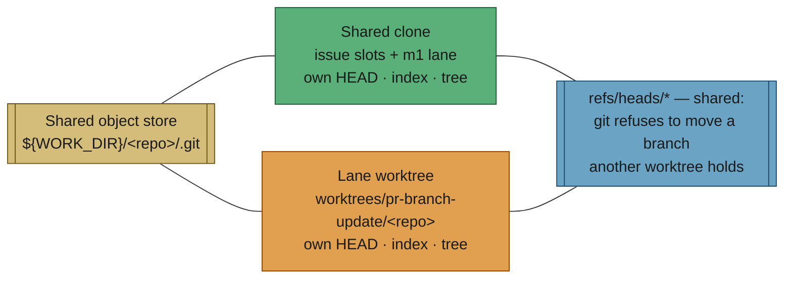

  

# 📋 Workflow — Vibe Coder (user manual)

This section is the **user manual** for the Vibe Coder: how to use it and what
to expect. It describes the workflow from a user’s perspective — how the
appliance behaves, how you interact with it via GitHub (issues, labels,
comments, PRs), and how it self-heals and runs alongside other workers and
humans. For implementation details (scripts, modules, internals), see **Further
reading** at the end of each workflow doc; those are for a different audience.

---

## 👤 For repo owners and developers (e.g. ST)

If your repository is monitored by the Vibe Coder — for example
[stSoftwareAU/private-repo-24](https://github.com/stSoftwareAU/private-repo-24/issues) or any other repo
in the worker's config — this manual is for you. You want to **get the Vibe
Coder to work on your issues** (e.g. over the weekend) so you can **come in on
Monday and see lots of work done** in your repos. You care about **how to assign
work** and **how to set up pseudo-projects**, not how the worker is implemented
under the hood (that is documented elsewhere). **Nothing reaches the default
branch without your review** — the worker opens PRs; you approve. It is
instructed to follow TDD (Test-Driven Development), KISS (Keep It Simple), DRY
(Don't Repeat Yourself) and the full quality gate; see
[AGENTS.md](../../AGENTS.md) for the coding standards.

**How to get work done:**

| Goal                              | What to do                                                                                                                                                                                                                                                                                                | Where it's explained                                                                   |
| --------------------------------- | --------------------------------------------------------------------------------------------------------------------------------------------------------------------------------------------------------------------------------------------------------------------------------------------------------- | -------------------------------------------------------------------------------------- |
| **Understand the label flow**     | Read the journey map: `grill-me` ↔ `needs-human`, then `planning` or a work tier, then PRs / milestones / auto-merge — with coloured diagrams.                                                                                                                                                            | **[Label Flows](label-flows.md)**                                                      |
| **Get issues picked up** | Add a configured label to an issue and leave it unassigned. Label tiers in priority order: `top-priority` > `work-on` (allowed authors only) > `low-priority` (fallback) > `idle-task` (worker-filed only). The deprecated `help wanted` and `claude` labels were retired in. | [Issue processing](issue-processing.md) |
| **Group issues into a feature**   | Create a GitHub milestone, add it to each issue. Per-issue PRs auto-merge into the milestone branch (quality gate passes), so the worker can **safely** run 24/7 (e.g. overnight/weekend). **No code reaches default without your review** — you approve the **one final PR** with many issues completed. | [Projects and dependencies](projects-and-dependencies.md), [Milestones](milestones.md) |
| **Order work (dependencies)** | In the issue body, add `Depends on ` or `Blocked by `. The worker only picks issues whose dependencies are closed. | [Projects and dependencies](projects-and-dependencies.md) |
| **Break down a big issue**        | Add the `planning` label; the worker will create sub-issues and close the parent.                                                                                                                                                                                                                         | [Planning and questions](planning-and-questions.md)                                    |
| **Get answers without code** | Add the `question` label; the worker posts an answer in a comment, removes `question`, and adds `needs-human` to mark your turn. Re-add `question` to ask a follow-up. | [Planning and questions](planning-and-questions.md) |
| **Refine an issue with feedback** | Add the `refine-issue` label and comment; the worker will update the issue from your feedback.                                                                                                                                                                                                            | [Planning and questions](planning-and-questions.md)                                    |
| **PRs stay mergeable**            | The worker monitors PRs it opens (by author), fixes spelling/quality and merge issues, and enables auto-merge when mergeable.                                                                                                                                                                             | [PR feedback and upkeep](pr-feedback.md)                                               |

**How it's done internally** (run loop, issue selection, claiming, PR
monitoring, milestone handling) is **not** the focus of these documents. That is
documented in the project's internal/architecture docs — see the main
[README](../../README.md#documentation) and **Further reading** at the end of
each workflow page.

---

## ⚡ TL;DR

**One loop, many queues.** Cron (or launchd) starts the worker; it runs a single
loop that checks work in **priority order**: PR (Pull Request) feedback (1),
spelling (1.5) and CI fixes (1.55) first, then branch updates (1.6),
merge-conflict resolution (1.61), CI nudges
and the blocking-PR watchdog (1.62, 1.63), auto-merge (1.65), issue closure
(1.67), closed-PR recovery (1.68), milestone completion and branch sync (1.7,
1.72), refinement (1.75), grill-me (1.78), quorum (1.79), planning (1.80),
the Failure-Detection repair resume (1.81), questions (1.85), stale-workflow
detection (1.9), and finally new issues (2,
oldest first across all repos). The table below is the canonical ladder; the
dispatch table in `worker/deno/lib/run_core.ts` is the source of truth and a
test keeps the two in step. With `max_concurrent_issues` above `1` the four
agent-backed PR passes (1, 1.5, 1.55, 1.61) run in a
[maintenance lane](#-maintenance-lane-agent-backed-pr-passes-beside-the-pool)
beside the issue pool rather than ahead of it, so a long CI fix no longer idles
the slots. One work item per iteration, then sleep and repeat. All
interaction is via GitHub — no local UI (User Interface). When the same item
fails repeatedly, the process exits so the next cron run gets fresh code.

**Short attention span?** Every doc in this folder starts with a **TL;DR** and a
diagram — scroll to the table below, pick a topic, and you’ll get the gist in
seconds. The rest of each doc is the full detail when you need it.

For configuration, deployment, and security, see the
[main documentation](../../README.md#documentation). For how the worker is
implemented internally, see **Further reading** in each workflow doc.

## 📋 Table of Contents

- [For repo owners and developers (e.g. ST)](#for-repo-owners-and-developers-eg-st)
- [TL;DR](#tldr)
- [Workflow document set](#workflow-document-set)
- [Lifecycle overview](#lifecycle-overview)
- [Shared invariants](#shared-invariants)
- [Related documentation](#related-documentation)

## 📚 Workflow document set

Each workflow or topic is assigned to a dedicated document:

| Topic                                              | Document                                                       | Description                                                                                                                                              |
| -------------------------------------------------- | -------------------------------------------------------------- | -------------------------------------------------------------------------------------------------------------------------------------------------------- |
| **Overview and lifecycle**                         | This file (`README.md`)                                        | Canonical overview, shared concepts, lifecycle map, terminology                                                                                          |
| **Label flows (which label when)**                 | [label-flows.md](label-flows.md)                               | Shareable journey guide: grill-me, needs-human, planning, work tiers, milestones, auto-merge — coloured diagrams                                         |
| **Issue → PR implementation**                      | [issue-processing.md](issue-processing.md)                     | Flow from issue discovery through branch, Claude, quality gate, and PR creation                                                                          |
| **PR feedback and upkeep**                         | [pr-feedback.md](pr-feedback.md)                               | Review feedback loop, spelling fixes, branch updates, auto-merge catch-up                                                                                |
| **CI fix**                                         | [ci-fix.md](ci-fix.md)                                         | Automatic diagnosis and fix of CI check failures on open PRs                                                                                             |
| **Merge-conflict resolution** | [merge-conflicts.md](merge-conflicts.md) | Real merge of the base into a `CONFLICTING` PR — both sides survive — with the `merge-conflict` label, attempt bounds and `needs-human` escalation |
| **Planning, questions, refinement, clarification** | [planning-and-questions.md](planning-and-questions.md)         | Clarification phase (clear? small enough? too large → planning): question label, planning label, refine-issue                                            |
| **Grill-me clarification (vague issues)**          | [grill-me.md](grill-me.md)                                     | Iterative, mobile-friendly back-and-forth that scopes vague issues into a clean requirement, then recommends the developer apply `planning` or `work-on` |
| **Resilience and concurrency**                     | [resilience-and-concurrency.md](resilience-and-concurrency.md) | Self-healing, restart model, issue claiming, multi-worker coexistence, one PR per target branch                                                          |
| **Projects and dependencies**                      | [projects-and-dependencies.md](projects-and-dependencies.md)   | Milestones as projects, issue relationships, dependencies, sub-issues, corner cases (e.g. deadlock)                                                      |
| **Milestones**                                     | [milestones.md](milestones.md)                                 | One PR per target branch, milestone branch flow, final consolidation PR                                                                                  |
| **Worked example (storyboard)**                    | [WORKED-EXAMPLE.md](WORKED-EXAMPLE.md)                         | End-to-end storyboard: planning → `work-on` → milestone → final consolidation PR, with screenshots                                                       |

## 🔄 Lifecycle overview

The worker runs a single long-lived loop per process. Each iteration checks work
queues in **priority order** and processes at most one item; then it sleeps and
repeats until the run duration expires or the process exits (e.g. after
consecutive failures).

**Priority order (highest to lowest):**

| Priority | Task                                                  | Details                                                                                                                                  |
| -------- | ----------------------------------------------------- | ---------------------------------------------------------------------------------------------------------------------------------------- |
| 1        | PR feedback and reviews                               | Authorised commenters or thumbs-up                                                                                                       |
| 1.5      | Failed spelling/quality checks                        | Spelling, shellcheck, Deno quality checks on open PRs                                                                                    |
| 1.55 | Failed CI (Continuous Integration)/integration checks | General CI failures on open PRs |
| 1.6      | PR branch updates                                     | Rebase/merge to keep branches current                                                                                                    |
| 1.61 | Resolve PR merge conflicts | Merge the base into a `CONFLICTING` PR for real — both sides survive, never a side-pick; labels the PR `merge-conflict`, bounded to two attempts before `needs-human` |
| 1.62 | Nudge stalled CI | Re-trigger checks on Vibe Coder PRs idle more than 5 minutes; claims nothing |
| 1.63 | Blocking-PR stall watchdog | Detect and escalate PRs that block `work-on` issues; the fixes stay with 1.55 and 1 |
| 1.65     | Auto-merge catch-up                                   | Enable auto-merge on mergeable PRs                                                                                                       |
| 1.66     | Branch cleanup                                        | Delete branches for merged PRs — runs once at start-up, not every cycle                                                                 |
| 1.67     | Issue closure                                         | Close issues for merged PRs via GH CLI                                                                                                   |
| 1.68 | Closed-PR recovery | Recover assigned issues with closed-without-merge PRs |
| 1.7      | Milestone completion                                  | Final consolidation PR                                                                                                                   |
| 1.72     | Milestone branch sync                                 | Merge the default branch into open `milestone/*` branches; claims nothing                                                                |
| 1.75     | Issue refinement                                      | `refine-issue` label                                                                                                                     |
| 1.78 | Grill-me clarification | `grill-me` label — runs before planning so a freshly-grilled issue is not also planned in the same pass |
| 1.79 | Quorum plan-off | `quorum` label — decides what the plan is before planning splits it |
| 1.80     | Planning                                              | `planning` label                                                                                                                         |
| 1.81 | Failure-Detection repair resume | `needs-failure-detection-repair` label — re-gates a planning parent's sub-issues and finishes the outstanding repairs |
| 1.85     | Question answering                                    | `question` label                                                                                                                         |
| 1.9      | Stale workflow detection                              | Flag `planning` / `question` labels left in place with no progress                                                                       |
| 2 | New implementation issues | Configured-label tier `top-priority` then `work-on`, globally oldest across repos (`help wanted` / `claude` retired) |
| 2.5 | Low-priority backlog | `low-priority` label — only consulted when no eligible higher-tier candidate exists in any scanned repo |
| 2.9 | Idle-task framework | `idle-task` label — strictly below low-priority; the only label the Vibe Coder may self-apply |
| Idle     | Security scan                                         | Fired after a full cycle ends with no claimable work in any monitored repo. See [Security Scans — Operator Manual](../SECURITY-SCAN.md). |

## 🛠️ Maintenance lane (agent-backed PR passes beside the pool)

The ladder above is a **serial** order, and that used to include the passes that
launch a full Claude agent against an open PR. One CI fix with a 30-minute
budget therefore held every issue slot idle before the Priority-2 pool had even
started — the slots that exist to run work concurrently sat doing nothing for up
to half the cycle.

With `max_concurrent_issues` above `1`, the four agent-backed PR passes — PR
feedback (1), spelling (1.5), CI fix (1.55) and merge-conflict resolution (1.61)
— are deferred out of the serial ladder and run in a **maintenance lane**
alongside the pool instead. The lane is a single extra agent, not a second pool:
one pass at a time, in priority order. The cheap `gh`-only passes (branch
updates, auto-merge, issue closure, milestone sync, …) stay serial — they are
measured in seconds, and running them first gives the pool's first scan
freshly-updated branch and merge state.

What makes the concurrency safe is the **repository lease**. Every flow — a
slot's issue run and a maintenance pass alike — checks out into the single
per-repo clone `${WORK_DIR}/<repo>`, and repo setup opens with `reset --hard`
plus `clean -fd`, so two writers in one working tree would destroy each other's
work. Each pass therefore leases its repository from the pool's own in-flight
registry before it touches the clone:

- a repository a slot already holds is refused, and the pass defers to the next
  cycle (`Deferring CI fix: an issue slot holds the repository`);
- a repository the lane holds is in the pool's exclusion set, so no slot claims
  an issue there while the pass runs.

The lane logs under an `[m1]` prefix and appears in the status line as
`m1 owner/repo#<pr>` — that number is a **PR**, not a claimed issue, so the
finder's claim-shaped views and the shutdown drain both skip it. The
leaked-heartbeat sweep does **not** skip it (Issue #391): the lane takes a real
heartbeat for the PR it is servicing, so the sweep reads `heldHeartbeatKeys()`
— every hold that owns a heartbeat, keyed `issue:<n>` or `pr:<n>` so the two
namespaces cannot alias — and a live merge-conflict resolution keeps its
heartbeat while an issue slot claims elsewhere. A shutdown bounds the lane
exactly as it bounds the pool: no new pass starts once SIGTERM lands, and a pass
still running after `slot_drain_grace_seconds` is abandoned with its agent
terminated rather than holding the exit open.

### Per-lane worktrees (Issue #394)

The lease covers the passes that lease. The **Priority-1.6 branch-update pass**
does not: it is a cheap `gh`-plus-git pass in the serial ladder, and it used to
call the same destructive repo setup on `${WORK_DIR}/<repo>` while a slot or the
lane was working there. Live, that produced two failures 15 seconds apart — an
OPEN PR whose branch sat healthily on origin reported as
`pathspec … did not match any file(s) known to git`, and a PR that could not be
updated at all because an issue slot had left two unpushed commits on its branch
in the shared clone.

That pass now works in its **own linked worktree**,
`${WORK_DIR}/worktrees/pr-branch-update/<repo>`, added detached off the shared
clone. It shares the object store — no re-clone, no extra objects — and gets its
own `HEAD`, index and checkout, so no other lane can move the tree underneath
it. It no longer runs `reset --hard` / `clean -fd` on the shared clone at all:
the clone is created only when genuinely missing.

Refs stay shared, and that is deliberate: git refuses to move a branch another
worktree has checked out rather than pulling it out from under that lane. Those
refusals — and the Issue #211 refusal to judge a PR from a local branch carrying
unpushed commits — are **clone contention**, not PR faults. The pass names them
as such: they are logged at INFO saying the clone changed under the operation
and the PR was left exactly as it is, counted as `deferred (clone held by
another lane)` rather than `failed`, kept out of the Issue #335 failure streak
so they can never escalate an issue against a healthy PR, and retried next
cycle.

`${WORK_DIR}/worktrees` is a reserved work-root name, so the stale-work-dir
sweep never mistakes it for a disposable clone. The startup orphan-worktree
sweep may still reclaim a lane worktree that has sat untouched for
`WORKTREE_MAX_AGE_HOURS` (24h) — it runs before any lane starts, and the next
pass recreates the worktree on demand.

Agent passes that run from the work-dir root rather than a repo clone —
refinement (1.75), grill-me (1.78), quorum (1.79), planning (1.80), questions
(1.85) — stay serial. They take no repository lease, so there is nothing to
exclude a slot from, and a laned planning run could hand a freshly-labelled
issue to a slot it is still working on.

At `max_concurrent_issues: 1` there is no pool to run beside, so every pass
stays in the serial ladder and behaviour is unchanged.

One consequence for reading telemetry: the `cycle-timings` line reports each
step's own wall time, and the lane's steps now overlap `Issue Scanning`. The
per-step figures therefore sum to **more** than `total=` on a busy cycle — that
overlap is the fix working, not double counting.

## 📏 Shared invariants

These behaviours are required for the workflow:

- **GitHub-only interaction** — All user interaction is via GitHub: issues,
  comments, labels, reviews, PRs. The worker never waits on local or manual UI.
- **Unattended operation** — The worker runs on unattended machines; no human is
  present to intervene during a run. Reporting to users must happen on GitHub
  (comments, labels), not only in logs.
- **Self-healing** — The system must recover from: crashed runs, stale repo
  state, partial edits, disk pressure, stuck processes, and repeated failures on
  the same work item (exit for restart).
- **Safe concurrency** — Multiple workers and humans may act on the same repos.
  Claiming, tie-breaking, idempotency, and back-off rules are documented and
  followed.
- **Shared GitHub user, one Vibe Coder per host** — The same GitHub user (e.g.
  stsvcbot) is often used by **many** Vibe Coders; there is **one Vibe Coder
  per hostname**. PRs are identified by **author** (that user); any worker using
  that account sees the same set of open PRs. See
  [pr-feedback.md](pr-feedback.md#which-prs-are-monitored).
- **Distinct workflow types** — Implementation, planning, question answering,
  refinement, clarification, PR feedback, spelling/quality fixes, and milestones
  each have defined semantics and do not substitute for one another.
- **Workflow labels auto-created** — All workflow labels (e.g. `failed-once`,
  `failed`, `needs-human`, `circular-dependency`) are
  **automatically created** when first needed, with **consistent colours and
  descriptions** across repositories. See
  [projects-and-dependencies.md](projects-and-dependencies.md#workflow-labels).
- **Worker escalation via `needs-human`** — When the worker hits an
  unrecoverable blocker (e.g. a decision only a human can make, or a missing
  credential), it adds the `needs-human` label, posts an explanatory comment,
  and stops. Discovery **skips any issue with `needs-human`** on every
  subsequent scan until a human removes the label. The worker **never**
  self-applies `top-priority`, `work-on`, or any other reserved workflow label —
  `needs-human` is its only escalation channel. See
  [issue-processing.md](issue-processing.md#-worker-escalation-via-needs-human)
  and [USAGE.md](../USAGE.md#-worker-escalation-via-needs-human).

### 🤖 Invariants for agents

When implementing or validating the worker, enforce:

1. **No local UI** — Never block on stdin, dialogs, or local user input; all
   triggers come from GitHub API state.
2. **Unattended-safe** — Startup and loop must complete without human presence;
   config from `.config.json` and env only.
3. **Self-heal on failure** — Repo reset on start; disk cleanup at threshold;
   consecutive same-item failures cause process exit for external restart.
4. **Claim before work** — For issue-based work (implementation, planning,
   question, refinement), the worker must claim the issue (assign self, verify,
   resolve contention) before performing work.
5. **One workflow type per item** — An issue is either implementation,
   refinement, planning, or question; PRs are feedback or spelling or upkeep; do
   not mix semantics.

## 📖 Related documentation

These existing docs remain the source of truth for their areas:

| Area                                             | Document                                                      |
| ------------------------------------------------ | ------------------------------------------------------------- |
| Configuration                                    | [CONFIGURATION.md](../CONFIGURATION.md)                       |
| Deployment (cron, systemd, launchd, logs)        | [DEPLOYMENT.md](../DEPLOYMENT.md)                             |
| Usage (labels, clarification, failure handling)  | [USAGE.md](../USAGE.md)                                       |
| Security (threat model, tokens)                  | [SECURITY.md](../../SECURITY.md)                              |
| Worker label policy (worker-added vs human-only) | [README.md](../../README.md#-supported-labels)              |
| Extending (Deno, prompts)                        | [EXTENDING.md](../EXTENDING.md)                               |
| Worker internals (run loop, selection, PRs)      | [INTERNALS.md](../INTERNALS.md)                               |
| Troubleshooting                                  | [TROUBLESHOOTING.md](../TROUBLESHOOTING.md)                   |
| Security scans (idle)                            | [SECURITY-SCAN.md](../SECURITY-SCAN.md)                       |
| Upstream CVE/GHSA triage                         | [security-advisory-triage.md](../security-advisory-triage.md) |
