# 🖼️ Worked example: Planning → work-on → milestone → consolidation (storyboard)

**In one line:** One planning issue on your phone → sub-issues → milestone → worker runs through them (quality gate on every PR — Pull Request) → **one final PR** to the default branch for you to review. No code reaches default without that review.

Screenshots for each major step show the full workflow: planning, implementation, optionally a **review cycle** on each milestone-issue PR (steps 5–7), and — because those PRs auto-merge into the milestone branch — the **one final PR** to default. **Your review of that final PR is required**; nothing reaches the default branch without it. Milestones let the Vibe Coder **safely** work many issues overnight or over the weekend.

**Typical timeline:** Create the issue and set the milestone (e.g. Friday) → worker runs unattended → one final PR to review (e.g. Monday).

---

## Step 1 — Issue created on phone and labelled "planning"

Create an issue (e.g. from your phone), add the `planning` label. The worker will pick it up and break it into sub-issues.

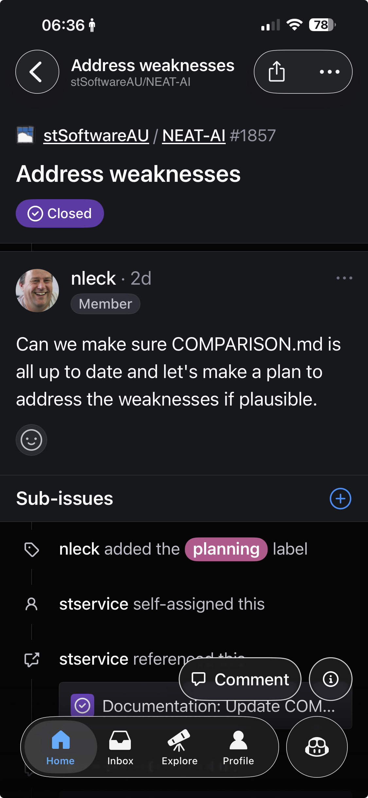

---

## Step 2 — Planning complete, issue closed

The worker has created sub-issues and closed the parent. Here’s what that looks like.

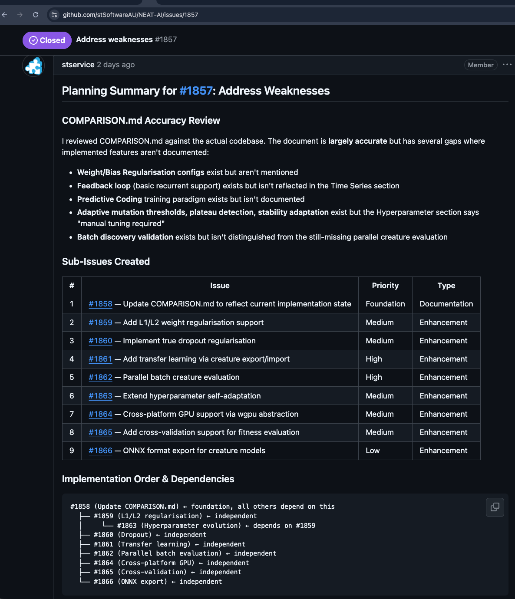

---

## Step 3 — Issues reviewed, labelled "work-on" and milestone set

You’ve reviewed the sub-issues, added the `work-on` label, and set a milestone so they’re grouped into one feature branch.

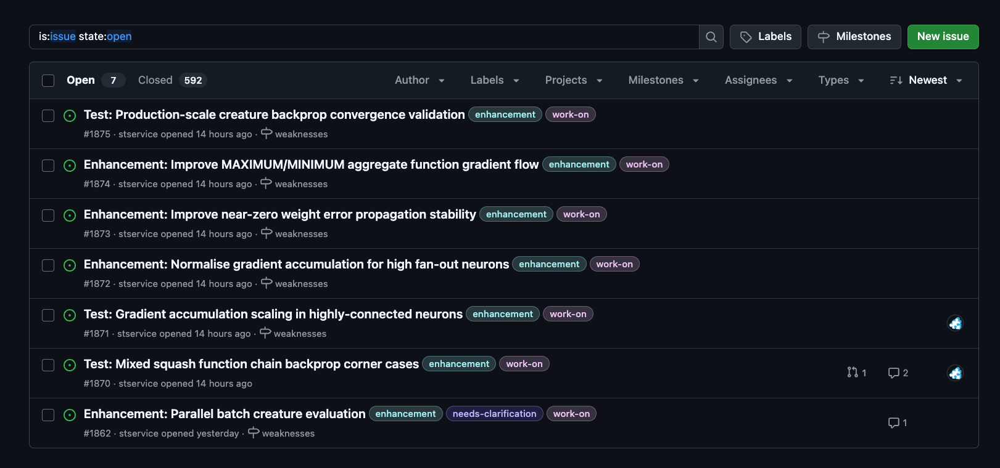

---

**Why milestones?** Milestones **unlock the potential** of the Vibe Coder: it can **safely** work on many issues in the background overnight or over the weekend. With **one issue at a time** (no milestone), each PR targets the default branch (auto-merge enabled at create) and the worker effectively waits on that stream. With **milestones**, each issue’s PR targets the **milestone branch** and **skips auto-merge at create** (`skipAutoMerge` — Issue #1125); catch-up may arm auto-merge later. **Safety is unchanged:** every PR still runs the full quality gate (e.g. `./quality.sh`); **no code reaches the default branch without your review** — only the **one final PR** from the milestone branch to default, which you approve when ready. Productivity gain without sacrificing oversight. See [Label Flows](label-flows.md).

---

## Step 4 — Worker opens a PR to the milestone branch

The Vibe Coder claims an issue, implements it, and opens a PR **targeting the milestone branch** (not default). One PR per target branch, so one milestone issue at a time. **Auto-merge is enabled** when checks pass, so this PR will merge into the milestone branch without waiting for human approval — the worker can then pick the next milestone issue immediately. Details: [Milestones](milestones.md), [Issue processing](issue-processing.md).

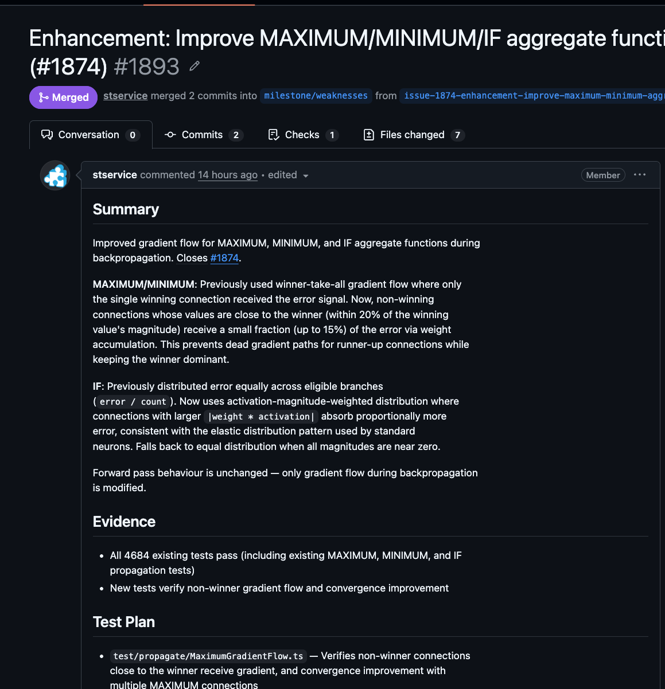

---

## Step 5 — Milestone-issue PR open (review optional)

The worker has opened a PR **targeting the milestone branch** (not default). The screenshot shows that PR: checks may be running or passing. You can leave a review and request changes (steps 6–7), or do nothing — when the quality gate passes, the PR **auto-merges into the milestone branch** and the worker moves on. **The default branch is not involved yet.** Your required review is the **final** PR (step 9); nothing reaches default without it.

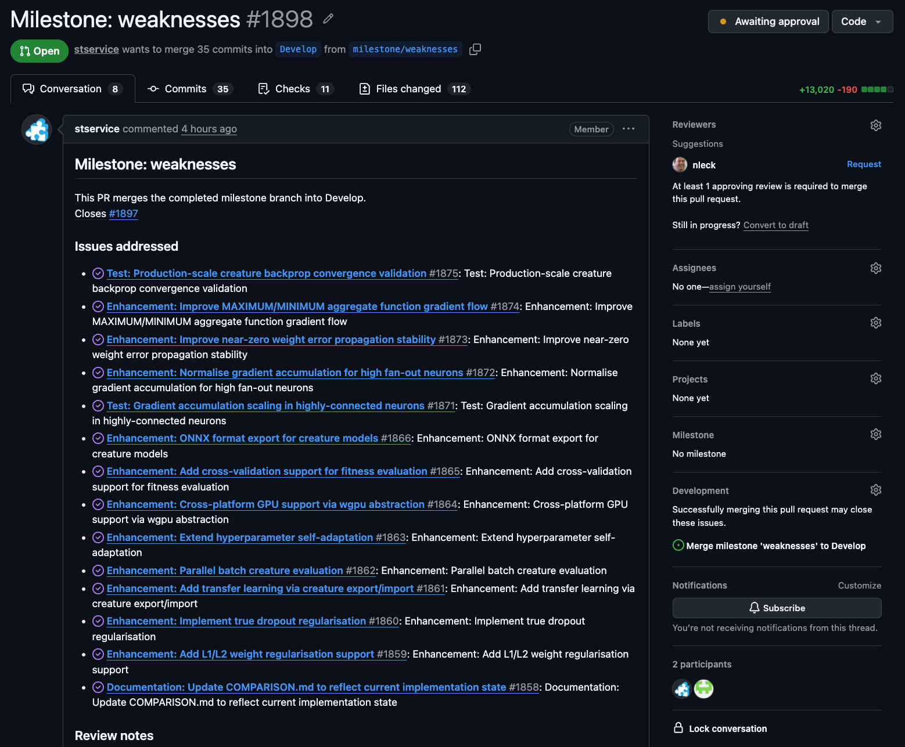

---

## Step 6 — Review cycle: you request changes or leave feedback

You leave a comment, add a "Request changes" review, or ask for edits. The worker monitors PRs by the configured user and will pick up this feedback on the next run. Details: [PR feedback and upkeep](pr-feedback.md).

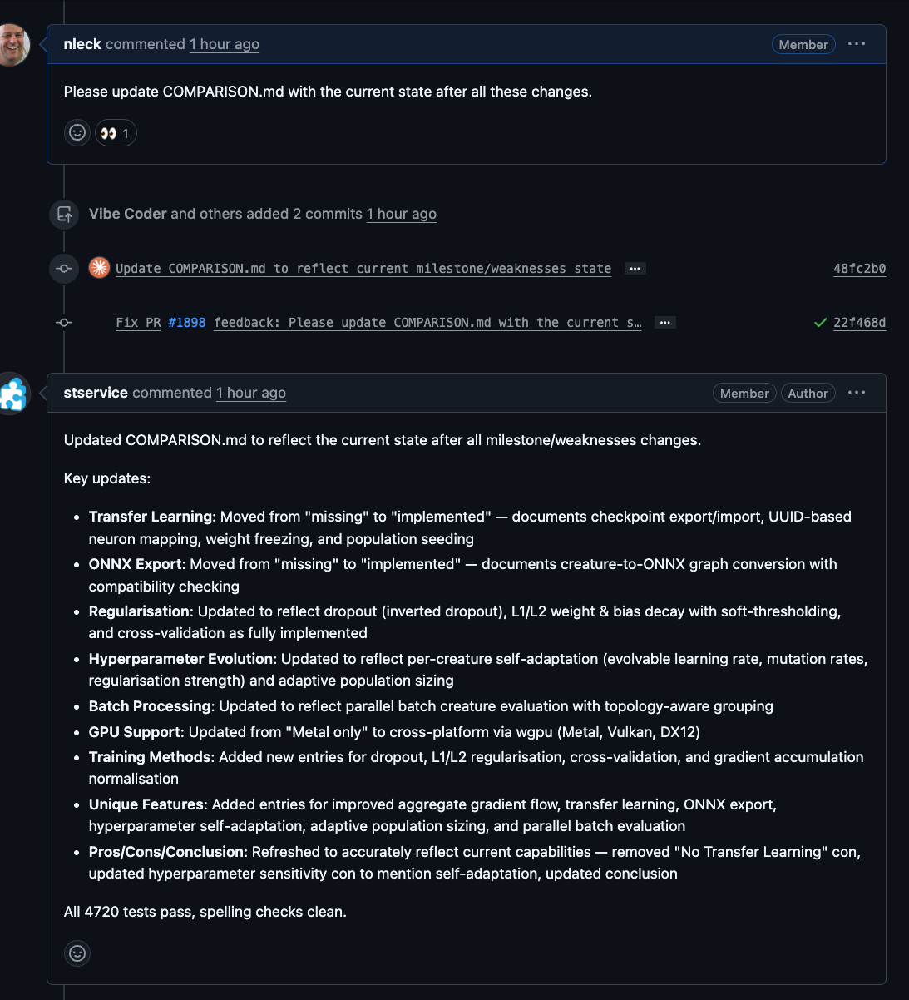

---

## Step 7 — Auto-fixes: worker addresses feedback and/or spelling/quality/CI

The worker checks out the PR branch, addresses your feedback (or fixes spelling/quality/CI — Continuous Integration — failures automatically), commits, pushes, and marks the feedback as processed. No need to re-request — it runs on a schedule. Details: [PR feedback](pr-feedback.md#priority-1--pr-feedback), [Spelling and quality](pr-feedback.md#priority-15--spelling-and-quality-fixes-automatic).

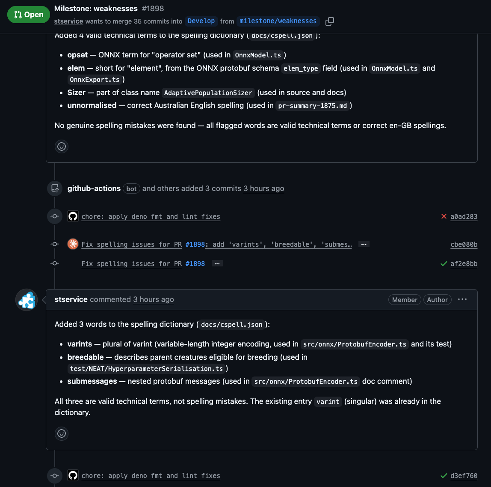

---

## Step 8 — PR auto-merges into the milestone branch (milestone issue closed)

When the quality gate passes, the PR **auto-merges into the milestone branch** (no human approval required). You or the worker closes the issue. The worker then picks the next issue in the same milestone and repeats steps 4–8. Because each milestone-issue PR auto-merges, the worker **never blocks waiting for review** — it can work through the whole milestone (e.g. over the weekend) and present you with one consolidated result.

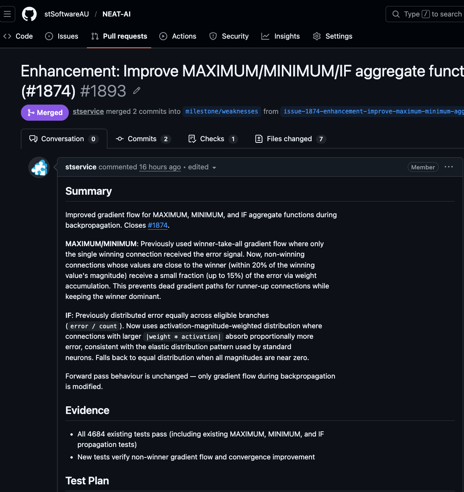

---

## Step 9 — All milestone issues done: one final PR to review (required — protects default)

When **all** issues in the milestone are completed (all those PRs have auto-merged into the milestone branch), the worker creates a **tracking issue** and opens **one PR** from the milestone branch to the **default** branch. **Your review of this final PR is required:** nothing goes into the default branch unless all quality gates have passed and you review (and approve) this PR. That’s the whole idea — protect the default branch. The worker monitors this final PR (CI, spelling, merge) and enables auto-merge when mergeable; you review when ready. Details: [Milestone completion](milestones.md#milestone-completion).

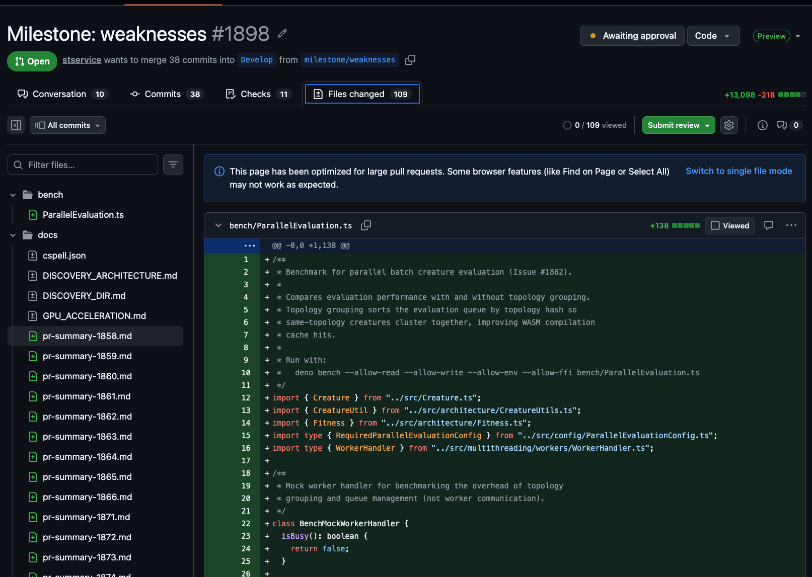

---

## Step 10 — Final PR: CI and auto-fixes (e.g. integration tests)

The final PR is the first time the combined milestone changes may run against the default branch’s CI (e.g. integration tests). The worker automatically fixes spelling, quality, and CI failures; keeps the branch up to date; and enables auto-merge when mergeable. Details: [PR feedback](pr-feedback.md), [Milestones — CI monitoring](milestones.md#milestone-completion).

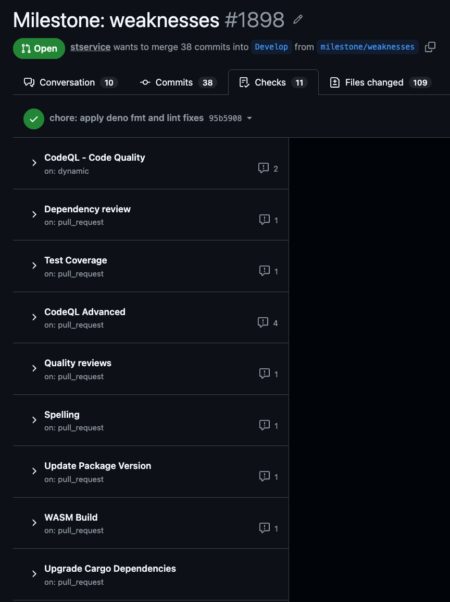

---

## Step 11 — Final PR merged, milestone closed

The final PR merges into the default branch. The tracking issue is auto-closed. The GitHub milestone is closed. The feature is now on the default branch.

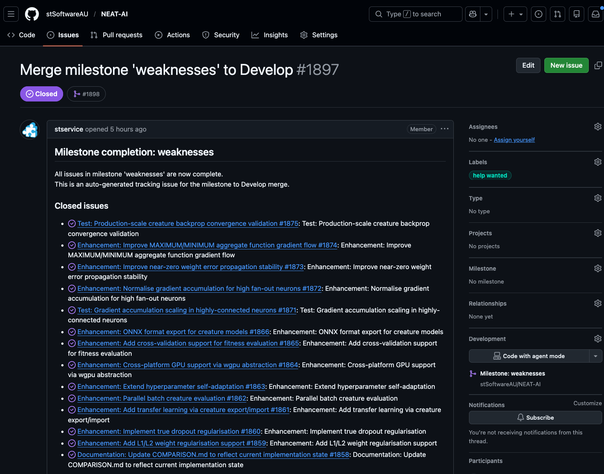

---

## What next?

- **Try it:** Create a GitHub milestone, add a few issues with the right labels (e.g. `work-on` or your configured label), and let the worker run. You’ll get one final PR to review.
- **Go deeper:** [Milestones](milestones.md) (full workflow), [Issue processing](issue-processing.md), [PR feedback](pr-feedback.md).
- **Overview:** [Vibe Coder — Overview](../OVERVIEW.md) for the big picture.
