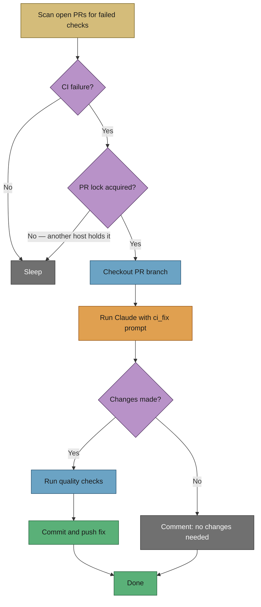
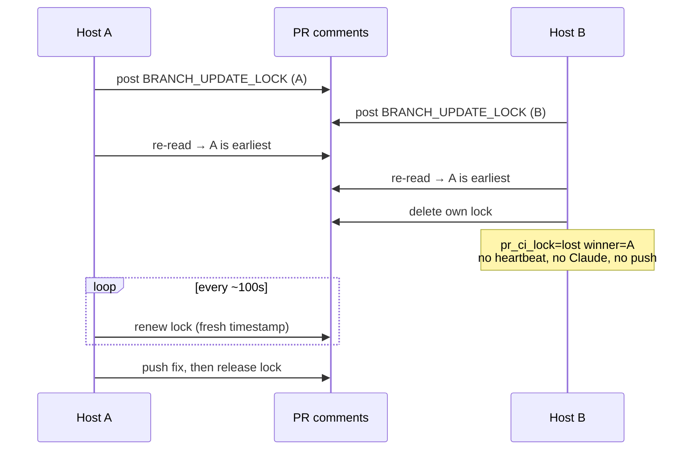

# 🔧 Workflow: CI (Continuous Integration) fix

This page is part of the **user manual** for the Vibe Coder. It describes how the appliance **automatically diagnoses and fixes CI failures** on PRs (Pull Requests) authored by the configured GitHub user. For internal details, see **Further reading** at the end.

---

## ⚡ TL;DR

**When a CI check fails on a PR authored by the configured GitHub user, the worker automatically attempts to fix it.** It extracts failure annotations (file, line, message), classifies the failure (test, build, lint, infrastructure, transient — Issue #1690), sends them to Claude with the `ci_fix` prompt (currently `v4`), and pushes a fix commit. The worker retries up to 3 times per check before giving up and posting a classifier-aware comment (Issue #1691, #1743). CI fix runs at **priority 1.55** — after PR feedback (1) and spelling/quality fixes (1.5), but before branch updates (1.6).

---

## 🎯 Purpose and scope

- **Purpose:** Automatically diagnose and fix CI check failures on PRs authored by the configured GitHub user, without operator intervention.
- **Scope:** General CI failures — build errors, test failures, lint violations. Spelling failures are handled separately at priority 1.5 (see [pr-feedback.md](pr-feedback.md)).
- **Not in scope:** Infrastructure failures (e.g. runner unavailability), flaky tests that pass on re-run, or failures on PRs authored by other users.

## 🎭 Actors and triggers

- **Trigger:** A CI check run with `conclusion == "failure"` is detected on an open PR authored by the configured GitHub user.
- **Actors:** The worker (via `findFailedCiChecks` in `worker/deno/lib/pr_ci_checks.ts`); Claude (via the `ci_fix` prompt); GitHub API (check runs, annotations).
- **Priority:** 1.55 — runs after PR feedback (1) and spelling/quality fixes (1.5), before branch updates (1.6).

## 📏 Preconditions / invariants

- The PR is authored by the configured GitHub user.
- The failed check is not a spelling check (those are handled at priority 1.5).
- Exactly one host works a given PR's CI failure at a time — the cross-host PR lock is acquired before the heartbeat, before Claude and before any push (Issue #3754).
- The retry count for this specific check run has not exceeded `CI_CHECK_MAX_RETRIES` (default: 3).
- The worker has the PR branch checked out and synced with the base branch before invoking Claude.

## ✅ Happy path

1. **Detect** — `find_failed_ci_checks()` scans all open PRs authored by the configured GitHub user. For each PR, it queries the GitHub API for check runs with `conclusion == "failure"`, filtering out spelling checks.
2. **Extract annotations** — Failure annotations (file path, line number, error message) are extracted from the check run and encoded as base64 JSON for safe transport through shell.
3. **Checkout** — The worker checks out the PR branch, fetches the latest changes, and syncs with the base branch (rebase) to prevent merge conflicts.
4. **Run pre-setup** — If the repository has a configured `pre_setup_command`, it is executed before Claude starts.
5. **Build prompt** — `build_ci_fix_prompt()` constructs the Claude prompt with:
   - The failed check name and annotation details
   - The `ci_fix` prompt template (from `prompts/ci_fix/`)
   - Coding guidelines and quality instructions
   - Any repository-specific custom instructions
6. **Run Claude** — Claude analyses the failure, reads the relevant source files, and applies a minimal fix. The prompt instructs Claude to:
   - Read the failing test or build configuration
   - Fix the root cause in the source code
   - Never disable or skip tests
   - Create a `.pr_response_message` file summarising the fix
7. **Quality gate** — If Claude made changes, the worker runs quality checks (`./quality.sh` or the repository's custom quality command). If quality fails, Claude is retried once.
8. **Commit and push** — Changes are committed with the message `Fix CI failure ($check_name) for PR #$pr_number` and pushed.
9. **Reply** — The worker posts a comment on the PR with the fix summary from `.pr_response_message`, or a generic message if none was provided.

## 🔒 Cross-host locking (Issue #3754)

Every fleet host scans the same PRs, so the CI-fix path takes a **cross-host lock before it does anything else** — before the heartbeat, before Claude, before any push. Without it two hosts fixed one PR's CI failure concurrently (PR #3644, 2026-08-03), burning tokens twice and racing each other's pushes.

- **Granularity: the whole PR, not a single check.** Two hosts picking *different* failing checks on one branch would still push to that branch at the same time, so the lock claims the PR. It is the same `BRANCH_UPDATE_LOCK` comment used by the [branch-update workflow](pr-feedback.md), so a CI fix and a branch rebase can never run against one branch at once.
- **Earliest claim wins.** Each host posts a lock comment, pauses for GitHub's eventual consistency, re-reads the comments, and the earliest `created_at` wins. The loser deletes its own comment, logs `pr_ci_lock=lost winner=<id>`, and returns immediately so the next scan can retry.
- **Held for the whole run.** The lock TTL is 5 minutes but a CI fix may run for `ci_fix_timeout` (30 minutes), so the holder **renews** its lock every ~100 seconds rather than the TTL being raised. Renewal keeps the crash-recovery window at one TTL: a host that dies mid-fix frees the PR within five minutes instead of hours.
- **Released on every exit path.** Success, failure and throw all release the lock in a `finally`. A lock left behind by a crashed host is deleted by `cleanStaleBranchUpdateLocks` once it passes the TTL, so a PR is never permanently deadlocked.
- **Visible on the PR.** The lock comment carries a readable line ("Locked PR #N for a CI fix …") under the hidden marker, so it never renders as a blank comment (Issue #1659).

## 🔄 Retry behaviour

The worker tracks retries per check run ID using state files in the CI check state directory:

- **State files:** `${CI_CHECK_STATE_DIR}/${safe_repo}_${check_id}.retries`
- **Maximum retries:** 3 (configurable via `CI_CHECK_MAX_RETRIES`)
- **On max retries exceeded:** The worker posts a PR comment explaining that the CI failure could not be automatically fixed and skips the check on future runs.

## ⏱️ Timeout handling

The CI-fix phase is capped by its own `ci_fix_timeout` (`1800`s / 30 minutes) — **not** by the issue-work `claude_timeout` — and the no-output watchdog typically kills a stuck process well before that ceiling. The authoritative defaults and the interaction between the two live in [CONFIGURATION.md](../CONFIGURATION.md#how-timeouts-interact); this page deliberately does not restate them.

On timeout (exit code 124 or 137), the worker posts a PR comment with the last 100 lines of Claude output for diagnostic purposes.

## 🔀 Decision points and exceptions

- **No CI failures found:** Skip; no side effects.
- **Spelling failure detected:** Excluded — handled at priority 1.5 by the spelling fix workflow.
- **Max retries exceeded:** Post a comment on the PR and skip the check on future runs. The operator should investigate manually.
- **Rate limit exhaustion:** After `MAX_RATE_LIMIT_RETRIES` (default: 2) with exponential backoff, the worker exits with code 2 and posts a comment.
- **Claude makes no changes:** The worker posts a classifier-aware comment explaining the most likely failure category (test, build, lint, infrastructure, transient) and recommended next step rather than a generic "transient or infrastructure" message (Issue #1691, #1743).
- **Quality check fails after fix:** Claude is retried once. If it fails again, the fix is not pushed.

## 🛠️ Common CI failure patterns

| Pattern | How the worker handles it |
|---------|--------------------------|
| Test assertion failure | Claude reads the failing test and source, fixes the root cause |
| Build/compilation error | Claude reads error annotations and fixes the source |
| Lint violation | Claude applies the required code style fix |
| Type error | Claude reads the type error and corrects the type mismatch |
| Missing dependency | Claude adds the required import or dependency |

## 🆘 When auto-fix fails

If the worker cannot fix a CI failure after the maximum retries:

1. **Check the PR comment** — The worker posts a comment with details about what was attempted.
2. **Review the annotations** — The CI check annotations show the exact file, line, and error.
3. **Fix manually** — Push a fix to the PR branch; the worker will not retry the same check run.
4. **Transient failures** — If the failure was caused by a flaky test or infrastructure issue, re-running the CI check may resolve it without code changes.

## 📚 Further reading

- **CI fix prompt:** the latest template in [`prompts/ci_fix/`](../../prompts/ci_fix/) — used to instruct Claude (failure classification introduced in Issue #1692).
- **CI failure classifier:** [`worker/deno/lib/ci_failure_classifier.ts`](../../worker/deno/lib/ci_failure_classifier.ts) — categorises failures as test, build, lint, infrastructure, or transient (Issue #1690).
- **CI failure detection:** [`worker/deno/lib/pr_ci_checks.ts`](../../worker/deno/lib/pr_ci_checks.ts) — CI check detection and retry tracking.
- **Cross-host PR lock:** [`worker/deno/lib/pr_branch_lock.ts`](../../worker/deno/lib/pr_branch_lock.ts) — acquire, renew and release the `BRANCH_UPDATE_LOCK` (Issues #1281, #3754).
- **CI fix handler:** [`worker/deno/lib/ci_failure_issue.ts`](../../worker/deno/lib/ci_failure_issue.ts) and the CI-fix processor wired in [`run_core.ts`](../../worker/deno/lib/run_core.ts).
- **Prompt building:** [`worker/deno/lib/prompt_builder.ts`](../../worker/deno/lib/prompt_builder.ts) — CI fix prompt construction.
- **Timeout and retry:** [`worker/deno/lib/claude_runner.ts`](../../worker/deno/lib/claude_runner.ts) — `runClaudeWithRetry()`, `timeoutWithCleanup()`.
- **Workflow orchestration:** Unified workflow handler in Deno TypeScript — `execute_workflow_priority()`.
- **Related workflows:** [PR feedback and upkeep](pr-feedback.md), [Issue processing](issue-processing.md).
- **Configuration:** [CONFIGURATION.md](../CONFIGURATION.md), TROUBLESHOOTING.md.
