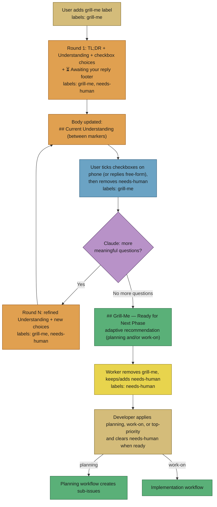
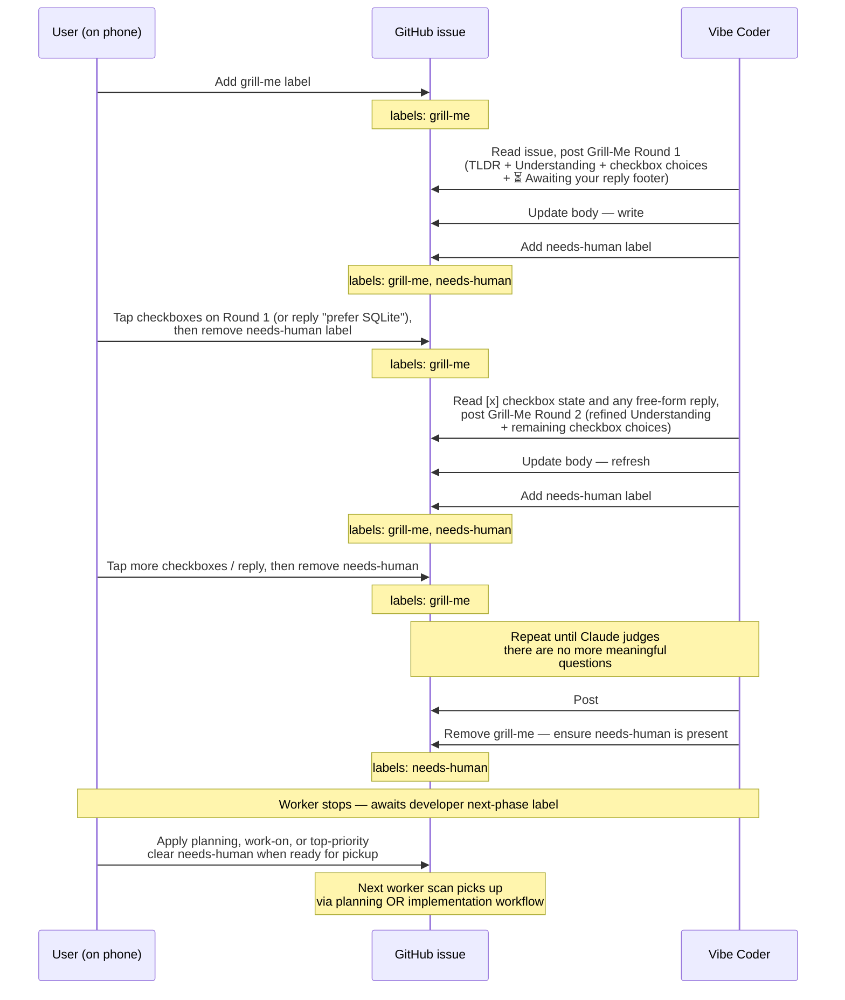

# 🔥 Workflow: Grill-Me clarification

This page is part of the **user manual** for the Vibe Coder. It describes
the `grill-me` workflow — an iterative, comment-driven back-and-forth
that converges an issue into a shared, well-scoped requirement
**before** planning or implementation. Use it for vague briefs *and*
whenever you want to know early where you and the worker are not seeing
eye to eye. All interaction happens on the issue itself; no branches,
commits, or pull requests (PRs) are created. For the journey map, see
[Label Flows](label-flows.md). For internal details, see **Further
reading** at the end.

---

## ⚡ TL;DR

**Prefer `grill-me` before you hand the worker a plan or a work-tier
label.** Default to grilling. Skip straight to `work-on` /
`top-priority` only when the issue cannot possibly be misunderstood —
a bar that almost never holds in practice. Grilling is the cheapest way
to catch miscommunication while the issue is still text. Once
implementation has started, changing direction is hard: the worker
keeps anchoring on the code and understanding it already built. Align
up front; disagree up front; then let it run.

You add the `grill-me` label, the worker reads the issue and posts a short
**Round 1** comment with a TL;DR, an `### Understanding` summary, and a
small set of choices rendered as Markdown task list checkboxes
(`- [ ] choice`, plus `- [ ] other — please describe in a reply`). Each
round comment ends with a `**⏳ Awaiting your reply.**` footer so you
know the worker is paused on your response. Each round also rewrites a
`## Current Understanding` section between stable markers in the issue
body, preserving the rest of the body. The worker keeps grilling until
**it judges there are no more meaningful questions** — at which point
it posts a single `## Grill-Me — Ready for Next Phase` comment with an
**adaptive recommendation** of the next phase. Rather than always
offering a flat `planning` vs `work-on` menu, the worker acts on the
scope/viability judgement it formed while grilling and gives a short
rationale for the call. It takes one of three shapes:

1. **One viable phase** — only the sensible next phase is shown, ticked,
   with a rationale (it "won't show a button you shouldn't press"). Most
   often this is `planning` because the issue is too big for one PR.
2. **Two viable, one preferred** — both options appear, the recommended
   one is pre-ticked with a rationale, the other is left unticked.
3. **Two genuinely balanced** — both options appear, nothing is ticked,
   and the worker says there is no strong preference so **you** decide.

When the call is genuinely uncertain the worker leans `planning` — most
issues handed back from grilling are better broken up than worked as one
PR. **You apply the chosen label yourself** from the GitHub mobile app or
web UI — ticking the checkbox is only a signal — the worker never swaps
labels for you.

**Whose turn is it? Read the labels.** Immediately after posting a
round comment the worker adds the existing `needs-human` label. While
the issue carries `grill-me` **plus** `needs-human` it is **your turn**
— read the latest `## Grill-Me Round N` comment, reply, then remove
`needs-human` from the **Labels** menu so the worker knows it is its
turn again. An issue showing `grill-me` **alone** is one the worker
will grill on the next scan. On Ready, the worker **removes `grill-me`
and keeps / adds `needs-human`** (Issue #2064) so the issue still reads
as your turn — apply the next-phase label (`planning`, `work-on`, or
`top-priority`) and clear `needs-human` when the worker should pick up.
The discovery filter already skips any issue carrying `needs-human`, so
the label list at the top of the issue is the single source of truth
for whose turn it is — alongside the `**⏳ Awaiting your reply.**`
comment footer that already paired with each round.



---

## 🎯 Purpose: when to use grill-me vs planning

The two workflows do different jobs:

| Workflow | Use when… | What the worker does |
|----------|-----------|----------------------|
| `planning` | The issue is **already well-scoped** but too big for one PR. The problem statement, scope, and acceptance criteria are clear — you just need it broken into smaller pieces. | Reads the issue and creates sub-issues directly, then closes the parent. |
| `grill-me` | The issue is **vague, open-ended, or under-specified**. You know roughly what you want but cannot yet write a clean acceptance criteria list. You want a conversation first. | Asks one round of clarifying questions, waits for your reply, asks another round, and keeps refining the issue body until it judges there are no more meaningful questions. It then posts a Ready comment with an adaptive recommendation of the next phase (`planning` or `work-on`, leaning `planning` when uncertain) and waits for **you** to apply the chosen label. |

**Rule of thumb:** if you would struggle to write `## Acceptance
Criteria` yourself in two minutes, reach for `grill-me`. Otherwise reach
for `planning`.

## 🔁 Lifecycle in detail



Claude removes `grill-me` after posting the Ready comment and must
never add `planning`, `work-on`, `top-priority`, or other next-phase
labels — the developer applies those themselves. The processor
ensures `needs-human` remains on the issue after Ready (Issue #2064)
so the pause signal stays visible.

The `needs-human` label additions and removals shown above are made by
the **processor** (`worker/deno/lib/grill_me_processor.ts`), not by
Claude — see [Reserved-label safety](#-reserved-label-safety) for the
full split.

## 📱 What to expect on each round

Every round comment follows the same mobile-friendly template so you
always know where to look on a small screen:

1. **TL;DR** — a single line at the top. If you only read this you still
   know what the round is asking.
2. **`### Understanding`** — two to four short sentences restating what
   the worker believes you want. **Read this carefully** — if it is
   wrong, your reply is the moment to correct it.
3. **`### Questions`** — the smallest set of clarifying choices needed
   to unblock the next phase. Each question is numbered and presents
   its options as **GitHub Markdown task list checkboxes** —
   `- [ ] choice text`, one per line — plus a final
   `- [ ] other — please describe in a reply` row for anything outside
   the menu. The GitHub mobile app renders these as tappable
   checkboxes.
4. **Reply line** — a one-line instruction telling you how to answer
   (typically: "Tick the boxes that apply (the GitHub mobile app lets
   you tap each one), then add any free-form notes in a reply.").
5. **Awaiting-reply footer** — every round comment ends with
   `**⏳ Awaiting your reply.** The Vibe Coder is waiting for your
   response on this issue to continue grilling.` so you know the
   worker is paused on you, not still thinking.

Comments are kept under ~1500 characters where possible and use plain
markdown only (no tables, no images, no nested code blocks) so they
render well in the GitHub mobile app.

### Per-round body refinement

In addition to the round comment, the worker rewrites a
`## Current Understanding` section in the issue body on every round.
The section is delimited by stable HTML-comment markers so it can be
replaced idempotently without disturbing anything else you have written:

```
<!-- GRILL-ME-UNDERSTANDING-START -->
## Current Understanding

(Two to four short paragraphs reflecting the latest agreed scope —
problem, accepted scope, out of scope, open questions.)
<!-- GRILL-ME-UNDERSTANDING-END -->
```

Everything outside the marker pair — your original problem statement,
links, references, anything you have edited — is preserved unchanged.
Only the content between the markers is replaced each round. This means
the issue body always reflects the latest agreed understanding, and
anyone arriving at the issue mid-grill can read the body for the current
state without scrolling through every round comment.

From v4 onwards the worker also keeps
the **issue title** in sync with the converged understanding each round
(skipping the edit when the existing title is already accurate), so a
`work-on` or `top-priority` reader who only sees title + body still
gets the latest state. See the latest `prompts/grill-me/` template for the exact
title-refinement rules — the prompt is the single source of truth.

### Worked example (mobile app)

You open an issue titled **"add a way to export project data"** with a
two-line body. After you add `grill-me`, the worker posts:

```
## Grill-Me Round 1

TL;DR: I need to know the export format, scope, and trigger before I
can recommend planning or work-on.

### Understanding
You want users to be able to export the data attached to a project
(issues, comments, milestones) so it can be archived or shared
outside GitHub. The current issue does not say which format, what to
include, or how the export is triggered.

### Questions

1. Which format do you want?
   - [ ] JSON
   - [ ] CSV (one file per entity)
   - [ ] Markdown bundle (one .md per issue)
   - [ ] other — please describe in a reply

2. What should the export include?
   - [ ] Issues only
   - [ ] Issues + comments
   - [ ] Issues + comments + milestones + labels
   - [ ] other — please describe in a reply

3. How should the export be triggered?
   - [ ] A new GitHub label (e.g. `export-me`)
   - [ ] A CLI command in the worker
   - [ ] A scheduled job
   - [ ] other — please describe in a reply

Tick the boxes that apply (the GitHub mobile app lets you tap each
one), then add any free-form notes in a reply.

**⏳ Awaiting your reply.** The Vibe Coder is waiting for your
response on this issue to continue grilling.
```

You tap the checkboxes for `1. JSON`, `2. Issues + comments + milestones
+ labels`, and `3. A new GitHub label …`, then reply: `please include
closed issues too.` Then you tap the issue header → **Labels** and
remove `needs-human` so the worker knows it is its turn again.

On the next scan the worker posts **Round 2** with a refined
`### Understanding` (now mentioning JSON, all entities, label-driven,
including closed issues) and any remaining questions — perhaps about the
file location, naming, or whether to include attachments. The body's
`## Current Understanding` section is also rewritten to reflect the new
agreed scope. You reply again. This continues until Claude judges there
are no more meaningful questions.

When Claude is satisfied, it posts a single Ready comment, for example:

```
## Grill-Me — Ready for Next Phase

TL;DR: Export issues + comments + milestones + labels (including
closed issues) as a JSON bundle, triggered by an `export-me` label.

The scope is now clear. My recommendation, then apply the matching
label yourself so the next phase can begin:

### How would you like to proceed?

- [x] Apply the `planning` label — recommended: the export spans the
  issue, comment, milestone, and label APIs, so it is safer broken into
  sub-issues than shipped as one PR.
- [ ] Apply the `work-on` label — possible if you would rather ship it
  as a single focused change.
- [ ] other — please describe in a reply

(Ticking a box is only a signal — you still toggle the actual label via
the GitHub labels UI.)

**How to apply a label from the GitHub mobile app:**

1. Open this issue in the GitHub mobile app.
2. Tap the issue header to expand the metadata panel.
3. Tap **Labels**.
4. Tick `planning` or `work-on` and tap **Done**.

I have removed the `grill-me` label and left `needs-human` so this
stays your turn. Apply the next-phase label whenever you are ready,
then clear `needs-human` so the worker can pick the issue up — there
is no rush.
```

The worker then removes `grill-me`, **keeps / adds `needs-human`**
(Issue #2064), and stops. Nothing else happens until **you** apply
`planning`, `work-on`, or `top-priority` and clear `needs-human`. The
next worker scan after you do so picks the issue up via the matching
workflow: `planning` creates sub-issues; `work-on` (or `top-priority`)
queues the issue for implementation.

## 📛 Whose turn is it? (read the labels)

The label list at the top of the issue is the single source of truth
for whose turn it is. Read it before scrolling through comments:

| Labels on the issue | Whose turn |
| --- | --- |
| `grill-me` only | Worker — will grill on the next scan |
| `grill-me` + `needs-human` | You — read the latest `## Grill-Me Round N` comment, reply, then remove `needs-human` |
| `needs-human` only (after a `## Grill-Me — Ready for Next Phase` comment) | You — apply `planning`, `work-on`, or `top-priority`, then clear `needs-human` |
| `needs-human` (no `grill-me`, no Ready comment) | Human triager — workflow has escalated (two failures or safety cap) |

The `**⏳ Awaiting your reply.**` footer on each round comment carries
the same meaning, but the label list is faster to scan on a small
screen and is what the discovery filter actually uses to decide
whether to pick the issue up on the next iteration.

## 📵 Mobile workflow — drive it from your phone

Grill-me is designed for the GitHub mobile app on the train, in the
queue, or on the couch. A typical interaction:

1. **Open the GitHub mobile app.** Navigate to the issue (notifications
   work — you get a ping when the worker posts each round).
2. **Glance at the labels at the top of the issue.** If `needs-human`
   sits next to `grill-me`, it is your turn — read on. If only
   `grill-me` is present, the worker has not yet picked the issue up
   on this scan, so there is nothing to reply to. See
   [Whose turn is it?](#-whose-turn-is-it-read-the-labels) for the
   full table.
3. **Read the TL;DR.** That single line tells you what the round is
   asking. If it is obvious, you may not even need to read the
   `### Understanding` section.
4. **Skim `### Understanding`.** If something is wrong, that is the
   thing to correct in your reply.
5. **Tap the checkboxes** on the round comment to record your
   answers — the GitHub mobile app turns `- [ ]` into a tappable
   control, and tapping flips it to `- [x]`. You can also tap
   "Add comment" and add any free-form notes (for example
   "please use SQLite, only when CI passes"). Free-form text wins
   where it conflicts with a ticked box.
6. **After replying, tap the issue header → Labels and remove
   `needs-human`** so the worker knows it is its turn again. Until
   you remove `needs-human` the discovery filter will keep skipping
   the issue.
7. **Hit submit.** The next worker scan picks the issue up and posts
   the next round (re-adding `needs-human` after Round N+1). The
   `**⏳ Awaiting your reply.**` footer on each round comment, paired
   with the `needs-human` label, is your cue that the worker is paused
   waiting on you.
8. **When the Ready comment arrives**, tap the issue header → Labels →
   tick `planning`, `work-on`, or `top-priority`, clear `needs-human` →
   Done. The worker has already removed `grill-me` and left
   `needs-human` as your turn signal; clearing it lets the next scan
   pick the issue up via the workflow you chose.

Tip: turn on GitHub mobile notifications for the repo so each new round
arrives as a push notification.

## 🔚 Stopping early — "good enough, go to planning now"

You do not have to wait for the worker to decide it is done. There are
two ways to short-circuit:

- **Manually swap the label.** Remove `grill-me` and add `planning`
  (or `work-on`). The next worker run picks the issue up via the
  matching workflow and ignores any unfinished grilling. Use this when
  the conversation has already given you a clean enough requirement.
- **Reply with "approved" or similar consensus wording.** Claude
  decides each round whether to ask another targeted question or post
  the Ready comment. A clear "this is enough — please finalise" reply
  pushes it toward posting Ready on the next scan.

In both cases the developer is the one who applies the next-phase
label.

## 📊 Round limit and escalation

| Setting | Default | Source | Behaviour |
|---------|---------|--------|-----------|
| `maxGrillMeRounds` | `5` | `worker/deno/lib/config_defaults.ts` | **Safety cap.** If grilling has not converged on a Ready comment after this many rounds, the worker posts a one-time recommendation comment, applies the `needs-human` label, and stops. It does **not** finalise automatically. |
| `grillMeTimeout` | `3600` (1 hour) | `worker/deno/lib/config_defaults.ts` | Per-round Claude timeout. Raised from 600s by Issue #3154 — a round reasons at top-tier model and `max` effort, and the old ceiling killed heavy rounds. |
| `grillMeKillAfter` | `10` | `worker/deno/lib/config_defaults.ts` | Grace period before forced termination after `grillMeTimeout`. |

**The safety cap escalates rather than finalising.** When
`maxGrillMeRounds` is reached without a Ready comment having been
posted, the worker posts a comment summarising the current state,
recommends the developer apply `planning` or `work-on` (or refine the
issue and re-grill), adds `needs-human`, and stops. A human takes over
from there. There is no longer any "final round forces finalisation"
behaviour — the developer always drives the label transition.

## ⚠️ Failure modes

The worker is built for unattended operation. The grill-me processor
recovers from each common failure as follows:

| Failure | What the worker does |
|---------|----------------------|
| **Claude times out** (per-round timeout exceeded) | Posts a `## Grill-Me Failed` comment with the reason. The label stays on the issue so the next worker scan retries the same round. |
| **Claude errors / API failure** | Same as timeout — posts a `## Grill-Me Failed` comment and lets the next scan retry. |
| **Claude does not post a round comment** | Posts a `## Grill-Me Failed` comment ("Claude did not post a Grill-Me round comment"); next scan retries. |
| **Two consecutive rounds fail** | The worker adds the `needs-human` label, posts a `## Grill-Me Escalation` comment, and stops. A human takes over. |
| **User has not replied yet** | The processor adds `needs-human` after each round, and the discovery filter skips any issue carrying `needs-human`. The worker therefore does not even consider the issue until the developer removes `needs-human` after replying. The `**⏳ Awaiting your reply.**` footer plus the `needs-human` label remain the visible cues; the labels stay on the issue indefinitely until either you reply and clear `needs-human`, you remove `grill-me`, or someone else intervenes. |
| **Ready comment posted (this run or earlier)** | The processor removes `grill-me` and **ensures `needs-human` is present** whenever it sees a `## Grill-Me — Ready for Next Phase` marker (Issue #2064) — on the run that posts it and on subsequent scans if `grill-me` is still lingering. The developer applies the next-phase label (`planning`, `work-on`, or `top-priority`) and clears `needs-human` when the worker should pick up. |
| **Safety cap reached** (`maxGrillMeRounds` rounds with no Ready) | Posts a recommendation comment, adds `needs-human`, and stops. The developer takes over. |
| **Two workers race for the same issue** | The processor claims the issue atomically before doing any work. The loser exits cleanly with a "claimed by another worker" message. |

The `## Grill-Me Failed`, `## Grill-Me Escalation`, and
`## Grill-Me — Ready for Next Phase` markers are permanent in the
comment history — they are how the processor detects state across
runs.

## 🤖 Reserved-label safety

Grill-me mode follows the same [Worker Label
Policy](../../README.md#-supported-labels) as every other workflow.
Two distinct actors touch labels on a grill-me issue, with strictly
separated permissions:

- **Claude** (the language model invoked per round) may **remove
  `grill-me` and add `needs-human`** after posting the Ready comment
  (Issue #2064). Claude is forbidden from adding `planning`,
  `work-on`, `top-priority`, or other next-phase / reserved workflow
  labels that would queue work. This restriction is enforced by the
  prompt — see the latest [`prompts/grill-me/`](../../prompts/grill-me/)
  template.
- **The processor** (`worker/deno/lib/grill_me_processor.ts`)
  manages `needs-human` and `grill-me` directly: it adds
  `needs-human` after every successful round comment to mark the
  developer's turn, and on the Ready path removes `grill-me` while
  **ensuring `needs-human` stays applied** (Issue #2064). It also
  adds `needs-human` on the escalation paths described above (two
  consecutive failures, or the safety cap being reached without
  convergence). The processor never applies `planning`, `work-on`,
  `top-priority`, or any other next-phase label — that decision
  always belongs to the developer.

## 📚 Further reading

- **Sibling workflow:** [planning-and-questions.md](planning-and-questions.md) — what happens after the developer applies `planning` or `work-on`.
- **Internals:** [Worker Internals](../INTERNALS.md) — run loop and dispatch order.
- **Implementation details:** [worker/deno/lib/grill_me_processor.ts](../../worker/deno/lib/grill_me_processor.ts), [worker/deno/commands/grill_me_processor.ts](../../worker/deno/commands/grill_me_processor.ts), [prompts/grill-me/](../../prompts/grill-me/).
- **Config defaults:** [worker/deno/lib/config_defaults.ts](../../worker/deno/lib/config_defaults.ts) (`grillMeLabel`, `maxGrillMeRounds`, `grillMeTimeout`, `grillMeKillAfter`).
