# 🔍 Workflow: Issue processing (implementation)

This page is part of the **user manual** for the Vibe Coder. It describes how issues move from discovery to an open pull request (the standard implementation path — code changes). For internal implementation details, see **Further reading** at the end.

---

## ⚡ TL;DR

**Issue → branch → Claude → quality → PR (Pull Request).** The worker picks the next eligible issue from a four-tier priority order: **`top-priority`** → **`work-on`** → **`low-priority`** → **`idle-task`** (lowest tier). All four labels mean the same thing — _work on this issue_ — and differ only in priority; `idle-task` is simply last and is the only one the Vibe Coder may self-apply. Within the chosen tier the **globally oldest** by creation date wins. The legacy `help wanted` and `claude` discovery labels were retired in; only `idle-task` is self-appliable by the Vibe Coder. Repo scan order is **fair by default** — `shuffle_repos` (enabled by default) randomises the order in which repos are queried, but the final selection is always the globally oldest eligible issue across all repos ("fair scanning, then oldest first"). After filters and one-PR-per-target-branch it **claims** the issue (assign self, verify; tie-break if two workers claimed), sets up the repo and branch (default or milestone), optionally asks for clarification, runs Claude and `./quality.sh`, commits, pushes, and opens a PR with auto-merge. Fail once → retry; fail twice → label and skip until you remove it.

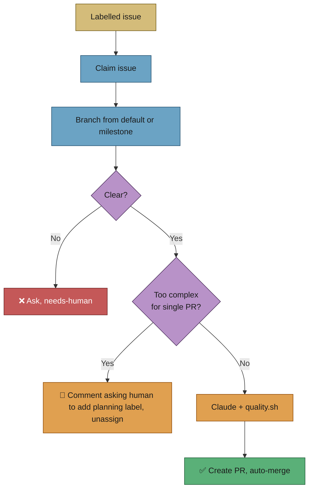

---

## 🎯 Purpose and scope

- **Purpose:** Define how the worker should discover, claim, and implement issues that result in a feature branch, Claude-driven changes, quality checks, and a PR.
- **Scope:** Issue discovery (across configured repos), claiming under concurrency, repo setup, clarification phase, implementation, quality gate, commit, push, PR creation, and auto-merge. Milestone-aware open-PR blocking (checking for existing open PRs **by the configured GitHub user** before starting a new issue) is part of issue selection — this is separate from PR monitoring/upkeep, which is covered in [pr-feedback.md](pr-feedback.md).

## 🎭 Actors and triggers

- **Trigger:** An issue exists in a configured repo with the `top-priority` label, the `work-on` label (added by an allowed author), or — when both higher tiers are globally empty — an auto-filed worker diagnostic the worker schedules itself (tier 2b, no label) or the `low-priority` label (added by an allowed author), or — when every other tier is empty — an `idle-task` issue filed by the worker itself. Tiers are evaluated in order; the globally oldest eligible issue within the highest non-empty tier is selected. See [Issue selection priority](#-issue-selection-priority). The issue must be unassigned or assigned to this worker and not blocked (no `failed`, `needs-human`, dependency issues, or open sub-issues; repo/milestone PR blocking applies — see [resilience-and-concurrency.md](resilience-and-concurrency.md)).
- **Actors:** The worker (single process per machine); GitHub API (Application Programming Interface); optional Deno/Claude.

## 📏 Preconditions / invariants

- Configuration is valid; repos are in allowlist; labels are set. The trusted-author set is derived from each repo's write collaborators minus the Vibe Coder logins and bots (Issue #1066).
- The worker has not already chosen a higher-priority work item in this loop iteration.
- **Label priority:** A four-tier order — `top-priority` → `work-on` → `low-priority` → `idle-task`, with the label-less self-scheduled diagnostic tier 2b sitting between `work-on` and `low-priority` (Issue #505). A lower tier is only considered when the higher tier yields **no eligible candidate in any scanned repo**. If a configured-label search fails (API error), the worker waits for the API to recover rather than falling back to `work-on` or `low-priority` — this prevents accidentally processing a lower-priority issue when higher-priority ones may exist but were invisible due to API errors. Among candidates of the same tier, the worker selects the **globally oldest** by creation date across all configured repos (after filtering and milestone-aware open-PR blocking). See [Issue selection priority](#-issue-selection-priority) for the full rules. Claim happens **before** any work.

## 🥇 Issue selection priority

When the worker scans for eligible issues it groups every candidate into one of four **tiers** and selects from the highest non-empty tier. Within a tier, the globally oldest issue (by `createdAt`) wins.

| Tier | Source | Global rule |
|------|--------|-------------|
| 1 | **`top-priority`** discovery label | Selected before any lower tier. |
| 2 | **`work-on`** label (added by an allowed author) | Selected only when **no** eligible `top-priority` candidate exists in **any** scanned repo. |
| 2b | **self-scheduled worker diagnostic** (no label — provenance) | An issue the worker auto-filed about itself, in its own repo, carrying a recognised provenance marker. Selected only when **no** eligible `top-priority` or `work-on` candidate exists in **any** scanned repo, and always ahead of the backlog. See [Self-scheduled worker diagnostics](#-self-scheduled-worker-diagnostics-tier-2b). |
| 3 | **`low-priority`** label | Selected only when **no** eligible `top-priority`, `work-on` **or** self-scheduled diagnostic candidate exists in **any** scanned repo. |
| 4 | **`idle-task`** label | The lowest-priority "work on this" tier. An `idle-task` issue is worked exactly like any other — it raises a fix PR through the standard pipeline — **except** a registered scan _wrapper_ (identified by title or body) runs its scan template instead of raising a PR. A **fleet-global floor**: selected only when **no** repo in **any** `nice` tier has a selectable `top-priority` / `work-on` / `low-priority` candidate. The single label the Vibe Coder may self-apply. |

The label priority order is therefore: `top-priority` > `work-on` > `low-priority` > `idle-task`. The legacy `help wanted` and `claude` discovery labels were retired in; only `idle-task` is self-appliable by the Vibe Coder. Tier 2b carries **no label at all** — it is claimable on provenance — so it does not change that order.

> [!IMPORTANT]
> **All four labels mean "work on this issue" — they differ only in priority** (`top-priority` > `work-on` > `low-priority` > `idle-task`). No other logic is attached to any of them.
>
> `idle-task` is **not** a scan-only marker. Any `idle-task` issue — a scan finding, a chore, a hand-written task — is worked through the standard issue→PR pipeline just like a `work-on` issue, only last. The **only** thing special about `idle-task` is **who may apply it**: the Vibe Coder may self-apply `idle-task`, whereas `top-priority` / `work-on` / `low-priority` are reserved for trusted humans and are stripped if the worker self-applies them (see `RESERVED_LABELS` in [`config_defaults.ts`](../../worker/deno/lib/config_defaults.ts)).
>
> When a claimed `idle-task` issue happens to be a registered scan _wrapper_ (its title matches a template's `buildIssueTitle`, or its body matches `matchesIdleTaskBody`), the worker runs that scan instead of raising a PR. That is simply _how that particular work item is done_ — not an extra priority gate. Every other `idle-task` issue flows through the normal fix pipeline. To get the worker to fix a scan _finding_, any of the four priority labels works — `idle-task` alone is enough; it will just be done last.

The global guarantee for `low-priority` follows from the cross-repo collection in [`find_oldest_issue.ts`](../../worker/deno/lib/find_oldest_issue.ts): every scannable repo contributes its candidates before [`selectHighestPriority`](../../worker/deno/lib/issue_priority.ts) picks a tier. A single eligible `top-priority` issue in repo A will suppress every `work-on` and `low-priority` issue across repos B, C, … That keeps `low-priority` strictly idle-time work — backlog items the worker only reaches when there is genuinely nothing else to do anywhere.

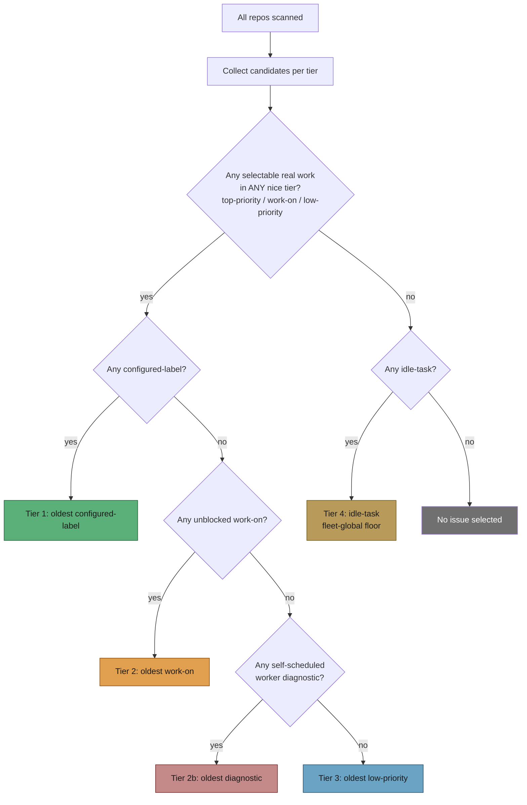

### 🩺 Self-scheduled worker diagnostics (tier 2b)

The worker detects its own faults, files them accurately, and states the
remedy — and until Issue #505 it stopped there, because scheduling a fix
means applying `work-on`, the one label it must never self-apply. Unattended,
nobody applied it: `NEAT-AI-Rebase#39` waited two days for a label, and the
fix took 79 minutes once it arrived.

Tier 2b closes that loop **without weakening any label guard**. Nothing is
self-labelled; instead an auto-filed diagnostic becomes claimable on its
provenance, collected by
[`collect_self_diagnostic_candidates.ts`](../../worker/deno/lib/collect_self_diagnostic_candidates.ts).
`top-priority` and `work-on` remain human-only, unconditionally.

**Three signals must agree** (`self_diagnostic_provenance.ts`) — author alone
is not enough, because an injected agent can file issues too:

1. **Repo** — the issue is in the worker's own repo (`stSoftwareAU/VibeCoder`),
   where the deciding code lives. A worker-filed issue in a **product** repo is
   never self-scheduled.
2. **Marker** — its body carries a recognised machine-written marker from a
   known template family (`<!-- VIBE_IDLE_INVERSION:… -->`,
   `<!-- VIBE_RUN_FAILURE:… -->`), matched as a whole HTML comment. Marker
   forgery through a filed body is closed at the source: the filers escape
   `<!--`/`-->` out of every interpolated field.
3. **Author** — it was filed by a fleet worker login.

**Bounded, visible and reversible:**

| Property | How |
|---|---|
| Bounded | At most `self_schedule_diagnostics_max_in_flight` (default `1`) in flight, counting assigned diagnostics — the assignee is the fleet's claim lock. The surplus is refused and logged, never dropped silently. |
| Visible | The decision is written to the audit chain under the distinct `self-schedule-diagnostic` verb **and** announced in a comment on the issue (posted once, deduped by marker). If either fails the diagnostic is **not** scheduled that scan — an untraceable privilege-bearing decision is worse than one more cycle of waiting. |
| Escalating | A diagnostic blocked **permanently** (a merged fleet PR names it, which never self-clears) gets `needs-human` plus one explanatory comment instead of sitting open as an alarm nobody is obliged to read. |
| Reversible | `self_schedule_diagnostics_enabled: false` restores the previous behaviour exactly — the diagnostic waits for a human `work-on`. |

A human `work-on` still works, and still wins: tier 2 is evaluated before
tier 2b, so applying the label schedules a diagnostic *sooner*.

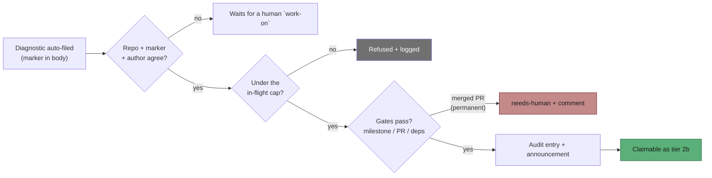

### Intra-tier ordering — oldest first, with a small randomisation pool

Inside a single tier, candidates are sorted by `createdAt` (oldest first) by [`selectOldestCandidate`](../../worker/deno/lib/issue_priority.ts). To reduce claim races when several workers scan simultaneously, introduced a small randomisation pool: when `SelectionOptions.randomFn` is supplied, the worker picks at random from the **N oldest** candidates (default `randomPoolSize = 3`) rather than always taking the single oldest. The fairness guarantee — the worker never picks a far-younger issue over an older one — is preserved by capping the pool at the top of the sorted list.

### Per-repo `nice` tiering and fair within-tier rotation

Within a label tier, the final cross-repo selection is **`nice`-aware**. Each repo carries an optional operator-side `nice` integer (`repo_config.nice`, default `0`; see [CONFIGURATION.md → Per-repo `nice` rotation tier](../CONFIGURATION.md#-per-repo-nice-rotation-tier)). Borrowing Unix-`nice` semantics, **lower `nice` is worked sooner**:

1. **Label tier decides first, fleet-wide.** [`selectHighestPriority`](../../worker/deno/lib/issue_priority.ts) walks the label ladder (`top-priority` → `work-on` → self-scheduled diagnostic → `low-priority` → `idle-task`) as the **outermost** grouping and drains each tier across *every* repo before considering the next. `nice` is a tie-breaker inside a band, never a band of its own (Issue #1063).
2. **Partition by `nice` within the tier.** The candidates of the winning tier are partitioned by their repo's resolved `nice` value, resolved through [`getRepoNice`](../../worker/deno/lib/repo_config.ts), and the lowest-`nice` group wins. A `nice: -1` repo therefore jumps ahead of every default-`nice: 0` repo **of the same tier**; a `nice: 99` filler repo is reached only when every lower-`nice` repo in that tier is idle.
3. **Fair within a `nice` group.** Among repos sharing one `nice` value, [`selectFairWithinTier`](../../worker/deno/lib/issue_priority.ts) rotates fairly across equal repos (oldest-first within a repo, fair rotation across repos when a `randomFn` is injected), so a busy repo in a tier never starves its peers. With the default `nice: 0` everywhere, every repo shares one group and the behaviour reduces to the existing oldest-first selection.

**Why the label wins.** Until Issue #1063, `nice` was the outermost partition: a `nice: -20` repo's ordinary `work-on` backlog was drained before a `nice: -15` repo's `top-priority` issues were even looked at, so `top-priority` meant "top priority *within a repo's `nice` tier*". An urgency signal another repo's routine backlog can outrank is not an urgency signal, so the ordering was inverted to the one the module header always documented. The worked winner-per-combination table lives with the setting itself, in [CONFIGURATION.md → Per-repo `nice` rotation tier](../CONFIGURATION.md#-per-repo-nice-rotation-tier).

**`idle-task` is still the fleet-global floor.** `idle-task` sits below every real-work tier in *every* repo, not just within its own `nice` tier — a low-`nice` repo's tier-4 idle-task scan is never selected ahead of a higher-`nice` repo's tier-2 `work-on` issue (the inversion fixed by Issue #2812). With the label tier now outermost this falls out of the ladder directly: `idle-task` is the last tier walked, so it is reached only when no repo has selectable real work. The per-repo idle suppression is unchanged.

**Scope: new-work selection only.** `nice` tiers the **new-work** scans — the Priority 2 new-issue scan ([`find_oldest_issue.ts`](../../worker/deno/lib/find_oldest_issue.ts)), the label scan ([`find_issues_by_label.ts`](../../worker/deno/lib/find_issues_by_label.ts)), and the planning scan ([`find_planning_issues.ts`](../../worker/deno/lib/find_planning_issues.ts)). It does **not** reorder Priority 1.x in-flight maintenance (PR feedback, CI fixes, revisions): once a piece of work is in flight the worker finishes it regardless of its repo's tier.

### Suppression rules — what can knock out a higher-priority candidate

A `top-priority` issue is **not** automatically picked just because the label is present. Five filters are applied during candidate collection (in [`find_oldest_issue.ts`](../../worker/deno/lib/find_oldest_issue.ts), [`collect_label_candidates.ts`](../../worker/deno/lib/collect_label_candidates.ts), [`collect_work_on_candidates.ts`](../../worker/deno/lib/collect_work_on_candidates.ts), and [`collect_low_priority_candidates.ts`](../../worker/deno/lib/collect_low_priority_candidates.ts)). Any one of them removes the candidate from its tier — the next-oldest issue in the same tier is then considered, and only if every tier 1 candidate is suppressed does the worker fall through to tier 2.

1. **Milestone occupancy** — [`isMilestoneOccupied`](../../worker/deno/lib/issue_filter.ts) skips an issue when a Vibe Coder — this host or a sibling in `fleet_pr_authors`/`service_accounts` — already has another issue assigned in the same `repo + milestone` work stream. Enforces "one issue per milestone per repo at a time". Human-assigned issues do not count: the match set is the fleet-identity set (`resolveFleetMaintenanceAuthorSet`), never the `allowed_authors` permission list.
2. **Open PR blocking** — [`getBlockingPRForIssue`](../../worker/deno/lib/issue_query.ts) skips an issue when the **fleet** already has an open PR targeting the same branch (default branch for non-milestone issues, `milestone/<name>` for milestone issues). Enforces "one PR per work stream" so consecutive work serialises cleanly. Only push-capable fleet accounts (`github_user` + `fleet_pr_authors`) count: a human's open PR never blocks issue pickup — the developer manages their own PR.
3. **Recently-closed PR cooldown** — [`fetchRecentlyClosedPRsByUser`](../../worker/deno/lib/issue_query.ts) plus [`isBlockedByRecentlyClosedPR`](../../worker/deno/lib/issue_query.ts) suppress candidates whose target branch was the subject of a worker-closed (un-merged) PR inside the cooldown window.: prevents the worker from immediately re-opening a PR that was just closed (e.g. a reviewer rejected the approach) before a human has had time to react.
4. **Dependency blocking** — [`extractDependencyReferences`](../../worker/deno/lib/issue_dependencies.ts) and [`checkParentBlocked`](../../worker/deno/lib/issue_dependencies.ts) read `Depends on #N` / `Blocked by #N` markers (and GitHub task-list sub-issues) from the issue body and skip the candidate if any referenced issue is still open. Cross-repo dependencies (`Depends on org/repo#42`) are supported. Fails open on API errors so a transient outage cannot stall the worker.
5. **Content modified after approval** — [`verifyWorkOnContentIntegrity`](../../worker/deno/lib/work_on_content_integrity.ts), backed by [`content_approval_tracker.ts`](../../worker/deno/lib/content_approval_tracker.ts), compares a SHA-256 hash of the issue title + body against the snapshot captured when an allowed author added `work-on`.: if the issue content has been edited by an untrusted author after approval, the candidate is suppressed and the label is removed — TOCTOU protection so a mutated issue body cannot ride a stale approval.

### Blocked configured-label suppresses `work-on` in the same repo + milestone

Even when tier 1 yields no *selectable* candidate, [`selectHighestPriority`](../../worker/deno/lib/issue_priority.ts) does not blindly fall through to tier 2. If a configured-label candidate was found but blocked (e.g. a `top-priority` issue is waiting on a dependency), every `work-on` candidate in the same `repo + milestone` is dropped before the tier 2 pool is considered. The intent is to keep work serialised on the same work stream — a blocked higher-priority issue means the work stream is "occupied by a known higher-priority intent", and the worker should wait rather than race ahead with a lower-priority issue on the same branch. Surviving `work-on` candidates from other repos / milestones remain eligible. If suppression empties tier 2 entirely, selection falls through to tier 3 (`low-priority`) under the same global gate.

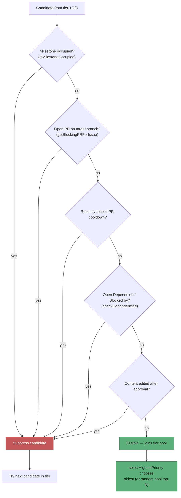

### Per-repo tier suppression — a suppressing `work-on` issue parks the lower tiers

Alongside the per-candidate filters above there is one **per-repo** gate. A repo that holds a *suppressing* open `work-on` issue contributes **no** `low-priority` or `idle-task` candidate to selection at all, and a repo with any open `low-priority` issue contributes no `idle-task` candidate. [`find_oldest_issue.ts`](../../worker/deno/lib/find_oldest_issue.ts) collects the two sets (`reposWithOpenWorkOn`, `reposWithOpenLowPriority`) and [`selectHighestPriority`](../../worker/deno/lib/issue_priority.ts) filters the lower tiers by them. The intent is serialisation: a repo with higher-tier work pending should wait rather than open a backlog PR beside it.

"Suppressing" is narrower than "open", because a `work-on` issue the worker can **never** action would otherwise deadlock the repo's whole backlog behind it. [`collect_work_on_candidates.ts`](../../worker/deno/lib/collect_work_on_candidates.ts) counts, over the post-`filterAndSort` set, the issues whose refusal **clears by itself** — and nothing else. Which gates those are is not written into the rule: it is declared once, per gate, in `SKIP_REASON_CLEARING` ([`skip_reason_clearing.ts`](../../worker/deno/lib/skip_reason_clearing.ts), Issue #524), a map total over `SkipReason`, so a new gate fails the type check until somebody says how it clears.

| `work-on` issue is… | Clearing | Suppresses tier 3/4? | Why |
|---|---|---|---|
| Eligible, or deferred by an open PR / occupied stream / closed-**unmerged** PR cooldown | `self` | **Yes** | Every one of these clears by itself, so waiting is correct. |
| Assigned, carrying a blocking label, or a milestone-tracking tracker | `human` | No — dropped by `filterAndSort` before it is counted | The worker never actions it. |
| Blocked solely by an open dependency | `human` | No | The dependency is often a `low-priority` issue in the same repo; suppressing would deadlock the chain. |
| Named by a **merged** fleet PR (`merged-pr-permanent`) | `permanent` | No | The block is permanent — only a trusted re-label dated after the merge lifts it, or the housekeeping sweep closes the issue outright. |
| Refused for an untrusted label add, or a content change needing re-approval | `human` | No | A person must act before the issue can ever be claimed, so it must not park the backlog meanwhile. |

The rule is checked at the loop's own altitude rather than per gate. `claim_path_monotonicity_test.ts` asserts that adding an issue never leaves the scan with nothing to claim, and that a gate parks the lower tiers **iff** it is declared `self`-clearing; `claim_path_differential_test.ts` replays generated repo states through both the claim scan and the idle-decision census and fails on any disagreement.

Issue #504 attacks the other end of the same fault: the worker only closed an
issue whose PR merged from inside the run working that issue, so a fix merged by
anyone else left the issue open for ever in exactly this refused state. The
housekeeping `merged-pr-issue-sweep` step now closes those issues — see
[INTERNALS.md](../INTERNALS.md) → *Worker driver*, step 4 — so
`merged-pr-permanent` stops being a standing strand rather than merely being
excluded from the suppression signal.

The merged-PR carve-out is Issue #499. `stSoftwareAU/NEAT-AI-Rebase#48` carried `work-on` and was named by merged PR #49, so the scan refused it on every cycle while it parked all 28 of the repo's `low-priority` issues indefinitely — neither the suppressing issue nor anything it suppressed could ever be claimed. The idle-decision census, which does model the merged-PR gate, kept reporting those 28 as claimable and escalated the disagreement as "the claim scan keeps refusing this work". The census now mirrors this gate too and reports a suppressed backlog as `low_priority_suppressed=<n>` (see [IDLE-TASK-FRAMEWORK.md](../IDLE-TASK-FRAMEWORK.md#idle-decision-claimable-work-census)).

Issue #655 is the same shape one step later in the pipeline. After every collector has passed a candidate, `find_oldest_issue.ts` drops the ones `isIssueInCooldown` names — the persisted retry cooldown plus this run's processed-issue registry, whose entries live as long as the process. `stSoftwareAU/VibeCoder#622` and `#623` were both handed back earlier the same day, so the scan refused them silently on every later cycle while the census counted them claimable. The hold set is now resolved once and shared by both readers (`run_local_hold=<n>` in the census line), and the cooldown filters record their refusal in `blockedDetails` so the escalation can name the gate instead of listing the issues and nothing else.

Issue #898 is the same disagreement one level up: not a gate the census missed, but a repository the scan was never shown. `find_oldest_issue.ts` skips every repo in its `excludeRepos` set — those an issue slot (Issue #4176) or the maintenance lane (Issue #213) holds — before any collector runs, so it records no skip reason for a single one of their issues. `stSoftwareAU/VibeCoder` escalated on three consecutive cycles with nine claimable `work-on` issues and an empty "what the claim scan did with them" section, while the lane was busy servicing one of its own PRs. The pool now keeps that exclusion set and hands it to both readers, which report the repo as `skip_reason=repo_held_in_flight` and raise neither the escalation nor the `mis_classification` ALERT for it (see [IDLE-TASK-FRAMEWORK.md](../IDLE-TASK-FRAMEWORK.md#a-repo-the-scan-was-never-shown-issue-898)).

### Why was X picked over Y? — diagnostic surfaces

Two diagnostics answer the "why was this issue selected and not that one?" question without reading TypeScript:

- **`selection-reasoning` log line** — emitted unconditionally by [`logSelectionReasoning`](../../worker/deno/lib/issue_finder_logger.ts) whenever the worker selects a `work-on` (or lower-tier) candidate while configured-label candidates were considered or blocked. The line includes the selected issue, how many configured-label candidates were considered, and which were blocked (`repo#N(reason)`), making the bypass auditable from the worker log alone.
- **`ISSUE_FINDER_DEBUG=true`** — set this environment variable to enable the per-issue trace from [`createDiagnostics`](../../worker/deno/lib/issue_finder_logger.ts). Every candidate considered, eligible, or skipped is emitted to stderr with its skip reason (`milestone-occupied`, `pr-blocked`, `closed-pr-cooldown`, `dependency-blocked`, `content-modified-after-approval`, `cooldown`, `needs-human`, …). Use this when the unconditional `selection-reasoning` line is not enough — for example when no candidate at all was selected.

### How to use `low-priority`

`low-priority` is opt-in per repository. To start using it:

1. Create the label in the target repository (default name `low-priority`, configurable via `low_priority_label` — see [CONFIGURATION.md](../CONFIGURATION.md)). For example:

   ```bash
   gh label create low-priority --repo my-org/my-repo \
     --description "Worker picks up only when idle" --color cccccc
   ```

2. Apply the label to issues you want the worker to handle only when its higher-priority queues are empty — typical examples are backlog documentation tasks, low-risk cleanups, or speculative refactors. As with `work-on`, the label must be added by an allowed author; a non-trusted adder is ignored.
3. Leave higher-priority labels off the issue. If an issue carries both `top-priority` and `low-priority`, tier 1 wins — the `low-priority` label has no effect while a higher tier is in play.

The worker never self-applies `low-priority` — it is a human scheduling signal, listed alongside `top-priority` in the reserved-label set.

## 🛡️ The one-PR-per-issue fleet invariant

The desired end state is **exactly one PR per issue across the whole fleet**.
The fleet runs on several machines, each authenticated as a different GitHub
account (e.g. `Vibecoderbot` on one host, `stsvcbot` on another). Without
fleet-wide guards, two hosts can each open a PR for the same issue — the
duplicate-PR class of bugs seen after /  /. This section
documents the invariant, the two ways it can break, the guard stack that
enforces it, and the single recovery path.

### The two failure modes

| Mode | What happens | Guard that closes it |
|------|--------------|----------------------|
| **A — concurrent cross-account** | Two hosts discover the same open issue at nearly the same time; each passes the discovery open-PR guard because neither PR existed yet, then both open a PR. | Claim-time live re-check. |
| **B — post-merge re-pickup** | An issue's PR has already **merged** (by a sibling account **or** this host's own account), but a later scan re-picks the issue after the cooldown window and opens a *second* PR. | Permanent merged-lock. |

### The guard stack (a duplicate is prevented if ANY layer fires)

1. **Fleet-author union** — every guard resolves its fleet set through
   [`resolveFleetAuthors`](../../worker/deno/lib/fleet_authors.ts), which unions
   the host's own login, `allowed_authors`, **and** `fleet_pr_authors`
   (case-insensitively de-duplicated). A sibling listed in *only one* of those
   keys is still covered — the structural blind spot behind the original
   incident.
2. **Milestone occupancy** —
   [`isMilestoneOccupied`](../../worker/deno/lib/issue_filter.ts) treats a work
   stream as occupied when **any account the fleet operates** already has an
   assigned issue in the same `repo + milestone`, so a sibling host's assignment
   stops a second host starting the same work stream. The set is
   `resolveFleetMaintenanceAuthorSet()` — the same push-capable set layer 3
   uses — so a *human* assignee never occupies a stream.
3. **Discovery open-PR guard** — during candidate collection,
   [`getBlockingPRForIssue`](../../worker/deno/lib/issue_query.ts) over
   [`fetchOpenPRsForFleet`](../../worker/deno/lib/issue_query.ts) skips an issue
   when **any push-capable** fleet account has an open PR targeting the same
   work stream. A human's PR is filtered out first.
4. **Claim-time live re-check** — closes Mode A's residual window. After
   this host wins the atomic-claim comment race and **before any Claude/token
   work begins**, [`claimIssue`](../../worker/deno/lib/claim_issue.ts) performs a
   live, **cache-bypassing** (`forceRefresh`) fleet open-PR re-check. If a fleet
   PR already targets the work stream the claim is **aborted** — the claim
   comment is removed, the assignment released, and the caller receives
   `reason: "fleet_pr_exists"` — so no tokens are spent and no second PR is
   opened. Fails open (a transient API error never blocks a legitimate claim)
   and is skipped when no fleet authors are supplied.
5. **Permanent merged-lock** — closes Mode B.
   [`fetchRecentlyClosedPRsForFleet`](../../worker/deno/lib/issue_query.ts)
   unions every fleet account's closed PRs. A **merged** fleet PR blocks
   re-pickup **permanently**, regardless of the cooldown window; a
   **closed-unmerged** PR only blocks within the cooldown window, preserving the
   retry path. The claim's `fetchIssueState` check additionally **fails closed**
   (treats the issue as closed) after exhausting retries, so a transient error
   never starts work on an already-merged issue.
6. **Branch reuse on retry** — a retry after a **closed-unmerged**
   attempt lands on the same deterministic branch (`issue-<n>-<slug>`);
   [`findClosedUnmergedPrForBranch`](../../worker/deno/lib/pr_issue_linking.ts)
   **reopens** that PR instead of opening a fresh one. A **merged** prior PR is
   never eligible for reuse.

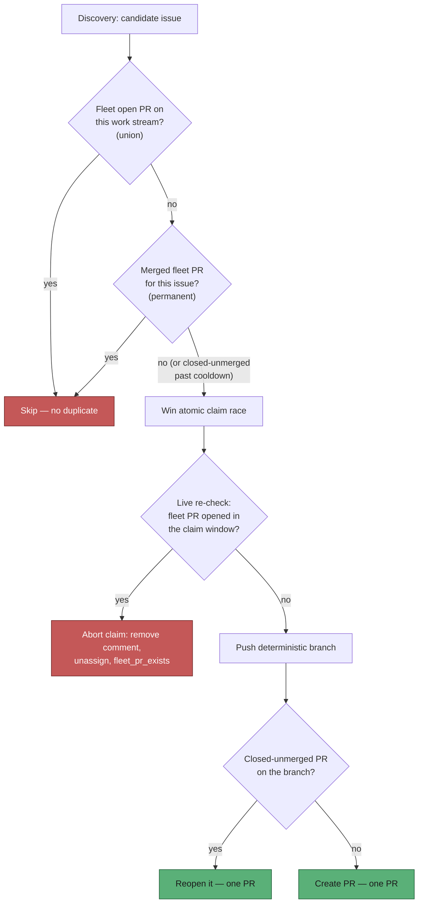

### Configuration requirement — every host must name all fleet accounts

The guards are only as good as the fleet configuration that feeds them.
**Every host must name every fleet account** in `service_accounts` or
`fleet_pr_authors` (its own `github_user` is always covered). Those fleet
logins are write collaborators on the monitored repos — and are then excluded
from the trusted-author set, so they cannot instruct the worker (Issue #1066).
`allowed_authors` plays no part in this any more:
[`validateFleetConfig`](../../worker/deno/lib/fleet_config_validation.ts) runs at
startup and in `diagnose-repo`, emitting a `[fleet-config] WARNING` for a
`fleet_pr_authors` sibling missing from `allowed_authors` and a
`[fleet-config] ERROR` when the effective fleet set is empty (the guard would be
inoperative). See [CONFIGURATION.md](../CONFIGURATION.md) and
[`docs/DUPLICATE-PR-ROOT-CAUSE-3138.md`](../DUPLICATE-PR-ROOT-CAUSE-3138.md).

### Recovery path — human re-open / re-label

Once a fleet PR **merges**, the issue is **done for the fleet** and the permanent
merged-lock keeps it out of discovery. The **only** way an issue becomes eligible
again after a merged PR is a **human** action: re-open the issue, or re-apply the
discovery label (`work-on` / `top-priority` / `low-priority`). This is
prevention-only — there is no auto-close or duplicate-cleanup machinery, and
multi-account fleet operation is retained. A **closed-unmerged** PR needs
no human action: it expires with the cooldown window and the retry path
(branch reuse) takes over automatically.

## Per-cycle trusted-author refresh

Every scan cycle begins by refreshing the trusted-author snapshot
(`refreshTrustedAuthors` in
[`run_core.ts`](../../worker/deno/lib/run_core.ts)): one paginated `gh api`
collaborator list per monitored repo, plus one team-members call when
`exclusion_team` is set. There is no local-array mode to short-circuit it.

That per-tick collaborator fetch is an intentional exception to the
standing rate-limit warning in
[`collaborator_precheck.ts`](../../worker/deno/setup/collaborator_precheck.ts)
(lines 11–19). The setup-time precheck must never run inside the main
loop (~400 `gh` calls per tick already); derived trust *does* run there,
because a stale allowlist would keep a revoked collaborator trusted for
the rest of the run. The added cost is one paginated call per monitored
repo per cycle (and one team call when `exclusion_team` is set). See
[CONFIGURATION.md — Per-cycle refresh and `gh` cost](../CONFIGURATION.md#per-cycle-refresh-and-gh-cost).

A failed refresh is **fail-closed**: the cycle logs `[TRUST_REFRESH]`,
marks the host unhealthy, and skips claiming and every other
trust-dependent pass. A 403 (missing collaborator-read or `read:org`)
is the searchable symptom — the worker does not become silently
permissive. See
[Setup — Token scopes for derived trust](../SETUP.md#token-scopes-for-derived-trust).

## ✅ Happy path

1. **Select issue** — After the trusted-author refresh, scan configured repos for eligible issues (scan order is randomised by default via `shuffle_repos` for fairness — see below); apply filters (labels, authors, blocking labels, dependencies, open PRs (Pull Requests), one-issue-per-milestone —); choose the globally oldest by `createdAt` across all repos.
2. **Claim issue** — Assign self to the issue; brief pause; re-read assignees; if contested, use alphabetical tie-break; losers unassign themselves.
3. **Setup repo** — Clone or update target repo; reset worker repo to `origin/Develop`; create or sync feature branch from default or `milestone/<name>`.
4. **Quality baseline** — Run `./quality.sh` on the clean repo (if it exists) to establish a baseline of any pre-existing quality failures. This baseline is threaded through to failure comments so reviewers can distinguish pre-existing issues from worker-introduced regressions. Non-blocking: work continues regardless of baseline result.
5. **Clarification (important)** — Unless max rounds reached: the worker runs the clarification phase. **(1)** If the issue is **unclear**, it posts questions, adds `needs-human` (the standalone `needs-clarification` label was retired and the handoff consolidated onto `needs-human`), unassigns, and exits (no implementation this run). **(2)** It checks whether the issue is small enough to complete without timing out. **(3)** If **clear but too complex** for a single PR, it posts an escalation comment asking a trusted human to add the `planning` label and unassigns — once the label is added, the issue is processed via the planning workflow to create sub-issues. The worker does not add operational labels itself (see [Worker Label Policy](../../README.md#-supported-labels)). See [Clarification](planning-and-questions.md#clarification) and [Automatic complexity-to-planning escalation](planning-and-questions.md#automatic-complexity-to-planning-escalation-target-behaviour).
6. **Implement** — Run Claude with issue prompt; run `./quality.sh`; commit changes; push branch.
7. **PR** — Build PR body from `docs/pr-summary-<issue>.md` (or `docs/archive/pr-summaries/pr-summary-<issue>.md`, or legacy `.pr_summary`); create or recover PR; enable auto-merge; resolve mergeability as needed.

## 🔀 Repository scan order: fair scanning, then oldest first

When multiple repos are configured, the worker must decide the **order** in which to query them for eligible issues. This is controlled by the `shuffle_repos` configuration option (default: `true`).

- **`shuffle_repos: true` (default)** — Repo scan order is **randomised** each iteration using a Fisher-Yates shuffle. This prevents any single repo from being consistently queried first, avoiding starvation in multi-repo setups. All repos are still scanned; only the query order changes.
- **`shuffle_repos: false`** — Repos are scanned in the order they appear in the `repos` configuration array. This is useful in multi-worker setups where each worker has a different repo list to create per-worker priority.

**Important:** Scan order affects only which repos are **queried first**, not which issue is **selected**. After all repos are scanned and candidates collected, the worker always selects the **globally oldest** eligible issue by creation date. In short: **fair scanning, then oldest first**.

See [CONFIGURATION.md](../CONFIGURATION.md) for the `shuffle_repos` setting.

## 📊 Diagram: issue intake and claim

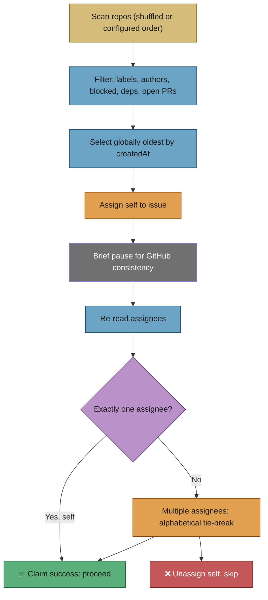

## 🔗 Dependency and parent/child filtering

During issue selection (step 1 of the happy path), the worker checks each candidate issue for **dependency** and **parent/child** relationships before considering it eligible. This filtering happens after label and author checks but before the final oldest-first selection.

### 🔗 Forward dependencies: "Depends on" / "Blocked by"

If an issue body contains `Depends on #N` or `Blocked by #N` (case-insensitive), the worker checks whether issue #N is still open. If **any** referenced dependency is open, the issue is **skipped**. Both `Depends on` and `Blocked by` are treated identically — either one blocks the issue.

Cross-repo dependencies are also supported (e.g. `Depends on org/other-repo#42`). The worker queries the referenced repository to check the dependency's state.

### 👪 Parent/child (sub-issues)

If an issue body contains GitHub task list items referencing other issues (e.g. `- [] `, `- [x] `), the issue is treated as a **parent**. A parent issue is blocked until **all** referenced child issues are closed. Children can be worked on independently (and in dependency order if they have dependencies among themselves).

### 🔒 One-issue-per-milestone enforcement

The worker enforces that **only one issue per repo/milestone combination** can be in progress at a time. During issue selection, the `is_milestone_occupied()` check ensures that if any issue in the same repo and milestone is already assigned, no additional issues from that milestone are eligible. This prevents multiple workers from simultaneously working on different issues in the same milestone — ensuring each issue builds on the completed work from the previous one.

- **Milestone issues** — Only one issue per milestone per repo at a time.
- **Non-milestone issues** — Only one non-milestone issue per repo at a time.

This is separate from the one-PR-per-target-branch rule (which prevents multiple open PRs). The milestone occupation check operates at the **issue assignment** level, while open-PR blocking operates at the **PR** level.

### 🔓 Fail-open design

If the GitHub API (Application Programming Interface) is temporarily unavailable, the dependency checker **fails open** — the issue is treated as **not blocked** rather than stalling the worker indefinitely.

For full details on dependency relationships, milestones, and circular dependencies, see [projects-and-dependencies.md](projects-and-dependencies.md).

## 📊 Diagram: branching and merge flow (gitGraph)

The following `gitGraph` diagram shows how feature branches are created from the `Develop` branch, worked on, and merged back via PR with auto-merge:

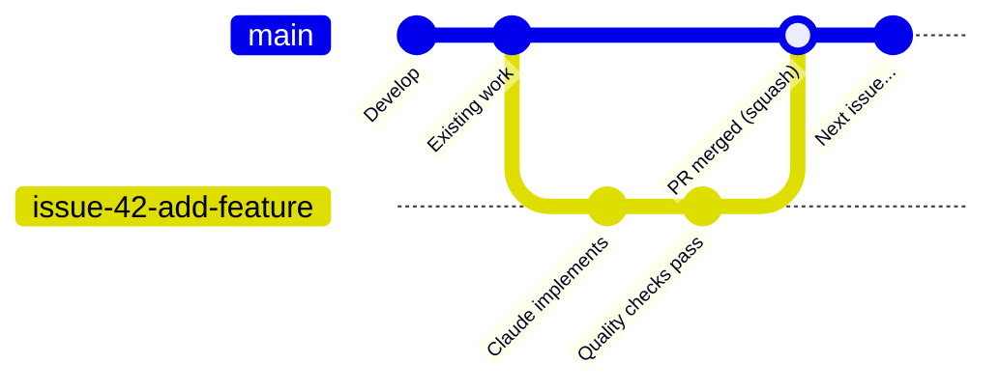

*The `main` line represents the `Develop` branch (default). Each issue gets its own feature branch (`issue-<number>-<title>`), which is merged back via a squash-merge PR with auto-merge enabled.*

## 🔀 Decision points and exceptions

- **No eligible issue:** Skip implementation this iteration; continue to sleep and next loop.
- **Claim fails:** Log and skip; do not retry same issue this run (another worker may have won).
- **Clarification requested:** Post questions, add `needs-human`, unassign; user removes label and responds; next run re-evaluates.
- **Complexity escalation (target behaviour):** If the issue is clear but too complex for a single PR, the worker posts an explanatory comment asking a trusted human to add the `planning` label, and unassigns. The planning workflow then breaks it into sub-issues once the label is added. The worker does not add `planning` itself — see [Worker Label Policy](../../README.md#-supported-labels). See also [Automatic complexity-to-planning escalation](planning-and-questions.md#automatic-complexity-to-planning-escalation-target-behaviour). *Note: This is the target workflow — implementation may not yet fully match this documented behaviour.*
- **Implementation failure (first):** Comment, add `failed-once`, clean stale branch, unassign; next run may retry. **Second failure:** Replace with `failed`, skip thereafter until user removes label.
- **Unrecoverable blocker (`needs-human` escalation):** If the worker determines the task cannot be completed autonomously — e.g. it needs credentials only a human can grant, or depends on a product decision — it adds the `needs-human` label, posts a comment explaining what a human must do next, and stops. The issue is **excluded from discovery** on every subsequent scan until a human removes the label. The worker never self-applies `top-priority` or any other reserved workflow label for this purpose. See [Worker escalation via `needs-human`](#-worker-escalation-via-needs-human) below.
- **Zero output — prior work on remote branch:** If Claude produces no changes but the remote feature branch has commits from a prior attempt (e.g., worker crashed after push but before PR creation), the worker fast-forwards the local branch and proceeds to create the PR. The issue is completed, not failed.
- **Zero output — already-complete check:** If Claude produces no changes and no prior work is found on the remote branch, the worker runs a short follow-up Claude prompt asking "is this issue already complete in the current codebase?" If Claude confirms the work is done (e.g., completed via a different PR or branch), the issue is auto-closed with a comment. If not complete, normal failure handling continues.
- **Blocked on a dependency — deferral:** A run that produces no code changes because the work is blocked on **another issue** is deferred, not closed and not escalated. When the output opens a `Blocked` / `Depends on` section naming an issue other than the one being worked, the worker posts a deferral comment quoting the run's own reason, records `Depends on owner/repo#N` in the issue body (the form the dependency gate reads; the `blocked` label is the fallback when the body cannot be edited), leaves the issue open with its discovery label — no `needs-human` — and releases the claim with the outcome `deferred: depends on owner/repo#N`. The next scan skips the issue until that dependency closes. A run that reports the **same** dependency a second time is not deferred again (the deferral comment carries a hidden marker): the gate did not hold, so the repeat falls through to the analysis-only hand-off and a human sees it rather than the worker spending an agent run per scan. See [`blocked_outcome.ts`](../../worker/deno/lib/blocked_outcome.ts) and [`blocked_deferral.ts`](../../worker/deno/lib/blocked_deferral.ts).
- **Analysis-only / no-PR hand-off:** Some `work-on` issues have no PR deliverable — their outcome is a recommendation, a coverage matrix, or "populate the issue" analysis posted as a comment, with no code/prompt change. Because the pipeline treats a raised PR as its completion signal, a no-PR run used to read as "not done" and the issue was re-picked-up and re-run indefinitely (the loop seen in). Now, when Claude produces useful analysis but no code changes — **or** the issue body declares itself analysis-only up front via the `<!-- analysis-only -->` (or `<!-- no-pr -->`) marker — the worker posts the analysis once, hands the issue off to a human via `needs-human` (so discovery skips it), unassigns, and stops. This is a clean hand-off, **not** a failure — the issue is not marked `failed`. A human reviews the analysis, then adds `planning` to break it into sub-issues or re-adds `work-on` if a code change is genuinely expected. A loop guard sits beneath the clean hand-off: if a prior hand-off comment is already present (the hand-off did not stop the loop — e.g. the label was stripped), the worker escalates the repeat run through the `failed-once` → `failed` ladder so it can never spin forever. See [`handle_no_changes_phase.ts`](../../worker/deno/lib/phases/handle_no_changes_phase.ts) and [`analysis_only.ts`](../../worker/deno/lib/analysis_only.ts).
- **Zero output — cooldown:** After a failure, the issue is skipped for a configurable cooldown period (default 10 minutes) so the worker can process other issues instead of immediately re-picking the same one. The cooldown is per-issue and resets on worker restart.
- **Quality gate fails:** Treated as implementation failure (comment, labels, unassign).
- **Push rejected:** Pull/rebase and retry push; if conflict, create fresh branch and retry (see [resilience-and-concurrency.md](resilience-and-concurrency.md)).
- **Timed-out run — WIP preserved, but no half-done PR:** A hard timeout with a dirty tree commits the work as a `wip:` commit on the claim-locked issue branch and pushes it, so the next claim (or a human) resumes from the branch instead of starting from zero; the release comment names the branch. Because that commit leaves the branch *ahead of base*, the completion phase adds a second guard beside the ahead-of-base check: when **every** commit ahead of base is a worker-authored WIP marker (`wip: …` or `WIP checkpoint: …`) **and** the branch tip is exactly where it stood before this run's agent started, no PR is raised — the resume must advance the branch first. Anything the guard cannot determine (the pre-run HEAD was unreadable, the commit log failed) fails open and the PR proceeds. See [`wip_commit_marker.ts`](../../worker/deno/lib/wip_commit_marker.ts) and [`phases/completion_phase.ts`](../../worker/deno/lib/phases/completion_phase.ts).
- **Preservation runs before the existing-PR lookup:** An interrupted execute (timeout, SIGKILL, external SIGTERM) preserves its work **first**, then asks whether a PR exists. The order matters: the "a PR already exists → treat the run as a success" self-heal used to run first, so *any* PR for the issue — including a sibling host's, and including one already merged — skipped preservation entirely and the run's uncommitted work was discarded. The completion phase's "no commits ahead" bail-out preserves the tree the same way instead of only reporting that uncommitted changes were present. See [`phases/run_wip_preservation.ts`](../../worker/deno/lib/phases/run_wip_preservation.ts).
- **Portable handover note (Issue #769):** Preservation saves the run's *code*; the note saves its *intent*. Beside the `wip:` commit the worker writes `docs/archive/handover/issue-<N>.md` into the clone **before** the commit runs, so the same `commitAndPushPending` carries it to the issue branch. It names the interruption cause, the branch, what was done (the commits this run added and the files it left uncommitted), what remains, and whether a wind-down notice was delivered — all from what the worker already knows, so it needs no agent call and works on the timeout path where no agent is alive. Everything in it is provider-neutral: no host paths, no session ids, nothing specific to one agent. Each interruption **rewrites** the note and keeps a short "previous attempts" tail, so a third claim can see two prior runs were interrupted. The path is the single constant `handoverFilePath()` in [`preserved_wip_branch.ts`](../../worker/deno/lib/preserved_wip_branch.ts), shared with the release comment that advertises it (Issue #770) and the resuming prompt that reads it (Issue #771) — not the `.vibe/…` the issue sketched, because [`gitignore_enforcer.ts`](../../worker/deno/lib/gitignore_enforcer.ts) ignores every hidden path in a monitored repo and [`pre_commit_safety.ts`](../../worker/deno/lib/pre_commit_safety.ts) refuses to commit one, so `git add -A` would have dropped the note silently; `docs/archive/` is excluded from the Jekyll build, the markdownlint globs and the page-title manifest, so free agent prose on a WIP branch cannot trip a docs gate. When the phase-end checkpoint has already left the tree clean, the note alone is committed as `wip: handover note …`, which the #148 WIP-only gate still refuses to build a PR from. A failed write is logged and non-fatal: losing the note never costs the code. See [`handover_note.ts`](../../worker/deno/lib/handover_note.ts).
- **Superseded by another PR (`superseded:pr#N`):** The existing-PR lookup distinguishes an **open** PR (work in flight — the run continues, as before) from a **merged or closed** one (this run has nothing left to raise). A merged sibling PR stops the run cleanly: the claim releases with a `superseded` outcome naming the PR and the branch any preserved WIP is on, the issue is **not** labelled failed, and no `unknown`-class run-failure issue is filed. Every lookup failure fails safe to "open", so a `gh` hiccup can never invent a superseded stop. See [`superseding_pr.ts`](../../worker/deno/lib/superseding_pr.ts) and [`run_outcome.ts`](../../worker/deno/lib/run_outcome.ts).

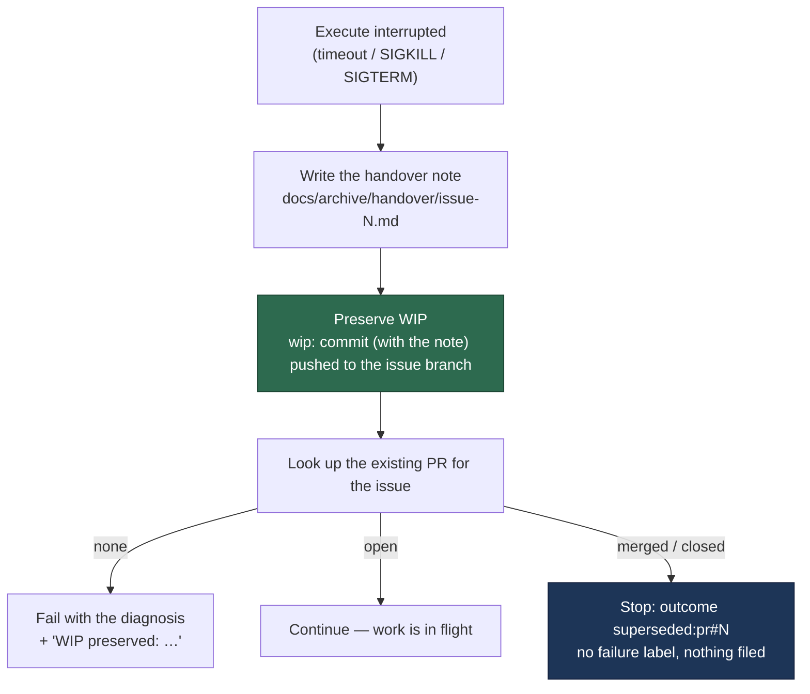

## 🤝 Worker escalation via `needs-human`

Some issues cannot be completed autonomously. Rather than looping or self-applying `top-priority`, the worker escalates through a single, dedicated label: `needs-human` (config key `needs_human_label`, default colour `fbca04`).

**Flow:**

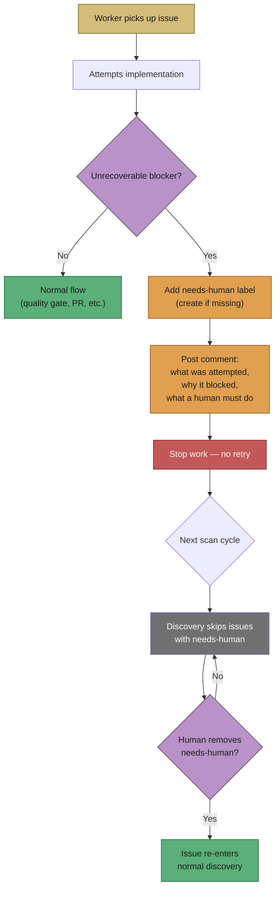

**Typical triggers:**

- The change touches files that require GitHub OAuth scopes or permissions the worker account does not hold.
- Credentials or system access only a human can grant are needed.
- A product or architectural question only a human stakeholder can answer.

**What the worker does not do:** it never self-applies `top-priority`, `work-on`, `low-priority`, `refine-issue`, `planning`, `question`, `best-model`, or the deprecated `help wanted` / `claude` / `needs-clarification` / `skip-clarification` / `answered` labels as an escalation signal. Those are human-scheduling or internal-state labels, not escalation. The single label the Vibe Coder may self-apply is `idle-task`. `needs-human` is the worker's **only** way to hand an issue back to a person.

**Discovery behaviour:** [issue_filter.ts](../../worker/deno/lib/issue_filter.ts) and [issue_finder.ts](../../worker/deno/lib/issue_finder.ts) exclude any issue whose labels include `config.needsHumanLabel`, with a `"needs-human"` skip reason recorded via `diag.logIssueSkipped(...)`. `needs-human` is also part of `OPERATIONAL_LABEL_NAMES` in [label_security.ts](../../worker/deno/lib/label_security.ts) so the timeline check ignores it if a non-trusted user adds it.

**To resume work:** a human resolves the blocker (e.g. grants the missing scope), removes the `needs-human` label, and the worker picks the issue up on the next scan cycle.

For user-facing guidance, see [USAGE.md — Worker escalation via `needs-human`](../USAGE.md#-worker-escalation-via-needs-human). For the config key, see [CONFIGURATION.md — `needs_human_label`](../CONFIGURATION.md#-configuration-defaults).

## 🧭 Analysis-only / no-PR hand-off

`work-on` treats a raised PR as its completion signal. An issue whose only
deliverable is analysis — a gap analysis, coverage matrix, or
"populate the issue" recommendation posted as a comment — produces no PR, so
the "no PR" outcome reads as "not done". Without a dedicated exit the worker
re-picks-up and re-runs the issue indefinitely (the loop, which re-posted
the same matrix plus an "unable to make code changes" note about five times).

The worker now detects an analysis-only / no-PR issue from **two signals** and
hands it off cleanly to `needs-human` (the only operational label the worker may
apply, routed through the [escalation chokepoint](../../worker/deno/lib/needs_human_escalation.ts)):

- **(a) Up-front body marker.** An author, grill-me, or planning can declare an
  issue analysis-only by adding the HTML-comment marker `<!-- analysis-only -->`
  to the issue body. The worker hands off **before** cloning the repo or running
  Claude — no wasted run.
- **(b) Post-run signal.** Claude finishes with **no code changes** but useful
  text (the existing "unable to make code changes" partial-answer path). The
  worker posts the partial answer (the analysis is the deliverable) and then
  hands off.

Both paths apply `needs-human` plus a paired explanation comment,
which drops the issue from discovery and triggers
[`stripDiscoveryLabelsOnEscalation`](../../worker/deno/lib/escalation_cleanup.ts)
to remove `work-on` server-side, so the issue never loops. A clean hand-off is
**not** a `failed` outcome — the task did its job.

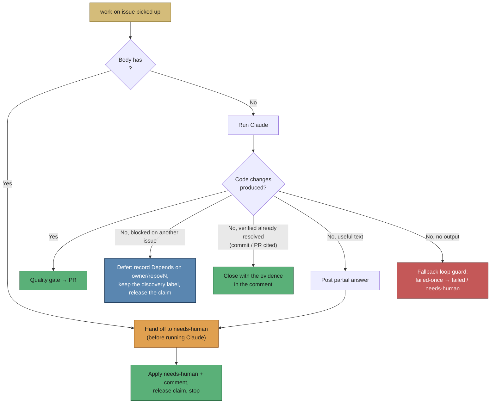

**A verified already-fixed run is closed, not escalated.** When the run reports
the issue already resolved **and cites the evidence** — a commit and/or PR, plus
how it checked — the worker closes the issue with that evidence in the comment.
The agent declares it with
`<!-- vibe-already-resolved commit="…" pr="…" verified="…" -->`
(`prompts/issue/prompt.md`); a broadened keyword list remains as a
fallback for output that carries no marker. A claim with no commit or PR behind
it is *not* enough to close a live issue — that falls through to the analysis-only
hand-off below. See
[already_resolved_outcome.ts](../../worker/deno/lib/already_resolved_outcome.ts).

**A blocked run is checked first.** "Blocked on another issue" is a deferral, not
an analysis-only hand-off — and it is decided before the already-complete check,
because a blocked answer routinely contains phrases such as "no changes needed"
and closing a live task is the one outcome the next scan cannot undo. The agent
cannot make that call itself either: the `gh` guard refuses
`gh issue close|reopen|delete|transfer|lock` on the claimed repo.

**Fallback loop guard.** When neither clean signal fires — Claude produces no
changes **and** no useful output — the run returns a failure and the existing
`failed-once` → `failed` / `needs-human` ladder
([label_failure.ts](../../worker/deno/lib/label_failure.ts)) ensures the issue is
never re-run indefinitely.

**Implementation:** [analysis_only_handoff.ts](../../worker/deno/lib/analysis_only_handoff.ts)
(marker detection + hand-off), wired into
[issue_worker.ts](../../worker/deno/lib/issue_worker.ts) (signal a) and
[handle_no_changes_phase.ts](../../worker/deno/lib/phases/handle_no_changes_phase.ts)
(signal b).

## ✅ Acceptance-criteria closure before the PR

The planner writes a `## Acceptance Criteria` checklist into every published
sub-issue, and until Issue #518 nothing downstream ever read it back: the
implementing run never saw the criteria as a target, and the PR summary never
said which of them were met, so a reviewer had to re-derive the list by hand.
Adopted from GitHub spec-kit's `/speckit.converge` — the *assessment* half of it,
inside the existing implementation run rather than as a new loop (see
[SPEC-KIT-COMPARISON.md](../SPEC-KIT-COMPARISON.md)).

**What the run must produce.** When the issue body carries a
`## Acceptance Criteria` section, `prompts/issue/` requires the run to walk
each criterion before writing the PR summary and record the assessment as a
`## Acceptance Criteria` block in
`docs/archive/pr-summaries/pr-summary-<issue>.md`:

- **`met`** — satisfied by this diff, naming the file or test that evidences it.
- **`partial`** — evidence plus a one-line reason for what is still outstanding.
- **`missing`** — a one-line reason why it is not done.
- **`unrequested`** — a change in the diff not traceable to the issue, with a
  one-line reason. This is the output surface the prose "Change Scope" rule never
  had: scope creep is named in the PR rather than found at review.

**The gate.** [`acceptance_criteria_gate.ts`](../../worker/deno/lib/acceptance_criteria_gate.ts)
parses both artefacts and blocks PR creation in
[`phases/completion_phase.ts`](../../worker/deno/lib/phases/completion_phase.ts)
when a criteria-bearing issue produces a summary with no closure block, with
fewer assessments than criteria, with a `met`/`partial` entry that names no
evidence, or with a gap that carries no reason — an unexplained gap is a failure
to surface, not a pass. The gate comments on the issue naming every rule broken
and the required shape, so the next attempt is productive. Issues with **no**
acceptance criteria are unaffected: the gate does not apply and nothing changes.

**One shape, both gates.** The remediation comment prints
[`REVIEW_BLOCK_TEMPLATE`](../../worker/deno/lib/review_block_template.ts) — the
whole two-axis block, `## Standards Review` included — and so does the
independent-review gate below. A blocked run writes its next summary from the
comment it was just handed, so two templates meant two shapes: the closure
gate's `unrequested` line carried no `reviewer:` field, the independent gate
rejected exactly that, and Issue #728 died in `completion` four times over
copying one gate's answer into the other's rejection. `review_block_template_test.ts`
feeds the printed block back through both validators, so the shapes cannot
drift apart again (Issue #751).

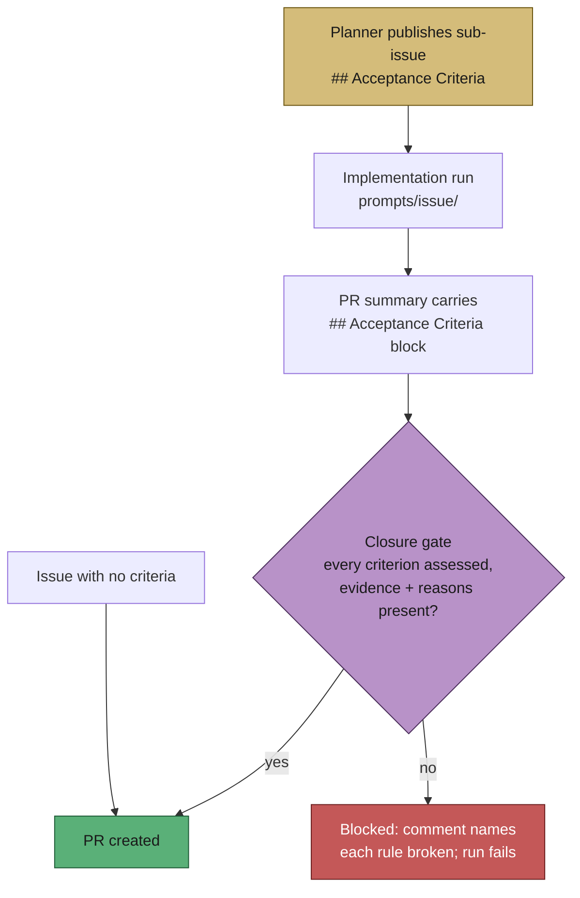

## 🔍 Independent review on two axes

The closure block above says **which** criteria were met; Issue #663 added **who
judged them**. Until then the verdict was self-assessed by the agent that wrote
the code, in the same context that produced it — which is why the prompt had to
counter-steer in wording ("do not inflate a status", "when in doubt use
`partial`"). Adopted from `skills/engineering/code-review/SKILL.md` in
[mattpocock/skills](https://github.com/mattpocock/skills), which solves the same
problem structurally: review the diff on two axes, in independent sub-agent
contexts so they cannot pollute each other, and report them under separate
headings.

**What the run must produce.** When the issue states criteria, `prompts/issue/`
dispatches two reviewer sub-agents in parallel before the PR summary is written,
each given the finished diff and nothing from the author's context:

- **Spec reviewer** — inputs `git diff <base>...HEAD` and the issue body. Three
  questions: which requirements are missing or partial, what behaviour is in the
  diff that was not asked for, and which requirements look implemented but are
  implemented wrongly. Its verdicts populate the `## Acceptance Criteria` block,
  one `reviewer:` verdict per entry.
- **Standards reviewer** — inputs the same diff and `CODING-STANDARDS.md`. Its
  findings go under a separate `## Standards Review` heading as `violation`
  entries (with `file:line` and whether the violation was fixed) and the `clean`
  areas it checked.

**The reviewer challenges; it does not silently win.** A reviewer that saw only
the diff is sometimes wrong about a criterion satisfied by code it could not
see, so the run may depart from its verdict — but only out loud, keeping the
`reviewer:` field as written and adding a one-line `reason:`. An unrecorded
departure is the self-assessment the axis exists to remove.

**The gate.** [`independent_review_gate.ts`](../../worker/deno/lib/independent_review_gate.ts)
runs beside the closure gate at the same PR-creation chokepoint and blocks when
the criteria block carries no `vibe-spec-review` provenance marker, when an entry
names no `reviewer:` verdict, when a departure from that verdict carries no
reason, when the `## Standards Review` section is absent, unsourced or empty,
when a `violation` names no evidence or outcome, or when either axis carries the
other's findings — never merged, never reranked, because a change can pass one
axis and fail the other and reporting them together lets one mask the other.
Issues with **no** acceptance criteria are unaffected: no reviewers, no blocks,
no gate.

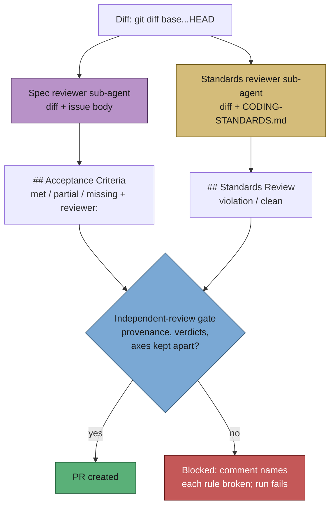

## 🐛 Reproduction status on a bug fix

All three work-tier labels run the **same pipeline** and `bug` is a purely
descriptive label, so until Issue #521 a PR summary that said "added a regression
test" read identically whether the test had been watched to fail before the fix
or merely written afterwards — precisely the over-claim the fail-loud standard
exists to prevent. Adopted from GitHub spec-kit's `bug` extension, whose
guardrail is worth taking whole: *a reproduction that was not actually performed
is reported as `partial` or `not-run`, not `verified`* (see
[SPEC-KIT-COMPARISON.md](../SPEC-KIT-COMPARISON.md)). The vocabulary is adopted,
not the three-command structure: no new label, no new priority tier, no separate
lane — just a conditional block in the existing PR-summary contract.

**What the run must produce.** When the issue carries the `bug` label,
`prompts/issue/` requires a `## Reproduction` block in
`docs/archive/pr-summaries/pr-summary-<issue>.md` recording three things — the
symptom, the status, and the regression test that covers it:

```markdown
## Reproduction

- **symptom** — `parseDate("2024-02-29")` threw `RangeError` on a leap day
- **status** — `verified` — the regression test was observed failing against the unfixed code and passing after the fix
- **regression test** — `worker/deno/tests/date_parser_test.ts::parses a leap day`
```

- **`verified`** — the regression test was actually observed failing against the
  unfixed code and passing after the fix. Only then.
- **`partial`** — the symptom was reproduced in part, with a one-line `reason:`
  for what was not exercised.
- **`not-run`** — the reproduction was not performed, with a one-line `reason:`.
  This is a legitimate, reportable outcome, not a failure to hide.

**How a run climbs to `verified`.** The three statuses defined what to report but
not how to get there, so a hard bug degraded to `not-run` with no ladder to
climb (Issue #661). The prompt now names the method, and it is the same loop the
[CI-fix workflow](ci-fix.md#-the-reproduction-loop-before-the-fix) gained: build a
**red-capable command** first — deterministic, seconds, unattended (`< /dev/null`),
narrow — run it against the unfixed code and watch it go red; **minimise** the red
scenario one element at a time until removing anything left turns it green, and
that minimised scenario is the regression test; apply the fix and watch the same
command go green. The attempt is bounded, and a loop that never went red is
reported as `partial` or `not-run` naming what was tried — the ladder has an
honest bottom rung, which is why it does not become a licence to over-claim.

**The gate.** [`reproduction_status_gate.ts`](../../worker/deno/lib/reproduction_status_gate.ts)
parses the block and blocks PR creation in
[`phases/completion_phase.ts`](../../worker/deno/lib/phases/completion_phase.ts)
when a `bug`-labelled issue produces a summary with no `## Reproduction` block,
no symptom, no recognised status, a `verified` claim that names no regression
test or states no fail-before/pass-after observation, or a downgraded status with
no reason. The gate comments on the issue naming every rule broken and the
required shape. Issues **without** the `bug` label are unaffected.

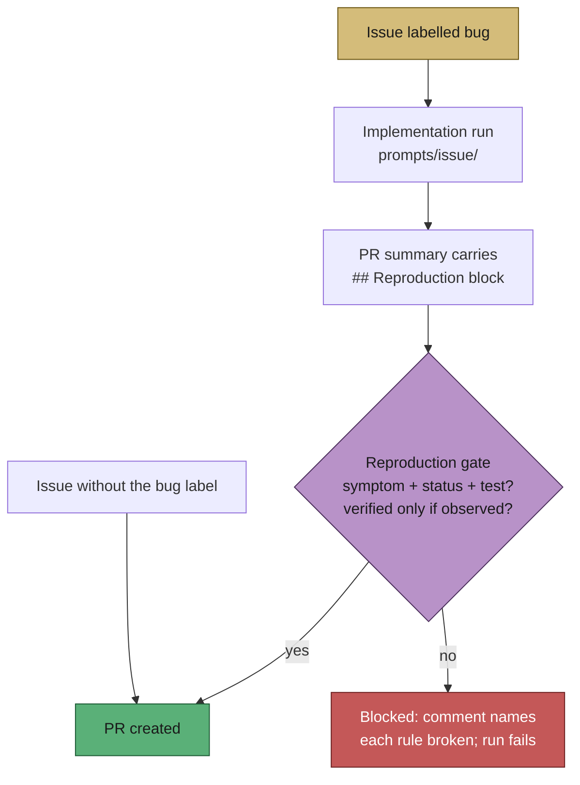

## 🩹 Orphaned milestone merge — self-heal, then bounce

A merged PR is not a landed change. When a child PR merges into
`milestone/<n>-…` **after** that milestone's rollup PR has already merged into
the default branch, the merge commit is unreachable from the default branch and
the work went nowhere, so
[`verifyMergeLanded`](../../worker/deno/lib/merge_landing.ts) reports
`orphaned` and the merged-PR pre-check refuses to close the issue.

Refusing is only half a fix. Reported as a *success*, the refusal made the scan
forget the issue immediately, so both pool slots re-claimed the same issue every
cycle for a whole run (GRQ#4173, 13 bounces in 40 minutes) while every other
claimable issue in the fleet went untouched. Two behaviours close the loop:

- **Self-heal.** The milestone branch is genuinely ahead of the default branch,
  so [`repairOrphanedMilestoneMerge`](../../worker/deno/lib/orphaned_rollup.ts)
  raises a fresh rollup PR (`milestone/<n>-… → <default>`) in the same cycle.
  It is idempotent — an already-open rollup PR for that branch is reported, not
  duplicated — and a branch that is not ahead raises nothing. Once the rollup
  lands, the merge commit becomes reachable and the ordinary close-on-merge path
  closes the issue with no human action.
- **Bounce, not success.** A pre-check that cannot resolve the issue returns an
  **expected skip**: the retry cooldown is recorded (so neither slot re-claims
  it until the window expires), the refusal and the self-heal outcome are stated
  at `WARNING`, no failure tracking or circuit-breaker counting occurs, and
  `WORKER_SUMMARY`'s `issues_processed` does not count the bounce.

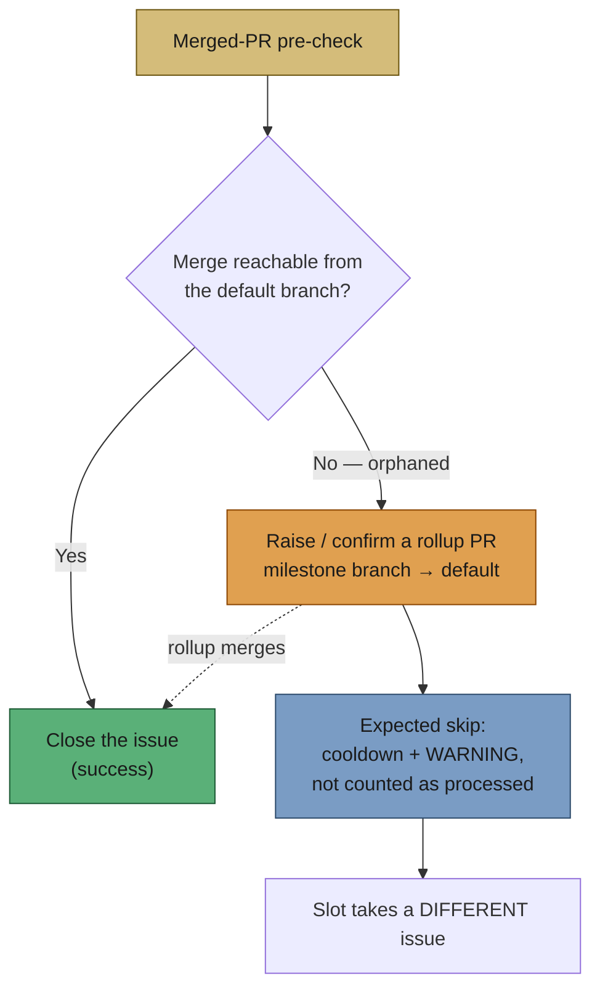

**Implementation:** [orphaned_rollup.ts](../../worker/deno/lib/orphaned_rollup.ts)
(the repair), [phases/merged_pr_precheck_phase.ts](../../worker/deno/lib/phases/merged_pr_precheck_phase.ts)
(detect → self-heal → bounce), `isExpectedSkipResult` in
[issue_worker_types.ts](../../worker/deno/lib/issue_worker_types.ts) (the main
loop's skip-versus-failure classification).

## 🔁 One run, one attempt per issue

The scan ranks a **cached** issue list (`issues_all`, TTL 600 s), and until
Issue #181 the success path recorded no local exclusion at all — only skips and
failures took a cooldown. So an idle-task wrapper that was scanned, commented
and **closed** at 02:02Z was re-claimed and "processed" again at 02:05Z and
02:08Z from the same stale list, while thirteen open wrappers in that repo were
never reached and every bounce counted in `WORKER_SUMMARY`.

Every terminal outcome — success, skip, failure — and every issue the worker
itself closes is now recorded in a per-run
[`ProcessedIssueRegistry`](../../worker/deno/lib/processed_issue_registry.ts):

- **The scan excludes it.** `findNextIssue` treats a registry entry exactly like
  a cooldown entry, across all four candidate tiers, so a free slot advances to
  the next claimable issue instead of re-reading the same stale top candidate.
- **The claim refuses it.** A claim against an issue this run closed returns
  `already_closed` before any API call — a stale "OPEN" can no longer let a
  closed issue be claimed. The claim's own state check
  (`fetchIssueState`) deliberately reads through the **uncached**
  `runGhCommand`.
- **The caches are dropped.** A successful `gh issue close` (or `reopen`) at the
  `gh` chokepoint invalidates that repo's `issues_all`, `issues_closed_all` and
  the issue's own cache entries — see
  [GH-API-OPTIMISATION](../GH-API-OPTIMISATION.md) → *Issue closes are never
  left to the TTL*.

The registry is in-process and one process is one run, so an entry lives exactly
as long as the run: the next run reconsiders the issue normally, and a
`gh issue reopen` clears the entry immediately.

**Diagnosing:** an excluded candidate is logged by
`ISSUE_FINDER_DEBUG=true` with the `cooldown` skip reason; a refused claim logs
`claim_refused … reason=closed_by_this_run`.

**Implementation:**
[processed_issue_registry.ts](../../worker/deno/lib/processed_issue_registry.ts),
[issue_close_notifier.ts](../../worker/deno/lib/issue_close_notifier.ts)
(the chokepoint hook), `noteIssueProcessed` in
[run_core.ts](../../worker/deno/lib/run_core.ts).

## 📚 Further reading

- **Internals:** [Worker Internals](../INTERNALS.md) — run loop, issue selection, PR monitoring, milestone/dependency handling.
- **Implementation details:** [worker/deno/lib/run_core.ts](../../worker/deno/lib/run_core.ts), [worker/deno/lib/issue_worker.ts](../../worker/deno/lib/issue_worker.ts), [worker/deno/lib/issue_finder.ts](../../worker/deno/lib/issue_finder.ts) (orchestrator — refactored into sub-modules,), [worker/deno/lib/issue_query.ts](../../worker/deno/lib/issue_query.ts) (GitHub API queries), [worker/deno/lib/issue_filter.ts](../../worker/deno/lib/issue_filter.ts) (filtering, milestone occupation), [worker/deno/lib/issue_priority.ts](../../worker/deno/lib/issue_priority.ts) (candidate ranking), [worker/deno/lib/issue_cache.ts](../../worker/deno/lib/issue_cache.ts) (caching), [worker/deno/lib/issue_data.ts](../../worker/deno/lib/issue_data.ts) (data extraction), [worker/deno/lib/issue_dependencies.ts](../../worker/deno/lib/issue_dependencies.ts), [worker/deno/lib/claim_issue.ts](../../worker/deno/lib/claim_issue.ts), [worker/deno/lib/git_branch.ts](../../worker/deno/lib/git_branch.ts), [worker/deno/lib/pr_ci_checks.ts](../../worker/deno/lib/pr_ci_checks.ts).
- **User docs:** [README.md](../../README.md), [USAGE.md](../USAGE.md), [CONFIGURATION.md](../CONFIGURATION.md), [projects-and-dependencies.md](projects-and-dependencies.md), [resilience-and-concurrency.md](resilience-and-concurrency.md).
