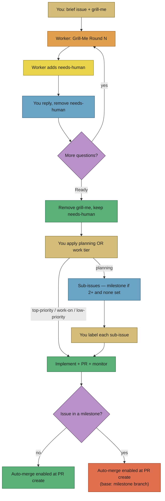
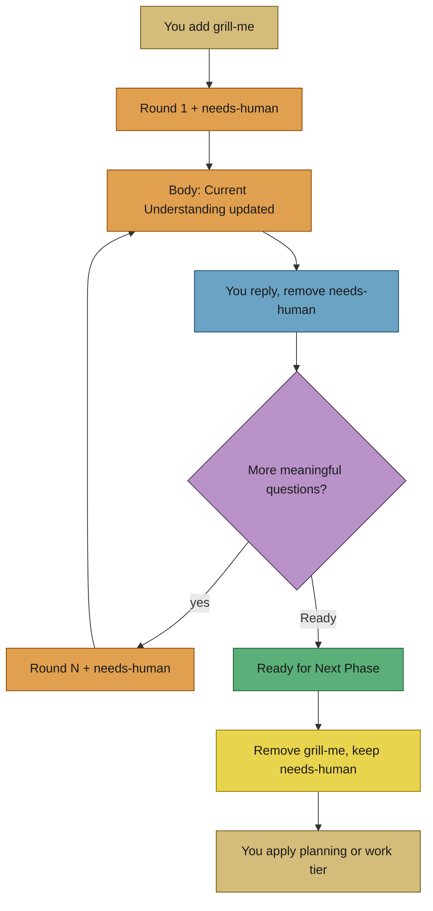
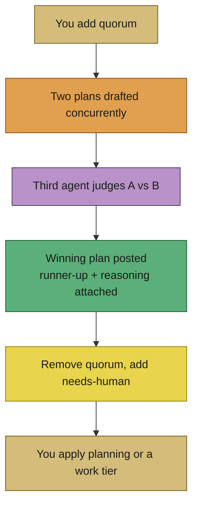
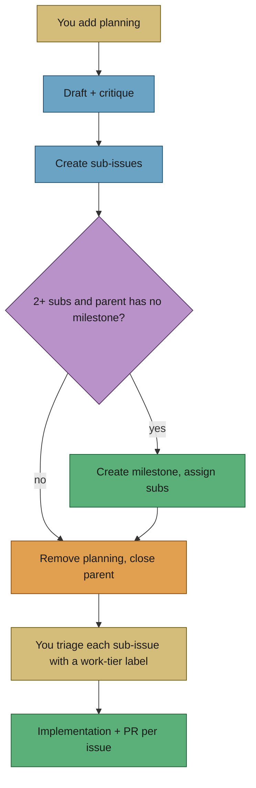
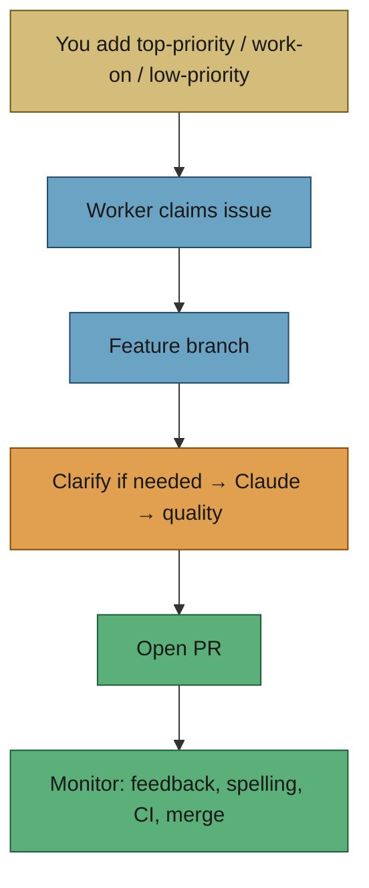
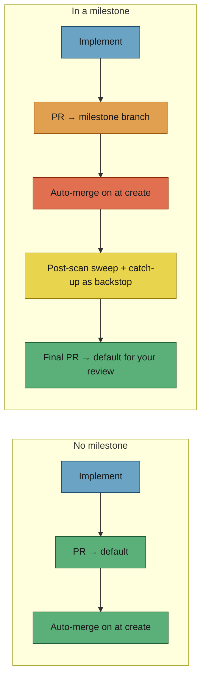

# 🏷️ Label Flows — which label when

This page is the **shareable user guide** for Vibe Coder labels: how you
steer work with GitHub labels, what the worker does next, and whose turn
it is. Fun on purpose. Always grounded in what the code actually does.

For deep dives, see the manuals linked at the end. This page is the map.

---

## ⚡ TL;DR

**Labels are the remote control. Comments are the conversation. PRs are
the deliverable.**

**Default to `grill-me`.** A short brief plus grilling is the most
reliable path to a good PR: you and the worker surface assumptions
*before* any code exists. Once implementation is underway, steering is
harder — the worker keeps anchoring on the branch it already built.
Better to find where you are not seeing eye to eye up front.

Go straight to a work-tier label (`work-on` / `top-priority` /
`low-priority`) **only** when the issue cannot possibly be
misunderstood. In practice that bar is almost never met — even crisp
tickets hide assumptions. If you are unsure, grill first.

1. Open an issue with a brief explanation and add **`grill-me`**. The
   worker asks rounds of questions and pauses with **`needs-human`**
   until you reply and clear that label.
2. When grilling is done, it posts **Ready for Next Phase** and keeps
   **`needs-human`** — you choose **`planning`** or a work tier
   (`top-priority` / `work-on` / `low-priority`).
3. **`planning`** breaks the issue into sub-issues (and may create a
   milestone). You then triage each sub-issue with a work-tier label.
4. A work-tier label means: implement, open a PR, monitor spelling /
   quality / CI. **Every** worker PR gets auto-merge at create — milestone
   issue PRs included (Issue #1136); the catch-up scan is the backstop, not
   the primary mechanism.

There is no label named `human-needed` or `auto-complete`. The pause
signal is **`needs-human`**. Merge automation is GitHub **auto-merge**.

---

## 🤝 Whose turn? Read `needs-human`

`needs-human` is the worker’s **only** escalation / turn-taking label.
While it is on an issue, discovery **skips** that issue. Remove it when
you have answered or unblocked the worker.

| Labels you see | Whose turn | What to do |
| -------------- | ---------- | ---------- |
| `grill-me` alone | Worker | Wait for the next round |
| `grill-me` + `needs-human` | You | Reply to the round, then remove `needs-human` |
| `needs-human` after Ready (no `grill-me`) | You | Apply `planning` or a work-tier label; clear `needs-human` when the worker should pick up |
| `needs-human` on a work issue | You | Read the escalation comment; fix the blocker; remove `needs-human` |

The worker may also add `needs-human` for clarity failures, merge
blocks, analysis-only handoffs, and other stop conditions — always with
a comment explaining the next step.

---

## 🔥 Path A — Grill-me → choose the next phase

**When (and why):** This is the **default** path. Vague briefs, “I know
it when I see it”, *and* tickets that look obvious — most of them can
still be misunderstood. Grilling is cheap insurance: the worker writes
back what it thinks you mean, you correct it while the issue is still
text, and only then do you hand it `planning` or a work tier.

Once coding has started, changing direction is costly. The worker will
keep returning to the branch and understanding it already has; mid-flight
rewrites fight that momentum. Align early, disagree early, then let it
run.

| You | Worker |
| --- | ------ |
| Add `grill-me` (trusted author) | Posts `## Grill-Me Round N` with choices, updates `## Current Understanding` in the body, adds `needs-human` |
| Reply (checkboxes or free text), remove `needs-human` | Next round — or **Ready** when there are no more meaningful questions |
| On Ready: apply `planning`, `work-on`, or `top-priority` (and clear `needs-human` when ready for pickup) | Removes `grill-me`, **keeps / adds `needs-human`**. Never swaps in the next-phase label for you |

Full detail: [Grill-me clarification](grill-me.md).

---

## ⚖️ Path A2 — Quorum plan-off (optional, before planning)

**When:** the *shape* of the plan matters and you want more than one
opinion on it. Two agents draft a plan for the same issue
independently, a third judges the two anonymised drafts, and the worker
posts the winner with the runner-up and the judge's reasoning attached.

It runs **ahead of planning** — Quorum decides *what the plan is*, then
`planning` splits that plan into sub-issues.

| You | Worker |
| --- | ------ |
| Add `quorum` (trusted human; the worker can never self-apply it) | Runs two drafts concurrently, then the judge |
| — | Posts `## Quorum — Winning Plan` with the runner-up and the judge's reasoning in collapsed sections |
| Apply `planning`, a work tier, or close the issue | Removes `quorum`, adds `needs-human`. Never picks the next phase for you |

If the run degrades — a drafter or the judge failed — the worker posts
`## Quorum — Degraded Result` with whatever plans survived and the
degradation named. It never promotes a survivor to "winner".

---

## 📝 Path B — Planning → milestone → triage → work

**When:** Requirements are clear enough to break into pieces, but too
big (or too fuzzy on shape) for one implementation PR.

| You | Worker |
| --- | ------ |
| Add `planning` | Draft → critique → create **sub-issues** (no code, no PRs) |
| — | If **2+** sub-issues and the parent has **no** milestone → create a milestone and assign the sub-issues |
| — | Remove `planning`, close the parent, post a summary |
| Add `top-priority` / `work-on` / `low-priority` on each sub-issue you want implemented | Same implementation pipeline as Path C |

Sub-issues are **not** auto-queued. Planning does not add work-tier
labels for you.

Full detail: [Planning and questions](planning-and-questions.md),
[Milestones](milestones.md).

---

## 🚀 Path C — Direct work (`top-priority` / `work-on` / `low-priority`)

**When:** The **exception**, not the habit. Skip grill-me only when
misunderstanding is essentially impossible — and treat that claim with
suspicion; experience says almost every issue *can* be misunderstood.
The usual safe route is Path A → Ready → then a work tier (or
`planning`). Direct work is fine for tiny, unambiguous chores after you
have already shared the same picture (often post-Ready).

All three work-tier labels mean the **same pipeline**; only **priority**
differs.

| Label | Priority | Notes |
| ----- | -------- | ----- |
| `top-priority` | Highest | Human-only. Picked before everything else in discovery. |
| `work-on` | Next | Trusted author must add it (timeline check). |
| `low-priority` | Fallback | Only when no eligible higher-tier work exists fleet-wide. |
| `idle-task` | Lowest | Worker-filed busywork; only this work-tier is self-appliable by the worker. |

Full detail: [Issue processing](issue-processing.md).

---

## 🔀 PRs, auto-merge, and milestones

There is **no** `auto-complete` label. Behaviour is GitHub **auto-merge**,
driven by the worker after a PR exists.

| Situation | At PR creation | Later |
| --------- | -------------- | ----- |
| Issue **not** in a milestone | Auto-merge **enabled** | Catch-up keeps open worker PRs armed when mergeable |
| Issue **in** a milestone (PR → milestone branch) | Auto-merge **enabled** (Issue #1136) | Priority 1.65 catch-up, plus a post-scan sweep in the same cycle, as the backstop |
| Final consolidation PR (milestone branch → default) | Created for human review of the whole stream | Worker monitors CI / spelling / quality; catch-up may arm auto-merge when mergeable |

> **The divergence recorded here is closed (Issue #1136).** Milestone issue
> PRs used to skip auto-merge at create, which contradicted **F11** in
> [Every slot busy, always](../../DESIGN-PRINCIPLES.md#every-slot-busy-always--the-fleet-throughput-invariant):
> every fleet PR is meant to carry auto-merge from the moment it is raised.
> The stated reason — that milestone PRs "need manual review" — was false
> under **F2a**: a milestone branch carries no approval gate until the
> milestone completes and merges to the default branch, which is precisely why
> milestone streams parallelise. The worker now arms at create on every path,
> and sweeps again after the issue slots drain rather than leaving a stream's
> next issue waiting a whole cycle on a PR that was ready to land (**F10**).

While a PR is open, the worker prioritises keeping **its own** PRs
mergeable: review feedback, spelling, quality, CI fixes. See
[PR feedback and upkeep](pr-feedback.md) and [CI fix](ci-fix.md).

---

## 🗺️ Full label map

Colours match the seeded definitions in
`worker/deno/setup/label_definitions.ts` (hex without `#`).

### Discovery / work tiers

| Label | Colour | Who adds it | What happens |
| ----- | ------ | ----------- | ------------ |
| `top-priority` | `b60205` | Human (trusted) | Highest-priority implementation pickup |
| `work-on` | `5319e7` | Human (trusted; timeline-verified) | Implementation pickup |
| `low-priority` | `c2e0c6` | Human (trusted) | Implementation only when no higher tier is eligible |
| `idle-task` | `cccccc` | Worker (self-appliable) | Lowest-tier implementation / idle findings |
| `ignore-open-prs` | — | Human (trusted) | Bypass open-PR blocking for that issue’s work stream |

### Conversation & planning workflows

| Label | Colour | Who adds it | What happens |
| ----- | ------ | ----------- | ------------ |
| `grill-me` | `fbca04` | Human (trusted) | Iterative scoping rounds; see Path A |
| `quorum` | `5319e7` | Human (trusted) | Two plans drafted, a third agent judges; see Path A2 |
| `planning` | `1d76db` | Human (trusted) | Sub-issues (+ optional milestone); see Path B |
| `question` | `cc317c` | Human (trusted) | Answer in comments; then `needs-human` |
| `refine-issue` | `0366d6` | Human (trusted) | Rewrite title/body from feedback; then `needs-human` |
| `needs-human` | `fbca04` | **Worker** (you remove it) | Pause / your turn — discovery skips until cleared |
| `needs-revision` | `e99695` | Worker / review path | Revision from review feedback |

### State & special cases

| Label | Colour | Who adds it | What happens |
| ----- | ------ | ----------- | ------------ |
| `failed-once` | `fbca04` | Worker | First failure — will retry |
| `failed` | `d73a4a` | Worker | Second failure — skipped until you remove it |
| `documentation` | `0075ca` | Human | Documentation-oriented path / clarification bypass |
| `needs-screenshot` | `d93f0b` | Worker | Missing screenshot evidence; blocks auto-merge until resolved |
| `degraded-model` | `e99695` | Worker | Planning/grill-class run used a fallback model |
| `needs-failure-detection-repair` | `d4c5f9` | Worker | Planning published a usable plan, but named sub-issues still lack their `## Failure Detection` criterion (Issue #59). The parent stays open and is **not** marked `failed-once`. The Priority 1.81 resume pass re-gates the sub-issues each cycle, finishes the repairs, and removes the label — escalating to `needs-human` after 3 failed attempts (Issue #60) |
| `orphan-deps` | `0e8a16` | Worker (idle scan) | Category label on a finding — does **not** queue work alone |

### Content / finding labels

Idle-task finding category labels (security, dead-code, audits, and so
on) are signals for triage. They do **not** start implementation until
a human adds a work-tier label.

Their colours come from the canonical content table in
`worker/deno/setup/content_label_definitions.ts` (Issue #368) — one table for
the whole fleet, so a `severity:critical` in one repo is the same red as a
`severity:critical` in the next.

| Label | Colour | Who adds it | What happens |
| ----- | ------ | ----------- | ------------ |
| `severity:critical` | `b60205` | Worker (scan) | Severity ramp: red → orange → yellow → green as severity falls |
| `severity:high` | `d93f0b` | Worker (scan) | ↑ |
| `severity:medium` | `fbca04` | Worker (scan) | ↑ |
| `severity:low` | `0e8a16` | Worker (scan) | ↑ |
| `confidence:high` | `0e8a16` | Worker (scan) | Confidence ramp — how sure the scan is the finding is real |
| `confidence:medium` | `fbca04` | Worker (scan) | ↑ |
| `confidence:low` | `c2e0c6` | Worker (scan) | ↑ |
| `security` | `b60205` | Worker (scan) | Security-scan finding |
| `lang:<bucket>` | per language | Worker (scan) | Best-practices bucket, in that language's own brand colour |

These labels are **not** seeded at onboarding — a repo grows them the first
time a scan files a matching finding. A fleet that drifted before the table
existed is repaired with
`setup_cli.ts label-colour-reconcile` (`--dry-run` to preview); it repaints
only labels the table names and never creates one.

---

## 🧰 Also useful (short cards)

**`question`** — Want an answer, not a PR? Add `question`. The worker
posts an answer, removes `question`, adds `needs-human`. Re-add
`question` for a follow-up.

**`refine-issue`** — Feedback on title/body? Add `refine-issue` and
comment. The worker updates the issue, removes the label, adds
`needs-human`.

**`failed-once` / `failed`** — Automatic retry bookkeeping. Remove
`failed` to give the issue two fresh attempts.

**`documentation`** — Marks documentation-oriented work; can bypass
some clarification friction when paired with clearing `needs-human`.

**`needs-screenshot`** — UI change lacked evidence. Fix / provide
screenshots; worker injects instructions on retry and holds auto-merge
while this label is present.

**`ignore-open-prs`** — Trusted authors only. Lets work proceed even
when an open PR would normally block that work stream.

**`idle-task`** — Worker-filed lowest priority. Humans triage findings;
adding `work-on` / `top-priority` is how a finding becomes real work.

---

## 📚 Dig deeper

| Topic | Document |
| ----- | -------- |
| Grill-me rounds & Ready | [grill-me.md](grill-me.md) |
| Planning, questions, refine | [planning-and-questions.md](planning-and-questions.md) |
| Discovery → PR | [issue-processing.md](issue-processing.md) |
| Milestone branches & final PR | [milestones.md](milestones.md) |
| PR monitoring & auto-merge catch-up | [pr-feedback.md](pr-feedback.md) |
| End-to-end storyboard | [WORKED-EXAMPLE.md](WORKED-EXAMPLE.md) |
| Workflows hub | [README.md](README.md) |
| Label config keys | [CONFIGURATION.md](../CONFIGURATION.md) |
| Supported Labels (repo index) | [README Supported Labels](../../README.md#-supported-labels) |
