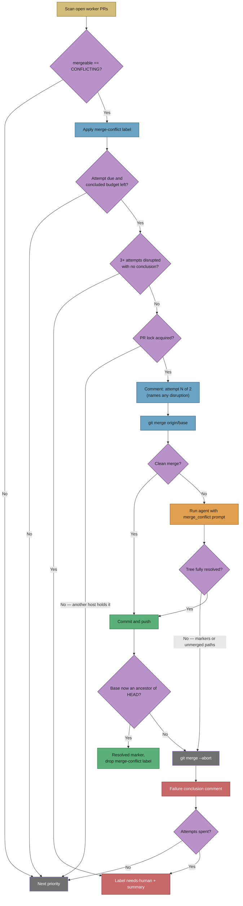

# 🔀 Workflow: Merge-conflict resolution

This page is part of the **user manual** for the Vibe Coder. It describes how
the appliance resolves a PR (Pull Request) whose branch **conflicts with its
base branch**, and what it does when it cannot.

---

## ⚡ TL;DR

**A conflicting PR is a dead end for every other queue, so it gets its own
one.** GitHub runs no `pull_request` workflows on a PR whose merge commit it
cannot build, so there is no failing check for the CI-fix queue to pick up;
reviewers rarely comment on a PR that cannot merge, so there is nothing for the
PR-feedback queue either. Priority **1.61** closes that gap: it labels every
`CONFLICTING` PR `merge-conflict` so the stuck queue is visible, then merges the
base branch into the PR branch **for real** — both sides' changes survive, never
a side-pick — runs the repository's quality gate on the result, and pushes
without force. Two **concluded** attempts, at least four hours apart; after that
the worker escalates with `needs-human` and a conflict summary instead of
retrying forever. Every attempt ends visibly: merged, failed, or escalated. An
attempt that opened and then went silent was disrupted, not judged — it does not
spend the budget, it is re-attempted, and three disruptions on one PR escalate.

---

## 🎯 Purpose and scope

- **Purpose:** give the "this needs a real merge" hand-off a receiver. The
  branch updater (priority 1.6) detects the conflict and deliberately refuses to
  side-pick it — an earlier rebase-and-resolve path silently destroyed a PR's
  own changes — and leaves the branch exactly as its author pushed it.
- **Scope:** open PRs in the push-capable maintenance set (the fleet's own
  logins, plus a human PR whose author explicitly invited the worker) reported
  by GitHub as `mergeable == CONFLICTING`.
- **Not in scope:** PRs already carrying `needs-human` (a human owns those), and
  conflicts whose two sides genuinely contradict each other — those escalate.

## 📏 The contract

The resolution agent runs against a working tree with the merge already in
progress and stopped on conflicts. Its contract is absolute:

- **Both sides survive.** Every conflict has a base-branch change and a PR
  change; both were written deliberately. `-X ours`, `-X theirs`,
  `checkout --ours|--theirs`, and dropping one side's lines are all forbidden.
- **A duplicate is the one exception.** When both sides added the *same*
  content, keeping it once *is* keeping both — and the agent must say so.
- **Stop rather than guess.** Two changes that genuinely contradict each other
  (the same constant set to different values) are a human's decision. The agent
  aborts the merge and explains; the worker escalates.
- **No force-push, no rebase, no branch recreation.** The merge commit
  fast-forwards the remote branch, so every commit on the PR survives.

The worker enforces what it can mechanically: it refuses to push a tree with
unmerged paths or leftover conflict markers, and it verifies the base branch is
genuinely an ancestor of the new branch tip before calling the merge resolved.
Any failure aborts the merge, leaving the branch untouched.

## 🔁 Bounds and escalation

- **One attempt per PR per 4 hours**, at most **2 concluded attempts**.
- The attempt is recorded as a marker comment on the PR **before** the merge
  starts. That marker *opens* the attempt; it does not spend it.
- Every attempt posts a **conclusion**: a resolved marker when the merge lands,
  or a failure comment naming the conflicted files and what went wrong. Only a
  conclusion spends one of the two attempts.
- History lives on the PR, not in host-local state, so the bounds hold across
  worker restarts and across fleet hosts.
- A successful merge posts a resolved marker, which resets both budgets — a PR
  that conflicts again months later starts from a full budget.
- The final *concluded* failure applies `needs-human` and posts one summary
  naming the conflicted files and why the merge failed.

### 💥 When the attempt itself is disrupted

An attempt marker with **no conclusion after it** means the run was cut short
before the merge was ever judged — a worker restart, a swept heartbeat, a
timeout, an exhausted run budget. That is not a verdict on the conflict, so it
must not spend the budget: PRs like GRQ#4408 and GRQ#4409 sat at "attempt 1 of
2" with no conclusion and were then held back for a budget they had never
actually used.

- A disrupted attempt is detected on the next scan (past the cooldown, an open
  attempt is disrupted rather than in flight) and **re-attempted**.
- The next attempt comment says so on the PR — how many attempts were
  disrupted, and that a disruption does not spend the budget.
- Disruption has its own bound: **3 disrupted attempts** on one PR and the scan
  applies `needs-human` with a comment pointing at the worker, not the conflict.
  That escalation runs from the scan, not the resolution pass, precisely
  because the resolution pass may be what cannot finish.

## 👀 Seeing the queue

Every conflicting PR is labelled `merge-conflict` as soon as the scan sees it —
including PRs the worker will not touch this pass. Filter on that label to see
the whole stuck set at a glance. The branch updater's "needs a real merge"
warning now fires **once per PR per process** rather than on every ~2.5-minute
pass, because the label is the queue.

## 🔒 Cross-host locking

The pass takes the same `BRANCH_UPDATE_LOCK` PR lock the branch updater and the
CI-fix path use, so a merge, a rebase and a CI fix can never run against one
branch at the same time. A host that loses the race returns immediately.

## 📎 Further reading

- [PR feedback and upkeep](pr-feedback.md) — branch updates and the auto-merge
  catch-up either side of this pass.
- [CI fix](ci-fix.md) — the queue that takes over once CI can run again.
- `worker/deno/lib/pr_merge_conflict_scan.ts` and
  `worker/deno/lib/pr_merge_conflict_processor.ts` — the implementation.
- `prompts/merge_conflict/` — the versioned agent prompt carrying the contract.
