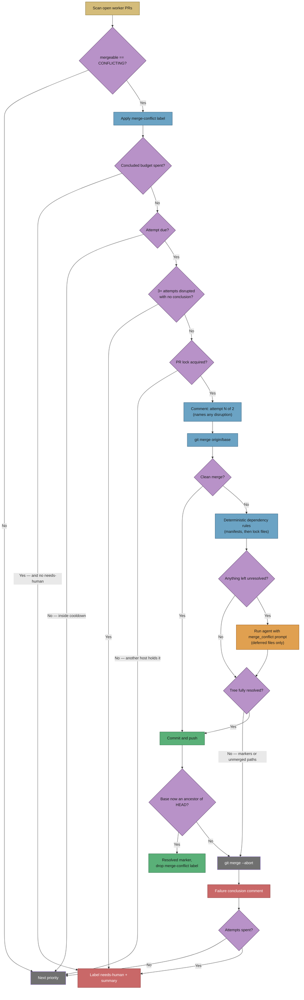

# 🔀 Workflow: Merge-conflict resolution

This page is part of the **user manual** for the Vibe Coder. It describes how
the appliance resolves a PR (Pull Request) whose branch **conflicts with its
base branch**, and what it does when it cannot.

---

## ⚡ TL;DR

**A conflicting PR is a dead end for every other queue, so it gets its own
one.** GitHub runs no `pull_request` workflows on a PR whose merge commit it
cannot build, so there is no failing check for the CI-fix queue to pick up;
reviewers rarely comment on a PR that cannot merge, so there is nothing for the
PR-feedback queue either. Priority **1.61** closes that gap: it labels every
`CONFLICTING` PR `merge-conflict` so the stuck queue is visible, then merges the
base branch into the PR branch **for real** — both sides' changes survive, never
a side-pick — runs the repository's quality gate on the result, and pushes
without force. A dependency-version conflict is settled by deterministic rules
first, and the AI is only asked about what those rules could not decide. Two **concluded** attempts, at least four hours apart; after that
the worker escalates with `needs-human` and a conflict summary instead of
retrying forever. Every attempt ends visibly: merged, failed, or escalated. An
attempt that opened and then went silent was disrupted, not judged — it does not
spend the budget, it is re-attempted, and three disruptions on one PR escalate.



---

## 🎯 Purpose and scope

- **Purpose:** give the "this needs a real merge" hand-off a receiver. The
  branch updater (priority 1.6) detects the conflict and deliberately refuses to
  side-pick it — an earlier rebase-and-resolve path silently destroyed a PR's
  own changes — and leaves the branch exactly as its author pushed it.
- **Scope:** open PRs in the push-capable maintenance set (the fleet's own
  logins, plus a human PR whose author explicitly invited the worker) reported
  by GitHub as `mergeable == CONFLICTING`.
- **Not in scope:** PRs already carrying `needs-human` (a human owns those), and
  conflicts whose two sides genuinely contradict each other — those escalate.

## 📏 The contract

The resolution agent runs against a working tree with the merge already in
progress and stopped on conflicts. Its contract is absolute:

- **Both sides survive.** Every conflict has a base-branch change and a PR
  change; both were written deliberately. `-X ours`, `-X theirs`,
  `checkout --ours|--theirs`, and dropping one side's lines are all forbidden.
- **A duplicate is the one exception.** When both sides added the *same*
  content, keeping it once *is* keeping both — and the agent must say so.
- **Stop rather than guess.** Two changes that genuinely contradict each other
  (the same constant set to different values) are a human's decision. The agent
  aborts the merge and explains; the worker escalates.
- **Dependency versions are the one bounded carve-out.** The prompt says so
  itself: the worker
  settles dependency-version hunks in known manifests before the agent runs, and
  those files are absent from the agent's conflicted-file list. The carve-out
  stops there — a conflicting constant in source code is still a human's call,
  because a version has a total order to appeal to and a source value does not.
- **No force-push, no rebase, no branch recreation.** The merge commit
  fast-forwards the remote branch, so every commit on the PR survives.

The worker enforces what it can mechanically: it refuses to push a tree with
unmerged paths or leftover conflict markers, and it verifies the base branch is
genuinely an ancestor of the new branch tip before calling the merge resolved.
Any failure aborts the merge, leaving the branch untouched.

### 📦 Dependency files are decided before the agent runs

One conflict shape needs no judgement at all: both branches bumped the same
dependency. The agent's contract forbids it from deciding that — "the same value
set to two different values" is a human's call — so the worker settles it
deterministically **before** the agent is asked anything:

- Each conflicted path is offered to the registered manifest rules
  (`deno.json`/`deno.jsonc`, `package.json`, `Cargo.toml`, `go.mod`). Per
  dependency key the higher published version wins, whichever branch carries it,
  and a key only one side has is kept — an ordinary both-sides-survive merge.
- A lock file (`deno.lock`, `package-lock.json`, `Cargo.lock`, `go.sum`) is
  **never** text-merged. It is regenerated from the already-merged manifest with
  the ecosystem's own tool, and only when that toolchain is on `PATH`.
- Resolution is all-or-nothing per file, and a rule-resolved file is staged, so
  the unmerged-path and conflict-marker guards above still cover it.
- **The AI remains the fallback.** Anything the rules cannot decide — an
  undecidable version, a hunk touching more than a dependency map, a source file
  — still goes to the agent, with the prompt's conflicted-file list narrowed to
  exactly those paths. If the rules resolve every conflicted path, the agent is
  not run at all: a `deno.json`/`deno.lock` version conflict costs no AI call.
- The resolved comment on the PR **names every rule-resolved file and every
  version decision** (`@std/fs: ^1.0.0 → ^1.2.0`, taken from the base). This is a
  documented carve-out from the never-side-pick contract, so it states what it
  did and a reviewer can audit the pick without reading the diff.

## 🔁 Bounds and escalation

- **One attempt per PR per 4 hours**, at most **2 concluded attempts**.
- The attempt is recorded as a marker comment on the PR **before** the merge
  starts. That marker *opens* the attempt; it does not spend it.
- Every attempt posts a **conclusion**: a resolved marker when the merge lands,
  or a failure comment naming the conflicted files and what went wrong. Only a
  conclusion spends one of the two attempts.
- History lives on the PR, not in host-local state, so the bounds hold across
  worker restarts and across fleet hosts.
- A successful merge posts a resolved marker, which resets both budgets — a PR
  that conflicts again months later starts from a full budget.
- The final *concluded* failure applies `needs-human` and posts one summary
  naming the conflicted files and why the merge failed.
- **Nothing stalls unowned.** If that final escalation never landed — the label
  add failed, or the run ended between the failure comment and the escalation —
  the next scan finds a PR that is out of budget and carries no `needs-human`,
  and escalates it itself. A spent budget is a quiet skip only once the PR is
  visibly a human's.

### 💥 When the attempt itself is disrupted

An attempt marker with **no conclusion after it** means the run was cut short
before the merge was ever judged — a worker restart, a swept heartbeat, a
timeout, an exhausted run budget. That is not a verdict on the conflict, so it
must not spend the budget: PRs like GRQ#4408 and GRQ#4409 sat at "attempt 1 of
2" with no conclusion and were then held back for a budget they had never
actually used.

- A disrupted attempt is detected on the next scan (past the cooldown, an open
  attempt is disrupted rather than in flight) and **re-attempted**.
- The next attempt comment says so on the PR — how many attempts were
  disrupted, and that a disruption does not spend the budget.
- Disruption has its own bound: **3 disrupted attempts** on one PR and the scan
  applies `needs-human` with a comment pointing at the worker, not the conflict.
  That escalation runs from the scan, not the resolution pass, precisely
  because the resolution pass may be what cannot finish.
- One disruption source is closed outright: the cross-host PR lock is now
  **refreshed while the attempt runs**. The lock TTL is five minutes and a
  resolution runs for as long as the agent takes, so without renewal a second
  host cleaned the lock as stale and started a competing attempt on the same
  branch — racing the first one's push and leaving it looking disrupted.

### 🤫 Why #116 went silent

NEAT-AI-Ockham#116 was labelled `merge-conflict` at 23:00:34Z on 4 Sep 2026 and
nothing visible happened for over three hours. **No merge-conflict code was at
fault** — the pass ran, and the queue was genuinely empty (Issue #1108). The
reconstruction, from the retained GRQ-25 worker logs and the PR's own timeline:

| Time (UTC) | What the logs say |
| --- | --- |
| 22:55:44 | PR #116 opened, 2 commits behind `Develop`. |
| 23:00:34 | Labelled `merge-conflict` by a sibling host's scan. |
| 23:03:06 | GRQ-25 runs priority 1.61 — 25 s later the run hits a GitHub **primary rate limit** and exits; reset at 00:03:31. |
| 00:08:36 | Priority 1.61 leads the rotated lane, runs 18 s and 30 `gh` calls, takes nothing. Priority 1.6 reports #116 in the same cycle as `reason=behind`, **not** conflicting. |
| 00:26:06 | Rate-limited again; reset at 01:26:06. |
| 01:31:23 | Priority 1.61 runs again, takes nothing. |
| 02:50:36 | #116 merges cleanly. |

The two decisive lines, verbatim:

```text
[2026-09-04 23:03:31Z] INFO: Primary rate limit hit mid-cycle — pausing until reset at 2026-09-05 10:03:31 AEST (in 1h 0m).
[2026-09-05 00:05:08Z] INFO: PR #116 … is 2 commit(s) behind Develop — needs update repo=stSoftwareAU/NEAT-AI-Ockham prNumber=116 reason=behind
```

Two things account for the silence — a **fourth cause**, not one of the three
candidates, and neither half is a merge-conflict defect:

- **Roughly two of the three hours were a GitHub primary-rate-limit pause.**
  Only two cycles in the window reached the maintenance lane at all. Pausing
  until the reset is correct behaviour, not a fault; how the fleet spends a
  rate-limited hour belongs to #1072 / #997, not here.
- **In those two cycles the pass was right to take nothing.** #116's conflict
  had cleared; only the label remained. `findConflictingPr` decides on the live
  `mergeable` state (`worker/deno/lib/pr_merge_conflict_scan.ts`), never on the
  label, so a stale label reads as an empty queue — correctly.

The three candidates considered, and why each is ruled out:

1. **The launcher was down** (#1072, GRQ-23) — no. `run_core.log` records five
   container runs starting on GRQ-25, the host monitoring NEAT-AI-Ockham,
   across the window.
2. **`claimable=0 reason=pr_blocked` gated the repo out** — no. That gate is
   per-*issue* and belongs to the Priority 2 claim path
   (`worker/deno/lib/idle_detect_diagnostics.ts:587`, reported at `:1026`), and
   the audit that emits the line is invoked at `worker/deno/lib/run_core.ts:3849`,
   inside `runIdleWorkHooks` — which runs *after* the priority dispatch and the
   maintenance lane, at the idle-task filer's gate. The conflict pass takes no
   claimability input at all: `findConflictingPr` filters repos by
   `isRepoAllowed` alone, wired to the monitored-repo allowlist at
   `worker/deno/lib/run_core_production_deps.ts:1944`. The deadlock this would have been —
   a repo whose PRs are blocked never running the pass that unblocks them —
   does not exist, and `merge_conflict_pr_blocked_reachability_test.ts` now
   pins it.
3. **The lane never gave the pass its slot** (#608) — no. Rotation was working:
   1.61 led the lane at 00:08:36 and started within the same second.

**The lesson for the next quiet queue: read the live `mergeable` state, not the
label.** A PR keeps `merge-conflict` after its conflict clears, so a labelled PR
with no attempt marker is the *expected* shape once the base moves on — check
whether the pass ran, then whether GitHub still calls the PR `CONFLICTING`,
before assuming a stall.

## 👀 Seeing the queue

Every conflicting PR is labelled `merge-conflict` as soon as the scan sees it —
including PRs the worker will not touch this pass. Filter on that label to see
the whole stuck set at a glance. The branch updater's "needs a real merge"
warning now fires **once per PR per process** rather than on every ~2.5-minute
pass, because the label is the queue.

## 🚰 One cycle empties the queue

The pass takes **every** conflicting PR that is due, not one per cycle
(Issue #561). A conflicting PR is a PR CI will not run on, and the open-PR gate
holds new issue claims behind open PRs, so draining conflicts one per cycle —
most of an hour once issue work is running — throttled issue throughput too.

Three bounds keep the drain from becoming a monopoly:

| Bound | Value | Why |
| --- | --- | --- |
| Cycle deadline | 10 minutes must remain | Each attempt runs an agent. One started without room is abandoned at the deadline, and an abandoned attempt is a *disrupted* attempt on the PR's record — three of those escalate it to a human. |
| Per-cycle cap | 5 PRs | One repository's backlog cannot take the whole run. |
| Exclusion set | this cycle's PRs | A PR already taken — or deferred because an issue slot holds its repository — is not re-selected, so the drain cannot spin on it. |

The per-PR budgets are unchanged: the 4-hour cooldown, two concluded attempts
and `needs-human` are the scan's, and the drain only decides how many of the
PRs already due get taken now.

## 🏷️ `needs-human` is a veto, so a mechanical stall does not get one

The scan skips any PR carrying `needs-human`. That is correct for what the
label now means — a human must decide — but it made the label a
**cross-subsystem veto**: one lane's judgement about red CI removed a PR from
this lane's queue, for a reason this lane had no part in. VibeCoder #549 was
stranded exactly that way (Issue #569).

A PR that is behind, conflicting, red or unmergeable is **work**. Those
blockages are now filed as issues the fleet can claim
(`worker/deno/lib/escalate_as_work.ts`), and the PR carries the non-vetoing
`escalated` marker instead. `needs-human` is reserved for what genuinely needs
a person: a policy call, a credential, confirming intent.

## 🔁 The lane rotates, so this pass is not always last

The four agent-backed passes share one lane slot. They used to run in a fixed
order with conflict resolution last, so it got whatever the others left — on a
busy host, nothing:

```text
04:16:44Z [m1] Priority 1.55: CI Fix
04:26:44Z [m1] [watchdog] CI Fix exceeded hard timeout 600s — abandoning
04:26:44Z [m1] stop reason=deadline — Resolve PR Merge Conflicts … defer
```

The order now rotates by one each cycle (`worker/deno/lib/lane_rotation.ts`),
so every pass leads once per turn. The offset is persisted on the work volume
because runs get as few as one lane cycle each, and a run-local counter would
leave a single-cycle host always leading with the same pass. Nothing about the
resource bound changes: still one agent-backed pass at a time.

## 🔒 Cross-host locking

The pass takes the same `BRANCH_UPDATE_LOCK` PR lock the branch updater and the
CI-fix path use, so a merge, a rebase and a CI fix can never run against one
branch at the same time. A host that loses the race returns immediately.

## 📎 Further reading

- [PR feedback and upkeep](pr-feedback.md) — branch updates and the auto-merge
  catch-up either side of this pass.
- [CI fix](ci-fix.md) — the queue that takes over once CI can run again.
- `worker/deno/lib/pr_merge_conflict_scan.ts` and
  `worker/deno/lib/pr_merge_conflict_processor.ts` — the implementation.
- `worker/deno/lib/merge_conflict_drain.ts` — the per-cycle drain loop and its
  three bounds.
- `worker/deno/lib/dependency_conflict_apply.ts` — the deterministic pass the
  processor runs before the agent: it applies the registered rules, regenerates
  the lock files whose manifest resolved, stages what it resolved, and returns
  the deferred paths with a reason each. A deferral stages and changes nothing.
- `worker/deno/lib/dependency_conflict_decisions.ts` — derives the
  per-dependency decisions the resolved PR comment reports, from the rule's own
  output, so the comment can never describe a pick the rules did not make.
- `worker/deno/lib/dependency_conflict_rules.ts` — the pure conflict-hunk
  parser, dependency-version comparator and manifest-rule registry that
  deterministic path is built on.
- `worker/deno/lib/dependency_conflict_json.ts` — the JSON manifest rules
  registered against that seam: `deno.json`/`deno.jsonc` (`imports`, `scopes`)
  and `package.json` (`dependencies`, `devDependencies`, `peerDependencies`,
  `optionalDependencies`). Per dependency key the higher semver wins, whichever
  branch carries it; a hunk touching anything else, or one undecidable version,
  defers the whole file.
- `worker/deno/lib/dependency_lock_regen.ts` — lock files are **never**
  text-merged: `deno.lock`, `package-lock.json`, `Cargo.lock` and `go.sum` are
  regenerated from the already-merged manifest with the ecosystem's own tool,
  and only when that toolchain is on `PATH` in the container. An unresolved
  manifest, a missing toolchain, a failing command or a lock that still carries
  markers all defer the file, staging nothing.
- `worker/deno/lib/dependency_conflict_native.ts` — the non-JSON manifest rules
  on the same seam: `Cargo.toml` (`[dependencies]`, `[dev-dependencies]`,
  `[build-dependencies]` and their `[target.*.dependencies]` variants, in both
  the short and inline-table entry forms — only the `version` field is compared,
  so a changed `features` or `default-features` defers) and `go.mod` (`require`
  lines, single-line and parenthesised-block forms; `+incompatible` and
  pseudo-versions are undecidable).
- `prompts/merge_conflict/` — the versioned agent prompt carrying the contract.
