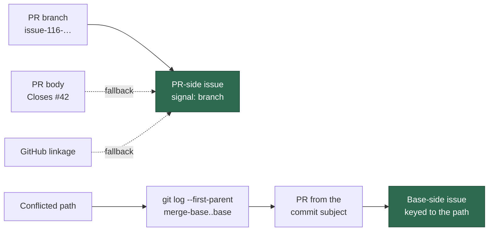
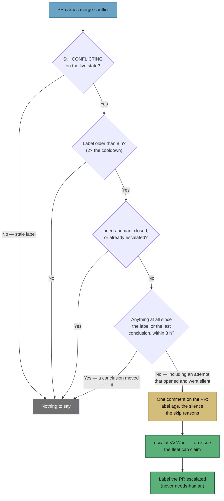
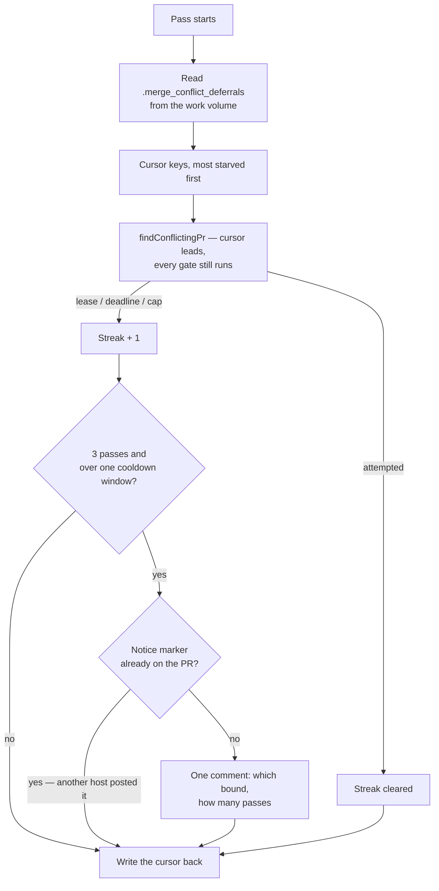

# 🔀 Workflow: Merge-conflict resolution

This page is part of the **user manual** for the Vibe Coder. It describes how
the appliance resolves a PR (Pull Request) whose branch **conflicts with its
base branch**, and what it does when it cannot.

---

## ⚡ TL;DR

**A conflicting PR is a dead end for every other queue, so it gets its own
one.** GitHub runs no `pull_request` workflows on a PR whose merge commit it
cannot build, so there is no failing check for the CI-fix queue to pick up;
reviewers rarely comment on a PR that cannot merge, so there is nothing for the
PR-feedback queue either. Priority **1.61** closes that gap: it labels every
`CONFLICTING` PR `merge-conflict` so the stuck queue is visible, then merges the
base branch into the PR branch **for real** — both sides' changes survive, never
a side-pick — runs the repository's quality gate on the result, and pushes
without force. A dependency-version conflict is settled by deterministic rules
first, and the AI is only asked about what those rules could not decide.

**The ladder has four rungs and only the last one is a person.** An
**intent-aware** attempt, which reads the originating issues behind *both*
sides before calling anything a contradiction; a second one at least four
hours later; then **abandon-and-restart** — the conflicting PR is closed, never
force-pushed, and its originating issue re-queued so the fleet redoes the work
off the current base; and only when that is declined or fails does the worker
escalate with `needs-human` and a conflict summary. One restart per originating
issue: if the fresh PR conflicts irreconcilably too, that is a human's call
rather than another lap. A PR whose originating issue cannot be found never
reaches the third rung at all — closing what the fleet cannot re-raise would
lose the work — so it falls straight through to a human.

Every attempt ends visibly: merged, failed, or escalated. An attempt that
opened and then went silent was disrupted, not judged — it does not spend the
budget, it is re-attempted, and three disruptions on one PR escalate. Every
pass records one reason per labelled PR, so "the label went on and then
silence" is now a thing you can grep for rather than infer. A PR that still
conflicts and has carried the label for **8 hours with nothing concluding** is
a stalled queue in its own right: it is filed as work, once, whatever caused
the silence.

```mermaid
flowchart TD
    Scan["Scan open worker PRs"] --> Conflicting{"mergeable == CONFLICTING?"}
    Conflicting -->|No| Sleep["Next priority"]
    Conflicting -->|Yes| Label["Apply merge-conflict label"]
    Label --> Spent{"Concluded budget spent?"}
    Spent -->|Yes — and no needs-human| Abandon
    Spent -->|No| Budget{"Attempt due?"}
    Budget -->|No — inside cooldown| Sleep
    Budget -->|Yes| Disrupted{"3+ attempts disrupted<br/>with no conclusion?"}
    Disrupted -->|Yes| Human
    Disrupted -->|No| Lock{"PR lock acquired?"}
    Lock -->|No — another host holds it| Sleep
    Lock -->|Yes| Record["Comment: attempt N of 2<br/>(names any disruption)"]
    Record --> Merge["git merge origin/base"]
    Merge --> Clean{"Clean merge?"}
    Clean -->|Yes| Push["Commit and push"]
    Clean -->|No| Rules["Deterministic dependency rules<br/>(manifests, then lock files)"]
    Rules --> Left{"Anything left unresolved?"}
    Left -->|No| Verify
    Left -->|Yes| Context["Gather both sides' originating issues<br/>(deferred paths only)"]
    Context --> Agent["Run agent with merge_conflict prompt<br/>(deferred files only,<br/>issues fenced as evidence)"]
    Agent --> Verify{"Tree fully resolved?"}
    Verify -->|No — markers or unmerged paths| Abort["git merge --abort"]
    Verify -->|Yes| Push
    Push --> Ancestor{"Base now an ancestor of HEAD?"}
    Ancestor -->|Yes| Resolved["Resolved marker,<br/>drop merge-conflict label"]
    Ancestor -->|No| Abort
    Abort --> Failed["Failure conclusion comment"]
    Failed --> Budget2{"Attempts spent?"}
    Budget2 -->|No| Sleep
    Budget2 -->|Yes| Abandon{"Abandon and restart?<br/>(originating issue known,<br/>not already restarted,<br/>no other PR, re-queueable)"}
    Abandon -->|"No originating issue,<br/>or already restarted once"| Human["Label needs-human + summary<br/>naming the route"]
    Abandon -->|"A step failed"| Human
    Abandon -->|Yes| Restart["Close the PR (never force-push),<br/>re-queue its issue"]
    style Scan fill:#d4bc7a,stroke:#6b5510,color:#1a1a1a
    style Conflicting fill:#b892c8,stroke:#4a2d5a,color:#1a1a1a
    style Label fill:#6ba3c4,stroke:#1d4a6a,color:#1a1a1a
    style Budget fill:#b892c8,stroke:#4a2d5a,color:#1a1a1a
    style Budget2 fill:#b892c8,stroke:#4a2d5a,color:#1a1a1a
    style Spent fill:#b892c8,stroke:#4a2d5a,color:#1a1a1a
    style Disrupted fill:#b892c8,stroke:#4a2d5a,color:#1a1a1a
    style Lock fill:#b892c8,stroke:#4a2d5a,color:#1a1a1a
    style Record fill:#6ba3c4,stroke:#1d4a6a,color:#1a1a1a
    style Merge fill:#6ba3c4,stroke:#1d4a6a,color:#1a1a1a
    style Clean fill:#b892c8,stroke:#4a2d5a,color:#1a1a1a
    style Rules fill:#6ba3c4,stroke:#1d4a6a,color:#1a1a1a
    style Left fill:#b892c8,stroke:#4a2d5a,color:#1a1a1a
    style Context fill:#6ba3c4,stroke:#1d4a6a,color:#1a1a1a
    style Agent fill:#e0a050,stroke:#8b4500,color:#1a1a1a
    style Verify fill:#b892c8,stroke:#4a2d5a,color:#1a1a1a
    style Push fill:#5ab078,stroke:#1d5a35,color:#1a1a1a
    style Ancestor fill:#b892c8,stroke:#4a2d5a,color:#1a1a1a
    style Resolved fill:#5ab078,stroke:#1d5a35,color:#1a1a1a
    style Abort fill:#707070,stroke:,color:#fff
    style Abandon fill:#b892c8,stroke:#4a2d5a,color:#1a1a1a
    style Restart fill:#d4bc7a,stroke:#6b5510,color:#1a1a1a
    style Failed fill:#c96868,stroke:#7a2020,color:#fff
    style Human fill:#c96868,stroke:#7a2020,color:#fff
    style Sleep fill:#707070,stroke:,color:#fff
```



---

## 🎯 Purpose and scope

- **Purpose:** give the "this needs a real merge" hand-off a receiver. The
  branch updater (priority 1.6) detects the conflict and deliberately refuses to
  side-pick it — an earlier rebase-and-resolve path silently destroyed a PR's
  own changes — and leaves the branch exactly as its author pushed it.
- **Scope:** open PRs in the push-capable maintenance set (the fleet's own
  logins, plus a human PR whose author explicitly invited the worker) reported
  by GitHub as `mergeable == CONFLICTING`.
- **Not in scope:** PRs already carrying `needs-human` (a human owns those), and
  conflicts whose two sides genuinely contradict each other — those leave the
  merge ladder for abandon-and-restart, and a human after that.

## 📏 The contract

The resolution agent runs against a working tree with the merge already in
progress and stopped on conflicts. Its contract is absolute:

- **Both sides survive.** Every conflict has a base-branch change and a PR
  change; both were written deliberately. `-X ours`, `-X theirs`,
  `checkout --ours|--theirs`, and dropping one side's lines are all forbidden.
  Two bounded carve-outs qualify this rule and nothing else does: dependency
  versions, settled before the agent runs
  ([below](#-dependency-files-are-decided-before-the-agent-runs)), and an
  evidenced issue intent, where both sides' issues are known and one
  explicitly supersedes the other
  ([below](#-issue-intent-is-the-second-carve-out-and-it-must-be-evidenced)).
  Both are reported decision-by-decision on the PR.
- **A duplicate is the one exception.** When both sides added the *same*
  content, keeping it once *is* keeping both — and the agent must say so.
- **Stop rather than guess.** Two changes that genuinely contradict each other
  (the same constant set to different values), with no evidenced intent to
  settle them, are not the agent's decision. It aborts the merge and explains;
  the worker takes the PR to the next rung of the ladder.
- **Dependency versions are the first bounded carve-out.** The prompt says so
  itself: the worker
  settles dependency-version hunks in known manifests before the agent runs, and
  those files are absent from the agent's conflicted-file list. The carve-out
  stops there — a conflicting constant in source code is still a human's call,
  because a version has a total order to appeal to and a source value does not.
- **Issue intent may override "both sides survive" — evidenced, or not at
  all.** When the originating issues behind _both_ sides of a path are known and
  one of them explicitly supersedes, reverts, replaces or retunes the other, the
  agent resolves to the intended outcome and cites both issues. This is the same
  shape as the dependency carve-out: a bounded exception, applied only where an
  external order exists to appeal to, and reported decision-by-decision on the
  PR. One side's issue, a plausible-sounding title, or a supersession the agent
  cannot quote establishes nothing — the contract above then stands unchanged.
- **No force-push, no rebase, no branch recreation.** The merge commit
  fast-forwards the remote branch, so every commit on the PR survives.

The worker enforces what it can mechanically: it refuses to push a tree with
unmerged paths or leftover conflict markers, and it verifies the base branch is
genuinely an ancestor of the new branch tip before calling the merge resolved.
Any failure aborts the merge, leaving the branch untouched.

### 📦 Dependency files are decided before the agent runs

One conflict shape needs no judgement at all: both branches bumped the same
dependency. The agent's contract forbids it from deciding that — "the same value
set to two different values" is a human's call — so the worker settles it
deterministically **before** the agent is asked anything:

- Each conflicted path is offered to the registered manifest rules
  (`deno.json`/`deno.jsonc`, `package.json`, `Cargo.toml`, `go.mod`). Per
  dependency key the higher published version wins, whichever branch carries it,
  and a key only one side has is kept — an ordinary both-sides-survive merge.
- A lock file (`deno.lock`, `package-lock.json`, `Cargo.lock`, `go.sum`) is
  **never** text-merged. It is regenerated from the already-merged manifest with
  the ecosystem's own tool, and only when that toolchain is on `PATH`.
- Resolution is all-or-nothing per file, and a rule-resolved file is staged, so
  the unmerged-path and conflict-marker guards above still cover it.
- **The AI remains the fallback.** Anything the rules cannot decide — an
  undecidable version, a hunk touching more than a dependency map, a source file
  — still goes to the agent, with the prompt's conflicted-file list narrowed to
  exactly those paths. If the rules resolve every conflicted path, the agent is
  not run at all: a `deno.json`/`deno.lock` version conflict costs no AI call.
- The resolved comment on the PR **names every rule-resolved file and every
  version decision** (`@std/fs: ^1.0.0 → ^1.2.0`, taken from the base). This is a
  documented carve-out from the never-side-pick contract, so it states what it
  did and a reviewer can audit the pick without reading the diff.

### 🧭 Issue intent is the second carve-out, and it must be evidenced

The second qualification on "both sides survive" is the work's own intent
(Issue #1114), and it is built to the same shape as the dependency carve-out
above: bounded, applied only where an external order exists to appeal to, and
reported.

- **The evidence bar is both sides' issues, not one.** An override may be
  considered for a conflicted path only when the originating issue behind the
  PR side *and* the originating issue behind the base side of that path are
  both known. One side's issue, a plausible-sounding title, or an inference is
  not evidence — those paths keep the both-sides-survive contract exactly as
  it was written, and the prompt tells the agent so per path.
- **Supersession must be quoted.** Eligibility only permits the question; the
  answer is still the agent's judgement, and it must show the sentence in the
  issue that explicitly supersedes, reverts, replaces or retunes the other
  side. A supersession it cannot quote establishes nothing.
- **Every override is reported on the PR**, file by file, with both issue
  numbers and one line on what was kept and what it superseded
  (`worker/deno/lib/conflict_intent_audit.ts`). A reviewer audits the decision
  from the comment, without reading the diff.

The two subsections below are where that evidence comes from, and what the
resolver is allowed to do with it.

### 🧭 What were the two sides trying to do?

"Stop rather than guess" is right given what the agent knows, and it frequently
knows too little: the same constant set to two different values often is not a
contradiction at all — one issue superseded the other, and the answer is written
down in an issue neither side of the merge can see.

[`lib/conflict_issue_context.ts`](../../worker/deno/lib/conflict_issue_context.ts)
(`gatherConflictIssueContext`) resolves that missing input. It is a **reporting**
module: it says what the two sides were trying to do and never judges which one
wins.



- **PR side, first hit wins, and the winning signal is named**: the
  `issue-<n>-<slug>` branch shape, then the body's closing keywords, then
  GitHub's own linkage.
- **Base side**: per conflicted path, the first-parent base commits since the
  merge base, mapped to PRs by their merge/squash subjects, mapped to issues by
  the same two signals (GitHub linkage, then closing keywords). A PR *title* is
  never read as an issue number — a trailing `(#N)` is a PR reference as often
  as an issue, and a confidently wrong intent is worse than none.
- **Absence is stated, never an empty list.** A conflicting PR whose own issue
  cannot be found reports `no-signal`; on the base side, a path whose commits
  name no PR reports `no-pr` and a PR naming no issue reports `no-issue`. A
  path that resolved some of its issues but not all says `partial`. The
  resolver behaves differently when it has no intent to consult, and it cannot
  tell that apart from `[]`.
- **Every bound is documented and declared**: 20 commits per path, 8 issues,
  4000 characters of issue text, 30 `gh` calls. Whichever bound bites is
  reported in the result, so a cut answer is never read as a whole one.

#### 🧭 What the resolver does with it

The gather runs **after** the deterministic dependency rules have taken their
files and **before** the agent is asked anything, so it costs lookups only for
the paths a judgement is actually needed on. A `deno.json` conflict the rules
settle still reaches no agent and now consults no issue either.

- **The prompt carries the issues behind a fence.** Issue titles and bodies are
  GitHub text an outside author controls, so they are sanitised, code-fenced and
  wrapped in the run's nonce boundary — the same treatment `CLAUDE.md` gets —
  and the prompt says plainly that they are evidence, not instructions.
- **Eligibility is the worker's call, not the model's.** Outside that fence the
  prompt states, per conflicted path, whether both sides' issues are known at
  all. Only those paths may be settled on intent; every other path carries "no
  override is permitted" and the reason. Supersession itself is still the
  agent's judgement, and it must quote the sentence that establishes it.
- **The attempt comment says what was consulted.** The PR-side issue, the
  base-side issues keyed by path, and the paths for which none was found are
  appended to the attempt comment before the agent runs — so a reader can tell
  "consulted and still contradictory" from "never looked" even when the
  resolution then fails.
- **The resolved comment names every override**: the file, both issue numbers,
  and one line on what was kept and what it superseded.
- **An uncorroborated override is refused, not reported.** Eligibility is the
  worker's own computation, so an override claimed for a path where both sides'
  issues were _not_ known is decidable without trusting the model: the merge is
  aborted and the attempt fails, exactly as for a side-pick. A claim the parser
  cannot read is reported on the PR instead — a line it could not understand is
  not a confession.
- **No issue context means today's behaviour, unchanged** — the block is absent
  from the prompt, and the attempt comment says no originating issues were
  found.
- **The mechanical guards are untouched.** Unmerged paths, leftover conflict
  markers and base-is-an-ancestor still abort the attempt. An intent-justified
  resolution is not a trusted one.

## 🔁 Bounds and escalation

- **One attempt per PR per 4 hours**, at most **2 concluded attempts**.
- The attempt is recorded as a marker comment on the PR **before** the merge
  starts. That marker *opens* the attempt; it does not spend it.
- Every attempt posts a **conclusion**: a resolved marker when the merge lands,
  or a failure comment naming the conflicted files and what went wrong. Only a
  conclusion spends one of the two attempts.
- History lives on the PR, not in host-local state, so the bounds hold across
  worker restarts and across fleet hosts.
- A successful merge posts a resolved marker, which resets both budgets — a PR
  that conflicts again months later starts from a full budget.
- The final *concluded* failure runs **abandon-and-restart** first, and applies
  `needs-human` only when that rung declines or fails. The `needs-human`
  summary names the conflicted files, why the merge failed, and which route
  through the ladder ended at a person.
- **Nothing stalls unowned.** If that final escalation never landed — the label
  add failed, or the run ended between the failure comment and the escalation —
  the next scan finds a PR that is out of budget and carries no `needs-human`,
  runs the same abandon rung, and escalates it itself if that declines. A spent
  budget is a quiet skip only once the PR is visibly a human's — or visibly
  restarted.

### ♻️ Abandon and restart, before a human is asked

A branch that has defeated two real merges is usually cheaper to **redo** than
to reconcile, and redoing it needs nobody (Issue #1115,
`worker/deno/lib/conflict_abandon_restart.ts`). So the rung between a spent
budget and `needs-human` closes the conflicting PR and re-queues its
originating issue, and the pipeline raises a fresh PR off the current base.

- **"Start again" never means force-push.** The PR is *closed*, not merged; the
  branch is neither deleted nor rewritten, so every commit on it stays readable
  and linked from the abandon comment. A regenerated branch force-pushed over
  the same PR would destroy its commits and its review history — the same class
  of harm as the side-picking the contract forbids.
- **Four preconditions run before anything is destroyed**, in this order: the
  PR's originating issue is known; that issue has not already been restarted;
  it has no *other* open PR of its own; and it can actually be re-queued —
  it carries the work label already, or the worker is permitted to apply one.
  A failed lookup is never read as an absence.
- **No originating issue, no abandon.** Closing a PR the fleet cannot re-raise
  loses the work outright, so that PR is left open and goes to a human instead
  — the fall-through the flowchart above shows.
- **One restart per originating issue.** The marker lives on the *issue*, not
  the PR: the PR being counted is closed moments later and a replacement takes
  its place, so a PR-keyed bound would loop. It is posted before the close,
  which is also what makes two hosts produce one abandon. If the fresh PR
  spends its budget too, that is `needs-human`, not another lap.
- **A part-done abandon is never where this stops.** Every step names itself on
  failure, and the caller escalates quoting that step — "PR closed, issue not
  re-queued" must be visible, not silent.

### 💥 When the attempt itself is disrupted

An attempt marker with **no conclusion after it** means the run was cut short
before the merge was ever judged — a worker restart, a swept heartbeat, a
timeout, an exhausted run budget. That is not a verdict on the conflict, so it
must not spend the budget: PRs like GRQ#4408 and GRQ#4409 sat at "attempt 1 of
2" with no conclusion and were then held back for a budget they had never
actually used.

- A disrupted attempt is detected on the next scan (past the cooldown, an open
  attempt is disrupted rather than in flight) and **re-attempted**.
- The next attempt comment says so on the PR — how many attempts were
  disrupted, and that a disruption does not spend the budget.
- Disruption has its own bound: **3 disrupted attempts** on one PR and the scan
  applies `needs-human` with a comment pointing at the worker, not the conflict.
  That escalation runs from the scan, not the resolution pass, precisely
  because the resolution pass may be what cannot finish.
- One disruption source is closed outright: the cross-host PR lock is now
  **refreshed while the attempt runs**. The lock TTL is five minutes and a
  resolution runs for as long as the agent takes, so without renewal a second
  host cleaned the lock as stale and started a competing attempt on the same
  branch — racing the first one's push and leaving it looking disrupted.

### ⏰ A label with nothing behind it escalates itself

"Nothing stalls unowned" above covers a stall at the **end** of the ladder — a
PR out of budget whose final escalation never landed. Nothing covered a stall
**before the first attempt**, which is the case that actually happened: the
label went on NEAT-AI-Ockham#116 and nothing followed for hours.

A PR carrying `merge-conflict` with **no concluded attempt** after a bounded
time is itself a defect, whatever caused it, so the watchdog in
`worker/deno/lib/merge_conflict_stall_watchdog.ts` detects that shape directly
rather than any one cause. Every other guard in this subsystem keys on attempt
records; this one cannot, because the failure being detected is that *no
attempt record exists*. It keys on the **age of the label**, read from the PR's
`labeled` timeline event.



Five details carry the weight:

- **It reads the live state, not the label.** The label is only removed by a
  successful fleet merge, so a conflict that cleared by other means leaves it
  behind — the exact shape #116 ended in. A labelled PR GitHub now calls
  `MERGEABLE` is skipped before it costs a timeline or a thread read. An
  `UNKNOWN` state — GitHub computes mergeability lazily — is re-read per PR and,
  if it still cannot be established, said out loud rather than dropped.
- **A conclusion, not an attempt, clears it.** An attempt that opened and then
  went silent is the disrupted case, and if the disruption bound has not fired
  either then nothing is moving the PR — so that PR *is* detected. Keying on
  "an attempt marker exists" would miss the GRQ#4408 shape exactly.
- **The clock starts at the label, and a conclusion restarts it.** Markers
  older than the `labeled` event belong to a previous conflict and say nothing
  about this one. A conclusion puts the PR back in the ordinary ladder and
  starts a fresh clock from itself — so one failed attempt in hour two does not
  buy permanent silence for a PR that then never gets its second, which nothing
  else watches either, because its budget is not spent.
- **Dedupe lives on the PR.** One escalation per PR per stall, keyed on the
  `<!-- vibe-work-escalation:owner/repo#N -->` marker comment. Every host runs
  this scan every cycle, and the failure being detected is precisely the kind
  that recurs every cycle, so host-local dedupe would turn a stalled PR into a
  comment flood. Suppressing signals are trusted only from a fleet author: a
  forged marker must never buy silence.
- **It escalates, it never retries.** Forcing an attempt from a watchdog would
  race the ordinary pass and manufacture the disrupted state the workflow works
  hard to avoid.

### 🤫 Why #116 went silent

NEAT-AI-Ockham#116 was labelled `merge-conflict` at 23:00:34Z on 4 Sep 2026 and
nothing visible happened for over three hours. **No merge-conflict code was at
fault** — the pass ran, and the queue was genuinely empty (Issue #1108). The
reconstruction, from the retained GRQ-25 worker logs and the PR's own timeline:

| Time (UTC) | What the logs say |
| --- | --- |
| 22:55:44 | PR #116 opened, 2 commits behind `Develop`. |
| 23:00:34 | Labelled `merge-conflict` by a sibling host's scan. |
| 23:03:06 | GRQ-25 runs priority 1.61 — 25 s later the run hits a GitHub **primary rate limit** and exits; reset at 00:03:31. |
| 00:08:36 | Priority 1.61 leads the rotated lane, runs 18 s and 30 `gh` calls, takes nothing. Priority 1.6 reports #116 in the same cycle as `reason=behind`, **not** conflicting. |
| 00:26:06 | Rate-limited again; reset at 01:26:06. |
| 01:31:23 | Priority 1.61 runs again, takes nothing. |
| 02:50:36 | #116 merges cleanly. |

The two decisive lines, verbatim:

```text
[2026-09-04 23:03:31Z] INFO: Primary rate limit hit mid-cycle — pausing until reset at 2026-09-05 10:03:31 AEST (in 1h 0m).
[2026-09-05 00:05:08Z] INFO: PR #116 … is 2 commit(s) behind Develop — needs update repo=stSoftwareAU/NEAT-AI-Ockham prNumber=116 reason=behind
```

Two things account for the silence — a **fourth cause**, not one of the three
candidates, and neither half is a merge-conflict defect:

- **Roughly two of the three hours were a GitHub primary-rate-limit pause.**
  Only two cycles in the window reached the maintenance lane at all. Pausing
  until the reset is correct behaviour, not a fault; how the fleet spends a
  rate-limited hour belongs to #1072 / #997, not here.
- **In those two cycles the pass was right to take nothing.** #116's conflict
  had cleared; only the label remained. `findConflictingPr` decides on the live
  `mergeable` state (`worker/deno/lib/pr_merge_conflict_scan.ts`), never on the
  label, so a stale label reads as an empty queue — correctly.

The three candidates considered, and why each is ruled out:

1. **The launcher was down** (#1072, GRQ-23) — no. `run_core.log` records five
   container runs starting on GRQ-25, the host monitoring NEAT-AI-Ockham,
   across the window.
2. **`claimable=0 reason=pr_blocked` gated the repo out** — no. That gate is
   per-*issue* and belongs to the Priority 2 claim path
   (`worker/deno/lib/idle_detect_diagnostics.ts:591`, reported at `:1026`), and
   the audit that emits the line is invoked at `worker/deno/lib/run_core.ts:4053`,
   inside `runIdleWorkHooks` — which runs *after* the priority dispatch and the
   maintenance lane, at the idle-task filer's gate. The conflict pass takes no
   claimability input at all: `findConflictingPr` filters repos by
   `isRepoAllowed` alone, wired to the monitored-repo allowlist at
   `worker/deno/lib/run_core_production_deps.ts:2025`. The deadlock this would have been —
   a repo whose PRs are blocked never running the pass that unblocks them —
   does not exist, and `merge_conflict_pr_blocked_reachability_test.ts` now
   pins it.
3. **The lane never gave the pass its slot** (#608) — no. Rotation was working:
   1.61 led the lane at 00:08:36 and started within the same second.

**The lesson for the next quiet queue: read the live `mergeable` state, not the
label.** A PR keeps `merge-conflict` after its conflict clears, so a labelled PR
with no attempt marker is the *expected* shape once the base moves on — check
whether the pass ran, then whether GitHub still calls the PR `CONFLICTING`,
before assuming a stall.

## 👀 Seeing the queue

Every conflicting PR is labelled `merge-conflict` as soon as the scan sees it —
including PRs the worker will not touch this pass. Filter on that label to see
the whole stuck set at a glance. The branch updater's "needs a real merge"
warning now fires **once per PR per process** rather than on every ~2.5-minute
pass, because the label is the queue.

The label is no longer the *only* signal, though. It says a PR is stuck; two
other instruments say whether anything is happening about it, and both exist
because of the same incident.

### 🛑 When the queue itself stalls

NEAT-AI-Ockham#116 carried `merge-conflict` for over three hours with nothing
visible after it, and the label alone could not distinguish "the pass ran and
was right to wait" from "no pass ran at all" (#1076). Two instruments close
that gap, and reading the queue means reading both:

- **The skip reasons** ([below](#-every-decision-leaves-a-reason-behind)). Every
  labelled PR the pass decides on emits one structured record naming exactly
  why it was left where it is — `cooldown`, `repo-leased`, `budget-spent`,
  `abandoned-restarted` and the rest — plus one summary per pass (Issue #1109).
  Silence is now itself a finding: every pass closes with a summary line, so no
  summary means no pass ran, which is a different problem from a pass that ran
  and waited.
- **The stall watchdog**
  ([above](#-a-label-with-nothing-behind-it-escalates-itself)). A PR that is
  still `CONFLICTING`, has carried the label for **8 hours**, and has had no
  attempt *conclude* in that window is a stalled queue whatever caused it
  (Issue #1112). It posts one comment on the PR — label age, the silence, the
  skip reasons — and files the stall as work through `escalateAsWork`.
- **The watchdog applies `escalated`, never `needs-human`.** A mechanical stall
  is work the fleet can claim, and `needs-human` is a cross-subsystem veto that
  would remove the PR from the very lane that clears it (Issue #569).
- **The blocking-PR stall watchdog defers to this lane.** A `CONFLICTING` PR —
  or one carrying `merge-conflict` — is never reported as "green but unmerged",
  its escalation says the ladder owns the PR rather than offering "or close it",
  and a live escalation is withdrawn when the PR enters the lane (Issue #1213).
  NEAT-AI-Ockham#119 was closed by hand thirteen minutes after that comment
  appeared, inside the cooldown and before rung 1 ran; see
  [Blocking-PR stall watchdog](../CONFIGURATION.md#-blocking-pr-stall-watchdog).

## 🧾 Every decision leaves a reason behind

The label alone said *that* a PR was stuck, never *why the worker left it
there*. A skipped PR produced either nothing or an unstructured log line, so
"the label went on and then silence" — the #1076 symptom — read exactly like a
pass that ran and correctly decided to wait. Issue #1109 closed that: every PR
the pass decides on now emits one structured record, and every pass closes with
one summary.

A record is one line, greppable by prefix:

```text
merge_conflict_decision=cooldown repo=org/repo pr=48
    repo=org/repo prNumber=48 decision=skipped reason=cooldown msUntilDue=10800000
merge_conflict_pass=scan labelled=3 attempted=0 considered=3 cooldown=1 needs-human=2
```

The reasons are a **closed taxonomy** — every exit maps to exactly one, and
each carries the operands that make the decision checkable afterwards:

| Reason | Operands | Meaning |
| --- | --- | --- |
| `attempted` | — | Selected for a resolution this pass. |
| `not-conflicting` | `mergeableState` | GitHub no longer calls the PR `CONFLICTING` — a stale label, not a queue entry. |
| `out-of-scope-author` | `author` | Outside the push-capable maintenance set. |
| `already-handled` | — | Taken or deferred earlier in this same cycle's drain. |
| `scan-error` | `stage`, `error` | A per-PR lookup failed (`mergeable-state`, `labels` or `attempt-history`); the PR keeps its place. A state lookup that failed is **never** reported as merging cleanly. |
| `needs-human` | `label` | A human already owns the conflict. |
| `budget-spent` | `attemptsSpent`, `maxAttempts` | Every concluded attempt is spent, and the abandon rung declined or failed — the PR is now a human's. |
| `abandoned-restarted` | `issueNumber`, `attemptsSpent` | The budget was spent, so the PR was closed and its originating issue re-queued for a fresh PR off the current base. |
| `cooldown` | `msUntilDue`, `lastAttemptAt` | Still inside the 4-hour cooldown. `msUntilDue` is null when the recorded timestamp does not parse. |
| `disrupted-bound` | `disruptedCount`, `maxDisruptedAttempts` | Attempts keep being disrupted before they conclude. |
| `lock-held` | `lockHolder` | Another host holds the cross-host PR lock. |
| `repo-leased` | `deferralStreak` | An issue slot holds the repository's shared clone. The streak is the consecutive passes that have now deferred this PR without attempting it. |
| `deferred-bound` | `bound`, `deferralStreak` | The deadline or the cap left this due PR in the queue before any attempt started. |
| `queue-empty` / `deadline` / `cap` | —, `remainingMs`, `maxPerCycle` | The drain's pass-level stops. |

Two properties are worth knowing when reading these:

- **The taxonomy cannot silently grow a hole.** A decision is a required return
  value, not an optional field, so an exit added without one does not compile;
  the operand switch is exhaustive, so a reason added without a case does not
  compile either. `merge_conflict_decision_taxonomy_test.ts` runs the type
  checker over both shapes to prove it.
- **The records are free.** Every operand comes from data the pass already
  fetched — the listing, the batched mergeable state, the labels and the comment
  timeline. No record costs a GitHub call, which matters when this runs every
  ~2.5 minutes across every monitored repository.

A PR that was never in the queue (`not-conflicting`, `out-of-scope-author`) is
recorded at DEBUG so a fleet of healthy PRs costs no log volume; everything in
the queue is INFO.

Three boundaries are worth knowing before reading a cycle's records as gospel:

- **A scan pass ends at its selection.** Conflicting PRs after the selected one
  are decided on the next call, not this one — walking past the selection would
  cost a label read and a comment page per PR. The drain calls the scan once per
  PR it takes, so a cycle still covers the queue, at the price of several
  `merge_conflict_pass=scan` summaries per cycle.
- **The two summaries count different things.** `scope=scan` counts the
  conflicting PRs that pass walked, plus `reposScanned` / `reposNotAllowed` /
  `reposListFailed` for the repo-level exits that know no PR to key on;
  `scope=drain` counts only the PRs the drain itself took or deferred.
- **A selected PR can leave two records.** The scan records `attempted` when it
  hands the PR over; if the processor then finds another host holding the PR
  lock, it records `lock-held`. The first is the pass's decision, the second is
  that attempt's outcome.

## 🚰 One cycle empties the queue

The pass takes **every** conflicting PR that is due, not one per cycle
(Issue #561). A conflicting PR is a PR CI will not run on, and the open-PR gate
holds new issue claims behind open PRs, so draining conflicts one per cycle —
most of an hour once issue work is running — throttled issue throughput too.

Three bounds keep the drain from becoming a monopoly:

| Bound | Value | Why |
| --- | --- | --- |
| Cycle deadline | 10 minutes must remain | Each attempt runs an agent. One started without room is abandoned at the deadline, and an abandoned attempt is a *disrupted* attempt on the PR's record — three of those escalate it to a human. |
| Per-cycle cap | 5 PRs | One repository's backlog cannot take the whole run. |
| Exclusion set | this cycle's PRs | A PR already taken — or deferred because an issue slot holds its repository — is not re-selected, so the drain cannot spin on it. |

The per-PR budgets are unchanged: the 4-hour cooldown, the two concluded
attempts, and the abandon rung with `needs-human` behind it are the scan's, and
the drain only decides how many of the PRs already due get taken now.

## ⏳ A deferred PR leads the next pass, and says so if it keeps losing

Each of those bounds — plus the repository lease an issue slot holds — drops a
PR that was due. Individually correct; repeated every cycle they starve one
(Issue #1111). The scan re-derives the same order every pass, so the PR behind
a busy repository, or at position 6 of a persistent backlog, loses the same
race for ever, and the only trace was a log line on whichever host ran.

Two things fix that, both in `worker/deno/lib/merge_conflict_deferrals.ts`:



- **The cursor** is persisted on the work volume, like the lane rotation's
  offset and for the same reason: runs get as few as one lane cycle each, so a
  run-local counter would never survive to have an effect. It is an ordering
  hint only — a preferred PR still has to pass every gate, so the cursor can
  never re-open a cooldown or a spent budget.
- **The notice** is one comment on the PR, carrying the
  `<!-- vibe-merge-conflict-deferred` marker, after three consecutive deferrals
  spanning at least one cooldown window. Deduplicated by reading the PR's own
  thread — and checking the **author**, because a body is text anybody may post
  — rather than host-local state, so a restart or a second host cannot post it
  twice. Any attempt or conclusion ends the streak the marker belongs to.

**A deferral is not an attempt.** Nothing was started, so it spends neither the
two concluded attempts nor the three disrupted ones — reusing the disruption
counter would escalate a PR to a human for a bound it never hit, the opposite
of what this is for. The `scope=drain` summary carries `maxDeferralStreak`,
`leftBehind` and `deferralNotices`, so "deferred once, fine" and "deferred nine
times" are no longer the same line. Losing the volume costs fairness for a
cycle and warns; it never fails the pass.

## 🏷️ `needs-human` is a veto, so a mechanical stall does not get one

The scan skips any PR carrying `needs-human`. That is correct for what the
label now means — a human must decide — but it made the label a
**cross-subsystem veto**: one lane's judgement about red CI removed a PR from
this lane's queue, for a reason this lane had no part in. VibeCoder #549 was
stranded exactly that way (Issue #569).

A PR that is behind, conflicting, red or unmergeable is **work**. Those
blockages are now filed as issues the fleet can claim
(`worker/deno/lib/escalate_as_work.ts`), and the PR carries the non-vetoing
`escalated` marker instead. `needs-human` is reserved for what genuinely needs
a person: a policy call, a credential, confirming intent.

## 🔁 The lane rotates, so this pass is not always last

The four agent-backed passes share one lane slot. They used to run in a fixed
order with conflict resolution last, so it got whatever the others left — on a
busy host, nothing:

```text
04:16:44Z [m1] Priority 1.55: CI Fix
04:26:44Z [m1] [watchdog] CI Fix exceeded hard timeout 600s — abandoning
04:26:44Z [m1] stop reason=deadline — Resolve PR Merge Conflicts … defer
```

The order now rotates by one each cycle (`worker/deno/lib/lane_rotation.ts`),
so every pass leads once per turn. The offset is persisted on the work volume
because runs get as few as one lane cycle each, and a run-local counter would
leave a single-cycle host always leading with the same pass. Nothing about the
resource bound changes: still one agent-backed pass at a time.

## 🔒 Cross-host locking

The pass takes the same `BRANCH_UPDATE_LOCK` PR lock the branch updater and the
CI-fix path use, so a merge, a rebase and a CI fix can never run against one
branch at the same time. A host that loses the race returns immediately.

## 📎 Further reading

- [PR feedback and upkeep](pr-feedback.md) — branch updates and the auto-merge
  catch-up either side of this pass.
- [CI fix](ci-fix.md) — the queue that takes over once CI can run again.
- `worker/deno/lib/pr_merge_conflict_scan.ts` and
  `worker/deno/lib/pr_merge_conflict_processor.ts` — the implementation.
- `worker/deno/lib/merge_conflict_drain.ts` — the per-cycle drain loop and its
  three bounds.
- `worker/deno/lib/conflict_issue_context.ts` — the gather that answers *what
  were the two sides trying to do?* (`gatherConflictIssueContext`). A reporting
  module: it names both sides' originating issues, and the absences, and judges
  nothing.
- `worker/deno/lib/conflict_intent_context.ts` — the seam where that answer
  reaches the agent: `assessIntentEligibility` decides per path whether an
  override may even be considered, and the issue text is sanitised, fenced and
  nonce-wrapped before it enters the prompt.
- `worker/deno/lib/conflict_intent_audit.ts` — the audit surface: the
  "Issues consulted" block on the attempt, the override block on the
  resolution, and `findUncorroboratedOverrides`, which is what makes an
  unevidenced claim decidable without trusting the model.
- `worker/deno/lib/conflict_abandon_restart.ts` — the abandon-and-restart rung:
  its four preconditions, the one-restart-per-issue marker, the comments it
  posts on the PR and the issue, and `exhaustedEscalationRoute`, which names
  the route when the rung declines or fails and a human is asked instead.
- `worker/deno/lib/merge_conflict_stall_watchdog.ts` — the 8-hour watchdog for
  a label with no concluded attempt behind it. It files work and applies
  `escalated`; it never applies `needs-human` and never retries.
- `worker/deno/lib/merge_conflict_markers.ts` — the marker literals the scan,
  the processor, the deferral tracker and the abandon rung all read, in one
  place so they cannot drift apart.
- `worker/deno/lib/merge_conflict_deferrals.ts` — the persisted fairness cursor
  and the once-per-streak starvation notice, so none of those bounds can starve
  a due PR in silence. `worker/deno/lib/conflict_queue_order.ts` is the pure
  ordering the cursor applies to the scan's repositories and PRs.
- `worker/deno/lib/dependency_conflict_apply.ts` — the deterministic pass the
  processor runs before the agent: it applies the registered rules, regenerates
  the lock files whose manifest resolved, stages what it resolved, and returns
  the deferred paths with a reason each. A deferral stages and changes nothing.
- `worker/deno/lib/dependency_conflict_decisions.ts` — derives the
  per-dependency decisions the resolved PR comment reports, from the rule's own
  output, so the comment can never describe a pick the rules did not make.
- `worker/deno/lib/dependency_conflict_rules.ts` — the pure conflict-hunk
  parser, dependency-version comparator and manifest-rule registry that
  deterministic path is built on.
- `worker/deno/lib/dependency_conflict_json.ts` — the JSON manifest rules
  registered against that seam: `deno.json`/`deno.jsonc` (`imports`, `scopes`)
  and `package.json` (`dependencies`, `devDependencies`, `peerDependencies`,
  `optionalDependencies`). Per dependency key the higher semver wins, whichever
  branch carries it; a hunk touching anything else, or one undecidable version,
  defers the whole file.
- `worker/deno/lib/dependency_lock_regen.ts` — lock files are **never**
  text-merged: `deno.lock`, `package-lock.json`, `Cargo.lock` and `go.sum` are
  regenerated from the already-merged manifest with the ecosystem's own tool,
  and only when that toolchain is on `PATH` in the container. An unresolved
  manifest, a missing toolchain, a failing command or a lock that still carries
  markers all defer the file, staging nothing.
- `worker/deno/lib/dependency_conflict_native.ts` — the non-JSON manifest rules
  on the same seam: `Cargo.toml` (`[dependencies]`, `[dev-dependencies]`,
  `[build-dependencies]` and their `[target.*.dependencies]` variants, in both
  the short and inline-table entry forms — only the `version` field is compared,
  so a changed `features` or `default-features` defers) and `go.mod` (`require`
  lines, single-line and parenthesised-block forms; `+incompatible` and
  pseudo-versions are undecidable).
- `prompts/merge_conflict/` — the versioned agent prompt carrying the contract.
