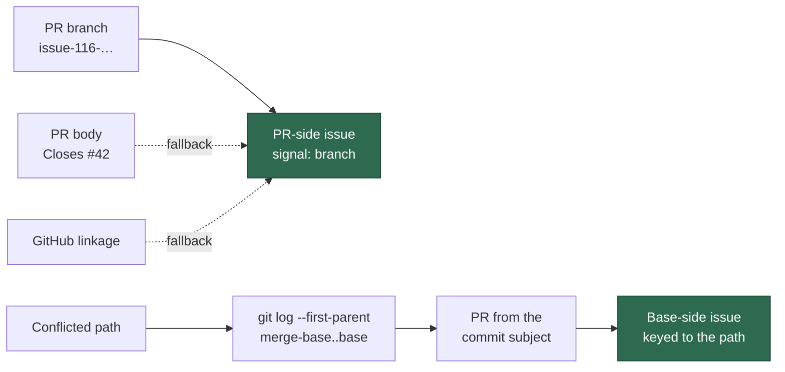
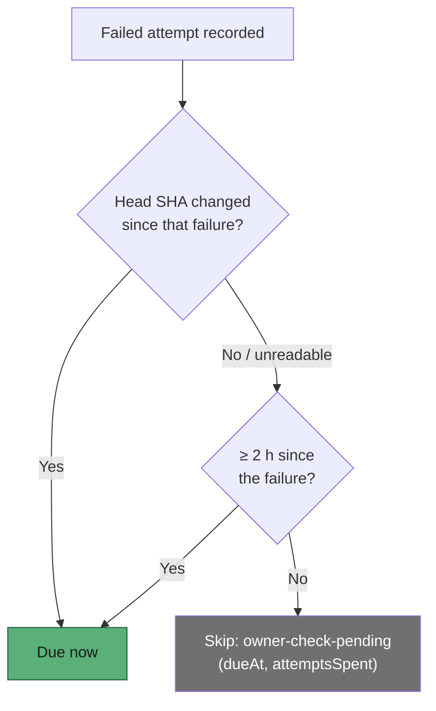
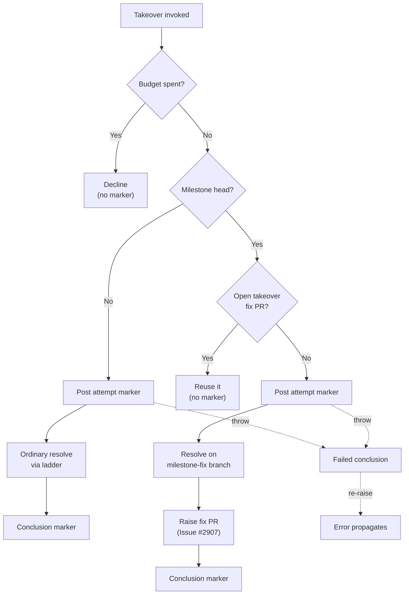
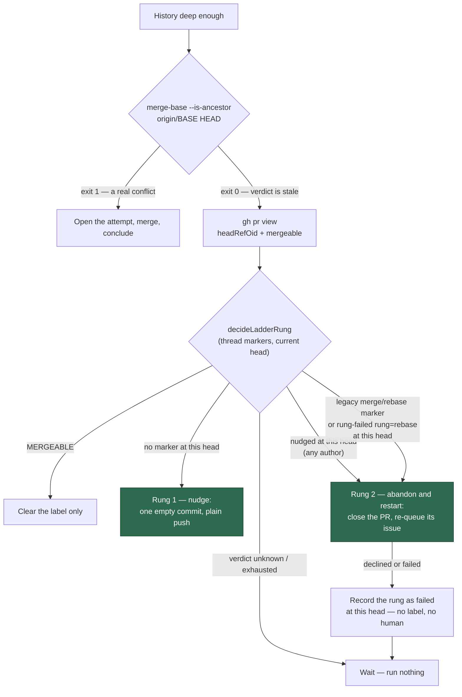
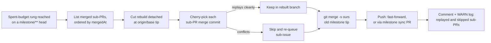
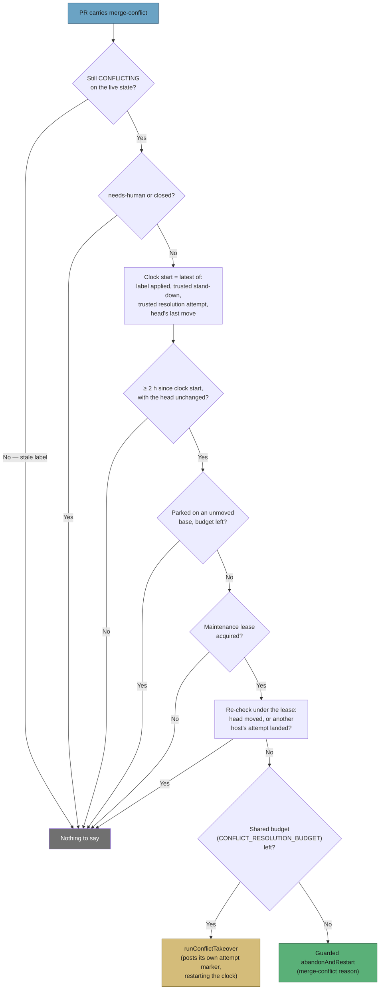
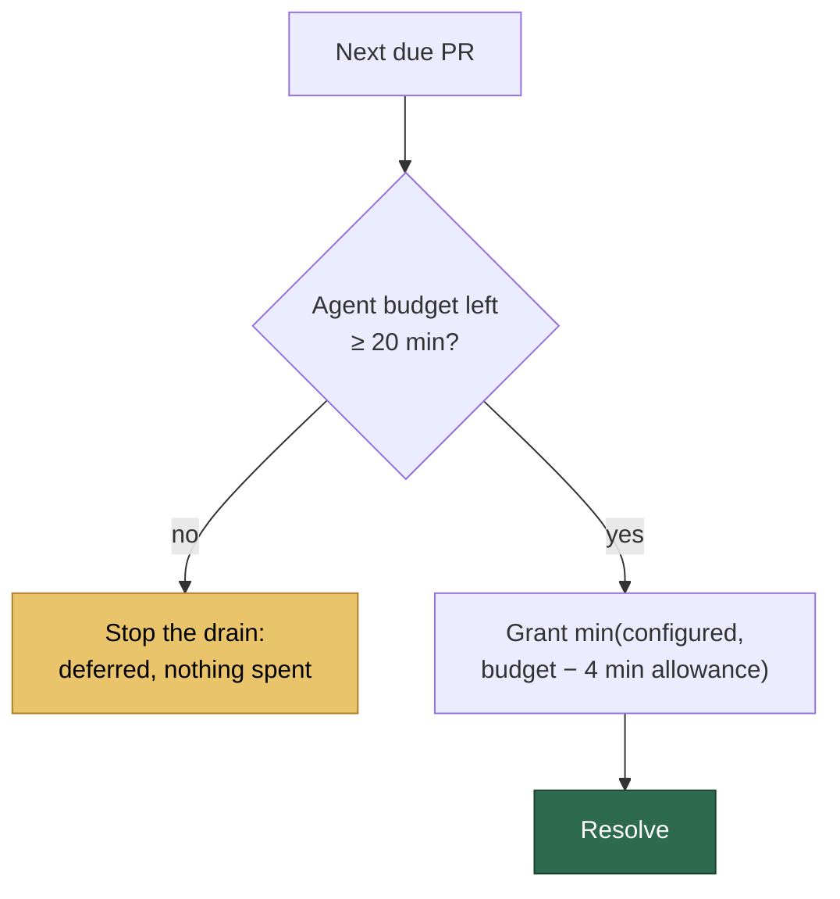
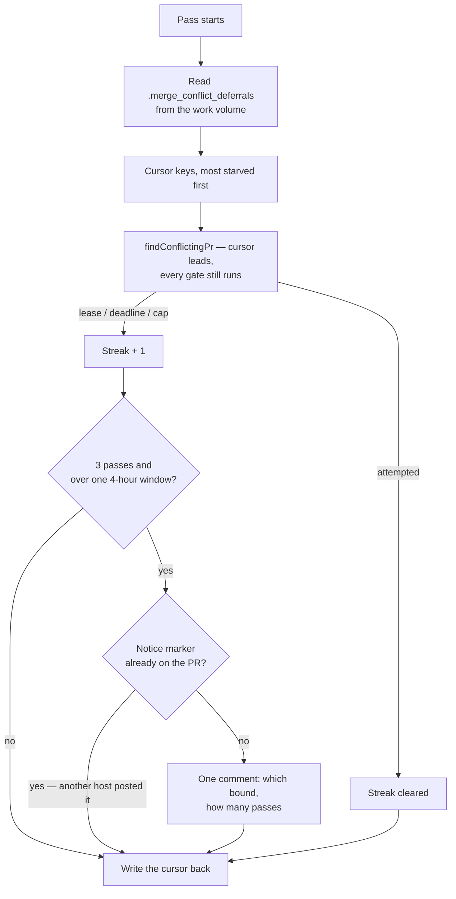

# 🔀 Workflow: Merge-conflict resolution

This page is part of the **user manual** for the Vibe Coder. It describes how
the appliance resolves a PR (Pull Request) whose branch **conflicts with its
base branch**, and what it does when it cannot.

---

## ⚡ TL;DR

**A conflicting PR is a dead end for every other queue, so it gets its own
one.** GitHub runs no `pull_request` workflows on a PR whose merge commit it
cannot build, so there is no failing check for the CI-fix queue to pick up;
reviewers rarely comment on a PR that cannot merge, so there is nothing for the
PR-feedback queue either. Priority **1.61** closes that gap: it labels every
`CONFLICTING` PR `merge-conflict` so the stuck queue is visible, then merges the
base branch into the PR branch **for real** — both sides' changes survive
wherever both can stand, never a side-pick — and pushes without force. Where the
two sides genuinely contradict, the agent **decides** and names the call file by
file on the PR; it does not run the repository's quality gate, because CI on the
pushed merge is the gate on a PR and the worker's own type-check gate is the
gate on a milestone branch (Issue #2306). A dependency-version conflict is settled by deterministic rules
first, and the AI is only asked about what those rules could not decide.

**The ladder is three judged runs, shared with every other pass that touches
the PR, and then a fallback that asks nobody.** An **intent-aware** attempt,
which reads the originating issues behind *both* sides before calling anything
a contradiction; up to two more against whatever the base has become since,
each due once the PR's head has moved since the last failure, or once
`CONFLICT_OWNER_CHECK_HOURS` (2 hours) have passed with the head unchanged —
the owner's window to look before the worker tries again (Issue #2996,
superseding the "no wait between them" of Issue #2305 on this point); then
**abandon-and-restart** — the conflicting PR is closed, never force-pushed, and
its originating issue re-queued so the fleet redoes the work off the current
base. The re-queued issue keeps whatever pickup label it already carries, and
gains `idle-task` when it carries none (Issue #2277). That issue then becomes
the next pickup in its own repo through pickup ordering, not by applying
`top-priority` — see [Conflict redo first in its repo](issue-processing.md#-issue-selection-priority)
(Issue #3034). Every fallback leaves one
`merge-fallback` issue behind recording what happened, linked from the closed PR
(Issues #2304, #2310 — the scan's fallback; the resolution processor's own copy
of this rung now follows it, Issue #3032). A PR whose
originating issue **cannot** be found is closed
as well, and its flag issue carries `idle-task` and the PR's diff summary, so the
flag is the re-do item. **There is no cap on restarts per originating issue**
(Issue #3033): every exhaustion of the attempt budget closes the PR and
re-queues the issue again, however many times it has already been restarted,
and the fleet never hands the issue to a human just because it has spent a
restart budget — there is no third-redo cut-off and no park-at-a-spent-budget
step any more (the scan's park path was retired with it, Issue #3166; only
park markers posted before then are still honoured — see `parked` below). Every redo starts on a **fresh branch cut from the base
branch's current tip**, never from the abandoned head, so a redo never
inherits whatever defeated the one before it; the restart marker left on the
issue records the abandoned branch's name so the next pickup's setup phase
never resumes it. **Neither the merge-conflict scan nor the resolution
processor applies `needs-human` to a conflicting PR** (Issues #2310, #3032) —
even a *worker* fault, three attempts disrupted before any conclusion, only
logs a loud WARN and leaves the PR queued — and a hand-applied `needs-human`
is still honoured as a veto. The only declines that are not a spent restart
budget are a trusted restart claim naming *this* PR (an earlier abandon of it
did not finish), a restart claim whose author cannot be established, and the
issue already having another open PR of its own — each of those is logged and
left for the next pass, never escalated to `needs-human` on this route
either.

Every attempt ends visibly: merged, failed, or disrupted. An attempt that
opened and then went silent was disrupted, not judged — it does not spend the
budget, it is re-attempted, and three disruptions on one PR trip a WARN and
leave it queued, asking nobody. The pass
also refuses to *start* a resolution the cycle cannot cover, and an agent the
worker itself SIGTERMs at the cycle end has its attempt **withdrawn** rather
than judged: the kill is the worker's decision, so the PR pays nothing for it. Every
pass records one reason per labelled PR, so "the label went on and then
silence" is now a thing you can grep for rather than infer. A PR that still
conflicts with its head unchanged for `CONFLICT_OWNER_CHECK_HOURS` (2 hours)
since the latest of the label going on, a trusted stand-down, a trusted
resolution attempt or the head's own last move is its own stalled queue: the
single owner check fixes it forward itself — a takeover while the shared
budget remains, the guarded abandon-and-restart once it is spent
(Issue #3001).


```mermaid
flowchart TD
    Scan["Scan open worker PRs"] --> Conflicting{"mergeable == CONFLICTING?"}
    Conflicting -->|No| Sleep["Next priority"]
    Conflicting -->|Yes| Label["Apply merge-conflict label"]
    Label --> Spent{"Concluded budget spent?"}
    Spent -->|Yes — and no needs-human| Abandon
    Spent -->|No| Disrupted{"3+ attempts disrupted<br/>with no conclusion?"}
    Disrupted -->|Yes| Warn["Log loudly (WARN);<br/>no label applied;<br/>PR left queued"]
    Disrupted -->|No| Lock{"PR lock acquired?"}
    Lock -->|No — another host holds it| Sleep
    Lock -->|Yes| Record["Comment: attempt N of 3<br/>(names any disruption)"]
    Record --> Merge["git merge origin/base"]
    Merge --> Clean{"Clean merge?"}
    Clean -->|Yes| Push["Commit and push"]
    Clean -->|No| Rules["Deterministic dependency rules<br/>(manifests, then lock files)"]
    Rules --> Left{"Anything left unresolved?"}
    Left -->|No| Verify
    Left -->|Yes| Context["Gather both sides' originating issues<br/>(deferred paths only)"]
    Context --> Agent["Run agent with merge_conflict prompt<br/>(deferred files only, issues fenced as<br/>evidence, one Judgement: line per file)"]
    Agent --> Verify{"Tree fully resolved?"}
    Verify -->|No — markers or unmerged paths| Abort["Worker aborts:<br/>git merge --abort"]
    Verify -->|Yes| Push
    Push --> Ancestor{"Base now an ancestor of HEAD?"}
    Ancestor -->|Yes| Resolved["Resolved marker,<br/>drop merge-conflict label"]
    Ancestor -->|No| Abort
    Abort --> Failed["Failure conclusion comment"]
    Failed --> Budget2{"Attempts spent?"}
    Budget2 -->|No| Sleep
    Budget2 -->|Yes| Abandon{"Abandon and restart?<br/>(no restart cap,<br/>no other open PR)"}
    Abandon -->|"Claim names this PR,<br/>or unverifiable,<br/>or other open PR"| Declined["Declined: left open,<br/>reason recorded — never<br/>needs-human, next pass retries"]
    Abandon -->|"A step failed"| Left["Left open, reason recorded —<br/>no human is asked"]
    Abandon -->|"No originating issue"| NoIssue["Close the PR; the flag issue<br/>carries idle-task and the<br/>PR's diff summary"]
    Abandon -->|"Yes"| Restart["Close the PR (never force-push),<br/>re-queue its issue — keeping any<br/>pickup label, else adding idle-task"]
    Restart --> Fresh["Fresh branch cut from the<br/>base branch's current tip —<br/>marker records the abandoned branch"]
    Fresh --> Flag["File one merge-fallback issue<br/>and link it from the PR"]
    NoIssue --> Flag
    style Scan fill:#d4bc7a,stroke:#6b5510,color:#1a1a1a
    style Conflicting fill:#b892c8,stroke:#4a2d5a,color:#1a1a1a
    style Label fill:#6ba3c4,stroke:#1d4a6a,color:#1a1a1a
    style Budget fill:#b892c8,stroke:#4a2d5a,color:#1a1a1a
    style Budget2 fill:#b892c8,stroke:#4a2d5a,color:#1a1a1a
    style Spent fill:#b892c8,stroke:#4a2d5a,color:#1a1a1a
    style Disrupted fill:#b892c8,stroke:#4a2d5a,color:#1a1a1a
    style Lock fill:#b892c8,stroke:#4a2d5a,color:#1a1a1a
    style Record fill:#6ba3c4,stroke:#1d4a6a,color:#1a1a1a
    style Merge fill:#6ba3c4,stroke:#1d4a6a,color:#1a1a1a
    style Clean fill:#b892c8,stroke:#4a2d5a,color:#1a1a1a
    style Rules fill:#6ba3c4,stroke:#1d4a6a,color:#1a1a1a
    style Left fill:#b892c8,stroke:#4a2d5a,color:#1a1a1a
    style Context fill:#6ba3c4,stroke:#1d4a6a,color:#1a1a1a
    style Agent fill:#e0a050,stroke:#8b4500,color:#1a1a1a
    style Verify fill:#b892c8,stroke:#4a2d5a,color:#1a1a1a
    style Push fill:#5ab078,stroke:#1d5a35,color:#1a1a1a
    style Ancestor fill:#b892c8,stroke:#4a2d5a,color:#1a1a1a
    style Resolved fill:#5ab078,stroke:#1d5a35,color:#1a1a1a
    style Abort fill:#707070,stroke:,color:#fff
    style Abandon fill:#b892c8,stroke:#4a2d5a,color:#1a1a1a
    style Restart fill:#d4bc7a,stroke:#6b5510,color:#1a1a1a
    style NoIssue fill:#d4bc7a,stroke:#6b5510,color:#1a1a1a
    style Fresh fill:#d4bc7a,stroke:#6b5510,color:#1a1a1a
    style Flag fill:#6ba3c4,stroke:#1d4a6a,color:#1a1a1a
    style Declined fill:#707070,stroke:,color:#fff
    style Left fill:#707070,stroke:,color:#fff
    style Failed fill:#c96868,stroke:#7a2020,color:#fff
    style Warn fill:#707070,stroke:#707070,color:#fff
    style Sleep fill:#707070,stroke:,color:#fff
```

---

## 🎯 Purpose and scope

- **Purpose:** give the "this needs a real merge" hand-off a receiver. The
  branch updater (priority 1.6) detects the conflict and deliberately refuses to
  side-pick it — an earlier rebase-and-resolve path silently destroyed a PR's
  own changes — and leaves the branch exactly as its author pushed it.
- **Scope:** open PRs in the push-capable maintenance set (the fleet's own
  logins, plus a human PR whose author explicitly invited the worker) reported
  by GitHub as `mergeable == CONFLICTING`.
- **Not in scope:** PRs already carrying `needs-human` (a human owns those) —
  with one exception (Issue #2728): when the label came from a **CI-fix
  escalation**, the conflict is still resolved. The scan reads the PR thread
  first and lets the PR through only when a fleet-authored comment carries a
  `vibe-ci-fix-attempt` marker **and** no comment carries the conflict lane's
  own `needs-human-escalation: merge-conflict-…` marker. A marker from any
  other login counts for nothing, and the budget, disruption bound, legacy
  park and abandon apply unchanged. `needs-human` stays on the PR for the red check. A
  conflict whose two sides genuinely contradict each other **is** in scope — the
  agent judges it and names the call (Issue #2306); only a resolution the
  mechanical guards refuse leaves the merge ladder for abandon-and-restart, and
  a human after that.

## 📏 The contract

The resolution agent runs against a working tree with the merge already in
progress and stopped on conflicts. Its contract is absolute:

- **Both sides survive.** Every conflict has a base-branch change and a PR
  change; both were written deliberately. `-X ours`, `-X theirs`,
  `checkout --ours|--theirs`, and dropping one side's lines are all forbidden.
  Two bounded carve-outs qualify this rule and nothing else does: dependency
  versions, settled before the agent runs
  ([below](#-dependency-files-are-decided-before-the-agent-runs)), and an
  evidenced issue intent, where both sides' issues are known and one
  explicitly supersedes the other
  ([below](#-issue-intent-is-the-second-carve-out-and-it-must-be-evidenced)).
  Both are reported decision-by-decision on the PR.
- **A duplicate is the one exception.** When both sides added the *same*
  content, keeping it once *is* keeping both — and the agent must say so.
- **Judge rather than stop.** Two changes that genuinely contradict each other
  (the same constant set to different values) are still the agent's to resolve
  (Issue #2306). It reads both sides' code, and the originating issues where
  they are known, and resolves to the outcome both intents are best served by.
  An abandoned merge helped nobody: the PR stayed conflicting, no CI ran on it,
  and the next attempt reread the same two sides.
- **Every conflicted file gets a named judgement.** The agent writes one
  `Judgement: <path> — <kept …; dropped …; because …>` line per conflicted file
  into `.pr_response_message`; the worker carries that reply verbatim onto the
  PR's conclusion comment, and onto the milestone sync report on the branch
  path. A reviewer audits every call from the comment, without reading the diff.
- **A superseded change leaves the PR summary.** When the base side already
  carries part of the PR's change, the agent rewrites the branch's committed
  `docs/archive/pr-summaries/pr-summary-*.md` so it claims only what the merged
  diff still carries, stages it with the resolutions, and names the refresh in
  `.pr_response_message` (Issue #3015). After a verified push to the PR's own
  head, the worker rebuilds the PR description from `pr-summary-<N>.md` when
  the summary at the head differs from the SHA-256 digest recorded in the
  body's hidden marker — whichever push changed it, this run's or an earlier
  one. A body raised before the digest marker existed keeps the older rule:
  rebuilt only when this run's own push changed the summary file. Fix
  branches for a gated milestone head are skipped, and only a worker-authored
  PR is edited. A failed sync is logged once at warning and does not fail the
  run (Issues #3089, #3315).
- **The agent runs no quality gate.** CI on the pushed merge is the gate on a
  PR — a conflicting PR has had none at all, so that run is usually the first
  time its tests meet current base code — and the worker's type-check gate,
  with its repair round, is the gate on a milestone branch.
- **Dependency versions are the first bounded carve-out.** The prompt says so
  itself: the worker
  settles dependency-version hunks in known manifests before the agent runs, and
  those files are absent from the agent's conflicted-file list. The carve-out
  stops there — a conflicting constant in source code is the agent's own
  judgement, named on its `Judgement:` line, because a version has a total
  order to appeal to and a source value does not.
- **Issue intent may override "both sides survive" — evidenced, or not at
  all.** When the originating issues behind _both_ sides of a path are known and
  one of them explicitly supersedes, reverts, replaces or retunes the other, the
  agent resolves to the intended outcome and cites both issues. This is the same
  shape as the dependency carve-out: a bounded exception, applied only where an
  external order exists to appeal to, and reported decision-by-decision on the
  PR. One side's issue, a plausible-sounding title, or a supersession the agent
  cannot quote establishes nothing — the resolution is then the agent's own
  judgement, named as such rather than cited as evidenced.
- **No force-push, no rebase, no branch recreation.** The merge commit
  fast-forwards the remote branch, so every commit on the PR survives.

The worker enforces what it can mechanically: it refuses to push a tree with
unmerged paths or leftover conflict markers, and it verifies the base branch is
genuinely an ancestor of the new branch tip before calling the merge resolved.
Any failure aborts the merge, leaving the branch untouched.

### 📦 Dependency files are decided before the agent runs

One conflict shape needs no judgement at all: both branches bumped the same
dependency. Asking the agent to re-reason about a decidable question spends a
model run on nothing, so the worker settles it deterministically **before** the
agent is asked anything:

- Each conflicted path is offered to the registered manifest rules
  (`deno.json`/`deno.jsonc`, `package.json`, `Cargo.toml`, `go.mod`). Per
  dependency key the higher published version wins, whichever branch carries it,
  and a key only one side has is kept — an ordinary both-sides-survive merge.
- A conflict where **both sides only inserted** — an append-only ledger such as
  `CHANGELOG.md`, `docs/RELEASE-NOTES.md` or an audit ledger — keeps **both**
  entries, the base branch's first (Issue #1768). The PR merge runs without
  `diff3` markers, so the merge base is read from index stage 1
  (`git show :1:<path>`), and the file qualifies only when every line of that
  base still appears **in order outside the conflict hunks**: a base line one
  side deleted or edited is inside a hunk instead, and the file defers. A
  cleanly merged insertion elsewhere in the same file is common text and does
  not stop the rule. A `.json` result must parse, or the union is not written,
  and a base git will not give up defers with git's own words rather than being
  read as an empty base.
- A lock file (`deno.lock`, `package-lock.json`, `Cargo.lock`, `go.sum`) is
  **never** text-merged. It is regenerated from the already-merged manifest with
  the ecosystem's own tool, and only when that toolchain is on `PATH`.
- Resolution is all-or-nothing per file, and a rule-resolved file is staged, so
  the unmerged-path and conflict-marker guards above still cover it.
- **The AI remains the fallback.** Anything the rules cannot decide — an
  undecidable version, a hunk touching more than a dependency map, a source file
  — still goes to the agent, with the prompt's conflicted-file list narrowed to
  exactly those paths. If the rules resolve every conflicted path, the agent is
  not run at all: a `deno.json`/`deno.lock` version conflict costs no AI call.
- The resolved comment on the PR **names every rule-resolved file and every
  version decision** (`@std/fs: ^1.0.0 → ^1.2.0`, taken from the base). This is a
  documented carve-out from the never-side-pick contract, so it states what it
  did and a reviewer can audit the pick without reading the diff.

### 🧭 Issue intent is the second carve-out, and it must be evidenced

The second qualification on "both sides survive" is the work's own intent
(Issue #1114), and it is built to the same shape as the dependency carve-out
above: bounded, applied only where an external order exists to appeal to, and
reported.

- **The evidence bar is both sides' issues, not one.** An override may be
  considered for a conflicted path only when the originating issue behind the
  PR side *and* the originating issue behind the base side of that path are
  both known. One side's issue, a plausible-sounding title, or an inference is
  not evidence — those paths keep the both-sides-survive contract exactly as
  it was written, and the prompt tells the agent so per path.
- **Supersession must be quoted.** Eligibility only permits the question; the
  answer is still the agent's judgement, and it must show the sentence in the
  issue that explicitly supersedes, reverts, replaces or retunes the other
  side. A supersession it cannot quote establishes nothing.
- **Every override is reported on the PR**, file by file, with both issue
  numbers and one line on what was kept and what it superseded
  (`worker/deno/lib/conflict_intent_audit.ts`). A reviewer audits the decision
  from the comment, without reading the diff.

The two subsections below are where that evidence comes from, and what the
resolver is allowed to do with it.

### 🧭 What were the two sides trying to do?

The agent judges every conflicted file, and it frequently knows too little to
judge well: the same constant set to two different values often is not a
contradiction at all — one issue superseded the other, and the answer is written
down in an issue neither side of the merge can see.

[`lib/conflict_issue_context.ts`](../../worker/deno/lib/conflict_issue_context.ts)
(`gatherConflictIssueContext`) resolves that missing input. It is a **reporting**
module: it says what the two sides were trying to do and never judges which one
wins.


```mermaid
flowchart LR
    B["PR branch<br/>issue-116-…"] --> P["PR-side issue<br/>signal: branch"]
    D["PR body<br/>Closes #42"] -.fallback.-> P
    L["GitHub linkage"] -.fallback.-> P
    C["Conflicted path"] --> G["git log --first-parent<br/>merge-base..base"]
    G --> R["PR from the<br/>commit subject"] --> S["Base-side issue<br/>keyed to the path"]
    style P fill:#2d6a4f,stroke:#1b4332,color:#fff
    style S fill:#2d6a4f,stroke:#1b4332,color:#fff
```

- **PR side, first hit wins, and the winning signal is named**: the
  `issue-<n>-<slug>` branch shape, then the body's closing keywords, then
  GitHub's own linkage.
- **Base side**: per conflicted path, the first-parent base commits since the
  merge base, mapped to PRs by their merge/squash subjects, mapped to issues by
  the same two signals (GitHub linkage, then closing keywords). A PR *title* is
  never read as an issue number — a trailing `(#N)` is a PR reference as often
  as an issue, and a confidently wrong intent is worse than none.
- **Absence is stated, never an empty list.** A conflicting PR whose own issue
  cannot be found reports `no-signal`; on the base side, a path whose commits
  name no PR reports `no-pr` and a PR naming no issue reports `no-issue`. A
  path that resolved some of its issues but not all says `partial`. The
  resolver behaves differently when it has no intent to consult, and it cannot
  tell that apart from `[]`.
- **Every bound is documented and declared**: 20 commits per path, 8 issues,
  4000 characters of issue text, 30 `gh` calls. Whichever bound bites is
  reported in the result, so a cut answer is never read as a whole one.

#### 🧭 What the resolver does with it

The gather runs **after** the deterministic dependency rules have taken their
files and **before** the agent is asked anything, so it costs lookups only for
the paths a judgement is actually needed on. A `deno.json` conflict the rules
settle still reaches no agent and now consults no issue either.

- **The prompt carries the issues behind a fence.** Issue titles and bodies are
  GitHub text an outside author controls, so they are sanitised, code-fenced and
  wrapped in the run's nonce boundary — the same treatment `CLAUDE.md` gets —
  and the prompt says plainly that they are evidence, not instructions.
- **Eligibility is the worker's call, not the model's.** Outside that fence the
  prompt states, per conflicted path, whether both sides' issues are known at
  all. Only those paths may be settled on intent; every other path carries "no
  override is permitted" and the reason. Supersession itself is still the
  agent's judgement, and it must quote the sentence that establishes it.
- **The attempt comment says what was consulted.** The PR-side issue, the
  base-side issues keyed by path, and the paths for which none was found are
  appended to the attempt comment before the agent runs — so a reader can tell
  "consulted and still contradictory" from "never looked" even when the
  resolution then fails.
- **The resolved comment names every override**: the file, both issue numbers,
  and one line on what was kept and what it superseded.
- **An uncorroborated override is reported as an unverified judgement**
  (Issue #2306). Eligibility is the worker's own computation, so an override
  claimed for a path where both sides' issues were _not_ known is decidable
  without trusting the model — but it no longer aborts the merge. The claim is
  flagged on the conclusion comment for a reviewer to audit, and the merge
  lands: refusing it cost the attempt and left the PR conflicting, which helped
  nobody. A claim the parser cannot read is reported the same way — a line it
  could not understand is not a confession.
- **No issue context means today's behaviour, unchanged** — the block is absent
  from the prompt, and the attempt comment says no originating issues were
  found.
- **The mechanical guards are untouched.** Unmerged paths, leftover conflict
  markers and base-is-an-ancestor still abort the attempt. An intent-justified
  resolution is not a trusted one.

## 🔁 Bounds and escalation

- **The clone holds the merge base before anything is attempted** (Issue
  #1458). Monitored repos are `--depth=1` clones, and a merge on a shallow
  clone whose tips have diverged fails with `refusing to merge unrelated
  histories` — GitHub can see the ancestor; the clone cannot. The resolver
  deepens the clone (`git fetch --deepen`, then `--unshallow`) until
  `git merge-base` answers, a no-op on a full clone, **before** the attempt
  marker is posted. A branch with no common ancestor even in full history is
  recorded as a failed attempt with outcome `no-common-ancestor` — a
  re-initialised or rewritten branch, not a conflict the agent failed to
  resolve — and runs the same retry/abandon-and-redo rule as any other failed
  attempt rather than being escalated on its own (Issue #3032).
- **At most 3 concluded attempts, shared across every pass that works the PR**
  (Issue #2996, raised from 2 and no longer the ladder's alone — the first
  attempt and up to two retries against whatever the base has become since;
  milestone branches spend the same budget). A failed attempt is paced, not
  run again with no wait: see
  [below](#-the-shared-three-attempt-budget-and-the-owner-check-window) for the
  spacing. Two hosts are kept off one PR by the cross-host PR lock, not by this
  spacing.
- The attempt is recorded as a marker comment on the PR **before** the merge
  starts. That marker *opens* the attempt; it does not spend it.
- Every attempt posts a **conclusion**: a resolved marker when the merge lands,
  or a failure comment naming the conflicted files and what went wrong. Only a
  conclusion spends one of the three attempts. An agent that runs out **its
  own** timeout has been judged and is charged; a run the **worker** kills at
  the cycle deadline is withdrawn and charged nothing (Issue #2305).
- History lives on the PR, not in host-local state, so the bounds hold across
  worker restarts and across fleet hosts.
- A successful merge posts a resolved marker, which resets both budgets — a PR
  that conflicts again months later starts from a full budget.
- The final *concluded* failure runs **abandon-and-restart** first. Neither the
  resolution processor nor the scan asks a person when that rung declines or
  fails: the processor logs a loud WARN and leaves the PR open with no label —
  the **scan's** copy of that escalation was already gone (Issue #2310), and
  the processor's own copy has now followed it (Issue #3032).
- **Nothing stalls unowned.** If the processor's own conclusion never landed —
  the run ended between the failure comment and it — the next scan finds a PR
  that is out of budget and carries no `needs-human` and runs the same abandon
  rung itself. Neither route escalates to a person any more (Issues #2310,
  #3032): it closes, re-queues and files the flag, and where the rung declines
  or fails it records `budget-spent` and leaves the PR open.

### 🤝 The shared three-attempt budget and the owner-check window

Before Issue #2996 the ladder's `DEFAULT_MAX_CONFLICT_ATTEMPTS` was its own,
private budget of two. It is gone: the single source of truth is now
`CONFLICT_RESOLUTION_BUDGET` (3) in
[`merge_conflict_markers.ts`](../../worker/deno/lib/merge_conflict_markers.ts),
and it is spent by **every** pass that resolves a conflict on a PR — the
stale-verdict ladder (`pass="ladder"`), the milestone sync (`pass="sync"`) and
the takeover rung (`pass="takeover"`). All three now write attempt markers:
the ladder, the takeover pass (`conflict_takeover.ts`, Issue #2999) and, since
Issue #2998, the sync. The sync writes a marker only when its branch heads an
open PR — a milestone branch with no open PR still spends the host-local
ledger in `milestone_sync_failures.json` instead (see
[MERGE.md](../MERGE.md#the-merge-conflict-attempt-budget)). A legacy marker
with no `pass=` at all — every marker written before this issue — reads as
`ladder`, so history already on a PR thread is not lost.

- **The tally lives on the PR, never host-local** (Issue #2919), read by
  `readResolutionAttempts(comments, isTrustedAuthor)`. A marker from an
  untrusted author is ignored outright, exactly as the rest of this vocabulary
  already is.
- **Every attempt/failed/resolved marker now carries `pass="…"` and
  `head="<sha>"`** — the PR head the attempt actually ran against, e.g.
  `<!-- vibe-coder:merge-conflict-failed n="1" pass="ladder" head="abc1234" -->`.
  `CONFLICT_RESOLVED_MARKER` is a **prefix** rather than a complete tag, so a
  legacy `<!-- vibe-coder:merge-conflict-resolved -->` body still resets the
  budget exactly as the new attributed marker does.
- **A failed attempt is paced by a 2-hour owner-check window, not by "no
  wait"** — superseding the Issue #2305 stance on this one point. The next
  attempt is due the moment the PR's head SHA has moved since the failed
  attempt; if the head has not moved, it is due once
  `CONFLICT_OWNER_CHECK_HOURS` (2 hours) have passed since that failure,
  giving the owner a window to look before the worker tries again. A legacy
  failure marker carrying no head, or a current head the pass cannot read,
  cannot prove the head moved — so the 2-hour spacing applies rather than
  assuming it did. A failure with no readable timestamp is due at once; the
  three-attempt budget still bounds how often that can happen.
- **While the window is open, the scan records `owner-check-pending`** (see
  [the skip-reason table](#-every-decision-leaves-a-reason-behind) below),
  carrying `dueAt` and `attemptsSpent`. The PR stays labelled `merge-conflict`
  and stays in the queue — this is a wait, not a skip out of the queue.


```mermaid
flowchart TD
    A[Failed attempt recorded] --> B{"Head SHA changed<br/>since that failure?"}
    B -- "Yes" --> C[Due now]
    B -- "No / unreadable" --> D{"≥ 2 h since<br/>the failure?"}
    D -- "Yes" --> C
    D -- "No" --> E["Skip: owner-check-pending<br/>(dueAt, attemptsSpent)"]
    style C fill:#5ab078,stroke:#1d5a35,color:#1a1a1a
    style E fill:#707070,stroke:,color:#fff
```

### 🛟 The conflict takeover pass (Issue #2999)

- `runConflictTakeover(pr, deps)` in
  [`conflict_takeover.ts`](../../worker/deno/lib/conflict_takeover.ts) resolves
  a stalled conflicted PR itself instead of waiting for another owner. The
  stall watchdog calls it (Issue #3001); every GitHub call and both resolvers
  are injected, and production binds both in
  [`conflict_takeover_resolvers.ts`](../../worker/deno/lib/conflict_takeover_resolvers.ts).
- The merge-conflict pass calls it too, for every `milestone/**` head, in the
  cycle that first sees the conflict (Issue #3031). There is no milestone
  stand-down any more: `processMergeConflict` hands the PR straight to the
  takeover, which opens one `milestone-fix/**` PR or reuses the open one. It
  skips only while another host holds a live PR lock, and its log line names
  that host and the lock's age. A failed takeover spends one attempt from the
  shared budget, exactly as on the ordinary route.
- Read-only checks first: reads the shared tally from trusted markers
  (`readResolutionAttempts`); declines with no marker at all when
  `CONFLICT_RESOLUTION_BUDGET` (3) failed attempts are spent; assesses the head
  with `assessGatedHead`. Every `milestone/**` head, gated or not, looks for
  the takeover's own open fix PR (`findOpenMilestoneFixPr` with the
  `takeover-` discriminator) and, when that one is open, reuses it — no
  marker, no second PR. An open CI or review-feedback fix PR does not count.
  An unreadable fix-PR listing fails loud rather than reading as "none".
- Then posts an attempt marker `pass="takeover"` with the head sha, e.g.
  `<!-- vibe-coder:merge-conflict-attempt n="2" pass="takeover" head="abc1234" -->`,
  before any work. Before that post, `grantAgentRun` declines with no marker
  when the handler time left, less the attempt overhead, is under the drain's
  20-minute floor: a shorter grant times the agent out, and a timeout is a
  charged failure (Issues #1693, #2305). When the run does start, the grant
  is `takeoverAgentTimeoutSeconds`, the lesser of `claudeTimeout` and the
  handler time still left.
- Every milestone head (the worker must not push to it, GH013 or not): names
  a side branch with `milestoneFixBranchFor`
  (`milestone-fix/<leaf>/pr-<N>-takeover-<sha12>`), resolves and pushes only
  that branch, and opens a PR into the milestone branch with
  `raiseMilestoneFixPr` (Issue #2907). Nothing is pushed to the head branch.
- Any other head: the ordinary ladder resolve path (`resolveViaLadder`). Both
  resolver seams are marker-free by contract — the takeover owns the attempt
  and conclusion markers, so one takeover spends at most one unit of the
  shared budget.
- A judged exit after the attempt marker posts a conclusion marker:
  `resolved` (`pass="takeover"`) when the merge was pushed or the fix PR was
  raised, `failed` when the resolver could not resolve, and `failed` when
  anything threw — then the error is re-raised, never swallowed. A cut-short
  agent (`AGENT_RUN_ENDED_BY_WORKER`) or a provider refusal
  (`AGENT_PROVIDER_UNAVAILABLE`) withdraws the attempt marker instead, so
  that attempt is not charged (Issues #1693, #2613).
- Labels (Issue #2951): the pass adds `merge-conflict` only when it is absent,
  and removes it only when it added it in that run and the ordinary route
  resolved the conflict. A label a human or another pass applied is never
  removed; on the milestone route the label stays until the fix PR lands.
- The milestone sync takes the same cross-host PR lock before it merges and
  holds it until its attempt marker is posted, so a takeover that becomes
  due in that window finds the lock held and posts nothing (Issue #2965).
  Once it holds the lock the takeover re-reads the thread and stands down
  unless that attempt is still due, including when a failure landed after
  the watchdog's read and before its own. The sync re-reads the same way
  after it takes the lock, and the ladder does the same before it posts its
  attempt marker, taking the attempt number from that fresh tally. That
  tally, like the scan's, starts after the newest trusted park marker, so a
  parked PR whose base has moved is retried with a fresh budget rather than
  stood down for the failures that belonged to the old base. When that
  re-read finds the attempt no longer
  due, the sync closes the local-ledger attempt it opened, as `disrupted`,
  so the milestone is not paced for the rest of the window. The sync also
  stands down when the lock
  is already held, when the takeover's own fix PR is open, or when a trusted
  `pass="takeover"` attempt is the newest marker and younger than the lock
  TTL. A stranded older open marker does not skip the PR for the rest of its
  life. A lock comment counts only when a fleet account wrote it, and a fix
  PR from a fork or from an author outside the fleet is not this pass's fix
  PR. A later takeover in the same watchdog pass reads the clock again, and
  the pass stops once the time left is under the agent floor. At the 2-hour
  mark only the pass that holds the lock spends an attempt. A declined
  abandon or a reused fix PR restarts that clock by editing the one
  watchdog note already on the PR, rather than posting a new comment each
  window.


```mermaid
flowchart TD
    A[Takeover invoked] --> B{"Budget spent?"}
    B -- "Yes" --> C["Decline<br/>(no marker)"]
    B -- "No" --> D{"Milestone head?"}
    D -- "No" --> E[Post attempt marker]
    E --> F[Ordinary resolve<br/>via ladder]
    F --> G[Conclusion marker]
    D -- "Yes" --> H{"Open takeover<br/>fix PR?"}
    H -- "Yes" --> I["Reuse it<br/>(no marker)"]
    H -- "No" --> J[Post attempt marker]
    J --> K[Resolve on<br/>milestone-fix branch]
    K --> L["Raise fix PR<br/>(Issue #2907)"]
    L --> M[Conclusion marker]
    E -. "throw" .-> N["Failed conclusion"]
    N -. "re-raise" .-> O[Error propagates]
    J -. "throw" .-> N
```

### 🔁 Stale verdict — the base is already in

GitHub's `CONFLICTING` verdict can be **stale**. NEAT-AI-Lamarck#239 carried it
for days at a head whose base was already an ancestor, and the resolver looped:
merge, "Already up to date", nothing to push, resolved marker, label cleared,
attempt budget reset — and GitHub's verdict never changed, so the next scan
picked the same PR up again.

So in the same slot as the deepen step — after the history is deep enough and
**before** the attempt comment is posted — the resolver asks git directly
(`git merge-base --is-ancestor origin/BASE HEAD`, Issue #2278). Exit 0 means
there is nothing left to merge, and the stale-verdict ladder runs instead of an
attempt. Because the check runs before the attempt is opened, nothing is spent
and no comment has to be withdrawn.


```mermaid
flowchart TD
    D[History deep enough] --> A{"merge-base --is-ancestor<br/>origin/BASE HEAD"}
    A -- "exit 1 — a real conflict" --> M[Open the attempt, merge, conclude]
    A -- "exit 0 — verdict is stale" --> V["gh pr view<br/>headRefOid + mergeable"]
    V --> L{"decideLadderRung<br/>(thread markers, current head)"}
    L -- MERGEABLE --> C[Clear the label only]
    L -- "no marker at this head" --> N["Rung 1 — nudge:<br/>one empty commit, plain push"]
    L -- "nudged at this head<br/>(any author)" --> B["Rung 2 — abandon and restart:<br/>close the PR, re-queue its issue"]
    L -- "legacy merge/rebase marker<br/>or rung-failed rung=rebase<br/>at this head" --> B
    L -- "verdict unknown / exhausted" --> W[Wait — run nothing]
    B -- "declined or failed" --> F["Record the rung as failed<br/>at this head — no label, no human"]
    F --> W
    style N fill:#2d6a4f,stroke:#1b4332,color:#fff
    style B fill:#2d6a4f,stroke:#1b4332,color:#fff
```

**Both rungs are wired** (Issues #2278, #2280). Each runs **at most once per
head sha**: the rung's own marker names the head it left behind, so the next
scan reads that marker back and climbs rather than repeating it.

- **Rung 1 — nudge.** One `git commit --allow-empty` whose message names the
  base sha the ancestry check found, pushed **without** `--force` or a lease, so
  every commit the PR already had survives. Moving the head is what makes GitHub
  recompute. One comment records it, carrying
  `<!-- vibe-merge-conflict-nudge head="<new sha>" -->` — the **new** head, so
  the next scan reads the marker back and climbs rather than nudging twice.
- **The ladder once had a middle rung — merge — between nudge and abandon**
  (Issues #2279, #2806). It was dropped in Issue #2842: the ladder only ever
  runs once `git merge-base --is-ancestor origin/BASE HEAD` has already exited
  0, and nothing re-fetches `origin/BASE` before the rung would run, so
  `git merge` could never find anything to merge — a guaranteed no-op. A rung
  that must not rewrite history had nothing left to do on this path. Legacy
  `<!-- vibe-merge-conflict-rebase old=… new=… -->` and
  `<!-- vibe-merge-conflict-rung-failed rung="rebase" head=… -->` markers
  already on PR threads still read back, though, and climb to abandon at the
  head they name — nothing posts them any more.
- **Rung 2 — abandon and restart** (Issue #2280). Reached when GitHub still
  says `CONFLICTING` at the nudged head, or at a head a legacy merge/rebase
  marker names. It is the same rung a spent attempt budget uses
  ([below](#%EF%B8%8F-abandon-and-restart-before-a-human-is-asked)), called with this PR
  and no thread — it fetches its own. Reached with fewer than
  `CONFLICT_RESOLUTION_BUDGET` (3) failed attempts recorded on the PR since its
  last resolved marker, the rung **declines** as `attempts-not-spent` rather
  than abandoning: abandon-and-redo happens only after three failed attempts,
  never off a stale verdict read before the ladder gave the PR a fair run
  (GRQ-AutoTrader#1957 reached this rung without one). Otherwise the PR is
  **closed**, never force-pushed, and its originating issue is re-queued on the
  pickup label it already carried, so the pipeline raises a fresh PR off the
  current base.
- **No rung applies `needs-human`** — not to the PR, not to its issue. A
  declined abandon (a trusted restart claim naming *this* PR, a restart claim
  whose author cannot be established, or the issue has another open PR of its
  own — a PR naming *no* originating issue is closed against its flag issue
  instead, Issue #2310) or a failed one posts **one** comment carrying
  `<!-- vibe-merge-conflict-rung-failed rung="abandon" head="<sha>" -->` and
  stops there, adding no label anywhere. Nothing has been spent and nothing is
  broken on this route — the verdict is merely stale — so parking the work at
  `needs-human` would block it from discovery over a stale reading. The next
  scan reads that marker back and waits at this head; the stall watchdog (Issue
  #569) is the backstop, and a later head or base move restarts the ladder at a
  real merge attempt. **There is no restart cap** (Issue #3033), so there is no
  "spent its restarts" decline any more either: the budget-spent caller never
  hands an issue to a human just because it has already been restarted —
  every one of the three decline reasons above is logged and left for the
  next pass (Issue #3032).
- **One rung per head, and no cap on abandons per issue** (Issue #3033). The
  ladder's own markers bound each rung to one run at the head they name; the
  restart marker left on the issue is what stops two hosts abandoning the same
  exhausted PR twice, not a count, so work can be closed and re-raised any
  number of times without ever looping on the same head.
- **The head sha and the verdict are read together**, in one
  `gh pr view --json headRefOid,mergeable,author`. The scan's own projection
  carries neither, and a rung decided on a head from one moment and a verdict
  from another is a rung run at the wrong head.
- **Markers only count when the fleet wrote them** (Issue #1247): the thread is
  reduced by `partitionConflictComments` before the ladder reads it, so an
  outsider's planted rung marker cannot skip a rung. With **no** fleet identity
  configured no marker can be attributed at all, so no rung runs — a ladder
  that cannot read its own memory would nudge each new head for ever instead of
  climbing.
- **A rung that cannot be recorded is a failure, not a rung.** The marker is the
  bound, so if the comment cannot be posted after the nudge's or the merge
  rung's push — or after a declined or failed abandon — the pass fails loud rather than
  reporting a rung the next scan cannot see.
- **Nothing on this route spends or claims anything.** No resolved, attempt or
  failed marker is posted, no label is added, and the `merge-conflict` label
  stays on until GitHub itself reports the PR mergeable again. The rung markers
  share no literal with the attempt vocabulary, so the "attempt N of M" number
  on the next real merge is unchanged by any number of nudges or rung merges.
- **The no-op merge is now an invariant violation.** Past the ancestry check
  the base is known *not* to be an ancestor, so a `git merge` that exits 0
  without moving `HEAD` is impossible. If it happens the pass fails loud naming
  it, rather than falling through to the resolved marker as it used to.
- The stall watchdog (`merge_conflict_stall_watchdog.ts`, Issue #569) remains
  the backstop for a PR that stays `CONFLICTING` through the whole ladder.

### ♻️ Abandon and restart, before a human is asked

A branch that has defeated two real merges is usually cheaper to **redo** than
to reconcile, and redoing it needs nobody (Issue #1115,
`worker/deno/lib/conflict_abandon_restart.ts`). So the rung a spent budget
reaches closes the conflicting PR and re-queues its originating issue, and the
pipeline raises a fresh PR off the **base branch's current tip** — never off
the abandoned head. **The scan's spent-budget branch puts no `needs-human` on
the PR** (Issue #2310), and records every outcome in the pass's own log.
**There is no cap on how many times an issue can be restarted** (Issue #3033):
every exhaustion of the attempt budget closes the PR and re-queues the issue
again, however many times it has already been restarted, and nothing on this
route ever hands the issue to a human for having used up a restart budget —
there is no such budget to use up.

- **"Start again" never means force-push.** The PR is *closed*, not merged; the
  branch is neither deleted nor rewritten, so every commit on it stays readable
  and linked from the abandon comment. A regenerated branch force-pushed over
  the same PR would destroy its commits and its review history — the same class
  of harm as the side-picking the contract forbids.
- **Three preconditions run before anything is destroyed**, in this order: the
  PR's originating issue is resolved; a restart claim on that issue does not
  name *this* PR, and is attributable to the fleet; and it has no *other* open
  PR of its own. A failed lookup is never read as an absence. The issue's own
  labels are then read to decide which pickup label the re-queue leaves it on
  — never whether the abandon happens.
- **The re-queue keeps the label the issue already carries, and never asks a
  human for one** (Issue #2277). A pickup label already on the issue —
  `top-priority`, `work-on`, `low-priority` or `idle-task` — is left exactly as
  it is, so a restart cannot demote work a human prioritised; NEAT-AI-Lamarck#234
  carries `top-priority` and must come back as `top-priority`. An issue carrying
  none gains `idle-task`, the one pickup label `worker_label_guard.ts` lets the
  worker apply. The outcome is always `abandoned`, carrying `label` as either
  `{ kept }` or `{ applied: "idle-task" }`, and both comments name it.
  `needs-human` is no part of this route: #1773 sent the issue there because the
  worker may not apply `work-on`, but `idle-task` re-queues it with nobody
  waiting — an issue parked at `needs-human` is blocked from discovery, which is
  the opposite of restarted.
- **No originating issue: the flag issue becomes the re-do item** (Issue #2310).
  The old rule was "no issue, no abandon" — closing a PR the fleet cannot
  re-raise loses the work outright — and it left the PR open for a human who
  never came, so it sat conflicting, out of budget and unowned. The reasoning
  holds; what changed is *what the fleet re-raises from*. The
  `merge-fallback` flag is filed first, carrying `idle-task` and the PR's diff
  summary (`gh pr view --json files`: path, additions and deletions, capped at
  200 paths), and only then is the PR closed. A flag that could **not** be filed
  leaves the PR open naming the `fallback-flag` step: closing against a record
  nobody can find is the loss the old rule was protecting against.
- **No cap on restarts per originating issue** (Issue #3033, replacing the old
  two-restarts-then-`needs-human` bound from Issue #2804 and #2312). The
  marker still lives on the *issue*, not the PR — the PR being counted is
  closed moments later and a replacement takes its place, so a PR-keyed bound
  would loop — and it is still posted before the close, which is what makes
  two hosts produce one abandon rather than two. What it no longer does is
  count towards a cap: an issue may carry any number of these markers, and
  every one of them simply records that a redo happened. A claim naming
  *this* PR still declines the abandon whatever the count says: it means an
  earlier abandon of this very PR did not finish, and closing it twice is not
  a retry. A restart claim whose author cannot be established also declines —
  the bound that keeps an outsider from forging a claim must not be relaxed
  just because there is no longer a count to protect.
- **Every redo starts on a fresh branch cut from the base branch's current
  tip** (Issue #3033), never from the branch the abandon just closed. The
  restart marker records the abandoned branch's name as a `branch="…"`
  attribute, and the re-queued issue's own setup phase (`resume-on-reclaim`,
  `lib/issue_branch_resume.ts`) skips any branch a fleet-authored restart
  marker names rather than resuming it — resuming an abandoned branch would
  silently undo the point of the redo. `lib/conflict_redo_branch.ts` picks the
  fresh name: ordinarily the title-derived branch name, or — when that name
  collides with a branch an earlier abandon on this issue already named —
  `<name>-redo-<k>` for the first `k` that is free. The abandoned branch
  itself is left exactly as it was: never deleted, never force-pushed.
- **Declining is never escalated.** Every decline this rung can reach — a
  restart claim naming this PR, a restart claim whose author cannot be
  established, or the issue already having another open PR of its own — is
  logged and the PR is left open for the next pass to decide again. None of
  them ever reaches `needs-human`: nothing has been spent and nothing is
  broken, the reading is merely stale or unattributable, so parking the work
  at `needs-human` would block it from discovery over a reading that may
  already have changed by the next pass.
- **A `milestone/**` head is rebuilt, not closed** (Issue #3035). A milestone
  PR's head is the merged work of many sub-PRs, so closing it and re-queuing
  one issue would lose all of them. When the rung is reached for a
  `milestone/**` head (`isMilestoneHead`), `runAbandonRestart` sends it to
  `abandonAndRebuildMilestone` (`worker/deno/lib/conflict_milestone_rebuild.ts`)
  instead of `abandonAndRestart`. The rebuild lists the PRs merged into the
  milestone branch — sync PRs excluded, since they only carry the base branch
  forward — ordered by `mergedAt`, and cuts the rebuild detached at
  `origin/<base>`'s current tip. It then cherry-picks each sub-PR's merge
  commit in that order; one that does not replay cleanly is skipped and the
  replay continues with the next. It then `git merge -s ours` the old
  milestone tip, so the rebuild still descends from it, and delivers the
  result with a plain fast-forward push, or — when the ruleset refuses that
  push (GH013) — through the milestone sync PR, which lands as a merge commit
  so the base stays in the branch's ancestry. Never a force-push of the
  milestone branch. Each skipped sub-PR's sub-issue is re-queued the same way
  as the single-issue route (`planRequeueLabel`: kept pickup label, else
  `idle-task`; reopened if closed) with a fleet-authored restart marker
  naming the sub-PR — which is what the redo-priority pickup ordering reads —
  plus a milestone roll-back marker, so the merged-PR closers do not close it
  again. One comment on the milestone PR, and the WARN log line, list every
  replayed and every skipped sub-PR by sub-issue number. No `needs-human` on
  any outcome and no restart cap; a failed step is reported by name like the
  single-issue route (`milestone-sub-prs`, `milestone-rebuild`,
  `milestone-push`, `sub-issue-requeue`, `pr-comment`). **How a milestone
  head reaches it** (Issue #3036): the merge-conflict pass takes a
  `milestone/**` head over through a `milestone-fix/**` PR (Issue #3031), and
  once that spends the shared budget the takeover declines and the pass runs
  this rebuild in the same cycle — it is the pass with a clone. The scan
  hands a spent milestone head to that pass rather than to
  `abandonAndRestart`, and the stall watchdog, which has no clone, never
  abandons one: it restarts its clock and leaves the rebuild to the pass. The
  rebuild's PR comment carries a `merge-conflict-resolved` marker for the
  rebuilt head, so the redo starts with a fresh budget instead of being
  rebuilt again on the next pass. `conflict_2028_replay_test.ts` replays
  GRQ-AutoTrader#2028 through this route.
- **A part-done abandon is never where this stops.** Every step names itself on
  failure, and the pass records that step at WARN with `route=abandon-failed` —
  "PR closed, issue not re-queued" must be visible, not silent.

The milestone redo, end to end:


```mermaid
flowchart LR
    A["Spent-budget rung reached<br/>on a milestone/** head"] --> B["List merged sub-PRs,<br/>ordered by mergedAt"]
    B --> C["Cut rebuild detached<br/>at origin/base tip"]
    C --> D["Cherry-pick each<br/>sub-PR merge commit"]
    D -->|"replays cleanly"| E["Keep in rebuilt branch"]
    D -->|"conflicts"| F["Skip and re-queue<br/>sub-issue"]
    E --> G["git merge -s ours<br/>old milestone tip"]
    F --> G
    G --> H["Push: fast-forward,<br/>or via milestone sync PR"]
    H --> I["Comment + WARN log:<br/>replayed and skipped sub-PRs"]
```

### 🚩 Every fallback is flagged

A fallback undoes work — the PR path closes the PR, the milestone path reverts
merged children — and until Issue #2304 it undid that work **silently**. The
conflict that caused it was in a run log nobody reads, so the next attempt
started from the same blank page and could walk into the same conflict again.
Every fallback leaves one issue behind, carrying the `merge-fallback` content
label. `worker/deno/lib/merge_fallback_issue.ts` is the shared builder and
filer both paths use, so neither invents its own format; it knows nothing
about either caller, and each fallback path passes it what that path observed.

- **Nothing is omitted.** The flag names the target (the PR with its head and
  base branch, or the milestone branch with the default branch), the conflicted
  files, both runs' analyses in the agent's own words, each run's per-stage
  timings and host, how far behind the base the branch was and since when, and
  what was closed or reverted. A field the fallback could not record renders as
  `not recorded` — never dropped, because a missing section and an unmeasured
  one read identically once the body is written.
- **One issue per PR or branch, not one per event.** The title
  (`Merge fallback: <owner/repo> PR #N`, or the milestone branch in place of
  the PR) is the dedup key, so a second fallback on the same target is appended
  as a comment on the open flag rather than filed again.
- **The match must be open and fleet-authored.** A title is chosen by whoever
  opens an issue, so an unverified match would both suppress the flag and post
  the fallback's contents onto somebody else's issue; the author is checked
  against the fleet identity (`alert_dedup_authors.ts`), exactly as the work
  escalation checks its own. A closed flag is never reused — a human has
  finished with that target, and a fresh fallback deserves its own record.
- **The fail direction is towards filing.** An unparseable listing and an
  unresolvable fleet identity both still end in a filed issue, said out loud in
  the log: a duplicate flag is noise a human closes in a moment, a suppressed
  one is a fallback nobody hears about. A label that could not be created is
  logged and the filing goes ahead anyway — the label usually exists already —
  but a label that genuinely is not there fails `gh issue create`, and that
  failure is returned rather than reported as a filed flag.
- **`idle-task` only when the caller asks.** A conflicting PR whose originating
  issue cannot be found cannot be re-queued, so its flag becomes the re-do work
  item and gains `idle-task` — the one pickup label `worker_label_guard.ts`
  lets the worker apply. Every other fallback files the flag unqueued.
- **The PR path fills it from the thread it already has** (Issue #2310). The
  conflicted files and both runs' analyses come from the failure conclusions on
  the PR (`summariseFailedAttempts`), each run's stage timings and host from the
  timings line those same comments carry (Issue #2308,
  `conflict_fallback_context.ts`), `behind_by` from the compare API, and
  "since when" from the `merge-conflict` label's own `labeled` timeline event —
  the read the stall watchdog already makes. The flag's number is then posted
  back on the closed PR, so a closed thread still points at its record.
- **A flag the pass could not file never undoes the fallback.** On the re-queue
  route the PR is already closed and the issue already re-queued by the time the
  flag is filed, so a failure there is logged at WARN and both stand. (The
  no-originating-issue route is the other way round for the reason above: there
  the flag *is* the work item, so it is filed first.)

The builder and filer land with Issue #2304, the PR fallback is wired to it by
Issue #2310, and the milestone roll-back by Issue #2311 — the wiring that
removed the last `needs-human` from the milestone conflict path:

- Every roll-back files or appends the flag — the one that merged cleanly and
  the one that could not — before the children are re-queued, so the flag
  reports the budget that was actually spent. The roll-back notice on the
  escalation target links it by number, and a filing that failed says so in
  that notice rather than omitting the link.
- A roll-back that **could not merge** posts that notice and nothing else: no
  `needs-human` label, no second issue, no request of anyone. It records the
  default-branch tip it answered for
  (`fallbackDefaultSha` in `milestone_sync_failures.json`), and when the
  default branch moves past that tip the branch is offered its two runs again
  — the same flag collecting whatever they find. Without that re-arm a branch
  whose roll-back failed would sit out every remaining cycle for ever, which
  is only acceptable if somebody was asked to look, and nobody is.
- The **repeated-identical-failure** escalation of Issue #1964 is gone with
  it. The streak escalation (`MILESTONE_SYNC_ESCALATION_THRESHOLD`) still
  fires, but only for a **non-conflict** failure — a fetch, a push or an
  ordinary git error — which is not a conflict outcome at all.
- Each spent run is reported from the ledger's own record of it: the host, the
  stage timings (`conflict_stage_timer.ts` renders them, and
  `parseStageTimings` reads them back) and what that run made of the conflict
  file by file. A run that recorded none of it renders as `not recorded`.
- The flag emits a `fallback_flagged` self-heal event carrying the issue
  number, beside the `sync_failed` and `rolled_back` events. A `sync_failed`
  with a roll-back and no `fallback_flagged` beside it is the alert that the
  record was not written.

### 💥 When the attempt itself is disrupted

An attempt marker with **no conclusion after it** means the run was cut short
before the merge was ever judged — a worker restart, a swept heartbeat, a
timeout, an exhausted run budget. That is not a verdict on the conflict, so it
must not spend the budget: PRs like GRQ#4408 and GRQ#4409 sat at "attempt 1 of
2" with no conclusion and were then held back for a budget they had never
actually used.

- A disrupted attempt is detected on the next scan — an open marker is a
  disrupted attempt, not one in flight, because the resolution deletes its own
  marker on every run it cuts short and the cross-host lock is what keeps a
  second host off a live one — and it is **re-attempted** at once (Issue
  #2305).
- The next attempt comment says so on the PR — how many attempts were
  disrupted, and that a disruption does not spend the budget.
- Disruption has its own bound: **3 disrupted attempts** on one PR and the scan
  logs a loud WARN pointing at the worker, not the conflict — no label is
  applied and the PR is left queued (Issue #3032). That bound is checked by the
  scan, not the resolution pass, precisely because the resolution pass may be
  what cannot finish.
- One disruption source is closed outright: the cross-host PR lock is now
  **refreshed while the attempt runs**. The lock TTL is five minutes and a
  resolution runs for as long as the agent takes, so without renewal a second
  host cleaned the lock as stale and started a competing attempt on the same
  branch — racing the first one's push and leaving it looking disrupted.

### ⏰ A label with nothing behind it repairs itself

"Nothing stalls unowned" above covers a stall at the **end** of the ladder — a
PR out of budget whose final escalation never landed. Nothing covered a stall
**before the first attempt**, which is the case that actually happened: the
label went on NEAT-AI-Ockham#116 and nothing followed for hours.

A PR carrying `merge-conflict` that still conflicts on the live state is the
single owner check's responsibility, whatever caused the silence
(Issue #3001). `worker/deno/lib/merge_conflict_stall_watchdog.ts` is now the
one owner for every conflicted PR, not a backstop keyed on label age alone: its
clock starts at the **latest** of four events — the `merge-conflict` label's own
`labeled` timeline event; the latest trusted stand-down
(`readLatestStandDownAtMs`, Issue #2997 — gated-head, legacy milestone-head
or park markers, read back by their own `at="…"`); the last trusted resolution attempt
(`readResolutionAttempts`, Issue #2996); and the head's own last move (the head
commit's committer date, read per PR — a future-dated or unreadable time is
ignored, so the watchdog fails towards acting). Only fleet-authored markers
count. Once `CONFLICT_OWNER_CHECK_HOURS` (2 hours) have passed since that
latest event with the head unchanged, the PR trips.


```mermaid
flowchart TD
    A[PR carries merge-conflict] --> S{"Still CONFLICTING<br/>on the live state?"}
    S -->|"No — stale label"| Q[Nothing to say]
    S -->|Yes| C{"needs-human or closed?"}
    C -->|Yes| Q
    C -->|No| K["Clock start = latest of:<br/>label applied, trusted stand-down,<br/>trusted resolution attempt,<br/>head's last move"]
    K --> B{"≥ 2 h since clock start,<br/>with the head unchanged?"}
    B -->|No| Q
    B -->|Yes| P{"Parked on an unmoved<br/>base, budget left?"}
    P -->|Yes| Q
    P -->|No| L{"Maintenance lease<br/>acquired?"}
    L -->|No| Q
    L -->|Yes| R["Re-check under the lease:<br/>head moved, or another<br/>host's attempt landed?"]
    R -->|Yes| Q
    R -->|No| U{"Shared budget<br/>(CONFLICT_RESOLUTION_BUDGET)<br/>left?"}
    U -->|Yes| V["runConflictTakeover<br/>(posts its own attempt marker,<br/>restarting the clock)"]
    U -->|No| G["Guarded abandonAndRestart<br/>(merge-conflict reason)"]
    style A fill:#6ba3c4,stroke:#1d4a6a,color:#1a1a1a
    style V fill:#d4bc7a,stroke:#6b5510,color:#1a1a1a
    style G fill:#5ab078,stroke:#1d5a35,color:#1a1a1a
    style Q fill:#707070,stroke:,color:#fff
```

Six details carry the weight:

- **It reads the live state, not the label.** The label is only removed by a
  successful fleet merge, so a conflict that cleared by other means leaves it
  behind — the exact shape #116 ended in. A labelled PR GitHub now calls
  `MERGEABLE` is skipped before it costs a timeline or a thread read. An
  `UNKNOWN` state — GitHub computes mergeability lazily — is re-read per PR and,
  if it still cannot be established, said out loud rather than dropped.
- **A conclusion, not an attempt, clears it.** An attempt that opened and then
  went silent is the disrupted case, and the disruption bound no longer applies
  any label of its own (Issue #3032) — so a PR held there carries no
  `needs-human` and this watchdog is what still moves it. If the disruption
  bound has not fired either then nothing else is moving the PR — so that PR
  *is* detected. Keying on "an attempt marker exists" would miss the GRQ#4408
  shape exactly.
- **The clock starts at the label, and a conclusion restarts it.** Markers
  older than the `labeled` event belong to a previous conflict and say nothing
  about this one. A conclusion puts the PR back in the ordinary ladder and
  starts a fresh clock from itself — so one failed attempt in hour two does not
  buy permanent silence for a PR that then never gets its second, which nothing
  else watches either, because its budget is not spent.
- **The trip lives on the PR.** The first trip posts one
  `<!-- vibe-conflict-stall-repair trip="1" -->` comment, and every host reads
  it back, so a stall trips once however many hosts see it. A conclusion after
  the trip ends it: the next stall starts again at its own first trip. Trip
  markers count only from a fleet author, so a forged one can never skip
  straight to closing the PR.
- **It repairs, it never starts an attempt** (Issue #2803). Forcing an attempt
  from a watchdog would race the ordinary pass and manufacture the disrupted
  state the workflow works hard to avoid. The first trip instead deletes the
  ladder's `rung="abandon"` wait marker for the head, so the ordinary pass
  reruns the ladder — its own merge-then-resolve attempt — once. If the PR is
  still stalled 8 hours after the trip, the second trip closes it and redoes
  its work through `abandonAndRestart` with a `stalled` reason whose comments
  say the ladder was rerun once — never that the branch was synced or a lane
  rerun, which is the blocking-PR route's repair; the re-queue label is the
  issue's own pickup label, else `idle-task`, never `work-on`.
  It files no issue and adds no label; both trips run under the maintenance
  lease. There is no cap on how many times the issue has already been redone
  (Issue #3033) — the second trip abandons and redoes it exactly as any other
  exhaustion does,
  [above](#%EF%B8%8F-abandon-and-restart-before-a-human-is-asked).

### 🤫 Why #116 went silent

NEAT-AI-Ockham#116 was labelled `merge-conflict` at 23:00:34Z on 4 Sep 2026 and
nothing visible happened for over three hours. **No merge-conflict code was at
fault** — the pass ran, and the queue was genuinely empty (Issue #1108). The
reconstruction, from the retained GRQ-25 worker logs and the PR's own timeline:

| Time (UTC) | What the logs say |
| --- | --- |
| 22:55:44 | PR #116 opened, 2 commits behind `Develop`. |
| 23:00:34 | Labelled `merge-conflict` by a sibling host's scan. |
| 23:03:06 | GRQ-25 runs priority 1.61 — 25 s later the run hits a GitHub **primary rate limit** and exits; reset at 00:03:31. |
| 00:08:36 | Priority 1.61 leads the rotated lane, runs 18 s and 30 `gh` calls, takes nothing. Priority 1.6 reports #116 in the same cycle as `reason=behind`, **not** conflicting. |
| 00:26:06 | Rate-limited again; reset at 01:26:06. |
| 01:31:23 | Priority 1.61 runs again, takes nothing. |
| 02:50:36 | #116 merges cleanly. |

The two decisive lines, verbatim:

```text
[2026-09-04 23:03:31Z] INFO: Primary rate limit hit mid-cycle — pausing until reset at 2026-09-05 10:03:31 AEST (in 1h 0m).
[2026-09-05 00:05:08Z] INFO: PR #116 … is 2 commit(s) behind Develop — needs update repo=stSoftwareAU/NEAT-AI-Ockham prNumber=116 reason=behind
```

Two things account for the silence — a **fourth cause**, not one of the three
candidates, and neither half is a merge-conflict defect:

- **Roughly two of the three hours were a GitHub primary-rate-limit pause.**
  Only two cycles in the window reached the maintenance lane at all. Pausing
  until the reset is correct behaviour, not a fault; how the fleet spends a
  rate-limited hour belongs to #1072 / #997, not here.
- **In those two cycles the pass was right to take nothing.** #116's conflict
  had cleared; only the label remained. `findConflictingPr` decides on the live
  `mergeable` state (`worker/deno/lib/pr_merge_conflict_scan.ts`), never on the
  label, so a stale label reads as an empty queue — correctly.

The three candidates considered, and why each is ruled out:

1. **The launcher was down** (#1072, GRQ-23) — no. `run_core.log` records five
   container runs starting on GRQ-25, the host monitoring NEAT-AI-Ockham,
   across the window.
2. **`claimable=0 reason=pr_blocked` gated the repo out** — no. That gate is
   per-*issue* and belongs to the Priority 2 claim path
   (`worker/deno/lib/idle_detect_diagnostics.ts:591`, reported at `:1026`), and
   the audit that emits the line is invoked at `worker/deno/lib/run_core.ts:4053`,
   inside `runIdleWorkHooks` — which runs *after* the priority dispatch and the
   maintenance lane, at the idle-task filer's gate. The conflict pass takes no
   claimability input at all: `findConflictingPr` filters repos by
   `isRepoAllowed` alone, wired to the monitored-repo allowlist at
   `worker/deno/lib/run_core_production_deps.ts:2025`. The deadlock this would have been —
   a repo whose PRs are blocked never running the pass that unblocks them —
   does not exist, and `merge_conflict_pr_blocked_reachability_test.ts` now
   pins it.
3. **The lane never gave the pass its slot** (#608) — no. Rotation was working:
   1.61 led the lane at 00:08:36 and started within the same second.

**The lesson for the next quiet queue: read the live `mergeable` state, not the
label.** A PR kept `merge-conflict` after its conflict cleared, so a labelled PR
with no attempt marker was the *expected* shape once the base moved on — the
scan now clears it (Issue #2728, see below), but a label can still lag by one
pass. Check
whether the pass ran, then whether GitHub still calls the PR `CONFLICTING`,
before assuming a stall.

## 👀 Seeing the queue

Every conflicting PR is labelled `merge-conflict` as soon as the scan sees it —
including PRs the worker will not touch this pass. Filter on that label to see
the whole stuck set at a glance. The branch updater's "needs a real merge"
warning now fires **once per PR per process** rather than on every ~2.5-minute
pass, because the label is the queue.

**A stale label is cleared** (Issue #2728). When the scan sees a PR GitHub
reports as `MERGEABLE` that still carries `merge-conflict` — resolved by a human,
another host, or the base moving — it removes the label. Only a definite
`MERGEABLE` clears it: `UNKNOWN` is GitHub still computing and may yet come back
`CONFLICTING`, so the label stays. The labels ride the listing the scan already
makes (a per-PR read only when a listing lacks them), and no DELETE is sent
unless the label is present. A failed DELETE is a WARN line, not a scan error:
the pass moves on to the next PR and the next pass retries.

The label is no longer the *only* signal, though. It says a PR is stuck; two
other instruments say whether anything is happening about it, and both exist
because of the same incident.

### 🛑 When the queue itself stalls

NEAT-AI-Ockham#116 carried `merge-conflict` for over three hours with nothing
visible after it, and the label alone could not distinguish "the pass ran and
was right to wait" from "no pass ran at all" (#1076). Two instruments close
that gap, and reading the queue means reading both:

- **The skip reasons** ([below](#-every-decision-leaves-a-reason-behind)). Every
  labelled PR the pass decides on emits one structured record naming exactly
  why it was left where it is — `repo-leased`, `budget-spent`,
  `abandoned-restarted` and the rest — plus one summary per pass (Issue #1109).
  Silence is now itself a finding: every pass closes with a summary line, so no
  summary means no pass ran, which is a different problem from a pass that ran
  and waited.
- **The stall watchdog**
  ([above](#-a-label-with-nothing-behind-it-repairs-itself)). A PR that is
  still `CONFLICTING` and has had its head unchanged for
  `CONFLICT_OWNER_CHECK_HOURS` (2 hours) since the latest of the label, a
  trusted stand-down, a trusted resolution attempt or the head's own last move
  is a stalled queue whatever caused it (Issue #3001, superseding #1112's
  8-hour, two-trip design). It fixes forward itself: `runConflictTakeover`
  while the shared budget remains — which posts its own attempt marker and so
  restarts the clock — and the guarded `abandonAndRestart` once the budget is
  spent.
- **The watchdog files no issue and applies no label to the PR — never
  `escalated`, never `needs-human`.** A mechanical stall is repaired, not
  reported, and `needs-human` is a cross-subsystem veto that would remove the
  PR from the very lane that clears it (Issue #569). The abandon rung this
  route reaches never applies `needs-human` to the *originating issue* either
  — there is no cap on restarts to spend (Issue #3033).
- **The blocking-PR stall watchdog defers to this lane.** A `CONFLICTING` PR —
  or one carrying `merge-conflict` — is never reported as "green but unmerged",
  is never synced or abandoned by stall repair, and a live escalation from
  before Issue #2802 is withdrawn when the PR enters the lane (Issue #1213).
- **The blocking-PR stall watchdog repairs, it does not escalate.** Since Issue
  #2802 a red or unanswered blocking PR files no issue and gets no `escalated`
  label. Its first trip syncs the branch and reruns the owning lane once; its
  second trip abandons the PR through this ladder's own `abandonAndRestart`
  rung, with a `stalled` reason, so the PR and issue comments say "stalled"
  rather than "merge conflict", and the issue shares the same uncapped
  restart marker vocabulary (Issue #3033) — a further stall simply redoes the
  work again, never hands the issue to a human for it.
  NEAT-AI-Ockham#119 was closed by hand thirteen minutes after that comment
  appeared, before rung 1 ran; see
  [Blocking-PR stall watchdog](../CONFIGURATION.md#-blocking-pr-stall-watchdog).

## ⏱️ Every attempt says where its minutes went

An attempt routinely runs for twenty to thirty minutes, and the only record of
where that time went used to be the wall-clock gap between two log lines.
Issue #2308 closed that: every attempt records the wall-clock seconds of each
stage it ran — on this path `deepen`, `rules`, `issue-context`, `agent` and
`push` — plus the host it ran on. There is no `gate` stage here, because the
PR path runs no quality gate (Issue #2306); CI on the pushed merge is the
gate. The line rides at the bottom of the attempt's own conclusion comment —
the resolved marker or the failed one — and the same stages and host go out as
one structured log record, so a reader never has to reconcile two different
breakdowns:

```text
Timings (host `mel-01`): deepen 3s · rules 1s · issue-context 4s · agent 212s · push 6s
```

A stage that was started and never stopped renders as `unfinished` rather than
disappearing from the line or being given a plausible-looking duration. A
measurement that did not happen must never read as a fast one.

An attempt the run ended under the agent concludes on no comment at all — its
marker is deleted and the attempt is withdrawn rather than spent — so its
breakdown lands in the log only. That is the pass most worth reading: it is
the one that spent twenty minutes and produced nothing.

## 🧾 Every decision leaves a reason behind

The label alone said *that* a PR was stuck, never *why the worker left it
there*. A skipped PR produced either nothing or an unstructured log line, so
"the label went on and then silence" — the #1076 symptom — read exactly like a
pass that ran and correctly decided to wait. Issue #1109 closed that: every PR
the pass decides on now emits one structured record, and every pass closes with
one summary.

A record is one line, greppable by prefix:

```text
merge_conflict_decision=budget-spent repo=org/repo pr=48
    repo=org/repo prNumber=48 decision=skipped reason=budget-spent attemptsSpent=3 maxAttempts=3
merge_conflict_pass=scan labelled=3 attempted=0 considered=3 budget-spent=1 needs-human=2
```

The reasons are a **closed taxonomy** — every exit maps to exactly one, and
each carries the operands that make the decision checkable afterwards:

| Reason | Operands | Meaning |
| --- | --- | --- |
| `attempted` | — | Selected for a resolution this pass. |
| `not-conflicting` | `mergeableState` | GitHub no longer calls the PR `CONFLICTING` — a stale label, not a queue entry; on `MERGEABLE` the label is removed (Issue #2728). Also emitted at the claim point, when the live `gh pr view --json state,mergeable` re-read says `MERGEABLE` because another host or a human resolved the conflict since the listing (Issue #2307). |
| `out-of-scope-author` | `author` | Outside the push-capable maintenance set. |
| `already-handled` | — | Taken or deferred earlier in this same cycle's drain. |
| `scan-error` | `stage`, `error` | A per-PR lookup failed (`mergeable-state`, `labels` or `attempt-history`); the PR keeps its place. A state lookup that failed is **never** reported as merging cleanly. `mergeable-state` also covers the claim-point re-read answering a `mergeable` nobody can act on — GitHub still recomputing the merge — which skips the cycle rather than guessing (Issue #2307). |
| `needs-human` | `label` | A human already owns the conflict. Not emitted for a `needs-human` that came only from a CI-fix escalation — that PR is resolved (Issue #2728). |
| `budget-spent` | `attemptsSpent`, `maxAttempts` | Every concluded attempt is spent, and the abandon rung declined or failed. The PR keeps its place and nobody is asked: the route (and, for a failure, the step) rides the WARN line beside this record (Issue #2310). |
| `owner-check-pending` | `dueAt`, `attemptsSpent` | A failed attempt is spent but the next one is not due yet — the PR's head SHA has not moved since that failure and `CONFLICT_OWNER_CHECK_HOURS` (2 hours) have not yet passed, giving the owner a window to look first (Issue #2996). The PR stays labelled and queued; `dueAt` is when it next becomes due. |
| `abandoned-restarted` | `issueNumber`, `attemptsSpent`, `flagIssueNumber` | The budget was spent, so the PR was closed and its originating issue re-queued for a fresh PR off the current base. The issue keeps the pickup label it already carried, or gains `idle-task` when it carried none (Issue #2277) — the label is named in the scan's log line. `flagIssueNumber` is the `merge-fallback` issue the fallback filed, absent only when the filing failed; where the PR named no originating issue it is also `issueNumber`, because the flag is then the re-do item (Issue #2310). |
| `parked` | `base` | A **legacy** park marker (Issue #2312) on a PR whose base tip has not moved since. **No pass writes a park marker any more** (Issue #3166): a park was the answer to an issue that had spent its restarts, and with no restart cap (Issue #3033) a spent budget always goes to abandon-and-redo — a declined abandon is recorded as `budget-spent`, never parked. The scan still honours markers posted before that change: `base` is the sha the marker records, the PR is skipped every pass while its live `baseRefOid` still matches it, and attempted again — with a fresh budget counted from the marker — the first pass it differs, after which it follows the uncapped abandon path like any other PR. No `needs-human` reaches the PR or its originating issue on this route. |
| `disrupted-bound` | `disruptedCount`, `maxDisruptedAttempts` | Attempts keep being disrupted before they conclude. |
| `lock-held` | `lockHolder` | Another host holds the cross-host PR lock. |
| `pr-not-open` | `state` | The live `gh pr view --json state,mergeable` at the claim point reported `CLOSED` or `MERGED`, or the state could not be read (`UNKNOWN`). Nothing is written to the PR and no attempt is opened, so an unreadable state costs one cycle and no budget (Issue #1774). |
| `repo-leased` | `deferralStreak` | An issue slot holds the repository's shared clone. The streak is the consecutive passes that have now deferred this PR without attempting it. |
| `deferred-bound` | `bound`, `deferralStreak` | The deadline or the cap left this due PR in the queue before any attempt started. |
| `queue-empty` / `deadline` / `cap` | —, `remainingMs`, `maxPerCycle` | The drain's pass-level stops. |

Two properties are worth knowing when reading these:

- **The taxonomy cannot silently grow a hole.** A decision is a required return
  value, not an optional field, so an exit added without one does not compile;
  the operand switch is exhaustive, so a reason added without a case does not
  compile either. `merge_conflict_decision_taxonomy_test.ts` runs the type
  checker over both shapes to prove it.
- **The records are free.** Every operand comes from data the pass already
  fetched — the listing, the batched mergeable state, the labels and the comment
  timeline. No record costs a GitHub call, which matters when this runs every
  ~2.5 minutes across every monitored repository.

A PR that was never in the queue (`not-conflicting`, `out-of-scope-author`) is
recorded at DEBUG so a fleet of healthy PRs costs no log volume; everything in
the queue is INFO.

Three boundaries are worth knowing before reading a cycle's records as gospel:

- **A scan pass ends at its selection.** Conflicting PRs after the selected one
  are decided on the next call, not this one — walking past the selection would
  cost a label read and a comment page per PR. The drain calls the scan once per
  PR it takes, so a cycle still covers the queue, at the price of several
  `merge_conflict_pass=scan` summaries per cycle.
- **The two summaries count different things.** `scope=scan` counts the
  conflicting PRs that pass walked, plus `reposScanned` / `reposNotAllowed` /
  `reposListFailed` for the repo-level exits that know no PR to key on;
  `scope=drain` counts only the PRs the drain itself took or deferred.
- **A selected PR can leave two records.** The scan records `attempted` when it
  hands the PR over; if the processor then finds another host holding the PR
  lock, it records `lock-held`. The first is the pass's decision, the second is
  that attempt's outcome.

## 🚰 One cycle empties the queue

The pass takes **every** conflicting PR that is due, not one per cycle
(Issue #561). A conflicting PR is a PR CI will not run on, and the open-PR gate
holds new issue claims behind open PRs, so draining conflicts one per cycle —
most of an hour once issue work is running — throttled issue throughput too.

Three bounds keep the drain from becoming a monopoly:

| Bound | Value | Why |
| --- | --- | --- |
| Cycle deadline | 20 minutes of agent budget must remain (after a four-minute allowance for the rest of the attempt), and the agent is granted no more time than is left | Each attempt runs an agent. One started without room is abandoned at the deadline, and an abandoned attempt is a *disrupted* attempt on the PR's record — three of those escalate it to a human. See [A resolution is never started on time the cycle does not have](#%EF%B8%8F-a-resolution-is-never-started-on-time-the-cycle-does-not-have). |
| Per-cycle cap | 5 PRs | One repository's backlog cannot take the whole run. |
| Exclusion set | this cycle's PRs | A PR already taken — or deferred because an issue slot holds its repository — is not re-selected, so the drain cannot spin on it. |

The per-PR budget is unchanged by the drain: the three concluded attempts and the
abandon rung with its `merge-fallback` flag behind it are the scan's, and the
drain only decides how many of the PRs already due get taken now.

### ⏱️ A resolution is never started on time the cycle does not have

The deadline bound used to be one number — ten minutes left, start another
resolution — and it was checked only *between* resolutions. NEAT-AI-core#637 is
what that cost (Issue #1693): six conflicted files, a 736-second handler budget
because that was all the cycle had left, a 3600-second agent timeout granted out
of it, and at 11m13s and 83 tool calls the watchdog SIGTERMed an agent that was
still editing. The pass then read the half-merged tree as *the agent's* verdict
— `attempt 1 of 2`, "the agent left 6 path(s) unmerged" — and spent one of the
PR's attempts on a budget it never had. (The budget went to three for
Issue #1766 and back to two for Issue #2305.)

Two halves now hold, both in `worker/deno/lib/merge_conflict_drain.ts`:

- **The floor is sized for an AI-fallback resolution**, not for a token
  gesture: **20 minutes** of *agent* budget must remain, measured after
  reserving a four-minute allowance for everything a resolution does outside
  the agent — the clone, the base fetch, the merge and the attempt marker
  before it, the guards, the commit, the push and the conclusion comment
  after. Below that the drain takes nothing — before the *first* resolution as
  well as between them — and the PR is deferred, so the cursor below offers it
  first next pass.
- **The agent is granted the time that is actually left**, never the configured
  timeout when the cycle cannot cover it: the grant is
  `min(configured, budget left − allowance)`, read immediately before the
  resolution starts rather than at the top of the pass. An agent that runs to
  its full grant therefore normally stops itself *inside* the handler's budget
  and concludes its attempt, rather than being killed on the way to one. The
  allowance is an estimate, not a measurement — a pathologically slow clone
  can still overrun it, which is what the withdrawal below is for.


```mermaid
flowchart TD
    A[Next due PR] --> B{"Agent budget left<br/>≥ 20 min?"}
    B -->|no| C[Stop the drain:<br/>deferred, nothing spent]
    B -->|yes| D["Grant min(configured,<br/>budget − 4 min allowance)"]
    D --> E[Resolve]
    style C fill:#e9c46a,stroke:#b07d2b,color:#000
    style E fill:#2d6a4f,stroke:#1b4332,color:#fff
```

### 🔪 A run the worker ended is not the PR's failure

The floor stops the pass starting what it cannot finish; this is what happens
when a run ends mid-attempt anyway — a shutdown, or a handler abandoned for
some other reason. The agent comes back terminated (SIGTERM, exit 143), and the
kill is the **worker's** decision, so it spends nothing (Issue #1693):

- The attempt marker is **deleted**, so the next scan counts neither a
  concluded attempt against the three-attempt budget nor an open one against
  the three-disruption budget.
- **No conclusion is posted.** A failure comment is the thing that turns an
  opened attempt into a spent one, and there is no verdict here to publish.
- The merge is aborted, so the branch is left exactly as its author pushed it.
- The pass says so — *"cut short by the run ending — no attempt spent, the PR
  will be retried at the same attempt number"* — and returns
  `attemptCharged: false`, which also leaves the PR's deferral streak standing
  so it leads the next pass.
- A marker that cannot be deleted — the delete failed, or `gh` reported no
  comment id when it was posted — is left, and the warning names which
  withdrawal it was. The PR then reads as *disrupted* on the next scan, which
  is retried rather than judged, and that bound still holds.
- **The pass stops there.** A withdrawal means the run itself is ending, so
  taking the next PR would only open another marker and withdraw it too.

This is the same principle the pass already applies to markers the fleet did
not author: a budget is spent by a verdict on the conflict, never by something
the worker did to itself.

## ⏳ A deferred PR leads the next pass, and says so if it keeps losing

Each of those bounds — plus the repository lease an issue slot holds — drops a
PR that was due. Individually correct; repeated every cycle they starve one
(Issue #1111). The scan re-derives the same order every pass, so the PR behind
a busy repository, or at position 6 of a persistent backlog, loses the same
race for ever, and the only trace was a log line on whichever host ran.

Two things fix that, both in `worker/deno/lib/merge_conflict_deferrals.ts`:


```mermaid
flowchart TD
    A[Pass starts] --> B[Read .merge_conflict_deferrals<br/>from the work volume]
    B --> C[Cursor keys, most starved first]
    C --> D[findConflictingPr — cursor leads,<br/>every gate still runs]
    D -->|attempted| E[Streak cleared]
    D -->|lease / deadline / cap| F[Streak + 1]
    F --> G{3 passes and<br/>over one 4-hour window?}
    G -->|no| H[Write the cursor back]
    G -->|yes| I{Notice marker<br/>already on the PR?}
    I -->|yes — another host posted it| H
    I -->|no| J[One comment: which bound,<br/>how many passes] --> H
    E --> H
```

- **The cursor** is persisted on the work volume, like the lane rotation's
  offset and for the same reason: runs get as few as one lane cycle each, so a
  run-local counter would never survive to have an effect. It is an ordering
  hint only — a preferred PR still has to pass every gate, so the cursor can
  never re-open a spent budget.
- **The notice** is one comment on the PR, carrying the
  `<!-- vibe-merge-conflict-deferred` marker, after three consecutive deferrals
  spanning at least four hours. Deduplicated by reading the PR's own
  thread — and checking the **author**, because a body is text anybody may post
  — rather than host-local state, so a restart or a second host cannot post it
  twice. Any attempt or conclusion ends the streak the marker belongs to.

**A deferral is not an attempt.** Nothing was started, so it spends neither the
three concluded attempts nor the three disrupted ones — reusing the disruption
counter would escalate a PR to a human for a bound it never hit, the opposite
of what this is for. The `scope=drain` summary carries `maxDeferralStreak`,
`leftBehind` and `deferralNotices`, so "deferred once, fine" and "deferred nine
times" are no longer the same line. Losing the volume costs fairness for a
cycle and warns; it never fails the pass.

## 🏷️ `needs-human` is a veto, so a mechanical stall does not get one

The scan skips any PR carrying `needs-human`. That is correct for what the
label now means — a human must decide — but it made the label a
**cross-subsystem veto**: one lane's judgement about red CI removed a PR from
this lane's queue, for a reason this lane had no part in. VibeCoder #549 was
stranded exactly that way (Issue #569).

A PR that is behind, conflicting, red or unmergeable is **work**. Stall
self-repair now handles those blockages directly — sync and rerun the owning
lane once, then abandon and redo (Issues #2802, #2803) — rather than filing an
issue or adding the `escalated` label. The stall-repair pass sweeps away the
leftovers of the old escalation each cycle
(`worker/deno/lib/escalated_cleanup.ts`, Issue #2805). `needs-human` is
reserved for what genuinely needs a person: a policy call, a credential,
confirming intent.

**Neither the merge-conflict scan nor the resolution processor applies it for
any conflict outcome any more** (Issues #2310, #3032). A spent budget used to
end here — `needs-human` plus a summary naming the route — which is how a
mechanical stall acquired a label that means "a human must decide". It does not
any more: the budget-spent branch closes and re-queues, files the
`merge-fallback` flag, and records everything else in the pass log. The
resolution processor's own final escalation has followed the scan's: a declined
or failed abandon-and-redo now logs a loud WARN and leaves the PR open with no
label, rather than asking a person. One thing is deliberately unchanged:

- **A hand-applied `needs-human` is still a veto.** A human who labels a PR owns
  it, so the scan keeps skipping it and never overrides the label.

## 🔁 The lane rotates, so this pass is not always last

The four agent-backed passes share one lane slot. They used to run in a fixed
order with conflict resolution last, so it got whatever the others left — on a
busy host, nothing:

```text
04:16:44Z [m1] Priority 1.55: CI Fix
04:26:44Z [m1] [watchdog] CI Fix exceeded hard timeout 600s — abandoning
04:26:44Z [m1] stop reason=deadline — Resolve PR Merge Conflicts … defer
```

The order now rotates by one each cycle (`worker/deno/lib/lane_rotation.ts`),
so every pass leads once per turn. The offset is persisted on the work volume
because runs get as few as one lane cycle each, and a run-local counter would
leave a single-cycle host always leading with the same pass. Nothing about the
resource bound changes: still one agent-backed pass at a time.

## 🔒 Cross-host locking

The pass takes the same `BRANCH_UPDATE_LOCK` PR lock the branch updater and the
CI-fix path use, so a merge, a rebase and a CI fix can never run against one
branch at the same time. A host that loses the race returns immediately.

## 📎 Further reading

- [PR feedback and upkeep](pr-feedback.md) — branch updates and the auto-merge
  catch-up either side of this pass.
- [CI fix](ci-fix.md) — the queue that takes over once CI can run again.
- `worker/deno/lib/pr_merge_conflict_scan.ts` and
  `worker/deno/lib/pr_merge_conflict_processor.ts` — the implementation.
- `worker/deno/lib/merge_conflict_agent.ts` — the resolution agent itself
  (`runMergeConflictAgent`), shared by every target (Issue #1767). It takes
  either a PR or a bare branch pair, builds the `merge_conflict` prompt for
  that target, runs the agent under the run's bounds, and reports what the run
  left behind. The reply file is read through the one memoised reader
  (`createMergeConflictReplyReader`), so both targets get the same reply.
- `worker/deno/lib/merge_conflict_drain.ts` — the per-cycle drain loop and its
  three bounds.
- `worker/deno/lib/conflict_issue_context.ts` — the gather that answers *what
  were the two sides trying to do?* (`gatherConflictIssueContext`). A reporting
  module: it names both sides' originating issues, and the absences, and judges
  nothing.
- `worker/deno/lib/conflict_intent_context.ts` — the seam where that answer
  reaches the agent: `assessIntentEligibility` decides per path whether an
  override may even be considered, and the issue text is sanitised, fenced and
  nonce-wrapped before it enters the prompt.
- `worker/deno/lib/conflict_intent_audit.ts` — the audit surface: the
  "Issues consulted" block on the attempt, the override block on the
  resolution, and `findUncorroboratedOverrides`, which is what makes an
  unevidenced claim decidable without trusting the model.
- `worker/deno/lib/conflict_abandon_restart.ts` — the abandon-and-restart rung:
  its preconditions, the restart marker (which now also records the abandoned
  branch, so a redo never resumes it), the comments it posts on the PR and the
  issue, and `exhaustedEscalationRoute`, which names the route when the rung
  declines or fails. There is no cap on restarts per issue (Issue #3033), and
  neither caller ever asks a person on a decline (Issue #3032): the spent
  attempt budget logs a loud WARN and leaves the PR open, and the exhausted
  stale-verdict ladder records the rung as failed and asks nobody
  (Issue #2280). Both callers use it.
- `worker/deno/lib/conflict_milestone_rebuild.ts` — the milestone redo
  (Issue #3035): rebuilds a conflicted `milestone/**` branch from the base
  tip, replays merged sub-PRs in merge order, and re-queues the sub-issue of
  every sub-PR that will not replay.
- `worker/deno/lib/merge_conflict_stall_watchdog.ts` — the 2-hour owner
  check. While the shared 3-attempt budget remains it runs the conflict
  takeover; once the budget is spent it abandons and redoes the PR, and only
  then. It files no issue and applies no label, never `escalated` or
  `needs-human`.
- `worker/deno/lib/merge_conflict_markers.ts` — the marker literals the scan,
  the processor, the deferral tracker and the abandon rung all read, in one
  place so they cannot drift apart.
- `worker/deno/lib/merge_conflict_deferrals.ts` — the persisted fairness cursor
  and the once-per-streak starvation notice, so none of those bounds can starve
  a due PR in silence. `worker/deno/lib/conflict_queue_order.ts` is the pure
  ordering the cursor applies to the scan's repositories and PRs.
- `worker/deno/lib/dependency_conflict_apply.ts` — the deterministic pass the
  processor runs before the agent: it applies the registered rules, regenerates
  the lock files whose manifest resolved, stages what it resolved, and returns
  the deferred paths with a reason each. A deferral stages and changes nothing.
- `worker/deno/lib/dependency_conflict_decisions.ts` — derives the
  per-dependency decisions the resolved PR comment reports, from the rule's own
  output, so the comment can never describe a pick the rules did not make.
- `worker/deno/lib/dependency_conflict_rules.ts` — the pure conflict-hunk
  parser, dependency-version comparator and manifest-rule registry that
  deterministic path is built on.
- `worker/deno/lib/dependency_conflict_json.ts` — the JSON manifest rules
  registered against that seam: `deno.json`/`deno.jsonc` (`imports`, `scopes`)
  and `package.json` (`dependencies`, `devDependencies`, `peerDependencies`,
  `optionalDependencies`). Per dependency key the higher semver wins, whichever
  branch carries it; a hunk touching anything else, or one undecidable version,
  defers the whole file.
- `worker/deno/lib/both_inserted_conflict_rule.ts` — the append-only ledger rule
  on the same seam: both sides inserted and nothing in the merge base was
  removed, so both are kept with the base branch's hunk first. It is the one
  rule that needs the merge base, read from index stage 1 by the pass; a base
  line that does not survive outside the hunks, a file with no base at all, and
  a `.json` union that does not parse all defer. The milestone ladder decides
  the same shape from whole files rather than hunks
  (`milestone_conflict_triage.ts`), because that rung never sees a conflicted
  working-tree file — it reads both sides out of the index.
- `worker/deno/lib/dependency_lock_regen.ts` — lock files are **never**
  text-merged: `deno.lock`, `package-lock.json`, `Cargo.lock` and `go.sum` are
  regenerated from the already-merged manifest with the ecosystem's own tool,
  and only when that toolchain is on `PATH` in the container. An unresolved
  manifest, a missing toolchain, a failing command or a lock that still carries
  markers all defer the file, staging nothing.
- `worker/deno/lib/dependency_conflict_native.ts` — the non-JSON manifest rules
  on the same seam: `Cargo.toml` (`[dependencies]`, `[dev-dependencies]`,
  `[build-dependencies]` and their `[target.*.dependencies]` variants, in both
  the short and inline-table entry forms — only the `version` field is compared,
  so a changed `features` or `default-features` defers) and `go.mod` (`require`
  lines, single-line and parenthesised-block forms; `+incompatible` and
  pseudo-versions are undecidable).
- `prompts/merge_conflict/` — the versioned agent prompt carrying the contract.
